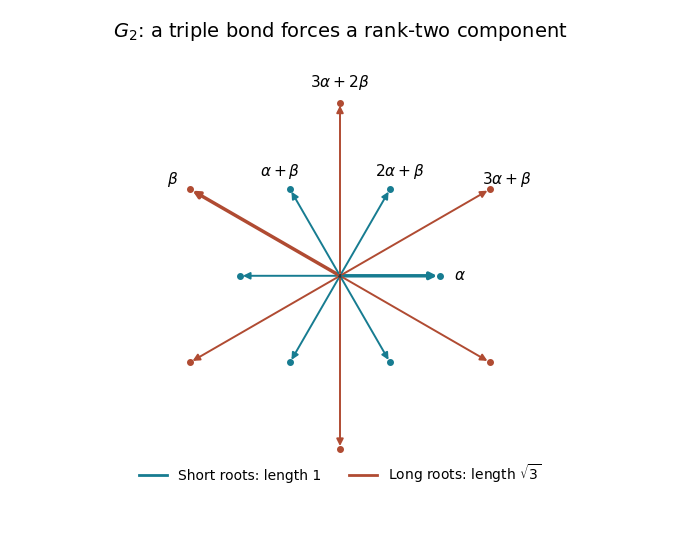

<h1 id="5/solution">Solution</h1>

↑ **Parent:** [5](../5.md)

An abstract [root system](../../../../../root-system.md), in the reduced crystallographic convention, is a finite subset $\Phi$ of a finite-dimensional real [Euclidean space](../../../../../euclidean-norm.md) $E$ satisfying the following conditions:

- $0\notin\Phi$ and $\Phi$ spans $E$.
- For each $\alpha\in\Phi$, $\Phi\cap\mathbb R\alpha=\{\alpha,-\alpha\}$; this is the reduced condition.
- The [root reflection](../../../../../root-reflection.md) $s_\alpha(v)=v-2(v,\alpha)\alpha/(\alpha,\alpha)$ preserves $\Phi$.
- Every [Cartan integer](../../../../../cartan-integer.md) $\langle\beta,\alpha^\vee\rangle=2(\beta,\alpha)/(\alpha,\alpha)$ is an integer.

The [root system](../../../../../root-system.md) is irreducible if it is not a union of two nonempty mutually orthogonal [root systems](../../../../../root-system.md). The integrality condition is essential for the finite angle list below; arbitrary finite reflection systems need not satisfy it.

**The possible angles are $0$, $\pi/6$, $\pi/4$, $\pi/3$, $\pi/2$, $2\pi/3$, $3\pi/4$, $5\pi/6$, and $\pi$.** For [roots](../../../../../root-of-a-root-system.md) $\alpha,\beta$, put

$$
a=\frac{2(\beta,\alpha)}{(\alpha,\alpha)},\qquad b=\frac{2(\alpha,\beta)}{(\beta,\beta)}.
$$

Both are [integers](../../../../../integer.md), they have the same sign when nonzero, and

$$
ab=4\cos^2\theta.
$$

If the [roots](../../../../../root-of-a-root-system.md) are linearly independent, strict [Cauchy-Schwarz inequality](../../../../../cauchy-schwarz-inequality.md) gives $0\le ab<4$. Hence $ab\in\{0,1,2,3\}$. These values give, respectively,

$$
\begin{array}{c|c|c}
ab&\theta&\text{ratio of squared lengths, larger to smaller}\\\hline
0&\pi/2&\text{unrestricted by this calculation}\\
1&\pi/3,\ 2\pi/3&1\\
2&\pi/4,\ 3\pi/4&2\\
3&\pi/6,\ 5\pi/6&3
\end{array}
$$

For the last column, the possible absolute pairs $(|a|,|b|)$ are $(1,1)$, $(1,2)$, and $(1,3)$, up to interchange, and $a/b=(\beta,\beta)/(\alpha,\alpha)$. Parallel [roots](../../../../../root-of-a-root-system.md) are equal or opposite by reducedness, giving $0$ or $\pi$. Thus the list is exhaustive, and the rank-two [root systems](../../../../../root-system.md) realize each nonparallel possibility.

Now suppose two [simple roots](../../../../../simple-root.md) $\alpha,\beta$ have angle $5\pi/6$. Distinct [simple roots](../../../../../simple-root.md) have nonpositive inner product. Here is a proof from their defining sign property: if $(\delta,\epsilon)>0$, then $s_\delta(\epsilon)=\epsilon-n\delta$ with a positive [Cartan integer](../../../../../cartan-integer.md) $n$. This would be a [root](../../../../../root-of-a-root-system.md) whose coefficients in the [root basis](../../../../../fundamental-system-of-a-root-system.md) include both a positive and a negative coefficient, which is impossible. Therefore, after normalizing the [simple roots](../../../../../simple-root.md) to unit length, any nonzero off-diagonal inner product is at most $-1/2$, by the angle list.

Let $u=\alpha/\|\alpha\|$, $v=\beta/\|\beta\|$, so $(u,v)=-\sqrt3/2$. If there were a third [simple root](../../../../../simple-root.md) with unit vector $w$, write $r=(u,w)\le0$ and $s=(v,w)\le0$. Independence of the [simple roots](../../../../../simple-root.md) makes their [Gram matrix](../../../../../gram-matrix.md) positive definite, so

$$
0<\det\begin{pmatrix}1&-\sqrt3/2&r\\-\sqrt3/2&1&s\\r&s&1\end{pmatrix}
=\frac14-r^2-s^2-\sqrt3rs.
$$

If either $r$ or $s$ were nonzero, its absolute value would be at least $1/2$. Since $rs\ge0$, the displayed determinant would then be nonpositive. Thus $r=s=0$. Every other [simple root](../../../../../simple-root.md) is orthogonal to both $\alpha$ and $\beta$: a [triple bond isolates a G2 component](../../../../../triple-bond-isolates-a-g2-component.md).

Indeed, the [root reflections](../../../../../root-reflection.md) in $\alpha,\beta$ preserve their plane and fix its orthogonal complement; the [root reflections](../../../../../root-reflection.md) in the other [simple roots](../../../../../simple-root.md) preserve that complement and fix the plane. The given facts that these reflections generate the [Weyl group](../../../../../weyl-group.md) and that every [root](../../../../../root-of-a-root-system.md) is [Weyl group](../../../../../weyl-group.md)-conjugate to a [simple root](../../../../../simple-root.md) imply that every [root](../../../../../root-of-a-root-system.md) lies entirely in one of those two orthogonal subspaces. If there were any other [simple root](../../../../../simple-root.md), this would make $\Phi$ reducible. Therefore irreducibility forces rank two.

Up to interchanging the [simple roots](../../../../../simple-root.md), take $\alpha$ short and $\beta$ long. The squared-length ratio is $3$. Choose a scale and orthonormal coordinates so that

$$
\alpha=(1,0),\qquad\beta=\left(-\frac32,\frac{\sqrt3}{2}\right).
$$

The [Cartan integers](../../../../../cartan-integer.md) are $\langle\beta,\alpha^\vee\rangle=-3$ and $\langle\alpha,\beta^\vee\rangle=-1$. In coefficient coordinates $m\alpha+n\beta$, the two [root reflections](../../../../../root-reflection.md) are

$$
s_\alpha(m,n)=(-m+3n,n),\qquad s_\beta(m,n)=(m,m-n).
$$

Their orbits of $\alpha$ and $\beta$ are, respectively,

$$
\{\pm\alpha,\pm(\alpha+\beta),\pm(2\alpha+\beta)\},\qquad
\{\pm\beta,\pm(3\alpha+\beta),\pm(3\alpha+2\beta)\}.
$$

These sets are closed under both displayed reflections; for example $s_\beta(\alpha)=\alpha+\beta$, $s_\alpha(\alpha+\beta)=2\alpha+\beta$, $s_\alpha(\beta)=3\alpha+\beta$, and $s_\beta(3\alpha+\beta)=3\alpha+2\beta$. The assumption that every [root](../../../../../root-of-a-root-system.md) is conjugate to a [simple root](../../../../../simple-root.md) now determines all twelve [roots](../../../../../root-of-a-root-system.md), with no further ones possible.

**[Figure 1](#5/image-the-twelve-g2-roots-with-the-six-positive-roots-labelled-and-the-simple-roots-emphasized). The twelve G2 roots, with the six positive roots labelled and the simple roots emphasized**.

For completeness, this twelve-element set really is a [root system](../../../../../root-system.md). It is finite, spans the plane, and is reduced. The six [short roots](../../../../../short-root.md) have length $1$ and directions spaced by $\pi/3$; the six [long roots](../../../../../long-root.md) have length $\sqrt3$ and interleaved directions, also spaced by $\pi/3$. Their mutual [Cartan integers](../../../../../cartan-integer.md) are integral: within either length class they are $0$, $\pm1$, or $\pm2$ as applicable, and between the two length classes they are $0$, $\pm1$, or $\pm3$. Closure under all [root reflections](../../../../../root-reflection.md) follows by conjugating the two simple reflections, since every listed [root](../../../../../root-of-a-root-system.md) lies in a simple-root orbit. The nonorthogonal [simple roots](../../../../../simple-root.md) make it irreducible. We have therefore proved existence as well as uniqueness, up to isometry and overall scale:

$$
\boxed{\text{The unique irreducible type is the }G_2\text{ root system}.}
$$

## ↑ Ancestors (10)

1. [5](../5.md)
2. [Paper 102](../../paper-102-split.md)
3. [Iii](../../split.md)
4. [2016](../../../split.md)
5. [Past exam of the mathematics course of the University of Cambridge](../../../../split.md)
6. [Mathematics course of the University of Cambridge](../../../../../mathematics-course-of-the-university-of-cambridge.md)
7. [Course of the University of Cambridge](../../../../../course-of-the-university-of-cambridge.md)
8. [University of Cambridge](../../../../../university-of-cambridge-split.md)
9. [List of universities](../../../../../list-of-universities.md)
10. [Codex Wiki](../../../../../split.md)
