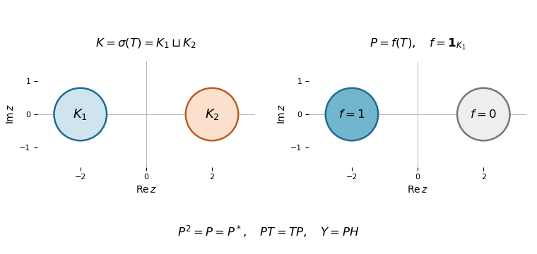

# Paper 106

↑ **Parent:** [Iii](../iii.md)

[https://www.maths.cam.ac.uk/postgrad/part-iii/files/pastpapers/2016/paper_106.pdf](https://www.maths.cam.ac.uk/postgrad/part-iii/files/pastpapers/2016/paper_106.pdf)

**Table of contents**

- [1](#1)
  - [Solution](#1/solution)
- [2](#2)
  - [Solution](#2/solution)
- [3](#3)
  - [Solution](#3/solution)
- [4](#4)
  - [Solution](#4/solution)
- [5](#5)
  - [i](#5/i)
    - [Solution](#5/i/solution)
  - [ii](#5/ii)
    - [Solution](#5/ii/solution)
  - [iii](#5/iii)
    - [Solution](#5/iii/solution)
  - [iv](#5/iv)
    - [Solution](#5/iv/solution)

## 1

↑ **Parent:** [Paper 106](paper-106.md)

<h3 id="1/solution">Solution</h3>

↑ **Parent:** [1](#1)

**Invertibility is stable under sufficiently small perturbations, and inversion is continuous.** Let $1$ be the identity of the complex unital [Banach algebra](../../../banach-algebra.md) $A$, with its submultiplicative [algebra norm](../../../banach-algebra.md#algebra-norm). For $\|h\|<1$, completeness makes the [Neumann series](../../../banach-algebra.md#neumann-series)

$$
(1-h)^{-1}=\sum_{n=0}^{\infty}h^n
$$

converge in $A$. Multiplying either side of the partial sums by $1-h$ gives $1-h^{N+1}$, which tends to $1$, proving that the sum is a two-sided inverse.

Fix $a\in G(A)$, the [group of invertible elements of a Banach algebra](../../../banach-algebra.md#group-of-invertible-elements-of-a-banach-algebra). If $\|b-a\|<\|a^{-1}\|^{-1}$, then

$$
b=a(1+a^{-1}(b-a)),\qquad \|a^{-1}(b-a)\|<1,
$$

so the [Neumann series](../../../banach-algebra.md#neumann-series) makes $b$ invertible. This proves that $G(A)$ is open. It also gives a local bound

$$
\|b^{-1}\|\le\frac{\|1\|\,\|a^{-1}\|}{1-\|a^{-1}\|\|b-a\|}.
$$

We retain $\|1\|$ here so the estimate does not silently assume a normalized identity. The inverse identity

$$
b^{-1}-a^{-1}=b^{-1}(a-b)a^{-1}
$$

then implies

$$
\|b^{-1}-a^{-1}\|\le\|b^{-1}\|\|b-a\|\|a^{-1}\|\longrightarrow0\quad(b\to a).
$$

This proves [continuity of inversion in a Banach algebra](../../../banach-algebra.md#continuity-of-inversion-in-a-banach-algebra).

For a unital [Banach algebra](../../../banach-algebra.md), the [spectrum of an element](../../../banach-algebra.md#spectrum-of-an-element) is

$$
\sigma_A(x)=\{\lambda\in\mathbb C:\lambda1-x\notin G(A)\}.
$$

For a nonunital [Banach algebra](../../../banach-algebra.md), use its [unitization of an algebra](../../../banach-algebra.md#unitization-of-an-algebra) $A^+=A\oplus\mathbb C$ with multiplication and norm

$$
(a,\lambda)(b,\mu)=(ab+\lambda b+\mu a,\lambda\mu),\qquad
\|(a,\lambda)\|=\|a\|+|\lambda|.
$$

It is a unital [Banach algebra](../../../banach-algebra.md), with identity $(0,1)$, and define $\sigma_A(x)=\sigma_{A^+}((x,0))$. In this nonunital convention, $0$ belongs to the [spectrum](../../../linear-operator-theory.md#spectrum-functional-analysis): the scalar coordinate of $(x,0)$ is zero, so it cannot be invertible in $A^+$.

**The spectrum is nonempty and compact.** It suffices to work in a nonzero unital [Banach algebra](../../../banach-algebra.md), since [unitization](../../../banach-algebra.md#unitization-of-an-algebra) reduces the other case to this one. The [group of invertible elements of a Banach algebra](../../../banach-algebra.md#group-of-invertible-elements-of-a-banach-algebra) is open, so the complement of the [spectrum of an element](../../../banach-algebra.md#spectrum-of-an-element) is open. For $|\lambda|>\|x\|$, the [Neumann series](../../../banach-algebra.md#neumann-series) gives

$$
R(\lambda)=(\lambda1-x)^{-1}=\frac1\lambda\sum_{n=0}^{\infty}\left(\frac{x}{\lambda}\right)^n,
\qquad
\|R(\lambda)\|\le\frac{\|1\|}{|\lambda|-\|x\|}.
$$

Thus $\sigma_A(x)$ is closed and lies in $\{\lambda:|\lambda|\le\|x\|\}$, hence is compact.

For [nonemptiness of the Banach-algebra spectrum](../../../banach-algebra.md#nonemptiness-of-the-banach-algebra-spectrum), suppose that $R$ were defined on all of $\mathbb C$. At any $\lambda_0$, factoring $\lambda1-x=(\lambda_01-x)(1+(\lambda-\lambda_0)R(\lambda_0))$ gives a locally convergent power series

$$
R(\lambda)=\sum_{n=0}^{\infty}(-1)^n(\lambda-\lambda_0)^nR(\lambda_0)^{n+1}.
$$

For every [bounded linear functional](../../../topological-vector-space.md#continuous-linear-functional) $\ell\in A^*$, the scalar function $\ell(R(\lambda))$ is therefore [entire](../../../complex-analysis.md#entire-function). The bound at infinity makes it bounded outside a disk, while continuity makes it bounded on the disk. By the [Liouville theorem](../../../complex-analysis.md#liouville-theorem), it is constant; since it tends to zero at infinity, it is identically zero. The version of the [Hahn-Banach theorem](../../../functional-analysis.md#hahn-banach-theorem) used here says that [bounded linear functionals](../../../topological-vector-space.md#continuous-linear-functional) separate points of a [normed vector space](../../../functional-analysis.md#normed-vector-space): if $z\ne0$, there is $\ell$ with $\ell(z)\ne0$. Consequently $R(\lambda)=0$ for every $\lambda$, contradicting $(\lambda1-x)R(\lambda)=1$. This proves the assertion.

**Every nonzero complex unital normed division algebra is algebraically and topologically isomorphic to $\mathbb C$.** This is the [Gelfand-Mazur theorem](../../../banach-algebra.md#gelfand-mazur-theorem); completeness is not needed in its statement. Let $D$ be a [normed division algebra](../../../algebra.md#normed-division-algebra), and take its [completion of a normed space](../../../functional-analysis.md#completion-of-a-normed-space) using the [algebra norm](../../../banach-algebra.md#algebra-norm) to obtain a unital [Banach algebra](../../../banach-algebra.md) $\widehat D$. Submultiplicativity extends multiplication continuously to the completion, and the original identity remains its identity.

For $x\in D$, the [spectrum of an element](../../../banach-algebra.md#spectrum-of-an-element) of $x$ in $\widehat D$ contains some $\lambda$. If $x-\lambda1\ne0$ in $D$, the division-algebra assumption supplies an inverse in $D$, which is still an inverse in $\widehat D$. This contradicts $\lambda\in\sigma_{\widehat D}(x)$. Therefore $x=\lambda1$. The map $\lambda\mapsto\lambda1$ is a bijective complex algebra homomorphism, and

$$
\|\lambda1\|=|\lambda|\|1\|.
$$

It and its inverse are continuous; when $\|1\|=1$, it is an [isometry](../../../riemannian-geometry.md#isometry).

**A complete algebra norm on a function algebra dominates the supremum norm, even before continuity of point evaluations is known.** Let $A$ be the given algebra of functions. Form the same artificial [unitization](../../../banach-algebra.md#unitization-of-an-algebra) $A^+$ even if $A$ already has an identity. For each $t\in K$, the algebraic map

$$
\chi_t:A^+\to\mathbb C,\qquad\chi_t(f,\lambda)=f(t)+\lambda
$$

is a unital multiplicative complex [linear functional](../../../linear-algebra.md#linear-functional). No continuity has been assumed. Since $\chi_t(f-f(t)1)=0$, the element $f-f(t)1$ cannot be invertible: applying $\chi_t$ to an inverse equation would give $0=1$. Hence $f(t)\in\sigma_{A^+}(f)$, and the [spectrum](../../../linear-operator-theory.md#spectrum-functional-analysis) bound already proved yields

$$
|f(t)|\le\|f\|\quad(t\in K).
$$

Taking the supremum proves the [supremum bound for a complete function-algebra norm](../../../banach-algebra.md#supremum-bound-for-a-complete-function-algebra-norm):

$$
\boxed{\sup_{t\in K}|f(t)|\le\|f\|.}
$$

In particular every $f$ is bounded, and every point evaluation is a [bounded linear functional](../../../topological-vector-space.md#continuous-linear-functional) of norm at most $1$. This is an instance of [automatic continuity of characters](../../../banach-algebra.md#automatic-continuity-of-characters): a [character of an algebra](../../../banach-algebra.md#character-of-an-algebra) on a [Banach algebra](../../../banach-algebra.md) is bounded because its value at any element belongs to that element's [spectrum](../../../linear-operator-theory.md#spectrum-functional-analysis).

## 2

↑ **Parent:** [Paper 106](paper-106.md)

<h3 id="2/solution">Solution</h3>

↑ **Parent:** [2](#2)

**For a convex subset of a Banach space, weak closure equals norm closure.** The [Mazur theorem](../../../hilbert-space.md#mazur-theorem) states that for every [convex set](../../../mathematical-optimization.md#convex-set) $C\subseteq X$,

$$
\overline C^{\,w}=\overline C^{\,\|\cdot\|}.
$$

Since every [bounded linear functional](../../../topological-vector-space.md#continuous-linear-functional) is norm-continuous, the [weak topology](../../../weak-topology.md) is weaker than the [norm topology](../../../functional-analysis.md#norm-topology), giving $\overline C^{\,\|\cdot\|}\subseteq\overline C^{\,w}$.

For the reverse inclusion, use this form of the [Hahn-Banach separation theorem](../../../functional-analysis.md#hahn-banach-separation-theorem): if $D$ is a nonempty norm-closed [convex set](../../../mathematical-optimization.md#convex-set) in a real [normed vector space](../../../functional-analysis.md#normed-vector-space) and $x\notin D$, there is a continuous real-linear functional $F$ such that

$$
F(x)>\sup_{d\in D}F(d).
$$

Apply it to $D=\overline C^{\,\|\cdot\|}$. In a complex [Banach space](../../../banach-space.md), use the underlying real space; every continuous real-linear $F$ is the real part of the complex [bounded linear functional](../../../topological-vector-space.md#continuous-linear-functional) $f(v)=F(v)-iF(iv)$. The separating strict inequality gives a neighbourhood open for the [weak topology](../../../weak-topology.md) of $x$ disjoint from $D$, so $x\notin\overline C^{\,w}$. The empty set case is immediate. This proves the [Mazur theorem](../../../hilbert-space.md#mazur-theorem).

**A weakly null sequence has disjoint convex blocks converging to zero in norm.** If $x_n\xrightarrow{w}0$, then for every starting index $m$,

$$
0\in\overline{\{x_i:i\ge m\}}^{\,w}\subseteq\overline{\operatorname{conv}\{x_i:i\ge m\}}^{\,w}.
$$

The [Mazur theorem](../../../hilbert-space.md#mazur-theorem) places $0$ in the norm closure of that tail [convex hull](../../../mathematical-optimization.md#convex-hull). Thus a finite [convex combination](../../../mathematical-optimization.md#convex-combination) of vectors from any tail can have norm less than any prescribed $\varepsilon>0$.

Choose the [convex blocks](../../../banach-space.md#convex-block) recursively. After selecting the previous terminal index $q_{n-1}$, let $p_n>q_{n-1}$, and choose a finite [convex combination](../../../mathematical-optimization.md#convex-combination) from $\{x_i:i\ge p_n\}$ with norm less than $2^{-n}$. Choose $q_n$ beyond its largest used index, padding the intervening coefficients and the final coefficient with zero. This ensures the printed strict condition $p_n<q_n$ as well as $q_n<p_{n+1}$. Setting unused coefficients to zero yields

$$
u_n=\sum_{i=p_n}^{q_n}a_i x_i,\qquad a_i\ge0,\qquad\sum_{i=p_n}^{q_n}a_i=1,\qquad\|u_n\|<2^{-n}.
$$

Therefore $u_n\to0$ in norm. The recursive tail selection is what makes these [convex blocks](../../../banach-space.md#convex-block), rather than merely unrelated [convex combinations](../../../mathematical-optimization.md#convex-combination).

Next suppose $X^*$ is separable and $(x_n)$ is bounded. Use the [canonical embedding into the bidual](../../../functional-analysis.md#canonical-embedding-into-the-bidual) $J_X:X\to X^{**}$, where $J_Xx(f)=f(x)$. If $\|x_n\|\le M$, then $J_Xx_n\in M B_{X^{**}}$. The [Banach-Alaoglu theorem](../../../functional-analysis.md#banach-alaoglu-theorem) makes this ball compact in $\sigma(X^{**},X^*)$, and [weak-star metrizability of the dual ball](../../../weak-topology.md#weak-star-metrizability-of-the-dual-ball) makes it metrizable because its predual $X^*$ is separable. A [compact space](../../../topology.md#compact-space) that is a [metric space](../../../topological-analysis.md#metric-space) is sequentially compact, so some subsequence $(y_n)$ satisfies

$$
J_Xy_n\xrightarrow{w^*}\phi\in X^{**}.
$$

The limit need not belong to $J_XX$; it is precisely the use of the [bidual space](../../../linear-algebra.md#bidual-of-a-normed-space) that supplies compactness without assuming reflexivity.

For a [convex block](../../../banach-space.md#convex-block) $u_n=\sum_{i=p_n}^{q_n}a_i y_i$, every $f\in X^*$ satisfies

$$
|f(u_n)-\phi(f)|\le\sum_{i=p_n}^{q_n}a_i|f(y_i)-\phi(f)|
\le\sup_{i\ge p_n}|f(y_i)-\phi(f)|\longrightarrow0.
$$

Both $f(y_n)$ and $f(u_n)$ tend to $\phi(f)$, so

$$
\boxed{y_n-u_n\xrightarrow{w}0.}
$$

This is the useful [convex-block cancellation of a weak-star limit](../../../banach-space.md#convex-block-cancellation-of-a-weak-star-limit); it does not require the limit to be a vector in $X$.

**The quotient sequence has approximate lifts in $3B_X$ that are weakly null after passing to a subsequence.** Let $q:X\to Z=X/Y$ be the [quotient map](../../../topology.md#quotient-map), with the [quotient norm](../../../banach-space.md#quotient-norm). Since $\|z_n\|\le1$, choose $v_n\in X$ such that

$$
q(v_n)=z_n,\qquad\|v_n\|<\frac32.
$$

This uses the infimum defining the [quotient norm](../../../banach-space.md#quotient-norm) and does not assume that it is attained. By the preceding compactness argument, pass to a subsequence $y_n=v_{k_n}$ with a common [weak-star](../../../weak-topology.md#weak-star-topology) limit in $X^{**}$. Its quotient images $q(y_n)=z_{k_n}$ form a [weakly null sequence](../../../weak-topology.md#weakly-null-sequence).

Apply the [convex block](../../../banach-space.md#convex-block) construction to $(q(y_n))$ in the [quotient Banach space](../../../banach-space.md#quotient-banach-space). Using the same coefficients on $(y_n)$ gives [convex blocks](../../../banach-space.md#convex-block)

$$
u_n=\sum_{i=p_n}^{q_n}a_i y_i,\qquad\|u_n\|<\frac32,\qquad\|q(u_n)\|\to0.
$$

Set $x_n=y_n-u_n$. The [convex-block cancellation of a weak-star limit](../../../banach-space.md#convex-block-cancellation-of-a-weak-star-limit) proves $x_n\xrightarrow{w}0$, while

$$
\|x_n\|\le\|y_n\|+\|u_n\|<3,\qquad
\|q(x_n)-z_{k_n}\|=\|q(u_n)\|\longrightarrow0.
$$

Thus the [approximate weakly null lifting through a quotient](../../../banach-space.md#approximate-weakly-null-lifting-through-a-quotient) is achieved with the required bound:

$$
\boxed{x_n\in3B_X,\quad x_n\xrightarrow{w}0,\quad\|q(x_n)-z_{k_n}\|\to0.}
$$

## 3

↑ **Parent:** [Paper 106](paper-106.md)

<h3 id="3/solution">Solution</h3>

↑ **Parent:** [3](#3)

The [Radon-Nikodym theorem](../../../measure-theory.md#radon-nikodym-theorem) for positive measures says: if $\mu$ and $\nu$ are [sigma-finite measures](../../../measure-theory.md#sigma-finite-measure) on the same [measurable space](../../../measure-theory.md#measurable-space), and $\nu$ is absolutely continuous with respect to $\mu$, then there is a nonnegative [measurable function](../../../measure-theory.md#measurable-function) $g$, unique $\mu$-almost everywhere, such that

$$
\nu(E)=\int_E g\,d\mu\qquad(E\text{ measurable}).
$$

Here [sigma-finiteness](../../../measure-theory.md#sigma-finite-measure) means that the space is a countable union of measurable sets of finite measure; [absolute continuity of measures](../../../measure-theory.md#absolute-continuity-of-measures), written $\nu\ll\mu$, means that $\mu(E)=0$ implies $\nu(E)=0$. The function $g=d\nu/d\mu$ is the [Radon-Nikodym derivative](../../../measure-theory.md#radon-nikodym-derivative). For a finite signed or [complex measure](../../../measure-theory.md#complex-measure) $\nu$ of finite [total variation norm of a measure](../../../measure-theory.md#total-variation-norm-of-a-measure), absolutely continuous with respect to a sigma-finite $\mu$, the corresponding density belongs to $L^1(\mu)$. This follows by applying the positive theorem to the positive and negative parts of the real and imaginary parts of $\nu$.

**For every measure space and $1<p<\infty$, $(L^p)^*$ is isometrically $L^q$, where $1/p+1/q=1$.** We use the complex-linear pairing

$$
\Phi_g(h)=\int_\Omega hg\,d\mu.
$$

With the convention $\int h\overline g$, the same identification is conjugate-linear in $g$. By [Hölder's inequality](../../../real-analysis.md#holder-s-inequality), $\Phi_g$ is a [bounded linear functional](../../../topological-vector-space.md#continuous-linear-functional) with $\|\Phi_g\|\le\|g\|_q$. If $g\ne0$, set

$$
h=\frac{\overline g\,|g|^{q-2}}{\|g\|_q^{q-1}},
$$

interpreting the numerator as zero where $g=0$. The identity $(q-1)p=q$ gives $\|h\|_p=1$ and $\Phi_g(h)=\|g\|_q$. Thus

$$
\boxed{\|\Phi_g\|=\|g\|_q.}
$$

It remains to represent an arbitrary $\Phi\in(L^p)^*$, rather than merely produce functionals from $L^q$.

We prove [Lp duality on an arbitrary measure space](../../../continuous-dual-space.md#lp-duality-on-an-arbitrary-measure-space) without imposing sigma-finiteness on $\mu$. Write $C=\|\Phi\|$. For every [measurable set](../../../measure-theory.md#measurable-set) $E$ with $\mu(E)<\infty$, define a [complex measure](../../../measure-theory.md#complex-measure) on $E$ by

$$
\nu_E(F)=\Phi(\mathbf1_F)\qquad(F\subseteq E\text{ measurable}).
$$

It is countably additive: for disjoint $F_j\subseteq E$, the partial sums of their [indicator functions](../../../measure-theory.md#indicator-function) tend in $L^p$ to $\mathbf1_{\bigcup F_j}$, because the measure of the omitted tail tends to zero. It is absolutely continuous with respect to $\mu|_E$, since [indicator functions](../../../measure-theory.md#indicator-function) of [null sets](../../../measure-theory.md#null-set) represent zero in $L^p$.

Its [total variation norm of a measure](../../../measure-theory.md#total-variation-norm-of-a-measure) is finite. For any finite measurable partition $E=\bigcup_j E_j$, choose scalars $c_j$ of modulus $1$ with $c_j\nu_E(E_j)=|\nu_E(E_j)|$. Then

$$
\sum_j|\nu_E(E_j)|=\Phi\left(\sum_jc_j\mathbf1_{E_j}\right)
\le C\left\|\sum_jc_j\mathbf1_{E_j}\right\|_p
=C\mu(E)^{1/p}.
$$

Taking the supremum over partitions gives the variation bound. Since $\mu|_E$ is finite, the [Radon-Nikodym theorem](../../../measure-theory.md#radon-nikodym-theorem) supplies $g_E\in L^1(E)$ with $\nu_E(F)=\int_F g_E\,d\mu$. By uniform approximation with [simple functions](../../../measure-theory.md#simple-function),

$$
\Phi(h)=\int_E hg_E\,d\mu
$$

for every bounded measurable $h$ supported in $E$.

To improve $g_E$ from $L^1$ to $L^q$, test with the bounded function

$$
h_N=\overline{g_E}|g_E|^{q-2}\mathbf1_{\{|g_E|\le N\}}\mathbf1_E.
$$

If $I_N=\int_{E\cap\{|g_E|\le N\}}|g_E|^q\,d\mu$, then

$$
I_N=\Phi(h_N)\le C\|h_N\|_p=C I_N^{1/p}.
$$

Thus $I_N^{1/q}\le C$ when $I_N>0$, and the same bound is trivial when it is zero. The [monotone convergence theorem](../../../measure-theory.md#monotone-convergence-theorem) gives

$$
\int_E|g_E|^q\,d\mu\le C^q.
$$

If $E,F$ both have finite measure, the densities $g_E,g_F$ agree almost everywhere on $E\cap F$: their integrals over every measurable subset of the intersection equal the same functional value. This is uniqueness in the [Radon-Nikodym theorem](../../../measure-theory.md#radon-nikodym-theorem).

We now perform [support localization of an Lp functional](../../../continuous-dual-space.md#support-localization-of-an-lp-functional). Set

$$
M=\sup_{\mu(E)<\infty}\int_E|g_E|^q\,d\mu\le C^q.
$$

Choose [finite-measure sets](../../../measure-theory.md#finite-measure-set) $E_n$ whose displayed integrals tend to $M$, and let $D_n=E_1\cup\cdots\cup E_n$, $S=\bigcup_nD_n$. If $M=0$, take $E_n=\varnothing$. Compatibility allows us to define a [measurable function](../../../measure-theory.md#measurable-function) $g$ on $S$ by taking $g_{D_n}$ on the disjoint [measurable sets](../../../measure-theory.md#measurable-set) $D_n\setminus D_{n-1}$, and put $g=0$ off $S$. It agrees almost everywhere with $g_{D_n}$ on every $D_n$. Moreover,

$$
\int_\Omega|g|^q\,d\mu=\lim_n\int_{D_n}|g_{D_n}|^q\,d\mu=M.
$$

Indeed each integral is at most $M$, and it is at least the integral over $E_n$, which tends to $M$.

For any [finite-measure set](../../../measure-theory.md#finite-measure-set) $F\subseteq\Omega\setminus S$, compatibility on the disjoint union $D_n\cup F$ gives

$$
\int_{D_n}|g_{D_n}|^q\,d\mu+\int_F|g_F|^q\,d\mu\le M.
$$

Letting $n\to\infty$ forces $g_F=0$ almost everywhere. For an arbitrary [finite-measure set](../../../measure-theory.md#finite-measure-set) $E$, compatibility on $E\cap D_n$ and the preceding conclusion on $E\setminus S$ show that $g_E=g$ almost everywhere on $E$. Consequently $\Phi(h)=\int hg\,d\mu$ for every [simple function](../../../measure-theory.md#simple-function) supported on a [finite-measure set](../../../measure-theory.md#finite-measure-set).

Those [simple functions](../../../measure-theory.md#simple-function) are dense in $L^p$ even for this arbitrary [measure space](../../../measure-theory.md#measure-space). To see the needed finite-support property, for $h\in L^p$ the sets $\{|h|>1/n\}$ have finite measure, bounded by $n^p\|h\|_p^p$. First truncate $h$ to such sets and to bounded values, then approximate by [simple functions](../../../measure-theory.md#simple-function); the discarded $L^p$ integral tends to zero. Continuity of $\Phi$ and [Hölder's inequality](../../../real-analysis.md#holder-s-inequality) therefore extend the representation to every $h\in L^p$.

We have constructed $g\in L^q$ with $\Phi=\Phi_g$, and the previously proved norm identity gives $\|g\|_q=\|\Phi\|$. It also proves uniqueness: if $\Phi_g=\Phi_{\widetilde g}$, then $\|g-\widetilde g\|_q=0$. This completes the isometric [duality of Lp spaces](../../../continuous-dual-space.md#duality-of-lp-spaces).

**The dominated sequence actually converges to zero in norm, and hence weakly.** The assumptions give $|f_n|^p\le|f|^p\in L^1$ and $|f_n|^p\to0$ almost everywhere. The [dominated convergence theorem](../../../measure-theory.md#dominated-convergence-theorem) yields

$$
\|f_n\|_p^p=\int|f_n|^p\,d\mu\longrightarrow0.
$$

For every $\Phi\in(L^p)^*$, $|\Phi(f_n)|\le\|\Phi\|\|f_n\|_p\to0$. Therefore

$$
\boxed{f_n\xrightarrow{w}0.}
$$

## 4

↑ **Parent:** [Paper 106](paper-106.md)

<h3 id="4/solution">Solution</h3>

↑ **Parent:** [4](#4)

The definitions in a unital [C-star algebra](../../../banach-algebra.md#c-star-algebra) are

$$
\boxed{\begin{array}{ll}
\text{hermitian:}&x^*=x,\\
\text{unitary:}&x^*x=xx^*=1,\\
\text{normal:}&x^*x=xx^*.
\end{array}}
$$

Thus a [Hermitian element of a C-star algebra](../../../banach-algebra.md#hermitian-element-of-a-c-star-algebra) is self-adjoint, a [Unitary element of a C-star algebra](../../../banach-algebra.md#unitary-element-of-a-c-star-algebra) has inverse $x^*$, and a [Normal element of a C-star algebra](../../../banach-algebra.md#normal-element-of-a-c-star-algebra) commutes with its adjoint. We derive the needed [C-star algebra](../../../banach-algebra.md#c-star-algebra) facts directly from $\|a^*a\|=\|a\|^2$, as required.

First $\|1\|=\|1\|^2$ gives $\|1\|=1$, and

$$
\|a\|^2=\|a^*a\|\le\|a^*\|\|a\|
$$

gives $\|a\|\le\|a^*\|$; applying the same argument to $a^*$ gives equality. Thus the involution is an [isometry](../../../riemannian-geometry.md#isometry). For a [Unitary element of a C-star algebra](../../../banach-algebra.md#unitary-element-of-a-c-star-algebra) $u$,

$$
\|u\|^2=\|u^*u\|=1,\qquad\|u^{-1}\|=\|u^*\|=1.
$$

The general [Banach algebra](../../../banach-algebra.md) [spectrum](../../../linear-operator-theory.md#spectrum-functional-analysis) bound gives $|\lambda|\le1$ for $\lambda\in\sigma(u)$. Such a $\lambda$ is nonzero, and the inverse [spectral mapping theorem](../../../mathematics.md#spectral-mapping-theorem) gives $\lambda^{-1}\in\sigma(u^{-1})$, so also $|\lambda|^{-1}\le1$. Hence

$$
\boxed{\sigma(u)\subseteq\mathbb T=\{z\in\mathbb C:|z|=1\}.}
$$

If $h=h^*$, the convergent [exponential series](../../../calculus.md#exponential-series) and the isometric involution give $(e^{ith})^*=e^{-ith}$. These commuting exponentials multiply to $1$, so $e^{ith}$ is unitary for real $t$. By the exponential [spectral mapping theorem](../../../mathematics.md#spectral-mapping-theorem), if $\lambda\in\sigma(h)$ then $e^{it\lambda}\in\sigma(e^{ith})\subseteq\mathbb T$. Taking $t=1$ gives $e^{-\operatorname{Im}\lambda}=1$, so

$$
\boxed{\sigma(h)\subseteq\mathbb R.}
$$

Only general [Banach algebra](../../../banach-algebra.md) [spectral mapping theorem](../../../mathematics.md#spectral-mapping-theorem) and the defining [C-star identity](../../../banach-algebra.md#c-star-identity) were used.

Now prove [spectral permanence for C-star algebras](../../../banach-algebra.md#spectral-permanence-for-c-star-algebras). Let $B\subseteq A$ be the norm-closed [C-star subalgebra](../../../banach-algebra.md#c-star-subalgebra) with the same identity. The algebraic inclusion always gives $\sigma_A(b)\subseteq\sigma_B(b)$. For $h=h^*\in B$, both [spectra](../../../linear-operator-theory.md#spectrum-functional-analysis) lie in $\mathbb R$. If $\lambda\notin\sigma_A(h)$, choose nonreal $\lambda_n\to\lambda$. Since $\sigma_B(h)\subseteq\mathbb R$, each $(\lambda_n1-h)^{-1}$ belongs to $B$. By [continuity of inversion in a Banach algebra](../../../banach-algebra.md#continuity-of-inversion-in-a-banach-algebra), these inverses converge in $A$ to $(\lambda1-h)^{-1}$, which belongs to $B$ because $B$ is closed. Thus $\lambda\notin\sigma_B(h)$, proving equality for hermitian elements.

For the requested normal $x\in B$, suppose $b=x-\lambda1$ is invertible in $A$. The element $b^*b$ is hermitian and invertible in $A$, so the equality just proved places $(b^*b)^{-1}$ in $B$. Consequently

$$
y=(b^*b)^{-1}b^*\in B,\qquad yb=1.
$$

Since $b$ already has a two-sided inverse in $A$, multiplying $yb=1$ by that inverse gives $y=b^{-1}$. Hence its inverse belongs to $B$, and

$$
\boxed{\sigma_B(x)=\sigma_A(x).}
$$

We need one more elementary consequence of the [C-star identity](../../../banach-algebra.md#c-star-identity): the [spectral radius norm equality for normal elements](../../../banach-algebra.md#spectral-radius-norm-equality-for-normal-elements). If $h=h^*$, then $\|h^2\|=\|h\|^2$. If $a$ is normal, commutativity of $a,a^*$ gives

$$
\|a^2\|^2=\|(a^*)^2a^2\|=\|(a^*a)^2\|=\|a^*a\|^2=\|a\|^4.
$$

Every power of $a$ is a [Normal element of a C-star algebra](../../../banach-algebra.md#normal-element-of-a-c-star-algebra). Induction gives $\|a^{2^n}\|=\|a\|^{2^n}$. The general [spectral radius formula](../../../analysis.md#spectral-radius-formula) therefore implies

$$
r(a)=\lim_{m\to\infty}\|a^m\|^{1/m}=\|a\|.
$$

**The continuous functional calculus is the unique unital $*$-homomorphism $C(K)\to\mathcal B(H)$ taking the coordinate function to $T$.** For [bounded linear operators](../../../topological-vector-space.md#continuous-linear-operator) on a [Hilbert space](../../../hilbert-space.md), the adjoint identity gives $\|S\|=\sup_{\|v\|=\|w\|=1}|\langle Sv,w\rangle|=\|S^*\|$. Therefore

$$
\|S\|^2=\sup_{\|v\|=1}\langle S^*Sv,v\rangle\le\|S^*S\|\le\|S^*\|\|S\|=\|S\|^2.
$$

This proves the [C-star identity](../../../banach-algebra.md#c-star-identity) for $\mathcal B(H)$ directly; completeness and submultiplicativity come from the operator norm. Let

$$
C=\overline{\{p(T,T^*):p\text{ a complex polynomial in two commuting variables}\}}^{\,\|\cdot\|}.
$$

Because $T$ is a [normal operator](../../../hilbert-space.md#normal-operator), this is a commutative unital [C-star algebra](../../../banach-algebra.md#c-star-algebra). Every element of $C$ is a [Normal element of a C-star algebra](../../../banach-algebra.md#normal-element-of-a-c-star-algebra), so the preceding norm identity says its [Gelfand transform](../../../banach-algebra.md#gelfand-representation) is isometric:

$$
\|\widehat a\|_\infty=\sup_{\chi\in\Delta(C)}|\chi(a)|=r_C(a)=\|a\|.
$$

Here $\Delta(C)$ is the compact [character space](../../../banach-algebra.md#character-space-of-an-algebra) from the general [Gelfand representation theorem](../../../banach-algebra.md#gelfand-representation-theorem) for commutative [Banach algebras](../../../banach-algebra.md).

Each [algebra character](../../../banach-algebra.md#character-of-an-algebra) preserves the involution. Indeed, write $a=h+ik$ with $h,k$ hermitian; $\chi(h)\in\sigma_C(h)\subseteq\mathbb R$ and similarly for $k$, so $\chi(a^*)=\overline{\chi(a)}$. Therefore the continuous map

$$
\Delta(C)\longrightarrow K,\qquad\chi\longmapsto\chi(T)
$$

is injective: its value determines $\chi(T^*)$ and hence its value on all the dense [polynomials](../../../polynomial.md). It is surjective because the general character description of the [spectrum](../../../linear-operator-theory.md#spectrum-functional-analysis) gives $\{\chi(T):\chi\in\Delta(C)\}=\sigma_C(T)$, and [spectral permanence for C-star algebras](../../../banach-algebra.md#spectral-permanence-for-c-star-algebras) identifies this with $\sigma_{\mathcal B(H)}(T)=K$. A [continuous function](../../../calculus.md#continuous-function) that is a bijection from a [compact space](../../../topology.md#compact-space) to a [Hausdorff space](../../../topology.md#hausdorff-space) is a [homeomorphism](../../../topology.md#homeomorphism), so we identify $\Delta(C)$ with $K$.

Under this identification, the [Gelfand transform](../../../banach-algebra.md#gelfand-representation) sends $T$ to $u(z)=z$ and $T^*$ to $\overline u$. Its image is an isometric, and therefore closed, unital self-adjoint subalgebra of $C(K)$. It separates points because it contains $u$. The complex [Stone-Weierstrass theorem](../../../functional-analysis.md#stone-weierstrass-theorem) makes the image dense, hence equal to all of $C(K)$. Inverting the [Gelfand transform](../../../banach-algebra.md#gelfand-representation) and including $C$ into $\mathcal B(H)$ gives

$$
\Phi:C(K)\longrightarrow\mathcal B(H),\qquad f\longmapsto f(T),
$$

an isometric unital [C-star homomorphism](../../../banach-algebra.md#c-star-homomorphism) with $u(T)=T$.

To prove uniqueness without assuming automatic continuity of [C-star homomorphisms](../../../banach-algebra.md#c-star-homomorphism), let $\Psi$ be any other such map. Since every $f\in C(K)$ is normal, $\Psi(f)$ is normal. A unital algebra homomorphism preserves inverses, so

$$
\sigma_{\mathcal B(H)}(\Psi(f))\subseteq\sigma_{C(K)}(f)=f(K).
$$

Using the normal-element norm identity yields $\|\Psi(f)\|=r(\Psi(f))\le\|f\|_\infty$. Thus $\Psi$ is contractive. It agrees with $\Phi$ on [polynomials](../../../polynomial.md) in $u,\overline u$, since both send them to the same [polynomials](../../../polynomial.md) in $T,T^*$. These [polynomials](../../../polynomial.md) are dense by the [Stone-Weierstrass theorem](../../../functional-analysis.md#stone-weierstrass-theorem), so continuity proves $\Psi=\Phi$. This establishes the [continuous functional calculus](../../../banach-algebra.md#continuous-functional-calculus) with no unproved theorem specific to [C-star algebras](../../../banach-algebra.md#c-star-algebra).

**A disconnected spectrum gives a nontrivial closed invariant subspace.** Write $K=K_1\sqcup K_2$ with $K_1,K_2$ nonempty and both open and closed in $K$. The [indicator function](../../../measure-theory.md#indicator-function) $f=\mathbf1_{K_1}$ is continuous on $K$, even though no such continuity is needed across the gap outside $K$. Let $P=f(T)$. The [continuous functional calculus](../../../banach-algebra.md#continuous-functional-calculus) gives

$$
P^2=P,\qquad P^*=P,\qquad PT=TP.
$$

Its isometry gives $\|P\|=1$ and $\|I-P\|=1$, so $P\ne0,I$. The [linear projection](../../../vector-space.md#projection-linear-algebra) has closed range $Y=PH=\ker(I-P)$. Its range is nonzero and proper, and $T(Px)=P(Tx)\in Y$ proves invariance. Since it also commutes with $T^*$, the same subspace is reducing. This proves [disconnected spectrum gives a reducing subspace](../../../banach-algebra.md#disconnected-spectrum-gives-a-reducing-subspace).

**[Figure 1](#4/image-a-disconnected-spectrum-and-its-continuous-indicator-which-produces-a-nontrivial-reducing-projection). A disconnected spectrum and its continuous indicator, which produces a nontrivial reducing projection**.

The figure can be realized without any [eigenvalues](../../../linear-operator-theory.md#eigenvalue): take $H=L^2(K,dA)$, where $dA$ is planar area on the two closed disks, and let $T$ multiply by $z$. Its adjoint multiplies by $\overline z$, so it is a [normal operator](../../../hilbert-space.md#normal-operator). An [eigenvector](../../../linear-operator-theory.md#eigenvector) for $\lambda$ would be supported on the area-zero singleton $\{\lambda\}$, hence would be zero in $L^2$. Outside $K$, multiplication by $1/(z-\lambda)$ is a bounded inverse to $T-\lambda I$. For $\lambda\in K$, normalized [indicator functions](../../../measure-theory.md#indicator-function) of $K\cap\{|z-\lambda|<\varepsilon\}$ have $\|(T-\lambda I)h\|\le\varepsilon$, excluding a bounded inverse. Thus its [spectrum](../../../linear-operator-theory.md#spectrum-functional-analysis) is exactly $K$. The [linear projection](../../../vector-space.md#projection-linear-algebra) in the figure multiplies by $\mathbf1_{K_1}$, and its range consists of functions supported on the left disk.

## 5

↑ **Parent:** [Paper 106](paper-106.md)

Use the [canonical embedding into the bidual](../../../functional-analysis.md#canonical-embedding-into-the-bidual) $J_Xx(f)=f(x)$. It is an [isometry](../../../riemannian-geometry.md#isometry) by the [Hahn-Banach theorem](../../../functional-analysis.md#hahn-banach-theorem). The [weak-star topology](../../../weak-topology.md#weak-star-topology) $\sigma(X^{**},X^*)$, restricted to $J_XX$, is exactly the [weak topology](../../../weak-topology.md) $\sigma(X,X^*)$: both are determined by the same scalar evaluations $f(x)$. Therefore if $K\subseteq X$ is a [weakly compact set](../../../weak-topology.md#weakly-compact-set), $J_XK$ is [compact](../../../topology.md#compact-space) in the Hausdorff [weak-star topology](../../../weak-topology.md#weak-star-topology) of $X^{**}$, and hence is closed for the [weak-star topology](../../../weak-topology.md#weak-star-topology). This explains the first assertion without treating the whole embedded space $J_XX$ as weak-star closed.

For a [bounded linear operator](../../../topological-vector-space.md#continuous-linear-operator) $T:X\to Y$, its [Banach-space adjoint](../../../continuous-dual-space.md#transpose-of-a-bounded-linear-operator) is

$$
T^*:Y^*\to X^*,\qquad T^*y^*=y^*\circ T.
$$

For each $x\in X$, the scalar evaluation $y^*\mapsto(T^*y^*)(x)=y^*(Tx)$ is weak-star continuous on $Y^*$. These are exactly the defining evaluations of the [weak-star topology](../../../weak-topology.md#weak-star-topology) on $X^*$, so $T^*$ is weak-star-to-weak-star continuous. Equivalently, if $y_\alpha^*\xrightarrow{w^*}y^*$, then $(T^*y_\alpha^*)(x)\to(T^*y^*)(x)$ for every $x$.

The [Goldstine theorem](../../../functional-analysis.md#goldstine-theorem) states that $J_X(B_X)$ is dense in $B_{X^{**}}$ for $\sigma(X^{**},X^*)$, where the balls are closed unit balls. The [Banach-Alaoglu theorem](../../../functional-analysis.md#banach-alaoglu-theorem) states that for any [normed vector space](../../../functional-analysis.md#normed-vector-space) $E$, the closed dual unit ball $B_{E^*}$ is compact for $\sigma(E^*,E)$. Neither assertion claims norm compactness or, in general, sequential compactness.

For the [weakly compact operator](../../../functional-analysis.md#weakly-compact-operator) equivalences below, identify $X$ and $Y$ with their canonical images only when stated. In particular, the range condition means $T^{**}(X^{**})\subseteq J_YY$. We shall prove $(i)\Longleftrightarrow(ii)$, $(ii)\Longrightarrow(iii)\Longrightarrow(iv)\Longrightarrow(ii)$. The key identities, obtained by evaluating on $y^*\in Y^*$, are

$$
T^{**}J_X=J_YT,\qquad
(T^{**}F)(y^*)=F(T^*y^*).
$$

<h3 id="5/i">i</h3>

↑ **Parent:** [5](#5)

<h4 id="5/i/solution">Solution</h4>

↑ **Parent:** [I](#5/i)

**Weak compactness forces the second adjoint to take values in $Y$.** Suppose $C=\overline{T(B_X)}^{\,\|\cdot\|}$ is weakly compact in $Y$. By the first observation, $J_YC$ is closed for the [weak-star topology](../../../weak-topology.md#weak-star-topology) in $Y^{**}$. The second adjoint $T^{**}:X^{**}\to Y^{**}$ is weak-star-to-weak-star continuous, by the adjoint-continuity argument applied to $T^*$.

Thus $(T^{**})^{-1}(J_YC)$ is closed for the [weak-star topology](../../../weak-topology.md#weak-star-topology) in $X^{**}$. The identity $T^{**}J_X=J_YT$ makes it contain $J_X(B_X)$. The [Goldstine theorem](../../../functional-analysis.md#goldstine-theorem) therefore gives

$$
T^{**}(B_{X^{**}})\subseteq J_YC\subseteq J_YY.
$$

Scaling any $F\in X^{**}$ into the closed unit ball proves

$$
\boxed{T^{**}(X^{**})\subseteq J_YY.}
$$

This is the forward direction of the [bidual characterization of weakly compact operators](../../../functional-analysis.md#bidual-characterization-of-weakly-compact-operators).

<h3 id="5/ii">ii</h3>

↑ **Parent:** [5](#5)

<h4 id="5/ii/solution">Solution</h4>

↑ **Parent:** [Ii](#5/ii)

**The bidual range condition implies both weak compactness and the stronger continuity of $T^*$.** First assume $T^{**}(X^{**})\subseteq J_YY$. The [Banach-Alaoglu theorem](../../../functional-analysis.md#banach-alaoglu-theorem) makes $B_{X^{**}}$ weak-star compact, and $T^{**}$ is weak-star continuous. Hence its image is compact for the [weak-star topology](../../../weak-topology.md#weak-star-topology) in $Y^{**}$. Because it lies in $J_YY$, it corresponds to a weakly compact subset $C\subseteq Y$ under $J_Y^{-1}$.

The identity $T^{**}J_X=J_YT$ gives $T(B_X)\subseteq C$. A [weakly compact set](../../../weak-topology.md#weakly-compact-set) in a [Hausdorff space](../../../topology.md#hausdorff-space) is closed for the [weak topology](../../../weak-topology.md), so $C$ is also norm-closed and contains the norm closure of $T(B_X)$. That closure is a [convex set](../../../mathematical-optimization.md#convex-set) closed in the [norm topology](../../../functional-analysis.md#norm-topology), hence weakly closed by the [Mazur theorem](../../../hilbert-space.md#mazur-theorem). It is therefore a weakly closed subset of the weakly compact $C$, and is a [weakly compact set](../../../weak-topology.md#weakly-compact-set). This proves $(ii)\Longrightarrow(i)$.

For $(ii)\Longrightarrow(iii)$, fix $F\in X^{**}$. By the range assumption there is $y_F\in Y$ with $T^{**}F=J_Yy_F$. For every $y^*\in Y^*$,

$$
F(T^*y^*)=(T^{**}F)(y^*)=y^*(y_F).
$$

The right side is a defining weak-star continuous evaluation on $Y^*$. Since the [weak topology](../../../weak-topology.md) on $X^*$ is determined by all $F\in X^{**}$, every scalar coordinate of $T^*$ for that topology is weak-star continuous. Therefore

$$
\boxed{T^*:(Y^*,w^*)\longrightarrow(X^*,w)\text{ is continuous}.}
$$

<h3 id="5/iii">iii</h3>

↑ **Parent:** [5](#5)

<h4 id="5/iii/solution">Solution</h4>

↑ **Parent:** [Iii](#5/iii)

**Weak-star-to-weak continuity of the adjoint implies its weak compactness.** By the [Banach-Alaoglu theorem](../../../functional-analysis.md#banach-alaoglu-theorem), $B_{Y^*}$ is compact for the [weak-star topology](../../../weak-topology.md#weak-star-topology). Under the assumed continuous map $T^*:(Y^*,w^*)\to(X^*,w)$, its image $T^*(B_{Y^*})$ is weakly compact in $X^*$.

This image is closed for the [weak topology](../../../weak-topology.md), and hence for the [norm topology](../../../functional-analysis.md#norm-topology), because the [weak topology](../../../weak-topology.md) is Hausdorff and weaker than the norm topology. Thus its norm closure is the same weakly compact set. By the definition of a [weakly compact operator](../../../functional-analysis.md#weakly-compact-operator), $T^*$ is weakly compact, proving $(iii)\Longrightarrow(iv)$.

<h3 id="5/iv">iv</h3>

↑ **Parent:** [5](#5)

<h4 id="5/iv/solution">Solution</h4>

↑ **Parent:** [Iv](#5/iv)

**Weak compactness of the adjoint forces weak compactness of the original operator.** Assume $T^*:Y^*\to X^*$ is weakly compact. Apply the already proved $(i)\Longrightarrow(ii)$ to this operator, rather than assuming the adjoint equivalence in advance. It gives

$$
T^{***}(Y^{***})\subseteq J_{X^*}(X^*).
$$

Take $\psi\in Y^{***}$ annihilating $J_YY$, so $\psi(J_Yy)=0$ for every $y\in Y$. Write $T^{***}\psi=J_{X^*}f$ for some $f\in X^*$. For every $x\in X$,

$$
f(x)=(J_{X^*}f)(J_Xx)=(T^{***}\psi)(J_Xx)
=\psi(T^{**}J_Xx)=\psi(J_YTx)=0.
$$

Hence $f=0$ and $T^{***}\psi=0$. It follows that

$$
\psi(T^{**}F)=0\qquad(F\in X^{**})
$$

for every $\psi$ annihilating $J_YY$.

The [vector subspace](../../../vector-space.md#vector-subspace) $J_YY$ is closed in the [norm topology](../../../functional-analysis.md#norm-topology) in $Y^{**}$ because $Y$ is complete and $J_Y$ is an [isometry](../../../riemannian-geometry.md#isometry). The [Hahn-Banach theorem](../../../functional-analysis.md#hahn-banach-theorem) says that any point outside a closed linear subspace can be separated from it by a [bounded linear functional](../../../topological-vector-space.md#continuous-linear-functional) vanishing on that subspace. Applying this in $Y^{**}$ shows that an element annihilated by all such $\psi\in Y^{***}$ must belong to $J_YY$. Therefore $T^{**}F\in J_YY$ for every $F$, proving $(iv)\Longrightarrow(ii)$. The reverse implications above now establish all four equivalences, including [weak compactness of an operator and its adjoint](../../../functional-analysis.md#weak-compactness-of-an-operator-and-its-adjoint):

$$
\boxed{T\text{ weakly compact}\ \Longleftrightarrow\ T^{**}(X^{**})\subseteq J_YY
\ \Longleftrightarrow\ T^*\text{ is }w^*\text{-to-}w\text{ continuous}
\ \Longleftrightarrow\ T^*\text{ weakly compact}.}
$$

Finally, if $X$ is a [reflexive Banach space](../../../functional-analysis.md#reflexive-banach-space), every $F\in X^{**}$ is $J_Xx$ for some $x$, and $T^{**}F=J_YTx\in J_YY$. If $Y$ is a [reflexive Banach space](../../../functional-analysis.md#reflexive-banach-space), $Y^{**}=J_YY$, so the same range condition holds automatically. In either case, $(ii)\Longrightarrow(i)$ proves

$$
\boxed{X\text{ or }Y\text{ reflexive}\quad\Longrightarrow\quad\text{every bounded }T:X\to Y\text{ is weakly compact}.}
$$

## ↑ Ancestors (8)

1. [Iii](../iii.md)
2. [2016](../../2016.md)
3. [Past exam of the mathematics course of the University of Cambridge](../../../past-exam-of-the-mathematics-course-of-the-university-of-cambridge.md)
4. [Mathematics course of the University of Cambridge](../../../university-of-cambridge.md#mathematics-course-of-the-university-of-cambridge)
5. [Course of the University of Cambridge](../../../university-of-cambridge.md#course-of-the-university-of-cambridge)
6. [University of Cambridge](../../../university-of-cambridge.md)
7. [List of universities](../../../README.md#list-of-universities)
8. [Codex Wiki](../../../README.md)
