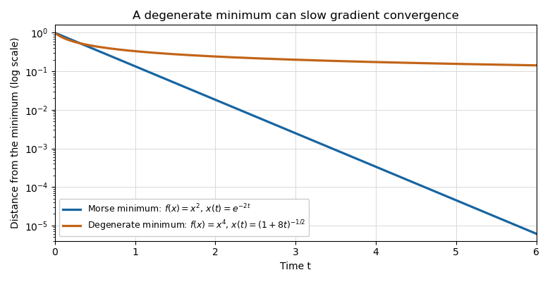

<h1 id="1/solution">Solution</h1>

↑ **Parent:** [1](../1.md)

Along the downward [gradient flow](../../../../../gradient-flow.md), the [gradient-flow dissipation identity](../../../../../gradient-flow-dissipation-identity.md), the [chain rule](../../../../../chain-rule.md) and the defining property of the [Riemannian gradient](../../../../../riemannian-gradient.md) give

$$
\frac{d}{dt}f(\gamma_x(t))=-\|\nabla f(\gamma_x(t))\|^2.
$$

A smooth [vector field](../../../../../vector-field.md) on a [compact manifold](../../../../../compact-manifold.md) is complete, so the trajectory exists for every $t\geq0$. In particular, its function value never increases.

If the trajectory is still in $C_{[a,b]}$ at time $t$, its monotone function value has stayed in $[a,b]$ throughout $[0,t]$. Consequently

$$
a\leq f(\gamma_x(t))=f(x)-\int_0^t\|\nabla f(\gamma_x(s))\|^2\,ds\leq b-\varepsilon^2t.
$$

Thus **a uniform exit bound** is

$$
\boxed{T=(b-a)/\varepsilon^2.}
$$

The trajectory is outside the closed band for every $t>T$. Once it leaves below level $a$, monotonicity prevents its return. The argument also covers the zero-width band $a=b$.

For the [total occupation-time bound for a gradient flow](../../../../../total-occupation-time-bound-for-a-gradient-flow.md), let $m=\min_M f$ and $F=\max_M f$, which exist by [compactness](../../../../../compact-space.md). For every $R>0$, the same [gradient flow](../../../../../gradient-flow.md) identity gives

$$
\varepsilon^2\int_0^R\mathbf1_{C_\varepsilon}(\gamma_x(t))\,dt
\leq\int_0^R\|\nabla f(\gamma_x(t))\|^2\,dt
=f(x)-f(\gamma_x(R))\leq F-m.
$$

Taking $R\to\infty$, by [monotone convergence theorem](../../../../../monotone-convergence-theorem.md), gives the **total occupation-time bound**

$$
\boxed{\int_0^\infty\mathbf1_{C_\varepsilon}(\gamma_x(t))\,dt\leq\frac{\max_M f-\min_M f}{\varepsilon^2}.}
$$

This allows arbitrarily many visits to $C_\varepsilon$; it bounds their total duration. Neither of these two estimates needs the [Morse function](../../../../../morse-function.md) hypothesis.

For [exponential convergence of a Morse gradient flow](../../../../../exponential-convergence-of-a-morse-gradient-flow.md), first observe that a limiting point $z=x_\infty$ is a [critical point](../../../../../critical-point.md). Indeed, writing $\phi_s$ for the flow and using continuous dependence on initial data,

$$
\phi_s(z)=\lim_{t\to\infty}\phi_s(\gamma_x(t))=\lim_{t\to\infty}\gamma_x(t+s)=z.
$$

Differentiation at $s=0$ gives $\nabla f(z)=0$.

We use the [Morse lemma](../../../../../morse-lemma.md): near a [nondegenerate critical point](../../../../../nondegenerate-critical-point.md) of [Morse index](../../../../../morse-index.md) $\lambda$, there are coordinates $(u,v)\in\mathbb R^\lambda\times\mathbb R^{n-\lambda}$ in which

$$
f(u,v)=f(z)-|u|^2+|v|^2.
$$

Choose a [Riemannian metric](../../../../../riemannian-metric.md) equal to the Euclidean metric on a smaller ball in these coordinates. Such a global [Riemannian metric](../../../../../riemannian-metric.md) exists by a [partition of unity](../../../../../partition-of-unity.md): patch this metric to any background metric outside a slightly larger ball. One can do this simultaneously at every [critical point](../../../../../critical-point.md), since a [Morse function](../../../../../morse-function.md) on a [compact manifold](../../../../../compact-manifold.md) has only finitely many [critical points](../../../../../critical-point.md). The metric is chosen before forming its [gradient flow](../../../../../gradient-flow.md); changing the metric can change trajectories.

For this metric, any trajectory converging to $z$ eventually remains in the smaller coordinate ball. From some time $t_0$ onward its equations are exactly

$$
\dot u=2u,\qquad\dot v=-2v.
$$

Convergence forces $u(t_0)=0$, and then

$$
u(t)=0,\qquad v(t)=e^{-2(t-t_0)}v(t_0),\qquad t\geq t_0.
$$

The straight radial segment stays in the coordinate ball, so its length bounds the [Riemannian distance](../../../../../riemannian-distance.md) from above:

$$
d(\gamma_x(t),z)\leq |v(t_0)|e^{-2(t-t_0)}.
$$

Increase $C$ beyond both $e^{2t_0}|v(t_0)|$ and $\max_{0\leq t\leq t_0}e^{2t}d(\gamma_x(t),z)$. Then the requested strict estimate holds for all $t\geq0$:

$$
\boxed{d(\gamma_x(t),x_\infty)<Ce^{-2t}.}
$$

This proof uses the [Morse lemma](../../../../../morse-lemma.md), existence and uniqueness for smooth [ordinary differential equations](../../../../../ordinary-differential-equation.md), continuous dependence on initial data, and the existence of a [partition of unity](../../../../../partition-of-unity.md). The expanding coordinates explain why convergence to a saddle occurs only along its [stable manifold](../../../../../stable-manifold.md).

For a counterexample, use an arc coordinate $x$ around a point of the circle, its flat local metric, and a globally smooth function that equals $x^4$ on this arc. Such a function can be made by a smooth cutoff, agreeing with a positive constant outside a larger arc. For $x_0>0$ sufficiently small the downward [gradient flow](../../../../../gradient-flow.md) remains in the arc and is

$$
\dot x=-4x^3,\qquad\boxed{x(t)=\frac{x_0}{\sqrt{1+8x_0^2t}}.}
$$

It converges to the degenerate [critical point](../../../../../critical-point.md) $0$, and its [Riemannian distance](../../../../../riemannian-distance.md) from $0$ is $x(t)$ for sufficiently large $t$. For every $k>0$, $e^{kt}x(t)\to\infty$, so no exponential bound is possible. This counterexample is on a [compact manifold](../../../../../compact-manifold.md) as well.

**[Figure 1](#1/image-exponential-decay-near-a-morse-minimum-and-algebraic-decay-near-a-degenerate-quartic-minimum-on-a-logarithmic-vertical-scale). Exponential decay near a Morse minimum and algebraic decay near a degenerate quartic minimum, on a logarithmic vertical scale**.

## ↑ Ancestors (10)

1. [1](../1.md)
2. [Paper 116](../../paper-116-split.md)
3. [Iii](../../split.md)
4. [2016](../../../split.md)
5. [Past exam of the mathematics course of the University of Cambridge](../../../../split.md)
6. [Mathematics course of the University of Cambridge](../../../../../mathematics-course-of-the-university-of-cambridge.md)
7. [Course of the University of Cambridge](../../../../../course-of-the-university-of-cambridge.md)
8. [University of Cambridge](../../../../../university-of-cambridge-split.md)
9. [List of universities](../../../../../list-of-universities.md)
10. [Codex Wiki](../../../../../split.md)
