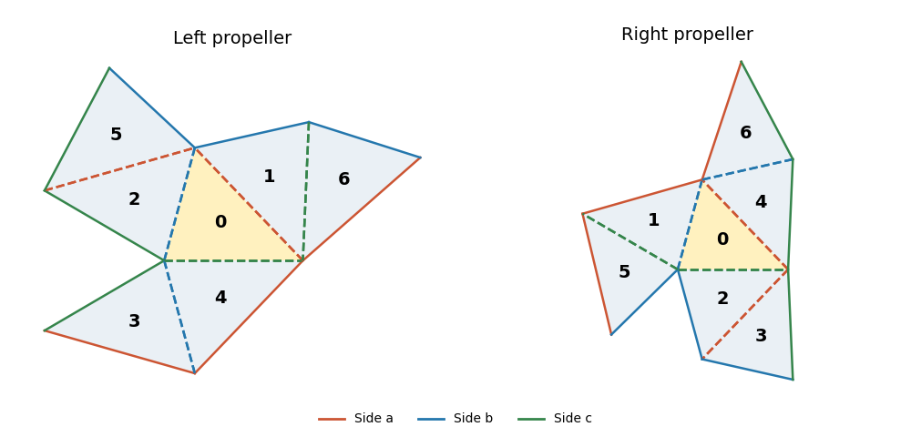

<h1 id="3/solution">Solution</h1>

↑ **Parent:** [3](../3.md)

A useful precise form of the [transplantation theorem](../../../../../transplantation-theorem.md) is as follows. Take $N$ congruent copies of a Euclidean tile with labelled flat faces. For each face colour $s$, encode the gluings by a symmetric signed permutation matrix $M_s$: a glued pair gives off-diagonal entries $+1$ in the two corresponding positions; an unglued face gives a diagonal entry $-1$ for a [Dirichlet boundary condition](../../../../../dirichlet-boundary-condition.md), or $+1$ for a [Neumann boundary condition](../../../../../neumann-boundary-condition.md). Corresponding face identifications must use the same maps in the tile coordinates. Suppose two assemblies have matrices $M_s$ and $M'_s$ and there is an invertible matrix $C$ with

$$
CM_s=M'_sC\qquad\text{for every face colour }s.
$$

Then, for every [eigenvalue](../../../../../eigenvalue.md) $\lambda$, $f=(f_1,\ldots,f_N)\mapsto Cf$ is an isomorphism between their [Laplacian eigenfunction](../../../../../laplacian-eigenfunction.md) spaces. **The two assemblies are isospectral, including multiplicities.**

To see why, pull every tile restriction back to the same Euclidean tile. A boundary value vector $u$ and an outward [normal derivative](../../../../../normal-derivative.md) vector $v$ satisfy

$$
M_su=u,\qquad M_sv=-v.
$$

At an internal face these are continuity of the function and equality of oppositely directed derivatives. At a diagonal $-1$ they impose $u_i=0$; at a diagonal $+1$ they impose $v_i=0$. The intertwining identities preserve both equations, and the Euclidean [Laplacian](../../../../../laplacian.md) commutes with constant linear combinations of tile functions. The resulting piecewise function is a weak [eigenfunction](../../../../../eigenfunction.md), with the prescribed [boundary conditions](../../../../../boundary-condition.md), and interior [elliptic regularity](../../../../../elliptic-regularity.md) makes it smooth wherever the assembled manifold is smooth. At polygonal corners one uses the usual weak domain of the [Dirichlet Laplacian](../../../../../dirichlet-laplacian.md) or [Neumann Laplacian](../../../../../neumann-laplacian.md), rather than assuming smoothness through a corner. The inverse matrix gives the inverse transplantation.

Here is a completely specified propeller pair. Label the seven triangles $0,\ldots,6$, with central triangle $0$, and colour the three sides $a,b,c$. In the left and right assemblies the internal-edge pairings are

$$
\begin{array}{c|c|c}
\text{colour}&L&R\\ \hline
a&(0,1),(2,5)&(0,4),(2,3)\\
b&(0,2),(4,3)&(0,1),(4,6)\\
c&(0,4),(1,6)&(0,2),(1,5).
\end{array}
$$

Every pair means reflection of one triangle across the indicated side; the other faces are external boundary. Each assembly has a central triangle and three two-triangle arms. These are the [propeller domains](../../../../../propeller-domains.md). The drawing uses one acute scalene triangle, and each colour always denotes the side opposite the same marked vertex of the starting triangle.

**[Figure 1](#3/image-two-seven-triangle-propeller-domains-with-the-same-side-colour-gluing-rules-and-different-arm-orientations). Two seven-triangle propeller domains with the same side-colour gluing rules and different arm orientations**.

Let $P_s,Q_s$ be the ordinary permutation matrices obtained by adding fixed points to the pairings. The following matrix supplies the [Neumann boundary condition](../../../../../neumann-boundary-condition.md) transplantation:

$$
N=\begin{pmatrix}
0&1&1&0&1&0&0\\
1&1&0&1&0&0&0\\
1&0&1&0&0&0&1\\
0&1&0&0&0&1&1\\
1&0&0&0&1&1&0\\
0&0&0&1&1&0&1\\
0&0&1&1&0&1&0
\end{pmatrix}.
$$

There is a short way to construct and check it. Start with the support $\{1,2,4\}$ in row $0$, and require the support in row $Q_s(i)$ to be $P_s$ applied to the support in row $i$. Traversing the six edges of the right-hand tree gives exactly the displayed rows; checking the remaining fixed-point relations verifies $NP_s=Q_sN$ for all three colours. Every row has three ones and every two different rows meet in exactly one column, so

$$
NN^{\mathsf T}=2I+J.
$$

The right-hand side has [eigenvalues](../../../../../eigenvalue.md) $9$ once and $2$ six times, proving $N$ is invertible, with $|\det N|=24$. Its incidence pattern is that of the [Fano plane](../../../../../fano-plane.md), which explains the uniform intersections.

For the [Dirichlet boundary condition](../../../../../dirichlet-boundary-condition.md), put $D=\operatorname{diag}(1,-1,-1,1,-1,1,1)$. In both assemblies this gives opposite signs to adjacent triangles. Thus their signed face matrices are $M_s=-DP_sD$ and $M'_s=-DQ_sD$: the off-diagonal gluing entries are positive and the unpaired diagonal entries are negative. The matrix

$$
\boxed{C=DND}
$$

then satisfies $CM_s=M'_sC$ and is invertible. The [transplantation theorem](../../../../../transplantation-theorem.md) proves equality of the [Dirichlet Laplacian](../../../../../dirichlet-laplacian.md) spectra; $N$ proves equality of the [Neumann Laplacian](../../../../../neumann-laplacian.md) spectra as well.

Finally vary the three labelled side lengths $(a,b,c)$ of the initial triangle in an open region of strict triangle inequalities, with an acute scalene shape sufficiently close to an equilateral triangle. Reflection constructs both domains continuously from these three independent real parameters. At the equilateral configuration the tiles have disjoint interiors. Choose a sufficiently small neighbourhood of that configuration with every triangle angle $\alpha_i$ in $(\pi/4,\pi/2)$. At each central vertex exactly four tile angles meet, forming a sector of angle $4\alpha_i<2\pi$, while nonincident pieces stay separated. Thus there is an open three-dimensional parameter region in which both assemblies are embedded planar domains.

For a scalene triangle in this region, the three central vertices are exactly the three reflex boundary vertices: their interior angles are $4\alpha_i$, while the other boundary vertices have angles $\alpha_i$ or $2\alpha_i<\pi$. Hence a planar [isometry](../../../../../isometry.md) of the domains must map the central triangle onto the central triangle. Put those two central triangles in the same position. Their unequal side lengths force any such [isometry](../../../../../isometry.md) to fix the central triangle pointwise. Yet the first arm across, for example, side $a$ attaches its outer triangle across colour $c$ in $L$, and across colour $b$ in $R$. These occupy different positions, so the identity does not identify the domains. An intrinsic [Riemannian isometry](../../../../../riemannian-isometry.md) between connected planar domains also restricts locally to a rigid Euclidean motion and hence is one globally. **The two propellers are nonisometric throughout this open three-parameter family.** Scaling is included as one of the parameters; modulo scaling the family has two parameters.

## ↑ Ancestors (10)

1. [3](../3.md)
2. [Paper 117](../../paper-117-split.md)
3. [Iii](../../split.md)
4. [2016](../../../split.md)
5. [Past exam of the mathematics course of the University of Cambridge](../../../../split.md)
6. [Mathematics course of the University of Cambridge](../../../../../mathematics-course-of-the-university-of-cambridge.md)
7. [Course of the University of Cambridge](../../../../../course-of-the-university-of-cambridge.md)
8. [University of Cambridge](../../../../../university-of-cambridge-split.md)
9. [List of universities](../../../../../list-of-universities.md)
10. [Codex Wiki](../../../../../split.md)
