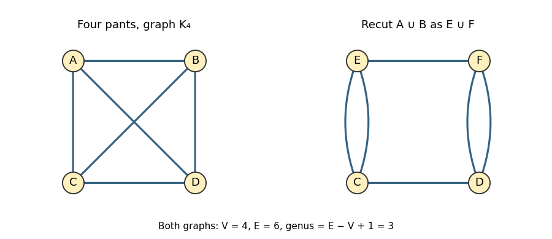

<h1 id="5/solution">Solution</h1>

↑ **Parent:** [5](../5.md)

Equip the closed [Riemann surface](../../../../../riemann-surfaces.md) with its uniformizing [hyperbolic metric](../../../../../hyperbolic-metric.md). This assumption matters: arbitrary metrics can have an annular region filled by parallel simple closed [geodesics](../../../../../geodesic.md). On a [hyperbolic surface](../../../../../hyperbolic-surface.md), a nontrivial free homotopy class has exactly one closed [geodesic](../../../../../geodesic.md), and a contractible closed [geodesic](../../../../../geodesic.md) cannot exist. Consequently distinct disjoint simple closed [geodesics](../../../../../geodesic.md) are essential and nonparallel.

Cut along $k$ such [geodesics](../../../../../geodesic.md). Every component has negative [Euler characteristic](../../../../../euler-characteristic.md), since disk and annulus components are excluded. If a component has genus $h$ and $b$ boundary components, its complexity is $3h-3+b$. This is nonnegative for the possible components, with equality precisely for a [pair of pants](../../../../../pair-of-pants-mathematics.md). Summing over the cut components gives

$$
\sum(3h-3+b)=3g-3-k.
$$

For completeness, if there are $n$ components, Euler additivity gives $\sum h=g+n-k-1$, while $\sum b=2k$, which proves the identity. Hence $k\leq3g-3$. If any component has positive complexity, it contains an essential nonperipheral simple closed curve. Its unique [geodesic](../../../../../geodesic.md) representative stays in that component and is disjoint from the existing boundary [geodesics](../../../../../geodesic.md), contradicting maximality. A maximal collection therefore cuts the surface into [pairs of pants](../../../../../pair-of-pants-mathematics.md) and has

$$
\boxed{k_{\max}=3g-3,\qquad\text{number of pants}=2g-2.}
$$

The second count follows because each [pair of pants](../../../../../pair-of-pants-mathematics.md) has [Euler characteristic](../../../../../euler-characteristic.md) $-1$. Conversely, any topological [pants decomposition](../../../../../pants-decomposition.md) can be straightened to its disjoint [geodesic](../../../../../geodesic.md) representatives, so this maximum is attained.

The [pants decomposition graph](../../../../../pants-decomposition-graph.md) has one vertex for each [pair of pants](../../../../../pair-of-pants-mathematics.md) and one edge for each glued cuff. Two cuffs on the same pant give a loop; multiple edges are allowed. It is connected and trivalent, with $V=2g-2$, $E=3g-3$ and first [Betti number](../../../../../betti-number.md) $E-V+1=g$. For genus three one possibility is the complete graph $K_4$. Another has vertices $C,D,E,F$, double edges $CE$ and $DF$, and single edges $CD$ and $EF$. These are nonisomorphic graphs: the second has multiple edges while $K_4$ has none.

**[Figure 2](#5/image-two-trivalent-pants-decomposition-graphs-of-genus-three-related-by-recutting-a-four-holed-sphere). Two trivalent pants decomposition graphs of genus three related by recutting a four-holed sphere**.

There is an explicit diffeomorphism between the represented surfaces. In the $K_4$ decomposition, unite the pants labelled $A,B$ across their shared cuff. This union is a four-holed sphere, whose exterior cuffs lead twice to $C$ and twice to $D$. Replace the interior cuff by a simple curve separating the two $C$ cuffs from the two $D$ cuffs. The new pants $E,F$ then have double adjacencies to $C,D$ respectively, while their shared cuff gives $EF$ and the untouched original cuff gives $CD$. This is an [elementary move of a pants decomposition](../../../../../elementary-move-of-a-pants-decomposition.md). We have simply recut the same oriented surface, so the identity on that surface is the desired [diffeomorphism](../../../../../diffeomorphism.md) between its two descriptions. The graphs do not make this evident because they record a chosen [pants decomposition](../../../../../pants-decomposition.md), which the [diffeomorphism](../../../../../diffeomorphism.md) need not preserve; they also omit all lengths and twists.

A hyperbolic [pair of pants](../../../../../pair-of-pants-mathematics.md) is uniquely determined up to [isometry](../../../../../isometry.md) by its three positive boundary lengths. Cutting along the three perpendicular seams yields two congruent right-angled hexagons, with alternating sides half the cuff lengths; hyperbolic hexagon identities determine the remaining sides. To recover the surface, choose each of the $3g-3$ cuff lengths $\ell_i>0$, and for each gluing choose the signed displacement $\tau_i$ between the seam feet. For a fixed marking and decomposition these are the [Fenchel–Nielsen coordinates](../../../../../fenchel-nielsen-coordinates.md):

$$
\boxed{(\ell_1,\ldots,\ell_{3g-3},\tau_1,\ldots,\tau_{3g-3})
\in(0,\infty)^{3g-3}\times\mathbb R^{3g-3}.}
$$

Unmarked gluing displacement at one cuff is periodic modulo $\ell_i$; the real lift of $\tau_i$ remembers the marking, and a full [Dehn twist](../../../../../dehn-twist.md) changes it by $\ell_i$. To classify unmarked surfaces globally, take the quotient by the [mapping class group](../../../../../mapping-class-group.md), allowing changes of [pants decomposition](../../../../../pants-decomposition.md) as well; if orientation is forgotten, use the extended [mapping class group](../../../../../mapping-class-group.md). Lengths alone do not determine the surface: the twists change the geometry of crossing [geodesics](../../../../../geodesic.md).

Fix an oriented reference surface $S_g$. Its [Teichmüller space](../../../../../teichmuller-space.md) $\mathcal T_g$ consists of pairs $(X,f)$, where $X$ is a [Riemann surface](../../../../../riemann-surfaces.md) and $f:S_g\to X$ is an orientation-preserving marking. Two pairs are equivalent when an orientation-preserving [biholomorphism](../../../../../biholomorphism.md) $h:X\to Y$ makes $h\circ f$ isotopic to the other marking. For $g\geq2$, the [uniformization theorem](../../../../../uniformization-theorem.md) identifies these with marked [hyperbolic metrics](../../../../../hyperbolic-metric.md). The space is a complex manifold of complex dimension $3g-3$, and [Fenchel–Nielsen coordinates](../../../../../fenchel-nielsen-coordinates.md) identify its underlying real manifold with $\mathbb R^{6g-6}$. For the analytic argument below, the essential property is that these are real-analytic coordinates and the length $\ell_\gamma(X)$ of every fixed closed curve class is a real-analytic function on [Teichmüller space](../../../../../teichmuller-space.md). The length and twist coordinates are not themselves holomorphic coordinates.

The [Wolpert generic spectral rigidity theorem](../../../../../wolpert-generic-spectral-rigidity-theorem.md) says that, for each $g\geq2$, there is a closed proper real-analytic subset $\mathcal E_g\subset\mathcal T_g$, of positive codimension, such that if $X\notin\mathcal E_g$ and $Y$ has the same [Laplace-Beltrami operator](../../../../../laplace-beltrami-operator.md) [spectrum](../../../../../spectrum-functional-analysis.md) as $X$, then $X,Y$ are isometric. Equivalently, a generic compact [hyperbolic surface](../../../../../hyperbolic-surface.md) is determined by its unmarked [length spectrum](../../../../../length-spectrum.md), with multiplicities. “Isometric” allows reversal of orientation: an unoriented [spectrum](../../../../../spectrum-functional-analysis.md) cannot distinguish a surface from its complex conjugate.

Two major proof steps explain both parts of this conclusion. First is the analytic reduction to finitely many possible spectral matchings locally. The [Selberg trace formula](../../../../../selberg-trace-formula.md) identifies the [Laplacian](../../../../../laplacian.md) [spectrum](../../../../../spectrum-functional-analysis.md) with the unmarked [length spectrum](../../../../../length-spectrum.md). A finite collection of marked length functions determines the length and twist parameters: include pants cuffs and enough transverse curves to determine each twist and its sign. For each assignment of those curves to lengths in a putative partner, the equalities of length functions are real-analytic equations. Uniform length cutoffs on a neighbourhood, bounded geometry of isospectral partners and the discreteness of the [length spectrum](../../../../../length-spectrum.md) give local finiteness of the possibilities; finite-length determination of the full spectrum allows the remaining conditions to be reduced to finitely many analytic equations. Thus this is a locally finite analytic problem, not an uncontrolled union of zero sets indexed by infinitely many arbitrary permutations. The role of this step is to put exceptional isospectral coincidences into real-analytic loci and ultimately to give a closed analytic exceptional set.

Second is the geometric recognition of the matchings that can persist on an open set. Such a matching produces identities between length functions as the length and twist parameters vary. Pinching a pants cuff makes its [hyperbolic collar](../../../../../hyperbolic-collar.md) wide: by the [collar lemma](../../../../../collar-lemma.md), any crossing curve acquires length tending to infinity, whereas disjoint curves can stay bounded. Varying cuffs and twists separately, together with the hyperbolic trace and hexagon identities for neighbouring pants, identifies which persistent matches preserve simple curves, disjointness and the gluing data. The resulting persistent transformation is induced by a [mapping class](../../../../../mapping-class.md), possibly with orientation reversal, and so it only gives an [isometry](../../../../../isometry.md) of the underlying surfaces. Every other local matching imposes a nonidentical real-analytic equation, whose zero set has positive codimension. Removing these proper exceptional loci proves generic rigidity. The geometric step is indispensable: analyticity alone would not exclude an entire open family of distinct surfaces with the same unmarked [length spectrum](../../../../../length-spectrum.md).

A related useful consequence is that a fixed [hyperbolic surface](../../../../../hyperbolic-surface.md) has only finitely many isometry classes of isospectral partners. The common [length spectrum](../../../../../length-spectrum.md) fixes the systole, so the partners lie in a compact thick part of moduli space. If distinct partners converged, choose local markings and a finite determining collection of curves. Their lengths converge, but belong to the same discrete [length spectrum](../../../../../length-spectrum.md), so eventually every one of these finitely many lengths is constant. The determining collection then forces the marked metrics to coincide, a contradiction. This compactness-and-discreteness argument proves finiteness; the additional geometric recognition step above is what strengthens it to the generic uniqueness asserted by [Wolpert's theorem](../../../../../wolpert-generic-spectral-rigidity-theorem.md).

## ↑ Ancestors (10)

1. [5](../5.md)
2. [Paper 117](../../paper-117-split.md)
3. [Iii](../../split.md)
4. [2016](../../../split.md)
5. [Past exam of the mathematics course of the University of Cambridge](../../../../split.md)
6. [Mathematics course of the University of Cambridge](../../../../../mathematics-course-of-the-university-of-cambridge.md)
7. [Course of the University of Cambridge](../../../../../course-of-the-university-of-cambridge.md)
8. [University of Cambridge](../../../../../university-of-cambridge-split.md)
9. [List of universities](../../../../../list-of-universities.md)
10. [Codex Wiki](../../../../../split.md)
