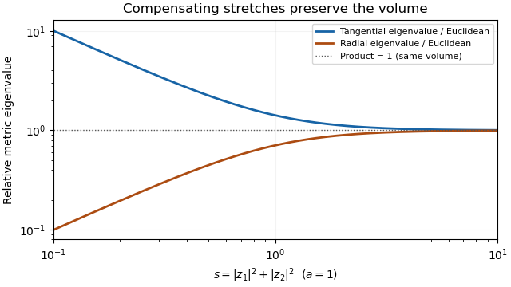

<h1 id="1/c/solution">Solution</h1>

↑ **Parent:** [C](../c.md)

Use a radial [geometric Kähler potential](../../../../../../kahler-potential-complex-geometry.md). Write $s=|z_1|^2+|z_2|^2$ and $y(s)=\varphi'(s)$. The coefficient [Hermitian matrix](../../../../../../hermitian-operator.md) of $i\partial\bar\partial\varphi(s)$ is

$$
G_{j\bar k}=y\delta_{jk}+y'\bar z_jz_k.
$$

Its [eigenvalues](../../../../../../eigenvalue.md) are $y$ in the complex tangential direction and $y+sy'$ in the complex radial direction. A [Kähler metric](../../../../../../kahler-metric.md) is positive precisely when both are positive. The standard form has coefficient [matrix](../../../../../../matrix.md) $\frac12 I$, so equality of the [Riemannian volume forms](../../../../../../riemannian-volume-form.md) is the condition

$$
y(y+sy')=\frac14.
$$

Indeed, the volume form is $\omega^2/2$ and its coefficient is proportional to $\det G$. Multiplying the determinant equation by $2s$ gives $(s^2y^2)'=s/2$, so we can take

$$
y(s)=\frac{\sqrt{s^2+a^2}}{2s}\qquad(a>0).
$$

An explicit antiderivative is

$$
\boxed{\varphi_a(s)=\frac12\left[\sqrt{s^2+a^2}+a\log\frac{s}{\sqrt{s^2+a^2}+a}\right],\qquad
\omega'=i\partial\bar\partial\varphi_a(s).}
$$

It is smooth for $s>0$. Its two [eigenvalues](../../../../../../eigenvalue.md) are

$$
\lambda_{\mathrm{tan}}=\frac{\sqrt{s^2+a^2}}{2s}>0,
\qquad
\lambda_{\mathrm{rad}}=\frac{s}{2\sqrt{s^2+a^2}}>0,
\qquad \lambda_{\mathrm{tan}}\lambda_{\mathrm{rad}}=\frac14.
$$

The form is real and closed because it is $i\partial\bar\partial$ of a real function, so it is a [Kähler metric](../../../../../../kahler-metric.md) on the punctured space. Since $a>0$, neither [eigenvalue](../../../../../../eigenvalue.md) equals $1/2$, and the metric differs from the Euclidean one. **The radial and tangential stretches compensate exactly, preserving the volume form:**

$$
\boxed{\frac{(\omega')^2}{2}=\frac{\omega^2}{2},\qquad \omega'\ne\omega.}
$$

This is a [radial Kähler metric with Euclidean volume in complex dimension two](../../../../../../radial-kahler-metric-with-euclidean-volume-in-complex-dimension-two.md).

**[Figure 1](#1/c/image-radial-and-tangential-metric-eigenvalues-relative-to-the-euclidean-metric-with-unchanged-volume). Radial and tangential metric eigenvalues relative to the Euclidean metric, with unchanged volume**.

## ↑ Ancestors (11)

1. [C](../c.md)
2. [1](../../1.md)
3. [Paper 118](../../../paper-118-split.md)
4. [Iii](../../../split.md)
5. [2016](../../../../split.md)
6. [Past exam of the mathematics course of the University of Cambridge](../../../../../split.md)
7. [Mathematics course of the University of Cambridge](../../../../../../mathematics-course-of-the-university-of-cambridge.md)
8. [Course of the University of Cambridge](../../../../../../course-of-the-university-of-cambridge.md)
9. [University of Cambridge](../../../../../../university-of-cambridge-split.md)
10. [List of universities](../../../../../../list-of-universities.md)
11. [Codex Wiki](../../../../../../split.md)
