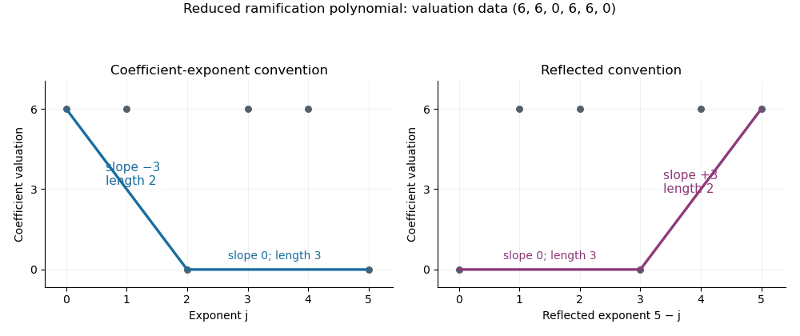

# Paper 123

↑ **Parent:** [Iii](../iii.md)

[https://www.maths.cam.ac.uk/postgrad/part-iii/files/pastpapers/2016/paper_123.pdf](https://www.maths.cam.ac.uk/postgrad/part-iii/files/pastpapers/2016/paper_123.pdf)

**Table of contents**

- [1](#1)
  - [Solution](#1/solution)
- [2](#2)
  - [a](#2/a)
    - [Solution](#2/a/solution)
  - [b](#2/b)
    - [Solution](#2/b/solution)
- [3](#3)
  - [a](#3/a)
    - [Solution](#3/a/solution)
  - [b](#3/b)
    - [Solution](#3/b/solution)
- [4](#4)
  - [Solution](#4/solution)

## 1

↑ **Parent:** [Paper 123](paper-123.md)

<h3 id="1/solution">Solution</h3>

↑ **Parent:** [1](#1)

Use the simple-root form of [Hensel lemma](../../../arithmetic.md#hensel-s-lemma): if $F\in\mathbb Z_p[T]$ and $t_0\in\mathbb Z_p$ satisfy $F(t_0)\equiv0\pmod p$ and $F'(t_0)\not\equiv0\pmod p$, there is a unique $t\in\mathbb Z_p$ with $F(t)=0$ and $t\equiv t_0\pmod p$. More generally the same assertion holds over a complete [discrete valuation ring](../../../commutative-algebra.md#discrete-valuation-ring), with its [maximal ideal](../../../commutative-algebra.md#maximal-ideal) in place of $(p)$.

Every nonzero [3-adic number](../../../arithmetic.md#3-adic-number) has a unique expression

$$
x=3^k\epsilon u,\qquad k\in\mathbb Z,\quad\epsilon\in\{1,-1\},\quad u\in U_1:=1+3\mathbb Z_3.
$$

Indeed its normalized [P-adic valuation](../../../number-theory.md#p-adic-valuation) fixes $k$, and its unit residue modulo three fixes $\epsilon$. Cubing is an automorphism on $\{1,-1\}$, so it remains to compute the cube map on the [principal units](../../../arithmetic.md#principal-unit).

For $t\in\mathbb Z_3$,

$$
(1+3t)^3=1+9\bigl(t+3t^2+3t^3\bigr).
$$

Thus $U_1^3\subseteq U_2:=1+9\mathbb Z_3$. Conversely, given $1+9a\in U_2$, apply [Hensel lemma](../../../arithmetic.md#hensel-s-lemma) to

$$
F(T)=T+3T^2+3T^3-a.
$$

Modulo three it is $T-a$, and $F'(T)=1+6T+9T^2$ is always a unit. The residue root $a\bmod3$ therefore lifts, giving $t$ with $(1+3t)^3=1+9a$. Hence

$$
\boxed{U_1^3=U_2.}
$$

This is the [cube map on 3-adic principal units](../../../arithmetic.md#cube-map-on-3-adic-principal-units). Introducing $T$ is essential: applying simple-root lifting directly to $X^3-u$ would fail because its derivative is divisible by three at every unit.

The map $1+3t\mapsto t\bmod3$ induces an isomorphism $U_1/U_2\cong(\mathbb Z/3\mathbb Z,+)$, since multiplication adds the first principal-unit digits modulo three. The [valuation](../../../algebra.md#valuation) factor contributes $\mathbb Z/3\mathbb Z$ independently, so the [cube-class group of the 3-adic numbers](../../../arithmetic.md#cube-class-group-of-the-3-adic-numbers) is

$$
\boxed{\mathbb Q_3^\times/(\mathbb Q_3^\times)^3\cong\mathbb Z/3\mathbb Z\times\mathbb Z/3\mathbb Z.}
$$

Explicit generators are the classes of $3$ and $4=1+3$. Representatives are $3^a4^b$ with $0\leq a,b<3$. The class of $3$ is detected by [valuation](../../../algebra.md#valuation) modulo three, and that of $4$ by its nonzero first principal-unit digit, so the two generators are independent.

## 2

↑ **Parent:** [Paper 123](paper-123.md)

<h3 id="2/a">a</h3>

↑ **Parent:** [2](#2)

<h4 id="2/a/solution">Solution</h4>

↑ **Parent:** [A](#2/a)

Normalize the [discrete valuation](../../../commutative-algebra.md#discrete-valuation) on $L$ by $v_L(L^\times)=\mathbb Z$, set $v_L(0)=+\infty$, and write $\mathcal O_L$ for its [valuation ring](../../../commutative-algebra.md#valuation-ring). For a finite [Galois extension](../../../galois-theory.md#finite-galois-extension) of [local fields](../../../arithmetic.md#local-field), define $G_{-1}=G=\operatorname{Gal}(L/K)$ and, for integers $i\geq0$,

$$
\boxed{G_i=\{\sigma\in G:v_L(\sigma(a)-a)\geq i+1\text{ for every }a\in\mathcal O_L\}.}
$$

Equivalently, $G_i$ is the kernel of the action on $\mathcal O_L/\mathfrak m_L^{i+1}$. These are the [lower ramification numbering](../../../arithmetic.md#lower-ramification-numbering) of the [ramification groups](../../../arithmetic.md#ramification-group). In particular, $G_0$ is the [inertia group](../../../arithmetic.md#inertia-group), the kernel of the action on the [residue field](../../../commutative-algebra.md#residue-field), and $G_1$ is the [wild inertia group](../../../arithmetic.md#wild-inertia-group). They form a decreasing sequence of [normal subgroups](../../../group-theory.md#normal-subgroup), eventually trivial.

For a real index $t\geq-1$, extend by $G_t=G_{\lceil t\rceil}$. Define the [Herbrand function](../../../arithmetic.md#herbrand-function) by

$$
\varphi_{L/K}(t)=\int_0^t\frac{ds}{[G_0:G_s]}\quad(t\geq0),\qquad\varphi_{L/K}(t)=t\quad(-1\leq t\leq0).
$$

It is continuous, strictly increasing and piecewise linear; denote its inverse by $\psi_{L/K}$. The [upper ramification numbering](../../../arithmetic.md#upper-ramification-numbering) is

$$
\boxed{G^u=G_{\psi_{L/K}(u)}\qquad(u\geq-1).}
$$

The definition includes the placement of the groups at break endpoints: the group at a break is the group before the drop. Lower numbering is compatible with subgroups; upper numbering is the one compatible with quotients. In a [totally ramified extension](../../../arithmetic.md#totally-ramified-extension), the [uniformizer criterion for lower ramification groups](../../../arithmetic.md#uniformizer-criterion-for-lower-ramification-groups) permits testing the defining [valuation](../../../algebra.md#valuation) inequality on one [uniformizer](../../../commutative-algebra.md#uniformizer) instead of on every integral element.

<h3 id="2/b">b</h3>

↑ **Parent:** [2](#2)

<h4 id="2/b/solution">Solution</h4>

↑ **Parent:** [B](#2/b)

Let $a=\sqrt[3]{3}$ and let $\zeta$ be a primitive cube root of unity. The [splitting field](../../../galois-theory.md#splitting-field) is $L=\mathbb Q_3(a,\zeta)$. The [polynomial](../../../polynomial.md) $X^3-3$ is an [Eisenstein polynomial](../../../arithmetic.md#eisenstein-polynomial), so $[\mathbb Q_3(a):\mathbb Q_3]=3$. Meanwhile $(1+2\zeta)^2=-3$ shows that $\mathbb Q_3(\zeta)$ is quadratic: $-3$ is not a square because its [valuation](../../../algebra.md#valuation) is odd. A quadratic field cannot lie in the degree-three field. Consequently $[L:\mathbb Q_3]=6$, and the action on the three roots identifies its [Galois group](../../../galois-theory.md#galois-group) with the [symmetric group](../../../finite-group-theory.md#symmetric-group) $S_3$.

A useful [uniformizer](../../../commutative-algebra.md#uniformizer) is

$$
\pi=\frac{\zeta-1}{a}.
$$

Since $(\zeta-1)^3=-3\zeta(\zeta-1)$, we obtain

$$
\pi^3=-\zeta(\zeta-1)=1+2\zeta,\qquad\pi^6=-3.
$$

Thus $\pi$ is a root of the [Eisenstein polynomial](../../../arithmetic.md#eisenstein-polynomial) $X^6+3$. Its degree is six, so $L=\mathbb Q_3(\pi)$, the extension is totally ramified, and $\pi$ is a [uniformizer](../../../commutative-algebra.md#uniformizer). With $v_L(\pi)=1$,

$$
v_L(3)=6,\qquad v_L(a)=2,\qquad v_L(\zeta-1)=3.
$$

This is the [Eisenstein sextic presentation of the splitting field of X3 minus 3 over Q3](../../../arithmetic.md#eisenstein-sextic-presentation-of-the-splitting-field-of-x3-minus-3-over-q3).

Let $\tau(a)=\zeta a$, $\tau(\zeta)=\zeta$, and let $s(a)=a$, $s(\zeta)=\zeta^{-1}$. Then $\tau$ has order three, $s$ has order two, and $s\tau s=\tau^{-1}$. Their actions on the [uniformizer](../../../commutative-algebra.md#uniformizer) are

$$
\tau(\pi)=\zeta^{-1}\pi,\qquad s(\pi)=-\zeta^{-1}\pi.
$$

The two nonidentity elements of $\langle\tau\rangle$ therefore satisfy

$$
v_L(\tau(\pi)-\pi)=v_L(\tau^2(\pi)-\pi)=1+v_L(\zeta-1)=4.
$$

Each transposition sends $\pi$ to $-\zeta^j\pi$ for some $j$, so its displacement has [valuation](../../../algebra.md#valuation) one: $1+\zeta^j$ is a unit, reducing to $2$ modulo the [maximal ideal](../../../commutative-algebra.md#maximal-ideal). The [uniformizer criterion for lower ramification groups](../../../arithmetic.md#uniformizer-criterion-for-lower-ramification-groups) now gives

$$
\boxed{G_{-1}=G_0=S_3,\qquad G_1=G_2=G_3=\langle\tau\rangle\cong C_3,\qquad G_i=1\ (i\geq4).}
$$

For real indices, this is $S_3$ on $[-1,0]$, $C_3$ on $(0,3]$, and $1$ for $t>3$. In particular the lower breaks are $0$ and $3$.

On $(0,3]$ the index $[G_0:G_t]$ is two; beyond three it is six. Thus the [Herbrand function](../../../arithmetic.md#herbrand-function) is

$$
\varphi(t)=\begin{cases}t,&-1\leq t\leq0,\\t/2,&0\leq t\leq3,\\3/2+(t-3)/6,&t\geq3.\end{cases}
$$

The positive lower break $3$ becomes the upper break $3/2$. Therefore

$$
\boxed{G^u=\begin{cases}S_3,&-1\leq u\leq0,\\C_3,&0<u\leq3/2,\\1,&u>3/2.\end{cases}}
$$

The fractional upper break is allowed because the full extension is nonabelian. As a check, the [different exponent from ramification groups](../../../arithmetic.md#different-exponent-from-ramification-groups) is $5+3\cdot2=11$. The derivative of the [minimal polynomial](../../../linear-operator-theory.md#minimal-polynomial) $X^6+3$ gives the same result: $v_L(6\pi^5)=6+5=11$. This is the $p=3$ case of [ramification groups of the splitting field of Xp minus p over the p-adic numbers](../../../arithmetic.md#ramification-groups-of-the-splitting-field-of-xp-minus-p-over-the-p-adic-numbers).

## 3

↑ **Parent:** [Paper 123](paper-123.md)

<h3 id="3/a">a</h3>

↑ **Parent:** [3](#3)

<h4 id="3/a/solution">Solution</h4>

↑ **Parent:** [A](#3/a)

Normalize $v_K$ by $v_K(\pi_K)=1$ and put $v_K(0)=+\infty$. Write $f(X)=\sum_{j=0}^d a_jX^j$, with $a_d=1$ and $a_0\ne0$. In the usual coefficient-exponent convention, the [Newton polygon](../../../arithmetic.md#newton-polygon) $N_K(f)$ is the lower boundary of the [convex hull](../../../mathematical-optimization.md#convex-hull) of the upward vertical rays starting at

$$
\boxed{(j,v_K(a_j))\qquad(0\leq j\leq d,\ a_j\ne0).}
$$

It runs from $(0,v_K(a_0))$ to $(d,0)$, with nondecreasing slopes from left to right. Zero coefficients contribute no finite point. Equivalently it is the largest convex piecewise-linear function lying below all these coefficient points.

The [Newton polygon root valuation theorem](../../../arithmetic.md#newton-polygon-root-valuation-theorem) says that a segment of slope $s$ and horizontal length $r$ accounts for exactly $r$ roots of [valuation](../../../algebra.md#valuation) $-s$, counted with multiplicity, using the extended [valuation](../../../algebra.md#valuation) on an [algebraic closure](../../../algebra.md#algebraic-closure). The nonzero constant coefficient excludes a zero root.

For a short justification, use the [weighted Gauss valuation](../../../algebra.md#weighted-gauss-valuation) $w_t(P)=\min_j(v(c_j)+jt)$ for $P=\sum c_jX^j$. It is multiplicative: after scaling $X$ by an element of [valuation](../../../algebra.md#valuation) $t$ in a valued extension, the initial nonzero residue polynomials multiply without vanishing. Rational $t$ suffice. Factoring a monic [polynomial](../../../polynomial.md) into linear factors gives $w_t(f)=\sum_r\min(t,v(r))$. This supporting-line function changes derivative at precisely the root [valuations](../../../algebra.md#valuation); its derivative drops count their multiplicities. Supporting lines to the lower polygon have slope $-t$, proving the sign and horizontal-length assertion.

**Slope convention for part (b).** Reflecting the horizontal axis, by plotting $(d-j,v_K(a_j))$, produces the [reflected Newton polygon convention](../../../arithmetic.md#reflected-newton-polygon-convention); its slopes are the root [valuations](../../../algebra.md#valuation) themselves. Part (b)'s wording with $m$ instead of $-m$ is correct under this positive-root-[valuation](../../../algebra.md#valuation) convention. The proof below gives both forms explicitly, so the result does not depend on silently changing the sign.

<h3 id="3/b">b</h3>

↑ **Parent:** [3](#3)

<h4 id="3/b/solution">Solution</h4>

↑ **Parent:** [B](#3/b)

The denominator is $\pi^nX$; dividing by $X$ removes the zero at $X=0$. A [uniformizer](../../../commutative-algebra.md#uniformizer) of a degree-$n$ totally ramified extension generates the field: its [valuation](../../../algebra.md#valuation) over $K$ is $1/n$, so $K(\pi)/K$ already has ramification index at least $n$. Hence $K(\pi)=L$, its [minimal polynomial](../../../linear-operator-theory.md#minimal-polynomial) has degree $n$, and its conjugates are the distinct $\sigma(\pi)$ for $\sigma\in G$.

Factor the [minimal polynomial](../../../linear-operator-theory.md#minimal-polynomial) over $L$. The [reduced ramification polynomial](../../../arithmetic.md#reduced-ramification-polynomial) is

$$
g(X)=\frac{f(\pi(1+X))}{\pi^nX}=\prod_{\sigma\ne1}\left(X-\frac{\sigma(\pi)-\pi}{\pi}\right).
$$

Every displayed root $r_\sigma=(\sigma(\pi)-\pi)/\pi$ is nonzero and integral, since two [uniformizers](../../../commutative-algebra.md#uniformizer) have a difference of [valuation](../../../algebra.md#valuation) at least one. Thus $g$ is monic of degree $n-1$, has nonzero constant coefficient, and belongs to $\mathcal O_L[X]$. For $n=1$ it is the constant [polynomial](../../../polynomial.md) $1$, with no slopes and no ramification jumps.

Here is also a justification of the [uniformizer criterion for lower ramification groups](../../../arithmetic.md#uniformizer-criterion-for-lower-ramification-groups) in this setting. The powers $1,\pi,\ldots,\pi^{n-1}$ are a $K$-basis. In an expansion $x=\sum a_j\pi^j$, the nonzero terms have [valuations](../../../algebra.md#valuation) $nv_K(a_j)+j$, distinct modulo $n$; therefore there is no cancellation at the least [valuation](../../../algebra.md#valuation). If $x$ is integral, all those values are nonnegative, which forces $a_j\in\mathcal O_K$. Thus $\mathcal O_L=\mathcal O_K[\pi]$. For $j\geq1$, $\sigma(\pi)^j-\pi^j$ is divisible by $\sigma(\pi)-\pi$, with the remaining factor integral. Consequently every $\sigma(x)-x$ has [valuation](../../../algebra.md#valuation) at least $v_L(\sigma(\pi)-\pi)$, and equality is attained at $x=\pi$.

For a nonidentity automorphism, write $i(\sigma)=v_L(\sigma(\pi)-\pi)$. By the defining inequality for the [lower ramification numbering](../../../arithmetic.md#lower-ramification-numbering),

$$
\sigma\in G_m\setminus G_{m+1}\quad\Longleftrightarrow\quad i(\sigma)=m+1\quad\Longleftrightarrow\quad v_L(r_\sigma)=m.
$$

The [Newton polygon root valuation theorem](../../../arithmetic.md#newton-polygon-root-valuation-theorem) therefore proves the [ramification breaks from a reduced ramification polygon](../../../arithmetic.md#ramification-breaks-from-a-reduced-ramification-polygon) relation:

$$
\boxed{-m\text{ is a slope of the coefficient-exponent }N_L(g)\quad\Longleftrightarrow\quad G_m\ne G_{m+1}.}
$$

The segment's horizontal length is exactly $|G_m|-|G_{m+1}|$. Equivalently, in the [reflected Newton polygon convention](../../../arithmetic.md#reflected-newton-polygon-convention) required for a positive-slope formulation,

$$
\boxed{m\text{ is a slope of the reflected }N_L(g)\quad\Longleftrightarrow\quad G_m\ne G_{m+1}.}
$$

All occurring root [valuations](../../../algebra.md#valuation) are nonnegative integers. For negative indices, extend $G_m=G$; total ramification means that there are no negative-index jumps, so the reflected formulation remains true for all integers.

The sign distinction is substantive. Using the [uniformizer](../../../commutative-algebra.md#uniformizer) from question 2, whose [minimal polynomial](../../../linear-operator-theory.md#minimal-polynomial) is $X^6+3$, gives

$$
g(X)=\frac{(1+X)^6-1}{X}=6+15X+20X^2+15X^3+6X^4+X^5.
$$

Its coefficient [valuations](../../../algebra.md#valuation) are $(6,6,0,6,6,0)$, because $v_L(3)=6$. The usual lower hull has vertices $(0,6),(2,0),(5,0)$ and slopes $-3,0$, of lengths $2,3$. These correspond exactly to the drops $|G_3|-|G_4|=2$ and $|G_0|-|G_1|=3$. With the reflected axis the slopes are $0,3$, as in the printed positive-$m$ wording. If the coefficient-exponent definition is used throughout, the printed assertion needs the minus sign shown above.

**[Figure 1](#3/b/image-coefficient-exponent-and-reflected-newton-polygons-of-the-reduced-ramification-polynomial). Coefficient-exponent and reflected Newton polygons of the reduced ramification polynomial**.

## 4

↑ **Parent:** [Paper 123](paper-123.md)

<h3 id="4/solution">Solution</h3>

↑ **Parent:** [4](#4)

Let $K=\mathbb Q(\sqrt{-31})$. Its [ring of integers of a quadratic field](../../../algebraic-number-theory.md#ring-of-integers-of-a-quadratic-field) is $\mathbb Z[(1+\sqrt{-31})/2]$, and its fundamental [field discriminant](../../../algebraic-number-theory.md#field-discriminant) is $-31$.

First compute the [class number](../../../algebraic-number-theory.md#class-number). The [ideal-form correspondence for imaginary quadratic fields](../../../algebraic-number-theory.md#ideal-form-correspondence-for-imaginary-quadratic-fields) identifies the ideal classes with proper equivalence classes of primitive positive definite [binary quadratic forms](../../../number-theory.md#binary-quadratic-form) of discriminant $-31$. Each has a unique [reduced positive definite binary quadratic form](../../../number-theory.md#reduced-positive-definite-binary-quadratic-form) representative under the convention $|b|\leq a\leq c$, with $b\geq0$ when $|b|=a$ or $a=c$. From $31=4ac-b^2\geq3a^2$ we get $1\leq a\leq\sqrt{31/3}<4$. Checking these three possible leading coefficients gives exactly

$$
[1,1,8],\qquad[2,1,4],\qquad[2,-1,4].
$$

For $a=3$, neither odd residue choice $b=\pm1,\pm3$ makes $(b^2+31)/12$ integral. The listed forms are primitive and satisfy the reduction convention, so

$$
\boxed{h_K=3,\qquad\operatorname{Cl}(K)\cong C_3.}
$$

This computes the [ideal class group of Q of square root minus thirty-one](../../../algebraic-number-theory.md#ideal-class-group-of-q-of-square-root-minus-thirty-one).

Now take a root $\theta$ of $F(T)=T^3+T-1$, and let $H$ be its splitting field over $\mathbb Q$. There is no rational root: the only candidates are $\pm1$, and neither vanishes. Thus the cubic is irreducible. Its [polynomial discriminant](../../../galois-theory.md#polynomial-discriminant) is

$$
\operatorname{disc}(F)=-4-27=-31.
$$

Since this is nonsquare, the [Galois group of an irreducible cubic](../../../galois-theory.md#galois-group-of-an-irreducible-cubic) is $S_3$. Its quadratic subfield is $K$: the product of pairwise root differences squares to $-31$ and changes sign under odd permutations. Thus $H/K$ is cyclic of degree three, and $H=K(\theta)$. Indeed the cubic field and $K$ have coprime degrees, so their compositum already has the full splitting-field degree six. The squarefree [polynomial discriminant](../../../galois-theory.md#polynomial-discriminant) also shows, by the [discriminant-index formula for an integral lattice](../../../algebraic-number-theory.md#discriminant-index-formula-for-an-integral-lattice), that $\mathbb Z[\theta]$ is the full integer ring of the cubic field.

It remains to prove that $H/K$ is unramified everywhere. At any rational prime $\ell\ne31$, the reduction of $F$ is separable. Over a finite residue extension in which it splits, all residue roots are simple and lift by [Hensel lemma](../../../arithmetic.md#hensel-s-lemma) to the corresponding [unramified extension](../../../arithmetic.md#unramified-extension) of $\mathbb Q_\ell$. Therefore the local splitting field is unramified over $\mathbb Q_\ell$, and its extension over a completion of $K$ is unramified as well.

At the only possible ramified prime, direct reduction gives

$$
F(T)\equiv(T-17)^2(T-28)\pmod{31},\qquad F'(28)\equiv28\not\equiv0\pmod{31}.
$$

The simple root lifts to $r\in\mathbb Q_{31}$. Write $F(T)=(T-r)Q(T)$, with $Q$ monic quadratic over $\mathbb Q_{31}$. The discriminant product formula gives

$$
\operatorname{disc}(F)=\operatorname{disc}(Q)\,Q(r)^2.
$$

Here $Q(r)=F'(r)$ is a unit, so the [quadratic discriminant](../../../polynomial.md#quadratic-discriminant) has square class $-31$. Hence the entire local splitting field is

$$
\mathbb Q_{31}(\sqrt{\operatorname{disc}(Q)})=\mathbb Q_{31}(\sqrt{-31})=K_{31}.
$$

It is quadratic over $\mathbb Q_{31}$, but its extension over the completion of $K$ is trivial. Thus the prime over $31$ splits completely in $H/K$; in particular it is not ramified there. This is the local splitting-field argument behind an [unramified cyclic cubic extension from a prime-discriminant cubic](../../../algebraic-number-theory.md#unramified-cyclic-cubic-extension-from-a-prime-discriminant-cubic). There are no real places of the imaginary quadratic field $K$, so no infinite-place ramification remains to check.

The [Hilbert class field](../../../algebraic-number-theory.md#hilbert-class-field) theorem identifies the maximal everywhere unramified abelian extension with an extension of degree $h_K$. Our cyclic [unramified extension](../../../arithmetic.md#unramified-extension) already has that degree, so it must be the whole [Hilbert class field](../../../algebraic-number-theory.md#hilbert-class-field). Therefore

$$
\boxed{H_K=\mathbb Q(\sqrt{-31},\theta),\qquad\theta^3+\theta-1=0.}
$$

Equivalently, it is the splitting field of $T^3+T-1$, of degree six over $\mathbb Q$ and degree three over $K$. Replacing $\theta$ by $\theta^{-1}$ gives the alternative defining cubic $T^3-T^2-1$. This is the [Hilbert class field of Q of square root minus thirty-one](../../../algebraic-number-theory.md#hilbert-class-field-of-q-of-square-root-minus-thirty-one).

## ↑ Ancestors (8)

1. [Iii](../iii.md)
2. [2016](../../2016.md)
3. [Past exam of the mathematics course of the University of Cambridge](../../../past-exam-of-the-mathematics-course-of-the-university-of-cambridge.md)
4. [Mathematics course of the University of Cambridge](../../../university-of-cambridge.md#mathematics-course-of-the-university-of-cambridge)
5. [Course of the University of Cambridge](../../../university-of-cambridge.md#course-of-the-university-of-cambridge)
6. [University of Cambridge](../../../university-of-cambridge.md)
7. [List of universities](../../../README.md#list-of-universities)
8. [Codex Wiki](../../../README.md)
