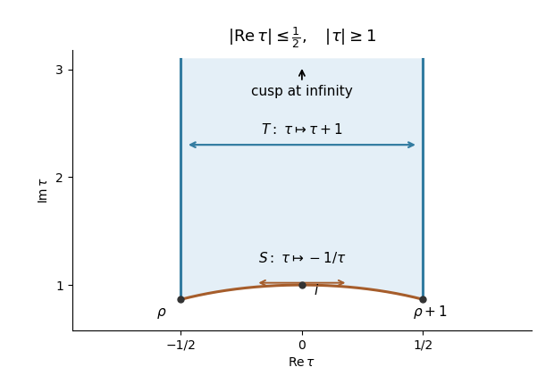

# Paper 126

↑ **Parent:** [Iii](../iii.md)

[https://www.maths.cam.ac.uk/postgrad/part-iii/files/pastpapers/2016/paper_126.pdf](https://www.maths.cam.ac.uk/postgrad/part-iii/files/pastpapers/2016/paper_126.pdf)

**Table of contents**

- [1](#1)
  - [Solution](#1/solution)
- [2](#2)
  - [Solution](#2/solution)
- [3](#3)
  - [Solution](#3/solution)
- [4](#4)
  - [Solution](#4/solution)
- [5](#5)
  - [i](#5/i)
    - [Solution](#5/i/solution)
  - [ii](#5/ii)
    - [Solution](#5/ii/solution)

## 1

↑ **Parent:** [Paper 126](paper-126.md)

<h3 id="1/solution">Solution</h3>

↑ **Parent:** [1](#1)

Write the [period lattice](../../../complex-analysis.md#period-lattice) as $\Lambda=\mathbb Z\omega_1+\mathbb Z\omega_2$, with $\omega_1,\omega_2$ real-linearly independent and $\operatorname{Im}(\omega_2/\omega_1)>0$. A [meromorphic function](../../../isolated-singularity.md#meromorphic-function) $f$ is an [elliptic function](../../../complex-analysis.md#elliptic-function) for this lattice if $f(z+\lambda)=f(z)$ for every $\lambda\in\Lambda$. If it has no [poles](../../../isolated-singularity.md#pole), it is an [entire function](../../../complex-analysis.md#entire-function) bounded on the closure of a [fundamental parallelogram](../../../complex-analysis.md#fundamental-parallelogram-of-a-period-lattice). Periodicity makes it bounded on all of $\mathbb C$, so the [Liouville theorem](../../../complex-analysis.md#liouville-theorem) proves that **an elliptic function without poles is constant**.

Here are the two contour identities needed for counting its zeros and their sum. Choose a positively oriented [fundamental parallelogram](../../../complex-analysis.md#fundamental-parallelogram-of-a-period-lattice) $P$ whose boundary avoids all zeros and [poles](../../../isolated-singularity.md#pole), and put $h=f'/f$. The [argument principle](../../../complex-analysis.md#argument-principle) gives

$$
N-P_f=\frac1{2\pi i}\int_{\partial P}h(z)\,dz=0,
$$

because $h$ is periodic and opposite edges cancel. Here $N,P_f$ count zeros and [poles](../../../isolated-singularity.md#pole) with multiplicity. For the weighted integral, let $J_i$ be the integral of $h$ along the edge from a vertex $c$ to $c+\omega_i$. Translating the opposite edges gives

$$
\frac1{2\pi i}\int_{\partial P}z h(z)\,dz
=\frac{\omega_1J_2-\omega_2J_1}{2\pi i}.
$$

The endpoint values of $f$ agree along either edge. A continuous logarithm along the edge therefore changes by $2\pi i n_i$, with $n_i\in\mathbb Z$, and $J_i=2\pi i n_i$. On the other hand, the [residue theorem](../../../analysis.md#residue-theorem) evaluates the left side as the sum of the zero positions minus the sum of the pole positions, both with multiplicity. Thus the [elliptic divisor-sum identity](../../../complex-analysis.md#elliptic-divisor-sum-identity) is

$$
\sum_j r_jz_j-\sum_l m_lp_l=\omega_1n_2-\omega_2n_1\in\Lambda.
$$

Under the stated pole hypothesis there is just one pole class, represented by zero, of order $m$. Consequently

$$
\boxed{N=m,\qquad\sum_j r_jz_j\equiv0\pmod\Lambda.}
$$

Changing representatives of the zero classes changes their weighted sum by an element of $\Lambda$, so the congruence is well defined.

The [Weierstrass elliptic function](../../../complex-analysis.md#weierstrass-elliptic-function) is

$$
\wp_\Lambda(z)=\frac1{z^2}+\sum_{0\ne\omega\in\Lambda}
\left(\frac1{(z-\omega)^2}-\frac1{\omega^2}\right).
$$

On a bounded set of $z$, the summand is $O(|\omega|^{-3})$ for large $|\omega|$. The lattice sum of $|\omega|^{-3}$ converges in real dimension two, proving [Normal convergence of the Weierstrass elliptic-function series](../../../complex-analysis.md#normal-convergence-of-the-weierstrass-elliptic-function-series) on compact sets away from $\Lambda$. Hence $\wp$ is a [holomorphic function](../../../complex-analysis.md#holomorphic-function) there, and at zero its principal part is $z^{-2}$, so it has a double pole. Replacing $\omega$ by $-\omega$ shows that $\wp$ is even. Differentiating the normally convergent series gives

$$
\wp'(z)=-2\sum_{\omega\in\Lambda}(z-\omega)^{-3},
$$

whose absolute convergence permits reindexing by any $\lambda\in\Lambda$. Thus $\wp'$ is periodic and $\wp(z+\lambda)-\wp(z)$ is constant. Substituting $-z-\lambda$ for $z$ and using evenness changes that constant to its negative, so it is zero. This proves that $\wp$ is an [elliptic function](../../../complex-analysis.md#elliptic-function), with double [poles](../../../isolated-singularity.md#pole) precisely at the lattice points.

The preceding zero count applied to $\wp-a$ says that it has exactly two zeros modulo $\Lambda$, counted with multiplicity. Evenness pairs any zero $z$ with $-z$. If these are distinct classes they must both be simple. If they coincide, $2z\in\Lambda$, and locally $\wp(z+t)=\wp(z-t)$: the zero has even order, which the total count forces to be two. In particular such a zero cannot be a lattice point, where $\wp$ has a pole. **Every finite fibre of the Weierstrass function consists of two opposite simple points or one double nonzero half-period point.**

To obtain the rational representation, first consider an even [elliptic function](../../../complex-analysis.md#elliptic-function) $g$. The preceding description proves that $\wp:\mathbb C/\Lambda\to\mathbb P^1$ has exactly the fibres $\{z,-z\}$, so $g$ defines a function $A$ of $w=\wp(z)$. Away from the branch values a local inverse of $\wp$ makes $A$ [meromorphic](../../../isolated-singularity.md#meromorphic-function). At a half-period $z_0$, the local expansion is $w-w_0=c t^2+O(t^4)$, with $c\ne0$ because the zero has order exactly two. The Laurent series of $g(z_0+t)$ contains only even powers, and $t^2$ is a holomorphic local coordinate as a function of $w-w_0$. Thus $A$ is [meromorphic](../../../isolated-singularity.md#meromorphic-function) at that value too. At zero the same argument uses $1/w=t^2+O(t^6)$, proving meromorphy at infinity. A [meromorphic function](../../../isolated-singularity.md#meromorphic-function) on the [Riemann sphere](../../../complex-analysis.md#riemann-sphere) is a [rational function](../../../isolated-singularity.md#rational-function): subtract its finitely many principal parts and use compactness to make the remainder constant. This proves that [even elliptic functions are rational in the Weierstrass function](../../../complex-analysis.md#even-elliptic-functions-are-rational-in-the-weierstrass-function).

For an arbitrary [elliptic function](../../../complex-analysis.md#elliptic-function), split $f=f_++f_-$, where $f_\pm(z)=(f(z)\pm f(-z))/2$. The even part is $A(\wp)$. Since $\wp'$ is odd and not identically zero, $f_-/\wp'$ is an even [meromorphic](../../../isolated-singularity.md#meromorphic-function) [elliptic function](../../../complex-analysis.md#elliptic-function), including at the zeros of $\wp'$ where the quotient may have [poles](../../../isolated-singularity.md#pole). It is therefore $B(\wp)$ for a [rational function](../../../isolated-singularity.md#rational-function) $B$. The [elliptic function-field decomposition](../../../complex-analysis.md#elliptic-function-field-decomposition) is

$$
\boxed{f(z)=A(\wp(z))+B(\wp(z))\wp'(z),\qquad A,B\in\mathbb C(w).}
$$

The representation is unique: its even and odd parts determine $A$ and $B$, and $\wp$ takes every value on the [Riemann sphere](../../../complex-analysis.md#riemann-sphere).

## 2

↑ **Parent:** [Paper 126](paper-126.md)

<h3 id="2/solution">Solution</h3>

↑ **Parent:** [2](#2)

A weight-$k$ [modular form](../../../modular-function.md#modular-form) for $\Gamma=SL_2(\mathbb Z)$ is a [holomorphic function](../../../complex-analysis.md#holomorphic-function) $f$ on the [complex upper half-plane](../../../complex-analysis.md#upper-half-plane-complex-analysis) satisfying

$$
f\left(\frac{a\tau+b}{c\tau+d}\right)=(c\tau+d)^kf(\tau)
\qquad\left(\begin{pmatrix}a&b\\c&d\end{pmatrix}\in\Gamma\right),
$$

and [holomorphic at a cusp](../../../modular-function.md#holomorphic-at-a-cusp). Since the full [modular group](../../../modular-function.md#modular-group) has one cusp class, this last condition means that the period-one function has a convergent expansion $f(\tau)=\sum_{n\geq0}a_nq^n$, $q=e^{2\pi i\tau}$, near infinity. A [cusp form](../../../modular-function.md#cusp-form) has $a_0=0$. The element $-I$ makes a nonzero weight odd form impossible.

For weight zero, $f$ descends to a [holomorphic function](../../../complex-analysis.md#holomorphic-function) on the quotient of the [complex upper half-plane](../../../complex-analysis.md#upper-half-plane-complex-analysis) by the [modular group](../../../modular-function.md#modular-group). At an elliptic fixed point, invariance under its finite stabilizer makes the local Taylor series a series in the quotient coordinate. At the cusp, the $q$ expansion extends it over $q=0$. The [standard fundamental domain of the modular group](../../../modular-function.md#standard-fundamental-domain-of-the-modular-group), with its boundary identified and its cusp added, is a compact [Riemann surface](../../../complex-analysis.md#riemann-surfaces), the [compactified modular curve](../../../modular-function.md#compactified-modular-curve) $X(1)$. The [maximum modulus principle](../../../complex-analysis.md#maximum-modulus-principle) now proves

$$
\boxed{M_0(SL_2(\mathbb Z))=\mathbb C.}
$$

Holomorphy at the cusp is essential to this conclusion.

**[Figure 1](#2/image-the-standard-modular-fundamental-domain-with-paired-vertical-boundaries-paired-circular-arcs-and-the-added-cusp-at-infinity). The standard modular fundamental domain with paired vertical boundaries, paired circular arcs, and the added cusp at infinity**.

For positive even $k\geq4$, define the unnormalized [Eisenstein series](../../../modular-function.md#eisenstein-series)

$$
G_k(\tau)=\sum_{(m,n)\in\mathbb Z^2\setminus\{(0,0)\}}(m\tau+n)^{-k}.
$$

The real-linear map $(m,n)\mapsto m\tau+n$ is invertible, and on a compact subset of the [complex upper half-plane](../../../complex-analysis.md#upper-half-plane-complex-analysis) its norm is uniformly comparable to $\sqrt{m^2+n^2}$. Thus the sum converges absolutely and locally uniformly for $k>2$, proving [holomorphy](../../../complex-analysis.md#holomorphic-function). For $\gamma=\left(\begin{smallmatrix}a&b\\c&d\end{smallmatrix}\right)$,

$$
m\gamma\tau+n=\frac{(ma+nc)\tau+(mb+nd)}{c\tau+d}.
$$

The map $(m,n)\mapsto(ma+nc,mb+nd)$ is a bijection on the nonzero integer pairs, giving $G_k(\gamma\tau)=(c\tau+d)^kG_k(\tau)$.

For the expansion, the [cotangent partial-fraction Fourier kernel](../../../fourier-series.md#cotangent-partial-fraction-fourier-kernel) follows by differentiating the partial-fraction expansion of $\pi\cot\pi z$ and its geometric-series expansion $-\pi i(1+2\sum_{r\geq1}e^{2\pi i rz})$, valid for $\operatorname{Im}z>0$. It gives, for even $k\geq2$,

$$
\sum_{n\in\mathbb Z}(z+n)^{-k}
=\frac{(2\pi i)^k}{(k-1)!}\sum_{r\geq1}r^{k-1}e^{2\pi i rz}.
$$

The $m=0$ part of $G_k$ is $2\zeta(k)$, where $\zeta$ is the [Riemann zeta function](../../../analytic-number-theory.md#riemann-zeta-function); positive and negative $m$ contribute equally. Apply the kernel at $z=m\tau$ for $m>0$, and regroup the absolutely convergent sum according to $N=mr$. With the [divisor sum](../../../number-theory.md#divisor-sum) $\sigma_{k-1}(N)=\sum_{r\mid N}r^{k-1}$, this proves

$$
\boxed{G_k(\tau)=2\zeta(k)+\frac{2(2\pi i)^k}{(k-1)!}\sum_{N\geq1}\sigma_{k-1}(N)q^N.}
$$

The expansion has no negative powers and converges for $|q|<1$, so it also proves [holomorphy at a cusp](../../../modular-function.md#holomorphic-at-a-cusp) and completes the proof of modularity.

The supplied zeta values yield the [Fourier expansion of a normalized Eisenstein series](../../../modular-function.md#fourier-expansion-of-a-normalized-eisenstein-series)

$$
E_4=1+240S_3,\qquad E_6=1-504S_5,\qquad
S_j=\sum_{n\geq1}\sigma_j(n)q^n.
$$

Both $E_4^3$ and $E_6^2$ are [modular forms](../../../modular-function.md#modular-form) of weight twelve. Their constant terms cancel, so their difference divided by $1728$ is a [cusp form](../../../modular-function.md#cusp-form). Integrality requires an argument: dividing an integral series by $1728$ alone would not suffice. Expanding directly gives the [integrality identity for the modular discriminant](../../../modular-function.md#integrality-identity-for-the-modular-discriminant)

$$
\Delta=\frac{5S_3+7S_5}{12}+100S_3^2+8000S_3^3-147S_5^2.
$$

For every integer $d$, $5d^3+7d^5$ is divisible by twelve. Modulo three, $d^3\equiv d^5\equiv d$; modulo four, an even $d$ makes both powers divisible by four, while an odd $d$ has $d^3\equiv d^5\equiv d\pmod4$. Thus each coefficient $(5\sigma_3(n)+7\sigma_5(n))/12$ is integral. The other three series visibly have integral coefficients, proving

$$
\boxed{\Delta\in S_{12}(SL_2(\mathbb Z)),\qquad\Delta\in q\mathbb Z[[q]],\qquad a_1(\Delta)=1.}
$$

This proves integrality without assuming a product expansion for the [modular discriminant](../../../modular-function.md#modular-discriminant).

## 3

↑ **Parent:** [Paper 126](paper-126.md)

<h3 id="3/solution">Solution</h3>

↑ **Parent:** [3](#3)

[Hecke operators](../../../modular-function.md#hecke-operator) give a commuting family of arithmetic symmetries of [modular forms](../../../modular-function.md#modular-form). They preserve the weight and [cusp forms](../../../modular-function.md#cusp-form), and diagonalizing them turns the [Fourier coefficients](../../../fourier-series.md#fourier-coefficient) of a modular form into multiplicative arithmetic data. Odd weight spaces are zero by the action of $-I$; in weight zero the operators act on constants by $T_n1=\sigma_{-1}(n)$. For the substantive theory, fix an even positive weight $k$ and $\Gamma=SL_2(\mathbb Z)$, and use the following normalization consistently.

Extend the [slash operator for modular forms](../../../modular-function.md#slash-operator-for-modular-forms) to $GL_2^+(\mathbb Q)$ by

$$
(f|_k\alpha)(\tau)=(\det\alpha)^{k/2}(c\tau+d)^{-k}f(\alpha\tau),
\qquad\alpha=\begin{pmatrix}a&b\\c&d\end{pmatrix}.
$$

It is a right action and positive scalar matrices act trivially. Let $\mathcal D_n$ be the integral matrices of determinant $n>0$. The [determinant-n matrix representatives for Hecke operators](../../../modular-function.md#determinant-n-matrix-representatives-for-hecke-operators) for $\Gamma\backslash\mathcal D_n$ are

$$
\begin{pmatrix}a&b\\0&d\end{pmatrix},\qquad ad=n,\quad a,d>0,\quad0\leq b<d.
$$

Integer row operations reduce the first column to $(a,0)$, after which a row shear reduces $b$ modulo $d$; uniqueness follows from these same conditions. The [Hecke operator](../../../modular-function.md#hecke-operator) is

$$
\boxed{T_nf=n^{k/2-1}\sum_{\alpha\in\Gamma\backslash\mathcal D_n}f|_k\alpha
=n^{k-1}\sum_{ad=n}d^{-k}\sum_{b=0}^{d-1}f\left(\frac{a\tau+b}{d}\right).}
$$

Right multiplication by $\Gamma$ permutes the left cosets, so $T_nf$ is again invariant under the weight-$k$ [slash operator for modular forms](../../../modular-function.md#slash-operator-for-modular-forms). Each summand is a [holomorphic function](../../../complex-analysis.md#holomorphic-function) on the [complex upper half-plane](../../../complex-analysis.md#upper-half-plane-complex-analysis), and the coefficient formula below proves [holomorphy at a cusp](../../../modular-function.md#holomorphic-at-a-cusp). Thus $T_n$ acts on $M_k(\Gamma)$ and preserves $S_k(\Gamma)$. Geometrically, these operators sum over index-$n$ sublattices, or equivalently the associated finite-degree correspondences between complex tori; the factors above compensate for the weight's response to lattice scaling.

Write $f=\sum_{r\geq0}a_rq^r$. The sum over $b$ is zero unless $d\mid r$, in which case it is $d$. Substituting into the displayed definition proves the [Fourier coefficients of a composite-index Hecke operator](../../../modular-function.md#fourier-coefficients-of-a-composite-index-hecke-operator) formula

$$
a_r(T_nf)=\sum_{d\mid\gcd(n,r)}d^{k-1}a_{nr/d^2}(f),\qquad r\geq0,
$$

with $\gcd(n,0)=n$. In particular, $a_0(T_nf)=\sigma_{k-1}(n)a_0(f)$ and $a_1(T_nf)=a_n(f)$. At a prime this becomes

$$
T_pf=p^{k-1}f(p\tau)+\frac1p\sum_{b=0}^{p-1}f\left(\frac{\tau+b}{p}\right),\qquad
a_r(T_pf)=a_{pr}+p^{k-1}a_{r/p},
$$

where $a_{r/p}=0$ if $p\nmid r$.

The [Hecke multiplication relations](../../../modular-function.md#hecke-multiplication-relations) are

$$
\boxed{T_mT_n=\sum_{d\mid\gcd(m,n)}d^{k-1}T_{mn/d^2}.}
$$

They can be checked by applying the coefficient formula twice and regrouping the divisors. More explicitly, coprime indices factor independently, so $T_mT_n=T_{mn}$ if $(m,n)=1$. At a prime, separating the terms in the divisor sum according to whether one more factor $p$ is available gives

$$
T_pT_{p^r}=T_{p^{r+1}}+p^{k-1}T_{p^{r-1}},\qquad r\geq1.
$$

Iteration gives $T_{p^a}T_{p^b}=\sum_{j=0}^{\min(a,b)}p^{j(k-1)}T_{p^{a+b-2j}}$; combining the prime factors gives the full relation. Hence all [Hecke operators](../../../modular-function.md#hecke-operator) commute, $T_1=1$, and the [Hecke algebra of modular forms](../../../modular-function.md#integral-hecke-algebra-of-level-one-cusp-forms) is generated by the $T_p$ together with scalars.

The [Petersson inner product](../../../modular-function.md#petersson-inner-product) on the finite-dimensional [cusp form](../../../modular-function.md#cusp-form) space is

$$
\langle f,g\rangle=\int_{\Gamma\backslash\mathbb H}f(\tau)\overline{g(\tau)},y^k\,\frac{dx\,dy}{y^2}.
$$

The integrand is invariant and the integral converges because [cusp forms](../../../modular-function.md#cusp-form) decay exponentially at the cusp. The [Hecke operators are self-adjoint for the Petersson inner product](../../../modular-function.md#hecke-operators-are-self-adjoint-for-the-petersson-inner-product) at level one. To see the underlying adjoint calculation, unfold the finite correspondence for a determinant-$n$ matrix and change variable $\tau\mapsto\alpha\tau$. The invariant hyperbolic measure and the determinant-normalized slash factors transfer $\alpha$ from one side of the inner product to $\alpha^{-1}$. Scalar matrices act trivially, so one can replace $\alpha^{-1}$ by the integral adjugate $n\alpha^{-1}$, which again has determinant $n$. This reverses the correspondence and permutes the same collection of terms, with the same real prefactor $n^{k/2-1}$. Summing gives

$$
\langle T_nf,g\rangle=\langle f,T_ng\rangle.
$$

Commuting [self-adjoint operators](../../../linear-operator-theory.md#self-adjoint-operator) on a finite-dimensional [inner product space](../../../linear-algebra.md#inner-product-space) admit a common [orthonormal basis](../../../linear-algebra.md#orthonormal-basis) of [eigenvectors](../../../linear-operator-theory.md#eigenvector). Thus $S_k(\Gamma)$ has a basis of simultaneous [Hecke eigenforms](../../../modular-function.md#hecke-eigenform), with real [eigenvalues](../../../linear-operator-theory.md#eigenvalue).

A nonzero simultaneous cuspidal [Hecke eigenform](../../../modular-function.md#hecke-eigenform) has $a_1\ne0$: if $T_nf=\lambda_nf$ and $a_1=0$, comparison of the first coefficients gives $a_n=\lambda_na_1=0$ for every $n\geq1$, so $f=0$. Normalize $a_1=1$. Then

$$
\boxed{T_nf=a_n(f)f.}
$$

Consequently the full [Fourier series](../../../fourier-series.md) is determined by the eigenvalues, and a simultaneous eigenvalue system has a one-dimensional eigenspace. The [Hecke multiplication relations](../../../modular-function.md#hecke-multiplication-relations) translate into

$$
a_ma_n=\sum_{d\mid\gcd(m,n)}d^{k-1}a_{mn/d^2},\qquad
a_{p^{r+1}}=a_pa_{p^r}-p^{k-1}a_{p^{r-1}}.
$$

In particular the coefficients are multiplicative at coprime indices and are determined by the prime coefficients. This is the elementary multiplicity-one statement for normalized level-one [Hecke eigenforms](../../../modular-function.md#hecke-eigenform).

The [Hecke eigenvalues are algebraic integers](../../../modular-function.md#hecke-eigenvalues-are-algebraic-integers). One way to explain the arithmetic input is to use the rational structure supplied by the graded ring $M_*(\Gamma,\mathbb Q)=\mathbb Q[E_4,E_6]$. The rational [cusp form](../../../modular-function.md#cusp-form) space has a basis with integral [Fourier coefficients](../../../fourier-series.md#fourier-coefficient), for example from appropriate monomials in $E_4,E_6,\Delta$. Its subgroup of forms whose entire expansions are integral is a full lattice: a finite initial coefficient map is injective by the [valence formula for the modular group](../../../modular-function.md#valence-formula-for-the-modular-group), so it embeds this subgroup into a finite-rank integer module. The coefficient formula shows that every $T_n$ preserves this lattice, and therefore has a monic integral characteristic polynomial. Its [eigenvalues](../../../linear-operator-theory.md#eigenvalue) are [algebraic integers](../../../algebraic-number-theory.md#algebraic-integer). Simultaneous diagonalization also makes their number field finite over $\mathbb Q$; conjugating the rational coefficient data gives another eigenform, whose eigenvalues are again real by self-adjointness. Thus the coefficient field is totally real.

For a normalized cuspidal [Hecke eigenform](../../../modular-function.md#hecke-eigenform), define its [L-function of a cusp form](../../../modular-function.md#l-function-of-a-cusp-form) by $L(f,s)=\sum_{n\geq1}a_nn^{-s}$. The coefficient relations yield the [Euler product of a Hecke eigenform](../../../modular-function.md#euler-product-of-a-hecke-eigenform)

$$
\boxed{L(f,s)=\prod_p\left(1-a_pp^{-s}+p^{k-1-2s}\right)^{-1}.}
$$

Indeed the prime-power recurrence gives $\sum_{r\geq0}a_{p^r}X^r=(1-a_pX+p^{k-1}X^2)^{-1}$, and multiplicativity assembles these factors. These identities hold analytically in an initial right half-plane, as well as formally. For instance boundedness of $y^{k/2}|f(\tau)|$ on the full [complex upper half-plane](../../../complex-analysis.md#upper-half-plane-complex-analysis) gives $a_n=O(n^{k/2})$, so $\operatorname{Re}s>k/2+1$ suffices for absolute convergence.

The [Mellin transform of a cusp-form L-function](../../../modular-function.md#mellin-transform-of-a-cusp-form-l-function) relates this arithmetic to the modular transformation:

$$
\Lambda(f,s)=(2\pi)^{-s}\Gamma(s)L(f,s)=\int_0^\infty f(iy)y^{s-1}\,dy.
$$

Splitting at one and using $f(i/y)=i^ky^kf(iy)$ gives

$$
\Lambda(f,s)=\int_1^\infty f(iy)\left(y^{s-1}+i^ky^{k-s-1}\right)\,dy,
\qquad\boxed{\Lambda(f,s)=i^k\Lambda(f,k-s).}
$$

Exponential cusp decay makes the last integral entire in $s$. This proves the analytic continuation and functional equation of the [L-function of a cusp form](../../../modular-function.md#l-function-of-a-cusp-form), complementing its [Euler product](../../../analytic-number-theory.md#euler-product). The root number is $i^k=(-1)^{k/2}$.

Two examples show the scope of the theory. For even $k\geq4$, the [Eisenstein series](../../../modular-function.md#eisenstein-series) $E_k$ is an eigenform with $T_nE_k=\sigma_{k-1}(n)E_k$. This follows from its divisor-sum expansion and the same multiplicativity relations; its associated positive-index Dirichlet series is proportional to $\zeta(s)\zeta(s-k+1)$. The constant coefficient gives $M_k(\Gamma)=\mathbb CE_k\oplus S_k(\Gamma)$, so an eigenbasis of the cusp space together with $E_k$ gives an eigenbasis of the whole modular-form space. The ordinary [Petersson inner product](../../../modular-function.md#petersson-inner-product) above is only used on the cusp space, where it converges. In weight twelve the [valence formula for the modular group](../../../modular-function.md#valence-formula-for-the-modular-group) gives $\dim S_{12}=1$: cancellation of the first coefficients of two independent cusp forms would give a nonzero form with order at infinity at least two, exceeding $12/12$. Thus the normalized [modular discriminant](../../../modular-function.md#modular-discriminant) is a [Hecke eigenform](../../../modular-function.md#hecke-eigenform); writing $\Delta=\sum_{n\geq1}\tau(n)q^n$ gives the [Ramanujan tau function](../../../modular-function.md#ramanujan-tau-function) relations $\tau(mn)=\tau(m)\tau(n)$ for coprime $m,n$ and $\tau(p^{r+1})=\tau(p)\tau(p^r)-p^{11}\tau(p^{r-1})$.

## 4

↑ **Parent:** [Paper 126](paper-126.md)

<h3 id="4/solution">Solution</h3>

↑ **Parent:** [4](#4)

For a full-rank [Euclidean lattice](../../../fourier-analysis.md#euclidean-lattice) $\Lambda\subset\mathbb R^n$, its [dual lattice](../../../fourier-analysis.md#dual-lattice) is

$$
\Lambda'=\{u\in\mathbb R^n:\langle u,\lambda\rangle\in\mathbb Z\text{ for all }\lambda\in\Lambda\}.
$$

If $\Lambda=B\mathbb Z^n$, then $\Lambda'=B^{-\mathsf T}\mathbb Z^n$, $m(\Lambda)=|\det B|$ and $m(\Lambda')=m(\Lambda)^{-1}$. The [characters of a real torus](../../../fourier-analysis.md#characters-of-a-real-torus) identify the additive [dual lattice](../../../fourier-analysis.md#dual-lattice) with the multiplicative character group by

$$
\boxed{u\longmapsto\chi_u,\qquad\chi_u(x+\Lambda)=e^{2\pi i\langle u,x\rangle}.}
$$

The map is well defined precisely because $u\in\Lambda'$, and is injective. For surjectivity, a continuous [group homomorphism](../../../group-theory.md#group-homomorphism) from the compact torus into $\mathbb C^\times$ has compact image. Its modulus has logarithm a homomorphism into $(\mathbb R,+)$ with compact image, hence is zero, so the image lies in the unit circle. Pull the character back to $\mathbb R^n$. Its continuous real lift under $t\mapsto e^{2\pi it}$, normalized to zero at the origin, is additive: its additive defect is an integer-valued continuous function and vanishes at the origin. A continuous additive function is $\langle u,x\rangle$ for a unique $u$. Triviality on $\Lambda$ says $u\in\Lambda'$, proving surjectivity.

Use the [Fourier transform](../../../analysis.md#fourier-transform) convention $\widehat f(u)=\int_{\mathbb R^n}f(x)e^{-2\pi i\langle u,x\rangle}\,dx$, and take $f$ to be a [Schwartz function](../../../fourier-analysis.md#schwartz-function). The [periodization of a Schwartz function](../../../fourier-analysis.md#periodization-of-a-schwartz-function) $P_f(x)=\sum_{\lambda\in\Lambda}f(x+\lambda)$ is smooth and $\Lambda$-periodic. On a fundamental cell $F$, the coefficient of the torus character $\chi_u$ is

$$
\frac1{m(\Lambda)}\int_F P_f(x)e^{-2\pi i\langle u,x\rangle}\,dx
=\frac1{m(\Lambda)}\widehat f(u),\qquad u\in\Lambda'.
$$

The equality follows by translating each cell and using $e^{2\pi i\langle u,\lambda\rangle}=1$. The rapidly convergent [Fourier series](../../../fourier-series.md) can be evaluated at zero, yielding the [Poisson summation formula for a Euclidean lattice](../../../fourier-analysis.md#poisson-summation-formula-for-a-euclidean-lattice)

$$
\boxed{\sum_{\lambda\in\Lambda}f(\lambda)=\frac1{m(\Lambda)}\sum_{u\in\Lambda'}\widehat f(u).}
$$

This argument keeps track of the covolume factor rather than tacitly assuming a unit-volume lattice.

For $\tau$ in the [complex upper half-plane](../../../complex-analysis.md#upper-half-plane-complex-analysis), let $g_\tau(x)=e^{\pi i\tau|x|^2}$. Scaling the self-dual real [Gaussian function](../../../calculus.md#gaussian-function) gives its [Fourier transform](../../../analysis.md#fourier-transform) at $\tau=it$, $t>0$, and holomorphic continuation in $\tau$ gives the [complex Gaussian Fourier transform](../../../fourier-analysis.md#complex-gaussian-fourier-transform)

$$
\widehat g_\tau(u)=(\tau/i)^{-n/2}\exp\left(-\frac{\pi i|u|^2}{\tau}\right).
$$

The branch is $\exp[-(n/2)\operatorname{Log}(-i\tau)]$ with the logarithm on the right half-plane; it is positive for $\tau=it$. Both the integrals and the lattice sums are locally normally convergent on the [complex upper half-plane](../../../complex-analysis.md#upper-half-plane-complex-analysis). Applying the [Poisson summation formula](../../../fourier-analysis.md#poisson-summation-formula) proves the [lattice theta functional equation](../../../modular-function.md#lattice-theta-functional-equation)

$$
\boxed{\Theta_\Lambda(\tau)=(\tau/i)^{-n/2}m(\Lambda)^{-1}\Theta_{\Lambda'}(-1/\tau).}
$$

No integrality or self-duality hypothesis on the lattice is needed.

Put $a=n/2$, $m=m(\Lambda)$ and $\theta_\Lambda(t)=\Theta_\Lambda(it)$. The [Epstein zeta function](../../../analytic-number-theory.md#epstein-zeta-function) converges absolutely for $\operatorname{Re}s>a$, and its [Mellin transform](../../../analysis.md#mellin-transform) representation is

$$
\mathcal E_\Lambda(s)=\pi^{-s}\Gamma(s)E_\Lambda(s)
=\int_0^\infty(\theta_\Lambda(t)-1)t^{s-1}\,dt.
$$

At infinity, $\theta_\Lambda(t)-1$ decays exponentially. Define the entire function

$$
A_\Lambda(s)=\int_1^\infty(\theta_\Lambda(t)-1)t^{s-1}\,dt.
$$

On $(0,1)$, substitute $\theta_\Lambda(t)=m^{-1}t^{-a}\theta_{\Lambda'}(1/t)$ and then $u=1/t$. Isolate the two elementary terms before integrating; this gives the [pole-subtracted theta integral for an Epstein zeta function](../../../analytic-number-theory.md#pole-subtracted-theta-integral-for-an-epstein-zeta-function)

$$
\boxed{\mathcal E_\Lambda(s)=A_\Lambda(s)+m^{-1}A_{\Lambda'}(a-s)
+\frac{m^{-1}}{s-a}-\frac1s.}
$$

The formula initially holds for $\operatorname{Re}s>a$ and continues the [completed Epstein zeta function](../../../analytic-number-theory.md#completed-epstein-zeta-function) meromorphically to all $\mathbb C$. Apply the same formula to the [dual lattice](../../../fourier-analysis.md#dual-lattice) at $a-s$, using $m(\Lambda')=m^{-1}$ and $\Lambda''=\Lambda$. The entire terms and the two rational terms match, proving

$$
\boxed{\mathcal E_\Lambda(s)=m(\Lambda)^{-1}\mathcal E_{\Lambda'}(n/2-s).}
$$

Finally $E_\Lambda(s)=\pi^s\mathcal E_\Lambda(s)/\Gamma(s)$ also continues meromorphically. Its only pole is a simple one at $s=n/2$, with residue $\pi^{n/2}/[m(\Lambda)\Gamma(n/2)]$; the pole of the completed function at zero is cancelled by $1/\Gamma(s)$, and $E_\Lambda(0)=-1$. The residues and this cancellation make explicit why subtracting the constant theta term was necessary.

## 5

↑ **Parent:** [Paper 126](paper-126.md)

<h3 id="5/i">i</h3>

↑ **Parent:** [5](#5)

<h4 id="5/i/solution">Solution</h4>

↑ **Parent:** [I](#5/i)

Work initially with $\operatorname{Re}s>1$, where the [nonholomorphic Eisenstein series](../../../modular-function.md#nonholomorphic-eisenstein-series) and its differentiated series converge locally absolutely. For $\gamma=\left(\begin{smallmatrix}a&b\\c&d\end{smallmatrix}\right)\in SL_2(\mathbb Z)$, the identities

$$
\operatorname{Im}(\gamma\tau)=\frac y{|c\tau+d|^2},\qquad
m\gamma\tau+n=\frac{(ma+nc)\tau+(mb+nd)}{c\tau+d}
$$

show that each summand at $\gamma\tau$ becomes the summand indexed by $(ma+nc,mb+nd)$ at $\tau$. Reindexing the nonzero integer pairs therefore proves

$$
\boxed{G(\gamma\tau,s)=G(\tau,s).}
$$

Here $y^s$ and the denominator powers use logarithms of positive real numbers, so there is no ambiguity for complex $s$.

For the nonnegative [Laplace-Beltrami operator](../../../differential-geometry.md#laplace-beltrami-operator) of the [hyperbolic plane](../../../geometry-and-topology.md#hyperbolic-plane), $\Delta y^s=-y^2\partial_y^2y^s=s(1-s)y^s$. If $(m,n)=r(c,d)$ with $(c,d)$ primitive and $r>0$, choose a matrix in $SL_2(\mathbb Z)$ with bottom row $(c,d)$. The corresponding summand is

$$
\frac{y^s}{|m\tau+n|^{2s}}=r^{-2s}\big(\operatorname{Im}(\gamma\tau)\big)^s.
$$

The [Laplace-Beltrami operator](../../../differential-geometry.md#laplace-beltrami-operator) commutes with hyperbolic [isometries](../../../riemannian-geometry.md#isometry), so this summand has [eigenvalue](../../../linear-operator-theory.md#eigenvalue) $s(1-s)$. This also covers $m=0$, or follows there directly. Termwise differentiation now gives

$$
\boxed{\Delta G(\tau,s)=s(1-s)G(\tau,s).}
$$

The equation describes an automorphic eigenfunction; it does not assert that this noncuspidal function belongs to the square-integrable discrete [spectrum](../../../linear-operator-theory.md#spectrum-functional-analysis).

<h3 id="5/ii">ii</h3>

↑ **Parent:** [5](#5)

<h4 id="5/ii/solution">Solution</h4>

↑ **Parent:** [Ii](#5/ii)

The constant [Fourier coefficient](../../../fourier-series.md#fourier-coefficient) is $A_0(y,s)=\int_0^1G(x+iy,s)\,dx$. The $m=0$ terms give $2\zeta(2s)y^s$. For fixed $m\ne0$, unfolding the sum over $n$ gives

$$
\sum_{n\in\mathbb Z}\int_0^1\frac{y^s\,dx}{((mx+n)^2+m^2y^2)^s}
=\int_{\mathbb R}\frac{y^s\,du}{(u^2+m^2y^2)^s}.
$$

Indeed, the substitution $u=mx+n$ introduces a factor $1/|m|$, while the translated intervals of length $|m|$ cover the real line exactly $|m|$ times, cancelling that factor. Now scale $u=|m|yt$. The [beta function](../../../complex-analysis.md#beta-function) integral yields

$$
\int_{\mathbb R}(1+t^2)^{-s}\,dt
=\sqrt\pi\,\frac{\Gamma(s-1/2)}{\Gamma(s)},
$$

which can be checked by inserting $(1+t^2)^{-s}=\Gamma(s)^{-1}\int_0^\infty v^{s-1}e^{-v(1+t^2)}\,dv$ and evaluating the inner [Gaussian integral](../../../calculus.md#gaussian-integral). Thus the fixed-$m$ contribution is $|m|^{1-2s}y^{1-s}\sqrt\pi\,\Gamma(s-1/2)/\Gamma(s)$. Summing over positive and negative $m$ proves the [constant term of a nonholomorphic Eisenstein series](../../../modular-function.md#constant-term-of-a-nonholomorphic-eisenstein-series)

$$
A_0(y,s)=2\zeta(2s)y^s
+2\sqrt\pi\,\frac{\Gamma(s-1/2)}{\Gamma(s)}\zeta(2s-1)y^{1-s}.
$$

With the printed normalization $\xi(u)=\pi^{-u/2}\Gamma(u/2)\zeta(u)$ of the [completed Riemann zeta function](../../../analytic-number-theory.md#completed-riemann-zeta-function), this is exactly

$$
\boxed{\pi^{-s}\Gamma(s)A_0(y,s)=2\xi(2s)y^s+2\xi(2s-1)y^{1-s}.}
$$

Both the unfolding and the original series calculation are justified for $\operatorname{Re}s>1$. Beyond this region the identities are understood meromorphically: $G(\tau,s)$ is the [Epstein zeta function](../../../analytic-number-theory.md#epstein-zeta-function) of the unit-covolume lattice $(\mathbb Z\tau+\mathbb Z)/\sqrt y$, so question 4 supplies its continuation. The symbol $\xi$ here has the completed-zeta normalization displayed above, which has poles at zero and one; it does not include the extra polynomial factor sometimes used to define an entire xi function.

## ↑ Ancestors (8)

1. [Iii](../iii.md)
2. [2016](../../2016.md)
3. [Past exam of the mathematics course of the University of Cambridge](../../../past-exam-of-the-mathematics-course-of-the-university-of-cambridge.md)
4. [Mathematics course of the University of Cambridge](../../../university-of-cambridge.md#mathematics-course-of-the-university-of-cambridge)
5. [Course of the University of Cambridge](../../../university-of-cambridge.md#course-of-the-university-of-cambridge)
6. [University of Cambridge](../../../university-of-cambridge.md)
7. [List of universities](../../../README.md#list-of-universities)
8. [Codex Wiki](../../../README.md)
