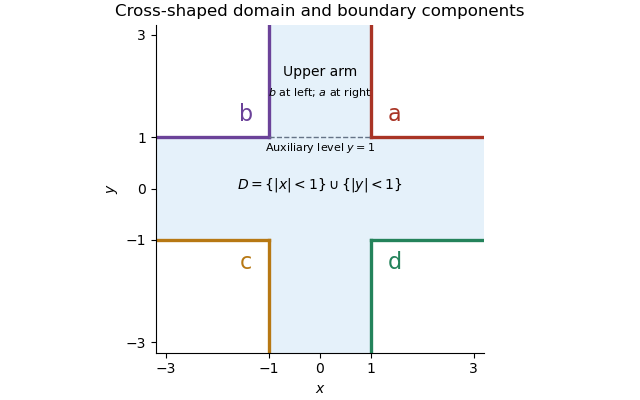

<h1 id="5/c/solution">Solution</h1>

↑ **Parent:** [C](../c.md)

The domain is the union of the horizontal and vertical strips. The four connected components of its boundary carry the constants $a,b,c,d$ in the northeast, northwest, southwest and southeast, respectively.

**[Figure 1](#5/c/image-the-cross-shaped-domain-its-four-boundary-values-and-the-auxiliary-upper-strip-used-for-the-limit-at-infinity). The cross-shaped domain, its four boundary values, and the auxiliary upper strip used for the limit at infinity**.

First justify finiteness of $T$. A small open ball around $(2,2)$ lies outside the domain. By part (b), [planar Brownian motion](../../../../../../planar-brownian-motion.md) visits that ball almost surely in finite time. A continuous path from $z\in D$ to that ball must meet $\partial D$ first. Hence $T<\infty$ almost surely, and $B_T\in\partial D$ by continuity.

The [harmonic function](../../../../../../harmonic-function.md) $u$ is smooth inside $D$. The [Itô formula](../../../../../../ito-s-lemma.md), localized on relatively compact subdomains, makes $u(B_{t\wedge T})$ a local [martingale](../../../../../../martingale-split.md). Its boundary definition uses the continuous extension of $u$. Since $u$ is bounded, this stopped process is a true [martingale](../../../../../../martingale-split.md) with [uniform integrability](../../../../../../uniform-integrability.md): pass through the compact exhaustion using [bounded convergence theorem](../../../../../../bounded-convergence-theorem.md). In particular $\mathbb E_z u(B_{t\wedge T})=u(z)$.

Now $B_{t\wedge T}\to B_T$ almost surely as $t\to\infty$. The [dominated convergence theorem](../../../../../../dominated-convergence-theorem.md), boundedness of $u$, and its continuous boundary values give the [bounded harmonic representation with almost sure Brownian exit](../../../../../../bounded-harmonic-representation-with-almost-sure-brownian-exit.md):

$$
\boxed{u(z)=\mathbb E_z u(B_T)=\mathbb E_z f(B_T).}
$$

**Almost sure exit and boundedness of the harmonic function are both used.** The domain's unboundedness causes no loss of [expectation](../../../../../../expected-value.md) here because the stopped function values are uniformly bounded.

## ↑ Ancestors (11)

1. [C](../c.md)
2. [5](../../5.md)
3. [Paper 201](../../../paper-201-split.md)
4. [Iii](../../../split.md)
5. [2016](../../../../split.md)
6. [Past exam of the mathematics course of the University of Cambridge](../../../../../split.md)
7. [Mathematics course of the University of Cambridge](../../../../../../mathematics-course-of-the-university-of-cambridge.md)
8. [Course of the University of Cambridge](../../../../../../course-of-the-university-of-cambridge.md)
9. [University of Cambridge](../../../../../../university-of-cambridge-split.md)
10. [List of universities](../../../../../../list-of-universities.md)
11. [Codex Wiki](../../../../../../split.md)
