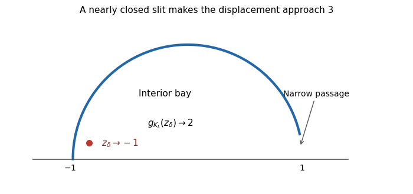

<h1 id="2/e/solution">Solution</h1>

↑ **Parent:** [E](../e.md)

**A nearly closed semicircular slit makes the constant sharp.** Put

$$
m(z)=\frac{z+1}{1-z},\qquad
K_L=m^{-1}(\{iy:0<y\leq L\}),\qquad L>0.
$$

This is the unit-circle arc attached at $-1$ and ending just short of $1$. Its complement is a [simply connected domain](../../../../../../simply-connected-domain.md). There remains a narrow passage near $1$ connecting the interior bay to infinity. Thus $K_L$ is a [compact H-hull](../../../../../../compact-h-hull.md) inside the closed unit disc.

For an explicit check, let $S=\sqrt{1+L^2}$ and let $q_L(z)=\sqrt{m(z)^2+L^2}$ denote the [mapping-out function of a vertical slit](../../../../../../mapping-out-function-of-a-vertical-slit.md) applied to $m(z)$, with the branch asymptotic to its argument in the slit half-plane. Its normalized map is

$$
g_{K_L}(z)=1+\frac{L^2}{S^2}-\frac{2}{S\,[q_L(z)+S]}.
$$

The final [Möbius transformation](../../../../../../mobius-transformation.md) takes the image of the original infinity to infinity and gives [hydrodynamic normalization at infinity](../../../../../../hydrodynamic-normalization-at-infinity.md). For a fixed $z$ in the open unit half-disc, $\operatorname{Re}m(z)>0$, so $q_L(z)\sim L$ and $g_{K_L}(z)\to2$ as $L\to\infty$. Now take $z_\delta=-1+\delta+i\delta$, with $0<\delta<1$. First let $L\to\infty$, then let $\delta\downarrow0$. The [nearly closed semicircular slit](../../../../../../nearly-closed-semicircular-slit.md) gives

$$
\boxed{\lim_{\delta\downarrow0}\lim_{L\to\infty}
|g_{K_L}(z_\delta)-z_\delta|=3.}
$$

Every constant smaller than three therefore fails for some member of this family and some interior point. The bound need not be attained at an interior point of a single fixed hull.

**[Figure 1](#2/e/image-a-nearly-closed-semicircular-slit-and-a-marked-point-inside-its-bay). A nearly closed semicircular slit and a marked point inside its bay**.

## ↑ Ancestors (11)

1. [E](../e.md)
2. [2](../../2.md)
3. [Paper 203](../../../paper-203-split.md)
4. [Iii](../../../split.md)
5. [2016](../../../../split.md)
6. [Past exam of the mathematics course of the University of Cambridge](../../../../../split.md)
7. [Mathematics course of the University of Cambridge](../../../../../../mathematics-course-of-the-university-of-cambridge.md)
8. [Course of the University of Cambridge](../../../../../../course-of-the-university-of-cambridge.md)
9. [University of Cambridge](../../../../../../university-of-cambridge-split.md)
10. [List of universities](../../../../../../list-of-universities.md)
11. [Codex Wiki](../../../../../../split.md)
