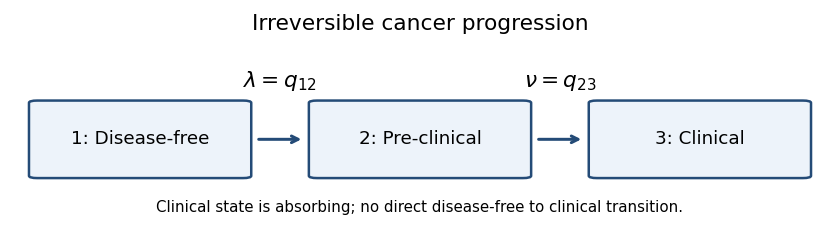
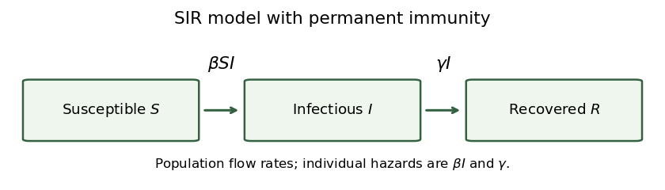

# Paper 207

↑ **Parent:** [Iii](../iii.md)

[https://www.maths.cam.ac.uk/postgrad/part-iii/files/pastpapers/2016/paper_207.pdf](https://www.maths.cam.ac.uk/postgrad/part-iii/files/pastpapers/2016/paper_207.pdf)

**Table of contents**

- [1](#1)
  - [a](#1/a)
    - [Solution](#1/a/solution)
  - [b](#1/b)
    - [i](#1/b/i)
      - [Solution](#1/b/i/solution)
  - [c](#1/c)
    - [Solution](#1/c/solution)
  - [d](#1/d)
    - [Solution](#1/d/solution)
  - [e](#1/e)
    - [Solution](#1/e/solution)
- [2](#2)
  - [a](#2/a)
    - [Solution](#2/a/solution)
  - [b](#2/b)
    - [Solution](#2/b/solution)
  - [c](#2/c)
    - [Solution](#2/c/solution)
  - [d](#2/d)
    - [Solution](#2/d/solution)
  - [e](#2/e)
    - [Solution](#2/e/solution)
  - [f](#2/f)
    - [Solution](#2/f/solution)
- [3](#3)
  - [a](#3/a)
    - [Solution](#3/a/solution)
  - [b](#3/b)
    - [Solution](#3/b/solution)
  - [c](#3/c)
    - [Solution](#3/c/solution)
  - [d](#3/d)
    - [Solution](#3/d/solution)
  - [e](#3/e)
    - [Solution](#3/e/solution)
  - [f](#3/f)
    - [Solution](#3/f/solution)
  - [g](#3/g)
    - [Solution](#3/g/solution)
  - [h](#3/h)
    - [Solution](#3/h/solution)
  - [i](#3/i)
    - [Solution](#3/i/solution)
- [4](#4)
  - [a](#4/a)
    - [Solution](#4/a/solution)
  - [b](#4/b)
    - [Solution](#4/b/solution)
  - [c](#4/c)
    - [Solution](#4/c/solution)
  - [d](#4/d)
    - [Solution](#4/d/solution)
- [5](#5)
  - [a](#5/a)
    - [Solution](#5/a/solution)
  - [b](#5/b)
    - [Solution](#5/b/solution)
- [6](#6)
  - [a](#6/a)
    - [Solution](#6/a/solution)
  - [b](#6/b)
    - [i](#6/b/i)
      - [Solution](#6/b/i/solution)
    - [ii](#6/b/ii)
      - [Solution](#6/b/ii/solution)
- [7](#7)
  - [a](#7/a)
    - [Solution](#7/a/solution)
  - [b](#7/b)
    - [i](#7/b/i)
      - [Solution](#7/b/i/solution)
    - [ii](#7/b/ii)
      - [Solution](#7/b/ii/solution)
    - [iii](#7/b/iii)
      - [Solution](#7/b/iii/solution)
    - [iv](#7/b/iv)
      - [Solution](#7/b/iv/solution)
  - [c](#7/c)
    - [Solution](#7/c/solution)
  - [d](#7/d)
    - [Solution](#7/d/solution)

## 1

↑ **Parent:** [Paper 207](paper-207.md)

<h3 id="1/a">a</h3>

↑ **Parent:** [1](#1)

<h4 id="1/a/solution">Solution</h4>

↑ **Parent:** [A](#1/a)

Use the usual [clinical trial](../../../probability-and-statistics.md#clinical-trial) sampling assumption that all patients' responses are independent, with fixed positive arm sizes and positive known variances. Marginal [normal distributions](../../../probability-theory.md#normal-distribution) alone would not specify the variance of a treatment contrast without this assumption. Put $\overline Y_i=n_i^{-1}\sum_jY_{ij}$, $v_i=\sigma_i^2/n_i$, and $s_i=\sqrt{v_i+v_0}$. The [sample mean](../../../variance.md#sample-mean) contrast estimates $\delta_i$ and has [standard error](../../../statistical-inference.md#standard-error) $s_i$. Thus **the one-sided Wald statistics** are

$$
\boxed{W_i=\frac{\overline Y_i-\overline Y_0}{\sqrt{\sigma_i^2/n_i+\sigma_0^2/n_0}},\qquad i=1,2.}
$$

Large positive values of these [Wald test](../../../statistical-modelling.md#wald-test) statistics provide evidence against the respective [null hypotheses](../../../statistical-modelling.md#null-hypothesis).

<h3 id="1/b">b</h3>

↑ **Parent:** [1](#1)

<h4 id="1/b/i">i</h4>

↑ **Parent:** [B](#1/b)

<h5 id="1/b/i/solution">Solution</h5>

↑ **Parent:** [I](#1/b/i)

The three independent [sample means](../../../variance.md#sample-mean) satisfy $\overline Y_i\sim\mathcal N(\mu_i,v_i)$. A linear transformation of their joint [multivariate normal distribution](../../../probability-and-statistics.md#multivariate-normal-distribution) is again normal. The two treatment contrasts have [covariance](../../../variance.md#covariance)

$$
\operatorname{Cov}(\overline Y_1-\overline Y_0,\overline Y_2-\overline Y_0)=\operatorname{Var}(\overline Y_0)=v_0.
$$

Writing $m_i=\delta_i/s_i$ and $\rho=v_0/(s_1s_2)$, **their joint distribution** is

$$
\boxed{\begin{pmatrix}W_1\\W_2\end{pmatrix}\sim\mathcal N_2\left(\begin{pmatrix}m_1\\m_2\end{pmatrix},\begin{pmatrix}1&\rho\\\rho&1\end{pmatrix}\right).}
$$

The positive [correlation coefficient](../../../variance.md#pearson-correlation-coefficient) arises from the shared control arm. Under positive variances, $0<\rho<1$. 

<h3 id="1/c">c</h3>

↑ **Parent:** [1](#1)

<h4 id="1/c/solution">Solution</h4>

↑ **Parent:** [C](#1/c)

Let $\phi_\rho$ denote the centered unit-variance [bivariate normal distribution](../../../probability-and-statistics.md#bivariate-normal-distribution) density,

$$
\phi_\rho(x,y)=\frac1{2\pi\sqrt{1-\rho^2}}\exp\left(-\frac{x^2-2\rho xy+y^2}{2(1-\rho^2)}\right).
$$

The complement of rejecting either [null hypothesis](../../../statistical-modelling.md#null-hypothesis) is $W_1\le c,W_2\le c$. Therefore **the probability of at least one rejection** is

$$
\boxed{1-\int_{-\infty}^{c-m_1}\int_{-\infty}^{c-m_2}\phi_\rho(x,y)\,dy\,dx.}
$$

When both [null hypotheses](../../../statistical-modelling.md#null-hypothesis) are true, this is the [familywise error rate](../../../statistical-modelling.md#familywise-error-rate). If one [null hypothesis](../../../statistical-modelling.md#null-hypothesis) is false, a rejection of that hypothesis is not a [Type I error](../../../information-theory.md#type-i-and-type-ii-errors), so the displayed probability is then an any-rejection probability rather than the [familywise error rate](../../../statistical-modelling.md#familywise-error-rate).

<h3 id="1/d">d</h3>

↑ **Parent:** [1](#1)

<h4 id="1/d/solution">Solution</h4>

↑ **Parent:** [D](#1/d)

Couple the [Wald test](../../../statistical-modelling.md#wald-test) statistics as $W_i=Z_i+\delta_i/s_i$, where the joint centered [bivariate normal distribution](../../../probability-and-statistics.md#bivariate-normal-distribution) of $(Z_1,Z_2)$ is fixed. Increasing either $\delta_i$ enlarges, pointwise in this coupling, the event $\{W_1>c\text{ or }W_2>c\}$. Its probability is consequently nondecreasing in each treatment effect.

If both [null hypotheses](../../../statistical-modelling.md#null-hypothesis) hold, then $\delta_1,\delta_2\le0$, so this probability is maximal at the joint boundary $(0,0)$. To check the [familywise error rate](../../../statistical-modelling.md#familywise-error-rate) across all configurations, suppose only hypothesis $i$ is true. A [Type I error](../../../information-theory.md#type-i-and-type-ii-errors) then occurs only if $W_i>c$, with probability at most $1-\Phi(c)$, where $\Phi$ is the [standard normal distribution function](../../../probability-theory.md#standard-normal-distribution-function). This is no larger than the any-rejection probability at $(0,0)$, since that joint event contains $\{Z_i>c\}$. If neither [null hypothesis](../../../statistical-modelling.md#null-hypothesis) is true, the [familywise error rate](../../../statistical-modelling.md#familywise-error-rate) is zero. Hence **the [least-favourable null configuration](../../../statistical-modelling.md#least-favourable-null-configuration) for [Type I error](../../../information-theory.md#type-i-and-type-ii-errors)** is

$$
\boxed{\delta_1=\delta_2=0,\qquad\operatorname{FWER}_{\max}=1-\Phi_2(c,c;\rho),}
$$

where $\Phi_2$ is the centered [bivariate normal distribution](../../../probability-and-statistics.md#bivariate-normal-distribution) function with [correlation coefficient](../../../variance.md#pearson-correlation-coefficient) $\rho$.

<h3 id="1/e">e</h3>

↑ **Parent:** [1](#1)

<h4 id="1/e/solution">Solution</h4>

↑ **Parent:** [E](#1/e)

Choose a [group sequential design](../../../probability-and-statistics.md#group-sequential-design). Randomize patients among the three arms, schedule interim analyses after prespecified amounts of information, and calculate the two [Wald test](../../../statistical-modelling.md#wald-test) statistics at each look. Prespecify efficacy boundaries and a futility rule; allow early stopping of an ineffective experimental arm or of the trial when sufficiently convincing efficacy evidence is obtained. Calibrate the boundaries for both repeated looks and the two shared-control comparisons so that the [familywise error rate](../../../statistical-modelling.md#familywise-error-rate) remains controlled. An [alpha-spending function](../../../probability-and-statistics.md#alpha-spending-function) is one way to allocate the error probability across looks.

**Two potential benefits** are lower expected recruitment and shorter duration when a treatment is clearly effective or futile, and earlier identification of benefit or lack of benefit, reducing continued exposure to an ineffective experimental treatment. These benefits concern expected performance; the maximum sample size may still be required.

**Two drawbacks** are the extra operational work needed for rapid, reliable outcomes and confidential interim analyses, and more complicated inference: repeated testing requires adjusted boundaries, and ordinary fixed-sample effect estimates and [confidence intervals](../../../statistical-inference.md#confidence-interval) can be misleading after data-dependent stopping. Continuing two comparisons against a shared control also requires care if an arm is stopped.

## 2

↑ **Parent:** [Paper 207](paper-207.md)

<h3 id="2/a">a</h3>

↑ **Parent:** [2](#2)

<h4 id="2/a/solution">Solution</h4>

↑ **Parent:** [A](#2/a)

Use three states of a [continuous-time Markov chain](../../../markov-process.md#continuous-time-markov-chain): disease-free $1$, pre-clinical $2$, and clinical $3$. The [transition intensities](../../../survival-analysis.md#transition-intensity) are $\lambda=q_{12}>0$ for onset and $\nu=q_{23}>0$ for progression. Clinical disease is an [absorbing state](../../../markov-process.md#absorbing-state). The mandatory pre-clinical phase excludes a direct $1\to3$ jump, and this untreated progression model has no reverse transitions.

**[Figure 1](#2/a/image-irreversible-cancer-progression-from-disease-free-to-pre-clinical-to-clinical-states). Irreversible cancer progression from disease-free to pre-clinical to clinical states**.

With row-vector probabilities and state order $(1,2,3)$, **the generator matrix** is

$$
\boxed{Q=\begin{pmatrix}-\lambda&\lambda&0\\0&-\nu&\nu\\0&0&0\end{pmatrix}.}
$$

Its rows sum to zero, so only the two off-diagonal [transition intensities](../../../survival-analysis.md#transition-intensity) are unknown. This is a [continuous-time multi-state model](../../../survival-analysis.md#continuous-time-multi-state-model) with sequential irreversible progression.

<h3 id="2/b">b</h3>

↑ **Parent:** [2](#2)

<h4 id="2/b/solution">Solution</h4>

↑ **Parent:** [B](#2/b)

Starting in state $1$, the onset waiting time has the [exponential distribution](../../../continuous-probability-distribution.md#exponential-distribution) of rate $\lambda$. Thus **the probability of onset before the next screen** is $1-e^{-\lambda t}$. This counts individuals who have already progressed to clinical disease as well as those still pre-clinical.

Conditional on onset at time $u<t$, the [Markov property](../../../markov-process.md#markov-property) makes the remaining progression time exponential with rate $\nu$. Thus **the probability of clinical progression before the screen**, conditional on that onset time, is $1-e^{-\nu(t-u)}$.

Integrating over the onset density gives the unconditional clinical probability

$$
P_{13}(t)=\int_0^t\lambda e^{-\lambda u}\bigl(1-e^{-\nu(t-u)}\bigr)\,du=1-\frac{\nu e^{-\lambda t}-\lambda e^{-\nu t}}{\nu-\lambda}.
$$

The probability of being pre-clinical at the next screen is instead

$$
P_{12}(t)=\int_0^t\lambda e^{-\lambda u}e^{-\nu(t-u)}\,du=\frac{\lambda}{\nu-\lambda}(e^{-\lambda t}-e^{-\nu t}).
$$

Together with $P_{11}(t)=e^{-\lambda t}$ and the [exponential distribution](../../../continuous-probability-distribution.md#exponential-distribution) for a patient initially in state $2$, **the transition matrix** is

$$
\boxed{P(t)=\begin{pmatrix}e^{-\lambda t}&\frac{\lambda(e^{-\lambda t}-e^{-\nu t})}{\nu-\lambda}&1-\frac{\nu e^{-\lambda t}-\lambda e^{-\nu t}}{\nu-\lambda}\\0&e^{-\nu t}&1-e^{-\nu t}\\0&0&1\end{pmatrix}.}
$$

This equals the [matrix exponential](../../../linear-operator-theory.md#matrix-exponential) $e^{Qt}$. The assumed unequal intensities avoid a zero denominator; at $\lambda=\nu$ the continuous limit is $P_{12}(t)=\lambda t e^{-\lambda t}$.

<h3 id="2/c">c</h3>

↑ **Parent:** [2](#2)

<h4 id="2/c/solution">Solution</h4>

↑ **Parent:** [C](#2/c)

Assume the 1000 individuals are initially disease-free. The event being counted is onset during the ten-year period, not occupancy of the pre-clinical state at its end. Using the estimated [transition intensity](../../../survival-analysis.md#transition-intensity) as a constant onset rate and [linearity of expectation](../../../probability-theory.md#linearity-of-expectation), **the expected number of onsets** is

$$
\boxed{1000(1-e^{-0.005\times10})\simeq48.77,\quad\text{about }49\text{ people}.}
$$

The first-order approximation $1000\times0.005\times10=50$ is close, but does not account for depletion of the disease-free group.

<h3 id="2/d">d</h3>

↑ **Parent:** [2](#2)

<h4 id="2/d/solution">Solution</h4>

↑ **Parent:** [D](#2/d)

Let $A_i(s)$ be age in years at follow-up time $s$ and let $G_i\in\{0,1\}$ indicate the genetic risk factor. An age-dependent [log-linear transition intensity model](../../../survival-analysis.md#log-linear-transition-intensity-model) is

$$
\boxed{q_{12,i}(s)=\exp\{\theta_0+\theta_A(A_i(s)-50)+\theta_GG_i\}.}
$$

Here $e^{\theta_0}$ is the onset [baseline hazard](../../../survival-analysis.md#baseline-hazard) for a 50-year-old without the factor; $e^{\theta_G}$ is the genetic [hazard ratio](../../../survival-analysis.md#hazard-ratio), and $e^{\theta_A}$ is the [hazard ratio](../../../survival-analysis.md#hazard-ratio) per additional year of age. A smooth function of age could replace the linear age term if a constant age [hazard ratio](../../../survival-analysis.md#hazard-ratio) were unsuitable.

Under the stated constant multiplicative [hazard ratios](../../../survival-analysis.md#hazard-ratio), the requested extrapolation is therefore **the baseline rate times both multipliers**:

$$
\boxed{q_{12}(60,1)=q\,\alpha_1\alpha_2^{10}.}
$$

<h3 id="2/e">e</h3>

↑ **Parent:** [2](#2)

<h4 id="2/e/solution">Solution</h4>

↑ **Parent:** [E](#2/e)

Age changes during follow-up, so the [generator matrix](../../../coding-theory.md#generator-matrix) $Q(s)$ changes with time. The [transition matrix](../../../markov-process.md#stochastic-matrix) must solve $\partial_{t_2}P(t_1,t_2)=P(t_1,t_2)Q(t_2)$, with $P(t_1,t_1)=I$. It is generally not the [matrix exponential](../../../linear-operator-theory.md#matrix-exponential) of one constant matrix; even $\exp(\int Q(s)\,ds)$ is not generally valid because the matrices at different times need not commute.

For example, write the age-dependent onset rate as $\lambda(s)$ and keep progression rate $\nu$ constant. Then

$$
P_{12}(t_1,t_2)=\int_{t_1}^{t_2}\lambda(u)\exp\left(-\int_{t_1}^u\lambda(v)\,dv\right)e^{-\nu(t_2-u)}\,du.
$$

Even when the integrated onset rate is elementary, this remaining integral need not have an elementary closed form. Special cases can have closed forms; time dependence does not by itself prove universal impossibility.

For a tractable [likelihood function](../../../statistical-modelling.md#likelihood-function), freeze age at its left-endpoint value, or a midpoint value, on each observation interval $[t_j,t_{j+1})$. The genetic [covariate](../../../statistical-model.md#covariate) is already constant. This [piecewise-constant covariate approximation](../../../survival-analysis.md#piecewise-constant-covariate-approximation) gives a constant matrix $Q_j$ on each interval and **a product of closed-form interval probabilities**:

$$
\boxed{L=\prod_j\left[e^{Q_j(t_{j+1}-t_j)}\right]_{x_jx_{j+1}}.}
$$

Here $x_j$ is the observed state at $t_j$, and the [likelihood function](../../../statistical-modelling.md#likelihood-function) is conditional on the initial state. The approximation improves when intervals are short relative to the variation in the age effect.

<h3 id="2/f">f</h3>

↑ **Parent:** [2](#2)

<h4 id="2/f/solution">Solution</h4>

↑ **Parent:** [F](#2/f)

Let $\epsilon$ be the [false positive rate](../../../statistical-learning.md#false-positive-rate) for a genuinely cancer-free person, encompassing the harmless-tumour misclassification, and assume screening errors are conditionally independent given the latent states. A pre-clinical case tests positive with probability one; a clinical case is separately recognized. Thus a negative screen identifies latent state $1$, whereas a positive pre-clinical screen can arise from state $1$ or $2$. This is a [Hidden Markov model](../../../markov-process.md#hidden-markov-model) with a [screening misclassification model](../../../markov-process.md#screening-misclassification-model).

Conditional on the negative baseline screen, the state at year $0$ is $1$. The negative screen at year $2$ requires staying in state $1$ for two years and then testing negative. From that state, the positive screen at year $4$ can arise either with probability $\epsilon$ while still disease-free or through pre-clinical disease. Consequently **the conditional likelihood** is

$$
\boxed{L_{\mathrm{cond}}=e^{-2\lambda}(1-\epsilon)\left[\epsilon e^{-2\lambda}+\frac{\lambda}{\nu-\lambda}(e^{-2\lambda}-e^{-2\nu})\right].}
$$

If the study instead specifies an initially disease-free patient and includes the baseline screening result in the [likelihood function](../../../statistical-modelling.md#likelihood-function), its probability contributes a further factor $1-\epsilon$, giving

$$
\boxed{L_{\mathrm{all}}=(1-\epsilon)^2e^{-2\lambda}\left[\epsilon e^{-2\lambda}+\frac{\lambda}{\nu-\lambda}(e^{-2\lambda}-e^{-2\nu})\right].}
$$

The formulas use the positive emission for a pre-clinical screen, with no clinical diagnosis in this record. A persistent harmless-tumour subtype producing correlated screening errors would need an additional latent-state or emission specification; its likelihood is not determined by the single parameter $\epsilon$.

## 3

↑ **Parent:** [Paper 207](paper-207.md)

<h3 id="3/a">a</h3>

↑ **Parent:** [3](#3)

<h4 id="3/a/solution">Solution</h4>

↑ **Parent:** [A](#3/a)

In the [SIR model](../../../mathematical-biology.md#sir-model), $S,I,R$ count susceptible, infectious, and recovered immune individuals. The closed population has $S+I+R=N+1$. Under homogeneous mixing, use the paper's [mass-action infection](../../../mathematical-biology.md#mass-action-infection) convention: each susceptible has infection [hazard function](../../../survival-analysis.md#hazard-function) $\beta I$, so the population infection rate is $\beta SI$. Each infectious individual recovers with [hazard function](../../../survival-analysis.md#hazard-function) $\gamma$, giving population recovery rate $\gamma I$ and mean infectious duration $1/\gamma$.

**[Figure 2](#3/a/image-sir-compartment-transitions-with-infection-flow-beta-s-i-and-recovery-flow-gamma-i). SIR compartment transitions with infection flow beta S I and recovery flow gamma I**.

The arrows are one-way: recovered individuals are immune, and there are no demographic entries or exits. The [transition intensities](../../../survival-analysis.md#transition-intensity) attached to the arrows are population flow rates, rather than individual [hazard functions](../../../survival-analysis.md#hazard-function).

<h3 id="3/b">b</h3>

↑ **Parent:** [3](#3)

<h4 id="3/b/solution">Solution</h4>

↑ **Parent:** [B](#3/b)

The deterministic [SIR model](../../../mathematical-biology.md#sir-model) follows the [ordinary differential equations](../../../differential-equation.md#ordinary-differential-equation)

$$
\boxed{\dot S=-\beta SI,\qquad\dot I=\beta SI-\gamma I,\qquad\dot R=\gamma I,\qquad(S(0),I(0),R(0))=(N,1,0).}
$$

Use $\beta\ge0$ and $\gamma>0$. The state space is $S,I,R\ge0$, $S+I+R=N+1$; summing the three equations proves conservation of this population. Infection is supported only where $S>0$ and $I>0$, and recovery only where $I>0$. The rates vanish at the corresponding boundaries, preventing negative compartment sizes.

This convention has an unnormalized population infection rate $\beta SI$, as required by the printed threshold. A convention with infection rate $\beta SI/(N+1)$ would use a differently scaled parameter.

<h3 id="3/c">c</h3>

↑ **Parent:** [3](#3)

<h4 id="3/c/solution">Solution</h4>

↑ **Parent:** [C](#3/c)

Whenever $I>0$, divide the first [SIR model](../../../mathematical-biology.md#sir-model) equation by the recovery equation:

$$
\frac{dS}{dR}=-\frac\beta\gamma S.
$$

The [SIR susceptible-recovered identity](../../../mathematical-biology.md#sir-susceptible-recovered-identity) follows by integrating from $R=0,S=N$, giving **susceptibles as a function of recovered individuals**:

$$
\boxed{S(t)=N e^{-\beta R(t)/\gamma}.}
$$

Population conservation then gives **the infectious count**:

$$
\boxed{I(t)=N+1-R(t)-N e^{-\beta R(t)/\gamma}.}
$$

These identities extend continuously to the limiting state where the infectious count vanishes.

<h3 id="3/d">d</h3>

↑ **Parent:** [3](#3)

<h4 id="3/d/solution">Solution</h4>

↑ **Parent:** [D](#3/d)

The infectious count in the [SIR model](../../../mathematical-biology.md#sir-model) obeys $\dot I=I(\beta S-\gamma)$. At the initial state, $\dot I(0)=\beta N-\gamma$, so initial epidemic growth requires **the [epidemic threshold for the closed SIR model](../../../mathematical-biology.md#epidemic-threshold-for-the-closed-sir-model)**

$$
\boxed{N>\frac\gamma\beta,\qquad\mathcal R_0=\frac{\beta N}{\gamma}>1.}
$$

Here $\mathcal R_0$ is the [basic reproduction number](../../../mathematical-biology.md#basic-reproduction-number) in this [mass-action infection](../../../mathematical-biology.md#mass-action-infection) convention. Necessity also follows globally: $S(t)$ is nonincreasing, so if $\beta N\le\gamma$, then $\beta S(t)-\gamma\le0$ for all time and $I(t)$ never increases. When $\beta=0$, growth is impossible.

<h3 id="3/e">e</h3>

↑ **Parent:** [3](#3)

<h4 id="3/e/solution">Solution</h4>

↑ **Parent:** [E](#3/e)

At time zero the [chain-binomial epidemic model](../../../mathematical-biology.md#chain-binomial-epidemic-model) has $B(0)\sim\operatorname{Bin}(N,\beta)$ and $C(0)\sim\operatorname{Bin}(1,1-e^{-\gamma})$, independently. The update gives $I(1)=1+B(0)-C(0)$. Since $B(0)\ge0$ and $C(0)\le1$, extinction at day one is equivalent to $B(0)=0$ and $C(0)=1$. Hence **the one-day extinction probability** is

$$
\boxed{\mathbb P(I(1)=0)=(1-\beta)^N(1-e^{-\gamma}).}
$$

This is the exact probability for the printed discrete-time approximation, which requires $\beta I(t)\delta t\in[0,1]$ wherever used. It should not be substituted for the distinct continuous-time extinction calculation.

<h3 id="3/f">f</h3>

↑ **Parent:** [3](#3)

<h4 id="3/f/solution">Solution</h4>

↑ **Parent:** [F](#3/f)

For the [stochastic SIR model](../../../mathematical-biology.md#stochastic-sir-model), the state $(S,I,R)$ is a [continuous-time Markov chain](../../../markov-process.md#continuous-time-markov-chain) on nonnegative integer triples summing to $N+1$, initially $(N,1,0)$. Its only transitions are

$$
\boxed{(s,i,r)\longrightarrow(s-1,i+1,r)\text{ at rate }\beta si,\qquad(s,i,r)\longrightarrow(s,i-1,r+1)\text{ at rate }\gamma i.}
$$

Rates vanish when a proposed transition would leave the state space. Equivalently, with independent unit-rate [Poisson processes](../../../probability-theory.md#poisson-process) $A,B$, the [Poisson time-change representation of a Markov chain](../../../markov-process.md#poisson-time-change-representation-of-a-markov-chain) is

$$
S(t)=N-A\left(\int_0^t\beta S(u-)I(u-)\,du\right),\quad R(t)=B\left(\int_0^t\gamma I(u-)\,du\right),\quad I(t)=N+1-S(t)-R(t).
$$

The left limits describe the state immediately before each jump. In the [Gillespie algorithm](../../../mathematical-biology.md#gillespie-algorithm), wait an [exponential distribution](../../../continuous-probability-distribution.md#exponential-distribution) time with rate $\beta si+\gamma i$, then choose infection or recovery in proportion to these two rates.

<h3 id="3/g">g</h3>

↑ **Parent:** [3](#3)

<h4 id="3/g/solution">Solution</h4>

↑ **Parent:** [G](#3/g)

Initially, the infection and recovery [transition intensities](../../../survival-analysis.md#transition-intensity) are $\beta N$ and $\gamma$. By [competing exponential clocks](../../../continuous-probability-distribution.md#competing-exponential-clocks), **the first-event waiting time** has distribution

$$
\boxed{\tau_1\sim\operatorname{Exp}(\beta N+\gamma),\qquad\mathbb P(\tau_1>u)=e^{-(\beta N+\gamma)u}\quad(u\ge0).}
$$

<h3 id="3/h">h</h3>

↑ **Parent:** [3](#3)

<h4 id="3/h/solution">Solution</h4>

↑ **Parent:** [H](#3/h)

The first event causes extinction precisely when it is recovery of the sole initially infectious individual. An infection would instead give two infectious individuals. The [competing exponential clocks](../../../continuous-probability-distribution.md#competing-exponential-clocks) calculation therefore gives **the first-event extinction probability**

$$
\boxed{\frac{\gamma}{\beta N+\gamma}.}
$$

<h3 id="3/i">i</h3>

↑ **Parent:** [3](#3)

<h4 id="3/i/solution">Solution</h4>

↑ **Parent:** [I](#3/i)

Write $a=\beta^*=\beta N+\gamma$. If the first event is recovery, the epidemic has ended and a second event is impossible. If the first event is infection at time $s$, its density is $\beta N e^{-as}$, and the new state is $(N-1,2,0)$. The total next-event rate is

$$
b=2\beta(N-1)+2\gamma=2(a-\beta).
$$

Thus, by the [Markov property](../../../markov-process.md#markov-property), **the [two-event probability in a stochastic SIR model](../../../mathematical-biology.md#two-event-probability-in-a-stochastic-sir-model) by time one** is

$$
\int_0^1\beta N e^{-as}\left(1-e^{-b(1-s)}\right)\,ds.
$$

Evaluate the first term as $\beta N(1-e^{-a})/a$. For the second, $b-a=a-2\beta$, so

$$
\int_0^1\beta N e^{-as-b(1-s)}\,ds=\frac{\beta N e^{-a}}{a-2\beta}\left(1-e^{-(a-2\beta)}\right).
$$

Therefore

$$
\boxed{\mathbb P(\text{at least two events in }[0,1))=\frac{\beta N}{\beta^*}(1-e^{-\beta^*})-\frac{\beta N e^{-\beta^*}}{\beta^*-2\beta}(1-e^{-(\beta^*-2\beta)}).}
$$

For $N\ge2$ and $\gamma>0$, the denominator $\beta^*-2\beta=\beta(N-2)+\gamma$ is positive. Event times are continuous, so inclusion or exclusion of the endpoint one makes no difference.

## 4

↑ **Parent:** [Paper 207](paper-207.md)

Throughout the survival questions, use the paper's notation $F(t)=\mathbb P(T>t)$ for the [survivor function](../../../survival-analysis.md#survival-function), not for a cumulative distribution function. To construct the [Kaplan–Meier estimator](../../../survival-analysis.md#kaplan-meier-estimator), sort the distinct observed event times $a_j$. Let $r_j$ be the size of the [risk set](../../../survival-analysis.md#risk-set) immediately before $a_j$, and $d_j$ the number of events at that time. The estimated conditional chance of surviving that event time is $1-d_j/r_j$. Multiplying these conditional probabilities gives

$$
\boxed{\widehat F(t)=\prod_{a_j\le t}\left(1-\frac{d_j}{r_j}\right).}
$$

A [right censoring](../../../survival-analysis.md#right-censoring) time reduces later [risk sets](../../../survival-analysis.md#risk-set) but causes no jump itself. The usual interpretation as a population [survivor function](../../../survival-analysis.md#survival-function) uses [independent censoring](../../../survival-analysis.md#independent-censoring).

<h3 id="4/a">a</h3>

↑ **Parent:** [4](#4)

<h4 id="4/a/solution">Solution</h4>

↑ **Parent:** [A](#4/a)

The [risk sets](../../../survival-analysis.md#risk-set) at the six event times are $(7,6,5,3,2,1)$, each with one event: the censoring between $t_3$ and $t_4$ removes the seventh individual before the fourth event. Thus **the survivor estimate after the fifth event** is

$$
\boxed{\widehat F_5^*=\frac67\frac56\frac45\frac23\frac12=\frac4{21}.}
$$

Conditional on reaching $t_4$, the event mass at $t_4$ is $1/3$, that at $t_5$ is $(2/3)(1/2)$, and that at $t_6$ is $(2/3)(1/2)(1)$. Hence **the conditional event probabilities** are

$$
\boxed{(\widehat p_4^*,\widehat p_5^*,\widehat p_6^*)=(1/3,1/3,1/3).}
$$

<h3 id="4/b">b</h3>

↑ **Parent:** [4](#4)

<h4 id="4/b/solution">Solution</h4>

↑ **Parent:** [B](#4/b)

Now treat the seventh observation as an actual event at $t_4$, not as a censoring at that time. The [risk sets](../../../survival-analysis.md#risk-set) are $(7,6,5,4,2,1)$ and the event counts are $(1,1,1,2,1,1)$. The [Kaplan–Meier estimator](../../../survival-analysis.md#kaplan-meier-estimator) therefore gives

$$
\boxed{\widehat F_5^0=\frac47\left(1-\frac24\right)\left(1-\frac12\right)=\frac17.}
$$

Conditional on reaching $t_4$, the two events at that time have total probability $2/4=1/2$. Surviving them has probability $1/2$, which is then divided equally between the remaining two event times. Thus

$$
\boxed{(\widehat p_4^0,\widehat p_5^0,\widehat p_6^0)=(1/2,1/4,1/4).}
$$

<h3 id="4/c">c</h3>

↑ **Parent:** [4](#4)

<h4 id="4/c/solution">Solution</h4>

↑ **Parent:** [C](#4/c)

For [fractional event imputation](../../../survival-analysis.md#fractional-event-imputation), let $q_j$ be the fractional event weight assigned to the seventh individual at $t_j$. Its event contribution at $t_j$ is $q_j$. It belongs to the [risk set](../../../survival-analysis.md#risk-set) at that time precisely for allocations at $t_j$ or later, so its fractional [risk set](../../../survival-analysis.md#risk-set) contribution is $\sum_{j'\ge j}q_{j'}$. This justifies both parts of the hint.

For $(q_4,q_5,q_6)=(1/2,1/4,1/4)$, the fractional counts at the last three times are

$$
(r_4,d_4)=(4,3/2),\qquad(r_5,d_5)=(5/2,5/4),\qquad(r_6,d_6)=(5/4,5/4).
$$

Earlier [Kaplan–Meier estimator](../../../survival-analysis.md#kaplan-meier-estimator) factors still give survival $4/7$ immediately before $t_4$. Consequently

$$
\boxed{\widehat F_5^1=\frac47\left(1-\frac{3/2}{4}\right)\left(1-\frac{5/4}{5/2}\right)=\frac5{28}.}
$$

**The three values are** $\widehat F_5^0=1/7\simeq0.1429$, $\widehat F_5^1=5/28\simeq0.1786$, and $\widehat F_5^*=4/21\simeq0.1905$, in strictly increasing order. Spreading the censored individual's mass beyond $t_4$ raises the survivor estimate from the immediate-event imputation and moves it toward the original [Kaplan–Meier estimator](../../../survival-analysis.md#kaplan-meier-estimator).

<h3 id="4/d">d</h3>

↑ **Parent:** [4](#4)

<h4 id="4/d/solution">Solution</h4>

↑ **Parent:** [D](#4/d)

Assign the seventh individual's event weights $(1/3,1/3,1/3)$, the conditional probabilities obtained from the original [Kaplan–Meier estimator](../../../survival-analysis.md#kaplan-meier-estimator). The last three fractional counts are

$$
(r_4,d_4)=(4,4/3),\qquad(r_5,d_5)=(8/3,4/3),\qquad(r_6,d_6)=(4/3,4/3).
$$

Their conditional event fractions are $1/3$, $1/2$, and $1$, exactly as in the original censored-data calculation. Hence **the fractional allocation reproduces the original estimate**:

$$
\boxed{\widehat F(t_5)=\frac47\frac23\frac12=\frac4{21}=\widehat F_5^*.}
$$

This illustrates [self-consistency of Kaplan–Meier estimation](../../../survival-analysis.md#self-consistency-of-kaplan-meier-estimation): distributing the unobserved event according to the current conditional fitted event distribution leaves the fitted distribution unchanged. The first imputation in part (b) was not such a self-consistent allocation.

## 5

↑ **Parent:** [Paper 207](paper-207.md)

For a continuous proper event time with [cumulative hazard function](../../../survival-analysis.md#cumulative-hazard-function) $H$ and [survivor function](../../../survival-analysis.md#survival-function) $F(t)=e^{-H(t)}$, use the assumed inverse of $H$. For $u\ge0$,

$$
\mathbb P(H(T)>u)=\mathbb P(T>H^{-1}(u))=F(H^{-1}(u))=e^{-u}.
$$

Therefore **the integrated-hazard transformation is unit exponential**:

$$
\boxed{H(T)\sim\operatorname{Exp}(1).}
$$

This [cumulative hazard probability transformation](../../../survival-analysis.md#cumulative-hazard-probability-transformation) is the basis for the following survival-model residual diagnostics.

<h3 id="5/a">a</h3>

↑ **Parent:** [5](#5)

<h4 id="5/a/solution">Solution</h4>

↑ **Parent:** [A](#5/a)

The transformed event time is unit exponential, and the transformed censoring time remains a censoring time because $H$ is increasing. Under [independent censoring](../../../survival-analysis.md#independent-censoring) and a correctly fitted model, the [Kaplan–Meier estimator](../../../survival-analysis.md#kaplan-meier-estimator) of the [survivor function](../../../survival-analysis.md#survival-function) for the [Cox–Snell residuals](../../../survival-analysis.md#cox-snell-residual) $\widehat H(x_i)$ should approximate $e^{-u}$.

Thus **a logarithmic survivor plot should follow a straight line through the origin with slope minus one**:

$$
\boxed{\log\widehat F_{\mathrm{res}}(u)\approx-u.}
$$

The empirical plot is a step function around that line. Systematic curvature suggests model misspecification; the late part is less stable when the [risk set](../../../survival-analysis.md#risk-set) is small. The retained event indicators $v_i$ must be used rather than treating censored residuals as complete event times.

<h3 id="5/b">b</h3>

↑ **Parent:** [5](#5)

<h4 id="5/b/solution">Solution</h4>

↑ **Parent:** [B](#5/b)

Put $U=H(T)$ and $V=H(C)$, so $Y=\min(U,V)$ and $0\le\mathbb EY\le\mathbb EU=1$. Its [expectation](../../../probability-theory.md#expected-value) is not generally one and depends on censoring. Under [independent censoring](../../../survival-analysis.md#independent-censoring), condition on $V=v$: the [exponential distribution](../../../continuous-probability-distribution.md#exponential-distribution) gives

$$
\mathbb E(Y\mid V=v)=\int_0^v e^{-u}\,du=1-e^{-v}=\mathbb P(U\le V\mid V=v).
$$

Writing $\Delta=\mathbf1_{T\le C}$ for the observed event indicator, it follows that $\mathbb EY=\mathbb E\Delta$. The [exponential mean imputation under independent censoring](../../../survival-analysis.md#exponential-mean-imputation-under-independent-censoring) therefore gives **a [modified Cox–Snell residual](../../../survival-analysis.md#modified-cox-snell-residual) with known mean**:

$$
\boxed{Y^*=Y+(1-\Delta),\qquad\mathbb EY^*=1.}
$$

On censoring, the added one is the expected remaining transformed lifetime, by [memorylessness of the exponential distribution](../../../continuous-probability-distribution.md#memorylessness-of-the-exponential-distribution). This gives a mean-one variable, not necessarily another exponential variable. Equivalently, $M=\Delta-Y=1-Y^*$ is a [martingale residual](../../../survival-analysis.md#martingale-residual) with mean zero. [Independent censoring](../../../survival-analysis.md#independent-censoring), or its appropriate conditional version, is essential for these identities; arbitrary informative censoring does not justify the correction.

Fit a model using the relevant [covariates](../../../statistical-model.md#covariate), calculate $\widehat M_i=v_i-\widehat H_i(x_i)$, and plot these [martingale residuals](../../../survival-analysis.md#martingale-residual) against a candidate explanatory variable or against an included variable's value. A smooth systematic trend away from zero can indicate an omitted effect or an unsuitable functional form, such as a nonlinear age effect. After fitting an appropriate effect, the residual trend should diminish. The equivalent plot of $\widehat Y_i^*$ has mean-one reference rather than zero.

## 6

↑ **Parent:** [Paper 207](paper-207.md)

<h3 id="6/a">a</h3>

↑ **Parent:** [6](#6)

<h4 id="6/a/solution">Solution</h4>

↑ **Parent:** [A](#6/a)

For a nonnegative continuous event time $T$, the [survivor function](../../../survival-analysis.md#survival-function) is $F(t)=\mathbb P(T>t)$, and its [probability density function](../../../continuous-probability-distribution.md#probability-density-function) is

$$
\boxed{f(t)=-F'(t).}
$$

The [hazard function](../../../survival-analysis.md#hazard-function) is the instantaneous event rate conditional on being event-free at that time:

$$
\boxed{h(t)=\lim_{\epsilon\downarrow0}\frac{\mathbb P(t\le T<t+\epsilon\mid T\ge t)}{\epsilon}=\frac{f(t)}{F(t)}\quad(F(t)>0).}
$$

If the event is certain to occur in finite time, the density is proper: $\int_0^\infty f(t)\,dt=1$, so $F(t)\to0$. Since $F(0)=1$ and $F'=-hF$, the [cumulative hazard function](../../../survival-analysis.md#cumulative-hazard-function) is $H(t)=-\log F(t)$. Therefore **a certain eventual event requires unbounded integrated hazard**:

$$
\boxed{\lim_{t\to\infty}\int_0^t h(u)\,du=+\infty.}
$$

If the lifetime has a finite upper endpoint, the same divergence occurs as that endpoint is approached, and $H$ is interpreted as infinite beyond it.

<h3 id="6/b">b</h3>

↑ **Parent:** [6](#6)

This is [administrative censoring](../../../survival-analysis.md#administrative-censoring). Under the usual assumption that entry calendar time is independent of the subsequent event time, it is an example of [independent censoring](../../../survival-analysis.md#independent-censoring), not [informative censoring](../../../survival-analysis.md#informative-censoring): the planned study closure, rather than a patient's prognosis, determines the available follow-up. Uniform entry by itself does not prove that assumption; if entry date is associated with prognosis, independence must instead be justified conditionally on the relevant [covariates](../../../statistical-model.md#covariate). The calculations below use independence.

<h4 id="6/b/i">i</h4>

↑ **Parent:** [B](#6/b)

<h5 id="6/b/i/solution">Solution</h5>

↑ **Parent:** [I](#6/b/i)

For [administrative censoring with uniform entry](../../../survival-analysis.md#administrative-censoring-with-uniform-entry), let entry time $A\sim\operatorname{Uniform}(\tau_a,\tau_b)$. Then $C=\tau_c-A$ has the [uniform distribution](../../../continuous-probability-distribution.md#continuous-uniform-distribution) on $[\ell,r]$, where $\ell=\tau_c-\tau_b$, $r=\tau_c-\tau_a$, and $d=r-\ell=\tau_b-\tau_a$. **Its density and survivor function** are

$$
\boxed{g_C(t)=\begin{cases}1/d,&\ell<t<r,\\0,&\text{otherwise},\end{cases}\qquad G(t)=\begin{cases}1,&0\le t<\ell,\\(r-t)/d,&\ell\le t<r,\\0,&t\ge r.\end{cases}}
$$

Dividing density by survival and integrating gives **the censoring hazard and integrated hazard**:

$$
\boxed{h_C(t)=\begin{cases}0,&0\le t<\ell,\\1/(r-t),&\ell\le t<r,\end{cases}\qquad H_C(t)=\begin{cases}0,&0\le t<\ell,\\\log\frac{d}{r-t},&\ell\le t<r,\\+\infty,&t\ge r.\end{cases}}
$$

The [hazard function](../../../survival-analysis.md#hazard-function) is undefined once no uncensored individuals remain. As $t\uparrow r$, it diverges like $1/(r-t)$ and the [cumulative hazard function](../../../survival-analysis.md#cumulative-hazard-function) diverges logarithmically. This reflects the certainty of administrative censoring by the longest possible follow-up time, not dependence of censoring on the event process.

<h4 id="6/b/ii">ii</h4>

↑ **Parent:** [B](#6/b)

<h5 id="6/b/ii/solution">Solution</h5>

↑ **Parent:** [Ii](#6/b/ii)

An individual has neither died nor been censored by time $t$ exactly when $T>t$ and $C>t$. Under [independent censoring](../../../survival-analysis.md#independent-censoring), this has probability $F_T(t)G(t)$. Thus **the probability of leaving observation by either route** is

$$
\boxed{\mathbb P(\min(T,C)\le t)=1-F_T(t)G(t)=\begin{cases}1-F_T(t),&0\le t<\tau_c-\tau_b,\\1-F_T(t)\dfrac{\tau_c-\tau_a-t}{\tau_b-\tau_a},&\tau_c-\tau_b\le t<\tau_c-\tau_a.\end{cases}}
$$

The two pieces agree at $t=\tau_c-\tau_b$. The expression counts the first of death and censoring, so it does not double-count individuals who would eventually experience both.

## 7

↑ **Parent:** [Paper 207](paper-207.md)

<h3 id="7/a">a</h3>

↑ **Parent:** [7](#7)

<h4 id="7/a/solution">Solution</h4>

↑ **Parent:** [A](#7/a)

Choose an individual uniformly from the population. The [law of total probability](../../../probability-theory.md#law-of-total-probability) gives **the population density and survivor function** as mixtures:

$$
\boxed{\overline f(t)=\frac1n\sum_{i=1}^n f_i(t),\qquad\overline F(t)=\frac1n\sum_{i=1}^n F_i(t).}
$$

A [hazard function](../../../survival-analysis.md#hazard-function) is a ratio of density to survival, so averaging the densities does not average those ratios. Instead,

$$
\boxed{\overline h(t)=\frac{\sum_iF_i(t)h_i(t)}{\sum_iF_i(t)}=\sum_iw_i(t)h_i(t),\qquad w_i(t)=\frac{F_i(t)}{\sum_jF_j(t)}.}
$$

These are the proportions of the original individual types among those still event-free at $t$, rather than their equal starting proportions. For example, a mixture of different [exponential distributions](../../../continuous-probability-distribution.md#exponential-distribution) progressively favours the lower-rate individuals. This [population hazard of a survival mixture](../../../survival-analysis.md#population-hazard-of-a-survival-mixture) generally differs from $n^{-1}\sum_i h_i(t)$.

<h3 id="7/b">b</h3>

↑ **Parent:** [7](#7)

<h4 id="7/b/i">i</h4>

↑ **Parent:** [B](#7/b)

<h5 id="7/b/i/solution">Solution</h5>

↑ **Parent:** [I](#7/b/i)

In the [counting-process intensity in survival analysis](../../../stochastic-process.md#counting-process-intensity-in-survival-analysis), the [counting process](../../../stochastic-process.md#counting-process) $N_i(t)$ jumps once if an observed event occurs; the [at-risk process](../../../survival-analysis.md#at-risk-process) $Y_i(t)$ is one immediately before $t$ only while individual $i$ is still observed and event-free. Conditional on that information, the chance of an event in a short interval is $h_i(t)\,dt+o(dt)$ for an at-risk individual and zero otherwise. This is the meaning of

$$
\mathbb E(dN_i(t)\mid\mathcal H_{t-})=Y_i(t)h_i(t)\,dt.
$$

The history $\mathcal H_{t-}$ is the [filtration](../../../stochastic-process.md#filtration-probability-theory) generated by the observed event and censoring histories, entry information, and available [covariates](../../../statistical-model.md#covariate) strictly before $t$. In particular, it determines the current [risk set](../../../survival-analysis.md#risk-set) but does not reveal future event times. The right-hand side is the infinitesimal [compensator of a counting process](../../../stochastic-process.md#compensator-of-a-counting-process); the equality is interpreted as an intensity statement to first order in $dt$.

<h4 id="7/b/ii">ii</h4>

↑ **Parent:** [B](#7/b)

<h5 id="7/b/ii/solution">Solution</h5>

↑ **Parent:** [Ii](#7/b/ii)

Without censoring, $Y_i(t)=\mathbf1_{T_i\ge t}$, so **its unconditional expectation is survival**:

$$
\boxed{\mathbb E Y_i(t)=F_i(t).}
$$

The distinction between $>$ and $\ge$ is immaterial for a continuous event time.

<h4 id="7/b/iii">iii</h4>

↑ **Parent:** [B](#7/b)

<h5 id="7/b/iii/solution">Solution</h5>

↑ **Parent:** [Iii](#7/b/iii)

With [independent censoring](../../../survival-analysis.md#independent-censoring), the [at-risk process](../../../survival-analysis.md#at-risk-process) is $Y_i(t)=\mathbf1_{T_i\ge t,C_i\ge t}$. Independence and the common censoring [survivor function](../../../survival-analysis.md#survival-function) $G$ give

$$
\boxed{\mathbb E Y_i(t)=F_i(t)G(t).}
$$

<h4 id="7/b/iv">iv</h4>

↑ **Parent:** [B](#7/b)

<h5 id="7/b/iv/solution">Solution</h5>

↑ **Parent:** [Iv](#7/b/iv)

Apply the [tower property of conditional expectation](../../../measure-theory.md#law-of-total-expectation) to the intensity equation. Since $h_i(t)$ is a specified individual [hazard function](../../../survival-analysis.md#hazard-function),

$$
\boxed{\mathbb E dN_i(t)=\mathbb EY_i(t)h_i(t)\,dt=F_i(t)G(t)h_i(t)\,dt=G(t)f_i(t)\,dt.}
$$

As in the conditional equation, this describes the first-order expected increment of the observed [counting process](../../../stochastic-process.md#counting-process).

<h3 id="7/c">c</h3>

↑ **Parent:** [7](#7)

<h4 id="7/c/solution">Solution</h4>

↑ **Parent:** [C](#7/c)

Let $N(t)=\sum_iN_i(t)$ and $Y(t)=\sum_iY_i(t)$ be the total observed [counting process](../../../stochastic-process.md#counting-process) and size of the [risk set](../../../survival-analysis.md#risk-set). When the individual [cumulative hazard functions](../../../survival-analysis.md#cumulative-hazard-function) are all $H_0$, summing the conditional intensity equations gives

$$
\mathbb E(dN(t)\mid\mathcal H_{t-})=Y(t)\,dH_0(t).
$$

Replace the expected increment by its observed value and divide by the predictable [risk set](../../../survival-analysis.md#risk-set) size. Thus **the Nelson–Aalen estimator in integral form** is

$$
\boxed{\widehat H_{NA}(t)=\int_0^t\frac{\mathbf1_{\{Y(u)>0\}}}{Y(u)}\,dN(u),}
$$

with the integrand defined as zero when $Y(u)=0$. This is an integral against the step [counting process](../../../stochastic-process.md#counting-process), so each event time contributes its event count divided by the [risk set](../../../survival-analysis.md#risk-set) just before that time. The [Nelson–Aalen estimator](../../../survival-analysis.md#nelson-aalen-estimator) estimates integrated hazard over times with observable risk; it does not supply information after observation has ended.

<h3 id="7/d">d</h3>

↑ **Parent:** [7](#7)

<h4 id="7/d/solution">Solution</h4>

↑ **Parent:** [D](#7/d)

Use the allowed ratio-of-expectations approximation where $G(u)>0$. The unconditional numerator and denominator from part (b) give

$$
\mathbb E\widehat H_{NA}(t)\approx\int_0^t\frac{G(u)\sum_iF_i(u)\,dH_i(u)}{G(u)\sum_iF_i(u)}=\int_0^t\frac{\sum_i e^{-H_i(u)}\,dH_i(u)}{\sum_i e^{-H_i(u)}}.
$$

The common censoring [survivor function](../../../survival-analysis.md#survival-function) cancels in this approximation. By differentiating the logarithm, its value is **the population integrated hazard**:

$$
\boxed{-\log\left(\frac1n\sum_{i=1}^n e^{-H_i(t)}\right)=\overline H(t).}
$$

This is not generally the arithmetic mean of the $H_i(t)$; it is the [cumulative hazard function](../../../survival-analysis.md#cumulative-hazard-function) of the population mixture from part (a). The cancellation requires a common independent censoring law and adequate observation of the time range.

**The approximation establishes approximate unbiasedness, not exact finite-sample unbiasedness.** For a direct counterexample, take one uncensored individual with [exponential distribution](../../../continuous-probability-distribution.md#exponential-distribution) of rate $\lambda$. The [Nelson–Aalen estimator](../../../survival-analysis.md#nelson-aalen-estimator) is then $\mathbf1_{T\le t}$, whose [expectation](../../../probability-theory.md#expected-value) is $1-e^{-\lambda t}$, whereas $\overline H(t)=\lambda t$. Thus it is not an [unbiased estimator](../../../statistical-modelling.md#unbiased-estimator) in general.

More explicitly, for independent individuals with a common event hazard $h$, the exact expected estimator is

$$
\mathbb E\widehat H_{NA}(t)=\int_0^t\mathbb P(Y(u)>0)h(u)\,du=\int_0^t\left[1-\{1-F(u)G(u)\}^n\right]h(u)\,du.
$$

This exhibits [finite-sample bias of Nelson–Aalen estimation](../../../survival-analysis.md#finite-sample-bias-of-nelson-aalen-estimation) and dependence on $G$ when empty [risk sets](../../../survival-analysis.md#risk-set) are possible. In a heterogeneous population, replacing the random ratios by ratios of their means introduces an additional approximation. On adequately observed intervals with large [risk sets](../../../survival-analysis.md#risk-set), the population-mixture expression is the appropriate large-sample target.

## ↑ Ancestors (8)

1. [Iii](../iii.md)
2. [2016](../../2016.md)
3. [Past exam of the mathematics course of the University of Cambridge](../../../past-exam-of-the-mathematics-course-of-the-university-of-cambridge.md)
4. [Mathematics course of the University of Cambridge](../../../university-of-cambridge.md#mathematics-course-of-the-university-of-cambridge)
5. [Course of the University of Cambridge](../../../university-of-cambridge.md#course-of-the-university-of-cambridge)
6. [University of Cambridge](../../../university-of-cambridge.md)
7. [List of universities](../../../README.md#list-of-universities)
8. [Codex Wiki](../../../README.md)
