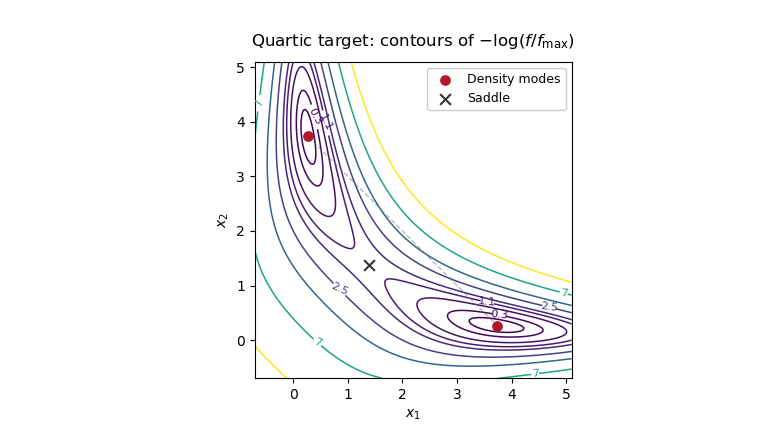

# Paper 208

↑ **Parent:** [Iii](../iii.md)

[https://www.maths.cam.ac.uk/postgrad/part-iii/files/pastpapers/2016/paper_208.pdf](https://www.maths.cam.ac.uk/postgrad/part-iii/files/pastpapers/2016/paper_208.pdf)

**Table of contents**

- [1](#1)
  - [1](#1/1)
    - [Solution](#1/1/solution)
    - [2](#1/1/2)
      - [Solution](#1/1/2/solution)
    - [3](#1/1/3)
      - [Solution](#1/1/3/solution)
    - [4](#1/1/4)
      - [Solution](#1/1/4/solution)
    - [5](#1/1/5)
      - [Solution](#1/1/5/solution)
    - [6](#1/1/6)
      - [Solution](#1/1/6/solution)
    - [7](#1/1/7)
      - [Solution](#1/1/7/solution)
- [2](#2)
  - [1](#2/1)
    - [Solution](#2/1/solution)
  - [2](#2/2)
    - [Solution](#2/2/solution)
    - [3](#2/2/3)
      - [Solution](#2/2/3/solution)
- [3](#3)
  - [1](#3/1)
    - [Solution](#3/1/solution)
  - [2](#3/2)
    - [Solution](#3/2/solution)
  - [3](#3/3)
    - [Solution](#3/3/solution)
    - [4](#3/3/4)
      - [Solution](#3/3/4/solution)
- [4](#4)
  - [a](#4/a)
    - [Solution](#4/a/solution)
  - [b](#4/b)
    - [Solution](#4/b/solution)
  - [c](#4/c)
    - [Solution](#4/c/solution)
  - [d](#4/d)
    - [Solution](#4/d/solution)
- [5](#5)
  - [a](#5/a)
    - [Solution](#5/a/solution)
  - [b](#5/b)
    - [Solution](#5/b/solution)
  - [c](#5/c)
    - [Solution](#5/c/solution)
  - [d](#5/d)
    - [Solution](#5/d/solution)
- [6](#6)
  - [a](#6/a)
    - [Solution](#6/a/solution)
  - [b](#6/b)
    - [Solution](#6/b/solution)
  - [c](#6/c)
    - [Solution](#6/c/solution)
  - [d](#6/d)
    - [Solution](#6/d/solution)

## 1

↑ **Parent:** [Paper 208](paper-208.md)

<h3 id="1/1">1</h3>

↑ **Parent:** [1](#1)

<h4 id="1/1/solution">Solution</h4>

↑ **Parent:** [1](#1/1)

A [weak white noise](../../../time-series.md#weak-white-noise) is a sequence with mean zero, a common finite [variance](../../../variance.md) $\sigma^2$, and $\operatorname{Cov}(\eta_s,\eta_t)=0$ for $s\ne t$. A [strong white noise](../../../time-series.md#strong-white-noise) is a sequence of [independent and identically distributed random variables](../../../random-variable.md#independent-and-identically-distributed-random-variables) with mean zero and finite [variance](../../../variance.md). [Strong white noise](../../../time-series.md#strong-white-noise) is therefore [weak white noise](../../../time-series.md#weak-white-noise), but the converse need not hold. Neither definition, by itself, requires a [Gaussian distribution](../../../probability-theory.md#normal-distribution).

<h4 id="1/1/2">2</h4>

↑ **Parent:** [1](#1/1)

<h5 id="1/1/2/solution">Solution</h5>

↑ **Parent:** [2](#1/1/2)

For the spectral questions take the unique [weakly stationary process](../../../time-series.md#weakly-stationary-process) solving the equation, as is customary for a stable [autoregressive moving-average model](../../../time-series.md#autoregressive-moving-average-model). The equation alone also admits nonstationary solutions differing by $C4^{-t}$, for which a [spectral density of a stationary process](../../../time-series.md#spectral-density-of-a-stationary-process) need not exist. Let $B$ be the [backshift operator](../../../time-series.md#backshift-operator). Since the autoregressive root is $4$, the stationary solution is causal and

$$
X_t=\frac{1-3B}{1-B/4}\eta_t.
$$

Using the convention $\gamma(h)=\int_{-\pi}^{\pi}e^{ih\lambda}f(\lambda)\,d\lambda$, the [spectral density of a stationary process](../../../time-series.md#spectral-density-of-a-stationary-process) is

$$
\boxed{f_X(\lambda)=\frac1{2\pi}\frac{|1-3e^{-i\lambda}|^2}{|1-e^{-i\lambda}/4|^2}
=\frac1{2\pi}\frac{10-6\cos\lambda}{17/16-(\cos\lambda)/2}.}
$$

The stationary mean is zero, since $\mu-\mu/4=0$.

<h4 id="1/1/3">3</h4>

↑ **Parent:** [1](#1/1)

<h5 id="1/1/3/solution">Solution</h5>

↑ **Parent:** [3](#1/1/3)

Here the [innovation process](../../../time-series.md#innovation-process) consists of [linear innovations](../../../time-series.md#linear-innovation-process), the linear one-step prediction errors: $\varepsilon_t=X_t-\operatorname{proj}_{\mathcal H_{t-1}}X_t$, where $\mathcal H_{t-1}$ is the closed linear span of the past $X$'s in $L^2$. For [Gaussian processes](../../../stochastic-process.md#gaussian-process) this is also the [conditional expectation](../../../measure-theory.md#conditional-expectation) prediction error. For general non-Gaussian [strong white noise](../../../time-series.md#strong-white-noise) these two notions can differ.

**The given $\eta_t$ is not the [linear innovation process](../../../time-series.md#linear-innovation-process).** The moving-average factor has its zero at $1/3$, inside the unit disk, and is noninvertible as a causal moving-average filter. The identity

$$
|1-3e^{-i\lambda}|^2=9|1-e^{-i\lambda}/3|^2
$$

is the [moving-average root reflection](../../../time-series.md#moving-average-root-reflection) that places this zero outside the unit disk. Thus the causal invertible representation has innovation [variance](../../../variance.md) $9$, rather than the given [variance](../../../variance.md) $1$.

For an explicit verification, define

$$
\varepsilon_t=\frac{1-3B}{1-B/3}\eta_t
=\eta_t-8\sum_{j\geq1}3^{-j}\eta_{t-j}.
$$

The filter has constant squared modulus $9$, so $\varepsilon$ is [weak white noise](../../../time-series.md#weak-white-noise) with [variance](../../../variance.md) $9$. The new moving-average factor has root $3$ and is invertible, while its autoregressive factor is causal. Hence the past spans of $X$ and $\varepsilon$ agree, and $X_t-\varepsilon_t$ belongs to that past span. Orthogonality of $\varepsilon_t$ to past $\varepsilon$ therefore identifies it as the [linear innovation process](../../../time-series.md#linear-innovation-process). The [variance](../../../variance.md) difference proves that it cannot be $\eta_t$. If the original noise is Gaussian, the new [linear innovations](../../../time-series.md#linear-innovation-process) are independent Gaussian variables; without Gaussianity they need only be [uncorrelated random variables](../../../variance.md#uncorrelated-random-variables).

<h4 id="1/1/4">4</h4>

↑ **Parent:** [1](#1/1)

<h5 id="1/1/4/solution">Solution</h5>

↑ **Parent:** [4](#1/1/4)

The root-reflected, invertible [autoregressive moving-average model](../../../time-series.md#autoregressive-moving-average-model) is

$$
\boxed{X_t-\tfrac14X_{t-1}=\varepsilon_t-\tfrac13\varepsilon_{t-1},\qquad\operatorname{Var}(\varepsilon_t)=9.}
$$

This follows by multiplying the filter identity for $\varepsilon$ by $1-B/3$. Its moving-average root $3$ and autoregressive root $4$ are both outside the unit disk. Thus it is the representation in terms of the [innovation process](../../../time-series.md#innovation-process), rather than merely another noise representation with the same spectrum.

<h4 id="1/1/5">5</h4>

↑ **Parent:** [1](#1/1)

<h5 id="1/1/5/solution">Solution</h5>

↑ **Parent:** [5](#1/1/5)

Expanding the stable autoregressive inverse gives the [infinite moving-average representation](../../../time-series.md#infinite-moving-average-representation) in [linear innovations](../../../time-series.md#linear-innovation-process):

$$
\frac{1-B/3}{1-B/4}=1+\sum_{j\geq1}\left(4^{-j}-\tfrac13\,4^{-(j-1)}\right)B^j
=1-\sum_{j\geq1}\frac{B^j}{3\cdot4^j}.
$$

Therefore

$$
\boxed{X_t=\varepsilon_t-\sum_{j\geq1}\frac{\varepsilon_{t-j}}{3\cdot4^j}.}
$$

For comparison, the causal representation in the originally supplied noise is

$$
\boxed{X_t=\eta_t-11\sum_{j\geq1}4^{-j}\eta_{t-j}.}
$$

Both converge in $L^2$, since their coefficients are square summable. The second is causal, but its driving noise is not the linear [innovation process](../../../time-series.md#innovation-process).

<h4 id="1/1/6">6</h4>

↑ **Parent:** [1](#1/1)

<h5 id="1/1/6/solution">Solution</h5>

↑ **Parent:** [6](#1/1/6)

Use the original-noise coefficients $\psi_0=1$ and $\psi_j=-11\cdot4^{-j}$ for $j\geq1$. The [autocovariance function](../../../time-series.md#autocovariance) of a causal linear process is $\gamma_X(h)=\sum_{j\geq0}\psi_j\psi_{j+|h|}$, since the original noise has [variance](../../../variance.md) $1$. Thus

$$
\gamma_X(0)=1+121\sum_{j\geq1}16^{-j}=1+\frac{121}{15}=\frac{136}{15}.
$$

For $h\geq1$,

$$
\gamma_X(h)=4^{-h}\left(-11+121\sum_{j\geq1}16^{-j}\right)=-\frac{44}{15}\,4^{-h}.
$$

By [covariance](../../../variance.md#covariance) symmetry,

$$
\boxed{\gamma_X(h)=\begin{cases}136/15,&h=0,\\-(44/15)4^{-|h|},&h\ne0.\end{cases}}
$$

In particular, all nonzero-lag [covariances](../../../variance.md#covariance) are negative, despite the positive autoregressive coefficient.

<h4 id="1/1/7">7</h4>

↑ **Parent:** [1](#1/1)

<h5 id="1/1/7/solution">Solution</h5>

↑ **Parent:** [7](#1/1/7)

The printed [strong white noise](../../../time-series.md#strong-white-noise) assumption does not imply a [normal distribution](../../../probability-theory.md#normal-distribution) or even a finite fourth moment. Thus it does not, by itself, determine the [covariance](../../../variance.md#covariance) of a quadratic transform. We give the intended Gaussian calculation, and then the general finite-fourth-moment answer.

If $\eta$ is Gaussian, $X$ is a centered [Gaussian process](../../../stochastic-process.md#gaussian-process). Put $v=\gamma_X(0)=136/15$ and $U_t=X_t/\sqrt v$. Since $H_1(u)=u$ and $H_2(u)=u^2-1$, the centered transform is

$$
Z_t-EZ_t=b\sqrt v\,H_1(U_t)+cvH_2(U_t),\qquad EZ_t=a+cv.
$$

The supplied [Hermite polynomial](../../../numerical-analysis.md#hermite-polynomial) identity makes the cross terms vanish and gives

$$
\boxed{\gamma_Z(h)=b^2\gamma_X(h)+2c^2\gamma_X(h)^2.}
$$

Equivalently,

$$
\gamma_Z(0)=b^2\frac{136}{15}+2c^2\left(\frac{136}{15}\right)^2,
$$

$$
\gamma_Z(h)=-\frac{44b^2}{15}4^{-|h|}+2c^2\left(\frac{44}{15}\right)^2 16^{-|h|}\quad(h\ne0).
$$

The constant $a$ has no effect on [covariance](../../../variance.md#covariance).

For a general iid noise with $E\eta^4<\infty$, put $m_3=E\eta^3$ and $\kappa_4=E\eta^4-3$, its fourth [cumulant](../../../probability-theory.md#cumulant). [Independence](../../../random-variable.md#independent-random-variables) and expansion of third and fourth moments give, for $k=|h|$,

$$
\boxed{\gamma_Z(h)=b^2\gamma_X(h)+bc\,m_3M_k+c^2\left(2\gamma_X(h)^2+\kappa_4N_k\right),}
$$

where

$$
M_k=\sum_{j\geq0}\left(\psi_{j+k}\psi_j^2+\psi_{j+k}^2\psi_j\right),\qquad
N_k=\sum_{j\geq0}\psi_{j+k}^2\psi_j^2.
$$

Summing the [geometric series](../../../real-analysis.md#geometric-series) explicitly gives

$$
M_0=-\frac{2536}{63},\qquad N_0=\frac{14896}{255},
$$

$$
M_k=-\frac{2024}{63}4^{-k}+\frac{6292}{63}16^{-k},\qquad
N_k=\frac{45496}{255}16^{-k}\quad(k\geq1).
$$

The [covariance of quadratic transforms of a linear process](../../../time-series.md#covariance-of-quadratic-transforms-of-a-linear-process) follows from a fourth-moment expansion consisting of the three [Isserlis theorem](../../../probability-theory.md#isserlis-s-theorem) pairings, plus the fourth-[cumulant](../../../probability-theory.md#cumulant) contribution when all four noise indices coincide. The third-moment contribution similarly requires three coincident indices. This proves the general formula without assuming a [normal distribution](../../../probability-theory.md#normal-distribution). For [Gaussian white noise](../../../stochastic-process.md#gaussian-white-noise) $m_3=\kappa_4=0$, recovering the simpler answer. If $c\ne0$ and the noise has infinite fourth moment, $Z_t$ need not have finite [variance](../../../variance.md), so an [autocovariance function](../../../time-series.md#autocovariance) may not exist.

<h2 id="2">2</h2>

↑ **Parent:** [Paper 208](paper-208.md)

<h3 id="2/1">1</h3>

↑ **Parent:** [2](#2)

<h4 id="2/1/solution">Solution</h4>

↑ **Parent:** [1](#2/1)

For a causal [autoregressive model](../../../time-series.md#autoregressive-model) of order $p$, the population [partial autocorrelation function](../../../time-series.md#partial-autocorrelation-function) cuts off after lag $p$, whereas the [autocorrelation function](../../../time-series.md#autocorrelation) generally decays. For an invertible [moving-average model](../../../time-series.md#moving-average-model) of order $q$, the [autocorrelation function](../../../time-series.md#autocorrelation) cuts off after lag $q$, whereas the partial [correlation coefficients](../../../variance.md#pearson-correlation-coefficient) generally decay. For a mixed [autoregressive moving-average model](../../../time-series.md#autoregressive-moving-average-model), both generally decay. Exponential decay may alternate in sign or show damped oscillations. Sample [correlation coefficients](../../../variance.md#pearson-correlation-coefficient) only approximate these patterns, so isolated crossings of the significance bands are not exact order tests.

In PDF Figure 1, the [autocorrelation function](../../../time-series.md#autocorrelation) alternates sign, with a large negative lag-one [correlation coefficient](../../../variance.md#pearson-correlation-coefficient) and geometrically decreasing magnitude. The [partial autocorrelation function](../../../time-series.md#partial-autocorrelation-function) has essentially one substantial spike, negative at lag one and about $-0.8$; later values mostly lie within the displayed bands. Thus **a stationary [AR(1)](../../../time-series.md#autoregressive-process-of-order-one) with a negative coefficient is the natural first model**, with $\widehat\phi$ initially near $-0.8$. The trace fluctuates around an approximately constant mean and shows no evident deterministic trend.

Fit that model, compare nearby low-order alternatives using [likelihood function](../../../statistical-modelling.md#likelihood-function) and an [Akaike information criterion](../../../statistical-modelling.md#akaike-information-criterion) or [Bayesian information criterion](../../../statistical-modelling.md#bayesian-information-criterion), and inspect the residual [autocorrelation function](../../../time-series.md#autocorrelation) and residual [variance](../../../variance.md). A few small later [PACF](../../../time-series.md#partial-autocorrelation-function) spikes are expected in a plot with many lags. The roughly $\pm1.96/\sqrt T$ [white noise](../../../time-series.md#white-noise) bands are a guide, rather than simultaneous guarantees for every lag.

The sign alternation also suggests concentration of spectral power near the high-frequency end: the [AR(1)](../../../time-series.md#autoregressive-process-of-order-one) denominator $1+\phi^2-2\phi\cos\lambda$ is smallest near $\lambda=\pi$ when $\phi<0$. From estimated $\gamma(0)$ and lag-one [correlation coefficient](../../../variance.md#pearson-correlation-coefficient) one can estimate innovation [variance](../../../variance.md) as $\widehat\sigma_\varepsilon^2\approx\widehat\gamma(0)(1-\widehat\phi^2)$. The persistence parameter controls the decay rate and [long-run variance of a stationary process](../../../time-series.md#long-run-variance-of-a-stationary-process). These plots do not establish a [normal distribution](../../../probability-theory.md#normal-distribution), [independence](../../../random-variable.md#independent-random-variables), or the absence of nonlinear dependence; [correlation coefficients](../../../variance.md#pearson-correlation-coefficient) of squared residuals can provide a separate [variance](../../../variance.md) diagnostic.

<h3 id="2/2">2</h3>

↑ **Parent:** [2](#2)

<h4 id="2/2/solution">Solution</h4>

↑ **Parent:** [2](#2/2)

With angular frequency $\lambda$, the [periodogram](../../../time-series.md#periodogram) is

$$
\boxed{I_T(\lambda)=\frac1{2\pi T}\left|\sum_{t=1}^TX_te^{-it\lambda}\right|^2.}
$$

At [Fourier frequencies](../../../numerical-analysis.md#fourier-frequency) $2\pi j/T$ it is the squared modulus of the normalized [discrete Fourier transform](../../../numerical-analysis.md#discrete-fourier-transform). If a nonzero mean is unknown, subtract the [sample mean](../../../variance.md#sample-mean) first.

For a zero-mean [stationary process](../../../time-series.md#stationary-process), expanding the square gives

$$
EI_T(\lambda)=\frac1{2\pi}\sum_{|h|<T}\left(1-\frac{|h|}{T}\right)\gamma_X(h)e^{-ih\lambda}.
$$

Under absolute summability of the [covariances](../../../variance.md#covariance) this converges to the [spectral density of a stationary process](../../../time-series.md#spectral-density-of-a-stationary-process). Thus the [periodogram](../../../time-series.md#periodogram) is generally biased at finite $T$, but asymptotically unbiased under this [short-memory time series](../../../time-series.md#short-memory-time-series) condition.

It is nevertheless **not a pointwise estimator with [statistical consistency](../../../statistical-inference.md#consistency-statistics) unless it is smoothed**. For Gaussian [white noise](../../../time-series.md#white-noise), at a nonzero Fourier frequency other than the Nyquist frequency, the real and imaginary Fourier components are independent normal variables. Exactly,

$$
I_T(2\pi j/T)\overset d=f\,\operatorname{Exp}(1),\qquad\operatorname{Var}(I_T)=f^2,
$$

where $f=\sigma^2/(2\pi)$. The [variance](../../../variance.md) does not decrease with $T$. Under usual [short-memory time series](../../../time-series.md#short-memory-time-series) assumptions the same exponential limit is asymptotic for general processes. Averaging nearby frequencies or using a lag-window estimator reduces [variance](../../../variance.md); a frequency bandwidth tending to zero while $T$ times that bandwidth tends to infinity can give [statistical consistency](../../../statistical-inference.md#consistency-statistics). The raw plot remains useful for detecting strong periodic peaks, but increasing the record length alone does not remove its pointwise noise.

<h4 id="2/2/3">3</h4>

↑ **Parent:** [2](#2/2)

<h5 id="2/2/3/solution">Solution</h5>

↑ **Parent:** [3](#2/2/3)

First, the absolute values in the printed limit are an error: the correct [long-run variance of a stationary process](../../../time-series.md#long-run-variance-of-a-stationary-process) is the signed sum of [autocovariances](../../../time-series.md#autocovariance). Directly,

$$
\operatorname{Var}(\overline X_T)=\frac1{T^2}\sum_{s,t=1}^T\gamma_X(t-s),
$$

so

$$
T\operatorname{Var}(\overline X_T)=\sum_{h\in\mathbb Z}\left(1-\frac{|h|}{T}\right)_+\gamma_X(h).
$$

Each coefficient tends to $1$ and has absolute value at most $1$. Absolute summability and the [dominated convergence theorem](../../../measure-theory.md#dominated-convergence-theorem) therefore give

$$
\boxed{T\operatorname{Var}(\overline X_T)\longrightarrow\sum_{h\in\mathbb Z}\gamma_X(h)=2\pi f_X(0).}
$$

The sum of absolute values is an upper bound, not the general limit. For a concrete counterexample to the printed assertion, take $X_t=\eta_t-\eta_{t-1}$ with unit-[variance](../../../variance.md) iid noise. Then $\gamma(0)=2$, $\gamma(\pm1)=-1$, and other [covariances](../../../variance.md#covariance) vanish. The absolute sum is $4$, but $\overline X_T=(\eta_T-\eta_0)/T$, so $T\operatorname{Var}(\overline X_T)=2/T\to0$.

For correlated data the [central limit theorem](../../../convergence-of-random-variables.md#central-limit-theorem) can still hold under suitable [strong mixing of a stationary process](../../../time-series.md#strong-mixing-of-a-stationary-process) and moment conditions, but the limiting [variance](../../../variance.md) is the [long-run variance of a stationary process](../../../time-series.md#long-run-variance-of-a-stationary-process), rather than the one-observation [variance](../../../variance.md). When it is positive,

$$
\sqrt T(\overline X_T-\mu)\Longrightarrow N\left(0,\sum_h\gamma_X(h)\right).
$$

Positive serial dependence usually increases the [standard error](../../../statistical-inference.md#standard-error), while negative dependence can reduce it. The approximate [effective sample size of a stationary sample](../../../time-series.md#effective-sample-size-of-a-stationary-sample) is $T\gamma_X(0)/\sum_h\gamma_X(h)$ when that denominator is positive. A [long-memory time series](../../../time-series.md#long-memory-time-series) can require a different normalization or a different limit law. Absolute [covariance](../../../variance.md#covariance) summability alone does not prove a [CLT](../../../convergence-of-random-variables.md#central-limit-theorem): if $X_t=V\eta_t$ with a common independent random scale $V$ taking values $1$ and $2$ with equal probabilities and iid $\eta_t$ with the [standard normal distribution](../../../probability-theory.md#standard-normal-distribution), the off-diagonal [covariances](../../../variance.md#covariance) are zero, yet $\sqrt T\overline X_T$ has the nonnormal scale-mixture law $V N(0,1)$. The example is not an [ergodic stationary process](../../../time-series.md#ergodic-stationary-process). If the [long-run variance of a stationary process](../../../time-series.md#long-run-variance-of-a-stationary-process) is zero, the usual nondegenerate square-root-$T$ [CLT](../../../convergence-of-random-variables.md#central-limit-theorem) is unavailable.

For the causal [AR(1)](../../../time-series.md#autoregressive-process-of-order-one), $|\phi|<1$ and

$$
\boxed{\mu=\frac{m}{1-\phi},\qquad X_t\mid X_{t-1}=x\sim N(m+\phi x,\sigma_\varepsilon^2).}
$$

The [conditional distribution](../../../probability-theory.md#conditional-distribution) follows because the current innovation is independent of the past.

For a fixed known $\phi$, condition on the observed $X_1$ and use the $n=T-1$ transitions $t=2,\ldots,T$. Their [conditional maximum likelihood](../../../statistical-modelling.md#conditional-maximum-likelihood) criterion is, up to constants,

$$
-\frac1{2\sigma_\varepsilon^2}\sum_{t=2}^T\left(X_t-\phi X_{t-1}-(1-\phi)\mu\right)^2.
$$

Differentiating in $\mu$ yields

$$
\boxed{\widehat\mu=\frac{\sum_{t=2}^T(X_t-\phi X_{t-1})}{(T-1)(1-\phi)}.}
$$

Since $X_t-\phi X_{t-1}=(1-\phi)\mu+\varepsilon_t$,

$$
\widehat\mu-\mu=\frac{\sum_{t=2}^T\varepsilon_t}{(T-1)(1-\phi)}.
$$

Thus it is an [unbiased estimator](../../../statistical-modelling.md#unbiased-estimator), even conditionally on $X_1$, and

$$
\boxed{\operatorname{Var}(\widehat\mu)=\frac{\sigma_\varepsilon^2}{(T-1)(1-\phi)^2}.}
$$

It has [statistical consistency](../../../statistical-inference.md#consistency-statistics) with [mean-square convergence](../../../convergence-of-random-variables.md#convergence-in-l2), and the iid-noise [strong law of large numbers](../../../convergence-of-random-variables.md#strong-law-of-large-numbers) also gives almost-sure [statistical consistency](../../../statistical-inference.md#consistency-statistics). Its [conditional distribution](../../../probability-theory.md#conditional-distribution) is exactly normal with the displayed mean and [variance](../../../variance.md). If $X_0$ is also observed and all $T$ transitions are used, replace $T-1$ by $T$.

The fixed-$\phi$ qualification is necessary for the exact finite-sample claims. If $\phi$ is jointly estimated, conditional [likelihood function](../../../statistical-modelling.md#likelihood-function) is [linear regression](../../../linear-regression.md) with an intercept: writing $\bar X_-=n^{-1}\sum_{t=2}^TX_{t-1}$ and $\bar X_+=n^{-1}\sum_{t=2}^TX_t$, the unconstrained estimators are

$$
\widehat\phi=\frac{\sum_{t=2}^T(X_{t-1}-\bar X_-)(X_t-\bar X_+)}{\sum_{t=2}^T(X_{t-1}-\bar X_-)^2},\qquad
\widehat m=\bar X_+-\widehat\phi\bar X_-,\qquad\widehat\mu=\frac{\widehat m}{1-\widehat\phi}.
$$

This ratio is not generally an [unbiased estimator](../../../statistical-modelling.md#unbiased-estimator) and does not have the preceding finite-sample [variance](../../../variance.md). Under the usual stationary regression conditions it has [statistical consistency](../../../statistical-inference.md#consistency-statistics); its [asymptotic variance](../../../statistical-modelling.md#asymptotic-variance) is $\sigma_\varepsilon^2/(1-\phi)^2$. Indeed, it differs from $\bar X_+$ by $\widehat\phi(X_T-X_1)/(n(1-\widehat\phi))$, an asymptotically negligible endpoint term. Profiling an unknown innovation [variance](../../../variance.md) does not change the fixed-$\phi$ estimate of $\mu$.

<h2 id="3">3</h2>

↑ **Parent:** [Paper 208](paper-208.md)

<h3 id="3/1">1</h3>

↑ **Parent:** [3](#3)

<h4 id="3/1/solution">Solution</h4>

↑ **Parent:** [1](#3/1)

The labels in PDF Figure 2 match as follows:

$$
\boxed{1\longleftrightarrow c,\qquad2\longleftrightarrow d,\qquad3\longleftrightarrow a,\qquad4\longleftrightarrow b.}
$$

Series $1$ has a wandering level and an overall upward drift. Its empirical [autocorrelation function](../../../time-series.md#autocorrelation) stays close to $1$ and declines very slowly, matching panel $c$; this is characteristic of a trend or a record from a [unit-root autoregressive process](../../../time-series.md#unit-root-autoregressive-process). Such an empirical ACF is not a population stationary ACF if the underlying model is a [random walk](../../../markov-process.md#random-walk).

Series $2$ shows relatively smooth runs of adjacent observations on the same side of its level. Positive short-lag dependence emphasizes low frequencies, matching the decreasing spectrum $d$.

Series $3$ is rougher, with much more rapid fluctuation. Negative short-lag dependence emphasizes high frequencies, matching the increasing spectrum $a$. A negative-coefficient [AR(1)](../../../time-series.md#autoregressive-process-of-order-one), for example, has this type of spectrum; the figure does not uniquely identify its exact order or parameters.

Series $4$ has conspicuous [seasonality](../../../time-series.md#seasonality). Its [autocorrelation function](../../../time-series.md#autocorrelation) should alternate between positive peaks at full seasonal periods and negative troughs between them, matching $b$. Here “characteristic function” is used descriptively for an ACF or spectrum, rather than for the probability-theoretic [characteristic function](../../../probability-theory.md#characteristic-function) of a random variable.

<h3 id="3/2">2</h3>

↑ **Parent:** [3](#3)

<h4 id="3/2/solution">Solution</h4>

↑ **Parent:** [2](#3/2)

A [nonstationary process](../../../time-series.md#nonstationary-process) has a statistical law that changes with the time origin. In the weak sense, this includes a time-dependent mean or [variance](../../../variance.md), or a [covariance](../../../variance.md#covariance) that depends on the two times separately rather than only on their lag. A [strictly stationary process](../../../time-series.md#strictly-stationary-process) requires invariance of every [finite-dimensional distribution](../../../stochastic-process.md#finite-dimensional-distribution) under a common time shift.

In the preceding plots, series $1$ suggests a stochastic trend or changing level, and series $4$ suggests a deterministic seasonal mean. These are the intended nonstationary examples. A plot alone cannot prove either conclusion: in particular, a stationary random-phase [sinusoid](../../../geometry-and-topology.md#sinusoid) can have a seasonal-looking trace and an oscillatory ACF. The interpretation of series $4$ as nonstationary concerns a seasonal mean tied to calendar time.

Three standard responses are to remove a fitted deterministic trend or seasonal mean; to use regular or seasonal [differencing](../../../time-series.md#differencing) for an appropriate trend or seasonal component; and to stabilize a changing [variance](../../../variance.md) by a transformation or explicit seasonal scale model. For example, logarithms or a [Box–Cox transformation](../../../statistical-modelling.md#box-cox-transformation) can address level-dependent [variance](../../../variance.md). The operation should match the source of nonstationarity; [differencing](../../../time-series.md#differencing) a varying [variance](../../../variance.md) does not generally make it stationary.

<h3 id="3/3">3</h3>

↑ **Parent:** [3](#3)

<h4 id="3/3/solution">Solution</h4>

↑ **Parent:** [3](#3/3)

Put $c_t=\cos(2\pi t/S)$ and assume $\sigma^2>0$. Then

$$
EY_t=c_t,\quad\operatorname{Cov}(Y_t,Y_{t-h})=\sigma^2\mathbf1_{\{h=0\}},
$$

$$
EZ_t=0,\quad\operatorname{Cov}(Z_t,Z_{t-h})=\sigma^2c_t^2\mathbf1_{\{h=0\}}.
$$

Thus $Y$ generally has a periodic mean, and $Z$ generally has a periodic [variance](../../../variance.md). The edge cases allowed by $S\in\mathbb N^*$ matter: $Y$ is stationary when $S=1$, because the mean is then constant, and $Z$ is stationary for $S=1$ or $S=2$. In the latter case multiplying iid centered [Gaussian white noise](../../../stochastic-process.md#gaussian-white-noise) by $(-1)^t$ leaves its iid distribution unchanged. For every $S\geq3$, $c_0^2=1$ but $c_1^2<1$, so $Z$ is nonstationary. For $S>1$, $Y$ is nonstationary because $c_t$ is not constant.

Use the [seasonal difference operator](../../../time-series.md#seasonal-difference-operator) $\Delta_S=1-B^S$. Since $c_t=c_{t-S}$,

$$
\boxed{\Delta_SY_t=\varepsilon_t-\varepsilon_{t-S}.}
$$

This is a stationary [moving-average model](../../../time-series.md#moving-average-model) of iid [Gaussian white noise](../../../stochastic-process.md#gaussian-white-noise). Its [covariance](../../../variance.md#covariance) is $2\sigma^2$ at lag $0$, $-\sigma^2$ at lags $\pm S$, and zero otherwise.

For the [variance](../../../variance.md)-modulated process the same operation gives

$$
\boxed{\Delta_SZ_t=c_t(\varepsilon_t-\varepsilon_{t-S}).}
$$

Its [variance](../../../variance.md) is $2\sigma^2c_t^2$ and its [covariance](../../../variance.md#covariance) at lag $S$ is $-\sigma^2c_t^2$. Therefore it remains nonstationary for $S\geq3$, and the operation doubles the marginal [variance](../../../variance.md) at nonzero seasons. [Seasonal differencing does not remove periodic variance](../../../time-series.md#seasonal-differencing-does-not-remove-periodic-variance): it removes a periodic mean, but the periodic [variance](../../../variance.md) generally remains. Practical alternatives are a periodic model or seasonal [variance](../../../variance.md) standardization; at seasons with $c_t=0$ the observations are deterministically zero, so division by $c_t$ is not possible there. For the already stationary special cases $S=1,2$, filtering preserves stationarity.

A [periodically correlated process](../../../time-series.md#periodically-correlated-process) with period $S$ has its mean and two-time [covariance](../../../variance.md#covariance) unchanged when both times are shifted by $S$. For $Z$, the mean is zero and

$$
\operatorname{Cov}(Z_{t+S},Z_{s+S})=\sigma^2c_{t+S}c_{s+S}\mathbf1_{\{t=s\}}
=\operatorname{Cov}(Z_t,Z_s).
$$

Hence $Z$ is a [periodically correlated process](../../../time-series.md#periodically-correlated-process). Its [covariance](../../../variance.md#covariance) period can be smaller than $S$: when $S$ is even, $c_{t+S/2}^2=c_t^2$, so $S/2$ is already a [covariance](../../../variance.md#covariance) period.

<h4 id="3/3/4">4</h4>

↑ **Parent:** [3](#3/3)

<h5 id="3/3/4/solution">Solution</h5>

↑ **Parent:** [4](#3/3/4)

Use the usual normalization that $\varepsilon_t$ is mean-zero unit-[variance](../../../variance.md) [white noise](../../../time-series.md#white-noise) orthogonal to the past, and extend $\phi(\nu),\sigma(\nu)$ periodically in $\nu$. A nondegenerate causal [periodic autoregressive model of order one](../../../time-series.md#periodic-autoregressive-model-of-order-one) requires $|\prod_{\nu=1}^T\phi(\nu)|<1$. Write $V_\nu=\gamma_\nu(0)$, with season indices understood modulo $T$.

For $h\geq1$, multiply the recursion by $X_{nT+\nu-h}$ and use orthogonality of the current innovation to the past. The [periodic Yule-Walker equations](../../../time-series.md#periodic-yule-walker-equations) are

$$
\boxed{\gamma_\nu(h)=\phi(\nu)\gamma_{\nu-1}(h-1),\qquad h\geq1.}
$$

At lag zero, expansion of the squared recursion gives

$$
\boxed{V_\nu=\phi(\nu)^2V_{\nu-1}+\sigma(\nu)^2.}
$$

In particular, $\gamma_\nu(1)=\phi(\nu)V_{\nu-1}$, so an equivalent [variance](../../../variance.md) equation is $V_\nu=\phi(\nu)\gamma_\nu(1)+\sigma(\nu)^2$. Negative lags are obtained from the given symmetry $\gamma_\nu(-h)=\gamma_{\nu+h}(h)$.

Replacing [covariances](../../../variance.md#covariance) by their sample versions gives

$$
\boxed{\widehat\phi(\nu)=\frac{\widehat\gamma_\nu(1)}{\widehat\gamma_{\nu-1}(0)},\qquad
\widehat\sigma(\nu)=\left(\widehat\gamma_\nu(0)-\frac{\widehat\gamma_\nu(1)^2}{\widehat\gamma_{\nu-1}(0)}\right)^{1/2}.}
$$

Take the nonnegative scale and require a positive estimated predecessor [variance](../../../variance.md). Using matched seasonal sample [covariance](../../../variance.md#covariance) matrices makes the quantity under the square root nonnegative by [Cauchy-Schwarz inequality](../../../probability-and-statistics.md#cauchy-schwarz-inequality); with unmatched [covariance](../../../variance.md#covariance) estimates one can instead fit seasonal [ordinary least squares](../../../statistical-modelling.md#ordinary-least-squares) and use the nonnegative residual [variance](../../../variance.md). [Statistical consistency](../../../statistical-inference.md#consistency-statistics) of the [covariance](../../../variance.md#covariance) estimates gives [statistical consistency](../../../statistical-inference.md#consistency-statistics) of these plug-in estimators. If the driving noise [variance](../../../variance.md) were not normalized to $1$, the equations would identify $\sigma(\nu)^2\operatorname{Var}(\varepsilon_t)$, not the two scales separately.

<h2 id="4">4</h2>

↑ **Parent:** [Paper 208](paper-208.md)

<h3 id="4/a">a</h3>

↑ **Parent:** [4](#4)

<h4 id="4/a/solution">Solution</h4>

↑ **Parent:** [A](#4/a)

Draw independent $U_1,U_2$ uniformly on $(0,1)$, and set

$$
R=\sqrt{-2\log U_1},\qquad\Theta=2\pi U_2,
$$

$$
\boxed{X_1=R\cos\Theta,\qquad X_2=R\sin\Theta.}
$$

This is the [Box-Muller transform](../../../probability-and-statistics.md#box-muller-transform). The endpoint $U_1=0$ has probability zero; an implementation should avoid evaluating its logarithm.

For $r\geq0$, $P(R\leq r)=1-e^{-r^2/2}$, so $R$ has density $re^{-r^2/2}$. It is independent of the angle, which has a [uniform distribution](../../../continuous-probability-distribution.md#continuous-uniform-distribution) on $[0,2\pi)$, and their joint density is $(2\pi)^{-1}re^{-r^2/2}$. Transforming to Cartesian coordinates divides by the polar-coordinate Jacobian $r$, yielding

$$
f_{X_1,X_2}(x_1,x_2)=\frac1{2\pi}e^{-(x_1^2+x_2^2)/2}=\varphi(x_1)\varphi(x_2).
$$

Thus the outputs are [independent random variables](../../../random-variable.md#independent-random-variables) with the [standard normal distribution](../../../probability-theory.md#standard-normal-distribution), proving the algorithm.

<h3 id="4/b">b</h3>

↑ **Parent:** [4](#4)

<h4 id="4/b/solution">Solution</h4>

↑ **Parent:** [B](#4/b)

Let $p=\Phi(1)-\Phi(0)$, and write $\varphi$ for the [standard normal distribution](../../../probability-theory.md#standard-normal-distribution) density. For [importance sampling](../../../probability-and-statistics.md#importance-sampling), choose the proposal density $q(x)=\mathbf1_{[0,1]}(x)$, namely the [uniform distribution](../../../continuous-probability-distribution.md#continuous-uniform-distribution) on the target interval. Its [importance sampling](../../../probability-and-statistics.md#importance-sampling) weight is

$$
\boxed{w(x)=\frac{f(x)}{q(x)}=\frac{\varphi(x)}p\quad(0\leq x\leq1).}
$$

For iid uniform draws $U_1,\ldots,U_N$,

$$
\boxed{\widehat\mu_{\mathrm{IS}}=\frac1N\sum_{i=1}^N\frac{U_i\varphi(U_i)}p}
$$

is an [unbiased estimator](../../../statistical-modelling.md#unbiased-estimator) of the target mean, since its expectation integrates $xf(x)$. If one chooses not to evaluate $p$, the [self-normalized importance sampling](../../../probability-and-statistics.md#self-normalized-importance-sampling) alternative $\sum U_i\varphi(U_i)/\sum\varphi(U_i)$ has [statistical consistency](../../../statistical-inference.md#consistency-statistics), but generally is not an [unbiased estimator](../../../statistical-modelling.md#unbiased-estimator).

Alternatively, draw [independent random variables](../../../random-variable.md#independent-random-variables) $V_1,\ldots,V_N$ with the [standard normal distribution](../../../probability-theory.md#standard-normal-distribution), let $A_i=\mathbf1_{\{0\leq V_i\leq1\}}$ and $K=\sum A_i$, and use

$$
\boxed{\widehat\mu_{\mathrm{keep}}=\frac{\sum_iA_iV_i}{K}\quad(K>0).}
$$

Conditionally on $K=k>0$, the retained draws are iid from the [truncated normal distribution](../../../probability-theory.md#truncated-normal-distribution), so their average is an [unbiased estimator](../../../statistical-modelling.md#unbiased-estimator) with [variance](../../../variance.md) $\tau^2/k$, where $\tau^2$ is its [variance](../../../variance.md). If $K=0$ the ratio is undefined; one can continue drawing until a prescribed number of retained observations is obtained.

Here [importance sampling](../../../probability-and-statistics.md#importance-sampling) uses every draw inside the interval, whereas only $p\approx0.3413$ of the normal proposals are retained. The advantage can also be quantified. Integration using $\varphi'(x)=-x\varphi(x)$ gives

$$
\mu=\frac{\varphi(0)-\varphi(1)}p\approx0.459862,
\qquad\tau^2=1-\frac{\varphi(1)}p-\mu^2\approx0.079652.
$$

For uniform [importance sampling](../../../probability-and-statistics.md#importance-sampling),

$$
N\operatorname{Var}(\widehat\mu_{\mathrm{IS}})=\frac1{p^2}\int_0^1x^2\varphi(x)^2\,dx-\mu^2\approx0.047336.
$$

For the retained-draw ratio with a fixed total proposal budget, its [asymptotic variance](../../../statistical-modelling.md#asymptotic-variance) coefficient is $\tau^2/p\approx0.233347$. Thus this importance choice has substantially smaller error for the same proposal count; it also avoids wasting about two thirds of the [standard normal distribution](../../../probability-theory.md#standard-normal-distribution) draws. This comparison is specific to this well-matched [importance sampling](../../../probability-and-statistics.md#importance-sampling) proposal; arbitrary proposal choices do not share this guarantee.

<h3 id="4/c">c</h3>

↑ **Parent:** [4](#4)

<h4 id="4/c/solution">Solution</h4>

↑ **Parent:** [C](#4/c)

Use the [spectral theorem for real symmetric matrices](../../../linear-algebra.md#spectral-theorem-for-real-symmetric-matrices) to write $\Sigma=Q\Lambda Q^T$, with $Q$ orthogonal and $\Lambda=\operatorname{diag}(\lambda_1,\ldots,\lambda_d)$, $\lambda_i\geq0$. Set $L=Q\Lambda^{1/2}$ and generate

$$
\boxed{X=\mu+LZ,\qquad Z=(X_1,\ldots,X_d)^T\sim N_d(0,I).}
$$

Then $LL^T=\Sigma$. The [characteristic function](../../../probability-theory.md#characteristic-function) is

$$
E e^{it^TX}=e^{it^T\mu}E e^{i(L^Tt)^TZ}
=\exp\left(it^T\mu-\tfrac12t^T\Sigma t\right),
$$

which identifies the [multivariate normal distribution](../../../probability-and-statistics.md#multivariate-normal-distribution) $N_d(\mu,\Sigma)$. Equivalently, every linear combination is normal, with the required mean and [variance](../../../variance.md). A [Cholesky decomposition](../../../linear-algebra.md#cholesky-decomposition) can be used for a [positive-definite matrix](../../../linear-algebra.md#positive-definite-matrix). The spectral construction also works for singular $\Sigma$, producing a degenerate [Gaussian distribution](../../../probability-theory.md#normal-distribution) on an [affine subspace](../../../vector-space.md#affine-subspace); in that case there need not be a density on all of $\mathbb R^d$.

<h3 id="4/d">d</h3>

↑ **Parent:** [4](#4)

<h4 id="4/d/solution">Solution</h4>

↑ **Parent:** [D](#4/d)

Use $v=\sigma^2$ as the [variance](../../../variance.md) parameter, with prior density relative to $d\mu\,dv$. Let $\bar x=n^{-1}\sum x_i$ and $S=\sum(x_i-\bar x)^2$. Multiplying the prior by the [likelihood function](../../../statistical-modelling.md#likelihood-function) gives the unnormalized [Bayesian posterior](../../../statistical-inference.md#bayesian-posterior)

$$
\boxed{\pi(\mu,v\mid x)\propto v^{-n/2-1}\exp\left[-\frac{S+n(\mu-\bar x)^2}{2v}\right],\qquad v>0.}
$$

The printed request for an “improper posterior” should not be read as a claim that this posterior is always improper. Although the prior is improper, integrating over $\mu$ gives a marginal kernel $v^{-(n+1)/2}e^{-S/(2v)}$, which is integrable exactly when $n>1$ and $S>0$. Under these usual nondegenerate-data conditions it is a proper posterior. If those conditions fail, the displayed kernel is improper and there is no posterior probability distribution for a sampler to target.

Completing the square and using the [inverse-gamma distribution](../../../continuous-probability-distribution.md#inverse-gamma-distribution) give the full conditionals

$$
\boxed{\mu\mid v,x\sim N(\bar x,v/n),\qquad v\mid\mu,x\sim\operatorname{IG}\left(\frac n2,\frac{S+n(\mu-\bar x)^2}{2}\right).}
$$

The [inverse-gamma distribution](../../../continuous-probability-distribution.md#inverse-gamma-distribution) convention is density proportional to $v^{-\alpha-1}e^{-\beta/v}$. Equivalently the precision satisfies

$$
\boxed{\tau=1/v\mid\mu,x\sim\operatorname{Gamma}\left(\frac n2,\frac{S+n(\mu-\bar x)^2}{2}\right),}
$$

using shape and rate, as in the question.

A [Gibbs sampler](../../../statistical-inference.md#gibbs-sampler) starts from $v^{(0)}>0$ and alternates

$$
\mu^{(k+1)}\sim N(\bar x,v^{(k)}/n),\qquad
\tau^{(k+1)}\sim\operatorname{Gamma}\left(n/2,\tfrac12\sum_i(x_i-\mu^{(k+1)})^2\right),\qquad
v^{(k+1)}=1/\tau^{(k+1)}.
$$

This is the [normal mean-variance posterior with a log-uniform variance prior](../../../probability-and-statistics.md#normal-mean-variance-posterior-with-a-log-uniform-variance-prior). For a marginal check, $v\mid x\sim\operatorname{IG}((n-1)/2,S/2)$: integrating out $\mu$ reduces the shape by $1/2$. This marginal shape is different from the full-conditional shape $n/2$.

<h2 id="5">5</h2>

↑ **Parent:** [Paper 208](paper-208.md)

<h3 id="5/a">a</h3>

↑ **Parent:** [5](#5)

<h4 id="5/a/solution">Solution</h4>

↑ **Parent:** [A](#5/a)

Let $Y_i$ be iid with density $f$, set $H_i=h(Y_i)$, and put $I=E_fh(Y)$ and $\tau^2=\operatorname{Var}_f(h(Y))$. The finite-second-moment assumption gives, for $\tau^2>0$,

$$
\sqrt N(\widehat I_N-I)\Longrightarrow N(0,\tau^2),\qquad\widehat I_N=N^{-1}\sum_{i=1}^NH_i.
$$

The [sample variance](../../../statistical-inference.md#sample-variance) $s_N^2=(N-1)^{-1}\sum_i(H_i-\widehat I_N)^2$ consistently estimates $\tau^2$. The [central limit theorem](../../../convergence-of-random-variables.md#central-limit-theorem) and [Slutsky theorem](../../../statistical-inference.md#slutsky-theorem) therefore give the asymptotic [confidence interval](../../../statistical-inference.md#confidence-interval)

$$
\boxed{\left[\widehat I_N-z_{1-\alpha/2}\frac{s_N}{\sqrt N},\quad\widehat I_N+z_{1-\alpha/2}\frac{s_N}{\sqrt N}\right].}
$$

Its confidence probability is approximately $1-\alpha$, conventionally written $100(1-\alpha)\%$; the printed $(1-\alpha)\%$ omits the factor $100$. For $\tau^2=0$, $h(Y)=I$ almost surely and the estimator has zero error. This interval concerns iid [Monte Carlo estimators](../../../probability-and-statistics.md#monte-carlo-estimator); correlated simulation output requires a [long-run variance of a stationary process](../../../time-series.md#long-run-variance-of-a-stationary-process) estimate instead of the iid [sample variance](../../../statistical-inference.md#sample-variance).

<h3 id="5/b">b</h3>

↑ **Parent:** [5](#5)

<h4 id="5/b/solution">Solution</h4>

↑ **Parent:** [B](#5/b)

The [support condition for importance sampling](../../../probability-and-statistics.md#support-condition-for-importance-sampling) is missing from the printed assertion. Assume $M>1$, $E_f|h|<\infty$, and $Mg(z)>f(z)$ for $f$-almost every $z$. For a proposal $Z\sim g$, rejection has conditional probability $1-f(Z)/(Mg(Z))$. Its unconditional probability is $(M-1)/M$, so the [conditional density](../../../probability-theory.md#conditional-density) of a rejected draw is

$$
r(z)=\frac{g(z)(1-f(z)/(Mg(z)))}{(M-1)/M}=\frac{Mg(z)-f(z)}{M-1}.
$$

Thus the rejected-draw weight is precisely $f(z)/r(z)$, and

$$
E_r\left[h(Z)\frac{(M-1)f(Z)}{Mg(Z)-f(Z)}\right]
=\int h(z)f(z)\,dz.
$$

Conditionally on any positive rejection count $n$ among $N$ independent proposals, the rejected locations have this iid [conditional density](../../../probability-theory.md#conditional-density). Hence

$$
\boxed{\frac1n\sum_{i=1}^nh(Z_i)\frac{(M-1)f(Z_i)}{Mg(Z_i)-f(Z_i)}}
$$

is an [unbiased estimator](../../../statistical-modelling.md#unbiased-estimator) conditionally on $n$, and therefore also conditionally on the event $0<n<N$. This is [importance sampling](../../../probability-and-statistics.md#importance-sampling) from the [rejected-proposal distribution](../../../probability-and-statistics.md#rejected-proposal-distribution).

The nonstrict assumption $f\leq Mg$ alone does not suffice: the rejected distribution may completely miss part of the target support. For example, let $g$ be uniform on $[0,1]$, $f(z)=2\mathbf1_{[0,1/2]}(z)$, $M=2$, and $h=1$. All rejected proposals lie in $(1/2,1]$, where $f=0$, so the displayed estimator is always $0$, whereas $E_fh=1$. This remains a counterexample after conditioning on $0<n<N$. A strict envelope, such as choosing $M$ larger than the essential supremum of $f/g$, repairs the missing support condition. Near-equality can still give high-[variance](../../../variance.md) weights, even when it remains an [unbiased estimator](../../../statistical-modelling.md#unbiased-estimator).

<h3 id="5/c">c</h3>

↑ **Parent:** [5](#5)

<h4 id="5/c/solution">Solution</h4>

↑ **Parent:** [C](#5/c)

On $x>0$, the exponential proposal is the proper density $g(x)=e^{-x}\mathbf1_{\{x>0\}}$; its integral is $1$. The word “improper” in the question is therefore not applicable on its stated positive support.

The target-to-proposal ratio is

$$
\frac{f(x)}{g(x)}=\sqrt{\frac2\pi}\exp(-x^2/2+x)
=\sqrt{\frac{2e}{\pi}}\exp\left[-\frac{(x-1)^2}{2}\right].
$$

Its maximum occurs at $x=1$, so the smallest valid envelope constant is

$$
\boxed{M=\sqrt{2e/\pi},\qquad P(\mathrm{accept})=1/M=\sqrt{\pi/(2e)}\approx0.76017>0.75.}
$$

One implementation draws $Z=-\log U_1$ and accepts it when $U_2\leq e^{-(Z-1)^2/2}$, for [independent random variables](../../../random-variable.md#independent-random-variables) with the [uniform distribution](../../../continuous-probability-distribution.md#continuous-uniform-distribution) on $(0,1)$. Accepted observations have the positive half-normal density by the usual [rejection sampling](../../../probability-and-statistics.md#rejection-sampling) calculation.

<h3 id="5/d">d</h3>

↑ **Parent:** [5](#5)

<h4 id="5/d/solution">Solution</h4>

↑ **Parent:** [D](#5/d)

The printed identity needs an expectation on its right-hand side. For fixed $r\geq1$, condition on $X_2,\ldots,X_r$ and use [independence](../../../random-variable.md#independent-random-variables) of $X_1$:

$$
\boxed{P(S_r\leq x)=E\left[F\left(x-\sum_{i=2}^rX_i\right)\right].}
$$

The expression inside this expectation is generally random and cannot equal the unconditional probability by itself.

For each independent [Monte Carlo method](../../../probability-and-statistics.md#monte-carlo-method) replicate, draw $R_j$ from its given distribution. If $R_j=r\geq1$, draw $r-1$ independent $F$-variables, form $W_j=\sum_{i=2}^rX_{j,i}$ and set $H_j=F(x-W_j)$. For $r=1$ the empty sum is $0$. If $R$ may equal zero, use $H_j=\mathbf1_{\{x\geq0\}}$ when $R_j=0$, since $S_0=0$. The [law of total expectation](../../../measure-theory.md#law-of-total-expectation) gives

$$
\boxed{\widehat l_N=N^{-1}\sum_{j=1}^NH_j,\qquad E\widehat l_N=P(S_R\leq x).}
$$

Since $0\leq H_j\leq1$, the estimator has [statistical consistency](../../../statistical-inference.md#consistency-statistics) by the [strong law of large numbers](../../../convergence-of-random-variables.md#strong-law-of-large-numbers). It is the [conditional Monte Carlo](../../../probability-and-statistics.md#conditional-monte-carlo) estimator obtained by [Rao-Blackwellization](../../../probability-and-statistics.md#rao-blackwellization) of the direct indicator $\mathbf1_{\{S_R\leq x\}}$, and the [law of total variance](../../../probability-theory.md#law-of-total-variance) gives $\operatorname{Var}(H_j)\leq l(1-l)$.

This version assumes that the [cumulative distribution function](../../../probability-theory.md#cumulative-distribution-function) $F$ can be evaluated. An easy sampler alone does not automatically supply an easy [cumulative distribution function](../../../probability-theory.md#cumulative-distribution-function) evaluation. If only sampling is available, use the direct indicator estimator, or replace each conditional [cumulative distribution function](../../../probability-theory.md#cumulative-distribution-function) by the average of several independent indicators $\mathbf1_{\{X_{j,1,k}\leq x-W_j\}}$; the nested version remains an [unbiased estimator](../../../statistical-modelling.md#unbiased-estimator). With $L$ such inner draws its [variance](../../../variance.md) per outer replicate is $\operatorname{Var}(H_j)+L^{-1}E[H_j(1-H_j)]$.

<h2 id="6">6</h2>

↑ **Parent:** [Paper 208](paper-208.md)

<h3 id="6/a">a</h3>

↑ **Parent:** [6](#6)

<h4 id="6/a/solution">Solution</h4>

↑ **Parent:** [A](#6/a)

Let $\widetilde\pi$ be a nonnegative target kernel and $q(y\mid x)$ a [proposal distribution](../../../statistical-inference.md#proposal-distribution). At state $x$, propose $Y\sim q(\cdot\mid x)$, draw an independent uniform $U$, and move to $Y$ if

$$
\boxed{U\leq\alpha(x,Y),\qquad\alpha(x,y)=\min\left(1,\frac{\widetilde\pi(y)q(x\mid y)}{\widetilde\pi(x)q(y\mid x)}\right).}
$$

Otherwise keep $x$. This is the [Metropolis–Hastings algorithm](../../../statistical-inference.md#metropolis-hastings-algorithm). Start on the positive target support, with the usual zero-ratio conventions. The unknown [normalizing constant](../../../continuous-probability-distribution.md#normalizing-constant) cancels.

An unnormalized kernel is sufficient, provided $0<\int\widetilde\pi<\infty$. A genuinely improper target with infinite integral is not a probability density and cannot supply a stationary target probability distribution. The acceptance formula can still be written formally, but cannot be said to generate samples from that nonexistent probability law.

Because rejected proposals leave the state unchanged, the [Markov kernel](../../../markov-process.md#markov-kernel) includes an atom:

$$
K(x,dy)=q(y\mid x)\alpha(x,y)\,dy+r(x)\delta_x(dy),\quad
r(x)=1-\int q(y\mid x)\alpha(x,y)\,dy.
$$

[Detailed balance](../../../markov-process.md#detailed-balance) with a probability measure $\pi$ means the measure identity

$$
\boxed{\pi(dx)K(x,dy)=\pi(dy)K(y,dx).}
$$

Where both sides have ordinary densities, this reads $\pi(x)K(x,y)=\pi(y)K(y,x)$. The measure formulation also includes the rejection atom. Integrating it shows that $\pi$ is invariant.

<h3 id="6/b">b</h3>

↑ **Parent:** [6](#6)

<h4 id="6/b/solution">Solution</h4>

↑ **Parent:** [B](#6/b)

For the off-diagonal moves, the [Metropolis–Hastings acceptance probability](../../../statistical-inference.md#metropolis-hastings-acceptance-probability) gives

$$
\pi(x)q(y\mid x)\alpha(x,y)
=\min\{\pi(x)q(y\mid x),\pi(y)q(x\mid y)\}.
$$

This expression is unchanged by interchanging $x$ and $y$. The rejected-move measure $\pi(dx)r(x)\delta_x(dy)$ is supported on the diagonal and is also symmetric. Therefore the whole transition measure satisfies

$$
\boxed{\pi(dx)K(x,dy)=\pi(dy)K(y,dx),}
$$

which proves [detailed balance](../../../markov-process.md#detailed-balance), including the atom that an off-diagonal density alone would omit. Consequently the [Metropolis–Hastings algorithm](../../../statistical-inference.md#metropolis-hastings-algorithm) kernel preserves the normalized target measure.

<h3 id="6/c">c</h3>

↑ **Parent:** [6](#6)

<h4 id="6/c/solution">Solution</h4>

↑ **Parent:** [C](#6/c)

For coordinate $i$, keep the other coordinates fixed and propose $y_i$ from the full conditional $\pi(\cdot\mid x_{-i})$. This is a [Metropolis–Hastings algorithm](../../../statistical-inference.md#metropolis-hastings-algorithm) proposal on that coordinate fibre, with deterministic equality $y_{-i}=x_{-i}$. Its acceptance ratio is

$$
\frac{\pi(y_i,x_{-i})\pi(x_i\mid x_{-i})}{\pi(x_i,x_{-i})\pi(y_i\mid x_{-i})}=1.
$$

Thus the coordinate update has **acceptance probability one** and is exactly a single-coordinate [Gibbs sampler](../../../statistical-inference.md#gibbs-sampler) update.

A systematic sweep through coordinates $1,\ldots,p$ is the composition of these kernels. Its joint transition density is

$$
\boxed{K(x,y)=\prod_{i=1}^p\pi(y_i\mid y_1,\ldots,y_{i-1},x_{i+1},\ldots,x_p).}
$$

The already updated coordinates are new values, and the not-yet-updated coordinates are old values. Each coordinate kernel preserves $\pi$, so their composition also preserves it. [Systematic Gibbs sampling need not be reversible](../../../statistical-inference.md#systematic-gibbs-sampling-need-not-be-reversible): each individual coordinate kernel is reversible, but their ordered composition need not be reversible; invariance is the property needed here. A random-scan mixture of the coordinate kernels is reversible.

<h3 id="6/d">d</h3>

↑ **Parent:** [6](#6)

<h4 id="6/d/solution">Solution</h4>

↑ **Parent:** [D](#6/d)

Use the [ergodic theorem for a positive Harris recurrent Markov chain](../../../markov-process.md#ergodic-theorem-for-a-positive-harris-recurrent-markov-chain): for an [invariant distribution](../../../markov-process.md#stationary-distribution) $\pi$ and an integrable function $h$, the time average converges almost surely to $\int h\,d\pi$ under the usual ergodicity conditions. This is the relevant theorem for correlated [Metropolis–Hastings algorithm](../../../statistical-inference.md#metropolis-hastings-algorithm) output, rather than the [strong law of large numbers](../../../convergence-of-random-variables.md#strong-law-of-large-numbers). Here $h(x)=x_1$ is integrable. Indeed, putting

$$
V(x)=x_1^2x_2^2+x_1^2+x_2^2-8x_1-8x_2,
$$

we have $V(x)\geq(x_1-4)^2+(x_2-4)^2-32$, which bounds the unnormalized density by a constant times an integrable Gaussian density and also gives finite first moments.

For a proposal scale $s>0$, initialize $X_0$ anywhere in $\mathbb R^2$. At each step draw [independent random variables](../../../random-variable.md#independent-random-variables) $Z_1,Z_2$ with the [standard normal distribution](../../../probability-theory.md#standard-normal-distribution) and an independent uniform $U$, propose $Y=X_t+s(Z_1,Z_2)$, and accept when

$$
\boxed{\log U\leq\min\{0,-\tfrac12(V(Y)-V(X_t))\}.}
$$

Otherwise set $X_{t+1}=X_t$. The normal proposal is symmetric, so its density cancels; the target [normalizing constant](../../../continuous-probability-distribution.md#normalizing-constant) $c$ also cancels. Include every state in the average, including repeated states after rejection. The [ergodic theorem for a positive Harris recurrent Markov chain](../../../markov-process.md#ergodic-theorem-for-a-positive-harris-recurrent-markov-chain) then gives

$$
\boxed{N^{-1}\sum_{t=1}^NX_{t,1}\longrightarrow E_\pi X_1\quad\text{almost surely}.}
$$

A fixed discarded initial segment does not change this limit.

Small proposal [variance](../../../variance.md) gives high acceptance but tiny moves and strong serial dependence. Large [variance](../../../variance.md) gives more ambitious moves, but many proposals enter very low-density regions and are rejected, creating long runs at one state. An intermediate scale should be assessed by exploration and [effective sample size of a Markov chain](../../../statistical-inference.md#effective-sample-size-of-a-markov-chain), not acceptance rate alone.

This density has two modes, at $(2+\sqrt3,2-\sqrt3)$ and their interchange. To see this, stationary points satisfy $x_1(1+x_2^2)=x_2(1+x_1^2)=4$, implying either $x_1=x_2$ or $x_1x_2=1$. The unequal solutions have $x_1+x_2=4$ and are local minima of $V$; the equal solution is a saddle. Mode switching is therefore a material part of proposal-scale selection: a chain confined to one mode can have high acceptance and a misleading finite-run estimate.

**[Figure 1](#6/d/image-two-modes-of-the-quartic-target-density-with-the-diagonal-saddle-between-them-explaining-slow-mode-switching-in-random-walk-metropolis-hastings). Two modes of the quartic target density, with the diagonal saddle between them, explaining slow mode switching in random-walk Metropolis-Hastings**.

## ↑ Ancestors (8)

1. [Iii](../iii.md)
2. [2016](../../2016.md)
3. [Past exam of the mathematics course of the University of Cambridge](../../../past-exam-of-the-mathematics-course-of-the-university-of-cambridge.md)
4. [Mathematics course of the University of Cambridge](../../../university-of-cambridge.md#mathematics-course-of-the-university-of-cambridge)
5. [Course of the University of Cambridge](../../../university-of-cambridge.md#course-of-the-university-of-cambridge)
6. [University of Cambridge](../../../university-of-cambridge.md)
7. [List of universities](../../../README.md#list-of-universities)
8. [Codex Wiki](../../../README.md)
