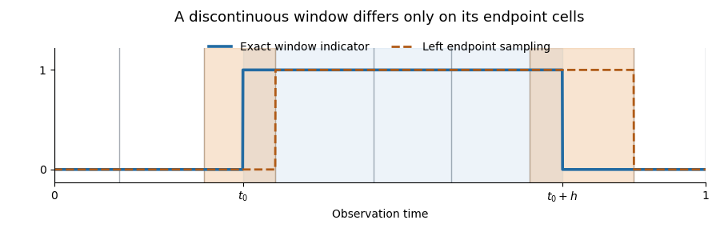

# Paper 209

↑ **Parent:** [Iii](../iii.md)

[https://www.maths.cam.ac.uk/postgrad/part-iii/files/pastpapers/2016/paper_209.pdf](https://www.maths.cam.ac.uk/postgrad/part-iii/files/pastpapers/2016/paper_209.pdf)

**Table of contents**

- [1](#1)
  - [a](#1/a)
    - [Solution](#1/a/solution)
  - [b](#1/b)
    - [Solution](#1/b/solution)
  - [c](#1/c)
    - [Solution](#1/c/solution)
- [2](#2)
  - [a](#2/a)
    - [Solution](#2/a/solution)
  - [b](#2/b)
    - [Solution](#2/b/solution)
  - [c](#2/c)
    - [Solution](#2/c/solution)
  - [d](#2/d)
    - [Solution](#2/d/solution)
- [3](#3)
  - [Solution](#3/solution)
- [4](#4)
  - [Solution](#4/solution)

## 1

↑ **Parent:** [Paper 209](paper-209.md)

<h3 id="1/a">a</h3>

↑ **Parent:** [1](#1)

<h4 id="1/a/solution">Solution</h4>

↑ **Parent:** [A](#1/a)

Put $\delta_i=t_i-t_{i-1}$, $\Delta=\max_i\delta_i$, $v_i=\int_{t_{i-1}}^{t_i}\sigma(s)^2\,ds$ and $S=\|\sigma^4\|_\infty$. The deterministic integrand in the [Itô integral](../../../stochastic-calculus.md#ito-integral) implies that the increments $Z_i=X_{t_i}-X_{t_{i-1}}$ are [independent random variables](../../../random-variable.md#independent-random-variables) with [normal distributions](../../../probability-theory.md#normal-distribution) $N(0,v_i)$. The [Gaussian fourth moment](../../../probability-theory.md#gaussian-fourth-moment) gives

$$
\mathbb E Z_i^2=v_i,\qquad \mathbb E Z_i^4=3v_i^2,\qquad \operatorname{Var}(Z_i^2)=2v_i^2.
$$

These identities include $v_i=0$. Since the summands of $M_n$ are centered and [independent](../../../random-variable.md#independent-random-variables), all cross terms in its [second moment](../../../probability-theory.md#second-moment) vanish. Consequently,

$$
\mathbb E M_n^2=2\sum_{i=1}^n g(t_{i-1})^2v_i^2
\leq2R^2S\sum_{i=1}^n\delta_i^2
\leq2R^2S\Delta\sum_{i=1}^n\delta_i
=2R^2S\Delta.
$$

Thus **$D=2$ works for every observation partition**. The last step uses the total interval length, rather than assuming equally spaced observations.

<h3 id="1/b">b</h3>

↑ **Parent:** [1](#1)

<h4 id="1/b/solution">Solution</h4>

↑ **Parent:** [B](#1/b)

Use the same $M_n,v_i,S,\Delta$ as in part (a). The error of the [weighted realized variance](../../../stochastic-calculus.md#weighted-realized-variance) splits into its centered fluctuation and its deterministic [quadrature error](../../../real-analysis.md#quadrature-error):

$$
\widehat\Lambda_n(g)-\Lambda(g)=M_n+B_n,\qquad
B_n=\sum_i\int_{t_{i-1}}^{t_i}\bigl(g(t_{i-1})-g(s)\bigr)\sigma(s)^2\,ds.
$$

The [Hölder continuity](../../../sobolev-space.md#holder-condition) of $g$ controls this [bias](../../../statistical-modelling.md#bias-of-an-estimator):

$$
|B_n|\leq R\|\sigma^2\|_\infty\sum_i\frac{\delta_i^{1+\alpha}}{1+\alpha}
\leq\frac{R\|\sigma^2\|_\infty}{1+\alpha}\Delta^\alpha.
$$

Since $\mathbb E M_n=0$, the [bias-variance decomposition of mean squared error](../../../statistical-modelling.md#bias-variance-decomposition-of-mean-squared-error) has no cross term. Part (a) therefore gives

$$
\mathbb E\bigl(\widehat\Lambda_n(g)-\Lambda(g)\bigr)^2
\leq2R^2S\Delta+\frac{R^2S}{(1+\alpha)^2}\Delta^{2\alpha}
\leq3R^2S\max\{\Delta,\Delta^{2\alpha}\}.
$$

Hence **$\widetilde D=3$ is a universal choice**. This argument separately controls the statistical fluctuation and the [Riemann sum](../../../real-analysis.md#riemann-sum) approximation.

<h3 id="1/c">c</h3>

↑ **Parent:** [1](#1)

<h4 id="1/c/solution">Solution</h4>

↑ **Parent:** [C](#1/c)

Write $h=h_n$ and $I=[t_0,t_0+h]$, restricting to meshes small enough that $t_0+h\leq1$. This discontinuous [indicator function](../../../measure-theory.md#indicator-function) does not satisfy the hypothesis of part (b). Instead apply part (a) with $\|g_n\|_\infty=1/h$ and handle its two boundary cells directly.

Let $q_n(s)=g_n(t_{i-1})$ on each observation cell $[t_{i-1},t_i)$. Away from cells containing the two ends of $I$, $q_n=g_n$ almost everywhere. Even if an endpoint is itself an observation time, at most two cells contribute, and their total length is at most $2\Delta$. Thus the [quadrature error](../../../real-analysis.md#quadrature-error) obeys

$$
B_n=\int_0^1(q_n-g_n)\sigma^2\,ds,\qquad
|B_n|\leq2\|\sigma^2\|_\infty\frac{\Delta}{h}.
$$

The fluctuation has [variance](../../../variance.md) at most $2S\Delta/h^2$. Its zero [expected value](../../../probability-theory.md#expected-value) gives

$$
\mathbb E\bigl(\widehat\Lambda_n(g_n)-\Lambda(g_n)\bigr)^2
\leq\frac{S}{h^2}(2\Delta+4\Delta^2)
\leq6S\frac{\Delta}{h^2},
$$

using $\Delta\leq1$.

**[Figure 1](#1/c/image-only-the-two-endpoint-cells-contribute-to-the-window-quadrature-error). Only the two endpoint cells contribute to the window quadrature error**.

The remaining [bias](../../../statistical-modelling.md#bias-of-an-estimator) is the difference between an interval average and the [spot variance](../../../stochastic-calculus.md#spot-variance). By the [Hölder continuity](../../../sobolev-space.md#holder-condition) of $\sigma^2$,

$$
A_h=\Lambda(g_n)-\sigma^2(t_0),\qquad
|A_h|\leq\frac1h\int_0^h C s^\beta\,ds
=\frac{C}{1+\beta}h^\beta.
$$

Retaining the centered fluctuation and bounding $(B_n+A_h)^2\leq2B_n^2+2A_h^2$ yields

$$
\mathbb E\bigl(\widehat\Lambda_n(g_n)-\sigma^2(t_0)\bigr)^2
\leq10S\frac{\Delta}{h^2}+2C^2h^{2\beta}.
$$

For $h=\Delta^{1/(2+2\beta)}$, both $\Delta/h^2$ and $h^{2\beta}$ equal $\Delta^{2\beta/(2\beta+2)}$. Therefore **$D_1=10$ and $D_2=2C^2$ satisfy both requested bounds**:

$$
\boxed{\mathbb E\bigl(\widehat\Lambda_n(g_n)-\sigma^2(t_0)\bigr)^2
\leq(10\|\sigma^4\|_\infty+2C^2)\Delta^{2\beta/(2\beta+2)}.}
$$

The constants are independent of the observation partition, $\sigma$, $t_0$ and $\beta$. The exponent follows from a [bias-variance tradeoff](../../../statistical-modelling.md#bias-variance-tradeoff) for a shrinking window.

## 2

↑ **Parent:** [Paper 209](paper-209.md)

<h3 id="2/a">a</h3>

↑ **Parent:** [2](#2)

<h4 id="2/a/solution">Solution</h4>

↑ **Parent:** [A](#2/a)

The [empirical characteristic function](../../../probability-theory.md#empirical-characteristic-function) replaces the [expected value](../../../probability-theory.md#expected-value) in a [characteristic function](../../../probability-theory.md#characteristic-function) by the sample average:

$$
\boxed{\varphi_n(u)=\frac1n\sum_{j=1}^n e^{iuX_j},\qquad u\in\mathbb R.}
$$

Its centered fluctuation at the [central limit theorem](../../../convergence-of-random-variables.md#central-limit-theorem) scale is the [empirical characteristic process](../../../probability-theory.md#empirical-characteristic-process):

$$
\boxed{\mathcal C_n(u)=\sqrt n\bigl(\varphi_n(u)-\varphi(u)\bigr),\qquad
\varphi(u)=\mathbb E e^{iuX_1}.}
$$

In particular, $\varphi_n(0)=1$ and $\mathcal C_n(0)=0$.

<h3 id="2/b">b</h3>

↑ **Parent:** [2](#2)

<h4 id="2/b/solution">Solution</h4>

↑ **Parent:** [B](#2/b)

For real $v$, $\overline{\varphi(v)}=\varphi(-v)$. Expand the [complex covariance](../../../variance.md#complex-covariance) of the sample averages. Terms indexed by distinct observations vanish because the observations are [independent](../../../random-variable.md#independent-random-variables); each diagonal term equals $\mathbb E e^{i(u-v)X_1}-\varphi(u)\overline{\varphi(v)}$. Hence

$$
\boxed{\operatorname{Cov}_{\mathbb C}\bigl(\varphi_n(u),\varphi_n(v)\bigr)
=\frac1n\bigl(\varphi(u-v)-\varphi(u)\varphi(-v)\bigr).}
$$

Taking $v=u$ and using $\varphi(0)=1$ gives the exact [variance](../../../variance.md):

$$
\boxed{\operatorname{Var}_{\mathbb C}(\varphi_n(u))
=\frac{1-|\varphi(u)|^2}{n}\leq\frac1n.}
$$

The upper bound follows from $|\varphi(u)|\leq\mathbb E|e^{iuX_1}|=1$, and holds without any moment assumptions on $X_1$.

<h3 id="2/c">c</h3>

↑ **Parent:** [2](#2)

<h4 id="2/c/solution">Solution</h4>

↑ **Parent:** [C](#2/c)

Fix $u$. Put $m=\varphi(u)$ and form the centered real vectors

$$
Y_j=\begin{pmatrix}\cos(uX_j)-\operatorname{Re}m\\ \sin(uX_j)-\operatorname{Im}m\end{pmatrix}.
$$

They are bounded [independent and identically distributed random variables](../../../random-variable.md#independent-and-identically-distributed-random-variables), so the [multivariate central limit theorem](../../../convergence-of-random-variables.md#multivariate-central-limit-theorem) applies to $n^{-1/2}\sum_jY_j=(\operatorname{Re}\mathcal C_n(u),\operatorname{Im}\mathcal C_n(u))^T$.

To identify its limiting [covariance matrix](../../../variance.md#covariance-matrix), put $Z=e^{iuX_1}-m$. Its [complex covariance](../../../variance.md#complex-covariance) and [pseudo-covariance](../../../variance.md#pseudo-covariance) are respectively

$$
V=\mathbb E|Z|^2=1-|m|^2,\qquad
P=\mathbb E Z^2=\varphi(2u)-m^2.
$$

For $Z=A+iB$, $|Z|^2=A^2+B^2$ and $Z^2=A^2-B^2+2iAB$. Thus

$$
\boxed{\Sigma(u)=\frac12\begin{pmatrix}V+\operatorname{Re}P&\operatorname{Im}P\\
\operatorname{Im}P&V-\operatorname{Re}P\end{pmatrix}.}
$$

The two conditions on $\Gamma(u)$ identify exactly this real [covariance matrix](../../../variance.md#covariance-matrix): the second is $\operatorname{Cov}_{\mathbb C}(\Gamma(u),\overline{\Gamma(u)})=\mathbb E\Gamma(u)^2$, with a conjugate in its second argument. A centered [multivariate normal distribution](../../../probability-and-statistics.md#multivariate-normal-distribution) is determined by its [covariance matrix](../../../variance.md#covariance-matrix), including when that matrix is singular. Therefore

$$
\boxed{(\operatorname{Re}\mathcal C_n(u),\operatorname{Im}\mathcal C_n(u))
\xrightarrow{d}(\operatorname{Re}\Gamma(u),\operatorname{Im}\Gamma(u)).}
$$

This proves [convergence in distribution](../../../convergence-of-random-variables.md#convergence-in-distribution) at each fixed $u$; it does not assert convergence of the entire [empirical characteristic process](../../../probability-theory.md#empirical-characteristic-process).

<h3 id="2/d">d</h3>

↑ **Parent:** [2](#2)

<h4 id="2/d/solution">Solution</h4>

↑ **Parent:** [D](#2/d)

Write $J_{n,h}$ for the squared integral norm in question. The [scaling property of the Fourier transform](../../../analysis.md#scaling-property-of-the-fourier-transform) gives $\mathcal F K_h(u)=\mathcal F K(hu)$, which vanishes outside $[-1/h,1/h]$. Also $|\mathcal F K(v)|\leq\|K\|_1$. The condition $\int K=1$ does not imply $\|K\|_1=1$, because $K$ need not be nonnegative.

Part (b), now for observations of $Y$, gives $\mathbb E|\varphi_n^Y(u)-\varphi^Y(u)|^2\leq1/n$. Apply the [Tonelli theorem](../../../measure-theory.md#tonelli-theorem) to this nonnegative integrand, use the bound on $1/\varphi_\epsilon$, and change variables $v=hu$:

$$
\mathbb E J_{n,h}
\leq\frac{\widetilde M_h^2}{n}\int_{-1/h}^{1/h}|\mathcal F K(hu)|^2\,du
=\frac{\widetilde M_h^2}{nh}\int_{-1}^1|\mathcal F K(v)|^2\,dv
\leq\frac{2\|K\|_1^2\widetilde M_h^2}{nh}.
$$

The [characteristic function](../../../probability-theory.md#characteristic-function) $\varphi_\epsilon$ is continuous and nonzero on the compact interval of integration, so $\widetilde M_h<\infty$ for every $h>0$. The [Markov inequality](../../../probability-inequality.md#markov-inequality) gives, for every $z>0$,

$$
\mathbb P\left(J_{n,h}^{1/2}>z\frac{\widetilde M_h}{\sqrt{nh}}\right)
\leq\frac{2\|K\|_1^2}{z^2}.
$$

Consequently **$J_{n,h}^{1/2}=O_{\mathbb P}(\widetilde M_h/\sqrt{nh})$**, including for any deterministic bandwidth sequence $h=h_n>0$. The [stochastic order](../../../convergence-of-random-variables.md#stochastic-order) follows directly from this uniform probability bound. Independence of $X$ and $\epsilon$ gives $\varphi^Y=\varphi^X\varphi_\epsilon$, explaining why division by $\varphi_\epsilon$ is the [Fourier deconvolution](../../../nonparametric-statistics.md#fourier-deconvolution) operation.

## 3

↑ **Parent:** [Paper 209](paper-209.md)

<h3 id="3/solution">Solution</h3>

↑ **Parent:** [3](#3)

**The printed assertion is false as a supremum bound uniform over shrinking bandwidths.** The supplied hint proves a pointwise [stochastic order](../../../convergence-of-random-variables.md#stochastic-order) with constants uniform in $x$. Taking the [supremum](../../../real-analysis.md#supremum) inside the probability changes the problem: a growing number of spatial windows produces a logarithmic cost. We first establish the valid consequence of the hint, then give a [counterexample](../../../foundations-of-mathematics.md#counterexample) satisfying the printed assumptions.

For $I=I_{x,h}=[x-h,x+h]$, let $p=\mu(I)$, $A_T=\int_0^T\mathbf1_I(X_t)\,dt$ and $N_T=\int_0^T\mathbf1_I(X_t)\sigma(X_t)\,dW_t$. The [Invariant distribution of an Itô diffusion](../../../stochastic-calculus.md#invariant-distribution-of-an-ito-diffusion) has a [probability density function](../../../continuous-probability-distribution.md#probability-density-function) bounded above and bounded away from zero on the required compact interval. Choosing $h_0<M/4$ therefore gives constants $c_0,C_0>0$ such that $c_0h\leq p\leq C_0h$, uniformly for $|x|\leq M/2$ and $0<h<h_0$.

For the centered function $f=\mathbf1_I-p$, $\int|f|\,d\mu=2p(1-p)\leq2p$. Outside $[-M,M]$, $f=-p$. The given second-moment estimate and the [Chebyshev inequality](../../../probability-inequality.md#chebyshev-inequality) yield

$$
\mathbb E(A_T-Tp)^2\leq5C(1+T)p^2,\qquad
\mathbb P(A_T<Tp/2)\leq\frac{20C(1+T)}{T^2}\leq\frac{40C}{T}\quad(T\geq1).
$$

On the event $A_T\geq Tp/2$, the [drift coefficient](../../../stochastic-calculus.md#drift-coefficient) contributes an average whose error is at most $Rh^\alpha$, by [Hölder continuity](../../../sobolev-space.md#holder-condition). The [Itô isometry](../../../stochastic-calculus.md#ito-isometry) and [stationarity](../../../time-series.md#stationary-process) give $\mathbb E N_T^2\leq\|\sigma\|_\infty^2Tp$. Another use of the [Chebyshev inequality](../../../probability-inequality.md#chebyshev-inequality) proves

$$
\boxed{\sup_{|x|\leq M/2}\mathbb P\left(|\widehat b_T(x,h)-b(x)|>Rh^\alpha+
\frac{z}{\sqrt{Th}}\right)\leq\frac{40C}{T}+\frac{4\|\sigma\|_\infty^2}{c_0z^2}.}
$$

This also accounts for the zero-denominator convention through the first exceptional event. The bound proves **pointwise $Rh^\alpha+O_{\mathbb P}((Th)^{-1/2})$, uniformly in the location's tail probabilities**. It supplies no bound for the probability of a supremum over all locations.

For an explicit [counterexample](../../../foundations-of-mathematics.md#counterexample), take $\sigma\equiv1$ and the bounded [globally Lipschitz function](../../../real-analysis.md#globally-lipschitz-function)

$$
b(x)=-\operatorname{sgn}(x)\min\{(|x|-1)_+,1\}.
$$

It has [Lipschitz constant](../../../real-analysis.md#lipschitz-constant) $R=1$, exponent $\alpha=1$, and satisfies the inward-drift conditions with $M=2$, $\gamma=2$. The [stochastic differential equation](../../../stochastic-calculus.md#stochastic-differential-equation) has a unique [strong solution of a stochastic differential equation](../../../stochastic-calculus.md#strong-solution-of-a-stochastic-differential-equation). Its [Invariant distribution of an Itô diffusion](../../../stochastic-calculus.md#invariant-distribution-of-an-ito-diffusion) has density

$$
\rho(x)=Z^{-1}\exp\left(2\int_0^x b(y)\,dy\right),\qquad
Z=\int_{\mathbb R}\exp\left(2\int_0^x b(y)\,dy\right)dx<\infty.
$$

The exponent is zero on $[-1,1]$, equals $-(|x|-1)^2$ when $1<|x|<2$, and equals $3-2|x|$ outside $[-2,2]$. This verifies integrability, positivity and a constant density $\rho_0=Z^{-1}$ on the central interval. Start the [Itô diffusion](../../../stochastic-calculus.md#ito-diffusion) in this [Invariant distribution of an Itô diffusion](../../../stochastic-calculus.md#invariant-distribution-of-an-ito-diffusion) to obtain the required [stationary process](../../../time-series.md#stationary-process).

Set $h=T^{-1/3}$ and choose $N=\lfloor(4h)^{-1}\rfloor$ windows with centers $x_j=-1/2+(4j-2)h$, $1\leq j\leq N$. Their intervals $I_j=[x_j-h,x_j+h]$ are disjoint and lie in $[-1,1]$, where the [drift](../../../stochastic-calculus.md#drift-coefficient) is zero. Write

$$
A_j(t)=\int_0^t\mathbf1_{I_j}(X_s)\,ds,\qquad
M_j(t)=\int_0^t\mathbf1_{I_j}(X_s)\,dW_s,\qquad q=2\rho_0Th.
$$

Then $\widehat b_T(x_j,h)=M_j(T)/A_j(T)$ whenever $A_j(T)>0$. The same occupation bound as above gives $\mathbb E(A_j(T)-q)^2\leq C_1Th^2$ for $T\geq1$. With $\delta=T^{-1/6}$, a [union bound](../../../probability-inequality.md#boole-s-inequality) and the [Chebyshev inequality](../../../probability-inequality.md#chebyshev-inequality) imply

$$
\mathbb P\left(\max_{j\leq N}|A_j(T)-q|>\delta q\right)
\leq\frac{C_2N}{T\delta^2}=O(T^{-1/3})\longrightarrow0.
$$

The [quadratic variations](../../../stochastic-calculus.md#quadratic-variation) are $\langle M_j\rangle=A_j$, and the cross [quadratic covariations](../../../stochastic-calculus.md#quadratic-covariation) vanish since the windows are disjoint. Each clock tends to infinity almost surely: for any fixed window, the occupation estimate at times $2^k$, followed by the [Borel-Cantelli lemmas](../../../probability-theory.md#borel-cantelli-lemmas), gives $A_j(2^k)/(2^k\mu(I_j))\to1$. The [Knight theorem for orthogonal martingales](../../../stochastic-calculus.md#knight-theorem-for-orthogonal-martingales) therefore represents $M_j(t)=B_j(A_j(t))$ using [independent](../../../random-variable.md#independent-random-variables) standard [Brownian motions](../../../brownian-motion.md) $B_1,\ldots,B_N$. This theorem is applied to the finite collection for each $T$; no growing-dimensional [central limit theorem](../../../convergence-of-random-variables.md#central-limit-theorem) is being assumed.

On the preceding clock event, compare each time-changed [Brownian motion](../../../brownian-motion.md) with its value at deterministic time $q$. The [Brownian reflection principle](../../../brownian-motion.md#reflection-principle-wiener-process) and a [union bound](../../../probability-inequality.md#boole-s-inequality) show that, for every fixed $\varepsilon>0$,

$$
\mathbb P\left(\max_{j\leq N}\sup_{|s-q|\leq\delta q}
|B_j(s)-B_j(q)|>\varepsilon\sqrt q\right)
\leq8N\exp\left(-\frac{\varepsilon^2}{2\delta}\right)\longrightarrow0.
$$

This bound does not require the [Brownian motions](../../../brownian-motion.md) to be independent of their clocks. In particular, $\max_j|M_j(T)-B_j(q)|/\sqrt q\to0$ in [probability](../../../probability-theory.md#probability). The variables $B_j(q)/\sqrt q$ are [independent](../../../random-variable.md#independent-random-variables) $N(0,1)$ [random variables](../../../random-variable.md). Their [Gaussian maximum](../../../probability-theory.md#gaussian-maximum) exceeds $\sqrt{\log N}$ with probability tending to one: for $r\geq1$, integration of the [normal density](../../../probability-theory.md#normal-density) over $[r,r+1/r]$ gives $\mathbb P(|Z|>r)\geq c r^{-1}e^{-r^2/2}$, and hence

$$
\mathbb P\left(\max_{j\leq N}|Z_j|\leq\sqrt{\log N}\right)
\leq\exp\left(-c\frac{\sqrt N}{\sqrt{\log N}}\right)\longrightarrow0.
$$

Since $A_j(T)\leq(1+\delta)q$ on the clock event, it follows that, for some $c_3>0$,

$$
\mathbb P\left(\sqrt{Th}\sup_{|x|\leq1}|\widehat b_T(x,h)-b(x)|
\geq c_3\sqrt{\log(1/h)}\right)\longrightarrow1.
$$

But $\sqrt{Th}\,Rh=1$ for this bandwidth. Thus the error after subtraction of $Rh$ and multiplication by $\sqrt{Th}$ is not [bounded in probability](../../../convergence-of-random-variables.md#boundedness-in-probability), contradicting the printed [stochastic order](../../../convergence-of-random-variables.md#stochastic-order). **The valid pointwise bound above is provable; the uniform shrinking-bandwidth assertion is not.** This [counterexample](../../../foundations-of-mathematics.md#counterexample) shows why a uniform rate needs at least a $\sqrt{\log(1/h)}$ enlargement of the noise scale. If $h$ is instead held fixed and constants may depend on $h$, this counterexample does not contradict that different interpretation.

## 4

↑ **Parent:** [Paper 209](paper-209.md)

<h3 id="4/solution">Solution</h3>

↑ **Parent:** [4](#4)

Let $m=\mathbb E\|X_1\|_2$ and $q=\sqrt n\,K\geq2$. The [Lipschitz continuity](../../../real-analysis.md#lipschitz-continuity) of cosine and the [Cauchy-Schwarz inequality](../../../probability-and-statistics.md#cauchy-schwarz-inequality) imply

$$
|S_n(u)-S_n(v)|\leq L_n\|u-v\|_2,\qquad
L_n=\sum_{k=1}^n\|X_k\|_2+nm,\qquad \mathbb E L_n=2nm.
$$

The centered expectation term contributes $nm$; omitting it would leave the [Lipschitz bound](../../../real-analysis.md#lipschitz-bound) incomplete. In particular $S_n$ has continuous sample paths on the compact cube, so its maximum exists and is measurable.

Put

$$
a=\frac{R^2-64d}{64(d+1)}>0,\qquad
\eta=\frac{1}{\sqrt n\,q^a}.
$$

Choose a Cartesian [finite net](../../../topological-analysis.md#finite-net) $G\subset[-K,K]^d$ whose coordinate spacings are at most $\eta$, including the endpoints. Every point of the cube is within [Euclidean norm](../../../functional-analysis.md#euclidean-norm) distance $\sqrt d\,\eta$ of $G$, and

$$
|G|\leq(2K/\eta+2)^d\leq4^d q^{d(1+a)}.
$$

On the event $L_n\leq nq^a$, replacing any $u$ by a nearby grid point changes $S_n$ by at most $\sqrt{dn}$. Since $R>8\sqrt d$ and $\log(nK^2)\geq\log4$, this is less than $\frac R4\sqrt{n\log(nK^2)}$. Therefore

$$
\left\{\max_u|S_n(u)|\geq\frac R2\sqrt{n\log(nK^2)}\right\}
\subseteq\{L_n>nq^a\}\cup
\bigcup_{v\in G}\left\{|S_n(v)|\geq\frac R4\sqrt{n\log(nK^2)}\right\}.
$$

The [Markov inequality](../../../probability-inequality.md#markov-inequality) bounds the first event by $2m q^{-a}$. At a fixed $v$, the summands are centered, [independent and identically distributed](../../../random-variable.md#independent-and-identically-distributed-random-variables), and have absolute value at most $2$. The supplied [Hoeffding inequality](../../../probability-inequality.md#hoeffding-inequality), with $M=2$, bounds each grid event by

$$
2\exp\left(-\frac{R^2\log(nK^2)}{128}\right)=2q^{-R^2/64}.
$$

A [union bound](../../../probability-inequality.md#boole-s-inequality) now gives

$$
\mathbb P\left(\max_u|S_n(u)|\geq\frac R2\sqrt{n\log(nK^2)}\right)
\leq2m q^{-a}+2\cdot4^d q^{d(1+a)-R^2/64}.
$$

The choice of $a$ balances the cost of a large random [Lipschitz constant](../../../real-analysis.md#lipschitz-constant) against the [covering number](../../../topological-analysis.md#metric-covering-number) of the cube: $d(1+a)-R^2/64=-a$. Consequently **$C=2m+2\cdot4^d$ works**, with

$$
\boxed{\mathbb P\left(\max_{u\in[-K,K]^d}|S_n(u)|\geq\frac R2\sqrt{n\log(nK^2)}\right)
\leq(2m+2\cdot4^d)(\sqrt n\,K)^{(64d-R^2)/(64d+64)}.}
$$

This uses only the first moment $m$ and has a constant independent of $n,K,R$. The [finite net](../../../topological-analysis.md#finite-net) is deterministic even though the [Lipschitz constant](../../../real-analysis.md#lipschitz-constant) is random.

## ↑ Ancestors (8)

1. [Iii](../iii.md)
2. [2016](../../2016.md)
3. [Past exam of the mathematics course of the University of Cambridge](../../../past-exam-of-the-mathematics-course-of-the-university-of-cambridge.md)
4. [Mathematics course of the University of Cambridge](../../../university-of-cambridge.md#mathematics-course-of-the-university-of-cambridge)
5. [Course of the University of Cambridge](../../../university-of-cambridge.md#course-of-the-university-of-cambridge)
6. [University of Cambridge](../../../university-of-cambridge.md)
7. [List of universities](../../../README.md#list-of-universities)
8. [Codex Wiki](../../../README.md)
