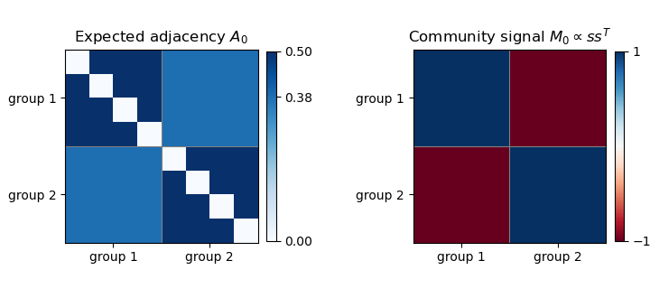

<h1 id="4/a/solution">Solution</h1>

↑ **Parent:** [A](../a.md)

Write $s_i=1$ on $S$ and $s_i=-1$ on $S^c$, and put $v=s/\sqrt n$ and $w=\mathbf1/\sqrt n$. Because the two groups have equal size, $v,w$ are [orthonormal](../../../../../../orthonormal-set.md). Let $a=1/2-t/(2\sqrt n)$ and $b=t/(2\sqrt n)$. The [expected value](../../../../../../expected-value.md) of the [adjacency matrix of a graph](../../../../../../adjacency-matrix.md) is $A_0=a\mathbf1\mathbf1^\top+bss^\top-I_n/2$. Consequently

$$
\boxed{A_0+I_n/2=(n/2-t\sqrt n/2)ww^\top+(t\sqrt n/2)vv^\top,\qquad M_0=(t\sqrt n/2)vv^\top.}
$$

Both displayed [eigenvalues](../../../../../../eigenvalue.md) are positive under the stated range of $t$, so the first matrix has [matrix rank](../../../../../../matrix-rank.md) two. The other $n-2$ [eigenvalues](../../../../../../eigenvalue.md) are zero. The figure shows the within-group and between-group blocks of this balanced [stochastic block model](../../../../../../stochastic-block-model.md); $A_0$ itself has zero diagonal.

**[Figure 1](#4/a/image-expected-adjacency-blocks-and-the-positive-rank-one-community-signal). Expected adjacency blocks and the positive rank-one community signal**.

## ↑ Ancestors (11)

1. [A](../a.md)
2. [4](../../4.md)
3. [Paper 210](../../../paper-210-split.md)
4. [Iii](../../../split.md)
5. [2016](../../../../split.md)
6. [Past exam of the mathematics course of the University of Cambridge](../../../../../split.md)
7. [Mathematics course of the University of Cambridge](../../../../../../mathematics-course-of-the-university-of-cambridge.md)
8. [Course of the University of Cambridge](../../../../../../course-of-the-university-of-cambridge.md)
9. [University of Cambridge](../../../../../../university-of-cambridge-split.md)
10. [List of universities](../../../../../../list-of-universities.md)
11. [Codex Wiki](../../../../../../split.md)
