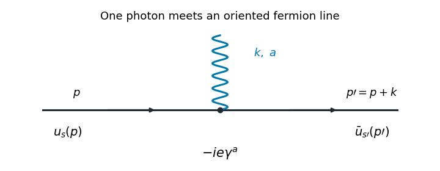

# Paper 301

↑ **Parent:** [Iii](../iii.md)

[https://www.maths.cam.ac.uk/postgrad/part-iii/files/pastpapers/2016/paper_301.pdf](https://www.maths.cam.ac.uk/postgrad/part-iii/files/pastpapers/2016/paper_301.pdf)

**Table of contents**

- [1](#1)
  - [Solution](#1/solution)
- [2](#2)
  - [Solution](#2/solution)
- [3](#3)
  - [Solution](#3/solution)
- [4](#4)
  - [Solution](#4/solution)

## 1

↑ **Parent:** [Paper 301](paper-301.md)

<h3 id="1/solution">Solution</h3>

↑ **Parent:** [1](#1)

Use units $\hbar=c=1$, the [Minkowski metric](../../../special-relativity.md#minkowski-metric) $\eta_{ab}=\operatorname{diag}(1,-1,-1,-1)$, and the [Fourier transform](../../../analysis.md#fourier-transform) convention $f(x)=\int d^4p\,e^{-ip\cdot x}\widetilde f(p)/(2\pi)^4$. Here [gamma matrices](../../../algebra.md#gamma-matrices) satisfy $\{\gamma^a,\gamma^b\}=2\eta^{ab}I_4$, and $\bar\psi=\psi^\dagger\gamma^0$ is the [Dirac adjoint](../../../relativistic-quantum-field.md#dirac-adjoint). A single [Dirac field](../../../relativistic-quantum-field.md#dirac-field) describes both [Electrons](../../../physics.md#electron) and [Positrons](../../../physics.md#positron); these are the particle and [antiparticle](../../../relativistic-quantum-field.md#antiparticle) sectors of that field.

The free [Maxwell Lagrangian](../../../electromagnetism.md#maxwell-lagrangian) and [Dirac action](../../../relativistic-quantum-field.md#dirac-action), with a linear [covariant gauge](../../../relativistic-quantum-field.md#covariant-gauge) condition for the [photon](../../../quantum-mechanics.md#photon), give

$$
S_0=\int d^4x\left[-\frac14F_{ab}F^{ab}-\frac1{2\alpha}(\partial_aA^a)^2+\bar\psi(i\gamma^a\partial_a-m)\psi\right],\qquad F_{ab}=\partial_aA_b-\partial_bA_a.
$$

Before [gauge fixing](../../../relativistic-quantum-field.md#gauge-fixing), the [Maxwell Lagrangian](../../../electromagnetism.md#maxwell-lagrangian) has [zero modes in field theory](../../../relativistic-quantum-field.md#zero-mode-in-field-theory) along $A_a\mapsto A_a+\partial_a\lambda$, so its quadratic operator cannot be inverted on all potentials. In the linear [Lorenz gauge](../../../electromagnetism.md#lorenz-gauge-condition), the [Faddeev-Popov determinant](../../../relativistic-quantum-field.md#faddeev-popov-determinant) is $\det\Box$. It is independent of $A$ and may be absorbed into the normalization; the corresponding [Faddeev-Popov ghost fields](../../../relativistic-quantum-field.md#faddeev-popov-ghost) have no interacting vertices in this Abelian linear gauge. A residual [gauge symmetry](../../../relativistic-quantum-field.md#gauge-invariance) is removed by the specified [boundary conditions](../../../differential-equation.md#boundary-condition).

The free [generating functional](../../../perturbative-quantum-field-theory.md#generating-functional) is

$$
Z_0[J,\bar\eta,\eta]=\mathcal N\int\mathcal DA\,\mathcal D\bar\psi\,\mathcal D\psi\;
\exp\!\left(iS_0+i\int d^4x\,[J_aA^a+\bar\eta\psi+\bar\psi\eta]\right),\qquad Z_0[0]=1.
$$

The [Dirac field](../../../relativistic-quantum-field.md#dirac-field) variables and their sources are independent [Grassmann fields](../../../quantum-field-theory.md#grassmann-field) in this [path integral](../../../quantum-field-theory.md#path-integral). They anticommute; replacing them by ordinary commuting fields would give the wrong statistics and the wrong [functional determinant](../../../quantum-field-theory.md#functional-determinant). The bosonic [Gaussian functional integral](../../../quantum-field-theory.md#gaussian-functional-integral) contributes an inverse square root of a determinant, and the [Grassmann Gaussian integral](../../../quantum-field-theory.md#grassmann-gaussian-integral) contributes a determinant. If $K_A$ is the photon quadratic operator and $K_D=i\gamma^a\partial_a-m$, completing the square gives

$$
Z_0=\exp\!\left[-\frac i2\int J K_A^{-1}J-i\int\bar\eta K_D^{-1}\eta\right]
=\exp\!\left[-\frac12\int J D_F J-\int\bar\eta S_F\eta\right].
$$

In the last expression $D_F=iK_A^{-1}$ and $S_F=iK_D^{-1}$ are the [photon propagator](../../../quantum-field-theory.md#photon-propagator) and [Dirac propagator](../../../quantum-field-theory.md#dirac-propagator), with [Feynman i-epsilon prescription](../../../quantum-field-theory.md#feynman-i-epsilon-prescription). The products include the appropriate spacetime integrals and index contractions. [Functional derivatives](../../../calculus-of-variations.md#functional-derivative) with respect to $J$, and consistently ordered left or right [Grassmann derivatives](../../../linear-algebra.md#grassmann-derivative) with respect to the fermionic sources, generate the [time ordering](../../../perturbative-quantum-field-theory.md#time-ordering) of the corresponding fields. In [Feynman gauge](../../../relativistic-quantum-field.md#feynman-gauge), $\alpha=1$, the momentum-space two-point functions are

$$
\boxed{D_F^{ab}(p)=\frac{-i\eta^{ab}}{p^2+i0},\qquad
S_F(p)=\frac{i(\not p+m)}{p^2-m^2+i0}},\qquad \not p=\gamma^ap_a.
$$

The [Feynman i-epsilon prescription](../../../quantum-field-theory.md#feynman-i-epsilon-prescription) specifies vacuum boundary conditions rather than an arbitrary inverse of the differential operator.

The covariant [photon propagator](../../../quantum-field-theory.md#photon-propagator) uses four potential components. Its [operator formalism](../../../quantum-mechanics.md#operator-formalism) counterpart is [Gupta-Bleuler quantization](../../../relativistic-quantum-field.md#gupta-bleuler-formalism): impose $(\partial_aA^a)^{(+)}|\mathrm{phys}\rangle=0$ and take the [Gupta-Bleuler null-state quotient](../../../relativistic-quantum-field.md#gupta-bleuler-null-state-quotient). This leaves a positive physical state space with two transverse [photon](../../../quantum-mechanics.md#photon) [polarization vectors](../../../relativistic-quantum-field.md#polarization-vector). The temporal and longitudinal oscillator components occur in intermediate covariant expressions; the [Ward identity](../../../perturbative-quantum-field-theory.md#ward-identity) removes their dependence from physical amplitudes. The free [Dirac field](../../../relativistic-quantum-field.md#dirac-field) uses the [canonical anticommutation relations](../../../quantum-mechanics.md#canonical-anticommutation-relations), producing the same [fermionic signs](../../../perturbative-quantum-field-theory.md#fermionic-sign) as its [Grassmann fields](../../../quantum-field-theory.md#grassmann-field) in the [path integral](../../../quantum-field-theory.md#path-integral).

The [operator-path-integral equivalence](../../../quantum-field-theory.md#operator-path-integral-equivalence) can be seen directly with a regulator. Divide time into small intervals and insert complete sets of field-coordinate states for bosons, and resolutions in [fermionic coherent states](../../../quantum-theory.md#fermionic-coherent-state) for fermions. The bosonic matrix elements produce the phase-space factor $\exp i\sum[\pi\Delta\phi-H\Delta t]$; integrating out the quadratic [canonical momentum](../../../classical-mechanics.md#canonical-momentum) produces the bosonic [action](../../../classical-mechanics.md#action). The [fermionic coherent state](../../../quantum-theory.md#fermionic-coherent-state) overlaps produce the first-order term $i\psi^\dagger\dot\psi$ and the [Berezin integral](../../../quantum-mechanics.md#berezin-integral) measure. Multiplying the short-time kernels recovers the [path integral](../../../quantum-field-theory.md#path-integral). Projecting the remote endpoints onto the [Fock vacuum](../../../quantum-field-theory.md#fock-vacuum) with an infinitesimal damping selects the same [Feynman propagators](../../../quantum-field-theory.md#feynman-propagator) as the [operator formalism](../../../quantum-mechanics.md#operator-formalism). Field insertions become [time-ordered products](../../../perturbative-quantum-field-theory.md#time-ordered-product) under this construction. Conversely, their quadratic [generating functional](../../../perturbative-quantum-field-theory.md#generating-functional) obeys the canonical free-field equations and has precisely the oscillator two-point functions, so its higher free correlators agree by the [Wick theorem](../../../perturbative-quantum-field-theory.md#wick-s-theorem). This establishes the equivalence for the regulated free theory and order by order in the [perturbation series](../../../perturbative-quantum-field-theory.md#perturbation-series).

To couple the matter field electromagnetically, promote its global phase symmetry to the local transformation

$$
\psi\mapsto e^{-ie\lambda(x)}\psi,\qquad
\bar\psi\mapsto\bar\psi e^{ie\lambda(x)},\qquad
A_a\mapsto A_a+\partial_a\lambda.
$$

The [gauge covariant derivative](../../../relativistic-quantum-field.md#gauge-covariant-derivative) $D_a=\partial_a+ieA_a$ obeys $D'_a\psi'=e^{-ie\lambda}D_a\psi$. Replacing $\partial_a$ by $D_a$ in the [Dirac action](../../../relativistic-quantum-field.md#dirac-action) therefore gives the invariant matter density

$$
\bar\psi(i\gamma^aD_a-m)\psi
=\bar\psi(i\gamma^a\partial_a-m)\psi-e\bar\psi\gamma^a\psi A_a.
$$

The [electromagnetic field tensor](../../../electromagnetism.md#electromagnetic-field-tensor) is unchanged by the local transformation. Thus the unfixed [quantum electrodynamics](../../../perturbative-quantum-field-theory.md#quantum-electrodynamics) action is [gauge-invariant](../../../relativistic-quantum-field.md#gauge-invariance). The [Dirac current](../../../quantum-field-theory.md#dirac-current) $j^a=\bar\psi\gamma^a\psi$ is conserved by the matter equations, and the [Electron](../../../physics.md#electron) and [Positron](../../../physics.md#positron) excitations carry opposite charges. The added [gauge fixing](../../../relativistic-quantum-field.md#gauge-fixing) density selects a representative and is not itself invariant under arbitrary local transformations; it does not change gauge-invariant observables. At a free fermion vertex,

$$
q_a\gamma^a=(\not p+\not q-m)-(\not p-m).
$$

For external on-shell [Dirac spinors](../../../relativistic-quantum-field.md#dirac-spinor) the corresponding current contraction vanishes. The quantum extension is the [Ward identity](../../../perturbative-quantum-field-theory.md#ward-identity), which makes physical amplitudes insensitive to adding a multiple of the photon [momentum](../../../classical-mechanics.md#momentum) to its [polarization vector](../../../relativistic-quantum-field.md#polarization-vector). A gauge-compatible regularization preserves this vector-current identity.

With $\mathcal L_{\mathrm{int}}=-e\bar\psi\gamma^a\psi A_a$, expand $\exp(i\int\mathcal L_{\mathrm{int}})$ in powers of $e$. A term of order $n$ contains $n$ spacetime integrations and $1/n!$. Applying the [Wick theorem](../../../perturbative-quantum-field-theory.md#wick-s-theorem) pairs the free fields: an $A$-$A$ [Wick contraction](../../../perturbative-quantum-field-theory.md#wick-contraction) supplies a [photon propagator](../../../quantum-field-theory.md#photon-propagator), and a $\psi$-$\bar\psi$ [Wick contraction](../../../perturbative-quantum-field-theory.md#wick-contraction) supplies an oriented [Dirac propagator](../../../quantum-field-theory.md#dirac-propagator). Each insertion supplies an [interaction vertex](../../../perturbative-quantum-field-theory.md#interaction-vertex). The permutations of contractions cancel the expansion factorials except for the [Feynman-diagram symmetry factor](../../../perturbative-quantum-field-theory.md#feynman-diagram-symmetry-factor). Interchanging [Grassmann fields](../../../quantum-field-theory.md#grassmann-field) produces the [fermionic sign](../../../perturbative-quantum-field-theory.md#fermionic-sign), including a minus sign for every closed fermion loop. This is how [Feynman diagrams](../../../perturbative-quantum-field-theory.md#feynman-diagram) arise from expectation values, rather than an extra dynamical assumption.

The [normalized vacuum generating functional](../../../perturbative-quantum-field-theory.md#normalized-vacuum-generating-functional) removes components with no external insertions. In the [operator formalism](../../../quantum-mechanics.md#operator-formalism), for an interacting-vacuum expectation value of an inserted product $\mathcal O$, the same cancellation appears as

$$
\langle\Omega|T\mathcal O|\Omega\rangle
=\frac{\langle0|T\{\mathcal O_I\exp(i\int d^4x\,\mathcal L_{\mathrm{int},I})\}|0\rangle}
{\langle0|T\exp(i\int d^4x\,\mathcal L_{\mathrm{int},I})|0\rangle}.
$$

Vacuum projection and the [Feynman i-epsilon prescription](../../../quantum-field-theory.md#feynman-i-epsilon-prescription) are implicit. The [linked-cluster theorem](../../../perturbative-quantum-field-theory.md#linked-cluster-theorem) exponentiates all connected [vacuum bubbles](../../../perturbative-quantum-field-theory.md#vacuum-feynman-diagram) into the same factor in numerator and denominator, so it cancels. **Normalize by $Z[0]$ to remove every vacuum component.** This [cancellation of vacuum bubbles](../../../perturbative-quantum-field-theory.md#cancellation-of-vacuum-bubbles) still leaves products of disconnected diagrams that each contain external insertions. If only connected correlators are wanted, differentiate the [connected generating functional](../../../perturbative-quantum-field-theory.md#connected-generating-functional) $W=-i\log[Z[J,\bar\eta,\eta]/Z[0]]$.

The resulting momentum-space [QED Feynman rules](../../../perturbative-quantum-field-theory.md#qed-feynman-rules) for the bare theory can be stated in [Feynman gauge](../../../relativistic-quantum-field.md#feynman-gauge) as follows:

- An internal oriented fermion line of [four-momentum](../../../special-relativity.md#four-momentum) $p$ contributes $i(\not p+m)/(p^2-m^2+i0)$.
- An internal [photon](../../../quantum-mechanics.md#photon) line contributes $-i\eta_{ab}/(p^2+i0)$.
- A one-photon two-fermion [interaction vertex](../../../perturbative-quantum-field-theory.md#interaction-vertex) contributes $\boxed{-ie\gamma^a}$, with its spinor and photon indices attached to the incident lines.
- Each [interaction vertex](../../../perturbative-quantum-field-theory.md#interaction-vertex) conserves [four-momentum](../../../special-relativity.md#four-momentum). With all incident [momenta](../../../classical-mechanics.md#momentum) treated as incoming, include $(2\pi)^4\delta^4(\sum p)$; after using these constraints, integrate every independent loop [four-momentum](../../../special-relativity.md#four-momentum) as $\int d^4\ell/(2\pi)^4$.
- Contract the [gamma matrix](../../../algebra.md#gamma-matrices) and [Dirac propagator](../../../quantum-field-theory.md#dirac-propagator) factors in their order along the fermion line. A closed fermion loop has a [trace](../../../linear-algebra.md#matrix-trace) and a factor $-1$. A relative odd permutation of external fermions also contributes $-1$.
- Divide each labelled diagram by its [Feynman-diagram symmetry factor](../../../perturbative-quantum-field-theory.md#feynman-diagram-symmetry-factor) and sum the allowed diagrams. Omit vacuum components as explained above.
- For an amputated scattering amplitude, an incoming [Electron](../../../physics.md#electron) has $u_s(p)$ and an outgoing [Electron](../../../physics.md#electron) has $\bar u_s(p)$; an incoming [Positron](../../../physics.md#positron) has $\bar v_s(p)$ and an outgoing [Positron](../../../physics.md#positron) has $v_s(p)$. An incoming [photon](../../../quantum-mechanics.md#photon) has $\epsilon_a(p)$ and an outgoing [photon](../../../quantum-mechanics.md#photon) has $\epsilon_a^*(p)$. The external [polarization vectors](../../../relativistic-quantum-field.md#polarization-vector) are physical and transverse, and external [four-momenta](../../../special-relativity.md#four-momentum) are on shell. This last step follows from the [LSZ reduction formula](../../../perturbative-quantum-field-theory.md#lsz-reduction-formula) and [amputation of external propagators](../../../perturbative-quantum-field-theory.md#amputation-of-external-propagators); an unamputated correlator keeps its external [quantum field theory propagators](../../../quantum-field-theory.md#propagator).

**[Figure 1](#1/image-an-oriented-electron-line-meets-a-photon-at-the-qed-interaction-vertex). An oriented electron line meets a photon at the QED interaction vertex**.

The illustrated [interaction vertex](../../../perturbative-quantum-field-theory.md#interaction-vertex) has incoming fermion [momentum](../../../classical-mechanics.md#momentum) $p$, incoming photon [momentum](../../../classical-mechanics.md#momentum) $k$, and outgoing fermion [momentum](../../../classical-mechanics.md#momentum) $p'=p+k$. Its solid-line arrows indicate fermion flow. The [photon](../../../quantum-mechanics.md#photon) wavy line has no fermion-flow arrow. **The propagators, the vertex $-ie\gamma^a$, momentum conservation, and the fermionic signs determine the perturbative amplitudes.**

## 2

↑ **Parent:** [Paper 301](paper-301.md)

<h3 id="2/solution">Solution</h3>

↑ **Parent:** [2](#2)

For this question use the [mostly-plus Dirac convention](../../../relativistic-quantum-field.md#mostly-plus-dirac-convention): the [Minkowski metric](../../../special-relativity.md#minkowski-metric) is $\eta_{ab}=\operatorname{diag}(-1,1,1,1)$ and

$$
\boxed{\{\gamma^a,\gamma^b\}=-2\eta^{ab}I_4},\qquad
\boxed{(i\gamma^a\partial_a+m)\Psi=0}.
$$

This convention matches the printed plane-wave phase and final identity. It is related to the usual mostly-minus [Dirac equation](../../../relativistic-quantum-field.md#dirac-equation) by reversing the metric and taking the negatives of the usual [gamma matrices](../../../algebra.md#gamma-matrices). In particular, the resulting [Dirac action](../../../relativistic-quantum-field.md#dirac-action) and its [Dirac adjoint](../../../relativistic-quantum-field.md#dirac-adjoint) describe the same physical massive field. The [Dirac gamma matrices](../../../algebra.md#gamma-matrices) are four complex $4\times4$ matrices representing the spacetime [Clifford algebra](../../../algebra.md#clifford-algebra) with quadratic form $-\eta$. The irreducible complex representation has dimension four. A convenient explicit choice is the negative of the standard [Dirac representation of the gamma matrices](../../../algebra.md#dirac-representation-of-the-gamma-matrices):

$$
\gamma^0=-\begin{pmatrix}I_2&0\\0&-I_2\end{pmatrix},\qquad
\gamma^i=-\begin{pmatrix}0&\sigma^i\\-\sigma^i&0\end{pmatrix},\qquad i=1,2,3,
$$

where $\sigma^i$ are the [Pauli matrices](../../../algebra.md#pauli-matrices). Their multiplication law verifies the displayed [anticommutator](../../../vector-space.md#anticommutator).

In this representation the [gamma matrix adjoint and transpose identities](../../../algebra.md#gamma-matrix-adjoint-and-transpose-identities) are

$$
(\gamma^0)^\dagger=\gamma^0,\qquad(\gamma^i)^\dagger=-\gamma^i,\qquad
\boxed{(\gamma^a)^\dagger=\gamma^0\gamma^a\gamma^0},
$$

and

$$
(\gamma^0)^T=\gamma^0,\quad(\gamma^1)^T=-\gamma^1,\quad
(\gamma^2)^T=\gamma^2,\quad(\gamma^3)^T=-\gamma^3.
$$

The invariant way to express the latter pattern uses the [charge-conjugation matrix](../../../quantum-field-theory.md#charge-conjugation-matrix):

$$
C=i\gamma^2\gamma^0,\qquad C^T=-C,\qquad C^\dagger=C^{-1},\qquad
\boxed{C^{-1}\gamma^aC=-(\gamma^a)^T}.
$$

Individual transpose signs depend on the basis. More generally, a [similarity transformation](../../../linear-algebra.md#similarity-transformation) $\gamma'^a=M\gamma^aM^{-1}$ changes the [Hermitizing matrix](../../../algebra.md#hermitizing-matrix) to $H'=M^{-\dagger}\gamma^0M^{-1}$ and the [charge-conjugation matrix](../../../quantum-field-theory.md#charge-conjugation-matrix) to $C'=MCM^T$. Then $\gamma'^{a\dagger}=H'\gamma'^aH'^{-1}$ and $C'^{-1}\gamma'^aC'=-\gamma'^{aT}$. Thus the simple formula with $\gamma'^0$ itself presumes a compatible Hermitian basis, rather than an arbitrary nonunitary [similarity transformation](../../../linear-algebra.md#similarity-transformation).

Applying $(i\gamma^a\partial_a-m)$ to the [Dirac equation](../../../relativistic-quantum-field.md#dirac-equation) gives $(\Box-m^2)\Psi=0$. Its [mass shell](../../../special-relativity.md#mass-shell) is $p^2=-m^2$, so the frequencies are $p^0=\pm\sqrt{\mathbf p^2+m^2}$. The [Dirac spinor](../../../relativistic-quantum-field.md#dirac-spinor) transforms in the four-component [Spinor representation of the Lorentz group](../../../relativistic-quantum-field.md#spinor-representation-of-the-lorentz-group). Under spatial rotations, the two upper and the two lower components each transform as a two-component spin-$1/2$ representation: the [spin angular momentum](../../../quantum-mechanics.md#spin) matrices are $\operatorname{diag}(\sigma^i,\sigma^i)/2$. At rest the positive-energy equation selects the upper two components, giving two independent [spin](../../../quantum-mechanics.md#spin) polarizations, and the negative-frequency equation selects the lower two.

In the quantum theory a mode expansion is

$$
\Psi(x)=\sum_{s=1}^2\int\frac{d^3p}{(2\pi)^3\sqrt{2E_{\mathbf p}}}
\left[b_s(\mathbf p)u_s(p)e^{ip\cdot x}+d_s^\dagger(\mathbf p)v_s(p)e^{-ip\cdot x}\right],\qquad p^0=E_{\mathbf p}>0.
$$

With the [mostly-plus Dirac convention](../../../relativistic-quantum-field.md#mostly-plus-dirac-convention), $e^{ip\cdot x}=e^{-iEt+i\mathbf p\cdot\mathbf x}$ is positive frequency. The negative-frequency coefficient obeys $(\not p+m)v_s(p)=0$. The [fermionic annihilation operators](../../../relativistic-quantum-field.md#fermionic-annihilation-operator) $b_s$ and $d_s$ satisfy the [canonical anticommutation relations](../../../quantum-mechanics.md#canonical-anticommutation-relations), with their respective [fermionic creation operators](../../../relativistic-quantum-field.md#fermionic-creation-operator). The $b_s^\dagger$ excitations are particles; the $d_s^\dagger$ excitations are [antiparticles](../../../relativistic-quantum-field.md#antiparticle) with the same positive [energy](../../../classical-mechanics.md#energy), [mass](../../../classical-mechanics.md#mass) and spin-$1/2$ but opposite charge. After [normal ordering](../../../perturbative-quantum-field-theory.md#normal-ordering), the [Hamiltonian operator](../../../quantum-mechanics.md#hamiltonian-quantum-mechanics) contains positive multiples of $b_s^\dagger b_s+d_s^\dagger d_s$. Reinterpreting the negative-frequency part as antiparticle creation supplies a spectrum bounded below rather than a physical tower of negative-energy particles.

For the printed $e^{ip\cdot x}$ wave, $\partial_a\Psi=ip_a\Psi$. Substitution gives

$$
(-\gamma^ap_a+m)u_s(p)=0,\qquad
\boxed{(\not p-m)u_s(p)=0},\qquad\not p=\gamma^ap_a.
$$

The spin label $s$ indexes the two states of a spin-$1/2$ particle, rather than varying the particle's total spin. For real on-shell $p$, [Hermitian conjugation](../../../hilbert-space.md#hermitian-conjugation) and $\gamma^{a\dagger}=\gamma^0\gamma^a\gamma^0$ give

$$
u_s^\dagger(p)(\not p^\dagger-m)=0
\quad\Longrightarrow\quad
\boxed{\bar u_s(p)(\not p-m)=0},\qquad\bar u_s=u_s^\dagger\gamma^0.
$$

These are right and left null-vector equations for the same on-shell matrix.

To obtain the [Gordon identity](../../../quantum-field-theory.md#gordon-identity), take both external [Dirac spinors](../../../relativistic-quantum-field.md#dirac-spinor) to have the same real [mass](../../../classical-mechanics.md#mass) $m$. Their two equations imply

$$
\bar u_{s'}(p')\bigl[\gamma^a\not p+\not p'\gamma^a-2m\gamma^a\bigr]u_s(p)=0.
$$

Define $\gamma^{ab}=[\gamma^a,\gamma^b]/2$. The [Clifford algebra](../../../algebra.md#clifford-algebra) relation yields

$$
\gamma^a\gamma^b=-\eta^{ab}+\gamma^{ab},\qquad
\gamma^b\gamma^a=-\eta^{ab}-\gamma^{ab}.
$$

Therefore

$$
\gamma^a\not p+\not p'\gamma^a
=-(p^a+p'^a)-\gamma^{ab}(p'_b-p_b).
$$

Multiplying the previous null-vector equation by $-1$ proves the required formula exactly:

$$
\boxed{\bar u_{s'}(p')\gamma^{ab}(p'_b-p_b)u_s(p)
+\bar u_{s'}(p')(2m\gamma^a+p^a+p'^a)u_s(p)=0}.
$$

For $m\ne0$ it can be solved for the vector-current matrix element, separating a momentum term from the antisymmetric [Dirac spinor](../../../relativistic-quantum-field.md#dirac-spinor) term. The identity before division also holds at $m=0$. **The signs depend jointly on the metric, Clifford relation, Dirac mass term and plane-wave phase.** In the mostly-minus convention of Questions 1 and 3, the printed phase instead gives $(\not p+m)u=0$; the corresponding identity uses $(p_b-p'_b)$ in the antisymmetric term. Mixing that convention with the formula proved here would produce an apparent sign error.

## 3

↑ **Parent:** [Paper 301](paper-301.md)

<h3 id="3/solution">Solution</h3>

↑ **Parent:** [3](#3)

Use $\eta_{ab}=\operatorname{diag}(1,-1,-1,-1)$ and $\hbar=1$. The free [real scalar field](../../../scalar-field-theory.md#real-scalar-field) has [action](../../../classical-mechanics.md#action)

$$
S=\frac12\int d^4x\,[\partial_a\phi\partial^a\phi-m^2\phi^2].
$$

The [canonical momentum](../../../classical-mechanics.md#canonical-momentum) is $\pi=\partial\mathcal L/\partial\dot\phi=\dot\phi$, and the [Hamiltonian operator](../../../quantum-mechanics.md#hamiltonian-quantum-mechanics) is obtained by the [Legendre transform](../../../convex-optimization.md#convex-conjugate) of the density:

$$
H=\frac12\int d^3x\,[\pi^2+(\boldsymbol\nabla\phi)^2+m^2\phi^2].
$$

[Canonical quantization](../../../quantum-mechanics.md#canonical-quantization) promotes $\phi$ and $\pi$ to Hermitian operator-valued fields and imposes the equal-time [canonical commutation relations](../../../quantum-mechanics.md#canonical-commutation-relation)

$$
[\phi(t,\mathbf x),\pi(t,\mathbf y)]=i\delta^3(\mathbf x-\mathbf y),\qquad
[\phi(t,\mathbf x),\phi(t,\mathbf y)]=[\pi(t,\mathbf x),\pi(t,\mathbf y)]=0.
$$

Their [Heisenberg equation of motion](../../../quantum-mechanics.md#heisenberg-equation-of-motion) gives $\dot\phi=\pi$, $\dot\pi=\boldsymbol\nabla^2\phi-m^2\phi$, hence the [Klein-Gordon equation](../../../wave-equation.md#klein-gordon-equation) $(\Box+m^2)\phi=0$.

Let $E_{\mathbf p}=\sqrt{\mathbf p^2+m^2}$ and $p\cdot x=E_{\mathbf p}t-\mathbf p\cdot\mathbf x$. The Hermitian field mode expansion is

$$
\phi(x)=\int\frac{d^3p}{(2\pi)^3\sqrt{2E_{\mathbf p}}}
\left[a(\mathbf p)e^{-ip\cdot x}+a^\dagger(\mathbf p)e^{ip\cdot x}\right].
$$

The [scalar field oscillator inversion](../../../scalar-field-theory.md#scalar-field-oscillator-inversion) extracts

$$
a(\mathbf p)=e^{iE_{\mathbf p}t}\int d^3x\,e^{-i\mathbf p\cdot\mathbf x}
\left[\sqrt{\frac{E_{\mathbf p}}2}\,\phi(t,\mathbf x)+\frac{i}{\sqrt{2E_{\mathbf p}}}\,\pi(t,\mathbf x)\right],
$$

and its adjoint obtained by [Hermitian conjugation](../../../hilbert-space.md#hermitian-conjugation) extracts $a^\dagger$. Substitute these expressions into the equal-time [canonical commutation relation](../../../quantum-mechanics.md#canonical-commutation-relation). The two mixed field-momentum terms give

$$
\begin{aligned}
[a(\mathbf p),a^\dagger(\mathbf q)]
&=e^{i(E_{\mathbf p}-E_{\mathbf q})t}\frac12
\left(\sqrt{\frac{E_{\mathbf p}}{E_{\mathbf q}}}+\sqrt{\frac{E_{\mathbf q}}{E_{\mathbf p}}}\right)
(2\pi)^3\delta^3(\mathbf p-\mathbf q)\\
&=\boxed{(2\pi)^3\delta^3(\mathbf p-\mathbf q)}.
\end{aligned}
$$

For $[a(\mathbf p),a(\mathbf q)]$, the corresponding coefficient is a difference of those square roots and multiplies $\delta^3(\mathbf p+\mathbf q)$; it vanishes because $E_{\mathbf p}=E_{-\mathbf p}$. Taking the adjoint gives $[a^\dagger,a^\dagger]=0$. Thus these are bosonic [annihilation operators](../../../quantum-mechanics.md#annihilation-operator) and [creation operators](../../../quantum-mechanics.md#creation-operator). The vacuum satisfies $a(\mathbf p)|0\rangle=0$, and [normal ordering](../../../perturbative-quantum-field-theory.md#normal-ordering) gives $:H:=\int d^3p\,E_{\mathbf p}a^\dagger(\mathbf p)a(\mathbf p)/(2\pi)^3$, after removing the constant zero-point energy. A one-particle excitation has [energy](../../../classical-mechanics.md#energy) $E_{\mathbf p}$ and spin zero.

The [Feynman propagator](../../../quantum-field-theory.md#feynman-propagator) $G_F(x-y)=\langle0|T\phi(x)\phi(y)|0\rangle$ is the [vacuum expectation value](../../../quantum-field-theory.md#vacuum-expectation-value) of the [time-ordered product](../../../perturbative-quantum-field-theory.md#time-ordered-product) of two field insertions. For $x^0>y^0$, the field at $y$ creates a one-particle excitation from the vacuum and the field at $x$ annihilates it; the opposite time ordering reverses the roles. It is a propagation amplitude and correlation function of vacuum fluctuations, rather than a transition probability. From the oscillator expansion, only the $a$-$a^\dagger$ contraction survives, so with $t=x^0-y^0$ and $\mathbf r=\mathbf x-\mathbf y$,

$$
\begin{aligned}
G_F(t,\mathbf r)
&=\int\frac{d^3p}{(2\pi)^3,2E_{\mathbf p}}
\left[\theta(t)e^{-iE_{\mathbf p}t+i\mathbf p\cdot\mathbf r}
+\theta(-t)e^{iE_{\mathbf p}t-i\mathbf p\cdot\mathbf r}\right]\\
&=\int\frac{d^3p}{(2\pi)^3,2E_{\mathbf p}}
 e^{i\mathbf p\cdot\mathbf r}e^{-iE_{\mathbf p}|t|}.
\end{aligned}
$$

Here $\theta$ is the [Heaviside step function](../../../analysis.md#heaviside-step-function), and changing $\mathbf p$ to $-\mathbf p$ in the second term gives the last line.

For the [Fourier transform](../../../analysis.md#fourier-transform) convention $\widetilde G_F(\omega,\mathbf p)=\int dt\,d^3r\,e^{i\omega t-i\mathbf p\cdot\mathbf r}G_F(t,\mathbf r)$, insert a positive damping factor $e^{-\epsilon|t|}$ and integrate the positive and negative half-lines separately:

$$
\widetilde G_F(\omega,\mathbf p)
=\lim_{\epsilon\downarrow0}\frac{i}{2E_{\mathbf p}}
\left[\frac1{\omega-E_{\mathbf p}+i\epsilon}-\frac1{\omega+E_{\mathbf p}-i\epsilon}\right]
=\boxed{\frac{i}{\omega^2-\mathbf p^2-m^2+i0}}.
$$

The last equality is a [distribution](../../../distribution-theory.md#distribution-mathematical-analysis) identity; the infinitesimals in the partial fractions need not have the same finite magnitude as the infinitesimal in the combined denominator. The [Feynman i-epsilon prescription](../../../quantum-field-theory.md#feynman-i-epsilon-prescription) means that the positive-frequency pole is just below the real [energy](../../../classical-mechanics.md#energy) axis and the negative-frequency pole is just above it. Closing the [contour integral](../../../complex-analysis.md#contour-integral) below for $t>0$, and above for $t<0$, reproduces the oscillator result by the [residue theorem](../../../analysis.md#residue-theorem). This prescription fixes which homogeneous solutions are added to the [Green function](../../../analysis.md#green-s-function). As an independent normalization check, $e^{-iE|t|}/(2E)$ has derivative jump $-i$ at $t=0$, so

$$
(\Box+m^2)G_F(x)=-i\delta^4(x).
$$

It is the expectation-value convention for $G_F$, including the numerator $i$, that determines this source normalization.

The vacuum is a centered free Gaussian state. The [Wick theorem](../../../perturbative-quantum-field-theory.md#wick-s-theorem) expresses the four-field [time-ordered product](../../../perturbative-quantum-field-theory.md#time-ordered-product) as the sum of all pair [Wick contractions](../../../perturbative-quantum-field-theory.md#wick-contraction) plus terms containing a [normal-ordered product](../../../perturbative-quantum-field-theory.md#normal-ordered-product). The latter terms have zero [vacuum expectation value](../../../quantum-field-theory.md#vacuum-expectation-value). There are exactly three complete pairings, with no [fermionic signs](../../../perturbative-quantum-field-theory.md#fermionic-sign) for this bosonic field. Thus the [free scalar four-point function](../../../perturbative-quantum-field-theory.md#free-scalar-four-point-function) is

$$
\boxed{\begin{aligned}
\langle0|T\phi(x_1)\phi(x_2)\phi(x_3)\phi(x_4)|0\rangle
={}&G_F(x_1-x_2)G_F(x_3-x_4)\\
&+G_F(x_1-x_3)G_F(x_2-x_4)\\
&+G_F(x_1-x_4)G_F(x_2-x_3).
\end{aligned}}
$$

These formulas describe [canonical quantization of a real scalar field](../../../scalar-field-theory.md#canonical-quantization-of-a-real-scalar-field); in particular, a [real scalar field](../../../scalar-field-theory.md#real-scalar-field) uses a single oscillator family rather than independent charged-particle and antiparticle families.

## 4

↑ **Parent:** [Paper 301](paper-301.md)

<h3 id="4/solution">Solution</h3>

↑ **Parent:** [4](#4)

Return to the mostly-minus [Minkowski metric](../../../special-relativity.md#minkowski-metric) of Question 3, and write $f=\partial_aA^a$. The field $\xi(x)$ is assumed real and nonzero wherever its inverse occurs. Under the usual Abelian [gauge transformation](../../../electromagnetism.md#gauge-transformation) $A_a\mapsto A_a+\partial_a\lambda$, with $\xi$ inert, the [electromagnetic field tensor](../../../electromagnetism.md#electromagnetic-field-tensor) is invariant but $f\mapsto f+\Box\lambda$. The change in the added density is

$$
\Delta\mathcal L=\frac{f\Box\lambda}{\xi}+\frac{(\Box\lambda)^2}{2\xi}.
$$

This is not generally a total derivative. **The action is not invariant under arbitrary gauge transformations.** It retains [residual Lorenz gauge symmetry](../../../electromagnetism.md#residual-lorenz-gauge-symmetry) for transformations satisfying $\Box\lambda=0$, with the same [boundary conditions](../../../differential-equation.md#boundary-condition) imposed before and after the transformation. The action itself is undefined at $\xi=0$; that value can only be considered as a limiting gauge.

To vary the [electromagnetic four-potential](../../../electromagnetism.md#electromagnetic-four-potential), use $\delta F_{ab}=\partial_a\delta A_b-\partial_b\delta A_a$ and $\delta f=\partial_a\delta A^a$. The [integration by parts](../../../calculus.md#integration-by-parts) of both terms gives

$$
\delta_A S=\int d^4x\left[\partial_aF^{ab}-\partial^b\left(\frac f\xi\right)\right]\delta A_b,
$$

with surface terms removed by the variational [boundary conditions](../../../differential-equation.md#boundary-condition). Hence

$$
\boxed{\partial_aF^{ab}-\partial^b\left(\frac{\partial_cA^c}{\xi}\right)=0}.
$$

For variable $\xi$, the derivative must act on $1/\xi$ as well as on $f$:

$$
\Box A^b-\left(1+\frac1\xi\right)\partial^bf+\frac f{\xi^2}\partial^b\xi=0.
$$

Since $\xi$ enters algebraically, its [Euler-Lagrange equation](../../../analysis.md#euler-lagrange-equation) is

$$
\boxed{-\frac{f^2}{2\xi^2}=0}.
$$

For a real field this gives $f=0$. Thus a [dynamical gauge-fixing parameter](../../../relativistic-quantum-field.md#dynamical-gauge-fixing-parameter) imposes a [constraint equation in field theory](../../../quantum-field-theory.md#constraint-equation-in-field-theory); it is not an ordinary propagating scalar. On configurations satisfying both equations, $\partial_aF^{ab}=0$, $\partial_aA^a=0$, and therefore $\Box A^b=0$. There is no independent kinetic equation that determines $\xi$.

For the momentum-space equation at a prescribed constant $\xi\ne0$, use $A_a(x)=\int d^4p\,e^{-ip\cdot x}A_a(p)/(2\pi)^4$. Then $\partial_a\mapsto-ip_a$, and the linear $A$ equation is

$$
\boxed{K^{ab}(p)A_b(p)=0},\qquad
K^{ab}(p)=-p^2\eta^{ab}+\left(1+\frac1\xi\right)p^ap^b.
$$

Equivalently, $-p^2A^a+(1+1/\xi)p^a(p\cdot A)=0$. If the separately varied $\xi$ equation is also imposed on a real classical solution, then $p\cdot A=0$ and its nonzero modes lie on the massless [mass shell](../../../special-relativity.md#mass-shell). For constructing a full-field [Green function](../../../analysis.md#green-s-function), however, invert the fixed-background quadratic operator before imposing that on-shell constraint. Holding $\xi$ fixed and integrating over $A$ is a [Gaussian functional integral](../../../quantum-field-theory.md#gaussian-functional-integral); integrating over the original variable $\xi$ as well is a different constrained problem.

For $p^2\ne0$, the Lorentzian versions of the [transverse projector of a vector field](../../../relativistic-quantum-field.md#transverse-projector-of-a-vector-field) and [longitudinal projector of a vector field](../../../relativistic-quantum-field.md#longitudinal-projector-of-a-vector-field) are

$$
(P_L)^a{}_b=\frac{p^ap_b}{p^2},\qquad
(P_T)^a{}_b=\delta^a_b-(P_L)^a{}_b.
$$

They satisfy $P_T^2=P_T$, $P_L^2=P_L$, $P_TP_L=0$ and $P_T+P_L=I$. The mixed-index operator is

$$
K^a{}_b=-p^2(P_T)^a{}_b+\frac{p^2}{\xi}(P_L)^a{}_b.
$$

Its inverse follows by inverting these two scalar eigenvalues. Define $G_{ab}$ by $K^{ac}G_{cb}=\delta^a_b$. The [positive-sign covariant gauge-fixing inverse](../../../relativistic-quantum-field.md#positive-sign-covariant-gauge-fixing-inverse) is

$$
\boxed{G_{ab}(p)=-\frac{\eta_{ab}}{p^2}+\frac{1+\xi}{(p^2)^2}p_ap_b},\qquad
G^{ab}(p)=-\frac{\eta^{ab}}{p^2}+\frac{1+\xi}{(p^2)^2}p^ap^b.
$$

This is the algebraic inverse of the kinetic operator. A vacuum [photon propagator](../../../quantum-field-theory.md#photon-propagator) instead has the factor $iG_{ab}$ and a [Feynman i-epsilon prescription](../../../quantum-field-theory.md#feynman-i-epsilon-prescription) for its simple and double poles. If the name $G$ is used for the vacuum two-point function, include that factor $i$ consistently in its defining source equation. A [retarded Green function](../../../quantum-field-theory.md#retarded-green-function) would use different boundary conditions at the same poles. The original plus sign corresponds to the usual [covariant gauge](../../../relativistic-quantum-field.md#covariant-gauge) parameter $\alpha=-\xi$; in particular, $\xi=-1$ gives [Feynman gauge](../../../relativistic-quantum-field.md#feynman-gauge) and $G_{ab}=-\eta_{ab}/p^2$.

Contracting gives the [longitudinal gauge propagator contraction](../../../relativistic-quantum-field.md#longitudinal-gauge-propagator-contraction)

$$
\boxed{p^aG_{ab}(p)=\frac{\xi p_b}{p^2}}.
$$

Thus the contraction is not identically zero as a function of [four-momentum](../../../special-relativity.md#four-momentum) for any $\xi\ne0$, and it is a nonzero vector at every nonzero non-null [four-momentum](../../../special-relativity.md#four-momentum). A particular component may vanish when $p_b=0$. At $p^2=0$, the displayed inverse has poles and must be interpreted using the chosen [Green function](../../../analysis.md#green-s-function) prescription, rather than as a pointwise finite matrix. In the limiting [covariant Landau gauge](../../../relativistic-quantum-field.md#landau-gauge-quantum-field-theory), $\xi\to0$, the longitudinal part vanishes. **A covariant photon Green function may have a longitudinal component even though physical photon polarizations are transverse.**

## ↑ Ancestors (8)

1. [Iii](../iii.md)
2. [2016](../../2016.md)
3. [Past exam of the mathematics course of the University of Cambridge](../../../past-exam-of-the-mathematics-course-of-the-university-of-cambridge.md)
4. [Mathematics course of the University of Cambridge](../../../university-of-cambridge.md#mathematics-course-of-the-university-of-cambridge)
5. [Course of the University of Cambridge](../../../university-of-cambridge.md#course-of-the-university-of-cambridge)
6. [University of Cambridge](../../../university-of-cambridge.md)
7. [List of universities](../../../README.md#list-of-universities)
8. [Codex Wiki](../../../README.md)
