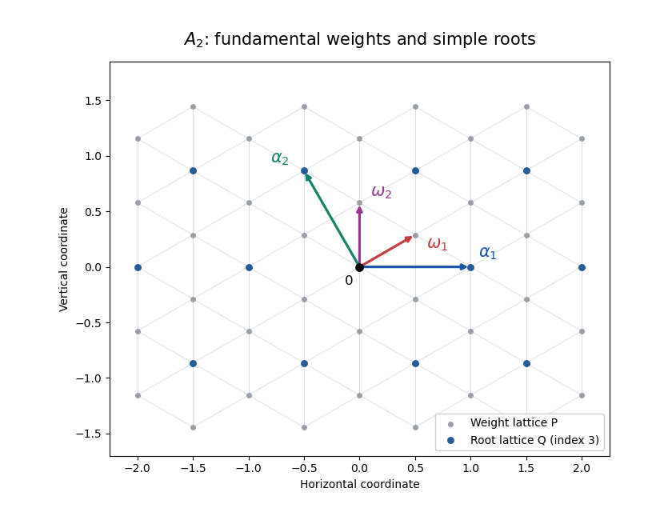

<h1 id="3/solution">Solution</h1>

↑ **Parent:** [3](../3.md)

Let $\alpha_i^\vee=2\alpha_i/(\alpha_i,\alpha_i)$ be the [coroots](../../../../../coroot.md). With a chosen set of [simple roots](../../../../../simple-root.md), the [root lattice](../../../../../root-lattice.md) and [weight lattice](../../../../../weight-lattice.md) are

$$
\boxed{Q=\bigoplus_{i=1}^r\mathbb Z\alpha_i,\qquad P=\{\lambda:\langle\lambda,\alpha_i^\vee\rangle\in\mathbb Z\text{ for every }i\}.}
$$

The [fundamental weights](../../../../../fundamental-weight.md) $\omega_j$ are defined by $\langle\omega_j,\alpha_i^\vee\rangle=\delta_{ij}$, and form an integral basis of $P$. We use the [Cartan matrix](../../../../../cartan-matrix.md) convention $A_{ij}=\langle\alpha_j,\alpha_i^\vee\rangle$.

For the [A2 root system](../../../../../a2-root-system.md), inversion of its [Cartan matrix](../../../../../cartan-matrix.md) yields the [A2 fundamental weights and weight lattice](../../../../../a2-fundamental-weights-and-weight-lattice.md):

$$
\boxed{\omega_1=\frac{2\alpha_1+\alpha_2}{3},\qquad\omega_2=\frac{\alpha_1+2\alpha_2}{3},\qquad P=\mathbb Z\omega_1\oplus\mathbb Z\omega_2.}
$$

Equivalently $\alpha_1=2\omega_1-\omega_2$ and $\alpha_2=-\omega_1+2\omega_2$. The [root lattice](../../../../../root-lattice.md) has index three in the [weight lattice](../../../../../weight-lattice.md), since the change-of-basis matrix has determinant three. For a planar realization take

$$
\alpha_1=(1,0),\quad\alpha_2=(-\tfrac12,\tfrac{\sqrt3}{2}),\quad\omega_1=(\tfrac12,\tfrac{\sqrt3}{6}),\quad\omega_2=(0,\tfrac{\sqrt3}{3}).
$$

The [weight lattice](../../../../../weight-lattice.md) is triangular. In [fundamental weight](../../../../../fundamental-weight.md) coordinates $(a,b)$, a point is in the [root lattice](../../../../../root-lattice.md) exactly when $a-b$ is divisible by three. The following sketch marks both bases and the sublattice:

**[Figure 1](#3/image-a2-weight-lattice-root-sublattice-fundamental-weights-and-simple-roots). A2 weight lattice, root sublattice, fundamental weights and simple roots**.

The integers called Dynkin indices here are the [Dynkin labels](../../../../../dynkin-label.md) of the [highest weight](../../../../../highest-weight-of-a-representation.md):

$$
\boxed{\Lambda_i=\langle\Lambda,\alpha_i^\vee\rangle,\qquad\Lambda=\sum_i\Lambda_i\omega_i.}
$$

For finite-dimensional [Irreducible Lie algebra representations](../../../../../irreducible-lie-algebra-representation.md), they are nonnegative integers. All weight coordinates below are these [Dynkin label](../../../../../dynkin-label.md) coordinates, not simple-root coordinates.

A [weight-string enumeration algorithm](../../../../../weight-string-enumeration-algorithm.md) gives the set of weights without their [weight multiplicities](../../../../../weight-multiplicity.md). Begin with $\Lambda$ and process known weights by increasing height below $\Lambda$. For each simple root and known weight $\mu$, find the largest $p\geq0$ with $\mu+p\alpha_i$ a weight; all such higher weights have already been processed. The [weight string](../../../../../weight-string.md) theorem says that the string has endpoints $\mu+p\alpha_i$, $\mu-q\alpha_i$, with

$$
q-p=\langle\mu,\alpha_i^\vee\rangle,
$$

and includes every intermediate step. Append $\mu-\alpha_i,\ldots,\mu-q\alpha_i$ and repeat until no new weights appear. This terminates in finite dimension and supplies all weights; every nonhighest weight can be reached by simple-root lowering. A string can contain contributions from several sl2 summands, so the resulting set does not by itself determine [weight multiplicities](../../../../../weight-multiplicity.md).

For the explicit calculation we use the following general facts: finite-dimensional representations of a complex [semisimple Lie algebra](../../../../../semisimple-lie-algebra-split.md) are completely reducible by the [Weyl complete reducibility theorem](../../../../../weyl-complete-reducibility-theorem.md); the [symmetric powers of the defining sln representation](../../../../../symmetric-powers-of-the-defining-sln-representation.md) are irreducible of highest weight $m\omega_1$; and weights in a [tensor product of Lie algebra representations](../../../../../tensor-product-of-lie-algebra-representations.md) add with multiplicities multiplied. We also use the [highest-weight representation](../../../../../highest-weight-representation.md) classification: each finite-dimensional irreducible has a unique dominant integral [highest weight](../../../../../highest-weight-of-a-representation.md), and a nonzero vector killed by all simple-root raising operators supplies an irreducible summand with that highest weight in a completely reducible module. For $A_2$, the [Weyl dimension formula](../../../../../weyl-dimension-formula.md) specializes to

$$
\dim R(p,q)=\frac12(p+1)(q+1)(p+q+2).
$$

For $A_2\cong\mathfrak{sl}_3(\mathbb C)$, the defining [fundamental representation](../../../../../fundamental-representation.md) has weights $(1,0),(-1,1),(0,-1)$. Thus the [A2 representation of highest weight (2,0)](../../../../../a2-representation-of-highest-weight-2-0.md) is $\operatorname{Sym}^2\mathbb C^3$, with the six distinct weights

$$
\boxed{W_6=\{(2,0),(0,1),(1,-1),(-2,2),(-1,0),(0,-2)\}.}
$$

Each has multiplicity one: these are the weights of the six quadratic monomials.

For the [tensor square of the A2 representation of highest weight (2,0)](../../../../../tensor-square-of-the-a2-representation-of-highest-weight-2-0.md), add every ordered pair of elements of $W_6$. To list the complete answer compactly, define four disjoint weight sets:

$$
C=\{(4,0),(-4,4),(0,-4)\},
$$

$$
E=\{(2,1),(3,-1),(-2,3),(-3,2),(1,-3),(-1,-2)\},
$$

$$
M=\{(0,2),(2,-2),(-2,0)\},\qquad I=\{(1,0),(-1,1),(0,-1)\}.
$$

The tensor product has multiplicity one at each point of $C$, two at each point of $E$, three at each point of $M$, and four at each point of $I$. These fifteen distinct weights account for $3+12+9+12=36$ states.

We next identify the irreducible summands rather than just their dimensions. Split the [tensor square](../../../../../tensor-square.md) of the six-dimensional space into its [symmetric power](../../../../../symmetric-power.md) and [exterior power](../../../../../exterior-power.md), of dimensions $21$ and $15$. The square of a highest-weight vector in the symmetric part has [highest weight](../../../../../highest-weight-of-a-representation.md) $(4,0)$, giving $R(4,0)$ of dimension $15$.

Let $v_a,v_b$ be vectors of weights $a=(2,0)$ and $b=(0,1)=a-\alpha_1$. In the exterior part $v_a\wedge v_b$ has weight $(2,1)$ and is killed by both simple-root raising operators: raising $v_b$ along $\alpha_1$ gives a multiple of $v_a$, whose wedge with itself is zero, and the other raising actions vanish. Thus it is a highest-weight vector. The [Weyl dimension formula](../../../../../weyl-dimension-formula.md) gives $\dim R(2,1)=15$, so the entire exterior part is this irreducible summand.

The remaining symmetric part has dimension six. To identify it, the fifteen weights of $R(4,0)=\operatorname{Sym}^4\mathbb C^3$ are exactly

$$
(a-b,b-c),\qquad a,b,c\geq0,\quad a+b+c=4,
$$

each once. Subtract them from the unordered-pair weights of $\operatorname{Sym}^2R(2,0)$. The residual weights are $M\cup I$, each once, with highest weight $(0,2)$. They are the negatives of $W_6$, so this six-dimensional summand is $R(0,2)$. Consequently

$$
\boxed{R(2,0)\otimes R(2,0)=R(4,0)\oplus R(2,1)\oplus R(0,2).}
$$

The corresponding dimensions are $15+15+6=36$; complete reducibility and the exhibited highest weights ensure that no summands are missing.

The full [weight multiplicities in the A2 tensor square of highest weight (2,0)](../../../../../weight-multiplicities-in-the-a2-tensor-square-of-highest-weight-2-0.md) are summarized below. An entry is the multiplicity of each individual weight in that row's set:

$$
\begin{array}{c|rrrr}
\text{weight set}&R(2,0)\otimes R(2,0)&R(4,0)&R(2,1)&R(0,2)\\\hline
C&1&1&0&0\\
E&2&1&1&0\\
M&3&1&1&1\\
I&4&1&2&1
\end{array}
$$

Thus $R(4,0)$ has all fifteen weights once, $R(0,2)$ has the six weights $M\cup I$ once, and $R(2,1)$ has its nine boundary weights $E\cup M$ once and its three interior weights $I$ twice. **Only the three interior weights of $R(2,1)$ are degenerate among the irreducible components.**

## ↑ Ancestors (10)

1. [3](../3.md)
2. [Paper 302](../../paper-302-split.md)
3. [Iii](../../split.md)
4. [2016](../../../split.md)
5. [Past exam of the mathematics course of the University of Cambridge](../../../../split.md)
6. [Mathematics course of the University of Cambridge](../../../../../mathematics-course-of-the-university-of-cambridge.md)
7. [Course of the University of Cambridge](../../../../../course-of-the-university-of-cambridge.md)
8. [University of Cambridge](../../../../../university-of-cambridge-split.md)
9. [List of universities](../../../../../list-of-universities.md)
10. [Codex Wiki](../../../../../split.md)
