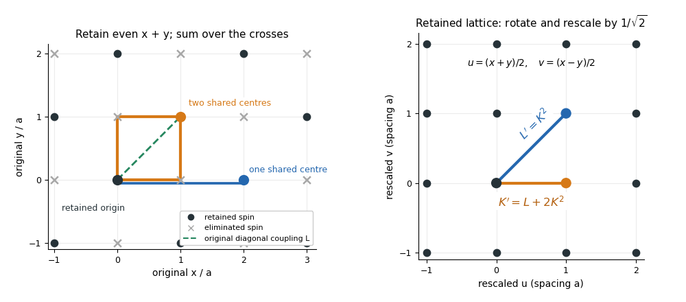

<h1 id="2/solution">Solution</h1>

↑ **Parent:** [2](../2.md)

Use dimensionless interaction couplings in the exponent of the [Boltzmann weight](../../../../../boltzmann-factor.md). In the following formulas $K,L$ denote the physical interaction energies divided by $k_BT$ if that factor has not already been absorbed into the displayed Hamiltonian. This convention is required for temperature-independent numerical fixed-point coordinates.

Split the original [square lattice](../../../../../square-lattice.md) into retained sites $E$ with even $x+y$ and eliminated sites $O$ with odd $x+y$, where coordinates are in units of $a$. Every nearest-neighbour bond joins $E$ to $O$, whereas a diagonal next-nearest-neighbour bond stays within one sublattice. Denote retained [Ising spins](../../../../../ising-spin-variable.md) by $s_e$ and eliminated [Ising spins](../../../../../ising-spin-variable.md) by $\eta_o$. For fixed retained [Ising spins](../../../../../ising-spin-variable.md) define

$$
S_o=\sum_{e:\,e\text{ nearest to }o}s_e.
$$

The blocked [Boltzmann weight](../../../../../boltzmann-factor.md) in the [checkerboard decimation of the square-lattice Ising model](../../../../../checkerboard-decimation-of-the-square-lattice-ising-model.md) is

$$
W(s)=\exp\left(L\sum_{\langle ee'\rangle_{\mathrm{diag}}}s_es_{e'}\right)
\sum_{\{\eta\}}\exp\left[K\sum_{o\in O}\eta_oS_o
+L\sum_{\langle oo'\rangle_{\mathrm{diag}}}\eta_o\eta_{o'}\right].
$$

Use the independent uniform [product measure](../../../../../product-measure.md) on [Ising spins](../../../../../ising-spin-variable.md) on $O$ to perform a [cumulant expansion](../../../../../cumulant-expansion.md). Its one-spin mean vanishes, and $\langle\eta_o\eta_{o'}\rangle_0=\delta_{oo'}$. Consequently the first-order $K$ term, the first-order eliminated-sublattice $L$ term, and the mixed $KL$ term vanish. To the requested order,

$$
\log W(s)=\frac N2\log2+L\sum_{\langle ee'\rangle_{\mathrm{diag}}}s_es_{e'}
+\frac{K^2}{2}\sum_{o\in O}S_o^2
+O(K^4,K^2L,L^2).
$$

Here the truncation keeps $K^2$ and the linear term in $L$; equivalently count $L$ as order $K^2$. At higher orders the interaction family will generally not close.

Each eliminated site has four retained neighbours, so

$$
S_o^2=4+2\sum_{\{e,e'\}\subset\mathrm{NN}(o)}s_es_{e'}.
$$

Its six distinct neighbour pairs comprise four corner pairs at distance $\sqrt2a$ and two opposite pairs at distance $2a$. A given retained diagonal pair shares two eliminated centres; a given opposite pair shares only one. Thus the generated pair couplings are $2K^2$ for diagonal pairs and $K^2$ for axial pairs separated by two original spacings. The original $L$ interaction directly contributes to each retained diagonal pair. No single-spin term survives [spin inversion symmetry](../../../../../spin-inversion-symmetry.md), and no three-spin or four-spin term is present in this second cumulant. This proves closure on exactly two nonconstant interactions at the retained order.

The primitive vectors of the retained [square lattice](../../../../../square-lattice.md) are $a(1,1)$ and $a(1,-1)$. Rotate the axes by $45$ degrees and rescale lengths by $1/\sqrt2$; retained diagonal pairs become nearest neighbours, and the axial distance-$2a$ pairs become next-nearest neighbours. With $b=\sqrt2$, the [leading checkerboard Ising decimation recursion](../../../../../leading-checkerboard-ising-decimation-recursion.md) is therefore

$$
\boxed{K'=L+2K^2,\qquad L'=K^2.}
$$

The constant part of the weight is also determined: $4(K^2/2)(N/2)=NK^2$, so the original [partition function](../../../../../canonical-partition-function.md) equals

$$
Z(K,L)=2^{N/2}e^{NK^2}\,Z_{N/2}(K',L')
$$

to the same order in the logarithm of the weights. That normalization changes [free energy](../../../../../thermodynamic-free-energy.md) but not the retained-spin interaction operators. If physical energy couplings are kept instead, at fixed $\beta_T$ the relations read $K'_{\mathrm{energy}}=L_{\mathrm{energy}}+2\beta_TK_{\mathrm{energy}}^2$ and $L'_{\mathrm{energy}}=\beta_TK_{\mathrm{energy}}^2$.

**[Figure 1](#2/image-two-shared-eliminated-neighbours-generate-a-nearest-neighbour-bond-one-generates-a-next-nearest-neighbour-bond-after-checkerboard-decimation). Two shared eliminated neighbours generate a nearest-neighbour bond; one generates a next-nearest-neighbour bond after checkerboard decimation**.

The fixed-point equations are $L_*=K_*^2$ and $K_*=3K_*^2$. Their only finite real solutions are

$$
\boxed{(K_*,L_*)=(0,0)\quad\text{and}\quad(K_*,L_*)=\left(\frac13,\frac19\right).}
$$

The origin is the high-temperature fixed point; its [Jacobian matrix](../../../../../jacobian-matrix.md) is $\begin{pmatrix}0&1\\0&0\end{pmatrix}$, with both multipliers zero. The nontrivial candidate critical point is $(1/3,1/9)$. Linearize the discrete [renormalization-group transformation](../../../../../renormalization-group-transformation.md) there:

$$
\begin{pmatrix}\delta K'\\\delta L'\end{pmatrix}
=\begin{pmatrix}4/3&1\\2/3&0\end{pmatrix}
\begin{pmatrix}\delta K\\\delta L\end{pmatrix}+O(\delta K^2).
$$

The characteristic polynomial is $\lambda^2-(4/3)\lambda-2/3$, giving

$$
\boxed{\lambda_+=\frac{2+\sqrt{10}}3\approx1.72076,\qquad
\lambda_-=\frac{2-\sqrt{10}}3\approx-0.387426.}
$$

[Eigenvectors](../../../../../eigenvector.md) may be chosen as $(1,2/(3\lambda_\pm))^T$. The positive [eigenvalue](../../../../../eigenvalue.md) greater than one is the [relevant direction of a fixed point](../../../../../relevant-direction-of-a-fixed-point.md); the other is irrelevant because its magnitude is less than one. Its negative sign only alternates the sign of the perturbation between steps. For a discrete map the magnitude relative to one decides relevance, not the sign rule used for continuous beta-function [eigenvalues](../../../../../eigenvalue.md).

Let $t$ be the relevant thermal scaling coordinate, so $t'=\lambda_+t$ to first order. A [correlation length](../../../../../correlation-length.md) measured in restored lattice units satisfies $\xi(t')=\xi(t)/b$. If $\xi(t)\sim|t|^{-\nu}$, then $\lambda_+^{-\nu}=b^{-1}$. Hence the [thermal exponent from a discrete renormalization map](../../../../../thermal-exponent-from-a-discrete-renormalization-map.md) is

$$
\boxed{\nu=\frac{\log b}{\log\lambda_+}
=\frac{\log\sqrt2}{\log[(2+\sqrt{10})/3]}\approx0.6385.}
$$

This is the value predicted by the stated low-order [real-space renormalization group](../../../../../real-space-renormalization-group.md), whose nontrivial fixed point is evaluated beyond the strictly infinitesimal-coupling limit. It is an approximation, not an exact solution of the full square-lattice [Ising model](../../../../../ising-model.md).

## ↑ Ancestors (10)

1. [2](../2.md)
2. [Paper 303](../../paper-303-split.md)
3. [Iii](../../split.md)
4. [2016](../../../split.md)
5. [Past exam of the mathematics course of the University of Cambridge](../../../../split.md)
6. [Mathematics course of the University of Cambridge](../../../../../mathematics-course-of-the-university-of-cambridge.md)
7. [Course of the University of Cambridge](../../../../../course-of-the-university-of-cambridge.md)
8. [University of Cambridge](../../../../../university-of-cambridge-split.md)
9. [List of universities](../../../../../list-of-universities.md)
10. [Codex Wiki](../../../../../split.md)
