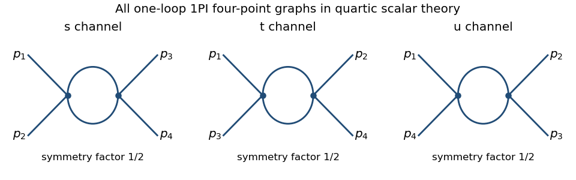

<h1 id="1/solution">Solution</h1>

↑ **Parent:** [1](../1.md)

Use the [Euclidean path integral](../../../../../euclidean-path-integral.md) with weight $e^{-S}$ and [Fourier transform](../../../../../fourier-transform.md) convention $\phi(x)=\int d^dp\,(2\pi)^{-d}e^{ip\cdot x}\phi(p)$. The momentum-space [Feynman rules](../../../../../feynman-rule.md) are: an internal [scalar propagator](../../../../../scalar-propagator.md) $1/(p^2+m^2)$; a quartic vertex $-\lambda$ together with $(2\pi)^d\delta^{(d)}(\sum p_i)$ for incoming momenta; and an integral $\int d^dk/(2\pi)^d$ over each independent [loop momentum](../../../../../loop-momentum.md). Multiply by the [Feynman-diagram symmetry factor](../../../../../feynman-diagram-symmetry-factor.md); external propagators are retained for a full [correlation function](../../../../../correlation-function.md) and removed for an [amputated connected correlation function](../../../../../amputated-connected-correlation-function.md).

To enumerate the requested [one-particle-irreducible Feynman diagrams](../../../../../one-particle-irreducible-feynman-diagram.md), let $V$ be the number of quartic vertices and $I$ the number of internal edges. Four external legs imply $4V=2I+4$, while one [loop order](../../../../../loop-order.md) implies $I-V+1=1$. Thus $V=I=2$. Both internal edges must connect the two vertices: an alternative with a tadpole and one connecting edge would disconnect on cutting that edge. The only graphs are therefore the three pairings of labelled external legs, each with [Feynman-diagram symmetry factor](../../../../../feynman-diagram-symmetry-factor.md) $1/2$.

**[Figure 1](#1/image-the-s-t-and-u-one-loop-one-particle-irreducible-four-point-graphs-of-quartic-scalar-theory). The s, t and u one-loop one-particle-irreducible four-point graphs of quartic scalar theory**.

The corresponding channel momenta are $q_s=p_1+p_2$, $q_t=p_1+p_3$, and $q_u=p_1+p_4$, with all external momenta incoming. This exhausts the connected one-loop four-point [one-particle-irreducible Feynman diagrams](../../../../../one-particle-irreducible-feynman-diagram.md).

For the [Euclidean massive loop integral](../../../../../euclidean-massive-loop-integral.md), first take $m^2>0$ and an integer $n>d/2$, where the integral converges. [Schwinger parameterization](../../../../../schwinger-parameterization.md) gives

$$
\frac1{(k^2+m^2)^n}=\frac1{\Gamma(n)}\int_0^\infty ds\,s^{n-1}e^{-s(k^2+m^2)}.
$$

The supplied [Gaussian integral](../../../../../gaussian-integral.md) then yields

$$
\int\frac{d^dk}{(2\pi)^d}e^{-sk^2}=(4\pi s)^{-d/2}.
$$

Integrating over $s$, and using the [Gamma function recurrence](../../../../../gamma-function-recurrence.md) to obtain $\Gamma(n)=(n-1)!$, proves

$$
\boxed{\int\frac{d^dk}{(2\pi)^d}\frac1{(k^2+m^2)^n}=\frac{(m^2)^{d/2-n}}{(4\pi)^{d/2}(n-1)!}\Gamma(n-d/2).}
$$

Outside its initial convergence range, the right-hand side defines the meromorphic continuation used in [dimensional regularization](../../../../../dimensional-regularization.md); the divergent ordinary integral is not being assigned a convergent value.

For the [scalar bubble integral](../../../../../scalar-bubble-integral.md), the [Feynman parameter](../../../../../feynman-parameter.md) identity $1/(AB)=\int_0^1dx\,[xA+(1-x)B]^{-2}$ followed by a translation of [loop momentum](../../../../../loop-momentum.md) gives

$$
B(p)=\frac{\Gamma(2-d/2)}{(4\pi)^{d/2}}\int_0^1dx\,[m^2+x(1-x)p^2]^{d/2-2}.
$$

With $d=4-\epsilon$, the [Gamma function](../../../../../gamma-function.md) satisfies $\Gamma(\epsilon/2)=2/\epsilon+O(1)$, and the parameter integral tends to one. Hence **the ultraviolet pole is independent of external momentum**:

$$
\boxed{B(p)=\frac1{8\pi^2\epsilon}+O(1).}
$$

One can also see why the same pole occurs without introducing a [Feynman parameter](../../../../../feynman-parameter.md): at large $k$, the difference between this integrand and $(k^2+m^2)^{-2}$ is ultraviolet integrable near four dimensions, so both have the same [dimensional regularization](../../../../../dimensional-regularization.md) pole. The positive mass avoids an infrared ambiguity in this argument.

In the [quantum effective action](../../../../../effective-action.md) convention, the tree-level four-point vertex is $+\lambda$, the negative of the [amputated connected correlation function](../../../../../amputated-connected-correlation-function.md) tree vertex. The three bubble corrections give

$$
\Gamma^{(4)}=\lambda-\frac{\lambda^2}{2}\{B(q_s)+B(q_t)+B(q_u)\}+\delta\lambda+O(\lambda^3).
$$

Thus **the pole counterterm** is $\delta\lambda=3\lambda^2/(16\pi^2\epsilon)$. The [modified minimal subtraction scheme](../../../../../modified-minimal-subtraction-scheme.md) also subtracts the conventional finite $\log4\pi-\gamma_E$ combination, or equivalently absorbs it into the subtraction-scale convention; that does not change the one-loop [renormalization-group beta function](../../../../../beta-function-physics.md). Using that scale convention, write

$$
\lambda_B=\mu^\epsilon\left(\lambda+\frac{3\lambda^2}{16\pi^2\epsilon}+O(\lambda^3)\right).
$$

Here $\lambda$ is dimensionless, $[\lambda_B]=\epsilon$, and the conventional constant scale factor is implicit. The one-loop tadpole is momentum independent, so [wave-function renormalization](../../../../../wave-function-renormalization.md) does not contribute at this order. Differentiating at fixed $\lambda_B$, with $a=3/(16\pi^2)$, gives $0=\epsilon(\lambda+a\lambda^2/\epsilon)+\beta(1+2a\lambda/\epsilon)+O(\lambda^3)$. Therefore

$$
\boxed{\beta(\lambda)=-\epsilon\lambda+\frac{3\lambda^2}{16\pi^2}+O(\lambda^3),\qquad\beta_{d=4}(\lambda)=\frac{3\lambda^2}{16\pi^2}+O(\lambda^3).}
$$

For the stable [quartic scalar field theory](../../../../../quartic-interaction.md), with $\lambda>0$, the [one-loop quartic scalar beta function](../../../../../one-loop-quartic-scalar-beta-function.md) is positive: the [running coupling](../../../../../running-coupling.md) increases toward the ultraviolet and decreases toward the infrared. The theory is not [asymptotically free](../../../../../asymptotic-freedom.md); extrapolating the one-loop flow gives a [Landau pole](../../../../../landau-pole.md).

## ↑ Ancestors (10)

1. [1](../1.md)
2. [Paper 304](../../paper-304-split.md)
3. [Iii](../../split.md)
4. [2016](../../../split.md)
5. [Past exam of the mathematics course of the University of Cambridge](../../../../split.md)
6. [Mathematics course of the University of Cambridge](../../../../../mathematics-course-of-the-university-of-cambridge.md)
7. [Course of the University of Cambridge](../../../../../course-of-the-university-of-cambridge.md)
8. [University of Cambridge](../../../../../university-of-cambridge-split.md)
9. [List of universities](../../../../../list-of-universities.md)
10. [Codex Wiki](../../../../../split.md)
