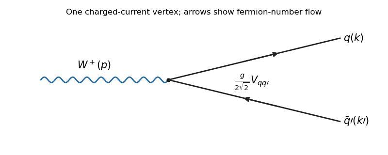
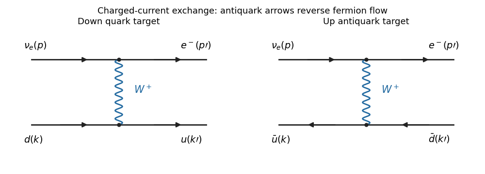

# Paper 305

↑ **Parent:** [Iii](../iii.md)

[https://www.maths.cam.ac.uk/postgrad/part-iii/files/pastpapers/2016/paper_305.pdf](https://www.maths.cam.ac.uk/postgrad/part-iii/files/pastpapers/2016/paper_305.pdf)

**Table of contents**

- [1](#1)
  - [a](#1/a)
    - [Solution](#1/a/solution)
  - [b](#1/b)
    - [Solution](#1/b/solution)
  - [c](#1/c)
    - [Solution](#1/c/solution)
  - [d](#1/d)
    - [Solution](#1/d/solution)
- [2](#2)
  - [a](#2/a)
    - [Solution](#2/a/solution)
  - [b](#2/b)
    - [Solution](#2/b/solution)
- [3](#3)
  - [a](#3/a)
    - [Solution](#3/a/solution)
  - [b](#3/b)
    - [Solution](#3/b/solution)
  - [c](#3/c)
    - [Solution](#3/c/solution)
- [4](#4)
  - [a](#4/a)
    - [Solution](#4/a/solution)
  - [b](#4/b)
    - [Solution](#4/b/solution)
  - [c](#4/c)
    - [Solution](#4/c/solution)

## 1

↑ **Parent:** [Paper 305](paper-305.md)

<h3 id="1/a">a</h3>

↑ **Parent:** [1](#1)

<h4 id="1/a/solution">Solution</h4>

↑ **Parent:** [A](#1/a)

The operator $b^s(p)$ is a [fermionic annihilation operator](../../../relativistic-quantum-field.md#fermionic-annihilation-operator) for a particle with momentum $\mathbf p$ and spin label $s$; $d^{s\dagger}(p)$ is a [fermionic creation operator](../../../relativistic-quantum-field.md#fermionic-creation-operator) for the corresponding [antiparticle](../../../relativistic-quantum-field.md#antiparticle). The c-number [Dirac spinors](../../../relativistic-quantum-field.md#dirac-spinor) $u^s(p)$ and $v^s(p)$ solve the positive-energy particle and antiparticle equations respectively. They supply the spinor wavefunctions in the [mode expansion of a Dirac field](../../../relativistic-quantum-field.md#mode-expansion-of-a-dirac-field); they are not creation or annihilation operators.

Apply the specified [parity](../../../quantum-mechanics.md#parity) transformation to the two operators in the [mode expansion of a Dirac field](../../../relativistic-quantum-field.md#mode-expansion-of-a-dirac-field):

$$
\widehat P\psi(x)\widehat P^{-1}=\eta_P\sum_{p,s}\left[b^s(p_P)u^s(p)e^{-ip\cdot x}-d^{s\dagger}(p_P)v^s(p)e^{ip\cdot x}\right].
$$

Relabel $k=p_P$. The momentum sum is unchanged, $p\cdot x=k\cdot x_P$, and the spinor identities give $u^s(p)=\gamma^0u^s(k)$ and $v^s(p)=-\gamma^0v^s(k)$. The two minus signs in the antiparticle term cancel. Therefore

$$
\boxed{\widehat P\psi(x)\widehat P^{-1}=\eta_P\gamma^0\psi(x_P).}
$$

Taking the [Hermitian conjugate](../../../hilbert-space.md#hermitian-conjugation) and using $(\gamma^0)^\dagger=\gamma^0$, $(\gamma^0)^2=1$ in the [Dirac adjoint](../../../relativistic-quantum-field.md#dirac-adjoint) yields

$$
\boxed{\widehat P\bar\psi(x)\widehat P^{-1}=\eta_P^*\bar\psi(x_P)\gamma^0.}
$$

The unit-modulus intrinsic-parity phase cancels from all neutral [fermion bilinears](../../../relativistic-quantum-field.md#fermion-bilinear).

<h3 id="1/b">b</h3>

↑ **Parent:** [1](#1)

<h4 id="1/b/solution">Solution</h4>

↑ **Parent:** [B](#1/b)

Use the printed [gamma matrix](../../../algebra.md#gamma-matrices) conventions throughout, in particular $\gamma^5=-i\gamma^0\gamma^1\gamma^2\gamma^3$. The transpose identity for $\gamma^0$ gives $C\gamma^0=-\gamma^0C$, and its [Hermitian conjugate](../../../hilbert-space.md#hermitian-conjugation) gives the corresponding identity for $C^\dagger$. Thus the [Dirac adjoint](../../../relativistic-quantum-field.md#dirac-adjoint) of the charge-conjugated field is

$$
\bar\psi^{\,C}=\eta_C^*\psi^T\gamma^0C^\dagger\gamma^0=-\eta_C^*\psi^TC^\dagger.
$$

Reordering the anticommuting components of the [fermion bilinear](../../../relativistic-quantum-field.md#fermion-bilinear) supplies a minus sign:

$$
\bar\psi^{\,C}\psi^C=-\psi^TC^\dagger C\bar\psi^T
=\bar\psi(C^\dagger C)^T\psi.
$$

Invariance for arbitrary fields therefore requires **$C^\dagger C=I$**, so the charge-conjugation matrix is a [unitary matrix](../../../linear-operator-theory.md#unitary-matrix). This is the required normalization constraint; it is not a bosonic reordering calculation.

For a spinor matrix $\Gamma$, the same calculation and the given $C^{-1}=C^T$ give

$$
(\bar\psi\Gamma\psi)^C=\bar\psi(C^{-1}\Gamma C)^T\psi
=\bar\psi C^{-1}\Gamma^TC\psi.
$$

With $V^\mu=\bar\psi\gamma^\mu\psi$ and $A^\mu=\bar\psi\gamma^\mu\gamma^5\psi$, the supplied transpose identities imply

$$
C^{-1}\gamma^{\mu T}C=-\gamma^\mu,\qquad
C^{-1}(\gamma^\mu\gamma^5)^TC
=-\gamma^5\gamma^\mu=\gamma^\mu\gamma^5.
$$

Consequently **the [vector current](../../../relativistic-quantum-field.md#vector-current) is C-odd and the [axial current](../../../relativistic-quantum-field.md#axial-current) is C-even**: $V^\mu\mapsto-V^\mu$ and $A^\mu\mapsto A^\mu$.

For [parity](../../../quantum-mechanics.md#parity), put $\Lambda=\operatorname{diag}(1,-1,-1,-1)$. The [gamma matrix](../../../algebra.md#gamma-matrices) identities $\gamma^0\gamma^\mu\gamma^0=\Lambda^\mu{}_{\nu}\gamma^\nu$ and $\gamma^0\gamma^5\gamma^0=-\gamma^5$ give

$$
\boxed{V^\mu(x)\stackrel P\longmapsto\Lambda^\mu{}_{\nu}V^\nu(x_P),\qquad
A^\mu(x)\stackrel P\longmapsto-\Lambda^\mu{}_{\nu}A^\nu(x_P).}
$$

Thus $V^0$ is P-even and $\mathbf V$ P-odd, whereas $A^0$ is P-odd and $\mathbf A$ P-even. The [axial current](../../../relativistic-quantum-field.md#axial-current) transforms as a [pseudovector](../../../vector-space.md#pseudovector).

<h3 id="1/c">c</h3>

↑ **Parent:** [1](#1)

<h4 id="1/c/solution">Solution</h4>

↑ **Parent:** [C](#1/c)

Keep the color matrix intact: $\mathcal A_\mu=A^a_\mu T^a$. Under [parity](../../../quantum-mechanics.md#parity), invariance of its contraction with the [vector current](../../../relativistic-quantum-field.md#vector-current) requires

$$
\boxed{\mathcal A_\mu(x)\stackrel P\longmapsto\Lambda_\mu{}^\nu\mathcal A_\nu(x_P).}
$$

Under [charge conjugation](../../../quantum-field-theory.md#charge-conjugation), the fermionic reordering in part (b) transposes the color matrix as well as the spinor matrix. For a fixed color matrix $M$, $\bar\psi M\gamma^\mu\psi$ becomes $-\bar\psi M^T\gamma^\mu\psi$. Hence invariance of the interaction requires

$$
\boxed{\mathcal A_\mu(x)\stackrel C\longmapsto-\mathcal A_\mu(x)^T.}
$$

This is not a rule that changes the sign of every individual color component: transposition also acts on the generators of the [fundamental representation](../../../semisimple-lie-algebra.md#fundamental-representation).

Write the [gauge field strength](../../../relativistic-quantum-field.md#gauge-field-strength) as $\mathcal F_{\mu\nu}=\partial_\mu\mathcal A_\nu-\partial_\nu\mathcal A_\mu+ig[\mathcal A_\mu,\mathcal A_\nu]$. Since $[A^T,B^T]=-[A,B]^T$, the [charge conjugation](../../../quantum-field-theory.md#charge-conjugation) rule gives $\mathcal F_{\mu\nu}\mapsto-\mathcal F_{\mu\nu}^T$. Including the coordinate reflection in [CP symmetry](../../../quantum-field-theory.md#cp-symmetry),

$$
\boxed{\mathcal F_{\mu\nu}(x)\stackrel{CP}\longmapsto
-\Lambda_\mu{}^\alpha\Lambda_\nu{}^\beta\mathcal F_{\alpha\beta}(x_P)^T.}
$$

For generators normalized by $\operatorname{Tr}(T^aT^b)=\kappa\delta^{ab}$, the color contraction equals $\kappa^{-1}\operatorname{Tr}(\mathcal F_{\mu\nu}\mathcal F_{\rho\sigma})$. The two charge-conjugation minus signs cancel, and transposition reverses the order inside the trace without changing it. The [Levi-Civita symbol](../../../calculus.md#levi-civita-symbol) acquires $\det\Lambda=-1$ under the remaining reflection. Thus

$$
\boxed{\mathcal L_\theta(x)\stackrel{CP}\longmapsto-\mathcal L_\theta(x_P).}
$$

**The [Yang-Mills theta term](../../../relativistic-quantum-field.md#yang-mills-theta-term) is CP-odd; a generic fixed nonzero $\theta$ produces [CP violation](../../../quantum-field-theory.md#cp-violation).** Setting $\theta=0$ removes this source. Although the density is a total derivative, it can affect the quantum theory through nontrivial topological sectors; the local transformation test is not rendered irrelevant by that fact.

<h3 id="1/d">d</h3>

↑ **Parent:** [1](#1)

<h4 id="1/d/solution">Solution</h4>

↑ **Parent:** [D](#1/d)

An experimentally observed example is **$K_L\to\pi^+\pi^-$**, a decay of the long-lived neutral [kaon](../../../physics.md#kaon) into a CP-even two-pion state. Without [CP violation](../../../quantum-field-theory.md#cp-violation), the long-lived state would be CP-odd and this decay would be forbidden.

For the [CKM matrix](../../../standard-model.md#cabibbo-kobayashi-maskawa-matrix) mechanism of [CP violation](../../../quantum-field-theory.md#cp-violation), **three [quark generations](../../../standard-model.md#quark-generation) are the minimum**. Rephasings remove every complex phase for one or two generations, while three generations leave one physical [CP-violating phase](../../../quantum-field-theory.md#cp-violating-phase). This count concerns weak quark mixing. The [Yang-Mills theta term](../../../relativistic-quantum-field.md#yang-mills-theta-term) in part (c) is a separate possible source of [CP violation](../../../quantum-field-theory.md#cp-violation) and does not require three generations.

## 2

↑ **Parent:** [Paper 305](paper-305.md)

<h3 id="2/a">a</h3>

↑ **Parent:** [2](#2)

<h4 id="2/a/solution">Solution</h4>

↑ **Parent:** [A](#2/a)

Let $V(\phi)=m^2\phi^2/2+\lambda(\phi^2)^2/4$, where $\phi^2=\sum_i\phi_i^2$. Its stationary-point equation is $(m^2+\lambda\phi^2)\phi_i=0$.

For $m^2>0$, the unique minimum is $\phi=0$. The quadratic [mass term](../../../quantum-field-theory.md#mass-term) is $m^2\delta_{ij}$, so **there are $n$ [real scalar fields](../../../scalar-field-theory.md#real-scalar-field), all of mass $\sqrt{m^2}$**, and the global [special orthogonal group](../../../linear-algebra.md#special-orthogonal-group) $SO(n)$ remains unbroken.

For $m^2<0$, write $v^2=-m^2/\lambda$. The [vacuum manifold](../../../quantum-field-theory.md#vacuum-manifold) is the sphere $\phi^2=v^2$. Choose $\langle\phi\rangle=v e_n$. The transformations preserving this [vacuum expectation value](../../../quantum-field-theory.md#vacuum-expectation-value) rotate the first $n-1$ components, giving **$SO(n)\to SO(n-1)$**. At this vacuum the potential's [Hessian matrix](../../../calculus.md#hessian-matrix) is

$$
\left.\frac{\partial^2V}{\partial\phi_i\partial\phi_j}\right|_{ve_n}
=2\lambda v^2\delta_{in}\delta_{jn}.
$$

Writing $\phi=(\pi_1,\ldots,\pi_{n-1},v+\eta)$, the radial mode $\eta$ therefore has

$$
\boxed{m_\eta^2=2\lambda v^2=-2m^2,\qquad m_{\pi_a}^2=0\quad(a=1,\ldots,n-1).}
$$

These are one massive radial scalar and $n-1$ physical [Goldstone bosons](../../../critical-phenomenon.md#goldstone-boson). The [Goldstone theorem](../../../quantum-field-theory.md#goldstone-theorem) applies to the broken global generators; the flat angular directions of the [vacuum manifold](../../../quantum-field-theory.md#vacuum-manifold) explain their zero masses. The [spontaneous symmetry breaking](../../../quantum-field-theory.md#spontaneous-symmetry-breaking) is a choice of vacuum, not a change in the invariant Lagrangian. For $n=1$ there are no continuous angular directions: only the radial scalar remains, and the potential's discrete $\phi\mapsto-\phi$ symmetry is broken.

<h3 id="2/b">b</h3>

↑ **Parent:** [2](#2)

<h4 id="2/b/solution">Solution</h4>

↑ **Parent:** [B](#2/b)

The three real components form the [Adjoint representation](../../../lie-algebra.md#adjoint-representation-of-a-lie-algebra) of $SU(2)$. Around a nonzero vacuum, a local [gauge transformation](../../../electromagnetism.md#gauge-transformation) rotates the direction of $\phi(x)$ to the third axis. In this [unitary gauge](../../../standard-model.md#unitary-gauge), the two angular fields are removed from the scalar parametrization and become longitudinal polarizations of two [gauge bosons](../../../relativistic-quantum-field.md#gauge-boson), through the [Higgs mechanism](../../../standard-model.md#higgs-mechanism). Thus $\phi=(0,0,v+\eta)^T$ describes the perturbative physical fluctuations, with $v^2=-m^2/\lambda$.

The subgroup generated by $t^3$ fixes $ve_3$, giving **$SU(2)\to U(1)$**. Define the physical vector fields

$$
A_\mu=B^3_\mu,\qquad W^\pm_\mu=\frac{B^1_\mu\mp iB^2_\mu}{\sqrt2}.
$$

The [gauge covariant derivative](../../../relativistic-quantum-field.md#gauge-covariant-derivative) on the radial configuration is

$$
D_\mu\phi=\begin{pmatrix}-gB^2_\mu(v+\eta)\\gB^1_\mu(v+\eta)\\\partial_\mu\eta\end{pmatrix},
$$

so the scalar [kinetic term](../../../quantum-field-theory.md#kinetic-term) becomes $\frac12(\partial\eta)^2+g^2(v+\eta)^2W^+_\mu W^{-\mu}$.

Here is an exact form of the Lagrangian in these physical fields, up to its additive vacuum constant. Define

$$
f_{\mu\nu}=\partial_\mu A_\nu-\partial_\nu A_\mu,\qquad
G^\pm_{\mu\nu}=(\partial_\mu\pm igA_\mu)W^\pm_\nu-(\partial_\nu\pm igA_\nu)W^\pm_\mu,
$$

and

$$
H_{\mu\nu}=f_{\mu\nu}+ig(W^+_\mu W^-_\nu-W^-_\mu W^+_\nu).
$$

The minus sign in the printed non-Abelian [gauge field strength](../../../relativistic-quantum-field.md#gauge-field-strength) gives precisely these signs. Then

$$
\boxed{\mathcal L=-\frac14H_{\mu\nu}H^{\mu\nu}-\frac12G^+_{\mu\nu}G^{-\mu\nu}
+\frac12\partial_\mu\eta\partial^\mu\eta
+g^2(v+\eta)^2W^+_\mu W^{-\mu}
-\lambda v^2\eta^2-\lambda v\eta^3-\frac\lambda4\eta^4.}
$$

Its quadratic terms give **$m_A=0$, $m_{W^+}=m_{W^-}=gv$, and $m_\eta=\sqrt{2\lambda}\,v$**. The two massive vectors have six real polarization degrees of freedom in total; the massless vector has two and the scalar one. Their total of nine equals the original six vector plus three scalar degrees of freedom.

Under the surviving $U(1)$, $W^+$ and $W^-$ have opposite charges and $\eta$ is neutral. The [Yang-Mills theory](../../../relativistic-quantum-field.md#yang-mills-theory) supplies $AW^+W^-$ and $AAW^+W^-$ couplings and quartic charged-vector self-interactions. The scalar term supplies $2g^2v\eta W^+W^-$ and $g^2\eta^2W^+W^-$, together with the cubic and quartic scalar self-interactions. There is no direct $\eta AA$ term.

With suitable fermions, this spectrum offers a massless [photon](../../../quantum-mechanics.md#photon) and massive charged mediators of short-range [weak charged currents](../../../standard-model.md#charged-current), so it captures part of the weak/electromagnetic pattern. It differs crucially from the [electroweak interaction](../../../standard-model.md#electroweak-interaction) of the [Standard Model](../../../standard-model.md): the latter gauges $SU(2)_L\times U(1)_Y$, uses a complex [Higgs doublet](../../../standard-model.md#higgs-field), and breaks to $U(1)_{\rm em}$. Three rather than two generators are broken, leaving a massive neutral [Z boson](../../../standard-model.md#z-boson) as well as $W^\pm$ and a [photon](../../../quantum-mechanics.md#photon). Its charge operator $Q=T^3+Y$ and independent hypercharge coupling give a nontrivial [weak mixing angle](../../../standard-model.md#weinberg-angle). The present theory has no massive neutral mediator, no such mixing angle, and does not reproduce the observed chiral fermion charge assignments or their usual [Yukawa couplings](../../../standard-model.md#yukawa-interaction) from the standard doublet/singlet assignments.

## 3

↑ **Parent:** [Paper 305](paper-305.md)

<h3 id="3/a">a</h3>

↑ **Parent:** [3](#3)

<h4 id="3/a/solution">Solution</h4>

↑ **Parent:** [A](#3/a)

The [Yukawa matrices](../../../standard-model.md#yukawa-matrix) for up-type and down-type [quarks](../../../standard-model.md#quark) are diagonalized by separate unitary changes of basis. Let $u_L^{\rm weak}=U_u u_L^{\rm mass}$ and $d_L^{\rm weak}=U_d d_L^{\rm mass}$. The generation-diagonal [weak charged current](../../../standard-model.md#charged-current) in the weak basis becomes

$$
\bar u_L^{\rm weak}\gamma^\mu d_L^{\rm weak}
=\bar u_L^{\rm mass}\gamma^\mu(U_u^\dagger U_d)d_L^{\rm mass},\qquad
\boxed{V_{\rm CKM}=U_u^\dagger U_d.}
$$

Thus the [CKM matrix](../../../standard-model.md#cabibbo-kobayashi-maskawa-matrix) records the mismatch between the two left-handed mass bases, not an additional non-unitary interaction.

An $N\times N$ [unitary matrix](../../../linear-operator-theory.md#unitary-matrix) has $N^2$ real parameters. The $2N$ quark-field phases can remove $2N-1$ phases from $V$: the common phase changes neither current. This leaves $(N-1)^2$ physical real parameters, comprising $N(N-1)/2$ mixing angles and $(N-1)(N-2)/2$ [CP-violating phases](../../../quantum-field-theory.md#cp-violating-phase). Hence **three generations give four parameters: three angles and one phase; four generations give nine: six angles and three phases**. This count assumes the usual nondegenerate masses, so that extra mass degeneracies do not enlarge the allowed basis transformations.

<h3 id="3/b">b</h3>

↑ **Parent:** [3](#3)

<h4 id="3/b/solution">Solution</h4>

↑ **Parent:** [B](#3/b)

The [tree-level Feynman diagram](../../../perturbative-quantum-field-theory.md#tree-level-feynman-diagram) contains one [weak charged current](../../../standard-model.md#charged-current) vertex. Fermion arrows point along fermion-number flow, so the outgoing [antiquark](../../../standard-model.md#antiquark) arrow points toward the vertex.

**[Figure 1](#3/b/image-tree-level-w-plus-decay-into-an-outgoing-quark-and-antiquark-with-fermion-flow-arrows). Tree-level W-plus decay into an outgoing quark and antiquark with fermion-flow arrows**.

For one fixed matching color, the [scattering amplitude](../../../quantum-mechanics.md#scattering-amplitude) is

$$
\mathcal M=\frac{g}{2\sqrt2}V_{qq'}\epsilon_\mu(p)\bar u(k)\gamma^\mu(1-\gamma^5)v(k').
$$

An overall phase from the vertex has no effect on the width. The [fermion spin sums](../../../relativistic-quantum-field.md#fermion-spin-sum) give $\sum u\bar u=\not k$, $\sum v\bar v=\not k'$ in the massless approximation. For the three initial polarizations, use a [spin average](../../../relativistic-quantum-field.md#spin-average) of $1/3$. The [gamma matrix trace identities](../../../algebra.md#gamma-matrix-trace-identities) give

$$
T^{\mu\nu}=\operatorname{Tr}\left[\not k\gamma^\mu(1-\gamma^5)\not k'\gamma^\nu(1-\gamma^5)\right]
=8\left(k^\mu k'^\nu+k^\nu k'^\mu-g^{\mu\nu}k\cdot k'+i\epsilon^{\mu\nu\rho\sigma}k_\rho k'_\sigma\right).
$$

The sign of the last term follows the PDF's $\gamma^5$ convention and does not affect this decay: the polarization sum is symmetric. Since $p=k+k'$ and the daughter masses vanish, $p_\mu T^{\mu\nu}=0$ and $k\cdot k'=M_W^2/2$. Therefore

$$
\overline{|\mathcal M|^2}_{\text{one color}}
=\frac{g^2|V_{qq'}|^2}{24}\left(-g_{\mu\nu}+\frac{p_\mu p_\nu}{M_W^2}\right)T^{\mu\nu}
=\frac{g^2M_W^2}{3}|V_{qq'}|^2.
$$

In the rest frame, the two-body [Lorentz-invariant phase space](../../../relativistic-quantum-field.md#lorentz-invariant-phase-space) integrates to $1/(8\pi)$: after the spatial delta function sets $\mathbf k'=-\mathbf k$, its radial delta function fixes $|\mathbf k|=M_W/2$. Explicitly,

$$
\int d\Phi_2=\frac{1}{16\pi^2}\int d\Omega\int_0^\infty dk\,\delta(M_W-2k)=\frac{1}{8\pi}.
$$

The decay formula consequently gives

$$
\Gamma_{\text{one color}}=\frac{\overline{|\mathcal M|^2}}{16\pi M_W}
=\frac{g^2M_W}{48\pi}|V_{qq'}|^2
=\boxed{\frac{G_FM_W^3}{6\pi\sqrt2}|V_{qq'}|^2.}
$$

**This is the printed expression, interpreted for one color.** For a physical quark-flavor channel there are three orthogonal final color states. Their probabilities add; no initial color average is present for a colorless [W boson](../../../standard-model.md#w-boson). Thus

$$
\boxed{\Gamma_{W^+\to q\bar q'}=N_c\frac{G_FM_W^3}{6\pi\sqrt2}|V_{qq'}|^2,\qquad N_c=3.}
$$

The PDF's formula omits this color multiplicity if read as the ordinary inclusive flavor width. It is also the familiar normalization for a colorless lepton channel.

The six physically accessible [quark](../../../standard-model.md#quark) combinations are **$u\bar d,u\bar s,u\bar b,c\bar d,c\bar s,c\bar b$**. A real on-shell [W boson](../../../standard-model.md#w-boson) cannot produce a [top quark](../../../standard-model.md#top-quark); the massless approximation is applied to the accessible daughters and does not open a physically forbidden top channel. [CKM matrix](../../../standard-model.md#cabibbo-kobayashi-maskawa-matrix) unitarity gives $\sum_{q'=d,s,b}|V_{uq'}|^2=\sum_{q'=d,s,b}|V_{cq'}|^2=1$. Therefore the physical color-summed hadronic width at this order is

$$
\boxed{\Gamma_{\rm had}=\frac{G_FM_W^3}{\pi\sqrt2}.}
$$

If the printed one-color convention is retained for every channel, its sum is instead $G_FM_W^3/(3\pi\sqrt2)$. In the artificial theory where all three up-type flavors, including the top, are kinematically massless, there would be nine channels and the physical sum would be $9G_FM_W^3/(6\pi\sqrt2)$; that is not the on-shell Standard Model channel list.

<h3 id="3/c">c</h3>

↑ **Parent:** [3](#3)

<h4 id="3/c/solution">Solution</h4>

↑ **Parent:** [C](#3/c)

The [weak charged current](../../../standard-model.md#charged-current) creates a left-handed [neutrino](../../../standard-model.md#neutrino) and a right-handed outgoing positron in the massless limit. In the parent's rest frame their momenta are opposite, so these two fixed [helicities](../../../special-relativity.md#helicity) give total angular-momentum projection of magnitude one along their flight axis. A spin-one [W boson](../../../standard-model.md#w-boson) can supply that projection, and its leptonic width remains nonzero:

$$
\boxed{\Gamma(W^+\to e^+\nu_e)\big|_{m_e=0}=\frac{G_FM_W^3}{6\pi\sqrt2}.}
$$

A spin-zero [pion](../../../standard-model.md#pion) cannot produce the same helicity configuration. The forbidden component is rescued only by a charged-lepton mass insertion that reverses its [helicity](../../../special-relativity.md#helicity), giving [helicity suppression](../../../standard-model.md#helicity-suppression).

This can also be seen directly from the [pion decay constant](../../../standard-model.md#pion-decay-constant). Lorentz symmetry gives a vacuum-to-pion [axial current](../../../relativistic-quantum-field.md#axial-current) matrix element proportional to $f_\pi p_\pi^\mu$. Contracting $p_\pi=k_e+k_\nu$ with the leptonic current gives

$$
\mathcal M_\pi\ \propto\ f_\pi\bar u_\nu(\not k_\nu+\not k_e)(1-\gamma^5)v_e
=-m_e f_\pi\bar u_\nu(1+\gamma^5)v_e,
$$

using the massless neutrino equation and $(\not k_e+m_e)v_e=0$. Hence **$\mathcal M_\pi\propto m_e$ and $\Gamma_\pi\propto m_e^2\to0$**. The [W boson](../../../standard-model.md#w-boson) polarization vector is not constrained to be proportional to the total momentum, so its amplitude has no analogous compulsory mass factor.

## 4

↑ **Parent:** [Paper 305](paper-305.md)

<h3 id="4/a">a</h3>

↑ **Parent:** [4](#4)

<h4 id="4/a/solution">Solution</h4>

↑ **Parent:** [A](#4/a)

Both the left-handed [Electron](../../../physics.md#electron) and the electron [neutrino](../../../standard-model.md#neutrino) participate in [weak charged currents](../../../standard-model.md#charged-current) through $W^\pm$, and both have [weak neutral currents](../../../standard-model.md#neutral-current) mediated by the [Z boson](../../../standard-model.md#z-boson). Their [electromagnetic interactions](../../../electromagnetism.md#electromagnetic-interaction) differ: the [Electron](../../../physics.md#electron) has electric charge $-e$ and couples to the [photon](../../../quantum-mechanics.md#photon), while the [neutrino](../../../standard-model.md#neutrino) is electrically neutral and has no tree-level electromagnetic coupling.

In the minimal massless-neutrino [Standard Model](../../../standard-model.md), the active neutrino has only a left-handed particle state and a right-handed antiparticle state. The [Electron](../../../physics.md#electron) has both chiralities: its right-handed component has [electromagnetic interactions](../../../electromagnetism.md#electromagnetic-interaction) and a [weak neutral current](../../../standard-model.md#neutral-current), but no [weak charged current](../../../standard-model.md#charged-current). Its nonzero mass comes from a [Yukawa coupling](../../../standard-model.md#yukawa-interaction) to the [Higgs field](../../../standard-model.md#higgs-field); the minimal massless-neutrino model contains no right-handed neutrino for an analogous Dirac mass term.

**Observed [neutrino oscillations](../../../standard-model.md#neutrino-oscillation) establish nonzero neutrino mass-squared differences.** Atmospheric muon-neutrino disappearance depends on travel distance and energy, and solar electron neutrinos convert into other active flavors; reactor and accelerator oscillations provide complementary evidence. In propagation, the relative phase of two mass eigenstates is $\Delta m_{ij}^2L/(2E)$. If all masses were zero there would be no such relative phase. Thus at least two neutrino mass eigenstates are nonzero in the three-neutrino description with two independent measured splittings. A flavor state is a superposition of mass eigenstates, so the evidence does not assign a single definite mass to a flavor label.

<h3 id="4/b">b</h3>

↑ **Parent:** [4](#4)

<h4 id="4/b/solution">Solution</h4>

↑ **Parent:** [B](#4/b)

The two [tree-level Feynman diagrams](../../../perturbative-quantum-field-theory.md#tree-level-feynman-diagram) have t-channel [W boson](../../../standard-model.md#w-boson) exchange. The antiquark process reverses the fermion-flow arrows on the lower line.

**[Figure 2](#4/b/image-charged-current-neutrino-scattering-on-a-down-quark-and-an-up-antiquark-via-w-plus-exchange). Charged-current neutrino scattering on a down quark and an up antiquark via W-plus exchange**.

Each vertex contributes $g/(2\sqrt2)$ multiplying a chiral current. At momentum transfer $|q^2|\ll M_W^2$, the [gauge-boson propagator](../../../relativistic-quantum-field.md#gauge-boson-propagator) is approximated by its momentum-independent term $g_{\alpha\beta}/M_W^2$, up to the overall phase. The longitudinal term does not contribute to these conserved massless currents. Thus the coefficient is $g^2/(8M_W^2)=G_F/\sqrt2$, giving the [Fermi interaction](../../../quantum-field-theory.md#fermi-interaction). For the quark and antiquark amplitudes, apart from irrelevant overall phases,

$$
\mathcal M_d=\frac{G_F}{\sqrt2}[\bar u(p')\gamma^\alpha(1-\gamma^5)u(p)]
[\bar u(k')\gamma_\alpha(1-\gamma^5)u(k)],
$$

and

$$
\mathcal M_{\bar u}=\frac{G_F}{\sqrt2}[\bar u(p')\gamma^\alpha(1-\gamma^5)u(p)]
[\bar v(k)\gamma_\alpha(1-\gamma^5)v(k')].
$$

The low-energy operator form is $\mathcal L_{\rm eff}=-(G_F/\sqrt2)(\bar e\gamma^\alpha(1-\gamma^5)\nu_e)(\bar u\gamma_\alpha(1-\gamma^5)d)+\text{h.c.}$; its external spinor matrix elements are the displayed products.

For an unpolarized initial parton, average over its two spin states. There is no factor $1/2$ for the incoming active [neutrino](../../../standard-model.md#neutrino), which has one allowed [helicity](../../../special-relativity.md#helicity). The initial color average cancels the final color sum, so there is no surviving color multiplicity in this parton cross section. Define

$$
T^{\alpha\beta}(a,b)=\operatorname{Tr}[\not a\gamma^\alpha(1-\gamma^5)\not b\gamma^\beta(1-\gamma^5)]
=8\left(a^\alpha b^\beta+a^\beta b^\alpha-g^{\alpha\beta}a\cdot b
+i\epsilon^{\alpha\beta\rho\sigma}a_\rho b_\sigma\right).
$$

The symmetric and antisymmetric parts have zero cross contraction. Their separate contractions are $128[(a\cdot c)(b\cdot d)+(a\cdot d)(b\cdot c)]$ and $128[(a\cdot c)(b\cdot d)-(a\cdot d)(b\cdot c)]$. Thus the given [Levi-Civita symbol](../../../calculus.md#levi-civita-symbol) identity yields

$$
T^{\alpha\beta}(a,b)T_{\alpha\beta}(c,d)=256(a\cdot c)(b\cdot d).
$$

Including the coefficient $G_F^2/2$ and the initial-parton [spin average](../../../relativistic-quantum-field.md#spin-average) gives

$$
\overline{|\mathcal M_d|^2}=64G_F^2(p\cdot k)(p'\cdot k'),\qquad
\overline{|\mathcal M_{\bar u}|^2}=64G_F^2(p\cdot k')(p'\cdot k).
$$

Massless kinematics and $q=p-p'=k'-k$ imply $p\cdot k=p'\cdot k'=s/2$. From $y_q=k\cdot q/(k\cdot p)$, $p'\cdot k=p\cdot k'=s(1-y_q)/2$. Therefore

$$
\overline{|\mathcal M_d|^2}=16G_F^2s^2,\qquad
\overline{|\mathcal M_{\bar u}|^2}=16G_F^2s^2(1-y_q)^2.
$$

To reduce the supplied phase-space formula, use the massless center-of-mass flux $2s$ and $d\Phi_2=d\Omega/(32\pi^2)$. This gives $d\sigma/d\Omega=\overline{|\mathcal M|^2}/(64\pi^2s)$. In that frame $y_q=(1-\cos\vartheta)/2$, so $d\Omega/dy_q=4\pi$. Hence

$$
\boxed{A(s)=\frac{s}{\pi},\qquad B(s,y_q)=\frac{s}{\pi}(1-y_q)^2,\qquad 0\leq y_q\leq1.}
$$

The antiquark channel's angular factor is a consequence of the chiral current and the reversed lower-line spinor order, rather than a color factor.

<h3 id="4/c">c</h3>

↑ **Parent:** [4](#4)

<h4 id="4/c/solution">Solution</h4>

↑ **Parent:** [C](#4/c)

In the [parton model](../../../standard-model.md#parton-model), the incoming parton has $k=\xi P_H$ and the outgoing massless parton has $k'=\xi P_H+q$. Neglecting $P_H^2$ and imposing its on-shell condition gives

$$
0=(\xi P_H+q)^2=2\xi P_H\cdot q+q^2,
\qquad \boxed{\xi=\frac{-q^2}{2P_H\cdot q}=x.}
$$

Thus the [Bjorken scaling variable](../../../standard-model.md#bjorken-scaling-variable) measures the struck parton's longitudinal momentum fraction in this approximation. The [inelasticity](../../../standard-model.md#inelasticity) is unchanged when the hadron momentum is replaced by its parton's collinear momentum:

$$
\boxed{y_q=\frac{\xi P_H\cdot q}{\xi P_H\cdot p}=\frac{P_H\cdot q}{P_H\cdot p}=y.}
$$

Let $S_H=(p+P_H)^2\simeq2p\cdot P_H$. The partonic invariant in part (b) is $s(\xi)=\xi S_H$, and $Q^2=-q^2=xyS_H$. Insert its two parton cross sections into the [parton distribution function](../../../standard-model.md#parton-distribution-function) convolution:

$$
\frac{d\sigma_H}{dy}=\frac{G_F^2S_H}{\pi}\int_0^1\xi\left[q_d(\xi)+(1-y)^2q_{\bar u}(\xi)\right]d\xi.
$$

Since the event's measured $x$ fixes $\xi=x$, the integrand is the cross-section density in $x$. No additional Jacobian from $y_q$ is needed because $y_q=y$. Therefore

$$
\boxed{\frac{d^2\sigma_H}{dy\,dx}=\frac{G_F^2S_H}{\pi}\,x\left[q_d(x)+(1-y)^2q_{\bar u}(x)\right].}
$$

Equivalently $S_H=2E_\nu E_H(1-\cos\vartheta_{\nu H})$ in the chosen massless-hadron frame. The explicit factor $x$ comes from the partonic energy $s=xS_H$, not from redefining the [parton distribution functions](../../../standard-model.md#parton-distribution-function). This expression uses the stated two-flavor and low-energy approximations, with masses and generation mixing omitted.

## ↑ Ancestors (8)

1. [Iii](../iii.md)
2. [2016](../../2016.md)
3. [Past exam of the mathematics course of the University of Cambridge](../../../past-exam-of-the-mathematics-course-of-the-university-of-cambridge.md)
4. [Mathematics course of the University of Cambridge](../../../university-of-cambridge.md#mathematics-course-of-the-university-of-cambridge)
5. [Course of the University of Cambridge](../../../university-of-cambridge.md#course-of-the-university-of-cambridge)
6. [University of Cambridge](../../../university-of-cambridge.md)
7. [List of universities](../../../README.md#list-of-universities)
8. [Codex Wiki](../../../README.md)
