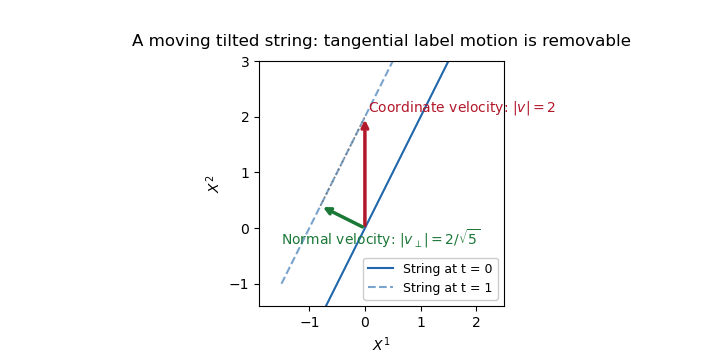

# Paper 306

↑ **Parent:** [Iii](../iii.md)

[https://www.maths.cam.ac.uk/postgrad/part-iii/files/pastpapers/2016/paper_306.pdf](https://www.maths.cam.ac.uk/postgrad/part-iii/files/pastpapers/2016/paper_306.pdf)

**Table of contents**

- [1](#1)
  - [i](#1/i)
    - [Solution](#1/i/solution)
  - [ii](#1/ii)
    - [Solution](#1/ii/solution)
- [2](#2)
  - [i](#2/i)
    - [Solution](#2/i/solution)
  - [ii](#2/ii)
    - [Solution](#2/ii/solution)
- [3](#3)
  - [i](#3/i)
    - [Solution](#3/i/solution)
  - [ii](#3/ii)
    - [Solution](#3/ii/solution)
- [4](#4)
  - [i](#4/i)
    - [Solution](#4/i/solution)
  - [ii](#4/ii)
    - [Solution](#4/ii/solution)

## 1

↑ **Parent:** [Paper 306](paper-306.md)

<h3 id="1/i">i</h3>

↑ **Parent:** [1](#1)

<h4 id="1/i/solution">Solution</h4>

↑ **Parent:** [I](#1/i)

Work away from $x=0$, where the [inverse-square potential](../../../classical-mechanics.md#inverse-square-potential) is singular. Variation of the [phase-space action](../../../classical-mechanics.md#phase-space-action) gives

$$
\boxed{\dot x=ep,\quad\dot p=\frac{2eg}{x^3},\quad\dot t=e,\quad\dot E=0,\quad E=H.}
$$

The last equation is the [constraint](../../../classical-mechanics.md#constraint-mechanics) imposed by the [Lagrange multiplier](../../../mathematical-optimization.md#lagrange-multiplier) $e$. The canonical [momentum](../../../classical-mechanics.md#momentum) conjugate to $t$ is $-E$, not $E$. Consequently the nonzero canonical [Poisson brackets](../../../classical-mechanics.md#poisson-bracket) are

$$
\boxed{\{x,p\}=1,\qquad\{t,E\}=-1.}
$$

In particular,

$$
\{F,G\}=F_xG_p-F_pG_x-F_tG_E+F_EG_t.
$$

With the convention $\delta z=\alpha\{z,Q\}$, the [Noether charge](../../../quantum-field-theory.md#noether-charge) generating $\delta t=\alpha$ is $Q=-E$. Equivalently, the conserved physical [energy](../../../classical-mechanics.md#energy) is $E$; a convention that calls the [energy](../../../classical-mechanics.md#energy) the time-translation charge absorbs this minus sign into its parameter.

For the dilation charge,

$$
\dot D=eE-\frac12\left(ep^2+\frac{2eg}{x^2}\right)=e(E-H)=0
$$

on the [constraint surface](../../../classical-mechanics.md#constraint-surface). Its infinitesimal canonical transformations are

$$
\boxed{\delta_D t=-\alpha t,\quad\delta_D x=-\frac\alpha2 x,\quad\delta_D E=\alpha E,\quad\delta_D p=\frac\alpha2p.}
$$

For constant $\alpha$, extending this by $\delta_De=-\alpha e$ preserves the action: the kinetic terms are invariant and $E-H$ scales oppositely to $e$. Thus the dilation acts on time and position with their nonrelativistic relative scaling. Its [Poisson bracket](../../../classical-mechanics.md#poisson-bracket) with the [energy](../../../classical-mechanics.md#energy) is

$$
\boxed{\{D,E\}=-E.}
$$

Put $C=E-H$. Direct variation of the [Hamiltonian](../../../classical-mechanics.md#hamiltonian) gives

$$
\delta_\beta H=p(tp-x)\beta-\frac{2g}{x^3}(-tx\beta)=(2tH-xp)\beta,
$$

so

$$
\boxed{\delta_\beta C=2tC\beta.}
$$

The supplied transformations are generated by the [special conformal charge of inverse-square mechanics](../../../classical-mechanics.md#special-conformal-charge-of-inverse-square-mechanics)

$$
\boxed{K=t^2E-txp+\frac{x^2}{2},\qquad \delta_\beta z=\beta\{z,K\}.}
$$

Choose

$$
\boxed{\delta_\beta e=-2te\beta.}
$$

Then $\delta(eC)=0$ even for a time-dependent parameter. Expanding the kinetic-term variation, keeping the terms in $\dot\beta$, gives

$$
\delta_\beta(\dot xp-\dot tE)=(t^2E-txp)\dot\beta-\beta x\dot x
=\dot\beta K-\frac{d}{d\lambda}\left(\frac\beta2x^2\right).
$$

Hence

$$
\boxed{\delta_\beta I=\int d\lambda\left[\dot\beta K-\frac{d}{d\lambda}\left(\frac\beta2x^2\right)\right].}
$$

For a constant parameter only the boundary term remains, identifying $K$ as the [Noether charge](../../../quantum-field-theory.md#noether-charge). Independently, the [equations of motion](../../../classical-mechanics.md#equation-of-motion) give

$$
\dot K=2teE-exp-t\left(ep^2+\frac{2eg}{x^2}\right)+exp=2te(E-H)=0.
$$

Using the same canonical [Poisson bracket](../../../classical-mechanics.md#poisson-bracket) convention,

$$
\boxed{\{K,E\}=-2D,\qquad\{K,D\}=-K.}
$$

Together, $\{D,E\}=-E$, $\{D,K\}=K$ and $\{E,K\}=2D$ form the [sl2R Lie algebra](../../../semisimple-lie-algebra.md#sl2r-lie-algebra) of [conformal mechanics](../../../classical-mechanics.md#conformal-mechanics). These are time translation, dilation and special conformal transformation. A useful normalization check is the [Casimir element](../../../semisimple-lie-algebra.md#casimir-element)

$$
EK-D^2=\frac{x^2}{2}\left(E-\frac{p^2}{2}\right)=\frac g2
$$

on the [constraint surface](../../../classical-mechanics.md#constraint-surface).

<h3 id="1/ii">ii</h3>

↑ **Parent:** [1](#1)

<h4 id="1/ii/solution">Solution</h4>

↑ **Parent:** [Ii](#1/ii)

Define the [open-string endpoint momentum flux](../../../string-theory.md#open-string-endpoint-momentum-flux) along the [open string](../../../string-theory.md#open-string) by $J_m=eT^2X'_m+uP_m$. Variation of the [Nambu-Goto phase-space action](../../../string-theory.md#nambu-goto-phase-space-action) gives

$$
\boxed{\dot X^m=eP^m+uX'^m,\qquad\dot P_m=\partial_\sigma J_m,}
$$

$$
\boxed{P^2+T^2X'^2=0,\qquad X'\cdot P=0.}
$$

The two last equations are the [Virasoro constraints](../../../string-theory.md#virasoro-constraint). Integration of the [momentum](../../../classical-mechanics.md#momentum) equation gives

$$
\boxed{\dot{\mathcal P}_m=J_m(t,\pi)-J_m(t,0).}
$$

Thus the necessary and sufficient condition for total [momentum conservation](../../../classical-mechanics.md#momentum-conservation) is equality of the two endpoint fluxes, component by component. Vanishing of both fluxes is a sufficient local boundary condition.

The spatial boundary term in the action variation is $-\int dt[J_m\delta X^m]_0^\pi$. For free ends the endpoint variations are arbitrary, so

$$
\boxed{J_m|_{0,\pi}=0\quad\Longrightarrow\quad\dot{\mathcal P}_m=0.}
$$

In a gauge with $u=0$ and nonzero $e$ this reduces to the usual [Neumann boundary condition](../../../differential-equation.md#neumann-boundary-condition) $X'^m=0$. The conclusion is conservation of total [momentum](../../../classical-mechanics.md#momentum), not that total [momentum](../../../classical-mechanics.md#momentum) must vanish. The PDF contains the derivative in this conclusion; the TeX transcription drops it.

For endpoints confined to $x^1=0$, the [Dirichlet boundary condition](../../../differential-equation.md#dirichlet-boundary-condition) fixes $\delta X^1=0$. It therefore imposes no requirement that $J_1$ vanish. Preserving the fixed position requires $\dot X^1=eP^1+uX'^1=0$ at each endpoint, but that is a different condition. For example, in $u=0$ gauge the endpoint [momentum](../../../classical-mechanics.md#momentum) $P^1$ is zero while $eT^2X'^1$ can be nonzero. Consequently **$\mathcal P_1$ is generally not conserved**: the normal endpoint forces transfer [momentum](../../../classical-mechanics.md#momentum) to the hyperplane. A dynamical [D-brane](../../../string-theory.md#d-brane) recoils and carries the missing [momentum](../../../classical-mechanics.md#momentum). If the hyperplane is idealized as fixed, its external support absorbs the [momentum](../../../classical-mechanics.md#momentum). The combined string-and-support system conserves [momentum](../../../classical-mechanics.md#momentum); freely varying directions tangent to the hyperplane retain their vanishing-flux condition.

## 2

↑ **Parent:** [Paper 306](paper-306.md)

<h3 id="2/i">i</h3>

↑ **Parent:** [2](#2)

<h4 id="2/i/solution">Solution</h4>

↑ **Parent:** [I](#2/i)

Use the mostly-plus [Minkowski metric](../../../special-relativity.md#minkowski-metric), with the last spatial coordinate singled out:

$$
\boxed{x^+=\frac{x^{D-1}+x^0}{\sqrt2},\qquad x^-=\frac{x^{D-1}-x^0}{\sqrt2},\qquad x^I=x^I\quad(I=1,\ldots,D-2).}
$$

Then $2dx^+dx^-=(dx^{D-1})^2-(dx^0)^2$, as required. In these [light-cone coordinates](../../../special-relativity.md#light-cone-coordinates), $\partial^+=\partial_-$, $\partial^-=\partial_+$ and $\square_D=2\partial_+\partial_-+\partial_I\partial_I$.

Introduce the [Kalb-Ramond field strength](../../../string-theory.md#kalb-ramond-field-strength)

$$
H_{pmn}=\partial_pB_{mn}+\partial_mB_{np}+\partial_nB_{pm}.
$$

The field equation is $\partial^pH_{pmn}=0$. Under $\delta B_{mn}=\partial_m\alpha_n-\partial_n\alpha_m$, every second-derivative contribution to $\delta H$ cancels by commutation of derivatives. Thus $H$ and its equation are [gauge-invariant](../../../relativistic-quantum-field.md#gauge-invariance). This is the differential-form identity $d^2=0$ for the [two-form gauge field](../../../relativistic-quantum-field.md#two-form-gauge-field) $B$.

To impose [light-cone gauge for a two-form](../../../string-theory.md#light-cone-gauge-for-a-two-form), first choose $\alpha_-=0$ and

$$
\alpha_m=-\partial_-^{-1}B_{-m}\quad(m=+,I).
$$

This sets $B_{-m}$ to zero. A residual transformation preserving the gauge obeys $\partial_-\alpha_m=\partial_m\alpha_-$. With $\chi=\partial_-^{-1}\alpha_-$, this implies $\alpha_m=\partial_m\chi$, including $m=-$. Such a parameter changes $B$ by zero. Therefore **no nontrivial gauge transformation of $B$ remains** in the sector where $\partial_-$ is invertible. There is still a redundant description of the gauge parameter itself, $\alpha\mapsto\alpha+d\chi$; the excluded $\partial_-$ zero modes would require separate treatment.

The $(-,n)$ field equations now say $\partial_-\partial^pB_{np}=0$, hence $\partial^pB_{np}=0$. For $n=I$ this gives

$$
-\partial_-B_{+I}+\partial^JB_{IJ}=0,
\qquad\boxed{B_{+I}=\partial_-^{-1}\partial^JB_{IJ}.}
$$

For $n=+$, $\partial^IB_{+I}=0$ follows automatically from antisymmetry of $B_{IJ}$. Therefore the independent components and their equation are

$$
\boxed{B_{IJ}=-B_{JI},\qquad\frac{(D-2)(D-3)}2\text{ independent polarizations},\qquad\square_DB_{IJ}=0.}
$$

The remaining equations follow from this wave equation and the reconstructed longitudinal components.

At the first massless level of the [closed bosonic string](../../../string-theory.md#closed-string), states $\alpha_{-1}^I\widetilde\alpha_{-1}^J|p\rangle$ carry a product of two transverse vector polarizations. Its symmetric traceless, antisymmetric and trace parts are respectively the [graviton](../../../quantum-theory.md#graviton), the [Kalb–Ramond field](../../../string-theory.md#kalb-ramond-field) and the [dilaton](../../../string-theory.md#dilaton). The antisymmetric part has exactly the polarization count just found.

The [gauge-invariant string coupling to a two-form](../../../relativistic-quantum-field.md#gauge-invariant-string-coupling-to-a-two-form) uses the pullback of the background [Kalb–Ramond field](../../../string-theory.md#kalb-ramond-field) to the [string worldsheet](../../../string-theory.md#worldsheet):

$$
\boxed{I_B=q\int_\Sigma X^*B=\frac q2\int d^2\sigma\,\epsilon^{ab}B_{mn}(X)\partial_aX^m\partial_bX^n.}
$$

Its variation is $q\int_\Sigma d(X^*\alpha)=q\int_{\partial\Sigma}X^*\alpha$, by [Stokes theorem](../../../calculus.md#stokes-theorem). It vanishes on a closed [worldsheet](../../../string-theory.md#worldsheet). For a cylindrical propagation surface it is only an initial/final boundary term, handled by fixed-boundary gauge parameters or the corresponding transformation of external states. Thus the closed string is naturally charged under a [two-form gauge field](../../../relativistic-quantum-field.md#two-form-gauge-field).

<h3 id="2/ii">ii</h3>

↑ **Parent:** [2](#2)

<h4 id="2/ii/solution">Solution</h4>

↑ **Parent:** [Ii](#2/ii)

For the [Monge-gauge Hamiltonian of a three-dimensional string](../../../string-theory.md#monge-gauge-hamiltonian-of-a-three-dimensional-string), in [Monge gauge](../../../string-theory.md#monge-gauge), $X'^m=(0,1,\Phi')$ and $P_m=(P_0,P_1,\Pi)$. The [momentum](../../../classical-mechanics.md#momentum) [constraint](../../../classical-mechanics.md#constraint-mechanics) gives $P_1=-\Phi'\Pi$. The other [Virasoro constraint](../../../string-theory.md#virasoro-constraint) then reads

$$
-P_0^2+(\Phi'\Pi)^2+\Pi^2+1+\Phi'^2=0.
$$

Choosing the positive-energy branch,

$$
\boxed{P_1=-\Phi'\Pi,\qquad P_0=-\sqrt{(1+\Phi'^2)(1+\Pi^2)}.}
$$

Substituting into the [phase-space action](../../../classical-mechanics.md#phase-space-action) leaves $I=\int dt\,d\sigma(\Pi\dot\Phi-\mathcal H)$, so

$$
\boxed{F(z)=1+z^2,\qquad \mathcal H=\sqrt{(1+\Phi'^2)(1+\Pi^2)},\qquad H=\int d\sigma\,\mathcal H.}
$$

For an infinite string this is an energy-density expression; even the undeformed string has infinite total [energy](../../../classical-mechanics.md#energy). One may regulate the length or subtract its constant reference [energy](../../../classical-mechanics.md#energy) when a finite total [energy](../../../classical-mechanics.md#energy) is needed. The positive branch is unambiguous at the density level.

The canonical [Hamiltonian field equations](../../../classical-mechanics.md#hamiltonian-field-equation) are

$$
\dot\Phi=\Pi\sqrt{\frac{1+\Phi'^2}{1+\Pi^2}},\qquad
\dot\Pi=\partial_\sigma\left(\Phi'\sqrt{\frac{1+\Pi^2}{1+\Phi'^2}}\right).
$$

Consequently $\Pi=\Phi'$ implies

$$
\boxed{\dot\Phi=\Phi',\qquad\Phi=f(\sigma+t).}
$$

The second equation also becomes $\dot\Pi=\Phi''$, consistent with differentiating the first. These are one-direction traveling profiles along the string.

For the linear profile, the spatial string is the straight line $X^2=kX^1+kt$. It is tilted, and its coordinate intercept moves with speed $k$. This is also a uniformly moving straight string: the [physical transverse velocity of a tilted string](../../../string-theory.md#physical-transverse-velocity-of-a-tilted-string) is the velocity normal to the line. With unit tangent $(1,k)/\sqrt{1+k^2}$ and coordinate velocity $(0,k)$, the normal speed is

$$
\boxed{v_\perp=\frac{|k|}{\sqrt{1+k^2}}<1.}
$$

Thus **$k>1$ does not imply superluminal physical motion**. Fixed-$\sigma$ labels have spacelike trajectories when $k>1$, but labels on a string can slide tangentially and are not identifiable material particles. Choosing $\dot\sigma=-k^2/(1+k^2)$ removes the tangential velocity and gives the subluminal velocity $(-k^2,k)/(1+k^2)$.

The [induced worldsheet metric](../../../string-theory.md#induced-worldsheet-metric) supplies a coordinate-invariant check:

$$
h_{tt}=k^2-1,\qquad h_{t\sigma}=k^2,\qquad h_{\sigma\sigma}=1+k^2,\qquad\boxed{\det h=-1.}
$$

The [string worldsheet](../../../string-theory.md#worldsheet) remains Lorentzian for every finite $k$, including $k=1$ and $k>1$. Its constant [energy density](../../../statistical-physics.md#energy-density) is $1+k^2$. This linear profile is a tilted boosted straight string, rather than a localized finite-energy wave.

**[Figure 1](#2/ii/image-for-slope-k-2-the-vertical-coordinate-velocity-exceeds-one-while-its-component-normal-to-the-tilted-string-has-physical-speed-2-divided-by-the-square-root-of-5). For slope k=2 the vertical coordinate velocity exceeds one, while its component normal to the tilted string has physical speed 2 divided by the square root of 5**.

## 3

↑ **Parent:** [Paper 306](paper-306.md)

<h3 id="3/i">i</h3>

↑ **Parent:** [3](#3)

<h4 id="3/i/solution">Solution</h4>

↑ **Parent:** [I](#3/i)

Set $T=1/(2\pi\alpha')$ and take the closed-string spatial coordinate periodic with period $2\pi$. One convenient Lorentzian convention for the [conformal gauge](../../../string-theory.md#conformal-gauge) action is

$$
\boxed{I=\frac1{4\pi\alpha'}\int d\tau\,d\sigma\left(\dot X^m\dot X_m-X'^mX'_m\right)
+\frac{i}{2\pi}\int d\tau\,d\sigma\left[b(\partial_\tau-\partial_\sigma)c+\widetilde b(\partial_\tau+\partial_\sigma)\widetilde c\right].}
$$

The two anticommuting [bc ghost systems](../../../string-theory.md#bc-system) are the [Faddeev-Popov ghosts](../../../relativistic-quantum-field.md#faddeev-popov-ghost) of the [worldsheet](../../../string-theory.md#worldsheet) metric [gauge fixing](../../../relativistic-quantum-field.md#gauge-fixing). Their fields have conformal weights $2$ and $-1$. Ghost normalizations can be rescaled without changing the algebra. After a [Wick rotation](../../../perturbative-quantum-field-theory.md#wick-rotation) the two terms become the familiar holomorphic and antiholomorphic $b\bar\partial c$ and $\widetilde b\partial\widetilde c$ actions.

Let $\mathcal L_n$ and $\widetilde{\mathcal L}_n$ include both matter and ghost contributions. With the conventional plane normalization of the zero mode, their [Virasoro algebra](../../../string-theory.md#virasoro-algebra) is

$$
\boxed{[\mathcal L_m,\mathcal L_n]=(m-n)\mathcal L_{m+n}+\frac{D-26}{12}(m^3-m)\delta_{m+n,0},}
$$

$$
\boxed{[\widetilde{\mathcal L}_m,\widetilde{\mathcal L}_n]=(m-n)\widetilde{\mathcal L}_{m+n}+\frac{D-26}{12}(m^3-m)\delta_{m+n,0},\qquad[\mathcal L_m,\widetilde{\mathcal L}_n]=0.}
$$

Each free coordinate boson contributes [central charge](../../../string-theory.md#central-charge) $1$, including the timelike coordinate after the usual analytic continuation. The weight-$(2,-1)$ [bc ghost system](../../../string-theory.md#bc-system) contributes $-26$ in each chiral sector. Thus the total [central charge](../../../string-theory.md#central-charge) is $D-26$.

The [Virasoro constraints](../../../string-theory.md#virasoro-constraint) originate in a gauge symmetry. A nonzero central term is a quantum obstruction to realizing that gauge symmetry without an anomaly; equivalently, the [BRST charge](../../../relativistic-quantum-field.md#brst-charge) fails to be nilpotent. Cancellation of the [worldsheet Weyl anomaly](../../../string-theory.md#worldsheet-weyl-anomaly) therefore requires

$$
\boxed{D=26.}
$$

This is the [critical dimension of the bosonic string](../../../string-theory.md#critical-dimension-of-string-theory). The accompanying physical-state normal-ordering condition gives the usual matter intercept $1$ in each sector. A shift of the zero-mode convention changes the linear term in the central polynomial, but cannot change the required cancellation of its cubic coefficient.

<h3 id="3/ii">ii</h3>

↑ **Parent:** [3](#3)

<h4 id="3/ii/solution">Solution</h4>

↑ **Parent:** [Ii](#3/ii)

In a point-particle description of [quantum gravity](../../../quantum-theory.md#quantum-gravity), interactions of a massless spin-two field occur at localized vertices of [Feynman diagrams](../../../perturbative-quantum-field-theory.md#feynman-diagram). The gravitational coupling has negative mass dimension for spacetime dimension greater than two, so short-distance loop integrations generate higher-derivative counterterms that cannot all be absorbed into the Einstein action. A [string worldsheet](../../../string-theory.md#worldsheet) instead joins incoming and outgoing strings by a smooth surface. In particular, a closed string splits or joins through a smooth pair-of-pants surface. There is no invariantly distinguished point at which every part of an extended string interacts. The choice of a time slicing can draw a joining point, but it is not a physical pointlike vertex. This removes the point-interaction geometry responsible for arbitrarily localized interactions and introduces the [string length](../../../string-theory.md#string-length) $\ell_s=\sqrt{\alpha'}$.

This geometric explanation is supported by the organization of the [Polyakov path integral](../../../string-theory.md#polyakov-path-integral). Introducing a [worldsheet](../../../string-theory.md#worldsheet) metric makes the [Nambu–Goto action](../../../string-theory.md#nambu-goto-action) amenable to [gauge fixing](../../../relativistic-quantum-field.md#gauge-fixing). In the Euclidean integral, metrics on a fixed oriented surface are divided by [worldsheet diffeomorphisms](../../../string-theory.md#worldsheet-diffeomorphism) and [Weyl transformations](../../../string-theory.md#weyl-transformation). What remains is a [Riemann surface](../../../complex-analysis.md#riemann-surfaces) with a conformal structure, together with finitely many [worldsheet moduli](../../../string-theory.md#worldsheet-moduli) and the positions of external [string vertex operators](../../../string-theory.md#string-vertex-operator). The determinants from fixing the metric are represented by [Faddeev-Popov ghosts](../../../relativistic-quantum-field.md#faddeev-popov-ghost). Schematically, for $n$ closed-string external states,

$$
\mathcal A_n=\sum_{g\geq0}g_s^{2g-2+n}\int_{\mathcal M_{g,n}}d\mu\,
\left\langle\prod_{i=1}^nV_i\;\text{(ghost insertions)}\right\rangle_g.
$$

Here $\mathcal M_{g,n}$ is the moduli space of genus-$g$ punctured surfaces. The dilaton weights a surface by its [Euler characteristic](../../../homology.md#euler-characteristic) $\chi=2-2g$, giving $g_s^{-\chi}$ before the normalization of external states. Every additional handle multiplies the contribution by $g_s^2$. The [string genus expansion](../../../string-theory.md#string-genus-expansion) therefore plays the role of the ordinary loop expansion, with the sphere giving tree level and the torus giving one loop. The critical dimension cancels the [worldsheet Weyl anomaly](../../../string-theory.md#worldsheet-weyl-anomaly), making this reduction to conformal geometry consistent.

The massless symmetric traceless closed-string state is a [graviton](../../../quantum-theory.md#graviton), and its long-wavelength interactions reproduce gravity. At distances comparable with $\ell_s$, however, an infinite tower of excited states contributes. This is more than a single particle form factor: the same amplitude contains graviton exchange, massive higher-spin exchange and string-scale softness.

The dimensionless variables in the given [Virasoro–Shapiro amplitude](../../../string-theory.md#virasoro-shapiro-amplitude) correspond to $s=\alpha'S/4$, $t=\alpha'T/4$, $u=\alpha'U/4$, where capital letters denote the usual dimensionful [Mandelstam invariants](../../../special-relativity.md#mandelstam-variables). Its [constraint](../../../classical-mechanics.md#constraint-mechanics) $s+t+u=-4$ identifies the external particles as the closed bosonic [tachyons](../../../physics.md#tachyon), not four gravitons. Nevertheless its intermediate massless pole directly exhibits graviton exchange. The overall normalization will be suppressed below; no additional copy of the amplitude formula is needed.

First, the amplitude is symmetric under permutations of $s,t,u$, expressing [crossing symmetry](../../../quantum-mechanics.md#crossing-symmetry). The poles in any channel are

$$
\boxed{s=n-1,\quad n=0,1,2,\ldots,\qquad M_n^2=\frac{4(n-1)}{\alpha'}.}
$$

For generic $t$, the residue can be calculated with the [Gamma function](../../../complex-analysis.md#gamma-function) pole at $-n$ and its recurrence:

$$
\boxed{\mathop{\rm Res}_{s=n-1}A=-\frac1{(n!)^2}\left[\prod_{j=2}^{n+1}(t+j)\right]^2.}
$$

The product is $1$ when $n=0$. Indeed, the pole factor contributes $(-1)^{n+1}/n!$, while the two remaining Gamma ratios contribute $(-1)^n(t+2)_n^2/n!$. A residue polynomial of degree $2n$ shows exchange of spins up to $2n$, with leading [Regge trajectory](../../../string-theory.md#regge-trajectory) $J=2+2s$. At $n=1$, the massless residue is $-(t+2)^2$, containing the spin-two exchange. By crossing, the massless $t$-channel pole is

$$
\boxed{A(s,t)=-\frac{(s+2)^2}{t}+O(1)\quad(t\longrightarrow0),}
$$

for generic $s$. Thus at large $s$ the pole behaves as $s^2/t$, the characteristic [energy](../../../classical-mechanics.md#energy) dependence of [graviton](../../../quantum-theory.md#graviton) exchange. Its massless propagator produces the long-range gravitational interaction. At low energies the massive poles can instead be expanded into local higher-derivative corrections to the effective gravitational action.

At the string scale one must retain the whole tower. The [Gamma reflection formula](../../../complex-analysis.md#gamma-reflection-formula) rewrites the amplitude exactly as

$$
A=-\frac{\Gamma(-1-t)}{\Gamma(t+2)}\left[\frac{\Gamma(s+t+3)}{\Gamma(s+2)}\right]^2\frac{\sin\pi(s+t)}{\sin\pi s}.
$$

At large $s$ and fixed $t$, away from the resonance poles or with a specified complex continuation, the Gamma ratio scales as $s^{t+1}$. Hence the [Regge limit](../../../string-theory.md#regge-limit) scales as $s^{2+2t}$, up to the signature factor and the displayed $t$-dependent coefficient. In particular, a fixed nonzero [momentum](../../../classical-mechanics.md#momentum) transfer changes the point-graviton power law by a factor $s^{2t}$: the graviton belongs to an entire trajectory rather than remaining an isolated spin-two exchange at arbitrarily high [energy](../../../classical-mechanics.md#energy).

There is stronger suppression when the scattering angle is fixed. Put $t\simeq-as$, $u\simeq-(1-a)s$ with $0<a<1$. Applying [Stirling formula](../../../real-analysis.md#stirling-formula) to the Gamma functions, after the same treatment of real-axis poles, gives the leading smooth envelope

$$
\boxed{\log|A|=-2s\,f(a)+O(\log s),\qquad f(a)=-a\log a-(1-a)\log(1-a)>0.}
$$

The leading $s\log s$ terms cancel and the remaining entropy-like combination is negative. In physical units the exponent is $-\alpha'Sf(a)/2$. This [fixed-angle softness of the closed-string amplitude](../../../string-theory.md#fixed-angle-softness-of-the-closed-string-amplitude) is absent for an elementary pointlike gravitational vertex. Equivalently, short-distance gravitational scattering probes additional string degrees of freedom. In a four-dimensional long-distance effective setting, a massive exchanged mode contributes a Yukawa-type correction proportional to $e^{-M_nr}/r$, with couplings and tensor factors depending on the external states. Such terms are suppressed for $r\gg\ell_s$ and become relevant for $r\sim\ell_s$. The amplitude establishes the spectrum and short-distance change; it does not by itself give a universal static potential for arbitrary sources. Its bosonic [tachyon](../../../physics.md#tachyon) also signals an unstable vacuum, so it must not be treated as a complete stable model of a gravitational force.

Finally, the [modular group](../../../modular-function.md#modular-group) prevents overcounting equivalent surfaces and reorganizes the loop ultraviolet region. A torus is $\mathbb C/(\mathbb Z+\tau\mathbb Z)$ with $\operatorname{Im}\tau>0$. A change of lattice basis identifies

$$
\tau\sim\frac{a\tau+b}{c\tau+d},\qquad a,b,c,d\in\mathbb Z,\quad ad-bc=1.
$$

Thus the one-loop integral uses a fundamental domain for $\operatorname{PSL}(2,\mathbb Z)$, for example

$$
\boxed{\mathcal F=\{\tau:|\operatorname{Re}\tau|\leq\tfrac12,\ |\tau|\geq1,\ \operatorname{Im}\tau>0\}.}
$$

The measure $d^2\tau/(\operatorname{Im}\tau)^2$ is invariant, and the physical integrand, including matter, ghosts and external insertions, must respect [torus modular invariance](../../../string-theory.md#torus-modular-invariance). In this domain $\operatorname{Im}\tau\geq\sqrt3/2$. The region of arbitrarily small proper time that causes [ultraviolet divergences](../../../perturbative-quantum-field-theory.md#ultraviolet-divergence) in a particle loop is therefore not an independent part of the string integral; a modular transformation relates it to another description already represented in the domain.

This does not remove every possible divergence. The cusp $\operatorname{Im}\tau\to\infty$ is a long tube, and factorization through it can produce [infrared divergences](../../../quantum-field-theory.md#infrared-divergence), massless tadpoles or the bosonic [tachyon](../../../physics.md#tachyon) divergence. At higher genus, degenerating cycles similarly factorize into propagating intermediate string states. The essential improvement is the relation between [worldsheet](../../../string-theory.md#worldsheet) geometry, the full spectrum and the quotient by large diffeomorphisms; infrared and unstable-background problems remain separate questions. A short-distance expansion that keeps only the graviton discards precisely this structure.

## 4

↑ **Parent:** [Paper 306](paper-306.md)

<h3 id="4/i">i</h3>

↑ **Parent:** [4](#4)

<h4 id="4/i/solution">Solution</h4>

↑ **Parent:** [I](#4/i)

The first-order fermionic kinetic term produces second-class [momentum](../../../classical-mechanics.md#momentum) [constraints](../../../classical-mechanics.md#constraint-mechanics). After eliminating them, the canonical [graded Dirac brackets](../../../classical-mechanics.md#graded-dirac-bracket) are

$$
\boxed{\{x^m,p_n\}_D=\delta^m{}_n,\qquad\{\psi^m,\psi^n\}_D=-i\eta^{mn},}
$$

with other mixed brackets zero. The bracket of two odd variables is symmetric, consistently with the [graded Poisson bracket](../../../classical-mechanics.md#graded-poisson-bracket). The [constraint algebra](../../../classical-mechanics.md#constraint-algebra) is

$$
\boxed{\{\mathcal Q,\mathcal Q\}_D=-ip^2=-2i\mathcal H,\qquad\{\mathcal Q,\mathcal H\}_D=0,\qquad\{\mathcal H,\mathcal H\}_D=0.}
$$

It is the [worldline supersymmetry algebra](../../../supersymmetry.md#worldline-supersymmetry-algebra): the square of the fermionic [constraint](../../../classical-mechanics.md#constraint-mechanics) generates the [Hamiltonian](../../../classical-mechanics.md#hamiltonian) [constraint](../../../classical-mechanics.md#constraint-mechanics).

With $\hbar=1$, quantization converts these to

$$
[\widehat x^m,\widehat p_n]=i\delta^m{}_n,\qquad\{\widehat\psi^m,\widehat\psi^n\}_+=\eta^{mn}.
$$

Represent the fermions by [Gamma matrices](../../../algebra.md#gamma-matrices), $\widehat\psi^m=\gamma^m/\sqrt2$, where $\{\gamma^m,\gamma^n\}_+=2\eta^{mn}$, and $\widehat p_m=-i\partial_m$. The wavefunction is a [Dirac spinor](../../../relativistic-quantum-field.md#dirac-spinor). Its physical-state [constraint](../../../classical-mechanics.md#constraint-mechanics) is

$$
\boxed{\widehat{\mathcal Q}\Psi=-\frac{i}{\sqrt2}\gamma^m\partial_m\Psi=0,}
$$

which is exactly the [massless Dirac equation](../../../relativistic-quantum-field.md#massless-dirac-equation). Moreover $\widehat{\mathcal Q}^{\,2}=\widehat{\mathcal H}=-\square_D/2$, so this equation implies the remaining mass-shell [constraint](../../../classical-mechanics.md#constraint-mechanics). Conversely, a solution of the [massless Dirac equation](../../../relativistic-quantum-field.md#massless-dirac-equation) satisfies both [constraints](../../../classical-mechanics.md#constraint-mechanics). The Klein-Gordon [constraint](../../../classical-mechanics.md#constraint-mechanics) alone would not impose the spinorial first-order equation.

<h3 id="4/ii">ii</h3>

↑ **Parent:** [4](#4)

<h4 id="4/ii/solution">Solution</h4>

↑ **Parent:** [Ii](#4/ii)

The PDF's displayed zero-mode term has no derivative. Read literally, $d_0\cdot d_0$ vanishes for classical [Grassmann variables](../../../linear-algebra.md#grassmann-variable) and supplies no zero-mode symplectic structure. The subsequent canonical-algebra requests therefore require the standard kinetic term $\frac i2d_0\cdot\dot d_0$. We use that intended correction explicitly; the rest of the displayed action fixes the nonzero-mode normalization.

The [Ramond level operator](../../../string-theory.md#ramond-level-operator), with vacuum-annihilating [normal ordering](../../../perturbative-quantum-field-theory.md#normal-ordering), is

$$
\boxed{\widehat N_R=\sum_{k=1}^\infty\left(\widehat\alpha_{-k}\cdot\widehat\alpha_k+k\widehat d_{-k}\cdot\widehat d_k\right).}
$$

The canonical oscillator relations, for transverse indices $I,J$, are

$$
\boxed{[\widehat\alpha_m^I,\widehat\alpha_n^J]=m\delta_{m+n,0}\delta^{IJ},\qquad
\{\widehat d_m^I,\widehat d_n^J\}_+=\delta_{m+n,0}\delta^{IJ},\qquad[\widehat\alpha_m^I,\widehat d_n^J]=0.}
$$

The hermiticity convention is $\alpha_k^\dagger=\alpha_{-k}$ and $d_k^\dagger=d_{-k}$. The commuting bosonic zero mode is supplied by the center-of-mass [momentum](../../../classical-mechanics.md#momentum). For $k>0$, define $a_k^I=\alpha_k^I/\sqrt k$ and $f_k^I=d_k^I$. Their [bosonic occupation numbers](../../../quantum-field-theory.md#bosonic-occupation-number) are $0,1,2,\ldots$ and their [fermionic occupation numbers](../../../quantum-field-theory.md#fermionic-occupation-number) are $0,1$. Therefore, on the [Fock space](../../../quantum-field-theory.md#fock-space) generated from an [oscillator vacuum](../../../string-theory.md#oscillator-vacuum),

$$
\boxed{N=\sum_{k\geq1,I}k(n^B_{kI}+n^F_{kI})\in\mathbb Z_{\geq0}.}
$$

Equivalently, creation operators raise the level by $k$, since $[N_R,\alpha_{-k}^I]=k\alpha_{-k}^I$ and $[N_R,d_{-k}^I]=kd_{-k}^I$. The zero modes commute with $N_R$ and do not change the level. The multiplier imposes

$$
\boxed{M^2=-p^2=2\pi T N,}
$$

so the $N=0$ states are massless. In the [Ramond sector](../../../string-theory.md#ramond-sector) the bosonic and fermionic oscillator zero-point contributions cancel, consistently with the stated zero intercept. The massless ground states are spacetime spinors, as the [Ramond zero-mode Clifford algebra](../../../string-theory.md#ramond-zero-mode-clifford-algebra) now shows.

Normalize $\gamma^I=\sqrt2\widehat d_0^I$. Then

$$
\boxed{\{\gamma^I,\gamma^J\}_+=2\delta^{IJ},\qquad(\gamma^I)^\dagger=\gamma^I.}
$$

Let $v=|0\rangle\ne0$. Each positive-frequency bosonic annihilator commutes with $\gamma^I$, while each fermionic annihilator anticommutes with it. Applying either annihilator to $\gamma^Iv$ therefore gives zero. Thus all eight $\gamma^Iv$ are [oscillator vacua](../../../string-theory.md#oscillator-vacuum). For real $a_I$, the hermitian operator $A=\sum_Ia_I\gamma^I$ satisfies $A^2=(\sum_Ia_I^2)\mathbf1$, so

$$
\left\|\sum_Ia_I\gamma^Iv\right\|^2=\left(\sum_Ia_I^2\right)\|v\|^2.
$$

This proves the [real independence of Clifford-generated vectors](../../../algebra.md#real-independence-of-clifford-generated-vectors), and hence their **linear independence over $\mathbb R$**.

The same argument applies to the nonzero vacuum $\gamma^1v$, because $(\gamma^1)^2=1$. It gives eight real-linearly independent [oscillator vacua](../../../string-theory.md#oscillator-vacuum) $\gamma^I\gamma^1v$. They include $v$ itself, at $I=1$. Products of two zero modes preserve vacuum annihilation just as products of one do.

For the [chirality matrix](../../../algebra.md#chirality-matrix) $\gamma_9=\gamma^1\gamma^2\cdots\gamma^8$, reversing eight anticommuting factors introduces $(-1)^{8\cdot7/2}=1$. Hence

$$
\boxed{\gamma_9^\dagger=\gamma_9,\qquad\gamma_9^2=\mathbf1.}
$$

Moving any $\gamma^I$ through the other seven factors also gives $\gamma_9\gamma^I=-\gamma^I\gamma_9$. If $\gamma_9v=v$, then

$$
\boxed{\gamma_9\gamma^Iv=-\gamma^Iv,\qquad\gamma_9\gamma^I\gamma^1v=\gamma^I\gamma^1v.}
$$

The first collection has negative [chirality](../../../relativistic-quantum-field.md#chirality-physics); the second has positive [chirality](../../../relativistic-quantum-field.md#chirality-physics). If $u_+$ and $u_-$ have these respective [chiralities](../../../relativistic-quantum-field.md#chirality-physics), hermiticity gives $\langle u_+,u_-\rangle=\langle\gamma_9u_+,u_-\rangle=\langle u_+,\gamma_9u_-\rangle=-\langle u_+,u_-\rangle$, so they are orthogonal. Combining the two real-independent collections therefore gives **at least sixteen real-linearly independent [oscillator vacua](../../../string-theory.md#oscillator-vacuum)**, eight in each [chirality](../../../relativistic-quantum-field.md#chirality-physics).

The real qualification in the question matters: the particular eight vectors generated from an arbitrary complex $v$ need not be independent over $\mathbb C$. Nevertheless the [dimension bound from paired Clifford involutions](../../../algebra.md#dimension-bound-from-paired-clifford-involutions) also follows from the full [Clifford algebra](../../../algebra.md#clifford-algebra). Define four commuting hermitian involutions $J_j=i\gamma^{2j-1}\gamma^{2j}$, $j=1,\ldots,4$. Their joint spectral projections preserve the vacuum space, so it contains a nonzero common eigenvector $w$. Multiplication by $\gamma^{2j-1}$ flips the eigenvalue of $J_j$ and leaves the other three eigenvalues unchanged. The sixteen products obtained by independently choosing whether to apply these four odd-indexed [Gamma matrices](../../../algebra.md#gamma-matrices) to $w$ consequently have distinct joint eigenvalue quadruples. They are nonzero, mutually orthogonal [oscillator vacua](../../../string-theory.md#oscillator-vacuum). Thus the unprojected vacuum space also has **complex dimension at least sixteen**, with eight states of each [chirality](../../../relativistic-quantum-field.md#chirality-physics) in the minimal representation. A further chiral projection is an additional physical restriction, not part of the oscillator-vacuum conditions here.

## ↑ Ancestors (8)

1. [Iii](../iii.md)
2. [2016](../../2016.md)
3. [Past exam of the mathematics course of the University of Cambridge](../../../past-exam-of-the-mathematics-course-of-the-university-of-cambridge.md)
4. [Mathematics course of the University of Cambridge](../../../university-of-cambridge.md#mathematics-course-of-the-university-of-cambridge)
5. [Course of the University of Cambridge](../../../university-of-cambridge.md#course-of-the-university-of-cambridge)
6. [University of Cambridge](../../../university-of-cambridge.md)
7. [List of universities](../../../README.md#list-of-universities)
8. [Codex Wiki](../../../README.md)
