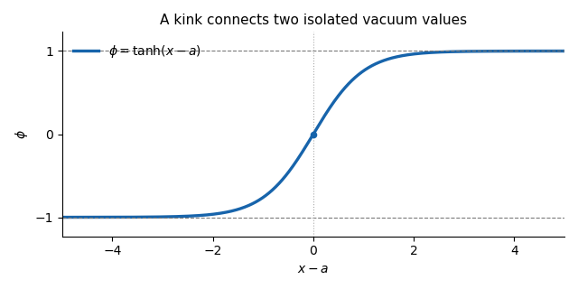

# Paper 308

↑ **Parent:** [Iii](../iii.md)

[https://www.maths.cam.ac.uk/postgrad/part-iii/files/pastpapers/2016/paper_308.pdf](https://www.maths.cam.ac.uk/postgrad/part-iii/files/pastpapers/2016/paper_308.pdf)

**Table of contents**

- [1](#1)
  - [Solution](#1/solution)
- [2](#2)
  - [Solution](#2/solution)
  - [i](#2/i)
    - [Solution](#2/i/solution)
  - [ii](#2/ii)
    - [Solution](#2/ii/solution)
- [3](#3)
  - [Solution](#3/solution)

## 1

↑ **Parent:** [Paper 308](paper-308.md)

<h3 id="1/solution">Solution</h3>

↑ **Parent:** [1](#1)

Use the [Minkowski metric](../../../special-relativity.md#minkowski-metric) with signature $(+,-)$, and write $V(\phi)=\tfrac12(1-\phi^2)^2$. The [Euler-Lagrange equation](../../../analysis.md#euler-lagrange-equation) is

$$
\partial_\mu\partial^\mu\phi+V'(\phi)=0,
\qquad\boxed{\phi_{tt}-\phi_{xx}+2\phi(\phi^2-1)=0.}
$$

For the static [phi-four kink](../../../classical-field-theory-soliton.md#phi-four-kink), $\phi_x=1-\phi^2=\operatorname{sech}^2(x-a)$ and $\phi_{xx}=-2\phi(1-\phi^2)=2\phi(\phi^2-1)$, so the field equation is satisfied. The centre $a$ is arbitrary by [translation invariance](../../../physics.md#translation-invariance), and the [hyperbolic tangent](../../../calculus.md#hyperbolic-tangent) profile increases monotonically from $-1$ to $+1$, crossing zero at $x=a$. **The static [kink](../../../classical-field-theory-soliton.md#scalar-field-kink) and its endpoint [topological charge](../../../classical-field-theory-soliton.md#topological-charge) are**

$$
\boxed{\phi_K(x)=\tanh(x-a),\qquad Q=\frac{\phi(+\infty)-\phi(-\infty)}2=1.}
$$

**[Figure 1](#1/image-the-phi-four-kink-rises-between-the-two-vacuum-values-and-crosses-zero-at-its-centre). The phi-four kink rises between the two vacuum values and crosses zero at its centre**.

Both endpoint values are isolated [classical vacua](../../../quantum-field-theory.md#classical-vacuum), since $V(\phi)=0$ only at $\phi=\pm1$. A continuous finite-energy deformation preserving the vacuum boundary conditions cannot change either endpoint to the other isolated [classical vacuum](../../../quantum-field-theory.md#classical-vacuum). The [topological charge](../../../classical-field-theory-soliton.md#topological-charge) is therefore unchanged: this [kink](../../../classical-field-theory-soliton.md#scalar-field-kink) cannot deform into a homogeneous [classical vacuum](../../../quantum-field-theory.md#classical-vacuum), whose charge is zero. There is also a direct [Bogomolny bound](../../../quantum-field-theory.md#bogomolny-bound) in this sector. The [square completion for a one-dimensional kink](../../../quantum-field-theory.md#square-completion-for-a-one-dimensional-kink) gives

$$
\begin{aligned}
E&=\int_{\mathbb R}\left[\frac12\phi_t^2+\frac12\phi_x^2+V(\phi)\right]dx\\
&=\int_{\mathbb R}\left[\frac12\phi_t^2+\frac12\big(\phi_x-(1-\phi^2)\big)^2\right]dx
+\left[\phi-\frac{\phi^3}{3}\right]_{-\infty}^{+\infty}
\geq\frac43.
\end{aligned}
$$

The [phi-four kink](../../../classical-field-theory-soliton.md#phi-four-kink) saturates the bound, so its mass is $4/3$ in these units and it minimizes the energy within its [topological sector](../../../classical-field-theory-soliton.md#topological-sector). Its arbitrary position is a [collective coordinate](../../../classical-field-theory-soliton.md#collective-coordinate-of-a-soliton), not an instability. A [kink](../../../classical-field-theory-soliton.md#scalar-field-kink) and an [antikink](../../../classical-field-theory-soliton.md#antikink) together have total charge zero and can annihilate without contradicting the protection of an isolated [kink](../../../classical-field-theory-soliton.md#scalar-field-kink).

For the momentum, the [canonical stress-energy tensor](../../../quantum-field-theory.md#canonical-stress-energy-tensor) of this [scalar field](../../../quantum-field-theory.md#scalar-field) is

$$
T^{\mu\nu}=\partial^\mu\phi\,\partial^\nu\phi-\eta^{\mu\nu}\mathcal L.
$$

Consequently the physical spatial [momentum density](../../../general-relativity.md#momentum-density) and the spatial momentum flux are

$$
\boxed{\mathcal P=T^{01}=-\phi_t\phi_x,\qquad
T^{11}=\frac12\phi_t^2+\frac12\phi_x^2-V(\phi).}
$$

The sign of $\mathcal P$ makes a right-moving translated [kink](../../../classical-field-theory-soliton.md#scalar-field-kink) carry positive momentum. Direct use of the field equation, rather than an assumed static field, yields the [scalar-field momentum flux](../../../quantum-field-theory.md#scalar-field-momentum-flux) identity

$$
\partial_t\mathcal P
=-\phi_{tt}\phi_x-\phi_t\phi_{xt}
=\partial_x\!\left[V(\phi)-\frac12\phi_x^2-\frac12\phi_t^2\right]
=-\partial_xT^{11}.
$$

The [finite-energy field configuration](../../../classical-field-theory-soliton.md#finite-energy-field-configuration) has $\mathcal P\in L^1$ by $|\phi_t\phi_x|\leq(\phi_t^2+\phi_x^2)/2$. Integrating the [stress-energy conservation](../../../general-relativity.md#stress-energy-conservation) law over the left half-line gives **the boundary [force](../../../classical-mechanics.md#force)**

$$
\boxed{\frac{d}{dt}\int_{-\infty}^b\mathcal P\,dx
=-T^{11}(b,t)
=\left[V(\phi)-\frac12\phi_x^2-\frac12\phi_t^2\right]_{x=b}.}
$$

Under the usual vacuum falloff, the stress at the left endpoint is zero. More generally, smooth spatial cutoffs with derivative of order $1/R$ remove the left endpoint using the integrable energy density, so no pointwise limit of every derivative at infinity is needed. The identity expresses the force on the field to the left of $b$: positive force transfers momentum to the right. For well separated solitons, a cut between them measures the interaction force on the left soliton.

Take that cut at $b=0$. The specified symmetric pair has, at the initial time,

$$
\phi(0)=2\tanh c-1,\qquad\phi_x(0)=0.
$$

The printed field profile does not itself specify the initial velocity. If $\psi(x)=\phi_t(x,0)$, the exact initial half-line force is

$$
F_{\rm left}(0)=8\tanh^2c\,(1-\tanh c)^2-\frac12\psi(0)^2.
$$

For the intended initially resting pair, or more generally $\psi(0)=0$, put $q=e^{-2c}$ and use $\tanh c=(1-q)/(1+q)$. The [at-rest force for a symmetric phi-four pair](../../../classical-field-theory-soliton.md#at-rest-force-for-a-symmetric-phi-four-pair) is

$$
F_K=\frac{32q^2(1-q)^2}{(1+q)^4}
=32e^{-4c}+O(e^{-6c}).
$$

**The leading [force](../../../classical-mechanics.md#force) is attractive, towards the [antikink](../../../classical-field-theory-soliton.md#antikink)**:

$$
\boxed{F_K\sim+32e^{-4c}=32e^{-2d},\qquad d=2c.}
$$

The [antikink](../../../classical-field-theory-soliton.md#antikink) feels the opposite force by the symmetry of the resting pair. This is an initial, large-separation interaction calculation, not a claim that the superposed profile is an exact static two-soliton solution. Without the initial-velocity condition, the additional momentum flux above prevents a unique force from being inferred from the printed profile alone.

## 2

↑ **Parent:** [Paper 308](paper-308.md)

<h3 id="2/solution">Solution</h3>

↑ **Parent:** [2](#2)

Orient both [spheres](../../../geometry-and-topology.md#sphere) in the standard way and normalize their [area forms](../../../differential-form.md#area-form) to total area $4\pi$. The [degree of a map between oriented manifolds](../../../homology.md#degree-of-a-map-between-oriented-manifolds) can be obtained in two ways. For a [regular value](../../../differential-geometry.md#regular-value) $y$, use the [degree as a sum of local degrees](../../../homology.md#degree-as-a-sum-of-local-degrees):

$$
\boxed{\deg g=\sum_{x\in g^{-1}(y)}\operatorname{sign}\det Dg_x.}
$$

Each inverse image is isolated by the [inverse function theorem](../../../calculus.md#inverse-function-theorem), and compactness makes the set finite. The determinant is computed in consistently oriented local coordinates. A second method is [spherical degree by area pullback](../../../homology.md#spherical-degree-by-area-pullback):

$$
\boxed{\deg g=\frac1{4\pi}\int_{S^2}g^*\omega
=\frac1{4\pi}\int_0^{2\pi}\!\int_0^\pi
g\cdot(\partial_\theta g\times\partial_\varphi g)\,d\theta\,d\varphi,}
$$

where the last formula represents $g$ as a unit vector in $\mathbb R^3$. The [pullback of a differential form](../../../differential-form.md#pullback-of-a-differential-form) already contains the signed [Jacobian determinant](../../../calculus.md#jacobian-determinant); no extra $\sin\theta$ is to be inserted in that last coordinate expression.

To relate the methods, replace $\omega$ by a smooth top-degree [differential form](../../../differential-form.md) with the same total integral supported in a small neighbourhood of a [regular value](../../../differential-geometry.md#regular-value). Two such top-degree forms with equal integral differ by an [exact differential form](../../../differential-form.md#exact-differential-form) on $S^2$, by its top-degree [de Rham cohomology](../../../differential-form.md#de-rham-cohomology). Their pullbacks therefore have the same integral by [Stokes theorem](../../../calculus.md#stokes-theorem). Over the chosen neighbourhood, $g$ splits into local inverse branches; the [change of variables formula](../../../calculus.md#change-of-variables-formula) makes the contribution of each branch its [orientation](../../../algebraic-topology.md#orientation-of-a-simplex) sign times $4\pi$. Their sum is precisely the first formula. Thus the area integral is an integer and agrees with the signed inverse-image count.

For a nonconstant [rational map](../../../isolated-singularity.md#rational-map-complex-analysis), first use [common-factor reduction of a rational map](../../../isolated-singularity.md#common-factor-reduction-of-a-rational-map) so $p$ and $q$ are coprime. Write $k=\max(\deg p,\deg q)$ for these reduced polynomials. A generic finite target value $w$ has inverse images at the roots of $p-wq$: avoiding exceptional values makes its degree $k$ and its roots simple. The [fundamental theorem of algebra](../../../algebra.md#fundamental-theorem-of-algebra) supplies $k$ roots. A [holomorphic map](../../../complex-analysis.md#holomorphic-map) has positive real [Jacobian determinant](../../../calculus.md#jacobian-determinant) $|R'|^2$ at a regular point, so every local sign is $+1$. **Hence**

$$
\boxed{\deg R=k\quad\text{for a coprime representation}.}
$$

The source leaves coprimality implicit. In an unreduced representation the answer is $\max(\deg p,\deg q)-\deg\gcd(p,q)$, including degree zero for a constant reduced map. For example $(z^2-1)/(z-1)$ extends to $z+1$ and has degree one, although the unreduced maximum degree is two. Exceptional inverse images at infinity or multiple roots do not change the [degree of a rational map of the Riemann sphere](../../../complex-analysis.md#degree-of-a-rational-map-of-the-riemann-sphere).

For the [rational map approximation for Skyrmions](../../../classical-field-theory-soliton.md#rational-map-approximation-for-skyrmions), use [stereographic projection](../../../complex-analysis.md#stereographic-projection) $z=\tan(\theta/2)e^{i\varphi}$ and the unit target vector

$$
\mathbf n_R=\frac{(2\operatorname{Re}R,\,2\operatorname{Im}R,\,1-|R|^2)}{1+|R|^2}.
$$

Combine this [rational map](../../../isolated-singularity.md#rational-map-complex-analysis) with a radial profile to form a [special unitary group](../../../topological-group.md#special-unitary-group) field:

$$
U(r,z)=\cos f(r)\,\mathbf1+i\sin f(r)\,\mathbf n_R(z)\cdot\boldsymbol\sigma,
\qquad f(0)=\pi,\quad f(\infty)=0,
$$

where $\boldsymbol\sigma$ are the [Pauli matrices](../../../algebra.md#pauli-matrices). The endpoint values make $U(0)=-\mathbf1$ independent of angle and $U(\infty)=\mathbf1$. Appropriate radial behaviour gives an admissible [finite-energy field configuration](../../../classical-field-theory-soliton.md#finite-energy-field-configuration). With $L_i=U^\dagger\partial_iU$, choose the [topological baryon number in the Skyrme model](../../../classical-field-theory-soliton.md#topological-baryon-number-in-the-skyrme-model) convention

$$
B=-\frac1{24\pi^2}\int\epsilon_{ijk}\operatorname{tr}(L_iL_jL_k)\,d^3x.
$$

Separating the radial and angular factors gives

$$
\boxed{B=-\frac{2k}{\pi}\int_0^\infty f'(r)\sin^2f(r)\,dr=k.}
$$

Thus the [degree of a rational map of the Riemann sphere](../../../complex-analysis.md#degree-of-a-rational-map-of-the-riemann-sphere) supplies the [Skyrmion](../../../classical-field-theory-soliton.md#skyrmion) charge.

In conventional dimensionless massless [Skyrme model](../../../classical-field-theory-soliton.md#skyrme-model) units, its static energy reduces to

$$
E=4\pi\int_0^\infty\left[r^2f'^2+2k(1+f'^2)\sin^2f+\mathcal I[R]\frac{\sin^4f}{r^2}\right]dr,
\qquad\mathcal I[R]=\frac1{4\pi}\int_{S^2}J_R^2\,d\Omega,
$$

with the [angular Jacobian of a rational map](../../../isolated-singularity.md#angular-jacobian-of-a-rational-map)

$$
J_R=\left[\frac{1+|z|^2}{1+|R|^2}|R'|\right]^2,
\qquad\frac1{4\pi}\int J_R\,d\Omega=k.
$$

The [Cauchy-Schwarz inequality](../../../probability-and-statistics.md#cauchy-schwarz-inequality) gives $\mathcal I\geq k^2$. These formulas follow from the radial strain $|f'|$ and the two equal angular strains $\sin f\sqrt{J_R}/r$: the quadratic energy sums their squares and the quartic [Skyrme term](../../../classical-field-theory-soliton.md#skyrme-term) sums their pairwise products of squares. Minimize the [angular integral in the rational map approximation](../../../classical-field-theory-soliton.md#angular-integral-in-the-rational-map-approximation) over degree-$k$ maps, then minimize the remaining radial energy with the stated endpoints. This replaces a three-dimensional field minimization by finitely many map coefficients and an [ordinary differential equation](../../../differential-equation.md#ordinary-differential-equation) for $f$.

**The method constructs a charge-$k$ variational approximation**, with topology built in and with [rotational symmetry of a rational map](../../../isolated-singularity.md#rotational-symmetry-of-a-rational-map) translated into combined spatial and [isospin rotations](../../../standard-model.md#isorotation). It is efficient for identifying shapes and providing initial data for unrestricted numerical relaxation. Its restrictions are equally concrete: it uses one radial profile and a holomorphic angular map independent of radius, so it cannot represent arbitrary radial-angular correlations, separated clusters, or all deformations. Apart from the degree-one [Skyrmion hedgehog ansatz](../../../classical-field-theory-soliton.md#skyrmion-hedgehog-ansatz), it generally does not solve the full field equation exactly. Massive-pion terms can be included in the radial functional but do not remove these restrictions, and multi-shell or unrestricted fields may be needed for larger charges. Approximate energy minima and a final [collective-coordinate quantization](../../../classical-field-theory-soliton.md#collective-coordinate-quantization) are distinct steps.

<h3 id="2/i">i</h3>

↑ **Parent:** [2](#2)

<h4 id="2/i/solution">Solution</h4>

↑ **Parent:** [I](#2/i)

For every real $\alpha$, direct substitution gives the [axially equivariant monomial rational map](../../../isolated-singularity.md#axially-equivariant-monomial-rational-map) identity

$$
\boxed{R(e^{i\alpha}z)=e^{in\alpha}R(z),\qquad R(1/z)=1/R(z).}
$$

The first is a spatial rotation through $\alpha$ about the third axis compensated by a target rotation through $n\alpha$, hence by an [isospin rotation](../../../standard-model.md#isorotation) of the [Skyrmion](../../../classical-field-theory-soliton.md#skyrmion). The second pairs the spatial half-turn about the first axis with a target half-turn about that axis. For $n>1$, these generate the continuous axial rotation group together with perpendicular half-turns, often written $D_\infty$; it is the group of [rotations preserving an axis](../../../linear-algebra.md#rotations-preserving-an-axis) in the three-dimensional [special orthogonal group](../../../linear-algebra.md#special-orthogonal-group). Under rotations about the axis, the pure spatial stabilizer of the map itself includes the [cyclic group](../../../group.md#cyclic-group) $C_n$, whereas the larger symmetry just described is combined spatial-target equivariance. Also $R(\overline z)=\overline{R(z)}$ gives a paired reflection symmetry of its angular density.

The [angular Jacobian of a rational map](../../../isolated-singularity.md#angular-jacobian-of-a-rational-map) is

$$
J_R=n^2\frac{|z|^{2n-2}(1+|z|^2)^2}{(1+|z|^{2n})^2}.
$$

It depends only on latitude. Put $u=\log|z|$; then $J_R=n^2\cosh^2u/\cosh^2(nu)$. Since $\cosh(nu)\geq\cosh u$ for $n\geq1$, the maximum is $n^2$ at $u=0$, the equator. For $n>1$ it vanishes at the two poles, producing an axially symmetric ring of angular [Skyrme baryon density](../../../classical-field-theory-soliton.md#skyrme-baryon-density). For $n=1$, $R$ is the identity: every spatial rotation is compensated by the same target rotation, and the [rational map approximation for Skyrmions](../../../classical-field-theory-soliton.md#rational-map-approximation-for-skyrmions) becomes the fully [spherically symmetric](../../../geometry-and-topology.md#spherical-symmetry) [Skyrmion hedgehog ansatz](../../../classical-field-theory-soliton.md#skyrmion-hedgehog-ansatz). **The charge and uses are**

$$
\boxed{B=n;\quad n=1\text{ gives the spherical hedgehog},\quad n=2\text{ gives a toroidal two-Skyrmion approximation}.}
$$

The degree-one construction captures the symmetry of the unit [Skyrmion](../../../classical-field-theory-soliton.md#skyrmion) exactly; its radial profile still has to be solved. The degree-two map supplies the appropriate [toroidal two-Skyrmion](../../../classical-field-theory-soliton.md#toroidal-two-skyrmion) symmetry and useful initial data. Higher monomials give axial charge-$n$ competitors, but axial symmetry need not minimize the energy: the usual lowest-charge examples already include the [tetrahedral three-Skyrmion](../../../classical-field-theory-soliton.md#tetrahedral-three-skyrmion) and the [cubic four-Skyrmion](../../../classical-field-theory-soliton.md#cubic-four-skyrmion). [Topological charge](../../../classical-field-theory-soliton.md#topological-charge) determines neither shape nor energy optimality by itself.

<h3 id="2/ii">ii</h3>

↑ **Parent:** [2](#2)

<h4 id="2/ii/solution">Solution</h4>

↑ **Parent:** [Ii](#2/ii)

Use the coefficients in the authoritative PDF, including their factor $i$. Write $a=2\sqrt3\,i$ and

$$
R(z)=\frac{z^4+az^2+1}{z^4-az^2+1},\qquad\omega=e^{2\pi i/3}.
$$

The numerator and denominator are coprime: a common zero would, by subtraction, require $z=0$, where both equal one. Therefore the [degree of a rational map of the Riemann sphere](../../../complex-analysis.md#degree-of-a-rational-map-of-the-riemann-sphere) is four. Direct algebra gives

$$
\boxed{R(iz)=\frac1{R(z)},\qquad
R\!\left(\frac{iz+1}{1-iz}\right)=\omega R(z),\qquad R(1/z)=R(z).}
$$

The domain transformations $z\mapsto iz$ and $z\mapsto(iz+1)/(1-iz)$ are [sphere rotations as special-unitary Möbius transformations](../../../complex-analysis.md#sphere-rotations-as-special-unitary-mobius-transformations): respectively a quarter-turn about the third axis and a one-third turn cycling the three coordinate axes. In particular the latter sends $0\mapsto1\mapsto i\mapsto0$, the north, first-axis and second-axis directions. They generate the order-24 [rotational symmetry group of a cube](../../../group-theory.md#rotational-symmetry-group-of-a-cube), isomorphic to the [symmetric group](../../../finite-group-theory.md#symmetric-group) $S_4$. Their target transformations are rotations: $w\mapsto1/w$ is a half-turn about the first target axis and $w\mapsto\omega w$ is a one-third turn about the third target axis. This proves whole-map combined equivariance, not just symmetry of selected roots.

The target rotation image is the order-six [dihedral group](../../../finite-group-theory.md#dihedral-group) $D_3$. The spatial half-turns about all three coordinate axes act trivially on the map: $R(-z)=R(z)$ and $R(1/z)=R(z)$ generate a [Klein four-group](../../../finite-group-theory.md#klein-four-group) kernel. Thus the full [Skyrmion](../../../classical-field-theory-soliton.md#skyrmion) symmetry combines the spatial cubic rotations with compensating [isospin rotations](../../../standard-model.md#isorotation), while its angular energy and [Skyrme baryon density](../../../classical-field-theory-soliton.md#skyrme-baryon-density) have pure spatial cubic symmetry.

The critical directions make the geometry explicit. Its [Wronskian of a rational map](../../../isolated-singularity.md#wronskian-of-a-rational-map) is

$$
p'q-pq'=4az(1-z^4)=8\sqrt3\,i\,z(1-z^4).
$$

The five finite [ramification points](../../../complex-analysis.md#ramification-point-of-a-holomorphic-map) are $0,\pm1,\pm i$; infinity supplies the sixth, since in the local coordinate $w=1/z$ the map starts with $R=1+2aw^2+O(w^4)$. These are the six coordinate-axis directions, or face centres of a [cube](../../../geometry-and-topology.md#cube). The [angular Jacobian of a rational map](../../../isolated-singularity.md#angular-jacobian-of-a-rational-map) vanishes there, consistent with a cube-shaped shell whose density is concentrated away from its face centres. Any further rotational equivariance would have to preserve this set, so the spatial proper rotation group is exactly the cubic group already generated above.

There is also a reflection relation $R(\overline z)=1/\overline{R(z)}$. Together with the proper rotations, it makes the angular density invariant under the full order-48 [symmetry group of a cube](../../../group-theory.md#symmetry-group-of-a-cube), usually denoted $O_h$. The target operation in this reflection relation is orientation reversing; it should not be mistaken for a proper [isospin rotation](../../../standard-model.md#isorotation). In the full [Skyrme model](../../../classical-field-theory-soliton.md#skyrme-model), reflections are expressed using the field parity operation $U(\mathbf x)\mapsto U^\dagger(-\mathbf x)$ together with a compensating [isospin rotation](../../../standard-model.md#isorotation).

**This is the cubic charge-four rational-map ansatz**:

$$
\boxed{\deg R=B=4,\qquad\text{proper spatial symmetry }O\cong S_4,\qquad\text{density symmetry }O_h.}
$$

The [cubic rational-map ansatz for four Skyrmions](../../../classical-field-theory-soliton.md#cubic-rational-map-ansatz-for-four-skyrmions) is a useful approximation and starting point for the [cubic four-Skyrmion](../../../classical-field-theory-soliton.md#cubic-four-skyrmion), whose lowest spin-zero, isospin-zero quantized state models an [alpha particle](../../../physics.md#alpha-particle). A radial minimization and, for precision, unrestricted field relaxation are still required. The TeX's missing $i$ changes this map; the six critical directions alone would not detect the error, because the same Wronskian zero set persists when $a$ is real. The actual rotational equivariance identities are the stronger check.

## 3

↑ **Parent:** [Paper 308](paper-308.md)

<h3 id="3/solution">Solution</h3>

↑ **Parent:** [3](#3)

**[QCD](../../../standard-model.md#quantum-chromodynamics) supplies the underlying [strong interaction](../../../standard-model.md#strong-interaction); [Skyrmions](../../../classical-field-theory-soliton.md#skyrmion) provide a mesonic effective description of [baryons](../../../physics.md#baryon), and quantized multi-[Skyrmions](../../../classical-field-theory-soliton.md#skyrmion) can model [nuclei](../../../physics.md#atomic-nucleus).** These are related descriptions at different scales, not three identical theories.

In [QCD](../../../standard-model.md#quantum-chromodynamics), [quarks](../../../standard-model.md#quark) carry [color charge](../../../standard-model.md#color-charge) and interact through [gluons](../../../standard-model.md#gluon), the gauge fields of the color [special unitary group](../../../topological-group.md#special-unitary-group) $SU(3)$. Its [Lagrangian density](../../../quantum-field-theory.md#lagrangian-density) has the form

$$
\mathcal L_{\rm QCD}=-\frac14G^a_{\mu\nu}G^{a\mu\nu}
+\sum_f\overline q_f(i\gamma^\mu D_\mu-m_f)q_f.
$$

[Asymptotic freedom](../../../perturbative-quantum-field-theory.md#asymptotic-freedom) makes short-distance processes accessible through small-coupling expansions, but nuclear scales involve strongly coupled, confined dynamics. Observable [hadrons](../../../physics.md#hadron) are color singlets. A [nucleon](../../../physics.md#nucleon), either a [proton](../../../physics.md#proton) or a [neutron](../../../physics.md#neutron), is a [baryon](../../../physics.md#baryon) with [baryon number](../../../standard-model.md#baryon-number) one; a [nucleus](../../../physics.md#atomic-nucleus) contains $A=Z+N$ such units of [baryon number](../../../standard-model.md#baryon-number). Directly extracting all [nuclear binding energies](../../../physics.md#nuclear-binding-energy), spectra and interactions from [QCD](../../../standard-model.md#quantum-chromodynamics) is difficult, motivating low-energy [effective field theories](../../../quantum-field-theory.md#effective-field-theory) that preserve its symmetries and relevant degrees of freedom.

For the two light quark flavours, the small-mass limit has approximate [chiral symmetry](../../../standard-model.md#chiral-symmetry) $SU(2)_L\times SU(2)_R$. [Chiral symmetry breaking](../../../standard-model.md#chiral-symmetry-breaking) leaves its vector subgroup $SU(2)_V$, the approximate [isospin](../../../standard-model.md#isospin) symmetry. The three [pions](../../../standard-model.md#pion) are the associated [Goldstone bosons](../../../critical-phenomenon.md#goldstone-boson) in the massless limit and [pseudo-Goldstone bosons](../../../quantum-field-theory.md#pseudo-goldstone-boson) when the light quark masses are retained. Package these [pions](../../../standard-model.md#pion) into a [special unitary group](../../../topological-group.md#special-unitary-group) field

$$
U(x)=\exp\!\left(\frac{2i\pi_a(x)\sigma_a}{F_\pi}\right),\qquad U\mapsto LUR^\dagger,
$$

where $F_\pi$ is the [pion decay constant](../../../standard-model.md#pion-decay-constant) in this normalization and $\sigma_a$ are the [Pauli matrices](../../../algebra.md#pauli-matrices). The [nonlinear sigma model](../../../quantum-field-theory.md#nonlinear-sigma-model) is the leading two-derivative mesonic theory. The [Skyrme model](../../../classical-field-theory-soliton.md#skyrme-model) adds a specific four-derivative stabilizing interaction. One conventional normalization is

$$
\mathcal L_{\rm Sk}=
\frac{F_\pi^2}{16}\operatorname{tr}(\partial_\mu U\,\partial^\mu U^\dagger)
+\frac1{32e^2}\operatorname{tr}([L_\mu,L_\nu][L^\mu,L^\nu])
+\frac{F_\pi^2m_\pi^2}{8}\operatorname{tr}(U-\mathbf1),
\qquad L_\mu=U^\dagger\partial_\mu U.
$$

Here $e$ is a dimensionless model coupling, not electric charge. The last term accounts for a common [pion](../../../standard-model.md#pion) mass and preserves vector [isospin](../../../standard-model.md#isospin). It vanishes in the chiral massless limit. This [effective field theory](../../../quantum-field-theory.md#effective-field-theory) uses color-singlet mesonic fields and does not resolve constituent [quarks](../../../standard-model.md#quark) or [gluons](../../../standard-model.md#gluon) inside a [baryon](../../../physics.md#baryon).

The condition $U(\mathbf x)\to\mathbf1$ at spatial infinity compactifies physical space to $S^3$. Since $SU(2)$ is itself a three-sphere, the field defines a map $S^3\to S^3$ with integer [topological charge](../../../classical-field-theory-soliton.md#topological-charge) in $\pi_3(S^3)=\mathbb Z$. This is identified with the [topological baryon number in the Skyrme model](../../../classical-field-theory-soliton.md#topological-baryon-number-in-the-skyrme-model):

$$
\boxed{B=-\frac1{24\pi^2}\int\epsilon_{ijk}\operatorname{tr}(L_iL_jL_k)\,d^3x\in\mathbb Z.}
$$

The associated [topological current](../../../classical-field-theory-soliton.md#topological-current) is identically conserved. A single [Skyrmion](../../../classical-field-theory-soliton.md#skyrmion) has $B=1$, and a multi-[Skyrmion](../../../classical-field-theory-soliton.md#skyrmion) with $B=A>0$ is a candidate intrinsic configuration for an ordinary [nucleus](../../../physics.md#atomic-nucleus); negative charge describes antibaryonic sectors. Integer topology prevents a smooth finite-energy unwinding into the [classical vacuum](../../../quantum-field-theory.md#classical-vacuum), but it does not by itself guarantee a nonzero-size energy minimum.

The energetic reason for the [Skyrme term](../../../classical-field-theory-soliton.md#skyrme-term) is [Derrick scaling](../../../classical-field-theory-soliton.md#derrick-scaling). For the rescaled field $U_\lambda(\mathbf x)=U(\mathbf x/\lambda)$ in three dimensions, let $E_2,E_4,E_0$ be the quadratic-gradient, quartic-gradient, and potential energies. Their scale dependence is

$$
E(\lambda)=\lambda E_2+\lambda^{-1}E_4+\lambda^3E_0,
\qquad\boxed{E_2-E_4+3E_0=0\text{ at a stationary solution}.}
$$

The two-derivative [nonlinear sigma model](../../../quantum-field-theory.md#nonlinear-sigma-model) alone can lower its static energy by shrinking. The positive quartic [Skyrme term](../../../classical-field-theory-soliton.md#skyrme-term) instead grows under shrinking, permitting a balance and a stable soliton size. Without the mass term, this balance gives $E_2=E_4$. The displayed scaling convention uses $U(\mathbf x/\lambda)$, so it is the inverse of the equally common $U(\lambda\mathbf x)$ convention.

The connection with [QCD](../../../standard-model.md#quantum-chromodynamics) is strengthened by [large-Nc baryon scaling](../../../standard-model.md#large-nc-baryon-scaling). Generalize the number of colors to $N_c$ while keeping $g_s^2N_c$ fixed. Meson masses remain of order one, their interactions weaken, and an effective mesonic action has an overall scale of order $N_c$. In the [Skyrme model](../../../classical-field-theory-soliton.md#skyrme-model) this corresponds to $F_\pi^2$ and $e^{-2}$ of order $N_c$, so the soliton mass and rotational moment of inertia are also of order $N_c$, whereas rotational level splittings are of order $1/N_c$. These are the expected [baryon](../../../physics.md#baryon) scaling properties of large-$N_c$ [QCD](../../../standard-model.md#quantum-chromodynamics). A massive, semiclassical soliton built from meson fields is therefore consistent with the underlying theory, even though physical $N_c=3$ is only a finite value and the simplest [Skyrme model](../../../classical-field-theory-soliton.md#skyrme-model) is not uniquely determined by this argument.

To represent a [nucleon](../../../physics.md#nucleon), a classical [Skyrmion](../../../classical-field-theory-soliton.md#skyrmion) must be quantized. The unit [Skyrmion hedgehog ansatz](../../../classical-field-theory-soliton.md#skyrmion-hedgehog-ansatz) ties spatial rotations to [isospin rotations](../../../standard-model.md#isorotation). Its [collective coordinates](../../../classical-field-theory-soliton.md#collective-coordinate-of-a-soliton) include its position and orientation; [rotational quantization of a unit Skyrmion](../../../classical-field-theory-soliton.md#rotational-quantization-of-a-unit-skyrmion) gives the rotor spectrum

$$
E_J=M+\frac{J(J+1)}{2\Lambda},\qquad J=I,
$$

in units with $\hbar=1$. The [Finkelstein-Rubinstein constraints](../../../classical-field-theory-soliton.md#finkelstein-rubinstein-constraints) impose the correct fermionic sign under a nontrivial configuration-space loop. In particular a $2\pi$ spatial rotation acts on a charge-$B$ state by $(-1)^B$ in the physical odd-color theory: odd $B$ admits half-integer [spin](../../../quantum-mechanics.md#spin), while even $B$ has integer [spin](../../../quantum-mechanics.md#spin). For $B=1$, the lowest allowed $J=I=1/2$ doublet represents the [proton](../../../physics.md#proton) and [neutron](../../../physics.md#neutron); the $J=I=3/2$ rotor state represents the [Delta baryon](../../../physics.md#delta-baryon) resonance. A bosonic [pion](../../../standard-model.md#pion) field can therefore describe fermionic [baryons](../../../physics.md#baryon) because the quantum wavefunction carries this nontrivial topological sign.

For [nuclei](../../../physics.md#atomic-nucleus), minimize the classical energy in a fixed [baryon number](../../../standard-model.md#baryon-number) sector, then quantize the permitted rotations, [isospin rotations](../../../standard-model.md#isorotation), and relevant vibrations or relative motions. The [toroidal two-Skyrmion](../../../classical-field-theory-soliton.md#toroidal-two-skyrmion) has a lowest nuclear state with $J=1,I=0$, identifying it with the [deuteron](../../../physics.md#deuteron). The [cubic four-Skyrmion](../../../classical-field-theory-soliton.md#cubic-four-skyrmion) has an allowed $J=I=0$ state appropriate to the [alpha particle](../../../physics.md#alpha-particle). The [rational map approximation for Skyrmions](../../../classical-field-theory-soliton.md#rational-map-approximation-for-skyrmions) makes these intrinsic symmetries easier to construct, while [collective-rotation constraints for a Skyrmion](../../../classical-field-theory-soliton.md#collective-rotation-constraints-for-a-skyrmion) select allowed nuclear quantum numbers. A spin-zero state has rotationally invariant laboratory expectation values; a classical cubic intrinsic field should not be interpreted as a fixed cube visible in every orientation. [Collective-coordinate quantization](../../../classical-field-theory-soliton.md#collective-coordinate-quantization) restores this distinction between intrinsic shape and a physical quantum state.

The [nuclear force](../../../physics.md#nuclear-force) also has a mesonic interpretation. At large separation the tails of [Skyrmions](../../../classical-field-theory-soliton.md#skyrmion) are weak [pion](../../../standard-model.md#pion) fields; with nonzero mass their multipole falloff derives from derivatives of the [Yukawa potential](../../../electromagnetism.md#yukawa-potential). Their interaction depends on relative orientation, and after quantization generates the familiar [spin](../../../quantum-mechanics.md#spin)- and [isospin](../../../standard-model.md#isospin)-dependent pion-exchange structure of the [nuclear force](../../../physics.md#nuclear-force). Attractive channels allow several unit [Skyrmions](../../../classical-field-theory-soliton.md#skyrmion) to form a lower-energy multi-[Skyrmion](../../../classical-field-theory-soliton.md#skyrmion). In nuclear language the positive [nuclear binding energy](../../../physics.md#nuclear-binding-energy) is the difference between the separated [nucleon](../../../physics.md#nucleon) masses and the mass of the quantized bound state, not just a count of topological units.

The limitations remain physical. The simplest [Skyrme model](../../../classical-field-theory-soliton.md#skyrme-model) retains only selected terms in a derivative expansion, and finite solitons probe gradients where omitted terms can matter. Its parameters require matching or calibration; predicted binding can be too strong, and masses, radii and spectra are not all fixed correctly by topology. Rotational quantization alone neglects quantum and vibrational corrections, especially when clustering or breakup channels are important. More general mesonic interactions, additional meson fields, and less restrictive classical ansätze can improve the description, but they introduce further low-energy information. **The organizing relation is therefore**

$$
\boxed{\text{QCD}\ \longrightarrow\ \text{chiral mesonic effective theory}
\ \longrightarrow\ \text{topological baryons and quantized multi-Skyrmion nuclear states}.}
$$

It links underlying [quark](../../../standard-model.md#quark) and [gluon](../../../standard-model.md#gluon) dynamics to a geometric, symmetry-based account of [baryons](../../../physics.md#baryon) and [nuclei](../../../physics.md#atomic-nucleus), while keeping the distinction between an effective approximation and a full derivation from [QCD](../../../standard-model.md#quantum-chromodynamics).

## ↑ Ancestors (8)

1. [Iii](../iii.md)
2. [2016](../../2016.md)
3. [Past exam of the mathematics course of the University of Cambridge](../../../past-exam-of-the-mathematics-course-of-the-university-of-cambridge.md)
4. [Mathematics course of the University of Cambridge](../../../university-of-cambridge.md#mathematics-course-of-the-university-of-cambridge)
5. [Course of the University of Cambridge](../../../university-of-cambridge.md#course-of-the-university-of-cambridge)
6. [University of Cambridge](../../../university-of-cambridge.md)
7. [List of universities](../../../README.md#list-of-universities)
8. [Codex Wiki](../../../README.md)
