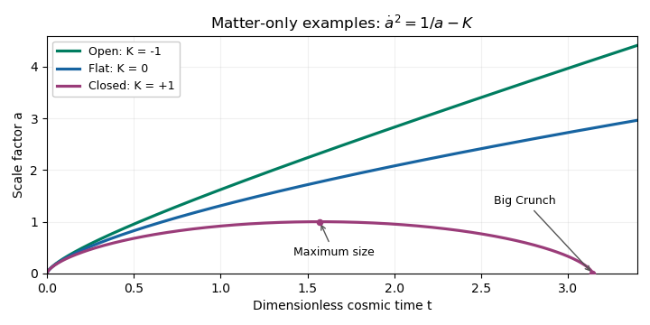

# Paper 310

↑ **Parent:** [Iii](../iii.md)

[https://www.maths.cam.ac.uk/postgrad/part-iii/files/pastpapers/2016/paper_310.pdf](https://www.maths.cam.ac.uk/postgrad/part-iii/files/pastpapers/2016/paper_310.pdf)

**Table of contents**

- [1](#1)
  - [a](#1/a)
    - [Solution](#1/a/solution)
  - [b](#1/b)
    - [Solution](#1/b/solution)
  - [c](#1/c)
    - [Solution](#1/c/solution)
- [2](#2)
  - [a](#2/a)
    - [Solution](#2/a/solution)
  - [b](#2/b)
    - [Solution](#2/b/solution)
  - [c](#2/c)
    - [Solution](#2/c/solution)
- [3](#3)
  - [a](#3/a)
    - [Solution](#3/a/solution)
  - [b](#3/b)
    - [Solution](#3/b/solution)
  - [c](#3/c)
    - [Solution](#3/c/solution)
- [4](#4)
  - [a](#4/a)
    - [Solution](#4/a/solution)
  - [b](#4/b)
    - [Solution](#4/b/solution)
  - [c](#4/c)
    - [Solution](#4/c/solution)

## 1

↑ **Parent:** [Paper 310](paper-310.md)

<h3 id="1/a">a</h3>

↑ **Parent:** [1](#1)

<h4 id="1/a/solution">Solution</h4>

↑ **Parent:** [A](#1/a)

Use units $c=\hbar=k_B=1$, and write $H=\dot a/a$ for the [Hubble parameter](../../../cosmology.md#hubble-parameter), with dots denoting [cosmic time](../../../cosmology.md#cosmic-time). Differentiating the [Friedmann equation](../../../cosmology.md#friedmann-equations) gives

$$
2H\dot H=\frac{8\pi G}{3}\dot\rho+\frac{2KH}{a^2}.
$$

On an interval where $H\ne0$, use the [Hubble parameter identity](../../../cosmology.md#hubble-parameter-identity) $\dot H=\ddot a/a-H^2$ and the [Friedmann acceleration equation](../../../cosmology.md#friedmann-acceleration-equation) to find

$$
\dot H=-4\pi G(\rho+P)+\frac K{a^2}.
$$

Substitution cancels the curvature term and gives the **continuity equation**

$$
\boxed{\dot\rho=-3H(\rho+P).}
$$

The [cosmological perfect-fluid continuity equation](../../../cosmology.md#cosmological-perfect-fluid-continuity-equation) extends by continuity through a regular isolated turning point. Physically it states that the change of energy in a [comoving volume](../../../cosmology.md#comoving-volume) is the negative of the pressure work: $d(\rho a^3)=-P\,d(a^3)$.

For [separately conserved cosmological fluids](../../../cosmology.md#separately-conserved-cosmological-fluids), each component obeys this equation individually. A constant [equation-of-state parameter](../../../cosmology.md#equation-of-state-parameter) $w_i=P_i/\rho_i$ therefore gives

$$
\frac{d\log\rho_i}{d\log a}=-3(1+w_i),
\qquad \rho_i(a)=\rho_{i,0}a^{-3(1+w_i)},
$$

where the present [scale factor](../../../cosmology.md#scale-factor-cosmology) is normalized to $a_0=1$. Thus the **component density laws** are

$$
\boxed{\rho_r=\rho_{r,0}a^{-4},\qquad
\rho_m=\rho_{m,0}a^{-3},\qquad
\rho_\Lambda=\rho_{\Lambda,0}.}
$$

The extra factor for [radiation in cosmology](../../../cosmology.md#radiation-in-cosmology) is the [cosmological redshift](../../../cosmology.md#cosmological-redshift) of each photon's energy; [pressureless matter](../../../cosmology.md#pressureless-matter) has only number dilution, while the specified [dark energy](../../../cosmology.md#dark-energy) is a [cosmological constant](../../../cosmology.md#cosmological-constant).

The [critical density](../../../cosmology.md#critical-density) at a given expansion rate is the total density that makes the spatial curvature vanish:

$$
\rho_{\rm crit}(t)=\frac{3H(t)^2}{8\pi G},\qquad
\Omega_i(t)=\frac{\rho_i(t)}{\rho_{\rm crit}(t)}.
$$

These [cosmological density parameters](../../../cosmology.md#cosmological-density-parameter) use the critical density at that same time. Put $E(a)=H(a)/H_0$ and $\Omega_{K,0}=-K/H_0^2$. The [Friedmann equation](../../../cosmology.md#friedmann-equations) yields

$$
E(a)^2=\Omega_{r,0}a^{-4}+\Omega_{m,0}a^{-3}
+\Omega_{\Lambda,0}+\Omega_{K,0}a^{-2}.
$$

Consequently the **fractional-density evolution**, rather than just the component-density evolution, is

$$
\boxed{\Omega_r(a)=\frac{\Omega_{r,0}a^{-4}}{E(a)^2},\qquad
\Omega_m(a)=\frac{\Omega_{m,0}a^{-3}}{E(a)^2},\qquad
\Omega_\Lambda(a)=\frac{\Omega_{\Lambda,0}}{E(a)^2}.}
$$

In particular $\sum_i\Omega_i=1+K/(a^2H^2)$. The simple powers of $a$ alone apply to $\rho_i$, or to $\rho_i/\rho_{{\rm crit},0}$, not to the instantaneous [cosmological density parameters](../../../cosmology.md#cosmological-density-parameter). At a recollapse turning point $H=0$, those instantaneous ratios are undefined even though the component densities remain finite.

<h3 id="1/b">b</h3>

↑ **Parent:** [1](#1)

<h4 id="1/b/solution">Solution</h4>

↑ **Parent:** [B](#1/b)

Insert the component-density laws into the [Friedmann equation](../../../cosmology.md#friedmann-equations), using $\rho_{i,0}=3H_0^2\Omega_{i,0}/(8\pi G)$ and $a_0=1$. Multiplying by $a^2$ gives

$$
\boxed{\dot a^2=H_0^2\left(\frac{\Omega_{r,0}}{a^2}
+\frac{\Omega_{m,0}}a+\Omega_{\Lambda,0}a^2\right)-K.}
$$

The [radiation in cosmology](../../../cosmology.md#radiation-in-cosmology) and [pressureless matter](../../../cosmology.md#pressureless-matter) contributions add; the printed first formula has lost the plus sign between them. In the [Friedmann acceleration equation](../../../cosmology.md#friedmann-acceleration-equation), $\rho+3P=2\rho_r+\rho_m-2\rho_\Lambda$, so

$$
\boxed{\ddot a=-H_0^2\left(\frac{\Omega_{r,0}}{a^3}
+\frac{\Omega_{m,0}}{2a^2}-\Omega_{\Lambda,0}a\right).}
$$

Evaluating the first equation today gives $K=H_0^2(\Omega_{r,0}+\Omega_{m,0}+\Omega_{\Lambda,0}-1)$.

Now remove [dark energy](../../../cosmology.md#dark-energy) and assume a positive [pressureless matter](../../../cosmology.md#pressureless-matter) or [radiation in cosmology](../../../cosmology.md#radiation-in-cosmology) density, starting on an expanding branch. Let $f(a)=H_0^2(\Omega_{r,0}/a^2+\Omega_{m,0}/a)$. It decreases from infinity to zero, and $\dot a^2=f(a)-K$, while $\ddot a<0$. This immediately distinguishes all three cases of [spatial curvature of an FLRW universe](../../../cosmology.md#spatial-curvature-of-an-flrw-universe).

- **Closed, $K>0$.** There is a unique maximum size $a_{\max}$ with $f(a_{\max})=K$. Expansion from a [Big Bang](../../../cosmology.md#big-bang) slows to $\dot a=0$ and then becomes contraction, ending in a [Big Crunch](../../../cosmology.md#big-crunch). The turning point is reached in finite time because $f(a)-K$ has a simple zero there. The acceleration remains negative at the maximum, so it is a recollapse rather than a static state.
- **Open, $K<0$.** The expanding solution never stops because $\dot a^2=f(a)+|K|>0$. It expands forever, eventually approaching a [curvature-dominated universe](../../../cosmology.md#curvature-dominated-universe) with $\dot a\to\sqrt{|K|}$ and $a(t)\sim\sqrt{|K|}\,t$. Locally its late-time behavior approaches the empty [Milne universe](../../../cosmology.md#milne-model).
- **Spatially flat, $K=0$.** Expansion also continues forever, but $\dot a\to0$ instead of approaching a nonzero constant. With [pressureless matter](../../../cosmology.md#pressureless-matter) present, the late-time solution has $a\propto t^{2/3}$, the [Einstein-de Sitter universe](../../../large-scale-structure-of-the-universe.md#einstein-de-sitter-universe) behavior; a flat solution containing only [radiation in cosmology](../../../cosmology.md#radiation-in-cosmology) has $a\propto t^{1/2}$. With both components, an early [radiation domination](../../../linear-cosmological-density-perturbation.md#radiation-domination) era gives way to [matter domination](../../../linear-cosmological-density-perturbation.md#matter-domination).

The early small-$a$ solution has $a\propto t^{1/2}$ if [radiation in cosmology](../../../cosmology.md#radiation-in-cosmology) is present, and $a\propto t^{2/3}$ for [pressureless matter](../../../cosmology.md#pressureless-matter) alone. The figure isolates the effect of curvature in three matter-only examples, rather than comparing models with the same present density parameters.

**[Figure 1](#1/b/image-matter-only-scale-factor-evolution-closed-recollapse-flat-power-law-expansion-and-open-expansion-tending-to-a-constant-speed). Matter-only scale-factor evolution: closed recollapse, flat power-law expansion, and open expansion tending to a constant speed.**

<h3 id="1/c">c</h3>

↑ **Parent:** [1](#1)

<h4 id="1/c/solution">Solution</h4>

↑ **Parent:** [C](#1/c)

For the [open matter-dominated Friedmann solution](../../../cosmology.md#open-matter-dominated-friedmann-solution), write $\Omega=\Omega_{m,0}$, so $0<\Omega<1$. The present [Friedmann equation](../../../cosmology.md#friedmann-equations) gives $-K=H_0^2(1-\Omega)$. With $A=H_0^2\Omega$ and $B=H_0^2(1-\Omega)>0$, the expanding equation becomes

$$
\dot a^2=\frac Aa+B,\qquad
dt=\frac1{\sqrt B}\sqrt{\frac a{a+A/B}}\,da.
$$

Choose the [hyperbolic substitution](../../../calculus.md#hyperbolic-substitution)

$$
a=\frac AB\sinh^2\frac\eta2
=\frac A{2B}(\cosh\eta-1),\qquad \eta\geq0.
$$

Then $da=(A/(2B))\sinh\eta\,d\eta$ and $\sqrt{a/(a+A/B)}=\tanh(\eta/2)$. Their product gives

$$
\frac{dt}{d\eta}=\frac A{2B^{3/2}}(\cosh\eta-1)
=\frac a{\sqrt B}.
$$

Take the [Big Bang](../../../cosmology.md#big-bang) to be $t=0$, $\eta=0$, and integrate. The **parametric solution** is

$$
\boxed{a(\eta)=\frac{\Omega}{2(1-\Omega)}(\cosh\eta-1),
\qquad
t(\eta)=\frac{\Omega}{2H_0(1-\Omega)^{3/2}}(\sinh\eta-\eta).}
$$

The parameter is determined explicitly by

$$
\boxed{\eta=2\operatorname{arsinh}\sqrt{\frac{(1-\Omega)a}{\Omega}},
\qquad \eta=\sqrt{-K}\int_0^t\frac{dt'}{a(t')}.}
$$

Thus $\eta$ is [conformal time](../../../cosmology.md#conformal-time) multiplied by $\sqrt{-K}$, with its origin at the [Big Bang](../../../cosmology.md#big-bang); it is not equal to unscaled [cosmic time](../../../cosmology.md#cosmic-time). In particular today $\eta_0=\operatorname{arcosh}(2/\Omega-1)$. Small $\eta$ gives $a\propto\eta^2$ and $t\propto\eta^3$, hence $a\propto t^{2/3}$. Large $\eta$ gives $a/t\to H_0\sqrt{1-\Omega}=\sqrt{-K}$, in agreement with the [curvature-dominated universe](../../../cosmology.md#curvature-dominated-universe) limit.

## 2

↑ **Parent:** [Paper 310](paper-310.md)

<h3 id="2/a">a</h3>

↑ **Parent:** [2](#2)

<h4 id="2/a/solution">Solution</h4>

↑ **Parent:** [A](#2/a)

A [cosmological gauge transformation](../../../linear-cosmological-perturbation-theory.md#gauge-transformation-in-cosmological-perturbation-theory) changes the coordinates used to identify a perturbed spacetime with its homogeneous background. It can produce apparent [metric perturbations](../../../general-relativity.md#linearized-gravity) even in a physically unperturbed [FRW metric](../../../cosmology.md#friedmann-lemaitre-robertson-walker-metric). For $\widetilde x^i=x^i+\xi^i(\tau,\mathbf x)$ and unchanged time, the inverse differentials are, to first order,

$$
dx^i=d\widetilde x^i-\partial_j\xi^i\,d\widetilde x^j
-\xi^{i\prime}\,d\tau.
$$

Inserting these into the background line element gives the transformed components

$$
\widetilde g_{ij}=a^2(\delta_{ij}-\partial_i\xi_j-\partial_j\xi_i),
\qquad \widetilde g_{0i}=-a^2\xi_i',\qquad
\widetilde g_{00}=-a^2.
$$

The spatial components can now depend on position, although no physical density inhomogeneity or spacetime curvature perturbation has been introduced. For a scalar displacement $\xi^i=\partial^iL$, these are pure coordinate-generated [scalar cosmological perturbations](../../../linear-cosmological-perturbation-theory.md#scalar-cosmological-perturbation): $E=-L$, $C=-\nabla^2L/3$, $B=-L'$ and $A=0$ in the transformed coordinates.

The **gauge problem** is that individual perturbation variables mix this coordinate freedom with physical fluctuations. A nonzero coordinate-dependent field therefore need not represent a physical effect. One must either choose a definite gauge, such as [Newtonian gauge in cosmology](../../../linear-cosmological-perturbation-theory.md#newtonian-gauge), or construct invariant combinations, while ensuring that observables do not depend on that choice.

<h3 id="2/b">b</h3>

↑ **Parent:** [2](#2)

<h4 id="2/b/solution">Solution</h4>

↑ **Parent:** [B](#2/b)

The same invariant interval can be written as $g_{\mu\nu}dx^\mu dx^\nu=\widetilde g_{\alpha\beta}d\widetilde x^\alpha d\widetilde x^\beta$. Applying the [chain rule](../../../calculus.md#chain-rule) to the differentials proves the **metric transformation law**

$$
\boxed{g_{\mu\nu}(x)=
\frac{\partial\widetilde x^\alpha}{\partial x^\mu}
\frac{\partial\widetilde x^\beta}{\partial x^\nu}
\widetilde g_{\alpha\beta}(\widetilde x).}
$$

For first-order [scalar cosmological perturbations](../../../linear-cosmological-perturbation-theory.md#scalar-cosmological-perturbation) and $\xi^\mu=(T,\partial^iL)$, compare perturbations at the same background coordinate label. Expanding the Jacobians and the shifted background gives the [linear metric gauge-transformation law](../../../linear-cosmological-perturbation-theory.md#linear-metric-gauge-transformation-law)

$$
\widetilde{\delta g}_{\mu\nu}
=\delta g_{\mu\nu}-\mathcal L_\xi\bar g_{\mu\nu}.
$$

For the background $\bar g_{00}=-a^2$, $\bar g_{ij}=a^2\delta_{ij}$, the [Lie derivative](../../../differential-form.md#lie-derivative-of-a-differential-form) components are

$$
(\mathcal L_\xi\bar g)_{00}=-2a^2(T'+\mathcal HT),\qquad
(\mathcal L_\xi\bar g)_{0i}=a^2\partial_i(L'-T),
$$

$$
(\mathcal L_\xi\bar g)_{ij}=2a^2\mathcal HT\delta_{ij}
+2a^2\partial_i\partial_jL,
\qquad \mathcal H=\frac{a'}a.
$$

Here primes denote [conformal time](../../../cosmology.md#conformal-time) and $\mathcal H$ is the [conformal Hubble parameter](../../../cosmology.md#conformal-hubble-parameter). These expressions establish all four alternatives, including any chosen pair.

The $00$ component is $\delta g_{00}=-2a^2A$, immediately giving the [lapse function](../../../numerical-relativity.md#lapse-function) perturbation transformation. The $0i$ component is $a^2\partial_iB$, giving the [shift vector](../../../numerical-relativity.md#shift-vector) scalar-potential transformation. The trace of the spatial perturbation is $6a^2C$, so tracing the spatial [Lie derivative](../../../differential-form.md#lie-derivative-of-a-differential-form) gives the transformation of $C$. Its trace-free scalar part is $2a^2(\partial_i\partial_j-\delta_{ij}\nabla^2/3)E$, giving the transformation of $E$. Thus

$$
\boxed{\begin{aligned}
\widetilde A&=A-T'-\mathcal HT,\\
\widetilde B&=B+T-L',\\
\widetilde C&=C-\mathcal HT-\frac13\nabla^2L,\\
\widetilde E&=E-L.
\end{aligned}}
$$

As usual, identifying scalar potentials from their derivatives uses the standard boundary conditions, or nonzero Fourier modes, to remove homogeneous ambiguities.

At first order, [tensor cosmological perturbations](../../../linear-cosmological-perturbation-theory.md#tensor-cosmological-perturbation) are spatial [transverse-traceless tensors](../../../general-relativity.md#transverse-traceless-tensor). The coordinate-generated spatial perturbation consists of a trace term and symmetrized derivatives of the displacement. In [Fourier space](../../../analysis.md#fourier-space), the latter terms carry a factor $k_i$ or $k_j$. The [transverse-traceless projector](../../../general-relativity.md#transverse-traceless-projector) removes these longitudinal terms and the trace, including the derivative of a transverse vector displacement. Therefore **the tensor perturbation is gauge invariant at linear order around the homogeneous background**. This is a first-order statement, not a claim of automatic invariance at arbitrary perturbative order.

<h3 id="2/c">c</h3>

↑ **Parent:** [2](#2)

<h4 id="2/c/solution">Solution</h4>

↑ **Parent:** [C](#2/c)

Because density is a [scalar field](../../../quantum-field-theory.md#scalar-field), $\widetilde\rho(\widetilde x)=\rho(x)$. Write both sides as background plus perturbation and expand the background time shift:

$$
\bar\rho(\tau)+\delta\rho(\tau,\mathbf x)
=\bar\rho(\tau+T)+\widetilde{\delta\rho}(\tau+T,\mathbf x+\nabla L)
=\bar\rho(\tau)+\bar\rho'T+\widetilde{\delta\rho}(\tau,\mathbf x).
$$

The coordinate shift acting on an already first-order perturbation contributes only at second order. Thus the [density perturbation gauge transformation](../../../linear-cosmological-perturbation-theory.md#density-perturbation-gauge-transformation) is

$$
\boxed{\widetilde{\delta\rho}=\delta\rho-\bar\rho'T.}
$$

The [uniform-density curvature perturbation](../../../linear-cosmological-perturbation-theory.md#uniform-density-curvature-perturbation) in the paper's sign convention is

$$
\zeta=-C+\frac13\nabla^2E+\mathcal H\frac{\delta\rho}{\bar\rho'}.
$$

The derivative on $\bar\rho'$ is essential and is present in the PDF; the TeX transcription drops it. The scalar-curvature combination transforms as

$$
-\widetilde C+\frac13\nabla^2\widetilde E
=-C+\frac13\nabla^2E+\mathcal HT,
$$

while the density term changes by $-\mathcal HT$. Hence **the two time-slicing changes cancel**:

$$
\boxed{\widetilde\zeta=\zeta.}
$$

On a uniform-density slice, $\delta\rho=0$ and this variable is the signed spatial-curvature perturbation. The construction assumes $\bar\rho'\ne0$; a pure constant-density cosmological constant does not define such a time slicing.

In [Newtonian gauge in cosmology](../../../linear-cosmological-perturbation-theory.md#newtonian-gauge), $E=B=0$ and $C=-\Phi$. The background [cosmological perfect-fluid continuity equation](../../../cosmology.md#cosmological-perfect-fluid-continuity-equation) gives $\bar\rho'=-3\mathcal H(\bar\rho+\bar P)$, so, writing $D=\bar\rho+\bar P$,

$$
\zeta=\Phi-\frac{\delta\rho}{3D}.
$$

Set the [cosmological adiabatic sound speed](../../../linear-cosmological-density-perturbation.md#cosmological-adiabatic-sound-speed) $c_a^2=\bar P'/\bar\rho'$. Then $D'=-3\mathcal H D(1+c_a^2)$. Differentiate the previous expression and insert the perturbed energy-conservation equation:

$$
\begin{aligned}
\zeta'&=\Phi'-\frac{\delta\rho'}{3D}
+\frac{\delta\rho D'}{3D^2}\\
&=\frac{\mathcal H}{D}(\delta\rho+\delta P)
+\frac{\nabla\cdot\mathbf q}{3D}
-\frac{\mathcal H}{D}(1+c_a^2)\delta\rho.
\end{aligned}
$$

Consequently the **curvature evolution equation in this sign convention** is

$$
\boxed{\zeta'=\frac{\mathcal H}{\bar\rho+\bar P}\delta P_{\rm nad}
+\frac{\nabla\cdot\mathbf q}{3(\bar\rho+\bar P)}
=\frac{\mathcal H}{\bar\rho+\bar P}\delta P_{\rm nad}
+\frac13\nabla\cdot\mathbf v.}
$$

The last equality defines the total energy-frame velocity by $\mathbf q=D\mathbf v$. For [adiabatic cosmological perturbations](../../../cosmic-microwave-background-anisotropy.md#adiabatic-initial-conditions), the [non-adiabatic pressure perturbation](../../../cosmic-inflation.md#non-adiabatic-pressure-perturbation) vanishes. On [superhorizon scales](../../../cosmic-inflation.md#superhorizon-scale), the stated suppression of the velocity divergence makes the remaining gradient term negligible. Thus **$\zeta$ is conserved to leading order in $k/\mathcal H$**. The positive sign of the pressure source follows from the paper's definition of $\zeta$ and must not be replaced by a formula using the opposite curvature convention.

[Superhorizon conservation of uniform-density curvature](../../../linear-cosmological-perturbation-theory.md#superhorizon-conservation-of-uniform-density-curvature) lets one carry a [primordial perturbation](../../../cosmic-inflation.md#primordial-perturbation) from its inflationary generation through otherwise complicated eras and predict the initial conditions for later [Cosmic microwave background anisotropy](../../../cosmic-microwave-background-anisotropy.md) and structure growth. It relies on adiabaticity: an [isocurvature perturbation](../../../cosmic-inflation.md#cosmological-entropy-perturbation) can source curvature evolution, so the same conclusion is not automatic in an arbitrary multifield model.

## 3

↑ **Parent:** [Paper 310](paper-310.md)

<h3 id="3/a">a</h3>

↑ **Parent:** [3](#3)

<h4 id="3/a/solution">Solution</h4>

↑ **Parent:** [A](#3/a)

Consider a species in [thermal equilibrium](../../../thermodynamics.md#thermal-equilibrium), with [energy density](../../../statistical-physics.md#energy-density) and pressure depending on [temperature](../../../thermodynamics.md#temperature) and with vanishing [chemical potential](../../../thermodynamics.md#chemical-potential), as in the supplied thermodynamic relation. Put $U=\rho(T)V$. The [first law of thermodynamics](../../../thermodynamics.md#first-law-of-thermodynamics) gives

$$
dS=\frac VT\frac{d\rho}{dT}\,dT+\frac{\rho+P}{T}\,dV.
$$

Since $dP/dT=(\rho+P)/T$,

$$
\frac{d}{dT}\left(\frac{\rho+P}{T}\right)
=\frac1T\frac{d\rho}{dT}.
$$

The differential is therefore exact:

$$
dS=d\left[V\frac{\rho+P}{T}\right].
$$

After fixing the irrelevant additive entropy zero, the [entropy density at zero chemical potential](../../../thermodynamics.md#entropy-density-at-zero-chemical-potential) is

$$
\boxed{s=\frac{S}{V}=\frac{\rho+P}{T}.}
$$

More precisely the first law leaves an additive constant in $S$; extensivity fixes that constant for the usual entropy-density normalization. A nonzero chemical potential would instead require $Ts=\rho+P-\mu n$, so the stated formula is not a universal identity for a decoupled massive species with conserved particle number.

For a [reversible thermodynamic process](../../../thermodynamics.md#reversible-thermodynamic-process) that is an [adiabatic process](../../../thermodynamics.md#adiabatic-process) in a [comoving volume](../../../cosmology.md#comoving-volume), $\dot V=3HV$ and the [cosmological perfect-fluid continuity equation](../../../cosmology.md#cosmological-perfect-fluid-continuity-equation) gives $\dot\rho=-3H(\rho+P)$. Differentiating the extensive expression explicitly, or using the exact differential above, gives

$$
\dot S=\frac1T\left[V\dot\rho+(\rho+P)\dot V\right]=0,
\qquad \boxed{a^3s=\text{constant}.}
$$

This is [cosmological entropy conservation](../../../cosmology.md#cosmological-entropy-conservation) for the closed equilibrium gas with no entropy-producing energy injection.

For [radiation in cosmology](../../../cosmology.md#radiation-in-cosmology), $P=\rho/3$, so $s=4\rho/(3T)$. Comparing $s=c_1g_\star T^3$ and $\rho=c_2g_\star T^4$ yields the **coefficient ratio**

$$
\boxed{c_1=\frac43c_2,\qquad \frac{c_2}{c_1}=\frac34.}
$$

When all relativistic species share the same temperature and count, the familiar normalizations are $c_1=2\pi^2/45$ and $c_2=\pi^2/30$. More generally the energy and entropy effective counts can differ; the common $g_\star$ here uses the assumptions stated in the question.

<h3 id="3/b">b</h3>

↑ **Parent:** [3](#3)

<h4 id="3/b/solution">Solution</h4>

↑ **Parent:** [B](#3/b)

Let $T_-$ be the residual gas [temperature](../../../thermodynamics.md#temperature) immediately before decay. This is the $T_d$ that enters the target abundance formula, not the higher [reheating temperature](../../../cosmic-inflation.md#reheating-temperature) after decay. Before the decay, separately conserved relic number and gas entropy give the [conserved cosmological relic abundance](../../../cosmology.md#conserved-cosmological-relic-abundance) $Y=n_\phi/s_-$. The cold nonrelativistic relic has negligible kinetic energy, hence

$$
\rho_\phi\simeq mn_\phi=mYs_-=mc_1g_\star YT_-^3.
$$

Assume its density dominates over that of the residual gas and that curvature and dark energy are negligible in the [Friedmann equation](../../../cosmology.md#friedmann-equations). Using the [reduced Planck mass](../../../physics.md#reduced-planck-mass) $M_{\rm Pl}^2=(8\pi G)^{-1}$ gives $3M_{\rm Pl}^2H_d^2\simeq\rho_\phi(t_d^-)$. Under the allowed [sudden decay of a dominant nonrelativistic relic](../../../cosmic-inflation.md#sudden-decay-of-a-dominant-nonrelativistic-relic) convention $H_d\simeq\Gamma=t_d^{-1}$, the **temperature immediately before decay** is

$$
\boxed{T_d^3=T_-^3\simeq\frac{3M_{\rm Pl}^2}{c_1g_\star Ym\,t_d^2}.}
$$

The coefficient inherits the approximation $H_d\simeq1/t_d$: the result is a sudden-decay estimate, not an exact age relation for a matter-only universe. If $t_d$ were instead the exact cosmic age in an uninterrupted spatially flat matter era, $H_d=2/(3t_d)$ would replace the numerator $3M_{\rm Pl}^2$ by $4M_{\rm Pl}^2/3$.

The assumptions also require [thermal decoupling in cosmology](../../../cosmology.md#thermal-decoupling-in-cosmology) and negligible prior decay so that $Y$ remains conserved, a fixed relativistic count $g_\star$, and rapid thermalization after the energy release. In the same approximation, the [reheating temperature](../../../cosmic-inflation.md#reheating-temperature) $T_+$ follows from $c_2g_\star T_+^4\simeq3M_{\rm Pl}^2/t_d^2$:

$$
T_+\simeq\left(\frac{3M_{\rm Pl}^2}{c_2g_\star t_d^2}\right)^{1/4}.
$$

Its absence of $Y$ at fixed decay rate makes clear why the two temperatures must be distinguished.

<h3 id="3/c">c</h3>

↑ **Parent:** [3](#3)

<h4 id="3/c/solution">Solution</h4>

↑ **Parent:** [C](#3/c)

The instantaneous-decay approximation keeps the [scale factor](../../../cosmology.md#scale-factor-cosmology) and physical volume fixed across the decay. Energy conservation and rapid thermalization give

$$
\rho_{r,+}=\rho_{r,-}+\rho_{\phi,-}\simeq\frac{3M_{\rm Pl}^2}{t_d^2},
\qquad
s_+=c_1g_\star\left(\frac{3M_{\rm Pl}^2}{c_2g_\star t_d^2}\right)^{3/4}.
$$

Meanwhile the abundance relation gives $s_-=\rho_{\phi,-}/(Ym)\simeq3M_{\rm Pl}^2/(Ym\,t_d^2)$. Dividing yields the **entropy-injection factor**

$$
\boxed{\frac{s_+}{s_-}\simeq
\frac{c_1}{3}\left(\frac3{c_2}\right)^{3/4}g_\star^{1/4}
\frac{Ym\sqrt{t_d}}{\sqrt{M_{\rm Pl}}}.}
$$

There is a numerical error in the printed coefficient: part (c) omits the factor $1/3$. The denominator $s_-=3M_{\rm Pl}^2/(Ym\,t_d^2)$ supplies that factor, while the radiation energy contributes $3^{3/4}$ to the numerator. Thus the consistent coefficient is $c_1 3^{-1/4}c_2^{-3/4}$, rather than $c_1 3^{3/4}c_2^{-3/4}$. Both cannot follow from the stated part (b) using the same decay-time approximation.

Its increase is especially transparent without dropping the original radiation. Let $R=\rho_{\phi,-}/\rho_{r,-}$. At unchanged $g_\star$, $T_+^4/T_-^4=1+R$, so

$$
\boxed{\frac{s_+}{s_-}=\left(\frac{T_+}{T_-}\right)^3
=(1+R)^{3/4}>1.}
$$

Relic domination means $R\gg1$, so the leading estimate is much larger than one. This is [entropy production by decay of a dominant relic](../../../cosmic-inflation.md#entropy-production-by-decay-of-a-dominant-relic).

There is no conflict with part (a). The equilibrium gas before the decay was a separately conserved, reversibly expanding system. During decay it receives energy from the nonthermal relic, and the decay products thermalize irreversibly. Its [cosmological perfect-fluid continuity equation](../../../cosmology.md#cosmological-perfect-fluid-continuity-equation) now has an energy-injection source, so $d(\rho_rV)+P_r\,dV$ does not vanish. The assumptions behind [cosmological entropy conservation](../../../cosmology.md#cosmological-entropy-conservation) therefore fail during the event. Moreover the zero-chemical-potential equilibrium expression in part (a) cannot be imposed on the decoupled relic as though it were already part of that same equilibrium radiation bath. The [Second law of thermodynamics](../../../thermodynamics.md#second-law-of-thermodynamics) permits, and here requires, the resulting entropy increase.

## 4

↑ **Parent:** [Paper 310](paper-310.md)

<h3 id="4/a">a</h3>

↑ **Parent:** [4](#4)

<h4 id="4/a/solution">Solution</h4>

↑ **Parent:** [A](#4/a)

For either [scalar field](../../../quantum-field-theory.md#scalar-field) $f$ with mass $m_f$, the supplied covariant equation in the [FLRW metric](../../../cosmology.md#friedmann-lemaitre-robertson-walker-metric) is the [Klein-Gordon equation](../../../wave-equation.md#klein-gordon-equation)

$$
\ddot f+3H\dot f-a^{-2}\nabla^2f+m_f^2f=0.
$$

Since $\dot f=f'/a$, $\ddot f=(f''-\mathcal Hf')/a^2$ and $H=\mathcal H/a$, its **conformal-time form** is

$$
\boxed{\phi''+2\mathcal H\phi'-\nabla^2\phi+a^2m_\phi^2\phi=0,
\qquad
\chi''+2\mathcal H\chi'-\nabla^2\chi+a^2m_\chi^2\chi=0.}
$$

The homogeneous [scalar field](../../../quantum-field-theory.md#scalar-field) backgrounds satisfy the same equations without spatial derivatives. After subtracting them, let $\delta\phi=u/a$ and $\delta\chi=v/a$. The key derivatives are

$$
(u/a)'=\frac{u'-\mathcal Hu}{a},\qquad
(u/a)''=\frac{u''-2\mathcal Hu'+(\mathcal H^2-\mathcal H')u}{a}.
$$

Because $a''/a=\mathcal H'+\mathcal H^2$, the expansion-friction term cancels after this [canonical rescaling of a scalar cosmological perturbation](../../../cosmology.md#canonical-rescaling-of-a-scalar-cosmological-perturbation). The **fluctuation equations** are

$$
\boxed{u''-\nabla^2u+\left(a^2m_\phi^2-\frac{a''}a\right)u=0,
\qquad
v''-\nabla^2v+\left(a^2m_\chi^2-\frac{a''}a\right)v=0.}
$$

The quadratic potential has no mixed derivative, and the stipulated neglect of [metric perturbations](../../../general-relativity.md#linearized-gravity) removes gravitational mixing. Thus these two rescaled fluctuations evolve independently in this approximation.

The given symmetric [Fourier transform](../../../analysis.md#fourier-transform) convention sends $-\nabla^2$ to $k^2$, where $k=|\mathbf k|$. Hence the **Fourier-mode equations** are

$$
\boxed{u_{\mathbf k}''+\left(k^2+a^2m_\phi^2-\frac{a''}a\right)u_{\mathbf k}=0,
\qquad
v_{\mathbf k}''+\left(k^2+a^2m_\chi^2-\frac{a''}a\right)v_{\mathbf k}=0.}
$$

They are harmonic-oscillator equations with time-dependent squared frequencies; a negative effective squared frequency for a rescaled field does not itself imply growth of the physical field $v/a$.

<h3 id="4/b">b</h3>

↑ **Parent:** [4](#4)

<h4 id="4/b/solution">Solution</h4>

↑ **Parent:** [B](#4/b)

In the constant-$H$ [de Sitter approximation](../../../cosmic-inflation.md#de-sitter-approximation), $a=-1/(H\tau)$ with $\tau<0$, so $a''/a=2/\tau^2$. The massive rescaled mode obeys

$$
v_{\mathbf k}''+\left[k^2+\frac{m_\chi^2/H^2-2}{\tau^2}\right]v_{\mathbf k}=0.
$$

For a fixed mass in the specified open interval, at sufficiently late [superhorizon scales](../../../cosmic-inflation.md#superhorizon-scale) with $|k\tau|\ll1$, the $k^2$ term is negligible compared with the inverse-square term in the limiting equation. Try $v\propto(-\tau)^p$. The indicial equation is $p(p-1)+m_\chi^2/H^2-2=0$, giving

$$
\boxed{p=\frac12\pm\nu,\qquad
\nu=\sqrt{\frac94-\frac{m_\chi^2}{H^2}}.}
$$

Thus both independent branches of the [massive de Sitter superhorizon scalar mode](../../../cosmology.md#massive-de-sitter-superhorizon-scalar-mode) are present in

$$
\boxed{v_{\mathbf k}=\frac1{\sqrt{2k}}\left[
c_-(k)(-k\tau)^{1/2-\nu}+c_+(k)(-k\tau)^{1/2+\nu}\right].}
$$

The coefficients are constant in time and fixed by initial conditions. Writing $-k\tau>0$ avoids ambiguous fractional powers of the negative number $k\tau$; a chosen complex phase in the printed notation can be absorbed into the coefficients.

For the specified mass range, $1/2<\nu<\sqrt5/2<3/2$. The physical fluctuation is $\delta\chi_{\mathbf k}=v_{\mathbf k}/a=-H\tau v_{\mathbf k}$, so its two branches behave as $(-\tau)^{3/2-\nu}$ and $(-\tau)^{3/2+\nu}$. Both exponents are strictly positive. Therefore **both physical-field branches decay as $\tau\to0^-$**:

$$
\boxed{\delta\chi_{\mathbf k}\propto
\begin{cases}a^{-(3/2-\nu)},&\text{slower branch},\\
a^{-(3/2+\nu)},&\text{faster branch}.
\end{cases}}
$$

The slower branch of $v$ itself grows because $1/2-\nu<0$, but the expanding [scale factor](../../../cosmology.md#scale-factor-cosmology) more than cancels that growth. A spatially homogeneous background field of this mass satisfies the corresponding $k=0$ equation and also has these decaying powers.

<h3 id="4/c">c</h3>

↑ **Parent:** [4](#4)

<h4 id="4/c/solution">Solution</h4>

↑ **Parent:** [C](#4/c)

Evaluate the field variance in the zero-occupation [Fock vacuum](../../../quantum-field-theory.md#fock-vacuum), $\hat a_{\mathbf k}|0\rangle=0$, with $[\hat a_{\mathbf k},\hat a_{\mathbf k'}^\dagger]=\delta^3(\mathbf k-\mathbf k')$. The [canonical commutation relation](../../../quantum-mechanics.md#canonical-commutation-relation) alone does not specify a quantum state; this vacuum assumption is needed for the requested expression without occupation factors. In the [Heisenberg picture](../../../quantum-mechanics.md#heisenberg-picture), use the position-space [mode expansion of a free field](../../../quantum-field-theory.md#mode-expansion-of-a-free-field)

$$
\hat v(\tau,\mathbf x)=\int\frac{d^3k}{(2\pi)^{3/2}}
\left[v_k(\tau)e^{i\mathbf k\cdot\mathbf x}\hat a_{\mathbf k}
+v_k^*(\tau)e^{-i\mathbf k\cdot\mathbf x}\hat a_{\mathbf k}^\dagger\right].
$$

This is the position-space form of the shorthand oscillator expansion in the question; equivalently its Fourier operator uses the creation operator with opposite wavevector. The [annihilation operators](../../../quantum-mechanics.md#annihilation-operator) give $\langle\hat a_{\mathbf k}\hat a_{\mathbf k'}^\dagger\rangle=\delta^3(\mathbf k-\mathbf k')$, while all other vacuum pairings vanish. The mean field fluctuation is zero, so the two-point function is its [coincident-point vacuum field variance](../../../quantum-field-theory.md#coincident-point-vacuum-field-variance). Assuming spatial isotropy, angular integration gives the **variance per logarithmic wavenumber interval**:

$$
\boxed{\langle\hat v(\tau,0)\hat v^\dagger(\tau,0)\rangle
=\int\frac{d^3k}{(2\pi)^3}|v_k|^2
=\int_0^\infty\frac{dk}{k}\,\Delta_v(k,\tau),
\qquad \Delta_v=\frac{k^3}{2\pi^2}|v_k|^2.}
$$

Here the [dimensionless power spectrum](../../../cosmic-inflation.md#dimensionless-cosmological-power-spectrum) is denoted $\Delta_v$, as in the question, rather than the alternative notation $\Delta_v^2$. A coincident vacuum field product needs smearing or ultraviolet regulation: the unregulated full vacuum variance is generally divergent. With a specified finite wavenumber band, the same expression holds with those integration limits. This does not affect the mode-by-mode [dimensionless power spectrum](../../../cosmic-inflation.md#dimensionless-cosmological-power-spectrum).

For the leading nonzero slower branch, put $x=-k\tau=k/(aH)>0$ and $v_k=c\,x^{1/2-\nu}/\sqrt{2k}$. Since the physical fluctuation is $\delta\chi=v/a$, its [dimensionless power spectrum](../../../cosmic-inflation.md#dimensionless-cosmological-power-spectrum) is

$$
\begin{aligned}
\Delta_{\delta\chi}
&=\frac{k^3}{2\pi^2a^2}|v_k|^2
=|c|^2\frac{k^2}{4\pi^2a^2}x^{1-2\nu}\\
&=\boxed{|c|^2\left(\frac H{2\pi}\right)^2
\left(\frac{k}{aH}\right)^{3-2\nu}.}
\end{aligned}
$$

For a $k$-independent coefficient $c$, this is a blue [spectral tilt](../../../cosmic-inflation.md#scalar-spectral-index), because $3-2\nu>0$ in the specified mass range. At fixed $k$ it decays as $a^{-(3-2\nu)}$, consistently with the field-amplitude decay found above.

To include the other branch explicitly, the general superhorizon expression is

$$
\Delta_{\delta\chi}=\left(\frac H{2\pi}\right)^2x^3
\left|c_-(k)x^{-\nu}+c_+(k)x^\nu\right|^2.
$$

If $c_-\ne0$, it approaches the displayed target spectrum with $c=c_-$. A pure faster classical branch would instead have power proportional to $x^{3+2\nu}$. For a normalized quantum mode, however, the [Wronskian normalization](../../../quantum-field-theory.md#wronskian-normalization) $v_kv_k^{*\prime}-v_k^*v_k^\prime=i$ requires both independent real solutions; its slower coefficient cannot vanish. Thus the target is the leading superhorizon quantum spectrum, while the faster classical solution remains part of the complete mode analysis.

## ↑ Ancestors (8)

1. [Iii](../iii.md)
2. [2016](../../2016.md)
3. [Past exam of the mathematics course of the University of Cambridge](../../../past-exam-of-the-mathematics-course-of-the-university-of-cambridge.md)
4. [Mathematics course of the University of Cambridge](../../../university-of-cambridge.md#mathematics-course-of-the-university-of-cambridge)
5. [Course of the University of Cambridge](../../../university-of-cambridge.md#course-of-the-university-of-cambridge)
6. [University of Cambridge](../../../university-of-cambridge.md)
7. [List of universities](../../../README.md#list-of-universities)
8. [Codex Wiki](../../../README.md)
