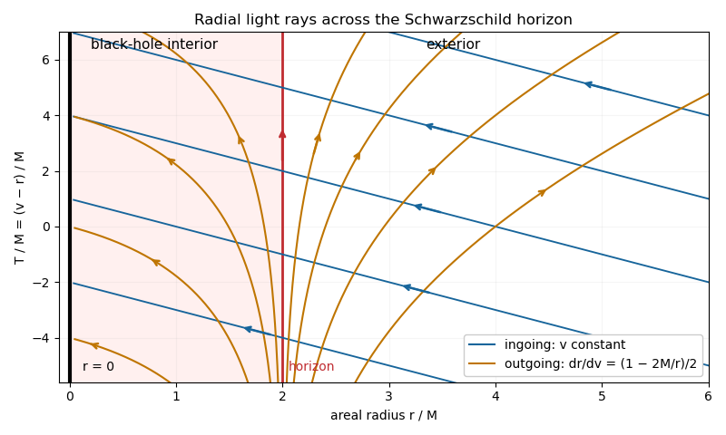
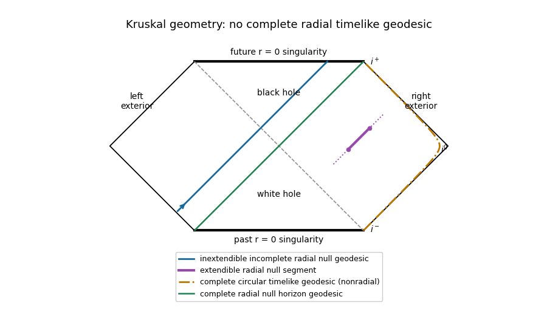

# Paper 311

↑ **Parent:** [Iii](../iii.md)

[https://www.maths.cam.ac.uk/postgrad/part-iii/files/pastpapers/2016/paper_311.pdf](https://www.maths.cam.ac.uk/postgrad/part-iii/files/pastpapers/2016/paper_311.pdf)

**Table of contents**

- [1](#1)
  - [a](#1/a)
    - [i](#1/a/i)
      - [Solution](#1/a/i/solution)
    - [ii](#1/a/ii)
      - [Solution](#1/a/ii/solution)
  - [b](#1/b)
    - [Solution](#1/b/solution)
  - [c](#1/c)
    - [i](#1/c/i)
      - [Solution](#1/c/i/solution)
    - [ii](#1/c/ii)
      - [Solution](#1/c/ii/solution)
- [2](#2)
  - [a](#2/a)
    - [Solution](#2/a/solution)
  - [b](#2/b)
    - [Solution](#2/b/solution)
  - [c](#2/c)
    - [Solution](#2/c/solution)
  - [d](#2/d)
    - [i](#2/d/i)
      - [Solution](#2/d/i/solution)
    - [ii](#2/d/ii)
      - [Solution](#2/d/ii/solution)
    - [iii](#2/d/iii)
      - [Solution](#2/d/iii/solution)
- [3](#3)
  - [a](#3/a)
    - [i](#3/a/i)
      - [Solution](#3/a/i/solution)
    - [ii](#3/a/ii)
      - [Solution](#3/a/ii/solution)
    - [iii](#3/a/iii)
      - [Solution](#3/a/iii/solution)
  - [b](#3/b)
    - [i](#3/b/i)
      - [Solution](#3/b/i/solution)
    - [ii](#3/b/ii)
      - [Solution](#3/b/ii/solution)
    - [iii](#3/b/iii)
      - [Solution](#3/b/iii/solution)
- [4](#4)
  - [a](#4/a)
    - [i](#4/a/i)
      - [Solution](#4/a/i/solution)
    - [ii](#4/a/ii)
      - [Solution](#4/a/ii/solution)
    - [iii](#4/a/iii)
      - [Solution](#4/a/iii/solution)
  - [b](#4/b)
    - [Solution](#4/b/solution)

## 1

↑ **Parent:** [Paper 311](paper-311.md)

<h3 id="1/a">a</h3>

↑ **Parent:** [1](#1)

<h4 id="1/a/i">i</h4>

↑ **Parent:** [A](#1/a)

<h5 id="1/a/i/solution">Solution</h5>

↑ **Parent:** [I](#1/a/i)

Use [geometrized units](../../../general-relativity.md#geometrized-units) $G=c=1$ and [metric signature](../../../topology.md#metric-signature) $(-,+,+,+)$. Put $f=1-2M/r$ in the [Schwarzschild metric](../../../general-relativity.md#schwarzschild-spacetime). The [Schwarzschild tortoise coordinate](../../../general-relativity.md#schwarzschild-tortoise-coordinate) satisfies $dr_*/dr=f^{-1}$, so

$$
r_*=r+2M\log\left|\frac r{2M}-1\right|,\qquad v=t+r_*.
$$

Substituting $dt=dv-f^{-1}dr$ gives the [Ingoing Eddington-Finkelstein coordinates](../../../general-relativity.md#ingoing-eddington-finkelstein-coordinates):

$$
\boxed{ds^2=-f\,dv^2+2\,dv\,dr+r^2(d\theta^2+\sin^2\theta\,d\phi^2).}
$$

The radial [metric tensor](../../../general-relativity.md#metric-tensor) has determinant $-1$ and inverse components $g^{vv}=0$, $g^{vr}=1$, $g^{rr}=f$. Thus it is nondegenerate and analytic at $r=2M$. The same expression defines a [Lorentzian metric](../../../general-relativity.md#lorentzian-metric) for every $r>0$, extending the exterior across the future [Schwarzschild event horizon](../../../general-relativity.md#schwarzschild-event-horizon) into the [black hole](../../../general-relativity.md#black-hole). It does not include the other exterior or the [white hole](../../../general-relativity.md#white-hole) of the full [Kruskal spacetime](../../../general-relativity.md#kruskal-spacetime). At $r=0$, the [Kretschmann scalar](../../../general-relativity.md#kretschmann-scalar) $R_{abcd}R^{abcd}=48M^2/r^6$ diverges, so this is a [curvature singularity](../../../general-relativity.md#curvature-singularity), not a removable [coordinate singularity](../../../general-relativity.md#coordinate-singularity).

<h4 id="1/a/ii">ii</h4>

↑ **Parent:** [A](#1/a)

<h5 id="1/a/ii/solution">Solution</h5>

↑ **Parent:** [Ii](#1/a/ii)

The radial [null geodesics](../../../special-relativity.md#null-geodesic) satisfy

$$
0=dv(-f\,dv+2\,dr).
$$

The ingoing family has $v=\text{constant}$, with $r$ decreasing toward the future; its tangent $-\partial_r$ is affinely parametrized because $\Gamma^a{}_{rr}=0$. The outgoing family has

$$
\boxed{\frac{dr}{dv}=\frac f2.}
$$

Away from the [Schwarzschild event horizon](../../../general-relativity.md#schwarzschild-event-horizon), integration gives $v=2r_*+\text{constant}$. These are [null geodesics](../../../special-relativity.md#null-geodesic) up to reparametrization: a null direction in the two-dimensional radial geometry is automatically [pregeodesic](../../../riemannian-geometry.md#pregeodesic), and the angular [geodesic equations](../../../riemannian-geometry.md#geodesic-equation) are satisfied by constant angles. On the [Schwarzschild event horizon](../../../general-relativity.md#schwarzschild-event-horizon) the outgoing family instead has $r=2M$, with tangent proportional to $\partial_v$.

In a [Finkelstein diagram](../../../general-relativity.md#finkelstein-diagram), plot $T=v-r$ vertically and $r$ horizontally. Ingoing rays obey $T+r=\text{constant}$; outgoing rays obey

$$
T=r+4M\log\left|\frac r{2M}-1\right|+\text{constant}.
$$

Outside the [Schwarzschild event horizon](../../../general-relativity.md#schwarzschild-event-horizon), outgoing rays increase $r$; on it they remain at $r=2M$; inside it they decrease $r$ even though $v$ increases. Thus both radial future [null directions](../../../special-relativity.md#null-directions) point toward smaller $r$ inside the [black hole](../../../general-relativity.md#black-hole). Every future [timelike direction](../../../general-relativity.md#timelike-vector) lies between these [null directions](../../../special-relativity.md#null-directions), so it also moves toward smaller $r$ there.

**[Figure 1](#1/a/ii/image-radial-light-rays-in-ingoing-eddington-finkelstein-coordinates-across-the-schwarzschild-horizon). Radial light rays in ingoing Eddington-Finkelstein coordinates across the Schwarzschild horizon**.

Arrows show future propagation. The vertical red line is the [Schwarzschild event horizon](../../../general-relativity.md#schwarzschild-event-horizon); the black boundary at $r=0$ is the [Schwarzschild singularity](../../../general-relativity.md#schwarzschild-singularity).

<h3 id="1/b">b</h3>

↑ **Parent:** [1](#1)

<h4 id="1/b/solution">Solution</h4>

↑ **Parent:** [B](#1/b)

A [spacetime](../../../special-relativity.md#spacetime) is [geodesically complete](../../../riemannian-geometry.md#geodesic-completeness) if every [maximal geodesic](../../../riemannian-geometry.md#maximal-geodesic) has an [affine parameter](../../../riemannian-geometry.md#affine-parameter) ranging over all of $\mathbb R$. For [timelike geodesics](../../../general-relativity.md#timelike-geodesic) this is equivalent to unbounded [proper time](../../../special-relativity.md#proper-time) in both directions. An [extendible geodesic](../../../riemannian-geometry.md#extendible-geodesic) segment can be prolonged in the same [spacetime](../../../special-relativity.md#spacetime); an [inextendible geodesic](../../../riemannian-geometry.md#maximal-geodesic) cannot. A finite coordinate endpoint need not imply finite [affine parameter](../../../riemannian-geometry.md#affine-parameter).

For the [Kruskal spacetime](../../../general-relativity.md#kruskal-spacetime), use $U,V$ with

$$
UV=\left(1-\frac r{2M}\right)e^{r/(2M)},\qquad ds^2=-\frac{32M^3}{r}e^{-r/(2M)}dU\,dV+r^2d\Omega^2.
$$

In the right exterior $U<0<V$. A truncated ray $U=U_0<0$, $V_1<V<V_2$ is an [extendible geodesic](../../../riemannian-geometry.md#extendible-geodesic) of radial null type: neither artificial endpoint is a [spacetime](../../../special-relativity.md#spacetime) boundary. A future ray $U=U_0>0$ in the [black hole](../../../general-relativity.md#black-hole) reaches $UV=1$, hence $r=0$, and is [inextendible geodesic](../../../riemannian-geometry.md#maximal-geodesic) and future [null-geodesically incomplete](../../../general-relativity.md#null-geodesic-incompleteness). Its [Killing energy](../../../general-relativity.md#killing-energy) $E\ne0$ gives $dr/d\lambda=-|E|$, so the [Schwarzschild singularity](../../../general-relativity.md#schwarzschild-singularity) occurs at finite [affine parameter](../../../riemannian-geometry.md#affine-parameter). The maximal continuation toward the past supplies the other half of this same [null geodesic](../../../special-relativity.md#null-geodesic).

**There is no inextendible, complete radial timelike geodesic in positive-mass Kruskal spacetime.** This requested example is impossible as printed. For a radial [timelike geodesic](../../../general-relativity.md#timelike-geodesic), the conserved [Killing energy](../../../general-relativity.md#killing-energy) and normalization give

$$
\dot r^2=E^2-1+\frac{2M}{r},\qquad \ddot r=-\frac M{r^2}.
$$

If $E^2<1$, $r$ has at most one turning point, a maximum $r_{\max}=2M/(1-E^2)$; a maximal trajectory runs from the [white hole](../../../general-relativity.md#white-hole) [Schwarzschild singularity](../../../general-relativity.md#schwarzschild-singularity) to the [Schwarzschild singularity](../../../general-relativity.md#schwarzschild-singularity). If $E^2\ge1$, there is no finite turning point; one end can lie at infinity but the other reaches $r=0$. The exceptional $E=0$ trajectory through the [bifurcation surface](../../../general-relativity.md#bifurcation-surface) also reaches $r=0$ in both time directions. Near $r=0$,

$$
d\tau\sim\sqrt{\frac r{2M}}\,dr,
$$

whose integral is finite. Constant-$r$ radial [timelike curves](../../../special-relativity.md#timelike-curve) are accelerated, not [geodesics](../../../riemannian-geometry.md#geodesic).

Two plausible repairs have different meanings. Removing “radial” permits a complete circular [timelike geodesic](../../../general-relativity.md#timelike-geodesic) at $r=R>6M$, with nonzero [angular momentum](../../../classical-mechanics.md#angular-momentum) and [proper time](../../../special-relativity.md#proper-time) ranging over $\mathbb R$. Replacing “timelike” by “null” permits a complete horizon [null geodesic](../../../special-relativity.md#null-geodesic): $U=0$, $V\in\mathbb R$, with $V$ an [affine parameter](../../../riemannian-geometry.md#affine-parameter). The [Penrose diagram](../../../general-relativity.md#penrose-diagram) shows both repairs explicitly, together with the two valid requested examples; the circular trajectory is only a radial projection and is labelled as nonradial.

**[Figure 2](#1/b/image-kruskal-causal-diagram-with-extendible-and-incomplete-null-rays-and-explicitly-labelled-repairs-to-the-impossible-radial-timelike-example). Kruskal causal diagram with extendible and incomplete null rays and explicitly labelled repairs to the impossible radial timelike example**.

The horizontal boundaries are the [Schwarzschild singularities](../../../general-relativity.md#schwarzschild-singularity), diagonal dashed lines are the [Killing horizons](../../../general-relativity.md#killing-horizon), and outer diagonal edges are [null infinity](../../../general-relativity.md#null-infinity).

<h3 id="1/c">c</h3>

↑ **Parent:** [1](#1)

<h4 id="1/c/i">i</h4>

↑ **Parent:** [C](#1/c)

<h5 id="1/c/i/solution">Solution</h5>

↑ **Parent:** [I](#1/c/i)

Define [Outgoing Eddington-Finkelstein coordinates](../../../general-relativity.md#outgoing-eddington-finkelstein-coordinates) by $u=t-r_*$. The radial [Schwarzschild metric](../../../general-relativity.md#schwarzschild-spacetime) becomes

$$
ds^2=-f\,du^2-2\,du\,dr.
$$

Outgoing radio rays have constant $u$. Two nearby wave crests emitted at Alice's [proper times](../../../special-relativity.md#proper-time) $\tau$ and $\tau+d\tau$ have separation $du=\dot u_A\,d\tau$. At Bob's fixed radius $r_B$, $dt_B=du$ and $d\tau_B=\sqrt{f_B}\,du$, where $f_B=1-2M/r_B$. Thus the exact local [redshift](../../../optics.md#redshift) is

$$
\boxed{\frac{\lambda_B}{\lambda_A}=\frac{d\tau_B}{d\tau_A}=\sqrt{f_B}\,\frac{du_A}{d\tau_A}.}
$$

Here the [wavelength](../../../wave-equation.md#wavelength) ratio equals the [proper time](../../../special-relativity.md#proper-time) period ratio in [geometric optics](../../../optics.md#geometrical-optics). Equivalently, the phase gradient $k_a=-\omega_\infty(du)_a$ gives Alice's measured [frequency](../../../physics.md#frequency) $\omega_A=-k_aU_A^a=\omega_\infty\dot u_A$ and Bob's $\omega_B=\omega_\infty/\sqrt{f_B}$.

**In the asymptotically distant-observer limit $f_B\to1$, this becomes $\lambda_B/\lambda_A=du_A/d\tau_A$.** “Far away” is the approximation behind the printed formula; at finite $r_B$ the factor $\sqrt{f_B}$ remains.

<h4 id="1/c/ii">ii</h4>

↑ **Parent:** [C](#1/c)

<h5 id="1/c/ii/solution">Solution</h5>

↑ **Parent:** [Ii](#1/c/ii)

For radial free fall, let $E=f\dot t_A>0$ be Alice's conserved [Killing energy](../../../general-relativity.md#killing-energy). The inward branch of the [timelike geodesic](../../../general-relativity.md#timelike-geodesic) has $\dot r=-\sqrt{E^2-f}$, hence

$$
\dot u_A=\dot t_A-\frac{\dot r}{f}=\frac{E+\sqrt{E^2-f}}{f}\sim\frac{2E}{f}.
$$

With $\delta=r-2M$, the near-horizon [geodesic equations](../../../riemannian-geometry.md#geodesic-equation) give

$$
f\sim\frac{\delta}{2M},\quad \delta\sim E(\tau_H-\tau),\quad t_A=-2M\log(\tau_H-\tau)+O(1),\quad r_* =2M\log(\tau_H-\tau)+O(1).
$$

The constants in the logarithms are understood to make their arguments dimensionless. Therefore $u_A=t_A-r_*=2t_A+O(1)$. For an outgoing signal reaching the fixed-radius Bob, $t_B=u_A+r_*(r_B)$, so $t_B=2t_A+O(1)$. The [redshift](../../../optics.md#redshift) consequently behaves as

$$
\frac{\lambda_B}{\lambda_A}\propto e^{t_B/(4M)},\qquad \boxed{M=\frac1{4a}}.
$$

This is the answer when $t$ is Bob's [Schwarzschild time](../../../general-relativity.md#schwarzschild-time), as appropriate to the stated observation. It is the [Schwarzschild surface gravity](../../../general-relativity.md#schwarzschild-surface-gravity) $a=\kappa=1/(4M)$. If $t$ instead means the emission [Schwarzschild time](../../../general-relativity.md#schwarzschild-time) $t_A$, the same [redshift](../../../optics.md#redshift) is proportional to $e^{t_A/(2M)}$ and gives $M=1/(2a)$. The two answers use different clocks, not different dynamics. If the measured exponential uses Bob's [proper time](../../../special-relativity.md#proper-time) $\tau_B$, its rate is $1/(4M\sqrt{f_B})$. In SI units the reception-time result is $M=c^3/(4Ga)$.

The reception-time exponent also holds for smooth radial infall crossing the future [Schwarzschild event horizon](../../../general-relativity.md#schwarzschild-event-horizon) with finite nonzero $dr/d\tau$: regular [Ingoing Eddington-Finkelstein coordinates](../../../general-relativity.md#ingoing-eddington-finkelstein-coordinates) give finite $v$ there, $u=v-2r_*\sim-4M\log(\tau_H-\tau)$. Thus no special value of $E$ is needed.

## 2

↑ **Parent:** [Paper 311](paper-311.md)

<h3 id="2/a">a</h3>

↑ **Parent:** [2](#2)

<h4 id="2/a/solution">Solution</h4>

↑ **Parent:** [A](#2/a)

Locally write a smooth [hypersurface](../../../differential-geometry.md#hypersurface) as $\Phi=0$ with $n_a=\nabla_a\Phi\ne0$. It is a [null hypersurface](../../../general-relativity.md#null-hypersurface) when $n_an^a=0$ on it. Then $n^a$ is both normal and tangent, and the [induced metric](../../../riemannian-geometry.md#induced-metric) is degenerate along $n^a$.

Because [covariant derivatives](../../../general-relativity.md#covariant-derivative) commute on a scalar,

$$
n^b\nabla_bn_a=n^b\nabla_an_b=\frac12\nabla_a(n_bn^b).
$$

The scalar $n^2$ vanishes on the [hypersurface](../../../differential-geometry.md#hypersurface), so its derivative annihilates every tangent direction there. Its derivative is consequently proportional to $n_a$: locally $n^2=\Phi q$ for a smooth function $q$, giving

$$
\boxed{n^b\nabla_bn^a=\kappa n^a,\qquad \kappa=q/2\text{ on }\Phi=0.}
$$

Thus the normal generates [null pregeodesics](../../../riemannian-geometry.md#null-pregeodesic). Rescale $k^a=\alpha n^a$, choosing $n^b\nabla_b\log\alpha=-\kappa$, to get $k^b\nabla_bk^a=0$. These are the affinely parametrized generators of the [null hypersurface](../../../general-relativity.md#null-hypersurface). The proportionality need not vanish: setting $n^2=0$ only on the [hypersurface](../../../differential-geometry.md#hypersurface) does not set its full transverse derivative to zero.

<h3 id="2/b">b</h3>

↑ **Parent:** [2](#2)

<h4 id="2/b/solution">Solution</h4>

↑ **Parent:** [B](#2/b)

A future [trapped surface](../../../general-relativity.md#trapped-surface) is a smooth compact spacelike two-surface without boundary whose two future-directed orthogonal [null expansions](../../../geodesic-congruence.md#null-expansion) are strictly negative. In four-dimensional [general relativity](../../../general-relativity.md), the [Penrose singularity theorem](../../../general-relativity.md#penrose-singularity-theorem) states: a time-oriented [globally hyperbolic spacetime](../../../general-relativity.md#globally-hyperbolic-spacetime) with a noncompact [Cauchy hypersurface](../../../general-relativity.md#cauchy-surface), a [trapped surface](../../../general-relativity.md#trapped-surface), and the [null convergence condition](../../../general-relativity.md#null-convergence-condition) $R_{ab}k^ak^b\ge0$ for every [null vector](../../../special-relativity.md#null-vector) is future [null-geodesically incomplete](../../../general-relativity.md#null-geodesic-incompleteness). With the [Einstein field equations](../../../general-relativity.md#einstein-field-equations), the [null energy condition](../../../general-relativity.md#null-energy-condition) implies this [null convergence condition](../../../general-relativity.md#null-convergence-condition); a [cosmological constant](../../../cosmology.md#cosmological-constant) drops out of the null contraction.

The [Kruskal spacetime](../../../general-relativity.md#kruskal-spacetime) is an example. In its [black hole](../../../general-relativity.md#black-hole) interior, use future null normals in [Ingoing Eddington-Finkelstein coordinates](../../../general-relativity.md#ingoing-eddington-finkelstein-coordinates):

$$
l=-\partial_r,\qquad k=\partial_v+\frac f2\partial_r,\qquad g(l,k)=-1.
$$

For a round sphere of [areal radius](../../../general-relativity.md#areal-radius) $r$, its area is $4\pi r^2$ and its [null expansions](../../../geodesic-congruence.md#null-expansion) are

$$
\theta_l=\frac{2l(r)}r=-\frac2r,\qquad \theta_k=\frac{2k(r)}r=\frac fr.
$$

Both are negative for $0<r<2M$. The vacuum [Einstein field equations](../../../general-relativity.md#einstein-field-equations) give $R_{ab}=0$, and a two-ended Kruskal [Cauchy hypersurface](../../../general-relativity.md#cauchy-surface) is noncompact. The future [radial null geodesics](../../../special-relativity.md#radial-null-geodesic) reaching $r=0$ in finite [affine parameter](../../../riemannian-geometry.md#affine-parameter) provide precisely the incompleteness predicted by the [Penrose singularity theorem](../../../general-relativity.md#penrose-singularity-theorem). A [trapped surface](../../../general-relativity.md#trapped-surface) at $r<2M$ is strictly trapped; the horizon sphere has one zero [null expansion](../../../geodesic-congruence.md#null-expansion) instead.

<h3 id="2/c">c</h3>

↑ **Parent:** [2](#2)

<h4 id="2/c/solution">Solution</h4>

↑ **Parent:** [C](#2/c)

Use the subextremal four-dimensional [Reissner-Nordstrom spacetime](../../../general-relativity.md#reissner-nordstrom-spacetime), with $0<|Q|<M$. Its static radial function is

$$
f(r)=1-\frac{2M}{r}+\frac{Q^2}{r^2},\qquad r_\pm=M\pm\sqrt{M^2-Q^2}.
$$

Take the time-symmetric two-ended bridge through the outer [bifurcation surface](../../../general-relativity.md#bifurcation-surface). Its [initial data](../../../general-relativity.md#initial-data-in-general-relativity) have $K_{ij}=0$ and

$$
h=f^{-1}dr^2+r^2d\Omega^2
$$

on each $r\ge r_+$ end. The bridge is smooth: in proper radial distance $s$, $r-r_+=f'(r_+)s^2/4+O(s^4)$. Each asymptotically flat end is an infinite [Riemannian distance](../../../riemannian-geometry.md#riemannian-distance) away. Hence the spatial [Riemannian manifold](../../../riemannian-geometry.md#riemannian-manifold) is complete and admits no proper same-dimensional smooth [isometric extension](../../../riemannian-geometry.md#isometric-extension) as a connected spatial manifold.

Its [maximal Cauchy development](../../../general-relativity.md#maximal-cauchy-development) includes the two exteriors and the adjacent future and past regions between $r_+$ and $r_-$. It ends at inner [Cauchy horizons](../../../general-relativity.md#cauchy-horizon), not at a [curvature singularity](../../../general-relativity.md#curvature-singularity). Since the simple root at $r_-$ is removable in horizon-penetrating coordinates and all curvature invariants are finite there, the exact solution extends across these [Cauchy horizons](../../../general-relativity.md#cauchy-horizon). The extension is no longer globally determined by the given [initial data](../../../general-relativity.md#initial-data-in-general-relativity).

**[Figure 3](#2/c/image-the-maximal-cauchy-development-of-a-complete-reissner-nordstrom-bridge-ends-at-extendible-inner-cauchy-horizons). The maximal Cauchy development of a complete Reissner-Nordstrom bridge ends at extendible inner Cauchy horizons**.

The shaded region is the [maximal Cauchy development](../../../general-relativity.md#maximal-cauchy-development); dashed upper and lower null edges are inner [Cauchy horizons](../../../general-relativity.md#cauchy-horizon). The displayed neighboring diamonds illustrate smooth continuation, rather than the entire infinite extension.

The [strong cosmic censorship conjecture](../../../general-relativity.md#strong-cosmic-censorship-conjecture) concerns generic admissible [initial data](../../../general-relativity.md#initial-data-in-general-relativity), in a specified extension regularity. Exact charged spherical data are exceptional. Perturbations can produce [mass inflation](../../../general-relativity.md#mass-inflation) at the inner [Cauchy horizon](../../../general-relativity.md#cauchy-horizon), obstructing suitably regular extensions; the precise conjecture depends on the matter model and whether extensions are required to be $C^0$, $C^2$, or another regularity. Thus this exact extendible example does not refute a generic [strong cosmic censorship conjecture](../../../general-relativity.md#strong-cosmic-censorship-conjecture).

For an Einstein-Maxwell example the gravitational triple $(\Sigma,h,K)$ must be accompanied by electromagnetic [initial data](../../../general-relativity.md#initial-data-in-general-relativity). One may take zero magnetic field and the smooth radial electric flux $Q/r^2$ through the bridge. The charges at the two ends have opposite signs when measured with outward normals. This is an example in the electrovacuum theory, not vacuum [initial data](../../../general-relativity.md#initial-data-in-general-relativity).

<h3 id="2/d">d</h3>

↑ **Parent:** [2](#2)

<h4 id="2/d/i">i</h4>

↑ **Parent:** [D](#2/d)

<h5 id="2/d/i/solution">Solution</h5>

↑ **Parent:** [I](#2/d/i)

The [dominant energy condition](../../../general-relativity.md#dominant-energy-condition) says that, for every future [timelike vector](../../../general-relativity.md#timelike-vector) $u^a$, the energy current $J^a=-T^a{}_b u^b$ is future causal or zero. Choose [normal coordinates](../../../general-relativity.md#normal-coordinates) whose future unit time vector at $p$ is $u^a=(1,0,0,0)$. With [metric signature](../../../topology.md#metric-signature) $(-,+,+,+)$ and symmetric [stress-energy tensor](../../../general-relativity.md#stress-energy-tensor),

$$
J^0=T_{00},\qquad J^i=-T_{i0}.
$$

A vector with these components is future causal or zero exactly when

$$
\boxed{T_{00}\ge\sqrt{\sum_iT_{0i}^2}.}
$$

This proves necessity. Conversely, every future unit [timelike vector](../../../general-relativity.md#timelike-vector) can be made the time axis of an orthonormal frame by a proper orthochronous [Lorentz transformation](../../../special-relativity.md#lorentz-transformation), and that frame can be extended to [normal coordinates](../../../general-relativity.md#normal-coordinates) at $p$. Requiring the displayed inequality in every such chart therefore gives the [dominant energy condition](../../../general-relativity.md#dominant-energy-condition) for every future [timelike vector](../../../general-relativity.md#timelike-vector); positive rescaling handles nonunit vectors. Future [null vectors](../../../special-relativity.md#null-vector) follow by continuity if they are included in the definition. **The condition must hold in every local Lorentz frame; one chart alone is insufficient.**

<h4 id="2/d/ii">ii</h4>

↑ **Parent:** [D](#2/d)

<h5 id="2/d/ii/solution">Solution</h5>

↑ **Parent:** [Ii](#2/d/ii)

In an orthonormal frame, $F_{0i}=-E_i$ and $F_{ij}=\epsilon_{ijk}B_k$. The [electromagnetic stress-energy tensor](../../../electromagnetism.md#electromagnetic-stress-energy-tensor) gives

$$
T_{00}=\frac{E^2+B^2}{8\pi},\qquad T_{0i}=-\frac{(\mathbf E\times\mathbf B)_i}{4\pi}.
$$

The sign of $T_{0i}$ follows directly from $F_{0j}F_i{}^j=-E_j\epsilon_{ijk}B_k$. Thus

$$
T_{00}^2-\sum_iT_{0i}^2
=\frac{(E^2-B^2)^2+4(\mathbf E\cdot\mathbf B)^2}{64\pi^2}\ge0,
$$

and $T_{00}\ge0$. These formulas hold in every local [Lorentz frame](../../../general-relativity.md#lorentz-frame), so the criterion just proved establishes the [dominant energy condition](../../../general-relativity.md#dominant-energy-condition). Equality occurs for a nonzero null [Maxwell field](../../../electromagnetism.md#electromagnetic-field) with $E^2=B^2$ and $\mathbf E\cdot\mathbf B=0$, whose energy current is [null vector](../../../special-relativity.md#null-vector).

<h4 id="2/d/iii">iii</h4>

↑ **Parent:** [D](#2/d)

<h5 id="2/d/iii/solution">Solution</h5>

↑ **Parent:** [Iii](#2/d/iii)

For the [P(X, phi) scalar field theory](../../../cosmology.md#p-x-phi-scalar-field-theory) specialized to $F(X)$, vary the inverse [metric tensor](../../../general-relativity.md#metric-tensor) while holding $\phi$ fixed. With $q_a=\partial_a\phi$,

$$
\delta X=-\frac12q_aq_b\delta g^{ab},\qquad \delta\sqrt{-g}=-\frac12\sqrt{-g}\,g_{ab}\delta g^{ab}.
$$

Using $T_{ab}=-2(-g)^{-1/2}\delta S/\delta g^{ab}$ yields

$$
\boxed{T_{ab}=F'(X)q_aq_b+F(X)g_{ab}.}
$$

In any local [Lorentz frame](../../../general-relativity.md#lorentz-frame), set $A=F'(X)\ge0$, $Y=XF'(X)-F(X)\ge0$, $s=\sum_iq_i^2$, and $X=(q_0^2-s)/2$. Then

$$
\rho=T_{00}=Aq_0^2-F=\frac A2(q_0^2+s)+Y\ge0,\qquad T_{0i}=Aq_0q_i.
$$

A direct calculation gives

$$
\boxed{\rho^2-\sum_iT_{0i}^2=A^2X^2+A(q_0^2+s)Y+Y^2\ge0.}
$$

Hence $\rho\ge\sqrt{T_{0i}T_{0i}}$ in every local [Lorentz frame](../../../general-relativity.md#lorentz-frame), proving the [dominant energy condition](../../../general-relativity.md#dominant-energy-condition). This proof covers timelike, null, spacelike, and zero $\nabla\phi$ alike; it does not assume $X>0$ or use a [perfect fluid in general relativity](../../../general-relativity.md#perfect-fluid-in-general-relativity) rest frame. The hypotheses need only hold at every attained value of $X$; the stated all-$X$ assumptions are sufficient. For example, $F=X-V_0$, $V_0\ge0$, satisfies them.

## 3

↑ **Parent:** [Paper 311](paper-311.md)

<h3 id="3/a">a</h3>

↑ **Parent:** [3](#3)

<h4 id="3/a/i">i</h4>

↑ **Parent:** [A](#3/a)

<h5 id="3/a/i/solution">Solution</h5>

↑ **Parent:** [I](#3/a/i)

There are no $\partial_tN$ or $\partial_tN^i$ terms in the displayed [Einstein-Hilbert action](../../../general-relativity.md#einstein-hilbert-action), so the [lapse function](../../../numerical-relativity.md#lapse-function) and [shift vector](../../../numerical-relativity.md#shift-vector) have zero [canonical momenta](../../../classical-mechanics.md#canonical-momentum). Their equations impose [constraint equations in field theory](../../../quantum-field-theory.md#constraint-equation-in-field-theory) rather than independent propagation; they are [Lagrange multipliers](../../../mathematical-optimization.md#lagrange-multiplier) in the [Hamiltonian formulation of general relativity](../../../numerical-relativity.md#hamiltonian-formulation-of-general-relativity).

With the question's positive sign for $K_{ij}=(\dot h_{ij}-D_iN_j-D_jN_i)/(2N)$, vary $\dot h_{ij}$ at fixed $h,N,N^i$. Since $\delta K_{ij}=\delta\dot h_{ij}/(2N)$,

$$
\delta\mathcal L=\sqrt h\,(K^{ij}-Kh^{ij})\delta\dot h_{ij},\qquad \boxed{\pi^{ij}=\sqrt h\,(K^{ij}-Kh^{ij}).}
$$

Thus the [canonical momentum of the spatial metric](../../../numerical-relativity.md#canonical-momentum-of-the-spatial-metric) is a weight-one [tensor density](../../../general-relativity.md#tensor-density). Write $\pi=h_{ij}\pi^{ij}$; in three spatial dimensions $\pi=-2\sqrt hK$, so

$$
K^{ij}=\frac1{\sqrt h}\left(\pi^{ij}-\frac12\pi h^{ij}\right).
$$

The action has suppressed its overall $1/(16\pi G)$, and this normalization is retained here. Reversing the sign convention for [extrinsic curvature](../../../differential-geometry.md#extrinsic-curvature) would reverse the momentum relation; the calculation uses exactly the convention supplied in this question.

<h4 id="3/a/ii">ii</h4>

↑ **Parent:** [A](#3/a)

<h5 id="3/a/ii/solution">Solution</h5>

↑ **Parent:** [Ii](#3/a/ii)

Perform the [Legendre transform in mechanics](../../../classical-mechanics.md#legendre-transform-in-mechanics), using $\dot h_{ij}=2NK_{ij}+D_iN_j+D_jN_i$. The trace contraction $\pi^{ij}K_{ij}=\sqrt h(K_{ij}K^{ij}-K^2)$ gives

$$
H=\int d^3x\left[N\sqrt h(K_{ij}K^{ij}-K^2-{}^{(3)}R)+2\pi^{ij}D_iN_j\right].
$$

To avoid differentiating a [tensor density](../../../general-relativity.md#tensor-density) as though it were an ordinary tensor, set $p^{ij}=\pi^{ij}/\sqrt h$. Integration by parts with the [Levi-Civita connection](../../../general-relativity.md#levi-civita-connection) of $h$ gives

$$
\int d^3x\sqrt h\,2p^{ij}D_iN_j=-\int d^3x\sqrt h\,2N^jD_ip^i{}_j
$$

after dropping the surface term. Also

$$
K_{ij}K^{ij}-K^2=\frac1h\left(\pi^{ij}\pi_{ij}-\frac12\pi^2\right),\qquad \pi_{ij}=h_{ik}h_{jl}\pi^{kl}.
$$

Therefore the requested [Hamiltonian](../../../classical-mechanics.md#hamiltonian) is

$$
\boxed{H=\int d^3x\sqrt h\,(N\mathcal H+N^i\mathcal H_i),\quad \mathcal H=\frac{\pi^{ij}\pi_{ij}-\pi^2/2}{h}-{}^{(3)}R,\quad \mathcal H_i=-2D_j\left(\frac{\pi^j{}_i}{\sqrt h}\right).}
$$

Varying the [lapse function](../../../numerical-relativity.md#lapse-function) and [shift vector](../../../numerical-relativity.md#shift-vector) imposes the [Hamiltonian constraint](../../../numerical-relativity.md#hamiltonian-constraint) $\mathcal H=0$ and [momentum constraint](../../../numerical-relativity.md#momentum-constraint) $\mathcal H_i=0$. The total canonical generator also contains multipliers for the vanishing lapse and shift [canonical momenta](../../../classical-mechanics.md#canonical-momentum). With an asymptotic boundary, surface terms must be restored to define the [Arnowitt-Deser-Misner energy](../../../general-relativity.md#arnowitt-deser-misner-energy).

<h4 id="3/a/iii">iii</h4>

↑ **Parent:** [A](#3/a)

<h5 id="3/a/iii/solution">Solution</h5>

↑ **Parent:** [Iii](#3/a/iii)

For a closed universe, the spatial [Cauchy hypersurface](../../../general-relativity.md#cauchy-surface) is compact without boundary. There is consequently no asymptotic surface term in the gravitational [Hamiltonian](../../../classical-mechanics.md#hamiltonian). On solutions, the [Hamiltonian constraint](../../../numerical-relativity.md#hamiltonian-constraint) and [momentum constraint](../../../numerical-relativity.md#momentum-constraint) give

$$
\boxed{H=0.}
$$

This is the [vanishing canonical Hamiltonian of a closed universe](../../../numerical-relativity.md#vanishing-canonical-hamiltonian-of-a-closed-universe): evolution generated by lapse and shift is a [gauge transformation](../../../electromagnetism.md#gauge-transformation), and there is no asymptotic time-translation charge. It does not mean the local [stress-energy tensor](../../../general-relativity.md#stress-energy-tensor) or [Riemann curvature tensor](../../../general-relativity.md#riemann-curvature-tensor) is zero. In an asymptotically flat universe the same bulk [constraint equations in field theory](../../../quantum-field-theory.md#constraint-equation-in-field-theory) hold, but a boundary [Arnowitt-Deser-Misner energy](../../../general-relativity.md#arnowitt-deser-misner-energy) can be nonzero.

<h3 id="3/b">b</h3>

↑ **Parent:** [3](#3)

<h4 id="3/b/i">i</h4>

↑ **Parent:** [B](#3/b)

<h5 id="3/b/i/solution">Solution</h5>

↑ **Parent:** [I](#3/b/i)

Work in the [Boyer-Lindquist coordinates](../../../general-relativity.md#boyer-lindquist-coordinates) exterior $r>r_+=M+\sqrt{M^2-a^2}$, away from the axes. There $\Delta>0$, $\Sigma>0$, and

$$
g_{\phi\phi}=\frac{\sin^2\theta}{\Sigma}\left[(r^2+a^2)\Sigma+2Mra^2\sin^2\theta\right]>0.
$$

Inverting the $t,\phi$ block of the [Kerr metric](../../../general-relativity.md#kerr-metric) gives

$$
g^{tt}=-\frac{g_{\phi\phi}}D<0,\qquad D=g_{t\phi}^2-g_{tt}g_{\phi\phi}.
$$

Thus $W^a=-g^{ab}(dt)_b=-\nabla^at$ has $g(W,W)=g^{tt}<0$, and the smooth nonvanishing [timelike vector field](../../../general-relativity.md#timelike-vector-field) $W$ defines a [time orientation](../../../general-relativity.md#time-orientation). Choose it future-directed, matching increasing $t$ near infinity. For every nonzero future [causal vector](../../../general-relativity.md#causal-vector) $Z$, the [Lorentzian inner product](../../../general-relativity.md#lorentzian-inner-product) satisfies $g(W,Z)<0$, hence

$$
\boxed{dt(Z)=-g(W,Z)>0.}
$$

So $t$ increases strictly along every regular future [causal curve](../../../general-relativity.md#causal-curve) in this exterior. Notice that $\partial_t$ itself can be spacelike in the [Kerr ergoregion](../../../general-relativity.md#kerr-ergoregion); the timelike object used here is $-\nabla t$. Direct substitution also gives $D=\Delta\sin^2\theta$.

<h4 id="3/b/ii">ii</h4>

↑ **Parent:** [B](#3/b)

<h5 id="3/b/ii/solution">Solution</h5>

↑ **Parent:** [Ii](#3/b/ii)

For a regular [causal curve](../../../general-relativity.md#causal-curve), orient its tangent $Z$ toward the future; reversing its parametrization does not change $d\phi/dt$. Since $dt(Z)>0$, use $t$ as parameter and set $\Omega=d\phi/dt$. The causal inequality gives

$$
g_{tt}+2g_{t\phi}\Omega+g_{\phi\phi}\Omega^2+\frac\Sigma\Delta\left(\frac{dr}{dt}\right)^2+\Sigma\left(\frac{d\theta}{dt}\right)^2\le0.
$$

Both transverse terms are nonnegative in the exterior, so necessarily

$$
g_{\phi\phi}\Omega^2+2g_{t\phi}\Omega+g_{tt}\le0.
$$

Because $g_{\phi\phi}>0$ and the discriminant is $4D>0$, this is equivalent to

$$
\boxed{\frac{-g_{t\phi}-\sqrt D}{g_{\phi\phi}}\le\frac{d\phi}{dt}\le\frac{-g_{t\phi}+\sqrt D}{g_{\phi\phi}}.}
$$

Equality requires $dr/dt=d\theta/dt=0$ and a [null tangent](../../../special-relativity.md#null-vector). The limiting vectors are the two local azimuthal [null directions](../../../special-relativity.md#null-directions); a curve following one at constant radius need not be a [null geodesic](../../../special-relativity.md#null-geodesic). For a curve with radial or polar motion these angular bounds are necessary, while the full causal inequality can impose stricter bounds.

<h4 id="3/b/iii">iii</h4>

↑ **Parent:** [B](#3/b)

<h5 id="3/b/iii/solution">Solution</h5>

↑ **Parent:** [Iii](#3/b/iii)

In the open exterior [Kerr ergoregion](../../../general-relativity.md#kerr-ergoregion), $g_{tt}>0$ and

$$
g_{t\phi}=-\frac{2Mar\sin^2\theta}{\Sigma}<0.
$$

Since $D=g_{t\phi}^2-g_{tt}g_{\phi\phi}<g_{t\phi}^2$,

$$
-g_{t\phi}>\sqrt D,
$$

so even the lower permitted angular velocity is positive. **Every regular causal trajectory in the ergoregion has $d\phi/dt>0$:** it must co-rotate with the [Kerr black hole](../../../general-relativity.md#kerr-black-hole). At the outer stationary-limit surface $g_{tt}=0$, the lower bound is zero; strict positivity is asserted in the open [ergoregion](../../../general-relativity.md#kerr-ergoregion). The sign reverses if the orientation of $a$ is reversed.

## 4

↑ **Parent:** [Paper 311](paper-311.md)

<h3 id="4/a">a</h3>

↑ **Parent:** [4](#4)

<h4 id="4/a/i">i</h4>

↑ **Parent:** [A](#4/a)

<h5 id="4/a/i/solution">Solution</h5>

↑ **Parent:** [I](#4/a/i)

Use an [affine parameter](../../../riemannian-geometry.md#affine-parameter) $\lambda$ along a generator of a [null hypersurface](../../../general-relativity.md#null-hypersurface). Its [null twist](../../../geodesic-congruence.md#null-twist) vanishes by [hypersurface orthogonality](../../../differential-geometry.md#hypersurface-orthogonality). The screen metric is positive definite, so $\widehat\sigma^{ab}\widehat\sigma_{ab}\ge0$. The [Einstein field equations](../../../general-relativity.md#einstein-field-equations) and [null energy condition](../../../general-relativity.md#null-energy-condition) imply $R_{ab}U^aU^b\ge0$, giving from the [Null Raychaudhuri equation](../../../geodesic-congruence.md#null-raychaudhuri-equation)

$$
\frac{d\theta}{d\lambda}\le-\frac12\theta^2.
$$

Starting with $\theta_0<0$, the [null expansion](../../../geodesic-congruence.md#null-expansion) stays negative as long as the congruence remains regular. Set $z=-1/\theta>0$. Then $z'=\theta'/\theta^2\le-1/2$, so

$$
0<z(\lambda)\le\frac1{|\theta_0|}-\frac{\lambda-\lambda_0}{2}.
$$

A finite negative [null expansion](../../../geodesic-congruence.md#null-expansion) cannot persist to $\lambda-\lambda_0=2/|\theta_0|$. Thus the [null focusing theorem](../../../geodesic-congruence.md#null-focusing-theorem) gives

$$
\boxed{\theta\longrightarrow-\infty\quad\text{within affine distance at most }\frac2{|\theta_0|}.}
$$

This is a focal breakdown of the transverse congruence, provided the generator and regular geometry extend that far; it is not by itself a [curvature singularity](../../../general-relativity.md#curvature-singularity) or a statement that the individual [null geodesic](../../../special-relativity.md#null-geodesic) terminates there.

<h4 id="4/a/ii">ii</h4>

↑ **Parent:** [A](#4/a)

<h5 id="4/a/ii/solution">Solution</h5>

↑ **Parent:** [Ii](#4/a/ii)

The [second law of black-hole mechanics](../../../general-relativity.md#second-law-of-black-hole-mechanics) says that the total area of future [event horizon](../../../general-relativity.md#event-horizon) cross-sections cannot decrease toward the future, assuming the classical [Einstein field equations](../../../general-relativity.md#einstein-field-equations), the [null energy condition](../../../general-relativity.md#null-energy-condition), suitable global predictability and regularity, and here the stipulated future completeness of its generators.

A future [event horizon](../../../general-relativity.md#event-horizon) is an [achronal boundary](../../../general-relativity.md#achronal-boundary) generated by [null geodesics](../../../special-relativity.md#null-geodesic). If a smooth generator had $\theta<0$, the [null focusing theorem](../../../geodesic-congruence.md#null-focusing-theorem) would produce a [conjugate point to a spacelike surface](../../../geodesic-congruence.md#conjugate-point-to-a-spacelike-surface) within finite [affine parameter](../../../riemannian-geometry.md#affine-parameter). Future completeness lets the generator reach it, but beyond such a point it could no longer remain on the [achronal boundary](../../../general-relativity.md#achronal-boundary), a contradiction. Hence $\theta\ge0$ wherever the [null expansion](../../../geodesic-congruence.md#null-expansion) is defined. A transported area element obeys

$$
\frac{d}{d\lambda}\log dA=\theta\ge0.
$$

Every generator present on an early cut continues to a later cut without decreasing its area contribution. New generators can join at past endpoints, adding area; future endpoints in a regular [spacetime](../../../special-relativity.md#spacetime) are excluded. Therefore

$$
\boxed{A_{\mathrm{later}}\ge A_{\mathrm{earlier}}.}
$$

This argument also covers the sum of initially disconnected [event horizons](../../../general-relativity.md#event-horizon) of the [black holes](../../../general-relativity.md#black-hole) in a merger. Nonsmooth crease sets require the standard regularity treatment; they do not provide a classical area-decrease loophole under these hypotheses. Quantum negative-energy flux can violate the classical [null energy condition](../../../general-relativity.md#null-energy-condition), so this is a classical [black-hole area theorem](../../../general-relativity.md#hawking-s-area-theorem), not an unconditional law for evaporating [black holes](../../../general-relativity.md#black-hole).

<h4 id="4/a/iii">iii</h4>

↑ **Parent:** [A](#4/a)

<h5 id="4/a/iii/solution">Solution</h5>

↑ **Parent:** [Iii](#4/a/iii)

For each initial [Kerr black hole](../../../general-relativity.md#kerr-black-hole), $r_+=M+\sqrt{M^2-a^2}$ and the horizon area follows by integrating its [induced metric](../../../riemannian-geometry.md#induced-metric):

$$
A_K=\int_0^{2\pi}\!d\phi\int_0^\pi\!d\theta\,(r_+^2+a^2)\sin\theta=4\pi(r_+^2+a^2)=8\pi M\left(M+\sqrt{M^2-a^2}\right).
$$

The final [Schwarzschild black hole](../../../general-relativity.md#schwarzschild-spacetime) has area $16\pi M'^2$. Applying the [second law of black-hole mechanics](../../../general-relativity.md#second-law-of-black-hole-mechanics) to the sum of the two initial areas gives

$$
16\pi M'^2\ge2A_K,\qquad \frac{M'}{2M}\ge\frac12\sqrt{1+\sqrt{1-(a/M)^2}}.
$$

Consequently the radiated [energy](../../../classical-mechanics.md#energy) fraction satisfies

$$
\boxed{\eta\le1-\frac12\sqrt{1+\sqrt{1-(a/M)^2}}.}
$$

The bound is $1-1/\sqrt2\approx0.293$ for nonrotating initial holes and tends to $1/2$ as $|a|/M\to1$. It is an upper bound from area alone, not a predicted efficiency or an assurance that equality is realizable. A final [Schwarzschild black hole](../../../general-relativity.md#schwarzschild-spacetime) has zero [angular momentum](../../../classical-mechanics.md#angular-momentum); any nonzero total initial [angular momentum](../../../classical-mechanics.md#angular-momentum) must also be removed or compensated, which can further restrict a physical merger.

<h3 id="4/b">b</h3>

↑ **Parent:** [4](#4)

<h4 id="4/b/solution">Solution</h4>

↑ **Parent:** [B](#4/b)

Consider a real [Klein-Gordon field](../../../quantum-field-theory.md#klein-gordon-field) on a prescribed [globally hyperbolic spacetime](../../../general-relativity.md#globally-hyperbolic-spacetime), obeying $(\Box-m^2)\phi=0$ with [metric signature](../../../topology.md#metric-signature) $(-,+,+,+)$. A curvature coupling can be included as $m^2\mapsto m^2+\xi R$. A [Cauchy hypersurface](../../../general-relativity.md#cauchy-surface) $\Sigma$ and compactly supported smooth data $(\phi,n^a\nabla_a\phi)$ determine a unique solution; appropriate falloff can replace compact support. The real solution space has conserved [symplectic form](../../../symplectic-geometry.md#symplectic-form)

$$
\Omega(\phi_1,\phi_2)=\int_\Sigma d\Sigma\,(\phi_1n^a\nabla_a\phi_2-\phi_2n^a\nabla_a\phi_1).
$$

Conservation follows by integrating the divergence-free current $\phi_1\nabla^a\phi_2-\phi_2\nabla^a\phi_1$, with no boundary flux. On complex solutions the conserved [Klein-Gordon inner product](../../../quantum-field-theory.md#klein-gordon-inner-product) is

$$
(u,v)_{KG}=i\int_\Sigma d\Sigma\,(u^*n^a\nabla_av-vn^a\nabla_au^*).
$$

It is indefinite on the full complex solution space.

Choose a complete positive-norm mode subspace, with modes $u_j$ satisfying

$$
(u_i,u_j)_{KG}=\delta_{ij},\quad (u_i^*,u_j^*)_{KG}=-\delta_{ij},\quad (u_i,u_j^*)_{KG}=0.
$$

Equivalently choose a compatible [complex structure on the Klein-Gordon solution space](../../../quantum-field-theory.md#complex-structure-on-the-klein-gordon-solution-space). The mode labels may be continuous, in which case sums and Kronecker symbols become integrals and [Dirac delta functions](../../../distribution-theory.md#dirac-delta-function). Construct the one-particle [Hilbert space](../../../hilbert-space.md) from these modes and its [bosonic Fock space](../../../quantum-field-theory.md#bosonic-fock-space). Promote the field to the operator-valued distribution

$$
\widehat\phi(x)=\sum_j\left(a_ju_j(x)+a_j^\dagger u_j^*(x)\right),\qquad [a_i,a_j^\dagger]=\delta_{ij},\quad [a_i,a_j]=[a_i^\dagger,a_j^\dagger]=0.
$$

For a foliation with spatial metric determinant $h$, the conjugate momentum density is $\widehat\pi=\sqrt h\,n^a\nabla_a\widehat\phi$. Mode completeness gives the equal-time [canonical commutation relations](../../../quantum-mechanics.md#canonical-commutation-relation)

$$
[\widehat\phi(x),\widehat\pi(y)]=i\delta^3(x-y),\quad [\widehat\phi(x),\widehat\phi(y)]=[\widehat\pi(x),\widehat\pi(y)]=0.
$$

The [Fock vacuum](../../../quantum-field-theory.md#fock-vacuum) obeys $a_j|0\rangle=0$, and $a_j^\dagger a_j$ counts particles in the chosen mode. For local products and a renormalized [stress-energy tensor](../../../general-relativity.md#stress-energy-tensor), physically admissible states are further restricted by the [Hadamard condition](../../../quantum-field-theory.md#hadamard-condition). The field algebra exists without a preferred [Fock vacuum](../../../quantum-field-theory.md#fock-vacuum).

A different admissible mode splitting can mix positive and negative norms:

$$
v_i=\sum_j(\alpha_{ij}u_j+\beta_{ij}u_j^*),\qquad b_i=(v_i,\widehat\phi)_{KG}=\sum_j(\alpha_{ij}^*a_j-\beta_{ij}^*a_j^\dagger).
$$

Orthonormality imposes the [canonical identities for a bosonic Bogoliubov transformation](../../../quantum-field-theory.md#canonical-identities-for-a-bosonic-bogoliubov-transformation)

$$
\alpha\alpha^\dagger-\beta\beta^\dagger=I,\qquad \alpha\beta^T=\beta\alpha^T.
$$

The same field then has

$$
\langle0_a|b_i^\dagger b_i|0_a\rangle=\sum_j|\beta_{ij}|^2.
$$

Without a preferred notion of [positive frequency](../../../quantum-field-theory.md#positive-frequency-solution), a [nonstationary spacetime](../../../general-relativity.md#nonstationary-spacetime) supplies no distinguished mode splitting: **particle number and vacuum depend on the choice of modes, although the field equation and field algebra do not.** With infinitely many modes the [Bogoliubov transformation](../../../quantum-field-theory.md#bogoliubov-transformation) need not be unitarily implementable; finite total mixing requires a [Hilbert-Schmidt operator](../../../compact-operator.md#hilbert-schmidt-operator) $\beta$.

For a stable [strictly stationary spacetime](../../../general-relativity.md#strictly-stationary-spacetime), a chosen future globally timelike [Killing vector field](../../../general-relativity.md#killing-vector-field) $K$ gives a preferred time translation. Choose modes with

$$
i\mathcal L_Ku_j=\omega_ju_j,\qquad \omega_j>0.
$$

When the corresponding conserved [Killing energy](../../../general-relativity.md#killing-energy) is positive and the spectral problem has suitable boundary conditions and no problematic zero modes, this gives the preferred [vacuum state in a stationary spacetime](../../../quantum-field-theory.md#vacuum-state-in-a-stationary-spacetime) and particles relative to $K$. Positive-frequency mode mixing within that same subspace leaves the [Fock vacuum](../../../quantum-field-theory.md#fock-vacuum) unchanged. Rescaling $K$ by a positive constant changes the frequency units but not their sign.

**Stationarity alone, if it only means a Killing field timelike near infinity, is insufficient for a global unique particle interpretation.** In the [Kerr ergoregion](../../../general-relativity.md#kerr-ergoregion), $\partial_t$ is spacelike, so positive frequency relative to $t$ does not automatically select a positive-norm subspace throughout the geometry; [superradiance](../../../general-relativity.md#superradiance) illustrates the difficulty. Additional vacuum and boundary choices remain necessary. The customary stationary answer therefore assumes a suitable timelike stationary flow and a stable positive-energy quantization; it does not assert that every stationary black-hole extension has one globally preferred vacuum.

## ↑ Ancestors (8)

1. [Iii](../iii.md)
2. [2016](../../2016.md)
3. [Past exam of the mathematics course of the University of Cambridge](../../../past-exam-of-the-mathematics-course-of-the-university-of-cambridge.md)
4. [Mathematics course of the University of Cambridge](../../../university-of-cambridge.md#mathematics-course-of-the-university-of-cambridge)
5. [Course of the University of Cambridge](../../../university-of-cambridge.md#course-of-the-university-of-cambridge)
6. [University of Cambridge](../../../university-of-cambridge.md)
7. [List of universities](../../../README.md#list-of-universities)
8. [Codex Wiki](../../../README.md)
