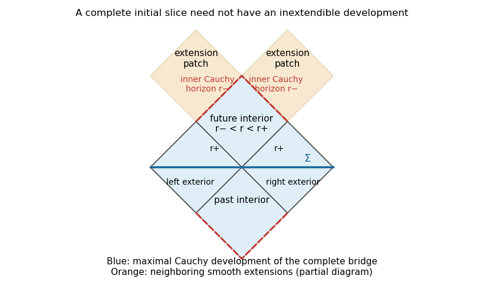

<h1 id="2/c/solution">Solution</h1>

↑ **Parent:** [C](../c.md)

Use the subextremal four-dimensional [Reissner-Nordstrom spacetime](../../../../../../reissner-nordstrom-spacetime.md), with $0<|Q|<M$. Its static radial function is

$$
f(r)=1-\frac{2M}{r}+\frac{Q^2}{r^2},\qquad r_\pm=M\pm\sqrt{M^2-Q^2}.
$$

Take the time-symmetric two-ended bridge through the outer [bifurcation surface](../../../../../../bifurcation-surface.md). Its [initial data](../../../../../../initial-data-in-general-relativity.md) have $K_{ij}=0$ and

$$
h=f^{-1}dr^2+r^2d\Omega^2
$$

on each $r\ge r_+$ end. The bridge is smooth: in proper radial distance $s$, $r-r_+=f'(r_+)s^2/4+O(s^4)$. Each asymptotically flat end is an infinite [Riemannian distance](../../../../../../riemannian-distance.md) away. Hence the spatial [Riemannian manifold](../../../../../../riemannian-manifold.md) is complete and admits no proper same-dimensional smooth [isometric extension](../../../../../../isometric-extension.md) as a connected spatial manifold.

Its [maximal Cauchy development](../../../../../../maximal-cauchy-development.md) includes the two exteriors and the adjacent future and past regions between $r_+$ and $r_-$. It ends at inner [Cauchy horizons](../../../../../../cauchy-horizon.md), not at a [curvature singularity](../../../../../../curvature-singularity.md). Since the simple root at $r_-$ is removable in horizon-penetrating coordinates and all curvature invariants are finite there, the exact solution extends across these [Cauchy horizons](../../../../../../cauchy-horizon.md). The extension is no longer globally determined by the given [initial data](../../../../../../initial-data-in-general-relativity.md).

**[Figure 3](#2/c/image-the-maximal-cauchy-development-of-a-complete-reissner-nordstrom-bridge-ends-at-extendible-inner-cauchy-horizons). The maximal Cauchy development of a complete Reissner-Nordstrom bridge ends at extendible inner Cauchy horizons**.

The shaded region is the [maximal Cauchy development](../../../../../../maximal-cauchy-development.md); dashed upper and lower null edges are inner [Cauchy horizons](../../../../../../cauchy-horizon.md). The displayed neighboring diamonds illustrate smooth continuation, rather than the entire infinite extension.

The [strong cosmic censorship conjecture](../../../../../../strong-cosmic-censorship-conjecture.md) concerns generic admissible [initial data](../../../../../../initial-data-in-general-relativity.md), in a specified extension regularity. Exact charged spherical data are exceptional. Perturbations can produce [mass inflation](../../../../../../mass-inflation.md) at the inner [Cauchy horizon](../../../../../../cauchy-horizon.md), obstructing suitably regular extensions; the precise conjecture depends on the matter model and whether extensions are required to be $C^0$, $C^2$, or another regularity. Thus this exact extendible example does not refute a generic [strong cosmic censorship conjecture](../../../../../../strong-cosmic-censorship-conjecture.md).

For an Einstein-Maxwell example the gravitational triple $(\Sigma,h,K)$ must be accompanied by electromagnetic [initial data](../../../../../../initial-data-in-general-relativity.md). One may take zero magnetic field and the smooth radial electric flux $Q/r^2$ through the bridge. The charges at the two ends have opposite signs when measured with outward normals. This is an example in the electrovacuum theory, not vacuum [initial data](../../../../../../initial-data-in-general-relativity.md).

## ↑ Ancestors (11)

1. [C](../c.md)
2. [2](../../2.md)
3. [Paper 311](../../../paper-311-split.md)
4. [Iii](../../../split.md)
5. [2016](../../../../split.md)
6. [Past exam of the mathematics course of the University of Cambridge](../../../../../split.md)
7. [Mathematics course of the University of Cambridge](../../../../../../mathematics-course-of-the-university-of-cambridge.md)
8. [Course of the University of Cambridge](../../../../../../course-of-the-university-of-cambridge.md)
9. [University of Cambridge](../../../../../../university-of-cambridge-split.md)
10. [List of universities](../../../../../../list-of-universities.md)
11. [Codex Wiki](../../../../../../split.md)
