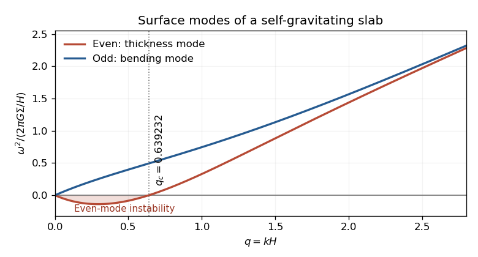

<h1 id="4/solution">Solution</h1>

↑ **Parent:** [4](../4.md)

For the [self-gravitating incompressible slab](../../../../../self-gravitating-incompressible-slab.md), let the fluid occupy $-H<z<H$, with [mass density](../../../../../density.md) $\rho_0=\Sigma/(2H)$ and a vacuum exterior. [Poisson equation](../../../../../poisson-equation.md) and [hydrostatic equilibrium](../../../../../hydrostatic-equilibrium.md) give

$$
\Phi_0'(z)=4\pi G\rho_0z,\qquad p_0(z)=2\pi G\rho_0^2(H^2-z^2),\qquad g_s=\Phi_0'(H)=2\pi G\Sigma.
$$

A constant ambient [pressure](../../../../../pressure.md) could be added without changing the result. Choose perturbations proportional to $e^{ikx-i\omega t}$, using rotational symmetry in the horizontal plane to put the wavevector along $x$.

For the [fluid displacement](../../../../../lagrangian-displacement-fluid-mechanics.md), the linearized [momentum](../../../../../momentum.md) equation inside the uniform slab is $-\omega^2\boldsymbol\xi=-\nabla(p'/\rho_0+\phi')$. For $\omega\ne0$ it follows that $\boldsymbol\xi=\nabla\chi$, with $p'/\rho_0+\phi'=\omega^2\chi$. [Incompressibility](../../../../../incompressible-flow.md) gives $\nabla\cdot\boldsymbol\xi=0$, hence

$$
\boxed{(\partial_z^2-k^2)\chi=0.}
$$

Neutral limits of these surface modes follow by continuity. Stationary [vorticity](../../../../../vorticity.md) perturbations form a separate zero-frequency sector; the nonzero-frequency surface modes are irrotational by the [momentum](../../../../../momentum.md) equation itself, without an extra irrotational-flow assumption.

The Eulerian [mass density](../../../../../density.md) perturbation vanishes in the bulk because the equilibrium [mass density](../../../../../density.md) is uniform and the displacement is divergence free. If the two vertical surface displacements are $\eta_+=\xi_z(H)$ and $\eta_-=\xi_z(-H)$, the [surface density perturbation of a displaced uniform interface](../../../../../surface-density-perturbation-of-a-displaced-uniform-interface.md) gives

$$
\rho'=\rho_0\eta_+\delta(z-H)-\rho_0\eta_-\delta(z+H).
$$

Thus [Poisson equation](../../../../../poisson-equation.md) reduces to [Laplace equation](../../../../../laplace-equation.md) for $\phi'$ inside and outside. The potential is continuous, while integrating through each surface gives

$$
[\partial_z\phi']_{H^-}^{H^+}=4\pi G\rho_0\eta_+,\qquad
[\partial_z\phi']_{-H^-}^{-H^+}=-4\pi G\rho_0\eta_-.
$$

The perturbing potential must decay at vertical infinity. The kinematic conditions are $\eta_\pm=\partial_z\chi(\pm H)$. The [free surface](../../../../../free-surface.md) [pressure](../../../../../pressure.md) condition is the vanishing [Lagrangian pressure perturbation](../../../../../lagrangian-pressure-perturbation.md), $p'+\eta_\pm p_0'=0$; at the top this gives $p'(H)/\rho_0=g_s\eta_+$.

Put $q=kH>0$. For **even scalar-potential symmetry**, choose

$$
\chi=A\cosh(kz),\qquad \phi'_{\rm in}=C\cosh(kz),\qquad
\phi'_{\rm out}=C\cosh q\,e^{-k(|z|-H)}.
$$

Then $\eta_-=-\eta_+$: this is a thickness-changing mode, not a vertical bending mode. Write $\eta=\eta_+$; the top derivative jump gives $-kC(\cosh q+\sinh q)=4\pi G\rho_0\eta$. Since $\cosh q+\sinh q=e^q$,

$$
\chi(H)=\frac\eta k\coth q,\qquad
\phi'(H)=-\frac{4\pi G\rho_0\eta}{k(1+\tanh q)}.
$$

Substitute these values into $\omega^2\chi(H)=g_s\eta+\phi'(H)$. Using $4\pi G\rho_0=g_s/H$ gives **the even-mode [dispersion relation](../../../../../dispersion-relation.md)** for the [surface modes of a self-gravitating incompressible slab](../../../../../surface-modes-of-a-self-gravitating-incompressible-slab.md):

$$
\boxed{\omega_e^2=\frac{2\pi G\Sigma}{H}\left[q\tanh q-\frac1{1+\coth q}\right].}
$$

The positive term comes from the restoring hydrostatic free-surface [pressure](../../../../../pressure.md) in the background gravitational field. The negative term is the attraction due to the perturbed gravitational potential of the displaced surfaces, which tends to reinforce the disturbance. Both effects ultimately involve the slab's gravity, but enter the boundary condition through different terms.

For **odd scalar-potential symmetry**, instead take

$$
\chi=A\sinh(kz),\qquad \phi'_{\rm in}=C\sinh(kz),\qquad
\phi'_{\rm out}=C\sinh q\,\operatorname{sgn}(z)e^{-k(|z|-H)}.
$$

Now $\eta_- =\eta_+$, so the surfaces bend in the same direction. The jump again gives $C=-4\pi G\rho_0\eta/(ke^q)$, but $\chi(H)=\eta\tanh q/k$ and $\phi'(H)=-4\pi G\rho_0\eta/[k(1+\coth q)]$. The same [pressure](../../../../../pressure.md) condition yields

$$
\boxed{\omega_o^2=\frac{2\pi G\Sigma}{H}\left[q\coth q-\frac1{1+\tanh q}\right].}
$$

The bottom kinematic, jump and [pressure](../../../../../pressure.md) conditions follow with the indicated parity and give the same [dispersion relation](../../../../../dispersion-relation.md), so no boundary condition has been discarded.

To determine the [gravitational instability of an incompressible slab](../../../../../gravitational-instability-of-an-incompressible-slab.md), factor the two dimensionless expressions as

$$
F_e(q)=\tanh q\left[q-\frac{1+e^{-2q}}2\right],\qquad
F_o(q)=\coth q\left[q-\frac{1-e^{-2q}}2\right].
$$

For the even mode the bracket is strictly increasing, with derivative $1+e^{-2q}>0$, is negative at zero and tends to positive infinity. It therefore has a unique positive zero

$$
\boxed{q_c=\frac{1+e^{-2q_c}}2\simeq0.6392322714.}
$$

**The even mode is unstable for $0<kH<q_c$, neutral at $q_c$, and oscillatory for $kH>q_c$.** Negative $\omega_e^2$ gives a growing mode with $\omega=i\sqrt{-\omega_e^2}$ under the stated time convention. For the odd mode, $1-e^{-2q}<2q$ for every $q>0$, so the bracket is always positive: **all odd modes with positive wavenumber are stable**.

**[Figure 1](#4/image-even-and-odd-surface-mode-dispersion-relations-of-a-self-gravitating-incompressible-slab-with-the-even-mode-instability-threshold). Even and odd surface-mode dispersion relations of a self-gravitating incompressible slab, with the even-mode instability threshold**.

At long wavelengths $F_e=-q+2q^2+O(q^3)$ and $F_o=q-2q^2/3+O(q^3)$: a thickness or column-density disturbance has a gravitational instability, whereas a bending disturbance is restored. At short wavelengths both approach $q-1/2$, so both surface branches are stable. **The slab equilibrium is therefore linearly unstable overall**, because it admits the long-wavelength even modes despite the stability of its odd sector.

## ↑ Ancestors (10)

1. [4](../4.md)
2. [Paper 314](../../paper-314-split.md)
3. [Iii](../../split.md)
4. [2016](../../../split.md)
5. [Past exam of the mathematics course of the University of Cambridge](../../../../split.md)
6. [Mathematics course of the University of Cambridge](../../../../../mathematics-course-of-the-university-of-cambridge.md)
7. [Course of the University of Cambridge](../../../../../course-of-the-university-of-cambridge.md)
8. [University of Cambridge](../../../../../university-of-cambridge-split.md)
9. [List of universities](../../../../../list-of-universities.md)
10. [Codex Wiki](../../../../../split.md)
