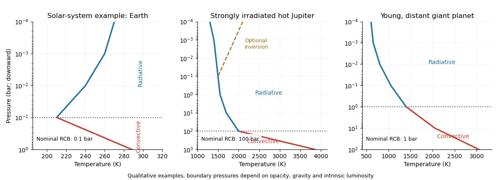

# Paper 315

↑ **Parent:** [Iii](../iii.md)

[https://www.maths.cam.ac.uk/postgrad/part-iii/files/pastpapers/2016/paper_315.pdf](https://www.maths.cam.ac.uk/postgrad/part-iii/files/pastpapers/2016/paper_315.pdf)

**Table of contents**

- [1](#1)
  - [a](#1/a)
    - [Solution](#1/a/solution)
  - [b](#1/b)
    - [Solution](#1/b/solution)
  - [c](#1/c)
    - [Solution](#1/c/solution)
- [2](#2)
  - [a](#2/a)
    - [Solution](#2/a/solution)
  - [b](#2/b)
    - [Solution](#2/b/solution)
  - [c](#2/c)
    - [Solution](#2/c/solution)
- [3](#3)
  - [a](#3/a)
    - [Solution](#3/a/solution)
  - [b](#3/b)
    - [Solution](#3/b/solution)
  - [c](#3/c)
    - [Solution](#3/c/solution)
  - [d](#3/d)
    - [Solution](#3/d/solution)
- [4](#4)
  - [a](#4/a)
    - [Solution](#4/a/solution)
  - [b](#4/b)
    - [Solution](#4/b/solution)
  - [c](#4/c)
    - [Solution](#4/c/solution)
  - [d](#4/d)
    - [Solution](#4/d/solution)
  - [e](#4/e)
    - [Solution](#4/e/solution)
  - [f](#4/f)
    - [Solution](#4/f/solution)
  - [g](#4/g)
    - [Solution](#4/g/solution)
  - [h](#4/h)
    - [Solution](#4/h/solution)
  - [i](#4/i)
    - [Solution](#4/i/solution)
  - [j](#4/j)
    - [Solution](#4/j/solution)

## 1

↑ **Parent:** [Paper 315](paper-315.md)

<h3 id="1/a">a</h3>

↑ **Parent:** [1](#1)

<h4 id="1/a/solution">Solution</h4>

↑ **Parent:** [A](#1/a)

Assume $R_p/R_\star=0.10$, $T_\star=5800\,\mathrm K$, uniform disk-averaged thermal emission, a nearly [blackbody](../../../astrophysics.md#blackbody) stellar continuum, negligible reflected light at $20\,\mu\mathrm m$, and a flat response over the narrow band. If the eclipse depth is normalized to the out-of-eclipse star-plus-planet flux, the planet/star flux ratio is $r=0.005/(1-0.005)=0.005025$; using $r=0.005$ changes the estimate by less than one percent. The [exoplanet secondary eclipse](../../../exoplanet.md#exoplanet-secondary-eclipse) then gives

$$
r\simeq\left(\frac{R_p}{R_\star}\right)^2\frac{B_\lambda(T_1)}{B_\lambda(T_\star)},\qquad
T_1=\frac{hc/(\lambda k_B)}{\ln\left[1+\frac{(R_p/R_\star)^2}{r}\left(e^{hc/(\lambda k_BT_\star)}-1\right)\right]}.
$$

Using the [Planck law](../../../statistical-physics.md#planck-s-law) at $\lambda=20\,\mu\mathrm m$ gives **$T_1\simeq3.1\times10^3\,\mathrm K$**, or about $3000\,\mathrm K$ at the precision justified by the radius assumption. The [Rayleigh-Jeans law](../../../astrophysics.md#rayleigh-jeans-law) instead gives $T_1\simeq0.5T_\star\simeq2900\,\mathrm K$, a useful rough check. This is a [brightness temperature](../../../exoplanet.md#brightness-temperature), not the bolometric [planetary equilibrium temperature](../../../exoplanet.md#planetary-equilibrium-temperature). With zero [Bond albedo](../../../exoplanet.md#bond-albedo) and global redistribution, the latter would be only about $1250\,\mathrm K$ at $0.05\,\mathrm{AU}$; a thermal window can sample hotter, deeper gas.

A continuum photon normally emerges from an [optical depth](../../../astrophysics.md#optical-depth) of order unity. In [hydrostatic equilibrium](../../../statistical-physics.md#hydrostatic-equilibrium),

$$
\tau_\lambda(P)=\int_0^P\frac{\kappa_\lambda(P',T)}{g}\,dP'.
$$

The [emission-pressure degeneracy of a brightness temperature](../../../exoplanet.md#emission-pressure-degeneracy-of-a-brightness-temperature) means that pressure cannot be uniquely recovered from the measured [brightness temperature](../../../exoplanet.md#brightness-temperature) without $g$ and an [opacity](../../../stellar-structure.md#opacity) model. For an explicit nominal estimate, take $g=20\,\mathrm{m\,s^{-2}}$ and an effective continuum [mass absorption coefficient](../../../astrophysics.md#mass-absorption-coefficient) $\kappa_{20}=2\times10^{-4}\,\mathrm{m^2\,kg^{-1}}$. Then $P_{\tau\sim1}\sim g/\kappa_{20}=10^5\,\mathrm{Pa}$, or **approximately one bar**. In a hydrogen-rich atmosphere, [collision-induced absorption](../../../astrophysics.md#collision-induced-absorption-and-emission) by transient $\mathrm H_2$ pairs supplies continuum [opacity](../../../stellar-structure.md#opacity) even without ordinary molecular lines; its density dependence makes the constant-opacity calculation an illustrative estimate. With a normal deep [atmospheric pressure-temperature profile](../../../exoplanet.md#atmospheric-pressure-temperature-profile), temperature increases at larger pressures, eventually following an interior [adiabatic temperature gradient](../../../exoplanet.md#adiabatic-temperature-gradient).

Two mechanisms for $T_1\ne T_2$ are **wavelength-dependent sampling of a vertically varying temperature, and wavelength-dependent weighting of a horizontally nonuniform dayside**. In the first, [carbon monoxide](../../../chemistry.md#carbon-monoxide)-rich [opacity](../../../stellar-structure.md#opacity) near $4.5\,\mu\mathrm m$ can sample cooler gas around $0.1$ bar while the $20\,\mu\mathrm m$ continuum samples hotter gas around one bar. In the second, hot and cool areas contribute different proportions of the total flux in different bands because the [Planck function](../../../astrophysics.md#planck-function) depends nonlinearly on temperature. The vertical mechanism alone produces the illustrated pair of temperatures; a single isothermal, horizontally uniform [blackbody](../../../astrophysics.md#blackbody) would have the same [brightness temperature](../../../exoplanet.md#brightness-temperature) in both bands.

**[Figure 1](#1/a/image-illustrative-pressure-temperature-profile-with-different-infrared-brightness-temperature-contribution-depths). Illustrative pressure-temperature profile with different infrared brightness-temperature contribution depths**.

If the J-band observation is thermal emission, its low-opacity window normally samples at least as deeply as the continuum at $20\,\mu\mathrm m$. On the illustrated non-inverted profile, **$T_3\gtrsim T_1>T_2$**. The ordering is conditional: molecular-line absence alone does not specify the relative continuum [opacities](../../../stellar-structure.md#opacity), and an inversion or reflected-light contamination can change the inference. The [exoplanet emission spectrum](../../../exoplanet.md#exoplanet-emission-spectrum) measures weighted contribution regions rather than three exact thermometers at known pressures.

<h3 id="1/b">b</h3>

↑ **Parent:** [1](#1)

<h4 id="1/b/solution">Solution</h4>

↑ **Parent:** [B](#1/b)

The pressure axis increases downward in the sketches. Solid red segments indicate efficient [convection](../../../fluid-mechanics.md#convection); blue segments indicate mainly [radiative transfer](../../../astrophysics.md#radiative-transfer). The boundaries are nominal examples, since [radiative-convective boundary](../../../exoplanet.md#radiative-convective-boundary) pressure depends on [opacity](../../../stellar-structure.md#opacity), gravity and intrinsic flux.

**[Figure 2](#1/b/image-qualitative-solar-system-irradiated-hot-jupiter-and-isolated-young-giant-temperature-profiles-with-radiative-convective-boundaries). Qualitative solar-system, irradiated hot-Jupiter and isolated young-giant temperature profiles with radiative-convective boundaries**.

For Earth, the convective [troposphere](../../../planetary-science.md#troposphere) lies beneath a radiative [stratosphere](../../../planetary-science.md#stratosphere), with the transition near $0.1$--$0.2$ bar. The larger solar-system planets likewise have deep convective regions beneath largely radiative upper atmospheres; their tropopause/upper [radiative-convective boundary](../../../exoplanet.md#radiative-convective-boundary) is commonly of order $0.1$--$1$ bar. Their temperatures differ greatly from Earth's, and detached radiative layers can occur deeper down.

For an irradiated [hot Jupiter](../../../exoplanet.md#hot-jupiter), absorbed stellar flux maintains a hot, extended, relatively shallow-gradient radiative atmosphere. In models with a weak old-planet intrinsic flux, the deep [radiative-convective boundary](../../../exoplanet.md#radiative-convective-boundary) can lie around $10^2$--$10^3$ bar, with a useful wider model-dependent range of tens to thousands of bars. A [thermal inversion](../../../exoplanet.md#inversion-meteorology) can appear at low pressures if visible/UV absorption heats the upper atmosphere. Below the deep boundary the profile joins a convective adiabat.

A young, [directly imaged exoplanet](../../../exoplanet.md#exoplanet-direct-imaging) on a distant orbit is primarily heated from within. Its [photosphere](../../../stellar-structure.md#photosphere) commonly joins the convective interior at order $0.1$--$10$ bar, illustrated here at one bar. The temperature generally rises monotonically with pressure over the infrared-forming layers. Strong stellar heating is absent, so a broad stellar-heated isothermal layer is unnecessary.

Two differences in [thermal inversions](../../../exoplanet.md#inversion-meteorology) are their **absorbers and their formation conditions**. Earth's [ozone layer](../../../exoplanet.md#ozone-layer) and solar-system hydrocarbon absorption can heat upper layers; the proposed hot-Jupiter absorbers include refractory [titanium monoxide](../../../chemistry.md#titanium-monoxide)/[vanadium monoxide](../../../chemistry.md#vanadium-ii-oxide) or other strong visible absorbers, since ozone and [methane](../../../chemistry.md#methane)-rich cold-planet chemistry are unsuitable at very high temperatures. Hot-Jupiter inversions depend strongly on irradiation, [atmospheric cold traps](../../../exoplanet.md#atmospheric-cold-trap) and atmospheric transport, and can occur at mbar-to-sub-bar pressures; Earth and the solar-system giants have cooler, established [stratospheres](../../../planetary-science.md#stratosphere) above their shallow tropospheres.

Two differences between the [hot Jupiter](../../../exoplanet.md#hot-jupiter) and distant young-giant profiles are **external versus internal heating, and the depth/shape of the radiative zone**. The former can have a broad warm radiative layer, a much deeper convective boundary and sometimes an inversion; the latter typically has a steeper outward decrease toward a [photosphere](../../../stellar-structure.md#photosphere), a shallower boundary and no irradiation-driven inversion. These are class trends, not a unique temperature profile for every planet.

<h3 id="1/c">c</h3>

↑ **Parent:** [1](#1)

<h4 id="1/c/solution">Solution</h4>

↑ **Parent:** [C](#1/c)

The three basic modes are **radiation, [convection](../../../fluid-mechanics.md#convection) and [thermal conduction](../../../thermodynamics.md#thermal-conduction)**. [Radiative transfer](../../../astrophysics.md#radiative-transfer) dominates transparent atmospheric layers; [convection](../../../fluid-mechanics.md#convection) carries heat through sufficiently unstable fluid regions; [thermal conduction](../../../thermodynamics.md#thermal-conduction) matters especially in solids or highly conducting dense material.

Consider a chemically homogeneous [ideal gas](../../../thermodynamics.md#ideal-gas) atmosphere and a small, dry parcel displacement, with rapid pressure equilibration and negligible heat exchange during the displacement. The parcel's [first law of thermodynamics](../../../thermodynamics.md#first-law-of-thermodynamics) per unit mass is

$$
T\,ds=C_p\,dT-\frac{dP}{\rho}.
$$

For an [adiabatic process](../../../thermodynamics.md#adiabatic-process), $ds=0$. Using [hydrostatic equilibrium](../../../statistical-physics.md#hydrostatic-equilibrium), $dP/dz=-\rho g$, the parcel follows

$$
\left(\frac{dT}{dz}\right)_{\rm ad}=-\frac{g}{C_p}.
$$

After an upward displacement $\delta z>0$, its temperature relative to its new surroundings is

$$
T_{\rm parcel}-T_{\rm env}=\left(-\frac{g}{C_p}-\frac{dT}{dz}\right)\delta z.
$$

Here $C_p$ is the [specific heat capacity at constant pressure](../../../thermodynamics.md#specific-heat-capacity-at-constant-pressure), and $N$ is the [buoyancy frequency](../../../gravity-wave.md#buoyancy-frequency). At the same pressure, a warmer parcel has lower density and accelerates upward. Thus **strict instability requires $dT/dz<-g/C_p$**. Equivalently, the parcel equation is $\ddot{\delta z}=-N^2\delta z$, with

$$
\boxed{N^2=\frac{g}{T}\left(\frac{dT}{dz}+\frac{g}{C_p}\right).}
$$

Negative $N^2$ gives growing displacements. The printed non-strict inequality includes the onset boundary: **equality is neutrally stable, not a strictly growing instability**. This [dry parcel buoyancy in a homogeneous atmosphere](../../../gravity-wave.md#dry-parcel-buoyancy-in-a-homogeneous-atmosphere) is the dry [Schwarzschild criterion](../../../stellar-structure.md#schwarzschild-criterion); condensation and composition gradients require modified criteria.

## 2

↑ **Parent:** [Paper 315](paper-315.md)

<h3 id="2/a">a</h3>

↑ **Parent:** [2](#2)

<h4 id="2/a/solution">Solution</h4>

↑ **Parent:** [A](#2/a)

For a representative hydrogen-rich [hot Jupiter](../../../exoplanet.md#hot-jupiter), increasing altitude lowers pressure, slows collision-driven chemistry, and increases exposure to stellar UV. Three principal regimes follow.

At high pressures, illustratively $P\gtrsim1$--$10$ bar, collisions and sufficiently high temperature make [thermochemical equilibrium](../../../thermodynamics.md#thermochemical-equilibrium) a useful approximation. Molecular abundances minimize the free energy subject to elemental conservation. Condensation and [atmospheric condensate rainout](../../../exoplanet.md#atmospheric-condensate-rainout) can remove selected elements from the gas.

At intermediate pressures, illustratively $10^{-3}\lesssim P\lesssim1$ bar, vertical mixing and horizontal winds can outrun [chemical relaxation time](../../../thermodynamics.md#chemical-relaxation-time). The [chemical quench level](../../../exoplanet.md#chemical-quench-level) is defined by $\tau_{\rm chem}\sim\tau_{\rm mix}$; above it, some abundances retain values from a deeper or hotter region. [Horizontal chemical quenching](../../../exoplanet.md#horizontal-chemical-quenching) similarly occurs when chemical adjustment is slower than advection between the day and night hemispheres.

At low pressures, illustratively $P\lesssim10^{-3}$ bar, [atmospheric photochemistry](../../../exoplanet.md#atmospheric-photochemistry) becomes important: photodissociation and radical reactions change equilibrium abundances and can produce hydrocarbons and [atmospheric hazes](../../../exoplanet.md#haze). At still lower pressures, roughly $10^{-6}$ bar and above in altitude, photoionization and an escaping [thermosphere](../../../planetary-science.md#thermosphere) can become important.

**[Figure 3](#2/a/image-nominal-deep-equilibrium-transport-quenching-and-photochemical-regimes-in-a-hydrogen-rich-irradiated-atmosphere). Nominal deep-equilibrium, transport-quenching and photochemical regimes in a hydrogen-rich irradiated atmosphere**.

These pressures label a representative sketch, not universal interfaces. UV optical depth, stellar spectrum, gravity, metallicity, reaction rates and [eddy diffusivity](../../../turbulence.md#eddy-diffusivity) determine the transitions; quenching is species-dependent.

<h3 id="2/b">b</h3>

↑ **Parent:** [2](#2)

<h4 id="2/b/solution">Solution</h4>

↑ **Parent:** [B](#2/b)

Assume a hydrogen-rich gas with approximately solar elemental ratios and local [thermochemical equilibrium](../../../thermodynamics.md#thermochemical-equilibrium) when identifying the limiting compositions. At $T\lesssim500\,\mathrm K$, a representative set of dominant molecules is **$\mathrm H_2,\mathrm H_2O,\mathrm{CH}_4,\mathrm{NH}_3$**. In the deeper $T\gtrsim1300\,\mathrm K$ regime, it is **$\mathrm H_2,\mathrm H_2O,\mathrm{CO},\mathrm N_2$**. [Helium](../../../chemistry.md#helium) is an abundant atom, not a molecule. The carbon and nitrogen switches, [carbon monoxide–methane quenching](../../../exoplanet.md#carbon-monoxide-methane-quenching) and [nitrogen–ammonia quenching](../../../exoplanet.md#nitrogen-ammonia-quenching) when frozen by mixing, are represented by

$$
\mathrm{CO}+3\mathrm H_2\rightleftharpoons\mathrm{CH}_4+\mathrm H_2O,\qquad
\mathrm N_2+3\mathrm H_2\rightleftharpoons2\mathrm{NH}_3.
$$

Low temperature and high pressure favor the right-hand sides, while hotter gas favors [carbon monoxide](../../../chemistry.md#carbon-monoxide) and $\mathrm N_2$. Exact boundaries depend on pressure and composition; $\mathrm{CO}_2$ can become important at high metallicity. If mixing is strong, the cool upper atmosphere need not retain its local-equilibrium four-species ordering.

To preserve the hot-region reactant $A_1$ aloft, require transport to beat its conversion at the quench region. With a mixing length $\ell$ and vertical [eddy diffusivity](../../../turbulence.md#eddy-diffusivity) $K_{zz}$,

$$
\tau_{\rm mix}\sim\frac{\ell^2}{K_{zz}}\lesssim10^5\,\mathrm s,\qquad
\boxed{K_{zz}\gtrsim\ell^2/(10^5\,\mathrm s).}
$$

For the simplest use of the supplied [atmospheric scale height](../../../exoplanet.md#atmospheric-scale-height) reference, assume the same temperature and [mean molecular weight](../../../thermodynamics.md#mean-molecular-weight) as the reference atmosphere and take $\ell=H$. Since $H\propto1/g$, $H\simeq30/0.4=75\,\mathrm{km}$, giving **$K_{zz}\gtrsim5.6\times10^4\,\mathrm{m^2\,s^{-1}}=5.6\times10^8\,\mathrm{cm^2\,s^{-1}}$**.

The hotter quench layer requires a temperature correction if the reference is ordinary Jupiter; the temperature of that scale-height reference was not specified. An explicit estimate using $T_q=1300\,\mathrm K$, dimensionless [mean molecular weight](../../../thermodynamics.md#mean-molecular-weight) $\mu=2.3$, and $g\simeq0.4\times25=10\,\mathrm{m\,s^{-2}}$ gives

$$
H=\frac{k_BT_q}{\mu m_Hg}\simeq4.7\times10^5\,\mathrm m,
\qquad K_{zz}\gtrsim2.2\times10^6\,\mathrm{m^2\,s^{-1}}
=2.2\times10^{10}\,\mathrm{cm^2\,s^{-1}}.
$$

Thus **a scale-height-based estimate using the hot layer is of order $10^{10}\,\mathrm{cm^2\,s^{-1}}$**. Both estimates state their assumptions: the reference scaling alone does not include the temperature ratio. Choosing $\ell=0.1H$ lowers the threshold by a factor of $100$, and a full quench calculation needs the reaction timescale along the profile. The [dependence of a quench diffusivity on mixing length](../../../exoplanet.md#dependence-of-a-quench-diffusivity-on-mixing-length) shows why the stated reaction timescale supplies a mixing constraint, not a unique measured coefficient.

<h3 id="2/c">c</h3>

↑ **Parent:** [2](#2)

<h4 id="2/c/solution">Solution</h4>

↑ **Parent:** [C](#2/c)

The inferred dayside [water](../../../chemistry.md#water) mixing ratio is about $500$ times below the solar-equilibrium reference. Several explanations are possible. A high [atmospheric carbon-to-oxygen ratio](../../../exoplanet.md#atmospheric-carbon-to-oxygen-ratio), especially near or above unity in hot [carbon monoxide](../../../chemistry.md#carbon-monoxide)-dominated gas, locks much of the oxygen in CO and leaves little [water](../../../chemistry.md#water). A genuinely oxygen-poor or low-metallicity envelope also reduces [water](../../../chemistry.md#water), although bulk elemental abundances must apply to both hemispheres. [Atmospheric photochemistry](../../../exoplanet.md#atmospheric-photochemistry) can destroy [water](../../../chemistry.md#water) at low pressures. In portions of the dayside that are substantially hotter than the stated minimum, [thermal dissociation](../../../chemistry.md#thermal-dissociation) can also reduce [water](../../../chemistry.md#water), especially at low pressure; **$1800\,\mathrm K$ alone does not establish strong dissociation throughout the emitting region**. Temperature/[opacity](../../../stellar-structure.md#opacity) degeneracies or incomplete treatment of [exoplanet clouds](../../../exoplanet.md#exoplanet-cloud) and horizontal structure in an [atmospheric retrieval](../../../exoplanet.md#atmospheric-retrieval) can bias the inferred abundance.

At the cooler terminator, $10^{-4}$ is only a factor of five below the reference. **Moderately reduced oxygen abundance, an enhanced C/O ratio, and [exoplanet cloud](../../../exoplanet.md#exoplanet-cloud)/[atmospheric haze](../../../exoplanet.md#haze) dilution of spectral features** are plausible explanations. [Water](../../../chemistry.md#water) is comparatively stable at $1000\,\mathrm K$, so strong [thermal dissociation](../../../chemistry.md#thermal-dissociation) is not the natural explanation there. A [exoplanet transmission spectrum](../../../exoplanet.md#exoplanet-transmission-spectrum) samples a slant path through the limb, and the degeneracy among [exoplanet cloud](../../../exoplanet.md#exoplanet-cloud) height, reference pressure and gas abundance can mimic a lower mixing ratio.

The two measurements need not describe the same pressure range or longitude. **Local dissociation/photochemistry on the hotter dayside and reformation on the cooler limb can produce a real spatial difference**. Even at one elemental C/O ratio, hot [carbon monoxide](../../../chemistry.md#carbon-monoxide)-rich chemistry can leave less oxygen for [water](../../../chemistry.md#water) than cooler [methane](../../../chemistry.md#methane)-rich chemistry, an example of [carbon partition and atmospheric water abundance](../../../exoplanet.md#carbon-partition-and-atmospheric-water-abundance). Transport can modify or homogenize those tendencies, depending on the reaction and advection timescales. Alternatively, inconsistent assumptions in the emission and transmission retrievals can create an apparent discrepancy. A reconciliation should use one bulk elemental inventory, separate dayside/limb temperature profiles and contribution pressures, and consistent [exoplanet cloud](../../../exoplanet.md#exoplanet-cloud) and transport physics; it should not assign independent planetary metallicities to the two hemispheres.

## 3

↑ **Parent:** [Paper 315](paper-315.md)

<h3 id="3/a">a</h3>

↑ **Parent:** [3](#3)

<h4 id="3/a/solution">Solution</h4>

↑ **Parent:** [A](#3/a)

The two relevant categories are **strongly irradiated, often transiting [hot Jupiters](../../../exoplanet.md#hot-jupiter), and young [directly imaged exoplanets](../../../exoplanet.md#exoplanet-direct-imaging) with large residual-entropy radii**. The young objects are inflated relative to an old cold mass-radius sequence; a large young radius is not automatically anomalous relative to an age-appropriate formation model.

For a transit, the depth gives $(R_p/R_\star)^2$ after geometric and [limb darkening](../../../astrophysics.md#limb-darkening) corrections; an independently estimated stellar radius sets $R_p$. A measured planet mass then tests its location on the [planetary mass-radius relation](../../../exoplanet.md#planetary-mass-radius-relation). For a directly imaged object, distance and integrated spectral flux give luminosity; a fitted [effective temperature](../../../stellar-structure.md#effective-temperature) supplies

$$
\boxed{R_p=\left(\frac{L}{4\pi\sigma_{\rm SB}T_{\rm eff}^4}\right)^{1/2}.}
$$

The imaged radius is model-dependent because temperature, gravity and [exoplanet clouds](../../../exoplanet.md#exoplanet-cloud) are inferred from its spectrum; its mass may also depend on age and evolutionary models unless dynamically measured.

Two broad explanatory classes are **slower loss of existing heat and addition of heat to the deep interior**. Specific delayed-cooling proposals are enhanced atmospheric [opacity](../../../stellar-structure.md#opacity), which restricts radiative loss, and composition gradients producing [layered convection in a giant planet](../../../exoplanet.md#layered-convection-in-a-giant-planet). Specific heating proposals are [tidal heating](../../../planetary-science.md#tidal-heating) and [Ohmic heating](../../../electromagnetism.md#joule-heating) from currents induced by magnetized atmospheric winds, the proposed [Ohmic heating of a giant planet](../../../exoplanet.md#ohmic-heating-of-a-giant-planet). Heating must reach or influence sufficiently deep layers to maintain the interior [specific entropy](../../../thermodynamics.md#specific-entropy); merely heating the optically thin upper atmosphere is not equivalent. For young distant objects, retention of formation heat, described by [hot and cold starts of a giant planet](../../../planetary-science.md#hot-and-cold-starts-of-a-giant-planet), itself explains much of the large radius without requiring the hot-Jupiter heating mechanisms.

<h3 id="3/b">b</h3>

↑ **Parent:** [3](#3)

<h4 id="3/b/solution">Solution</h4>

↑ **Parent:** [B](#3/b)

For an old, approximately solar-composition H/He object with no strong irradiation or ongoing heat input, the cold [mass-radius relation](../../../exoplanet.md#mass-radius-relation) reaches a broad maximum of **order one Jupiter radius, nominally about $1$--$1.2R_J$, at a few Jupiter masses**. This is a property of that composition and low-entropy sequence, not a composition-independent theorem from [hydrostatic equilibrium](../../../statistical-physics.md#hydrostatic-equilibrium) alone. Young isolated substellar objects can be larger while cooling; strict thermal steady state of a non-burning isolated body would require its internal luminosity to vanish.

**[Figure 4](#3/b/image-schematic-mass-radius-sequence-from-ice-giants-to-low-mass-stars-with-composition-and-degeneracy-slope-guides). Schematic mass-radius sequence from ice giants to low-mass stars with composition and degeneracy slope guides**.

At low mass, an incompressible fixed-composition approximation gives $M\simeq4\pi\bar\rho R^3/3$, so **$R\propto M^{1/3}$**. Ice giants contain dense heavy material and modest H/He envelopes, so real radii depend strongly on composition and are not obtained by extending a pure-hydrogen curve through them.

Gas giants approach a regime in which Coulomb interactions, compression and partial [electron degeneracy pressure](../../../statistical-physics.md#electron-degeneracy-pressure) compete. An approximate index-one [stellar polytrope](../../../stellar-structure.md#stellar-polytrope), $P=K\rho^2$, gives **$R\propto M^0$** at fixed $K$, explaining the broad Jupiter-sized plateau. In the nonrelativistic degenerate limit, $P=K\rho^{5/3}$ is an index-$3/2$ [stellar polytrope](../../../stellar-structure.md#stellar-polytrope), giving **$R\propto M^{-1/3}$** at fixed composition. This is a limiting slope; finite-temperature [brown dwarfs](../../../stellar-astrophysics.md#brown-dwarf) do not follow that exact power law over their entire observed mass range.

The general [polytropic mass-radius relation](../../../stellar-structure.md#polytropic-mass-radius-relation) displays both limits:

$$
R\propto K^{n/(3-n)}M^{(1-n)/(3-n)}.
$$

At roughly $13M_J$, deuterium burning becomes possible, with a composition-dependent threshold. This is a conventional planet/brown-dwarf division rather than a unique formation definition. At roughly $0.075$--$0.08M_\odot$, about $75$--$85M_J$, sustained hydrogen burning can support a low-mass star. Its nuclear energy supply maintains a [specific entropy](../../../thermodynamics.md#specific-entropy) that prevents indefinite cooling onto the cold substellar sequence; its approximate main-sequence relation is $R\propto M$ over a limited low-mass interval.

Ice giants chiefly lose formation heat and some gravitational/radiogenic energy, with [convection](../../../fluid-mechanics.md#convection) in fluid regions and [thermal conduction](../../../thermodynamics.md#thermal-conduction) or inhibited [convection](../../../fluid-mechanics.md#convection) where composition stratifies the interior. Gas giants and non-burning [brown dwarfs](../../../stellar-astrophysics.md#brown-dwarf) radiate stored heat and contraction energy; their deep interiors are largely convective, with radiative [photospheres](../../../stellar-structure.md#photosphere). [Helium](../../../chemistry.md#helium) separation can supply extra gravitational energy in mature giant planets, while [brown dwarfs](../../../stellar-astrophysics.md#brown-dwarf) above the deuterium threshold have a temporary nuclear contribution. Low-mass stars are powered primarily by hydrogen fusion and are largely or fully convective at the lowest stellar masses. The transition to sustained fusion is the essential change from a cooling body to a long-lived thermal balance.

<h3 id="3/c">c</h3>

↑ **Parent:** [3](#3)

<h4 id="3/c/solution">Solution</h4>

↑ **Parent:** [C](#3/c)

The spherical [stellar structure equations](../../../stellar-structure.md#stellar-structure-equations) apply to a planet as well, with its appropriate [equation of state](../../../thermodynamics.md#equation-of-state):

$$
\frac{dm}{dr}=4\pi r^2\rho,\qquad
\frac{dP}{dr}=-\frac{Gm\rho}{r^2},\qquad
\frac{\partial L}{\partial m}=\epsilon_{\rm nuc}-T\frac{\partial s}{\partial t}.
$$

The last equation is the local first law, including gravitational contraction through the [specific entropy](../../../thermodynamics.md#specific-entropy) change. For an isolated non-burning planet, $\epsilon_{\rm nuc}\simeq0$, so

$$
\boxed{L_{\rm int}=-\int_0^M T\frac{\partial s}{\partial t}\,dm.}
$$

If the convective interior has nearly uniform [specific entropy](../../../thermodynamics.md#specific-entropy) $s(t)$, positive outgoing luminosity gives $\dot s=-L_{\rm int}/\int T\,dm<0$. This [entropy loss of an isolated convective planet](../../../stellar-astrophysics.md#entropy-loss-of-an-isolated-convective-planet) describes its secular cooling.

During assembly, the gravitational energy scale $GM^2/R$ provides a source of heat. Integrating [hydrostatic equilibrium](../../../statistical-physics.md#hydrostatic-equilibrium) gives the [virial theorem](../../../classical-mechanics.md#virial-theorem), $\Omega+3\int P\,dV=0$, neglecting the surface-pressure term. For a monatomic [ideal gas](../../../thermodynamics.md#ideal-gas) this becomes $2U+\Omega=0$, hence $E=U+\Omega=\Omega/2$. Contraction makes $\Omega$ more negative, releases radiation, and heats part of the gas. A characteristic formation temperature has scale $k_BT\sim\mu m_HGM/R$ up to structure factors. The retained fraction depends on the accretion shock, producing [hot and cold starts of a giant planet](../../../planetary-science.md#hot-and-cold-starts-of-a-giant-planet).

**Formation releases heat, and an isolated planet subsequently loses [specific entropy](../../../thermodynamics.md#specific-entropy) and intrinsic luminosity as it approaches a cooler, more degenerate state.** The structure equations alone do not fix one initial temperature, and the early contraction of an [ideal gas](../../../thermodynamics.md#ideal-gas) can increase its central temperature while its total energy decreases. “Cools” therefore need not mean that every depth becomes colder at every instant. Once degeneracy limits contraction, the thermal reservoir declines more directly; the emergent [effective temperature](../../../stellar-structure.md#effective-temperature) usually falls along a fixed-mass cooling track.

This makes young giant planets attractive for [exoplanet direct imaging](../../../exoplanet.md#exoplanet-direct-imaging): their thermal near/mid-infrared emission can be far brighter than that of old planets of the same mass. Imaging and spectroscopy measure projected separation, astrometry, luminosity, an [exoplanet emission spectrum](../../../exoplanet.md#exoplanet-emission-spectrum), temperatures and atmospheric molecular and [exoplanet cloud](../../../exoplanet.md#exoplanet-cloud) signatures. Radius follows from luminosity and fitted temperature; mass and initial [specific entropy](../../../thermodynamics.md#specific-entropy) generally require age/evolutionary information, or an independent dynamical mass measurement. A detected luminosity alone is not a model-independent planet mass.

<h3 id="3/d">d</h3>

↑ **Parent:** [3](#3)

<h4 id="3/d/solution">Solution</h4>

↑ **Parent:** [D](#3/d)

The stellar luminosity is $L_\star=4\pi R_\star^2\sigma_{\rm SB}T_\star^4$. At separation $a$, the planet intercepts a disk of area $\pi R_p^2$. For [Bond albedo](../../../exoplanet.md#bond-albedo) $A_B$ and uniform emission over its full surface, energy balance gives

$$
(1-A_B)\frac{L_\star}{4\pi a^2}\pi R_p^2=4\pi R_p^2\sigma_{\rm SB}T_e^4,
\qquad
\boxed{T_e=T_\star\left(\frac{R_\star}{2a}\right)^{1/2}(1-A_B)^{1/4}.}
$$

This [planetary equilibrium temperature](../../../exoplanet.md#planetary-equilibrium-temperature) neglects intrinsic heat. Dayside-only or nonuniform emission changes the redistribution factor.

For the [single-layer greenhouse model](../../../exoplanet.md#single-layer-greenhouse-model), assume a black infrared surface, an atmosphere transparent to incoming stellar radiation, and infrared absorptivity/emissivity $\alpha$. Let $T_s$ be surface temperature and $T_a$ layer temperature. Kirchhoff's law makes the layer's emission in each direction $\alpha\sigma_{\rm SB}T_a^4$. Its balance is

$$
\alpha\sigma_{\rm SB}T_s^4=2\alpha\sigma_{\rm SB}T_a^4,
$$

so $T_a^4=T_s^4/2$ for $\alpha>0$. Surface balance includes the downward layer emission:

$$
\sigma_{\rm SB}T_e^4+\alpha\sigma_{\rm SB}T_a^4=\sigma_{\rm SB}T_s^4.
$$

Therefore

$$
\boxed{T_s=T_e(1-\alpha/2)^{-1/4}.}
$$

The no-atmosphere limit is $T_s=T_e$, and a completely IR-absorbing single layer gives **$T_s=2^{1/4}T_e$**. The outgoing flux $(1-\alpha)\sigma T_s^4+\alpha\sigma T_a^4$ remains $\sigma T_e^4$. The layer delays escape by absorption and re-emission; it does not permanently retain a fraction $\alpha$ of every emitted photon, which would incorrectly predict a divergent temperature at $\alpha=1$.

## 4

↑ **Parent:** [Paper 315](paper-315.md)

<h3 id="4/a">a</h3>

↑ **Parent:** [4](#4)

<h4 id="4/a/solution">Solution</h4>

↑ **Parent:** [A](#4/a)

**Transmission spectroscopy, eclipse/emission spectroscopy and direct-imaging spectroscopy** probe atmospheres in complementary geometries.

A [exoplanet transmission spectrum](../../../exoplanet.md#exoplanet-transmission-spectrum) uses the wavelength dependence of primary-transit depth to measure slant-path absorption at the limb. Its long path length gives sensitivity to trace absorbers, but only transiting systems qualify; [exoplanet clouds](../../../exoplanet.md#exoplanet-cloud), stellar heterogeneity and the reference-radius/abundance degeneracy complicate interpretation, and the result samples the terminator rather than the dayside.

An [exoplanet secondary eclipse](../../../exoplanet.md#exoplanet-secondary-eclipse) isolates the dayside thermal/reflected spectrum by removing the planet behind the star. It constrains [brightness temperatures](../../../exoplanet.md#brightness-temperature), molecules and [thermal inversions](../../../exoplanet.md#inversion-meteorology), but the planet/star contrast is small, a suitable orbital geometry is needed, and temperature-abundance degeneracies remain. A [exoplanet thermal phase curve](../../../exoplanet.md#exoplanet-thermal-phase-curve) extends this method to longitudinal information.

[Exoplanet direct imaging](../../../exoplanet.md#exoplanet-direct-imaging) spatially separates a planet from its star and permits repeated spectroscopy without requiring a transit. It is effective for young, luminous, widely separated giant planets, but demands high contrast and angular separation; old small planets close to their stars are difficult. Inferred gravities, radii and masses can depend strongly on atmosphere and evolutionary models.

<h3 id="4/b">b</h3>

↑ **Parent:** [4](#4)

<h4 id="4/b/solution">Solution</h4>

↑ **Parent:** [B](#4/b)

Four mechanisms are **[Jeans escape](../../../exoplanet.md#jeans-escape), [hydrodynamic escape](../../../exoplanet.md#hydrodynamic-escape), [Roche-lobe overflow](../../../stellar-astrophysics.md#roche-lobe-overflow) and [nonthermal atmospheric escape](../../../exoplanet.md#nonthermal-atmospheric-escape)**.

[Jeans escape](../../../exoplanet.md#jeans-escape) is loss from the high-speed tail of a nearly [Maxwell-Boltzmann velocity distribution](../../../statistical-physics.md#maxwell-boltzmann-velocity-distribution) near the exobase. It is sensitive to the escape parameter $\lambda_J=GM_p\mu m_H/(k_BT_{\rm exo}R_{\rm exo})$ and favors light species in a hot, weakly bound atmosphere.

[Hydrodynamic escape](../../../exoplanet.md#hydrodynamic-escape) occurs when strong XUV heating drives a bulk outflow, which can entrain heavier species. An illustrative energy-limited scale is $\dot M\sim\eta\pi R_p^3F_{\rm XUV}/(GM_pK_{\rm tide})$ when the absorption and planet radii are comparable; efficiency, radiative losses and recombination can invalidate that simple limit.

[Roche-lobe overflow](../../../stellar-astrophysics.md#roche-lobe-overflow) removes gas through the low effective-potential barrier toward the inner Lagrange point when the extended atmosphere approaches the [Roche lobe](../../../stellar-astrophysics.md#roche-lobe). Tides can also assist a wind before actual overflow.

[Nonthermal atmospheric escape](../../../exoplanet.md#nonthermal-atmospheric-escape) includes ion pickup, sputtering, charge exchange and energetic photochemical products. Stellar-wind interactions and photoionization supply particles with escape energies not represented by the local thermal tail. These mechanisms can act together rather than constituting four mutually exclusive evolutionary states.

<h3 id="4/c">c</h3>

↑ **Parent:** [4](#4)

<h4 id="4/c/solution">Solution</h4>

↑ **Parent:** [C](#4/c)

Three useful approaches are **self-consistent one-dimensional models, [atmospheric retrievals](../../../exoplanet.md#atmospheric-retrieval) and three-dimensional circulation models**.

A one-dimensional [radiative-convective equilibrium model](../../../exoplanet.md#radiative-convective-equilibrium-model) solves energy balance and [radiative transfer](../../../astrophysics.md#radiative-transfer), typically with a prescribed gravity, irradiation and composition or a chemical-equilibrium/kinetic calculation. It predicts physically coupled temperature profiles and spectra economically, but averages away longitude/latitude structure and inherits [opacity](../../../stellar-structure.md#opacity), [exoplanet cloud](../../../exoplanet.md#exoplanet-cloud) and chemistry assumptions.

An [atmospheric retrieval](../../../exoplanet.md#atmospheric-retrieval) parametrizes temperature, gas abundances, [exoplanet clouds](../../../exoplanet.md#exoplanet-cloud) and other nuisance quantities and fits them to observations through a forward radiative-transfer model. It quantifies parameter constraints and degeneracies without enforcing every theoretical relation, but limited data can leave nonunique answers and priors/model structure can dominate.

A [general circulation model](../../../geophysical-fluid-dynamics.md#general-circulation-model) solves rotating fluid dynamics with radiative heating/cooling and, when feasible, chemistry and [exoplanet cloud](../../../exoplanet.md#exoplanet-cloud) transport. It predicts winds, phase curves and horizontal contrasts, but is computationally costly and still needs approximations for unresolved turbulence, [exoplanet cloud](../../../exoplanet.md#exoplanet-cloud) microphysics and chemical networks. The approaches answer different questions and can be used jointly.

<h3 id="4/d">d</h3>

↑ **Parent:** [4](#4)

<h4 id="4/d/solution">Solution</h4>

↑ **Parent:** [D](#4/d)

In the 2016 observational context, appropriate choices are as follows.

For atomic species, use optical transit spectra of Na I near **$0.589\,\mu\mathrm m$** and K I near **$0.770\,\mu\mathrm m$**, with [Hubble Space Telescope](../../../exoplanet.md#hubble-space-telescope)/STIS or ground-based high-resolution instruments on [Very Large Telescope](../../../exoplanet.md#very-large-telescope)/[Keck telescope](../../../optics.md#w-m-keck-observatory)-class telescopes. Neutral/ionized ultraviolet metal lines offer additional diagnostics with [Hubble Space Telescope](../../../exoplanet.md#hubble-space-telescope). Resolving a line's shape and distinguishing stellar contamination matters as much as locating its wavelength.

For molecules, use near/mid-IR spectroscopy: [water](../../../chemistry.md#water) bands near **$1.4$, $1.9$ and $2.7\,\mu\mathrm m$**, CO near **$2.3$ and $4.6\,\mu\mathrm m$**, [methane](../../../chemistry.md#methane) near **$3.3\,\mu\mathrm m$**, and $\mathrm{CO}_2$ near **$4.3$ or $15\,\mu\mathrm m$**. [Hubble Space Telescope](../../../exoplanet.md#hubble-space-telescope)/WFC3 samples [water](../../../chemistry.md#water) around $1.1$--$1.7\,\mu\mathrm m$; ground-based [Very Large Telescope](../../../exoplanet.md#very-large-telescope)/CRIRES or [Keck telescope](../../../optics.md#w-m-keck-observatory)/NIRSPEC spectra target accessible near-IR windows such as CO at $2.3\,\mu\mathrm m$. Warm [Spitzer Space Telescope](../../../exoplanet.md#spitzer-space-telescope) provides $3.6$ and $4.5\,\mu\mathrm m$ photometry, while cryogenic [Spitzer Space Telescope](../../../exoplanet.md#spitzer-space-telescope) spectra/longer-wavelength data are archival by 2016. A broadband eclipse point alone does not uniquely identify a molecule.

For [atmospheric escape](../../../exoplanet.md#atmospheric-escape), use ultraviolet transit spectroscopy of H I Ly$\alpha$ at **$121.6\,\mathrm{nm}$**, and suitable C/O/metal lines, with [Hubble Space Telescope](../../../exoplanet.md#hubble-space-telescope)/STIS or COS. Extended, velocity-shifted absorption beyond the optical planet suggests an escaping envelope, although stellar variability, geocoronal emission and interstellar absorption require treatment. Ground-based H$\alpha$ at $656.3\,\mathrm{nm}$ probes excited hydrogen and is a complementary rather than interchangeable measure of neutral-hydrogen escape.

<h3 id="4/e">e</h3>

↑ **Parent:** [4](#4)

<h4 id="4/e/solution">Solution</h4>

↑ **Parent:** [E](#4/e)

Three signatures are **a displaced [exoplanet thermal phase curve](../../../exoplanet.md#exoplanet-thermal-phase-curve) maximum, the day-night temperature contrast, and wind-induced Doppler shifts**.

The maximum of an [exoplanet thermal phase curve](../../../exoplanet.md#exoplanet-thermal-phase-curve) need not coincide with secondary eclipse. An eastward hot spot and a maximum before eclipse indicate eastward advection/[atmospheric superrotation](../../../exoplanet.md#atmospheric-super-rotation), provided reflected light and [exoplanet clouds](../../../exoplanet.md#exoplanet-cloud) are accounted for.

The amplitude and shape of an [exoplanet thermal phase curve](../../../exoplanet.md#exoplanet-thermal-phase-curve) measure [day-night heat redistribution](../../../exoplanet.md#day-night-heat-redistribution): a warm nightside and reduced day-night contrast imply effective transport relative to [radiative relaxation time in a planetary atmosphere](../../../exoplanet.md#radiative-relaxation-time-in-a-planetary-atmosphere). Wavelength-dependent contrasts can reveal different circulation efficiencies at different contribution pressures.

High-resolution transmission or emission spectra can show line-centroid shifts/broadening relative to the orbital velocity. A limb blueshift is consistent with a dayside-to-nightside flow toward the observer; rotation and limb asymmetry affect the pattern. Such [Doppler spectroscopy](../../../exoplanet.md#doppler-spectroscopy) probes velocity directly, while phase curves probe the transported temperature pattern.

<h3 id="4/f">f</h3>

↑ **Parent:** [4](#4)

<h4 id="4/f/solution">Solution</h4>

↑ **Parent:** [F](#4/f)

Three observable signatures are **a blue optical transmission slope, muted molecular transmission features, and enhanced reflected optical light**.

Small-particle [atmospheric haze](../../../exoplanet.md#haze) can increase the apparent transit radius toward short wavelengths, roughly $0.3$--$1\,\mu\mathrm m$. For [Rayleigh scattering](../../../electromagnetism.md#rayleigh-scattering)-like extinction, $\sigma\propto\lambda^{-4}$ and an isothermal [atmospheric scale height](../../../exoplanet.md#atmospheric-scale-height) model gives $dR_p/d\ln\lambda\simeq-4H$. Larger particles instead produce a flatter, approximately grey continuum.

An optically thick [exoplanet cloud deck](../../../exoplanet.md#exoplanet-cloud-deck) can truncate the slant path through gas and flatten molecular bands in a [exoplanet transmission spectrum](../../../exoplanet.md#exoplanet-transmission-spectrum), for example over $0.4$--$2.5\,\mu\mathrm m$ and the [water](../../../chemistry.md#water) band around $1.4\,\mu\mathrm m$. The observed quantity is reduced band-to-continuum radius contrast, not necessarily a low molecular abundance.

[exoplanet cloud](../../../exoplanet.md#exoplanet-cloud) scattering can produce a high [geometric albedo](../../../exoplanet.md#geometric-albedo) and distinctive optical secondary eclipses/phase curves around $0.4$--$0.9\,\mu\mathrm m$. Longitudinal [exoplanet cloud](../../../exoplanet.md#exoplanet-cloud) variation can shift a reflected-light phase maximum. A spectral slope or flat spectrum alone is not a unique [exoplanet cloud](../../../exoplanet.md#exoplanet-cloud) identification: particle size, gas scattering, metallicity and stellar contamination must be considered together.

<h3 id="4/g">g</h3>

↑ **Parent:** [4](#4)

<h4 id="4/g/solution">Solution</h4>

↑ **Parent:** [G](#4/g)

A [super-Earth](../../../exoplanet.md#super-earth) is a planet more massive than Earth but below the usual ice-giant scale, conventionally **about $1$--$10M_\oplus$**. The term does not guarantee an Earth-like or rocky composition; water-rich planets and objects with small H/He envelopes can lie in this range.

The most direct constraints are transit radius and a mass from radial velocities or [transit-timing variations](../../../exoplanet.md#transit-timing-variation), giving $\bar\rho=3M/(4\pi R^3)$. Comparing these with interior models constrains the possible iron core, silicate mantle, [water](../../../chemistry.md#water) layer and gas envelope, but many mixtures share one mass and radius.

Additional observables include atmospheric spectra/[mean molecular weight](../../../thermodynamics.md#mean-molecular-weight) and escape signatures, which test whether a low-density envelope is H/He or heavier volatiles; stellar Fe/Mg/Si abundances as priors on refractory composition; and age, irradiation and orbital history, which control thermal expansion and envelope survival. Where measurable, a [Love number](../../../classical-mechanics.md#love-number) or related apsidal response constrains central concentration. **Mass and radius constrain families of interiors, not a unique composition**; atmospheric and dynamical information can reduce this [exoplanet interior-composition degeneracy](../../../exoplanet.md#exoplanet-interior-composition-degeneracy).

<h3 id="4/h">h</h3>

↑ **Parent:** [4](#4)

<h4 id="4/h/solution">Solution</h4>

↑ **Parent:** [H](#4/h)

A [primary planetary atmosphere](../../../exoplanet.md#primary-planetary-atmosphere) is gas captured from the protoplanetary nebula, typically H/He-rich. A [secondary planetary atmosphere](../../../exoplanet.md#secondary-planetary-atmosphere) is assembled or substantially replenished after formation by outgassing, volatile delivery and processing, rather than retaining the original nebular envelope.

**Jupiter, Saturn, Uranus and Neptune retain primary H/He envelopes**, although their heavy-element enrichment and deep interiors differ. **Venus, Earth and Mars have predominantly secondary present-day atmospheres**, shaped by volcanic outgassing, impacts, escape and, on Earth, biology. Mercury has a tenuous surface-derived exosphere rather than a substantial retained primary atmosphere. The classification describes origin and evolution, not simply whether a current molecule is heavy or light.

<h3 id="4/i">i</h3>

↑ **Parent:** [4](#4)

<h4 id="4/i/solution">Solution</h4>

↑ **Parent:** [I](#4/i)

A [thermal inversion](../../../exoplanet.md#inversion-meteorology) is outward-increasing temperature over part of an atmosphere. In an irradiated radiative model, an upper absorber that captures incoming stellar energy efficiently compared with its infrared cooling can create an inversion. Early hot-Jupiter models proposed [titanium monoxide](../../../chemistry.md#titanium-monoxide)/[vanadium monoxide](../../../chemistry.md#vanadium-ii-oxide) as strong visible absorbers, and an irradiation-based division between hotter [titanium monoxide](../../../chemistry.md#titanium-monoxide)/[vanadium monoxide](../../../chemistry.md#vanadium-ii-oxide)-rich inverted atmospheres and cooler non-inverted atmospheres followed.

The simple temperature classification needed refinement. Condensation and vertical or day-night [atmospheric cold traps](../../../exoplanet.md#atmospheric-cold-trap) can remove Ti/V even when the observed dayside is hot; settling competes with vertical mixing. Bulk C/O and metallicity determine whether oxygen-bearing absorbers are available, so irradiation alone does not specify their abundance. Photochemistry, stellar UV activity and alternative absorbers were also proposed to affect inversion formation or destroy an absorber; such correlations were hypotheses rather than a unique established cause.

Observationally, molecular bands in emission rather than absorption can diagnose an inverted contribution region, but sparse broadband eclipse measurements are degenerate with chemistry. By 2016, spectroscopic constraints had weakened some early inversion claims and supported the need for planet-specific [opacity](../../../stellar-structure.md#opacity), abundance and transport models. **The key development is from a single irradiation threshold to a composition- and transport-dependent visible/infrared [opacity](../../../stellar-structure.md#opacity) balance**, tested by spectra rather than assuming every very hot planet must have the same inversion.

<h3 id="4/j">j</h3>

↑ **Parent:** [4](#4)

<h4 id="4/j/solution">Solution</h4>

↑ **Parent:** [J](#4/j)

Three solar-system effects illustrate [chemical disequilibrium](../../../thermodynamics.md#chemical-disequilibrium). First, vertical mixing carries [carbon monoxide](../../../chemistry.md#carbon-monoxide) from hot deep regions into cooler observable layers of giant planets, where its local-equilibrium abundance would be small. Second, [phosphine](../../../chemistry.md#phosphine) survives in the observable atmospheres of Jupiter and Saturn because deep supply competes with its destruction, making it a tracer of transport. Third, [methane](../../../chemistry.md#methane) photolysis creates hydrocarbons such as ethane and [acetylene](../../../chemistry.md#acetylene), and can help form upper-atmospheric [atmospheric hazes](../../../exoplanet.md#haze) in giant planets and Titan.

Three exoplanet effects are complementary. First, [carbon monoxide–methane quenching](../../../exoplanet.md#carbon-monoxide-methane-quenching) can keep [carbon monoxide](../../../chemistry.md#carbon-monoxide) abundant and [methane](../../../chemistry.md#methane) depleted in cool observable gas, including hot-Neptune/giant atmospheres that would locally favor [methane](../../../chemistry.md#methane). Second, [atmospheric photochemistry](../../../exoplanet.md#atmospheric-photochemistry) dissociates [methane](../../../chemistry.md#methane)/[ammonia](../../../chemistry.md#ammonia) and produces radicals, [hydrogen cyanide](../../../chemistry.md#hydrogen-cyanide), hydrocarbons and possibly [atmospheric hazes](../../../exoplanet.md#haze), changing spectral bands from their equilibrium strengths. Third, [horizontal chemical quenching](../../../exoplanet.md#horizontal-chemical-quenching) can preserve hot-dayside carbon chemistry on the cooler nightside/terminator and reduce the abundance contrast expected from separate local-equilibrium columns.

**Transport, photon-driven reactions and finite chemical adjustment times change the observable composition**. The effects are conditional on the species' chemical timescale relative to mixing, advection and irradiation; they do not imply that every molecule is out of equilibrium everywhere.

## ↑ Ancestors (8)

1. [Iii](../iii.md)
2. [2016](../../2016.md)
3. [Past exam of the mathematics course of the University of Cambridge](../../../past-exam-of-the-mathematics-course-of-the-university-of-cambridge.md)
4. [Mathematics course of the University of Cambridge](../../../university-of-cambridge.md#mathematics-course-of-the-university-of-cambridge)
5. [Course of the University of Cambridge](../../../university-of-cambridge.md#course-of-the-university-of-cambridge)
6. [University of Cambridge](../../../university-of-cambridge.md)
7. [List of universities](../../../README.md#list-of-universities)
8. [Codex Wiki](../../../README.md)
