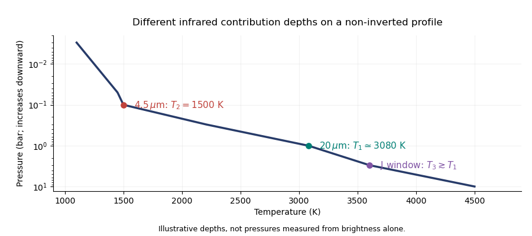

<h1 id="1/a/solution">Solution</h1>

↑ **Parent:** [A](../a.md)

Assume $R_p/R_\star=0.10$, $T_\star=5800\,\mathrm K$, uniform disk-averaged thermal emission, a nearly [blackbody](../../../../../../blackbody.md) stellar continuum, negligible reflected light at $20\,\mu\mathrm m$, and a flat response over the narrow band. If the eclipse depth is normalized to the out-of-eclipse star-plus-planet flux, the planet/star flux ratio is $r=0.005/(1-0.005)=0.005025$; using $r=0.005$ changes the estimate by less than one percent. The [exoplanet secondary eclipse](../../../../../../exoplanet-secondary-eclipse.md) then gives

$$
r\simeq\left(\frac{R_p}{R_\star}\right)^2\frac{B_\lambda(T_1)}{B_\lambda(T_\star)},\qquad
T_1=\frac{hc/(\lambda k_B)}{\ln\left[1+\frac{(R_p/R_\star)^2}{r}\left(e^{hc/(\lambda k_BT_\star)}-1\right)\right]}.
$$

Using the [Planck law](../../../../../../planck-s-law.md) at $\lambda=20\,\mu\mathrm m$ gives **$T_1\simeq3.1\times10^3\,\mathrm K$**, or about $3000\,\mathrm K$ at the precision justified by the radius assumption. The [Rayleigh-Jeans law](../../../../../../rayleigh-jeans-law.md) instead gives $T_1\simeq0.5T_\star\simeq2900\,\mathrm K$, a useful rough check. This is a [brightness temperature](../../../../../../brightness-temperature.md), not the bolometric [planetary equilibrium temperature](../../../../../../planetary-equilibrium-temperature.md). With zero [Bond albedo](../../../../../../bond-albedo.md) and global redistribution, the latter would be only about $1250\,\mathrm K$ at $0.05\,\mathrm{AU}$; a thermal window can sample hotter, deeper gas.

A continuum photon normally emerges from an [optical depth](../../../../../../optical-depth.md) of order unity. In [hydrostatic equilibrium](../../../../../../hydrostatic-equilibrium.md),

$$
\tau_\lambda(P)=\int_0^P\frac{\kappa_\lambda(P',T)}{g}\,dP'.
$$

The [emission-pressure degeneracy of a brightness temperature](../../../../../../emission-pressure-degeneracy-of-a-brightness-temperature.md) means that pressure cannot be uniquely recovered from the measured [brightness temperature](../../../../../../brightness-temperature.md) without $g$ and an [opacity](../../../../../../opacity.md) model. For an explicit nominal estimate, take $g=20\,\mathrm{m\,s^{-2}}$ and an effective continuum [mass absorption coefficient](../../../../../../mass-absorption-coefficient.md) $\kappa_{20}=2\times10^{-4}\,\mathrm{m^2\,kg^{-1}}$. Then $P_{\tau\sim1}\sim g/\kappa_{20}=10^5\,\mathrm{Pa}$, or **approximately one bar**. In a hydrogen-rich atmosphere, [collision-induced absorption](../../../../../../collision-induced-absorption-and-emission.md) by transient $\mathrm H_2$ pairs supplies continuum [opacity](../../../../../../opacity.md) even without ordinary molecular lines; its density dependence makes the constant-opacity calculation an illustrative estimate. With a normal deep [atmospheric pressure-temperature profile](../../../../../../atmospheric-pressure-temperature-profile.md), temperature increases at larger pressures, eventually following an interior [adiabatic temperature gradient](../../../../../../adiabatic-temperature-gradient.md).

Two mechanisms for $T_1\ne T_2$ are **wavelength-dependent sampling of a vertically varying temperature, and wavelength-dependent weighting of a horizontally nonuniform dayside**. In the first, [carbon monoxide](../../../../../../carbon-monoxide.md)-rich [opacity](../../../../../../opacity.md) near $4.5\,\mu\mathrm m$ can sample cooler gas around $0.1$ bar while the $20\,\mu\mathrm m$ continuum samples hotter gas around one bar. In the second, hot and cool areas contribute different proportions of the total flux in different bands because the [Planck function](../../../../../../planck-function.md) depends nonlinearly on temperature. The vertical mechanism alone produces the illustrated pair of temperatures; a single isothermal, horizontally uniform [blackbody](../../../../../../blackbody.md) would have the same [brightness temperature](../../../../../../brightness-temperature.md) in both bands.

**[Figure 1](#1/a/image-illustrative-pressure-temperature-profile-with-different-infrared-brightness-temperature-contribution-depths). Illustrative pressure-temperature profile with different infrared brightness-temperature contribution depths**.

If the J-band observation is thermal emission, its low-opacity window normally samples at least as deeply as the continuum at $20\,\mu\mathrm m$. On the illustrated non-inverted profile, **$T_3\gtrsim T_1>T_2$**. The ordering is conditional: molecular-line absence alone does not specify the relative continuum [opacities](../../../../../../opacity.md), and an inversion or reflected-light contamination can change the inference. The [exoplanet emission spectrum](../../../../../../exoplanet-emission-spectrum.md) measures weighted contribution regions rather than three exact thermometers at known pressures.

## ↑ Ancestors (11)

1. [A](../a.md)
2. [1](../../1.md)
3. [Paper 315](../../../paper-315-split.md)
4. [Iii](../../../split.md)
5. [2016](../../../../split.md)
6. [Past exam of the mathematics course of the University of Cambridge](../../../../../split.md)
7. [Mathematics course of the University of Cambridge](../../../../../../mathematics-course-of-the-university-of-cambridge.md)
8. [Course of the University of Cambridge](../../../../../../course-of-the-university-of-cambridge.md)
9. [University of Cambridge](../../../../../../university-of-cambridge-split.md)
10. [List of universities](../../../../../../list-of-universities.md)
11. [Codex Wiki](../../../../../../split.md)
