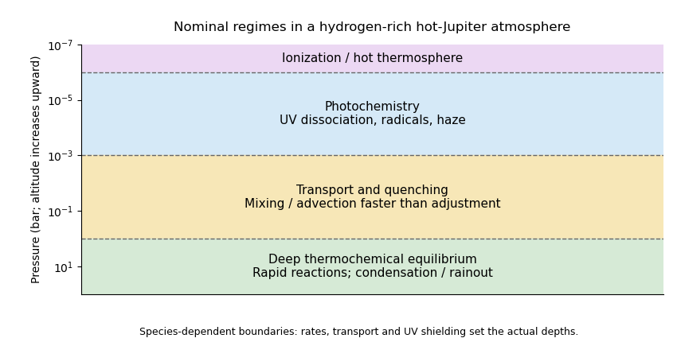

<h1 id="2/a/solution">Solution</h1>

↑ **Parent:** [A](../a.md)

For a representative hydrogen-rich [hot Jupiter](../../../../../../hot-jupiter.md), increasing altitude lowers pressure, slows collision-driven chemistry, and increases exposure to stellar UV. Three principal regimes follow.

At high pressures, illustratively $P\gtrsim1$--$10$ bar, collisions and sufficiently high temperature make [thermochemical equilibrium](../../../../../../thermochemical-equilibrium.md) a useful approximation. Molecular abundances minimize the free energy subject to elemental conservation. Condensation and [atmospheric condensate rainout](../../../../../../atmospheric-condensate-rainout.md) can remove selected elements from the gas.

At intermediate pressures, illustratively $10^{-3}\lesssim P\lesssim1$ bar, vertical mixing and horizontal winds can outrun [chemical relaxation time](../../../../../../chemical-relaxation-time.md). The [chemical quench level](../../../../../../chemical-quench-level.md) is defined by $\tau_{\rm chem}\sim\tau_{\rm mix}$; above it, some abundances retain values from a deeper or hotter region. [Horizontal chemical quenching](../../../../../../horizontal-chemical-quenching.md) similarly occurs when chemical adjustment is slower than advection between the day and night hemispheres.

At low pressures, illustratively $P\lesssim10^{-3}$ bar, [atmospheric photochemistry](../../../../../../atmospheric-photochemistry.md) becomes important: photodissociation and radical reactions change equilibrium abundances and can produce hydrocarbons and [atmospheric hazes](../../../../../../haze.md). At still lower pressures, roughly $10^{-6}$ bar and above in altitude, photoionization and an escaping [thermosphere](../../../../../../thermosphere.md) can become important.

**[Figure 3](#2/a/image-nominal-deep-equilibrium-transport-quenching-and-photochemical-regimes-in-a-hydrogen-rich-irradiated-atmosphere). Nominal deep-equilibrium, transport-quenching and photochemical regimes in a hydrogen-rich irradiated atmosphere**.

These pressures label a representative sketch, not universal interfaces. UV optical depth, stellar spectrum, gravity, metallicity, reaction rates and [eddy diffusivity](../../../../../../eddy-diffusivity.md) determine the transitions; quenching is species-dependent.

## ↑ Ancestors (11)

1. [A](../a.md)
2. [2](../../2.md)
3. [Paper 315](../../../paper-315-split.md)
4. [Iii](../../../split.md)
5. [2016](../../../../split.md)
6. [Past exam of the mathematics course of the University of Cambridge](../../../../../split.md)
7. [Mathematics course of the University of Cambridge](../../../../../../mathematics-course-of-the-university-of-cambridge.md)
8. [Course of the University of Cambridge](../../../../../../course-of-the-university-of-cambridge.md)
9. [University of Cambridge](../../../../../../university-of-cambridge-split.md)
10. [List of universities](../../../../../../list-of-universities.md)
11. [Codex Wiki](../../../../../../split.md)
