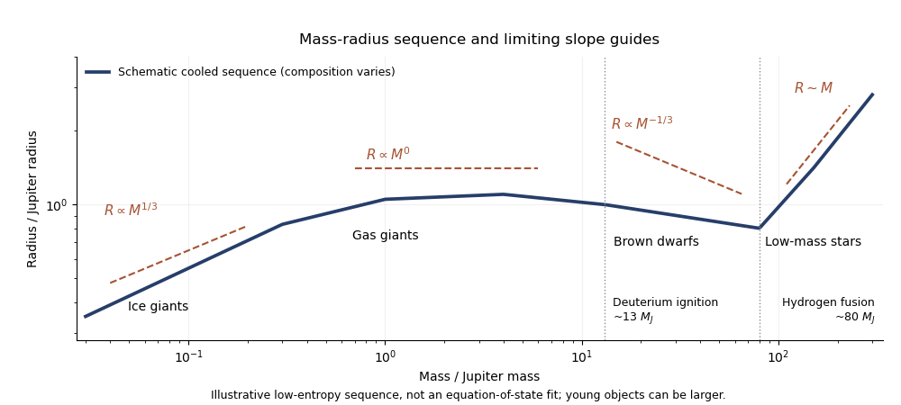

<h1 id="3/b/solution">Solution</h1>

↑ **Parent:** [B](../b.md)

For an old, approximately solar-composition H/He object with no strong irradiation or ongoing heat input, the cold [mass-radius relation](../../../../../../mass-radius-relation.md) reaches a broad maximum of **order one Jupiter radius, nominally about $1$--$1.2R_J$, at a few Jupiter masses**. This is a property of that composition and low-entropy sequence, not a composition-independent theorem from [hydrostatic equilibrium](../../../../../../hydrostatic-equilibrium.md) alone. Young isolated substellar objects can be larger while cooling; strict thermal steady state of a non-burning isolated body would require its internal luminosity to vanish.

**[Figure 4](#3/b/image-schematic-mass-radius-sequence-from-ice-giants-to-low-mass-stars-with-composition-and-degeneracy-slope-guides). Schematic mass-radius sequence from ice giants to low-mass stars with composition and degeneracy slope guides**.

At low mass, an incompressible fixed-composition approximation gives $M\simeq4\pi\bar\rho R^3/3$, so **$R\propto M^{1/3}$**. Ice giants contain dense heavy material and modest H/He envelopes, so real radii depend strongly on composition and are not obtained by extending a pure-hydrogen curve through them.

Gas giants approach a regime in which Coulomb interactions, compression and partial [electron degeneracy pressure](../../../../../../electron-degeneracy-pressure.md) compete. An approximate index-one [stellar polytrope](../../../../../../stellar-polytrope.md), $P=K\rho^2$, gives **$R\propto M^0$** at fixed $K$, explaining the broad Jupiter-sized plateau. In the nonrelativistic degenerate limit, $P=K\rho^{5/3}$ is an index-$3/2$ [stellar polytrope](../../../../../../stellar-polytrope.md), giving **$R\propto M^{-1/3}$** at fixed composition. This is a limiting slope; finite-temperature [brown dwarfs](../../../../../../brown-dwarf.md) do not follow that exact power law over their entire observed mass range.

The general [polytropic mass-radius relation](../../../../../../polytropic-mass-radius-relation.md) displays both limits:

$$
R\propto K^{n/(3-n)}M^{(1-n)/(3-n)}.
$$

At roughly $13M_J$, deuterium burning becomes possible, with a composition-dependent threshold. This is a conventional planet/brown-dwarf division rather than a unique formation definition. At roughly $0.075$--$0.08M_\odot$, about $75$--$85M_J$, sustained hydrogen burning can support a low-mass star. Its nuclear energy supply maintains a [specific entropy](../../../../../../specific-entropy.md) that prevents indefinite cooling onto the cold substellar sequence; its approximate main-sequence relation is $R\propto M$ over a limited low-mass interval.

Ice giants chiefly lose formation heat and some gravitational/radiogenic energy, with [convection](../../../../../../convection.md) in fluid regions and [thermal conduction](../../../../../../thermal-conduction.md) or inhibited [convection](../../../../../../convection.md) where composition stratifies the interior. Gas giants and non-burning [brown dwarfs](../../../../../../brown-dwarf.md) radiate stored heat and contraction energy; their deep interiors are largely convective, with radiative [photospheres](../../../../../../photosphere.md). [Helium](../../../../../../helium.md) separation can supply extra gravitational energy in mature giant planets, while [brown dwarfs](../../../../../../brown-dwarf.md) above the deuterium threshold have a temporary nuclear contribution. Low-mass stars are powered primarily by hydrogen fusion and are largely or fully convective at the lowest stellar masses. The transition to sustained fusion is the essential change from a cooling body to a long-lived thermal balance.

## ↑ Ancestors (11)

1. [B](../b.md)
2. [3](../../3.md)
3. [Paper 315](../../../paper-315-split.md)
4. [Iii](../../../split.md)
5. [2016](../../../../split.md)
6. [Past exam of the mathematics course of the University of Cambridge](../../../../../split.md)
7. [Mathematics course of the University of Cambridge](../../../../../../mathematics-course-of-the-university-of-cambridge.md)
8. [Course of the University of Cambridge](../../../../../../course-of-the-university-of-cambridge.md)
9. [University of Cambridge](../../../../../../university-of-cambridge-split.md)
10. [List of universities](../../../../../../list-of-universities.md)
11. [Codex Wiki](../../../../../../split.md)
