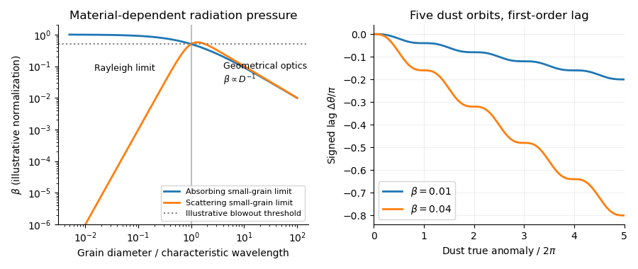

<h1 id="1/solution">Solution</h1>

↑ **Parent:** [1](../1.md)

For a spherical grain of density $\rho$, the [radiation-pressure coefficient](../../../../../radiation-pressure-coefficient.md) is

$$
\beta=\frac{3L_\star\langle Q_{\rm pr}\rangle}{8\pi cGM_\star\rho D}.
$$

The $r^{-2}$ dependence of [radiation pressure](../../../../../radiation-pressure.md) cancels that of [stellar gravity](../../../../../stellar-gravity.md). Here [radiation-pressure efficiency](../../../../../radiation-pressure-efficiency.md) includes absorption and the momentum-transfer part of scattering, averaged over the stellar spectrum. In the [geometrical optics](../../../../../geometrical-optics.md) regime, $D$ exceeds the important stellar wavelengths, $Q_{\rm pr}$ is of order unity, and **$\beta\propto D^{-1}$**: cross-sectional area grows as $D^2$, whereas mass grows as $D^3$. Around the stellar wavelength, [Mie scattering](../../../../../mie-scattering.md) can produce a broad maximum and material-dependent structure. In the [Rayleigh scattering](../../../../../rayleigh-scattering.md) regime, absorption gives $Q_{\rm abs}\propto D$, while scattering gives $Q_{\rm sca}\propto D^4$. Thus **small absorbing grains approach an approximately constant $\beta$, whereas nearly transparent grains have $\beta\propto D^3$**. A universal fall to zero at small $D$ is therefore inappropriate without specifying the optical properties. The sketch shows both possible small-grain limits; its vertical normalization is illustrative.

**[Figure 1](#1/image-radiation-to-gravity-ratios-for-absorbing-and-scattering-grains-and-the-signed-angular-lag-over-five-dust-orbits-for-beta-equal-to-0-01-and-0-04). Radiation-to-gravity ratios for absorbing and scattering grains, and the signed angular lag over five dust orbits for beta equal to 0.01 and 0.04**.

Assume release with negligible velocity relative to the [planet](../../../../../planet.md), negligible planetary gravity after release, and a constant [radiation-pressure coefficient](../../../../../radiation-pressure-coefficient.md). Put $\mu=GM_\star$ and $\mu_d=(1-\beta)\mu$. The inherited speed and [specific angular momentum](../../../../../specific-angular-momentum.md) are $v_p=\sqrt{\mu/a_p}$ and $h=a_pv_p$. The new [specific orbital energy](../../../../../specific-orbital-energy.md) is

$$
\varepsilon_d=\frac{v_p^2}{2}-\frac{\mu_d}{a_p}=\frac{\mu}{a_p}\left(\beta-\frac12\right).
$$

For $0\leq\beta<1/2$, the [dust orbit released from a circular parent ring](../../../../../dust-orbit-released-from-a-circular-parent-ring.md) is an ellipse. Using $\varepsilon_d=-\mu_d/(2a_d)$ and $h^2=\mu_da_d(1-e_d^2)$ gives

$$
\boxed{\frac{a_d}{a_p}=\frac{1-\beta}{1-2\beta},\qquad e_d=\frac{\beta}{1-\beta}}.
$$

For $\beta>0$, release is at [periapsis](../../../../../periapsis.md), since $a_d(1-e_d)=a_p$. At the [radiation-pressure blowout threshold](../../../../../radiation-pressure-blowout-threshold.md), $\beta=1/2$, the orbit is parabolic. For $1/2<\beta<1$ it is hyperbolic: the signed [semimajor axis](../../../../../semi-major-axis.md) is negative and $e_d>1$. For $\beta\geq1$ the central force ceases to be attractive, so the elliptical interpretation and the positive-eccentricity formula cannot be extended unchanged.

With $\theta_d$ measured from release, it is the [true anomaly](../../../../../true-anomaly.md). The [polar equation of a Kepler orbit](../../../../../polar-equation-of-a-kepler-orbit.md) and conservation of [specific angular momentum](../../../../../specific-angular-momentum.md) give

$$
r=\frac{h^2/\mu_d}{1+e_d\cos\theta_d}=\frac{a_p}{1-\beta+\beta\cos\theta_d},\qquad
\boxed{\dot\theta_d=\frac h{r^2}=n_p(1-\beta+\beta\cos\theta_d)^2}.
$$

Define the signed [dust-tail angular lag](../../../../../dust-tail-angular-lag.md) by $\Delta\theta=\theta_d-\theta_p$, with $\theta_p=n_pt$ and both angles unwrapped. For fixed $\theta_d$, expansion to first order in $\beta$ gives

$$
n_pt=\int_0^{\theta_d}\frac{d\psi}{(1-\beta+\beta\cos\psi)^2}
=\theta_d+2\beta(\theta_d-\sin\theta_d)+O(\beta^2\theta_d),
$$

so **$\Delta\theta=2\beta(\sin\theta_d-\theta_d)+O(\beta^2\theta_d)$**. The dust trails the [planet](../../../../../planet.md), hence the signed lag is negative. Its slope is $-4\beta\sin^2(\theta_d/2)$; it decreases monotonically, has horizontal tangents at successive release-direction passages, and has a sinusoidal ripple about $-2\beta\theta_d$. At the end of orbit $j$, $\theta_d=2\pi j$ and $\Delta\theta\simeq-4\pi\beta j$. At five orbits this is **$-0.2\pi$ for $\beta=0.01$ and $-0.8\pi$ for $\beta=0.04$**. The upper-$\beta$ sketch remains a first-order approximation; its accumulated error is $O(\beta^2\theta_d)$.

For the subsequent positive-distance statements, set $s=-\Delta\theta=\theta_p-\theta_d\geq0$. The [mean motion](../../../../../mean-motion.md) of the grain is

$$
\frac{n_d}{n_p}=\sqrt{\frac{1-\beta}{(a_d/a_p)^3}}=\frac{(1-2\beta)^{3/2}}{1-\beta}=1-2\beta+O(\beta^2).
$$

A full relative wrap, $s=2\pi$, therefore takes $t_{\rm wrap}\simeq\pi/(\beta n_p)$ after averaging over the orbital ripple. During this time [Poynting–Robertson drag](../../../../../poynting-robertson-drag.md) changes the [semimajor axis](../../../../../semi-major-axis.md) by

$$
\frac{|a_d(t_{\rm wrap})-a_d(0)|}{a_d(0)}
\simeq\frac{2\beta\mu}{ca_p^2}\frac{\pi}{\beta n_p}
=\boxed{\frac{2\pi v_p}{c}}.
$$

The signed change is negative. This estimate treats $a_d\simeq a_p$ as fixed in the rate and computes the drag accumulated over the radiation-pressure wrap time. Since $v_p/c\ll1$, drag causes little migration over that time. For an arbitrarily tiny $\beta$, however, this small migration can itself alter the relative phase appreciably: neglecting that feedback on the wrap time additionally requires $v_p/c\ll\beta$.

Rapid [dust sublimation](../../../../../dust-sublimation.md) is a plausible sink near a hot [planet](../../../../../planet.md): a grain can evaporate long before it completes a relative wrap. Destructive [collisions](../../../../../collision.md) can also remove visible grains. [Poynting–Robertson drag](../../../../../poynting-robertson-drag.md) alone, with the estimate above, does not explain immediate removal from a short tail. If the destruction time is $t_{\rm loss}$, a short tail requires roughly $2\beta n_pt_{\rm loss}\ll2\pi$.

For a [steady dust-tail continuity equation](../../../../../steady-dust-tail-continuity-equation.md), assume a constant injection rate $\dot N$, grains with the same fixed $\beta$, negligible release-speed dispersion, and negligible destruction within the segment being calculated. A finite destruction lifetime can terminate that segment, or multiply its density by a survival probability. To first order,

$$
\dot s=n_p-\dot\theta_d=4\beta n_p\sin^2(\theta_d/2)+O(\beta^2),\qquad
n(s)=\frac{\dot N}{\dot s}.
$$

To obtain the explicit trigonometric profile, make the additional [secular phase approximation for a dust tail](../../../../../secular-phase-approximation-for-a-dust-tail.md), $s\simeq2\beta\theta_d$, discarding the bounded $-2\beta\sin\theta_d$ term in the angle-to-age map while retaining the periodic instantaneous drift speed. Then

$$
\boxed{n(s)\simeq\frac{\dot N}{4\beta n_p}\frac1{\sin^2(s/(4\beta))}}.
$$

Since the square is even, the same written profile applies to the signed $\Delta\theta$ if number intervals are interpreted with positive orientation. The result is an approximate phase-substitution profile, not a uniformly valid consequence of $\beta\ll1$. The consistent first-order description is instead parametric:

$$
\boxed{s=2\beta(\theta_d-\sin\theta_d),\qquad
n(s)=\frac{\dot N}{4\beta n_p\sin^2(\theta_d/2)}}.
$$

In particular, immediately after release, $s\sim\beta\theta_d^3/3$ and $n\propto s^{-2/3}$, whereas the phase-substitution expression would give $s^{-2}$. Nor does $s\ll2\pi$ by itself justify neglecting the orbital ripple. The formal enhancements where $\dot s=0$ are [dust-tail caustics](../../../../../dust-tail-caustic.md); a spread of [radiation-pressure coefficients](../../../../../radiation-pressure-coefficient.md), finite release velocities, and destruction smooth them. With constant lifetime $\tau$, the parametric profile acquires $\exp[-t(\theta_d)/\tau]$. These qualifications state precisely the extra assumptions behind the explicit profile.

## ↑ Ancestors (10)

1. [1](../1.md)
2. [Paper 316](../../paper-316-split.md)
3. [Iii](../../split.md)
4. [2016](../../../split.md)
5. [Past exam of the mathematics course of the University of Cambridge](../../../../split.md)
6. [Mathematics course of the University of Cambridge](../../../../../mathematics-course-of-the-university-of-cambridge.md)
7. [Course of the University of Cambridge](../../../../../course-of-the-university-of-cambridge.md)
8. [University of Cambridge](../../../../../university-of-cambridge-split.md)
9. [List of universities](../../../../../list-of-universities.md)
10. [Codex Wiki](../../../../../split.md)
