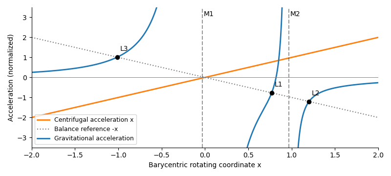

<h1 id="2/solution">Solution</h1>

↑ **Parent:** [2](../2.md)

The normalization of the [circular restricted three-body problem](../../../../../circular-restricted-three-body-problem.md) implies $\mu_1+\mu_2=1$, by [Kepler's third law](../../../../../kepler-s-third-law.md). The two bodies have barycentric positions $(-\mu_2,0)$ and $(\mu_1,0)$. Consequently

$$
\boxed{r_1=\sqrt{(x+\mu_2)^2+y^2},\qquad r_2=\sqrt{(x-\mu_1)^2+y^2}}.
$$

Differentiate the [effective potential](../../../../../effective-potential.md) directly:

$$
U_x=x-\frac{\mu_1(x+\mu_2)}{r_1^3}-\frac{\mu_2(x-\mu_1)}{r_2^3},\qquad
U_y=y-\frac{\mu_1y}{r_1^3}-\frac{\mu_2y}{r_2^3}.
$$

Since $x=\mu_1(x+\mu_2)+\mu_2(x-\mu_1)$ and $y=(\mu_1+\mu_2)y$, these become

$$
\boxed{U_x=\mu_1(1-r_1^{-3})(x+\mu_2)+\mu_2(1-r_2^{-3})(x-\mu_1),\qquad
U_y=\mu_1(1-r_1^{-3})y+\mu_2(1-r_2^{-3})y}.
$$

On $y=0$, [centrifugal acceleration](../../../../../centrifugal-acceleration.md) is the straight line $a_{\rm cf}=x$. Each gravitational term points towards its source, diverges at that source, and tends to zero far away. Let $f(x)=U_x(x,0)$; away from the sources,

$$
f'(x)=1+\frac{2\mu_1}{|x+\mu_2|^3}+\frac{2\mu_2}{|x-\mu_1|^3}>0.
$$

Thus the net acceleration is strictly increasing on each of the three intervals separated by the bodies. On the left interval $f$ runs from $-\infty$ to $+\infty$; on the middle interval it runs from $-\infty$ just right of $M_1$ to $+\infty$ just left of $M_2$; on the right interval it runs from $-\infty$ to $+\infty$. The [intermediate value theorem](../../../../../intermediate-value-theorem.md) and strict monotonicity give **exactly three collinear [Lagrange points](../../../../../lagrange-point.md)**, $L_3,L_1,L_2$ in increasing $x$ order. The sketch plots gravity and centrifugal acceleration separately; their intersections with $a_{\rm grav}=-x$ locate the equilibria.

**[Figure 2](#2/image-gravity-and-centrifugal-acceleration-on-the-binary-axis-with-their-three-balance-points-l3-l1-and-l2-marked-for-a-small-secondary-mass). Gravity and centrifugal acceleration on the binary axis, with their three balance points L3, L1 and L2 marked for a small secondary mass**.

Write $x_{L2}=\mu_1+\delta$, so $r_{2,L2}=\delta$ and $r_{1,L2}=1+\delta$. The exact right-hand equilibrium equation is

$$
0=\mu_1+\delta-\frac{\mu_1}{(1+\delta)^2}-\frac{\mu_2}{\delta^2}
=(1+2\mu_1)\delta-\frac{\mu_2}{\delta^2}+O(\delta^2).
$$

As $\mu_2\to0$, $\mu_1\to1$, so $3\delta^3\simeq\mu_2$. Therefore the distance is the leading [Hill radius](../../../../../hill-radius.md) in units of the binary separation:

$$
\boxed{r_{2,L2}\simeq\alpha=\left(\frac{M_2}{3M_1}\right)^{1/3}}.
$$

Replacing $M_1+M_2$ by $M_1$ changes only higher-order terms. In dimensional units the right-hand side is multiplied by the binary separation.

Use the displacement vector $\mathbf q=(X,Y,\dot X,\dot Y)^T$, where $X=x-x_{L2}$ and $Y=y$. The absolute coordinate $x$ cannot be the first entry of a homogeneous linear system about $L_2$; it must be translated. At $L_2$, reflection symmetry gives $U_{xy}=0$, while the [Hessian matrix](../../../../../hessian-matrix.md) has

$$
U_{xx}=1+2B,\qquad U_{yy}=1-B,\qquad
\boxed{B=\frac{\mu_1}{(1+\delta)^3}+\frac{\mu_2}{\delta^3}}.
$$

To first order in $|X|/\alpha$ and $|Y|/\alpha$, the [Coriolis acceleration](../../../../../coriolis-acceleration.md) then gives

$$
\dot{\mathbf q}=A\mathbf q,\qquad
A=\begin{pmatrix}
0&0&1&0\\
0&0&0&1\\
1+2B&0&0&2\\
0&1-B&-2&0
\end{pmatrix}.
$$

This is the [linearization at L2](../../../../../linearization-at-l2.md). The expression for $B$ is exact at the true equilibrium; in the small-secondary limit, $\mu_2/\delta^3\simeq3$ and $\mu_1/(1+\delta)^3\simeq1$, so **$B\simeq4$**.

For an [eigenmode](../../../../../normal-mode.md) proportional to $e^{\lambda t}$, eliminate the velocity coordinates. The [characteristic polynomial](../../../../../characteristic-polynomial.md) is

$$
[\lambda^2-(1+2B)][\lambda^2-(1-B)]+4\lambda^2
=\lambda^4+(2-B)\lambda^2+(1+2B)(1-B)=0.
$$

Thus

$$
\lambda^2=\frac{B-2\pm\sqrt{B(9B-8)}}2.
$$

For $B\simeq4$, the four [eigenvalues](../../../../../eigenvalue.md) are

$$
\boxed{\lambda=\pm\sqrt{1+2\sqrt7},\qquad
\lambda=\pm i\sqrt{2\sqrt7-1}}.
$$

There is an exponentially growing [eigenmode](../../../../../normal-mode.md), so $L_2$ is an **unstable [saddle-centre equilibrium](../../../../../saddle-centre-equilibrium.md)**. A generic displacement has an unstable component whose distance grows as $e^{\sqrt{1+2\sqrt7}\,t}$. The [L2 escape e-folding time](../../../../../l2-escape-e-folding-time.md) is

$$
\boxed{\tau_{\rm grow}\simeq\frac1{n_{\rm bin}\sqrt{1+2\sqrt7}}\simeq\frac{0.399}{n_{\rm bin}}\simeq0.0634P_{\rm bin}}.
$$

This is a local exponential timescale, not the time to reach a prescribed distance from an unspecified initial offset. Starting with unstable amplitude $q_0$, reaching $q_1$ within the linear neighborhood takes approximately $\tau_{\rm grow}\log(q_1/q_0)$. Initial data exactly on the centre-stable subspace need not grow forward at this linear order; the existence of the growing [eigenmode](../../../../../normal-mode.md) already proves instability.

## ↑ Ancestors (10)

1. [2](../2.md)
2. [Paper 316](../../paper-316-split.md)
3. [Iii](../../split.md)
4. [2016](../../../split.md)
5. [Past exam of the mathematics course of the University of Cambridge](../../../../split.md)
6. [Mathematics course of the University of Cambridge](../../../../../mathematics-course-of-the-university-of-cambridge.md)
7. [Course of the University of Cambridge](../../../../../course-of-the-university-of-cambridge.md)
8. [University of Cambridge](../../../../../university-of-cambridge-split.md)
9. [List of universities](../../../../../list-of-universities.md)
10. [Codex Wiki](../../../../../split.md)
