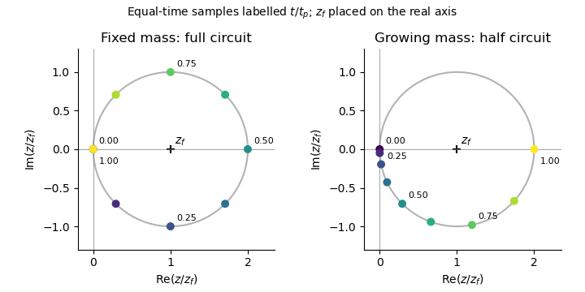

<h1 id="3/solution">Solution</h1>

↑ **Parent:** [3](../3.md)

For brevity write $b_1=b_{3/2}^{(1)}(\alpha)$, $b_2=b_{3/2}^{(2)}(\alpha)$, and $K=GM_p\alpha/(4a_p)$. The quadratic [disturbing function](../../../../../disturbing-function.md) is $\mathcal R=K[\tfrac12 b_1e^2-b_2e_pe\cos(\varpi_p-\varpi)]$. Differentiation in [Lagrange planetary equations](../../../../../lagrange-planetary-equations.md) gives

$$
\boxed{\dot e=\frac{K}{na^2}b_2e_p\sin(\varpi_p-\varpi),\qquad
\dot\varpi=\frac{K}{na^2}\left[b_1-b_2\frac{e_p}{e}\cos(\varpi_p-\varpi)\right]}.
$$

The separate [longitude of pericentre](../../../../../longitude-of-periapsis.md) equation is singular at $e=0$, because a circular orbit has no distinguished [periapsis](../../../../../periapsis.md). The [complex eccentricity](../../../../../complex-eccentricity.md), $z=e e^{i\varpi}$, is regular there. Using $z_p=e_pe^{i\varpi_p}$ and $\dot z=e^{i\varpi}(\dot e+ie\dot\varpi)$ gives

$$
\dot z=i\frac{K}{na^2}(b_1z-b_2z_p).
$$

Since $na^2=\sqrt{GM_\star a}$ and $n_p=\sqrt{GM_\star/a_p^3}$,

$$
\boxed{\frac{K}{na^2}=A(\alpha)=\frac14 n_p\frac{M_p}{M_\star}\alpha^{1/2},\qquad
\dot z=iA(\alpha)(b_1z-b_2z_p)}.
$$

The approximations are planar, small-[orbital eccentricity](../../../../../orbital-eccentricity.md), first order in the planet-to-star mass ratio, and secular averaging away from important [mean-motion resonances](../../../../../mean-motion-resonance.md). The [semimajor axis](../../../../../semi-major-axis.md) values remain constant at this order.

For a planet with fixed orbit, set $g=Ab_1$ and $z_f=(b_2/b_1)z_p$. Then $\dot z=ig(z-z_f)$, so $z-z_f=(z(0)-z_f)e^{igt}$. With $z(0)=0$,

$$
\boxed{z(t)=\frac{b_2}{b_1}z_p(1-e^{igt})}.
$$

On the [Argand diagram](../../../../../complex-plane.md), the [complex eccentricity](../../../../../complex-eccentricity.md) traces a circle centred on the [forced eccentricity](../../../../../forced-eccentricity.md) $z_f$, of radius $|z_f|$. For an interior test particle, $0<\alpha<1$ and $g>0$, so the motion is counterclockwise, starting at the origin. The rotating radius $z-z_f$ is the [free eccentricity](../../../../../proper-eccentricity.md). The [orbital eccentricity](../../../../../orbital-eccentricity.md) ranges from zero to $2|z_f|$, attaining its maximum at half a secular period. If $z_p$ is placed on the positive real axis, the initial tangent points downward, which is consistent with counterclockwise motion from the leftmost point of this circle.

**[Figure 3](#3/image-the-same-forced-eccentricity-circle-sampled-at-equal-times-a-fixed-mass-planet-completes-one-circuit-while-a-linearly-growing-planet-completes-half-a-circuit-by-its-growth-time). The same forced-eccentricity circle sampled at equal times: a fixed-mass planet completes one circuit while a linearly growing planet completes half a circuit by its growth time**.

Now let the planetary mass grow as $M_p(t)=M_p t/t_p$ for $0\leq t\leq t_p$, while the planet's [orbital elements](../../../../../orbital-element.md) and the test particle's [semimajor axis](../../../../../semi-major-axis.md) remain fixed. Both the precession and forcing coefficients acquire the same factor $t/t_p$. Their ratio, and hence $z_f$, remain constant. Thus

$$
\dot z=ig\frac{t}{t_p}(z-z_f),\qquad
\Phi(t)=\int_0^t g\frac{t'}{t_p}\,dt'=\frac{gt^2}{2t_p},
$$

and

$$
\boxed{z(t)=z_f\left[1-\exp\left(\frac{igt^2}{2t_p}\right)\right],\quad0\leq t\leq t_p}.
$$

This is the [secular phase integral for proportional mass growth](../../../../../secular-phase-integral-for-proportional-mass-growth.md). The [Argand diagram](../../../../../complex-plane.md) circle and the [free eccentricity](../../../../../proper-eccentricity.md) amplitude are unchanged; only the rate of traversal changes. The angular speed about $z_f$ starts at zero and rises linearly to $g$. The early displacement is quadratic in time rather than linear. Since $t_p=2\pi/g$, $\Phi(t_p)=\pi$, so

$$
\boxed{z(t_p)=2z_f=2z_p\frac{b_2}{b_1}}.
$$

A planet already at its final mass would instead return the particle to $z=0$ at $t_p$. After growth stops, the circle continues at rate $g$, with $z(t)=z_f[1+e^{ig(t-t_p)}]$ for $t\geq t_p$. Slow mass growth does not damp the [free eccentricity](../../../../../proper-eccentricity.md) here: the fixed centre of the circle and the conservative equation preserve its amplitude.

For several planets with fixed masses, [Laplace-Lagrange secular theory](../../../../../laplace-lagrange-secular-theory.md) gives $\dot{\mathbf z}=i\mathbf A\mathbf z$ for the planets and

$$
\dot z=ig_0z+i\sum_j\nu_j z_j(t)
$$

for a massless particle, with real secular coupling coefficients $\nu_j$. Resolve planetary [complex eccentricities](../../../../../complex-eccentricity.md) into [secular eigenmodes](../../../../../secular-eigenmode.md), $z_j(t)=\sum_k E_{jk}e^{ig_kt}$. Away from [secular resonances](../../../../../secular-resonance.md), the test-particle solution has the form

$$
z(t)=C e^{ig_0t}+\sum_k\frac{\sum_j\nu_jE_{jk}}{g_k-g_0}e^{ig_kt}.
$$

Its [Argand diagram](../../../../../complex-plane.md) trajectory is a superposition of rotations: generally a quasiperiodic curve with beats, rather than a circle with one fixed centre. Even if the planetary orbits are artificially held fixed, their combined forcing shifts the centre to the sum of the individual [forced eccentricities](../../../../../forced-eccentricity.md). At $g_k=g_0$, the resonant contribution is proportional to $t e^{ig_0t}$ in linear theory; its growing amplitude eventually invalidates the small-[orbital eccentricity](../../../../../orbital-eccentricity.md) approximation.

If one planetary mass changes, the [Laplace-Lagrange secular matrix](../../../../../laplace-lagrange-secular-matrix.md), its [eigenvalues](../../../../../eigenvalue.md), its [eigenvectors](../../../../../eigenvector.md), and the particle's forced response generally change with time. Planetary modes need not remain independent. Frequencies drift and a [secular resonance](../../../../../secular-resonance.md) can sweep across the particle, changing or exciting its [free eccentricity](../../../../../proper-eccentricity.md). Very slow evolution away from resonances permits an approximate adiabatic mode description; rapid evolution or a resonance passage can mix modes. The simple substitution of a phase integral works only in the special proportional-growth case above, where the entire particle equation is multiplied by one scalar and its forced centre stays fixed. It does not apply to a general many-planet system.

## ↑ Ancestors (10)

1. [3](../3.md)
2. [Paper 316](../../paper-316-split.md)
3. [Iii](../../split.md)
4. [2016](../../../split.md)
5. [Past exam of the mathematics course of the University of Cambridge](../../../../split.md)
6. [Mathematics course of the University of Cambridge](../../../../../mathematics-course-of-the-university-of-cambridge.md)
7. [Course of the University of Cambridge](../../../../../course-of-the-university-of-cambridge.md)
8. [University of Cambridge](../../../../../university-of-cambridge-split.md)
9. [List of universities](../../../../../list-of-universities.md)
10. [Codex Wiki](../../../../../split.md)
