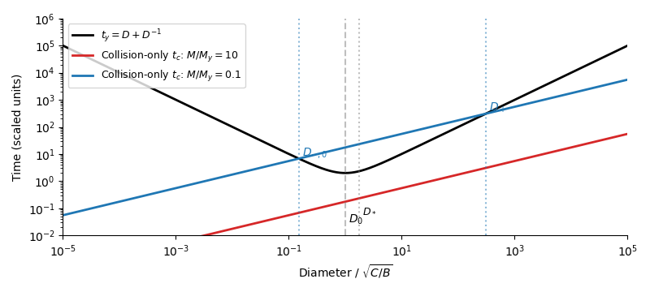
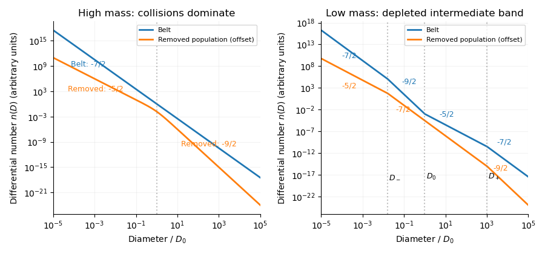

<h1 id="4/solution">Solution</h1>

↑ **Parent:** [4](../4.md)

Write the differential [power-law size distribution](../../../../../power-law-size-distribution.md) as $n(D)=K D^{-\alpha}$ and take all bodies to have the same bulk density. In a fixed belt volume, $K$ is proportional to $M_{\rm tot}$ when the size cutoffs and the shape of the distribution are fixed, because

$$
M_{\rm tot}=\frac{\pi\rho K}{6}\int_{D_{\min}}^{D_{\max}}D^{3-\alpha}\,dD.
$$

For $\alpha\ne4$ the integral is $(D_{\max}^{4-\alpha}-D_{\min}^{4-\alpha})/(4-\alpha)$; at $\alpha=4$ it is a logarithm. Thus no assumption that the mass is always dominated by the largest bodies is needed for this normalization step.

A size-independent [catastrophic disruption threshold](../../../../../catastrophic-disruption-threshold.md) and collision speed imply a fixed minimum projectile-to-target diameter ratio $\xi$, since $\tfrac12m_pv^2/m_t\sim Q_D^*$ gives $\xi\sim(2Q_D^*/v^2)^{1/3}$. With negligible [gravitational focusing](../../../../../gravitational-focusing.md), a target of size $D$ has a catastrophic collision rate proportional to

$$
\frac1{t_c(D)}\propto\int_{\xi D}^{D_{\max}}K d^{-\alpha}(D+d)^2\,dd
=K D^{3-\alpha}\int_\xi^{D_{\max}/D}u^{-\alpha}(1+u)^2\,du.
$$

For $\alpha>3$ and targets well inside the cutoffs, the dimensionless integral converges at the upper end and is size independent. Consequently

$$
\boxed{t_c=A M_{\rm tot}^{-1}D^{\alpha-3}}.
$$

Here $A$ contains the belt geometry, speed, density, cutoffs and disruption parameters. Close to a cutoff, or if $\xi D<D_{\min}$, this scaling needs modification. A finite belt without replenishment can only be in quasi-steady state over times short compared with depletion of its largest reservoir.

The mass in a logarithmic size interval is $m_{\ln D}\propto D^4n(D)\propto D^{4-\alpha}$. For a scale-independent [fragment redistribution function](../../../../../fragment-redistribution-function.md), steady collisional gain and loss transfer a constant [mass flux](../../../../../mass-flux.md) down the cascade: each logarithmic interval processes the same mass per unit time, away from boundaries. Equivalently, a normalized translation-invariant redistribution kernel acting on logarithmic bins admits constant processed mass as its steady solution. Thus

$$
\frac{m_{\ln D}}{t_c}\propto D^{4-\alpha-(\alpha-3)}=D^{7-2\alpha}
$$

must be size independent. Therefore **$\alpha=7/2$**, the [Dohnanyi collisional cascade](../../../../../dohnanyi-collisional-cascade.md), and **$t_c=(A/M_{\rm tot})D^{1/2}$**.

The [Yarkovsky effect](../../../../../yarkovsky-effect.md) is recoil from anisotropic [thermal radiation](../../../../../thermal-radiation.md). Finite [thermal inertia](../../../../../thermal-inertia.md) shifts the hottest region away from the instantaneous substellar point. The resulting recoil has a tangential component and produces a secular change of [semimajor axis](../../../../../semi-major-axis.md); the diurnal component can drift in either direction depending on spin, and the seasonal component generally drifts inward. Migration into a dynamical escape region can remove a body from the belt. For large bodies, the intercepted luminosity scales as $D^2$ and inertia as $D^3$, giving a recoil acceleration roughly proportional to $D^{-1}$, hence a removal time growing as $D$. Very small bodies become nearly isothermal when heat penetrates the whole body; the anisotropy decreases and the removal time again grows. The stated phenomenological law

$$
t_y=BD+\frac CD,\qquad B,C>0
$$

encodes these limits. Its minimum occurs at **$D_0=\sqrt{C/B}$**, with $t_{y,\min}=2\sqrt{BC}$. This minimum in absolute removal time differs from the minimum relative to the collision time.

For the collision-only cascade, form the ratio

$$
\frac{t_y}{t_c}=\frac{M_{\rm tot}}A\left(BD^{1/2}+CD^{-3/2}\right).
$$

Differentiation gives the minimum at **$D_*=\sqrt{3C/B}=\sqrt3D_0$**. At this diameter,

$$
\min_D\frac{t_y}{t_c}=\frac{4M_{\rm tot}}{3^{3/4}A}B^{3/4}C^{1/4}=\frac{M_{\rm tot}}{M_y},\qquad
\boxed{M_y=\frac{3^{3/4}}4 A B^{-3/4}C^{-1/4}}.
$$

Thus **$t_y<t_c$ for some sizes if and only if $M_{\rm tot}<M_y$** for an unrestricted size interval. In a finite belt, that interval must also overlap $[D_{\min},D_{\max}]$; the displayed inequality alone is necessary but not sufficient if all favorable sizes lie outside the belt. On logarithmic axes $t_y$ has slopes $-1$ and $+1$, while $t_c$ is a line of slope $1/2$. Increasing belt mass shifts the collision line downward.

**[Figure 4](#4/image-yarkovsky-removal-and-collision-times-on-logarithmic-axes-for-belt-masses-ten-times-and-one-tenth-of-the-critical-mass-marking-the-removal-time-minimum-and-the-two-nominal-crossings). Yarkovsky removal and collision times on logarithmic axes for belt masses ten times and one tenth of the critical mass, marking the removal-time minimum and the two nominal crossings**.

For $M_{\rm tot}\gg M_y$, collisions dominate at all sizes. The belt retains **$n_b(D)\propto D^{-7/2}$**. Let $T_{\rm dyn}$ be the size-independent residence time of objects after [Yarkovsky removal](../../../../../yarkovsky-removal.md). Their steady number distribution is

$$
n_{\rm out}(D)=T_{\rm dyn}\frac{n_b(D)}{t_y(D)}
\propto\frac{D^{-7/2}}{BD+C/D}.
$$

Hence **$n_{\rm out}\propto D^{-5/2}$ for $D\ll D_0$ and $n_{\rm out}\propto D^{-9/2}$ for $D\gg D_0$**, with a smooth change around $D_0$. These are differential number slopes, not cumulative-number or mass-per-logarithmic-bin slopes.

For $M_{\rm tot}\ll M_y$, first quantify the nominal crossings obtained by extending the collision-only cascade:

$$
BD^2+C=\frac A{M_{\rm tot}}D^{3/2}.
$$

The two roots surround $D_*$, and in the well-separated limit they are

$$
\boxed{D_{-,0}\simeq\left(\frac{CM_{\rm tot}}A\right)^{2/3},\qquad
D_+\simeq\left(\frac A{BM_{\rm tot}}\right)^2},\qquad
D_{-,0}\ll D_0\ll D_+.
$$

They mark where the undepleted distribution first becomes susceptible to [Yarkovsky removal](../../../../../yarkovsky-removal.md). The upper crossing remains the leading estimate for the onset of depletion, since larger bodies still constitute a collision-dominated reservoir. The lower crossing will be shifted by the depletion itself, as described below.

In the removal-dominated band, the fragment number injection spectrum is $S_N(D)=J D^{-7/2}$ under the stated [fragment redistribution function](../../../../../fragment-redistribution-function.md) assumption. Balancing production against escape gives

$$
n_b(D)\simeq S_N(D)t_y(D)=J\left(BD^{-5/2}+CD^{-9/2}\right),\qquad
n_{\rm out}(D)\simeq T_{\rm dyn}J D^{-7/2}.
$$

Thus the **belt slopes in the depleted band are $-5/2$ above $D_0$ and $-9/2$ below $D_0$; the removed population has slope $-7/2$ across that band**. The steep small-size side recovers towards a secondary collision-dominated cascade as escape becomes inefficient. It does not keep the $-9/2$ slope to zero size.

For a useful quantified sketch, approximate the collision integral by its scale-free local dependence and match adjacent asymptotic branches. Let $n_b=K D^{-7/2}$ above $D_+$, and write its collision rate as $(M_{\rm tot}/A)D^{-1/2}$. Matching at $D_+$ gives $J\simeq K/(BD_+)$. On the small-size side of the removal band,

$$
n_b\simeq K\frac{D_0^2}{D_+}D^{-9/2}.
$$

Its collision rate scales as $(M_{\rm tot}/A)(D_0^2/D_+)D^{-3/2}$, rather than the undepleted $D^{-1/2}$ law. Equating this rate to $D/C$ gives the corrected lower transition

$$
\boxed{D_-\sim D_0^{8/5}D_+^{-3/5}
=\left(\frac CB\right)^{4/5}\left(\frac{BM_{\rm tot}}A\right)^{6/5}}.
$$

The equality is an order-of-magnitude matching law: the collision integral has different dimensionless coefficients for slopes $7/2$ and $9/2$, and projectiles of size $\xi D$ spread transitions over a finite range. The powers follow from the stated scale-free model; an exact numerical lower crossing requires the collision kernel and fragment normalization. In particular, simply retaining $D_{-,0}$ as the true lower crossing silently treats the depleted projectile abundance as unchanged.

Below $D_-$, the secondary [Dohnanyi collisional cascade](../../../../../dohnanyi-collisional-cascade.md) has $n_b\simeq K_-D^{-7/2}$ with matching normalization

$$
K_-\sim K\frac{D_0^2}{D_+D_-}=K\left(\frac{D_0}{D_+}\right)^{2/5}\ll K.
$$

The four belt branches, in descending diameter, are therefore

$$
\boxed{
 n_b(D)\sim
 \begin{cases}
 K D^{-7/2},&D\gg D_+,\\
 (K/D_+)D^{-5/2},&D_0\ll D\ll D_+,\\
 (KD_0^2/D_+)D^{-9/2},&D_-\ll D\ll D_0,\\
 K_-D^{-7/2},&D\ll D_-.
 \end{cases}}
$$

The corresponding [Yarkovsky removal](../../../../../yarkovsky-removal.md) population has differential slopes **$-9/2$, $-7/2$, $-7/2$, $-5/2$**, respectively: division by $t_y$ cancels the bend at $D_0$ within the removal-dominated band. Its genuine changes of slope occur at $D_+$ and $D_-$. Multiplication by $T_{\rm dyn}$ changes only its normalization. If one is using the preliminary fixed-projectile approximation instead, the same four asymptotic slopes apply, with $D_{-,0}$ as its nominal lower breakpoint; that approximation omits the feedback just quantified.

**[Figure 5](#4/image-differential-number-distributions-inside-the-belt-and-in-the-removed-population-for-high-and-low-masses-with-all-asymptotic-slopes-and-the-depletion-shifted-lower-transition-marked). Differential number distributions inside the belt and in the removed population for high and low masses, with all asymptotic slopes and the depletion-shifted lower transition marked**.

All sketches presume the relevant breakpoints lie between the size cutoffs, enough time to establish the asserted steady portions, and a large-body reservoir feeding fragments. Otherwise only the branches within the actual size interval appear. Constant collision speed, size-independent strength, a self-similar redistribution law, and a size-independent external residence time are essential: changing them changes the exponents. Boundary waves and nonlocal collisions round the sharp branch joins in the sketch.

## ↑ Ancestors (10)

1. [4](../4.md)
2. [Paper 316](../../paper-316-split.md)
3. [Iii](../../split.md)
4. [2016](../../../split.md)
5. [Past exam of the mathematics course of the University of Cambridge](../../../../split.md)
6. [Mathematics course of the University of Cambridge](../../../../../mathematics-course-of-the-university-of-cambridge.md)
7. [Course of the University of Cambridge](../../../../../course-of-the-university-of-cambridge.md)
8. [University of Cambridge](../../../../../university-of-cambridge-split.md)
9. [List of universities](../../../../../list-of-universities.md)
10. [Codex Wiki](../../../../../split.md)
