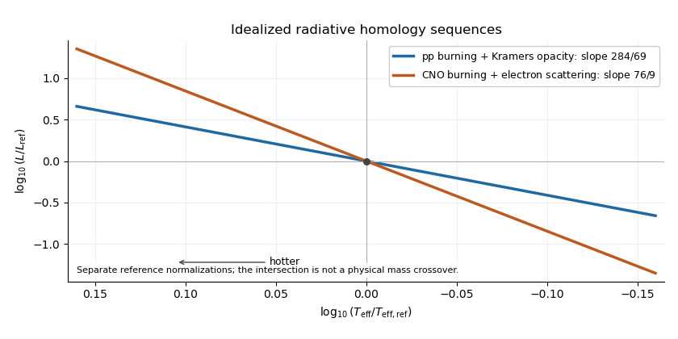

<h1 id="2/c/solution">Solution</h1>

↑ **Parent:** [C](../c.md)

For fixed composition, [electron-scattering opacity](../../../../../../electron-scattering-opacity.md) is effectively independent of [mass density](../../../../../../density.md) and [temperature](../../../../../../temperature.md), so $\lambda=\nu=0$. With the specified [CNO cycle](../../../../../../cno-cycle.md) exponent $\eta=16$, the [homology relations for radiative stars](../../../../../../homology-relations-for-radiative-stars.md) give

$$
X=\frac{15}{19},\qquad Y=18-19X=3.
$$

The [radiative homology with CNO burning and electron scattering](../../../../../../radiative-homology-with-cno-burning-and-electron-scattering.md) is therefore

$$
\boxed{R\propto M^{15/19},\qquad L\propto M^3.}
$$

The [Stefan–Boltzmann law](../../../../../../stefan-boltzmann-law.md) now gives

$$
T_{\rm eff}\propto M^{27/76},\qquad
\boxed{\frac{d\log L}{d\log T_{\rm eff}}=\frac{4\cdot3}{3-30/19}
=\frac{76}{9}\simeq8.444.}
$$

Equivalently $T_{\rm eff}\propto L^{9/76}$. These slopes are illustrated with arbitrary separate reference-model normalizations:

**[Figure 1](#2/c/image-logarithmic-hertzsprung-russell-slopes-for-the-two-idealized-radiative-homology-sequences-with-temperature-increasing-to-the-left). Logarithmic Hertzsprung-Russell slopes for the two idealized radiative homology sequences, with temperature increasing to the left**.

**The proton–proton/Kramers model applies to the lower-mass regime; the CNO/electron-scattering model applies to the higher-mass regime.** Higher-mass cores are hotter, making the more temperature-sensitive [CNO cycle](../../../../../../cno-cycle.md) efficient, and highly ionized material favors [electron-scattering opacity](../../../../../../electron-scattering-opacity.md). These are the stated idealized radiative, gas-pressure-supported sequences: a fully convective low-mass star or a radiation-pressure-dominated massive star needs a different structural model. The intersection of independently normalized lines in the figure does not specify a physical crossover mass.

## ↑ Ancestors (11)

1. [C](../c.md)
2. [2](../../2.md)
3. [Paper 317](../../../paper-317-split.md)
4. [Iii](../../../split.md)
5. [2016](../../../../split.md)
6. [Past exam of the mathematics course of the University of Cambridge](../../../../../split.md)
7. [Mathematics course of the University of Cambridge](../../../../../../mathematics-course-of-the-university-of-cambridge.md)
8. [Course of the University of Cambridge](../../../../../../course-of-the-university-of-cambridge.md)
9. [University of Cambridge](../../../../../../university-of-cambridge-split.md)
10. [List of universities](../../../../../../list-of-universities.md)
11. [Codex Wiki](../../../../../../split.md)
