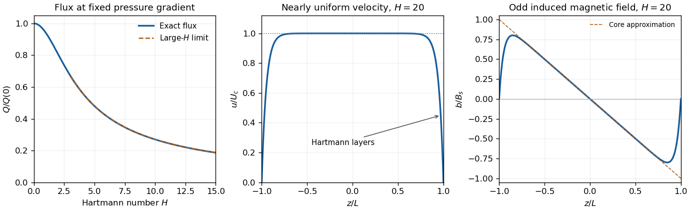

<h1 id="1/ii/solution">Solution</h1>

↑ **Parent:** [Ii](../ii.md)

Integrating the [resistive induction equation](../../../../../../resistive-induction-equation.md) once introduces a constant $C$:

$$
\eta b'+B_0u=C.
$$

Because $b(L)=b(-L)=0$, integrating this relation again over the channel gives $C=B_0Q/(2L)$, where $Q$ is the [volumetric flow rate](../../../../../../volumetric-flow-rate.md) per unit span. Put $m^2=B_0^2/(\mu_0\rho\nu\eta)$ and $H=mL$, taking $B_0\geq0$ without loss of generality. Reversing the imposed field reverses $b$ but leaves $u$ and $Q$ unchanged. Eliminating $b'$ from the [magnetohydrodynamic momentum equation](../../../../../../magnetohydrodynamic-momentum-equation.md) gives

$$
\nu u''-\nu m^2u+G+\frac{B_0C}{\mu_0\rho\eta}=0.
$$

Its two zero wall values remove the odd homogeneous solution. Write $u=U[1-\cosh(mz)/\cosh H]$. Integrating the first relation with the two magnetic wall values yields

$$
C=B_0U\left(1-\frac{\tanh H}{H}\right),
\qquad
\nu m^2U=G+\nu m^2U\left(1-\frac{\tanh H}{H}\right).
$$

Therefore $U=(GL^2/\nu H^2)H\coth H$. Substitution and integration produce **the velocity and induced field**:

$$
\boxed{u(z)=\frac{GL^2}{\nu H^2}(H\coth H)\left[1-\frac{\cosh(Hz/L)}{\cosh H}\right],}
$$

$$
\boxed{b(z)=\frac{B_0GL^3}{\eta\nu H^2}\left[-\frac zL+\frac{\sinh(Hz/L)}{\sinh H}\right].}
$$

Here $H=B_0L/\sqrt{\mu_0\rho\nu\eta}$ is the [Hartmann number](../../../../../../hartmann-number.md). The [hyperbolic cosine](../../../../../../hyperbolic-cosine.md) makes $u$ even, while the [hyperbolic sine](../../../../../../hyperbolic-sine.md) makes $b$ odd. Direct differentiation verifies both coupled equations and all four wall values.

Integrating the velocity gives **the flux**

$$
\boxed{Q(H)=\frac{2GL^3}{\nu}\frac{H\coth H-1}{H^2}.}
$$

The apparent singularity at $H=0$ is removable. The small-field limit is [plane Poiseuille flow](../../../../../../plane-poiseuille-flow.md):

$$
u\longrightarrow\frac G{2\nu}(L^2-z^2),\qquad
b\sim\frac{B_0GL^3}{6\eta\nu}\left[\left(\frac zL\right)^3-\frac zL\right],
\qquad
Q=\frac{2GL^3}{3\nu}\left[1-\frac{H^2}{15}+\frac{2H^4}{315}+O(H^6)\right].
$$

The cubic coefficient of $b$ is its first-order response in $B_0$; $b$ itself vanishes at zero imposed field. For a fixed positive $G$, the flux decreases monotonically as $H>0$ increases. One exact way to see the sketch's monotonicity is the [partial-fraction expansion of the hyperbolic cotangent](../../../../../../partial-fraction-expansion-of-the-hyperbolic-cotangent.md):

$$
\frac{H\coth H-1}{H^2}=2\sum_{n=1}^{\infty}\frac1{H^2+\pi^2n^2},
$$

whose derivative is strictly negative for $H>0$. The flux has a horizontal tangent at $H=0$ and approaches zero as

$$
Q\sim\frac{2GL^3}{\nu H}\left(1-\frac1H\right).
$$

The flux is even if signed $H$ is used.

For $H\gg1$, put $\zeta=z/L$. Away from the walls,

$$
u\sim U_c=\frac{GL^2}{\nu H},\qquad
b\sim-B_s\zeta,\qquad B_s=\frac{B_0GL^3}{\eta\nu H^2}.
$$

The velocity has a nearly uniform core, with thin [Hartmann layers](../../../../../../hartmann-layer.md) of thickness $\delta=L/H$ enforcing the [no-slip boundary condition](../../../../../../no-slip-boundary-condition.md). Near the upper wall, with $s=H(1-\zeta)$ fixed, $u/U_c\sim1-e^{-s}$ and $b/B_s\sim-1+s/H+e^{-s}$; the lower wall follows by even/odd symmetry. Thus $b$ is negative for $0<z<L$, positive for $-L<z<0$, and returns rapidly to zero at both walls. **The required sketches show a decreasing flux, a flat velocity core, and an odd induced field with magnetic wall layers.**

**[Figure 1](#1/ii/image-hartmann-flow-flux-versus-magnetic-field-strength-and-velocity-and-induced-field-profiles-at-hartmann-number-20). Hartmann-flow flux versus magnetic field strength, and velocity and induced-field profiles at Hartmann number 20**.

## ↑ Ancestors (11)

1. [Ii](../ii.md)
2. [1](../../1.md)
3. [Paper 318](../../../paper-318-split.md)
4. [Iii](../../../split.md)
5. [2016](../../../../split.md)
6. [Past exam of the mathematics course of the University of Cambridge](../../../../../split.md)
7. [Mathematics course of the University of Cambridge](../../../../../../mathematics-course-of-the-university-of-cambridge.md)
8. [Course of the University of Cambridge](../../../../../../course-of-the-university-of-cambridge.md)
9. [University of Cambridge](../../../../../../university-of-cambridge-split.md)
10. [List of universities](../../../../../../list-of-universities.md)
11. [Codex Wiki](../../../../../../split.md)
