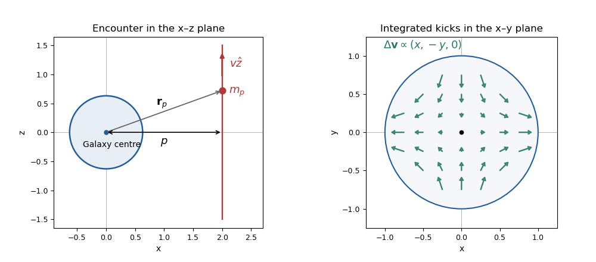

<h1 id="1/solution">Solution</h1>

↑ **Parent:** [1](../1.md)

For one target [galaxy](../../../../../galaxy-split.md), an encounter with relative speed $u$ sweeps a cylinder of volume $\pi R^2u\,dt$ in time $dt$. Multiplication by the number density gives the encounter rate $\Gamma=\pi R^2N\langle v_{\mathrm{rel}}\rangle$. Thus the [geometric galaxy-encounter rate](../../../../../geometric-galaxy-encounter-rate.md) gives

$$
\boxed{\mu=\Gamma T=\pi R^2N\langle v_{\mathrm{rel}}\rangle T.}
$$

This is the expected number of mergers in the geometric model. For independent encounters, the [Poisson process](../../../../../poisson-process.md) probability of at least one is $P_{\geq1}=1-e^{-\mu}$, so the displayed linear probability is valid for rare encounters, $\mu\ll1$. There is no factor of one-half for a single target; that factor would enter a count of distinct pairs across the whole population.

For an illustrative group environment, take $R=20\,\mathrm{kpc}=0.02\,\mathrm{Mpc}$, $N\sim1\,\mathrm{Mpc}^{-3}$, $\langle v_{\mathrm{rel}}\rangle\sim300\,\mathrm{km\,s^{-1}}$ and a [Hubble time](../../../../../hubble-time.md) of order $10^{10}$ years, or $3\times10^{17}\,\mathrm s$. The path length is about $9\times10^{19}\,\mathrm{km}\simeq3\,\mathrm{Mpc}$, using the stated distance conversion. Hence

$$
\boxed{P\simeq\pi(0.02)^2(1)(3)\simeq4\times10^{-3}.}
$$

The estimate scales linearly with environment density and quadratically with the adopted merger radius. It is an order-of-magnitude model estimate, not a universal observed merger fraction; reducing the illustrative density by a factor of one hundred reduces the estimate by the same factor.

For the tidal calculation, use the [relative potential](../../../../../relative-potential.md) convention in which acceleration is $\nabla\psi$. Expand the point-mass potential about the target centre:

$$
\frac{Gm_p}{|\mathbf r_p-\mathbf r|}=\frac{Gm_p}{r_p}+\frac{Gm_p\mathbf r\cdot\mathbf r_p}{r_p^3}+\frac{Gm_p}{2r_p^3}\left[\frac{3(\mathbf r\cdot\mathbf r_p)^2}{r_p^2}-r^2\right]+\cdots.
$$

The constant does not exert a force. The linear term accelerates the target centre and is subtracted in its freely falling frame. The remaining leading [quadrupolar point-mass tidal potential](../../../../../quadrupolar-point-mass-tidal-potential.md) is

$$
\boxed{\psi_{\mathrm{tid}}=\frac{Gm_p}{r_p^3}\left[-\frac{r^2}{2}+\frac{3(\mathbf r\cdot\mathbf r_p)^2}{2r_p^2}\right].}
$$

The condition $r<r_p$ permits the convergent expansion; using only this term is the leading tidal approximation, accurate when the target radius is small compared with the closest separation.

The given impact and [velocity](../../../../../velocity.md) directions imply $\mathbf r_p(t)=(p,0,vt)$. This trajectory is in the $x,z$ plane, correcting the incompatible printed $x,y$ plane. In the [impulse approximation](../../../../../impulse-approximation.md), hold the stellar position fixed while integrating the [tidal tensor](../../../../../tidal-tensor.md):

$$
\Delta v_i=Gm_p\int_{-\infty}^{\infty}\left(\frac{3r_{p,i}r_{p,j}}{r_p^5}-\frac{\delta_{ij}}{r_p^3}\right)dt\,r_j.
$$

For $s=vt/p$, the needed integrals are

$$
\int\frac{dt}{r_p^3}=\frac{2}{vp^2},\quad\int\frac{p^2dt}{r_p^5}=\frac{4}{3vp^2},\quad\int\frac{v^2t^2dt}{r_p^5}=\frac{2}{3vp^2},
$$

with the mixed integral zero by oddness. Thus the [integrated tidal tensor of a straight-line flyby](../../../../../integrated-tidal-tensor-of-a-straight-line-flyby.md) is $2Gm_p\operatorname{diag}(1,-1,0)/(vp^2)$ and

$$
\boxed{\Delta\mathbf v=\frac{2Gm_p}{vp^2}(x,-y,0).}
$$

There is stretching along the impact direction, compression in the other transverse direction and no net kick along the path.

**[Figure 1](#1/image-straight-line-galaxy-encounter-and-the-transverse-tidal-velocity-kick). Straight-line galaxy encounter and the transverse tidal velocity kick**.

Write $\mathbf u$ for the [star](../../../../../star.md)'s initial [velocity](../../../../../velocity.md), distinguishing it from the perturber speed $v$. Its specific energy change is $\mathbf u\cdot\Delta\mathbf v+\tfrac12|\Delta\mathbf v|^2$. The no-correlation assumption removes the first term on averaging; it is not an identity for every individual [star](../../../../../star.md). The mean specific heating at a given position is therefore

$$
\boxed{\langle\Delta e\rangle_{\mathbf r}=\frac{2G^2m_p^2}{v^2p^4}(x^2+y^2).}
$$

For a spherical target, the mass-weighted averages satisfy $\langle x^2\rangle=\langle y^2\rangle=\langle z^2\rangle=\langle r^2\rangle/3$. The [tidal impulse heating of a spherical galaxy](../../../../../tidal-impulse-heating-of-a-spherical-galaxy.md) is consequently

$$
\boxed{\Delta U_g=\frac{4G^2m_p^2m_g}{3v^2p^4}\langle r^2\rangle.}
$$

Here $\langle r^2\rangle=m_g^{-1}\int r^2\rho\,d^3r$ is assumed finite. Notice the change from specific energy to total energy after multiplying by $m_g$.

For two equal targets, each gains the same internal energy, so $\Delta U_{\mathrm{tot}}=8G^2m_g^3\langle r^2\rangle/(3v^2p^4)$. Their relative-motion [reduced mass](../../../../../reduced-mass.md) is $m_g/2$. If $v$ denotes their relative speed at infinity, their initial orbital energy is $E_{\mathrm{orb}}=\tfrac12(m_g/2)v^2=m_gv^2/4$. Internal tidal heating comes from this orbital energy. In the [tidal capture of galaxies](../../../../../tidal-capture-of-galaxies.md) model, capture occurs if $\Delta U_{\mathrm{tot}}>E_{\mathrm{orb}}$, which gives the [equal-mass tidal-capture threshold](../../../../../equal-mass-tidal-capture-threshold.md)

$$
\boxed{pv<\left(\frac{32}{3}G^2m_g^2\langle r^2\rangle\right)^{1/4}.}
$$

Capture allows further passages and eventual merger in this simplified picture.

The encounter lasts roughly $p/v$. The [impulse approximation](../../../../../impulse-approximation.md) needs $\Omega p/v\ll1$, so that a [star](../../../../../star.md) barely moves during the tide. When $v/p<\Omega$, stellar orbits respond during the perturbation and the kicks can cancel. [Adiabatic invariance of an orbital action](../../../../../adiabatic-invariance-of-an-orbital-action.md) produces [adiabatic shielding of tidal encounters](../../../../../adiabatic-shielding-of-tidal-encounters.md), rather than the impulsive heating used above. **The capture inequality cannot be extrapolated into that slow-encounter regime.**

## ↑ Ancestors (10)

1. [1](../1.md)
2. [Paper 320](../../paper-320-split.md)
3. [Iii](../../split.md)
4. [2016](../../../split.md)
5. [Past exam of the mathematics course of the University of Cambridge](../../../../split.md)
6. [Mathematics course of the University of Cambridge](../../../../../mathematics-course-of-the-university-of-cambridge.md)
7. [Course of the University of Cambridge](../../../../../course-of-the-university-of-cambridge.md)
8. [University of Cambridge](../../../../../university-of-cambridge-split.md)
9. [List of universities](../../../../../list-of-universities.md)
10. [Codex Wiki](../../../../../split.md)
