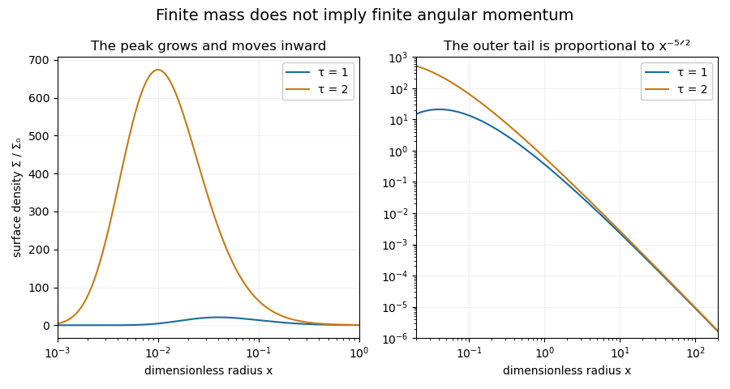

<h1 id="1/a/ii/solution">Solution</h1>

↑ **Parent:** [Ii](../ii.md)

Let $g=G(\xi)$ with $\xi=\tau^{-1}x^{-1/2}$. The derivatives of this [similarity solution](../../../../../../../similarity-solution.md) are

$$
g_\tau=-\frac\xi\tau G',\quad g_x=-\frac\xi{2x}G',\quad g_{xx}=\frac{\xi^2G''+3\xi G'}{4x^2}.
$$

The first-derivative terms cancel in the dimensionless [diffusion equation](../../../../../../../diffusion-equation-split.md), leaving $G''+G'=0$ for $\xi>0$. Thus

$$
G=A+B e^{-\xi}.
$$

At the inner boundary $x\to0$, $\xi\to\infty$. Interpreting the named variable as vanishing there sets $A=0$. Even if only the true [viscous torque in an accretion disk](../../../../../../../viscous-torque-in-an-accretion-disk.md) $x^{1/2}g$ is required to vanish, a nonzero $A$ would give infinite total [mass](../../../../../../../mass.md) near $r=0$; finite [mass](../../../../../../../mass.md) again selects $A=0$. With nonnegative [surface density](../../../../../../../surface-density-of-a-disk.md), choose $B=C>0$; its value fixes the initial mass normalization. Therefore

$$
\boxed{g=C e^{-\xi},\qquad \frac\Sigma{\Sigma_0}=C x^{-5/2}\exp\left(-\frac1{\tau\sqrt x}\right).}
$$

The [surface density](../../../../../../../surface-density-of-a-disk.md) vanishes exponentially at the origin and has an $x^{-5/2}$ tail at infinity. Its peak occurs at $x_{\max}=1/(25\tau^2)$, with $\Sigma_{\max}/\Sigma_0=C(5\tau)^5e^{-5}$. The peak moves inward and grows as time increases.

**[Figure 1](#1/a/ii/image-surface-density-profiles-of-the-printed-similarity-solution-at-two-times-showing-an-inward-moving-growing-peak-and-the-outer-power-law-tail). Surface-density profiles of the printed similarity solution at two times, showing an inward-moving growing peak and the outer power-law tail**.

The plot uses $C=1$ and shows the actual [surface density](../../../../../../../surface-density-of-a-disk.md), with logarithmic radius to resolve both peaks. The later profile is larger at every fixed radius. Its total [mass](../../../../../../../mass.md) is finite; its total [angular momentum](../../../../../../../angular-momentum.md) is not, as the next calculation establishes.

## ↑ Ancestors (12)

1. [Ii](../ii.md)
2. [A](../../a.md)
3. [1](../../../1.md)
4. [Paper 321](../../../../paper-321-split.md)
5. [Iii](../../../../split.md)
6. [2016](../../../../../split.md)
7. [Past exam of the mathematics course of the University of Cambridge](../../../../../../split.md)
8. [Mathematics course of the University of Cambridge](../../../../../../../mathematics-course-of-the-university-of-cambridge.md)
9. [Course of the University of Cambridge](../../../../../../../course-of-the-university-of-cambridge.md)
10. [University of Cambridge](../../../../../../../university-of-cambridge-split.md)
11. [List of universities](../../../../../../../list-of-universities.md)
12. [Codex Wiki](../../../../../../../split.md)
