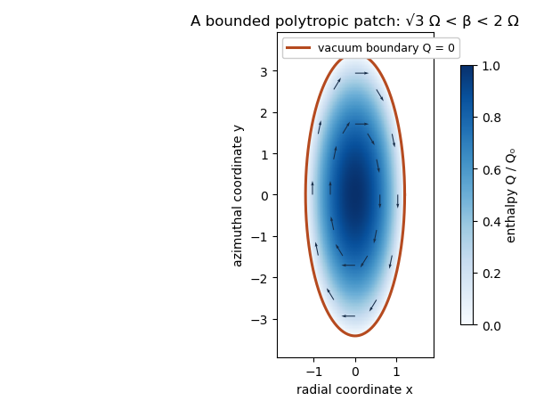

<h1 id="2/d/ii/solution">Solution</h1>

↑ **Parent:** [Ii](../ii.md)

For $\mathbf u=\alpha y\mathbf e_x-\beta x\mathbf e_y$, the velocity divergence is zero and $\mathbf u\cdot\nabla\mathbf u=-\alpha\beta(x\mathbf e_x+y\mathbf e_y)$. Substituting into the steady [Euler equations](../../../../../../../euler-equations-for-an-inviscid-fluid.md) yields

$$
Q_x=(\alpha\beta+3\Omega^2-2\Omega\beta)x,\qquad Q_y=\alpha(\beta-2\Omega)y.
$$

Integration gives

$$
Q=Q_0+\frac12(\alpha\beta+3\Omega^2-2\Omega\beta)x^2+\frac12\alpha(\beta-2\Omega)y^2.
$$

The steady enthalpy equation also requires $\mathbf u\cdot\nabla Q=0$. Its $xy$ coefficient is $\alpha(3\Omega^2+\alpha\beta-\beta^2)$, so, since $\alpha>0$,

$$
\boxed{\alpha=\frac{\beta^2-3\Omega^2}{\beta},\qquad Q=Q_0-\frac12(2\Omega-\beta)(\beta x^2+\alpha y^2).}
$$

For a bounded patch with positive [mass density](../../../../../../../density.md) and a vacuum [fluid free boundary](../../../../../../../fluid-free-boundary.md), choose $Q_0>0$ and require both quadratic coefficients to confine the fluid. With $\Omega>0$ and $\alpha,\beta>0$, this means

$$
\boxed{\sqrt3\,\Omega<\beta<2\Omega.}
$$

The lower bound is imposed by $\alpha>0$; the upper bound by bounded positive $Q$. At $\beta=2\Omega$, $Q$ is constant and has no nontrivial finite vacuum boundary; $\beta\le\sqrt3\Omega$ violates or degenerates the stipulated elliptical flow.

For a [polytropic elliptical patch in a shearing sheet](../../../../../../../polytropic-elliptical-patch-in-a-shearing-sheet.md), the physical [fluid free boundary](../../../../../../../fluid-free-boundary.md) is $p=\rho=Q=0$. It is the [ellipse](../../../../../../../ellipse.md)

$$
\boxed{\beta x^2+\alpha y^2=\frac{2Q_0}{2\Omega-\beta},\qquad \frac{x^2}{a_x^2}+\frac{y^2}{a_y^2}=1,}
$$

where $a_x^2=2Q_0/[\beta(2\Omega-\beta)]$ and $a_y^2=2Q_0/[\alpha(2\Omega-\beta)]$. In the interior $\rho=[Q/((n+1)K)]^n$. The boundary is a material [streamline](../../../../../../../streamline.md) because $\mathbf u\cdot\nabla(\beta x^2+\alpha y^2)=0$. Since $\alpha<\beta$, it is elongated in the azimuthal $y$ direction.

**[Figure 2](#2/d/ii/image-the-polytropic-shearing-sheet-patch-has-an-elliptical-vacuum-boundary-with-tangential-anticyclonic-flow-and-positive-interior-enthalpy). The polytropic shearing-sheet patch has an elliptical vacuum boundary with tangential anticyclonic flow and positive interior enthalpy**.

This is a pressure-supported fluid patch in the supplied tidal model; no additional planetary self-gravity potential was assumed.

## ↑ Ancestors (12)

1. [Ii](../ii.md)
2. [D](../../d.md)
3. [2](../../../2.md)
4. [Paper 321](../../../../paper-321-split.md)
5. [Iii](../../../../split.md)
6. [2016](../../../../../split.md)
7. [Past exam of the mathematics course of the University of Cambridge](../../../../../../split.md)
8. [Mathematics course of the University of Cambridge](../../../../../../../mathematics-course-of-the-university-of-cambridge.md)
9. [Course of the University of Cambridge](../../../../../../../course-of-the-university-of-cambridge.md)
10. [University of Cambridge](../../../../../../../university-of-cambridge-split.md)
11. [List of universities](../../../../../../../list-of-universities.md)
12. [Codex Wiki](../../../../../../../split.md)
