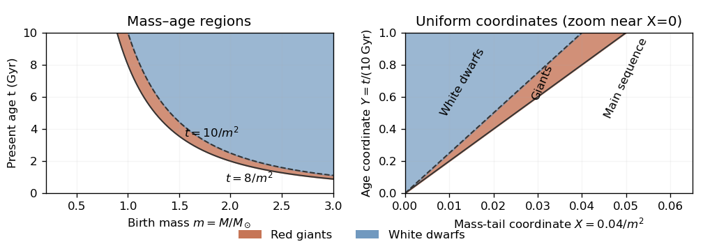

# 1

↑ **Parent:** [Paper 322](../paper-322-split.md)

Let $T=10\,\mathrm{Gyr}$ and let $t$ denote present [stellar age](../../../../stellar-age.md), rather than time measured from the galaxy's birth. With a fixed [initial mass function](../../../../initial-mass-function.md), constant [star formation rate](../../../../star-formation-rate.md) also gives a constant number of births per unit time, as in the [birth-age distribution under constant star formation](../../../../birth-age-distribution-under-constant-star-formation.md). Counting the supplied [stellar evolution](../../../../stellar-evolution.md) model's remnants as part of the population, ages have a [uniform distribution](../../../../continuous-uniform-distribution.md) on $[0,T]$. Integrating the constant birth rate therefore gives

$$
\boxed{Y(t)=\frac tT=0.1\frac{t}{\mathrm{Gyr}}\quad(0\le t\le T).}
$$

Outside this interval the cumulative fraction is zero or one as appropriate.

Write $m=M/M_\odot$ for the birth-mass parameter and $M_{\min}=0.2M_\odot$. The normalization cancels when integrating the [initial mass function](../../../../initial-mass-function.md):

$$
X(M)=\frac{\int_M^\infty kM_\odot^3M'^{-3}\,dM'}{\int_{M_{\min}}^\infty kM_\odot^3M'^{-3}\,dM'}=\frac{M_{\min}^2}{M^2}.
$$

Thus **the mass-tail fraction** is

$$
\boxed{X(M)=\frac{0.04}{m^2}\quad(m>0.2).}
$$

It is one at and below the lower cutoff. The normalization constant has no effect on any number fraction.

For [evolutionary-state selection by stellar lifetimes](../../../../evolutionary-state-selection-by-stellar-lifetimes.md), a [red giant](../../../../red-giant.md) has completed its [main sequence](../../../../main-sequence.md) lifetime but not its giant lifetime. Its [stellar lifetime regions in a mass-age diagram](../../../../stellar-lifetime-regions-in-a-mass-age-diagram.md) are bounded by

$$
\boxed{\frac{8\,\mathrm{Gyr}}{m^2}<t<\frac{10\,\mathrm{Gyr}}{m^2},\qquad 0<t<T,\qquad m\ge0.2.}
$$

The lower boundary meets $t=T$ at $m=\sqrt{0.8}$ and the upper boundary meets it at $m=1$. A [white dwarf](../../../../white-dwarf.md) lies above the upper lifetime curve, within the same age interval.

**[Figure 1](#1/image-red-giant-and-white-dwarf-regions-in-the-birth-mass-age-plane-and-their-triangular-images-in-uniform-mass-tail-age-coordinates). Red-giant and white-dwarf regions in the birth-mass–age plane and their triangular images in uniform mass-tail–age coordinates**.

The [probability integral transform](../../../../probability-integral-transform.md), applied to the decreasing mass-tail coordinate, makes $X$ uniform on $(0,1)$: $\Pr(X<x)=x$. The independent birth age gives $Y=t/T$ uniform on $(0,1)$, so number fractions are areas in a unit square. Since $m^{-2}=25X$, the [red giant](../../../../red-giant.md) region becomes $20X<Y<25X$, a triangle with vertices $(0,0)$, $(1/25,1)$ and $(1/20,1)$. Its area is $\tfrac12(1/20-1/25)=1/200$. The [white dwarf](../../../../white-dwarf.md) region $Y>25X$ is a triangle of area $\tfrac12(1/25)=1/50$. Hence **the present individual-star fractions** are

$$
\boxed{\Pr(G)=0.005=0.5\%,\qquad\Pr(W)=0.02=2\%.}
$$

The rest are on the [main sequence](../../../../main-sequence.md) under the given toy lifetime model.

For the [binary stars](../../../../binary-star.md), draw two independent mass-tail coordinates $X_1,X_2$, but only one shared age coordinate $Y$: components born together are coeval. The [coeval binary population](../../../../coeval-binary-population.md) therefore occupies a uniform unit cube $(X_1,X_2,Y)$. At a fixed age $Y=y$, the state [probabilities](../../../../probability.md) for either component are

$$
g(y)=\Pr(G\mid y)=\frac y{100},\qquad w(y)=\Pr(W\mid y)=\frac y{25}=4g(y),\qquad s(y)=1-\frac y{20}.
$$

Their evolutionary states have [conditional independence](../../../../conditional-independence.md) given $y$. They generally do not have unconditional independence, because sharing an age correlates their states. The binary fractions below are slice areas averaged over $0<y<1$.

**Table of contents**

- [i](1/i.md)
  - [Solution](1/i/solution.md)
- [ii](1/ii.md)
  - [Solution](1/ii/solution.md)
- [iii](1/iii.md)
  - [Solution](1/iii/solution.md)

## ↑ Ancestors (9)

1. [Paper 322](../paper-322-split.md)
2. [Iii](../split.md)
3. [2016](../../split.md)
4. [Past exam of the mathematics course of the University of Cambridge](../../../split.md)
5. [Mathematics course of the University of Cambridge](../../../../mathematics-course-of-the-university-of-cambridge.md)
6. [Course of the University of Cambridge](../../../../course-of-the-university-of-cambridge.md)
7. [University of Cambridge](../../../../university-of-cambridge-split.md)
8. [List of universities](../../../../list-of-universities.md)
9. [Codex Wiki](../../../../split.md)
