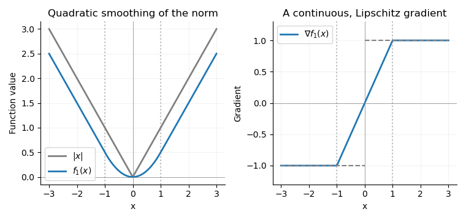

<h1 id="1/iv/solution">Solution</h1>

↑ **Parent:** [Iv](../iv.md)

For the [Euclidean norm](../../../../../../euclidean-norm.md), rotational symmetry and minimizing the radial objective give the [radial soft thresholding](../../../../../../radial-soft-thresholding.md) formula

$$
\operatorname{prox}_{\tau\|\cdot\|_2}(x)=
\begin{cases}
0,&\|x\|_2\leq\tau,\\
\left(1-\dfrac\tau{\|x\|_2}\right)x,&\|x\|_2>\tau.
\end{cases}
$$

Indeed, if $r=\|x\|_2$, an optimal $u$ is a nonnegative scalar multiple of $x$; minimizing $s+(r-s)^2/(2\tau)$ over $s\geq0$ gives $s=(r-\tau)_+$. The [gradient of a Moreau envelope](../../../../../../gradient-of-a-moreau-envelope.md) is consequently

$$
\boxed{\partial f_\tau(x)=
\begin{cases}
\{x/\tau\},&\|x\|_2\leq\tau,\\
\{x/\|x\|_2\},&\|x\|_2>\tau.
\end{cases}}
$$

At $x=0$ this is $\{0\}$, and the two expressions agree when $\|x\|_2=\tau$. The [Moreau envelope of the Euclidean norm](../../../../../../moreau-envelope-of-the-euclidean-norm.md) itself is

$$
f_\tau(x)=
\begin{cases}
\|x\|_2^2/(2\tau),&\|x\|_2\leq\tau,\\
\|x\|_2-\tau/2,&\|x\|_2>\tau.
\end{cases}
$$

Thus a quadratic core replaces the nondifferentiable tip while the outer gradient remains the normalized radial direction. The [Euclidean norm](../../../../../../euclidean-norm.md) has an unbounded [effective domain](../../../../../../effective-domain.md), unlike the earlier bounded-domain hypothesis; the preceding argument explicitly shows that this restriction is unnecessary here.

**[Figure 1](#1/iv/image-the-absolute-value-and-its-moreau-envelope-with-tau-equal-to-one-together-with-the-continuous-clipped-gradient-replacing-the-jump-at-the-origin). The absolute value and its Moreau envelope with tau equal to one, together with the continuous clipped gradient replacing the jump at the origin**.

For [convex optimization](../../../../../../convex-optimization-split.md), this [Moreau–Yosida regularisation](../../../../../../moreau-envelope.md) permits [gradient descent](../../../../../../gradient-descent.md) and other methods for functions with a [Lipschitz gradient](../../../../../../lipschitz-gradient.md), using a gradient Lipschitz constant $1/\tau$. It approximates the norm uniformly: **$0\leq\|x\|_2-f_\tau(x)\leq\tau/2$**. Smaller $\tau$ improves approximation but makes the permitted gradient steps smaller. Minimizing $f_\tau$ alone preserves the minimizers and minimum value of $f$; replacing one term in a larger objective can shift the minimizer, so the smoothing parameter controls that approximation error.

## ↑ Ancestors (11)

1. [Iv](../iv.md)
2. [1](../../1.md)
3. [Paper 325](../../../paper-325-split.md)
4. [Iii](../../../split.md)
5. [2016](../../../../split.md)
6. [Past exam of the mathematics course of the University of Cambridge](../../../../../split.md)
7. [Mathematics course of the University of Cambridge](../../../../../../mathematics-course-of-the-university-of-cambridge.md)
8. [Course of the University of Cambridge](../../../../../../course-of-the-university-of-cambridge.md)
9. [University of Cambridge](../../../../../../university-of-cambridge-split.md)
10. [List of universities](../../../../../../list-of-universities.md)
11. [Codex Wiki](../../../../../../split.md)
