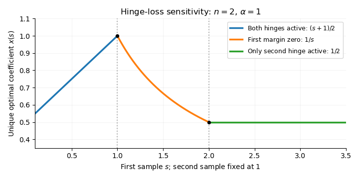

<h1 id="3/iv/solution">Solution</h1>

↑ **Parent:** [Iv](../iv.md)

**Yes: the solution map is locally affine, hence has the [Aubin property](../../../../../../aubin-property.md).** Keep the regularization parameter $\alpha>0$ fixed and define the [active hinge set](../../../../../../active-hinge-set.md)

$$
I=\{i:1-\hat a_i\hat x>0\}.
$$

Since none of the margins vanishes, the optimality condition at the reference data has no fractional weights:

$$
\hat x=\frac1{\alpha n}\sum_{i\in I}\hat a_i.
$$

For nearby $a$, define the candidate

$$
x_I(a)=\frac1{\alpha n}\sum_{i\in I}a_i.
$$

Each map $a\mapsto1-a_i x_I(a)$ is continuous and is nonzero at $\hat a$. Because there are finitely many samples, all their signs remain unchanged on a common neighborhood $U$ of $\hat a$. Therefore the same set $I$ is active at $x_I(a)$ for every $a\in U$. The [hinge-loss optimality weights](../../../../../../hinge-loss-optimality-weight.md) are still $1$ on $I$ and $0$ off $I$, and the defining equation for $x_I(a)$ proves the [subgradient optimality condition](../../../../../../subgradient-optimality-condition.md). Strong convexity makes this candidate the unique global minimizer. Consequently the [solution map of a parametric optimization problem](../../../../../../solution-map-of-a-parametric-optimization-problem.md) satisfies

$$
\boxed{S(a)=\{x(a)\},\qquad x(a)=\frac1{\alpha n}\sum_{i\in I}a_i\quad(a\in U)}.
$$

This argument establishes stability of the active pattern without presupposing continuity of the unknown optimizer; continuity is used only for an explicit candidate and then optimality is checked.

For $a,b\in U$, the [Cauchy-Schwarz inequality](../../../../../../cauchy-schwarz-inequality.md) gives

$$
\boxed{|x(a)-x(b)|\leq\frac{\sqrt{|I|}}{\alpha n}\|a-b\|_2}.
$$

This is the [Aubin property](../../../../../../aubin-property.md) with $\kappa=\sqrt{|I|}/(\alpha n)$. In fact this constant is the exact local [Lipschitz continuity](../../../../../../lipschitz-continuity.md) modulus of the affine branch, since its derivative is

$$
Dx(\hat a)[h]=\frac1{\alpha n}\sum_{i\in I}h_i.
$$

The active-set dependence of this derivative is the [active-set sensitivity of hinge-loss minimization](../../../../../../active-set-sensitivity-of-hinge-loss-minimization.md). At a vanishing margin the affine-branch argument no longer applies, although failure of this particular argument does not by itself prove failure of the [Aubin property](../../../../../../aubin-property.md).

**[Figure 2](#3/iv/image-for-two-scalar-samples-with-alpha-equal-to-one-and-data-s-1-the-optimal-coefficient-follows-two-locally-affine-branches-separated-by-a-branch-pinned-to-an-exact-hinge-margin). For two scalar samples with alpha equal to one and data (s,1), the optimal coefficient follows two locally affine branches separated by a branch pinned to an exact hinge margin**.

For the illustration, take $n=2$, $\alpha=1$, and $a=(s,1)$ with $s>0$. The [hinge-loss optimality weights](../../../../../../hinge-loss-optimality-weight.md) give

$$
x(s)=
\begin{cases}
(s+1)/2,&0<s<1,\\
1/s,&1\leq s\leq2,\\
1/2,&s>2.
\end{cases}
$$

On the middle branch the first margin is exactly zero, so that branch lies outside the strict-margin hypothesis. The example makes clear why the local affine conclusion is tied to that hypothesis, and also shows that a zero margin need not destroy local Lipschitz stability.

## ↑ Ancestors (11)

1. [Iv](../iv.md)
2. [3](../../3.md)
3. [Paper 325](../../../paper-325-split.md)
4. [Iii](../../../split.md)
5. [2016](../../../../split.md)
6. [Past exam of the mathematics course of the University of Cambridge](../../../../../split.md)
7. [Mathematics course of the University of Cambridge](../../../../../../mathematics-course-of-the-university-of-cambridge.md)
8. [Course of the University of Cambridge](../../../../../../course-of-the-university-of-cambridge.md)
9. [University of Cambridge](../../../../../../university-of-cambridge-split.md)
10. [List of universities](../../../../../../list-of-universities.md)
11. [Codex Wiki](../../../../../../split.md)
