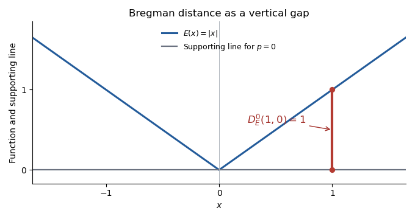

<h1 id="2/iii/solution">Solution</h1>

↑ **Parent:** [Iii](../iii.md)

For $E(x)=|x|$, the [subdifferential](../../../../../../subdifferential.md) at zero is $[-1,1]$. Choose the allowed interior [subgradient](../../../../../../subgradient.md) **$p=0$**. Its supporting line is horizontal, so the [Bregman distance](../../../../../../bregman-divergence.md) is the vertical gap from $y=0$ to $y=|x|$ at the selected input:

$$
\boxed{D_E^0(1,0)=|1|-|0|-0(1-0)=1.}
$$

More generally, an interior choice $-1<p<1$ gives $D_E^p(1,0)=1-p$. The sketch shows the particular choice $p=0$.

**[Figure 1](#2/iii/image-bregman-distance-for-the-absolute-value-function-at-x-1-from-the-reference-point-zero-using-the-subgradient-p-0). Bregman distance for the absolute-value function at x=1 from the reference point zero, using the subgradient p=0**.

## ↑ Ancestors (11)

1. [Iii](../iii.md)
2. [2](../../2.md)
3. [Paper 326](../../../paper-326-split.md)
4. [Iii](../../../split.md)
5. [2016](../../../../split.md)
6. [Past exam of the mathematics course of the University of Cambridge](../../../../../split.md)
7. [Mathematics course of the University of Cambridge](../../../../../../mathematics-course-of-the-university-of-cambridge.md)
8. [Course of the University of Cambridge](../../../../../../course-of-the-university-of-cambridge.md)
9. [University of Cambridge](../../../../../../university-of-cambridge-split.md)
10. [List of universities](../../../../../../list-of-universities.md)
11. [Codex Wiki](../../../../../../split.md)
