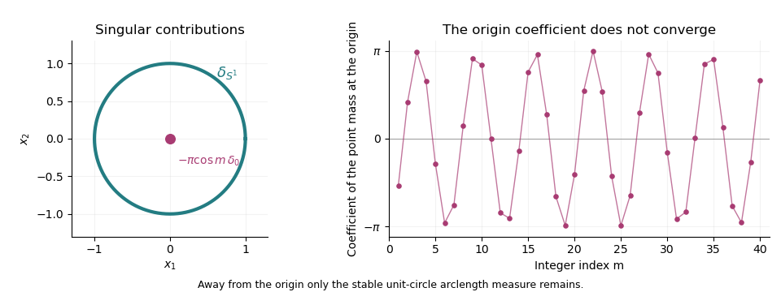

<h1 id="1/solution">Solution</h1>

↑ **Parent:** [1](../1.md)

The [test-function space](../../../../../space-of-test-functions.md) is $\mathcal D(\mathbb R^n)=C_c^\infty(\mathbb R^n)$. Its topology is the [strict inductive limit topology](../../../../../strict-inductive-limit-topology.md) of the spaces $\mathcal D_K$ of [smooth functions](../../../../../smooth-function.md) supported in a fixed compact set $K$, each with the [seminorms](../../../../../seminorm.md) $p_{K,j}(\varphi)=\max_{|\alpha|\leq j}\sup_K|\partial^\alpha\varphi|$. In particular, **a sequence converges in $\mathcal D$ precisely when its supports lie in one compact set and all its derivatives converge uniformly**. The indices $\alpha$ use [multi-index notation](../../../../../multi-index-notation.md).

The [distribution](../../../../../distribution-mathematical-analysis.md) space $\mathcal D'(\mathbb R^n)$ consists of continuous complex-linear forms on $\mathcal D$. Equivalently, for every compact $K$ there are $C_K$ and an integer $q_K\geq0$ such that

$$
|\langle u,\varphi\rangle|\leq C_K\max_{|\alpha|\leq q_K}\sup_K|\partial^\alpha\varphi|,\qquad \operatorname{supp}\varphi\subset K.
$$

We use [distributional convergence](../../../../../weak-convergence-of-distributions.md): **$u_j\to u$ means $\langle u_j,\varphi\rangle\to\langle u,\varphi\rangle$ for every $\varphi\in\mathcal D$**. The pairings are bilinear, with no complex conjugation. A [test function](../../../../../test-function.md) $f$ is identified with its [regular distribution](../../../../../regular-distribution.md) $\langle f,\varphi\rangle=\int f\varphi$.

For a [distribution](../../../../../distribution-mathematical-analysis.md) $u$ and a [test function](../../../../../test-function.md) $\psi$, their [smoothing convolution with a test function](../../../../../smoothing-convolution-with-a-test-function.md) is

$$
\boxed{(u*\psi)(x)=\langle u_y,\psi(x-y)\rangle.}
$$

It is a [smooth function](../../../../../smooth-function.md), with $\partial_x^\alpha(u*\psi)(x)=\langle u_y,\partial^\alpha\psi(x-y)\rangle$. Indeed, for $x$ in a compact neighborhood all translated tests have support in one compact set, and their difference quotients converge in the [space of test functions](../../../../../space-of-test-functions.md). Notice that $u*\psi$ need not be compactly supported.

Choose a nonnegative [mollifier](../../../../../mollifier.md) $\rho\in C_c^\infty(B_1)$ with $\int\rho=1$, and write $\rho_\varepsilon(x)=\varepsilon^{-n}\rho(x/\varepsilon)$. If $\widetilde\rho(x)=\rho(-x)$, then

$$
\langle u*\rho_\varepsilon,\varphi\rangle=\langle u,\widetilde\rho_\varepsilon*\varphi\rangle.
$$

The right-hand test tends to $\varphi$ in $\mathcal D$: its supports lie in $\operatorname{supp}\varphi+\overline B_1$ for $\varepsilon\leq1$, and every derivative converges uniformly by the approximate-identity argument. Thus the smooth regularizations converge to $u$ as [distributions](../../../../../distribution-mathematical-analysis.md).

To obtain actual compactly supported approximants, choose a [smooth cutoff function](../../../../../smooth-cutoff-function.md) $\chi$ equal to one on $B_1$ and supported in $B_2$, and set

$$
\boxed{f_j(x)=\chi(x/j)(u*\rho_{1/j})(x)\in\mathcal D(\mathbb R^n).}
$$

For each fixed [test function](../../../../../test-function.md) $\varphi$, the cutoff is identically one on its support once $j$ is large. Hence $\langle f_j,\varphi\rangle=\langle u,\widetilde\rho_{1/j}*\varphi\rangle\to\langle u,\varphi\rangle$. This proves **$\mathcal D$ is dense in $\mathcal D'$**, and in fact establishes the [density of test functions in distributions](../../../../../density-of-test-functions-in-distributions.md) and gives a convergent approximating sequence for each [distribution](../../../../../distribution-mathematical-analysis.md). The expanding cutoff is essential when $u$ has noncompact [support of a distribution](../../../../../support-of-a-distribution.md).

For the radial limit, take a [test function](../../../../../test-function.md) $\varphi$ and introduce $t=r^2-1$ in polar coordinates. The Jacobian $r\,dr=dt/2$ gives

$$
\langle u_m,\varphi\rangle=\int_{-1}^{\infty}m\sin(m|t|)A(t)\,dt,
\qquad A(t)=\frac12\int_0^{2\pi}\varphi\big(\sqrt{1+t}(\cos\omega,\sin\omega)\big)\,d\omega.
$$

When $\varphi$ is supported away from the origin, $A$ vanishes near $t=-1$ and extends to a compactly supported [smooth function](../../../../../smooth-function.md) on the whole line. The [folded sine approximation to a Dirac delta](../../../../../folded-sine-approximation-to-a-dirac-delta.md) is exposed by setting $B(s)=A(s)+A(-s)$: [integration by parts](../../../../../integration-by-parts.md) gives

$$
\int_0^{\infty}m\sin(ms)B(s)\,ds=B(0)+\int_0^{\infty}\cos(ms)B'(s)\,ds\longrightarrow2A(0),
$$

by the [Riemann-Lebesgue lemma](../../../../../riemann-lebesgue-lemma.md). Therefore

$$
\boxed{u_m\longrightarrow\delta_{S^1}\quad\text{in }\mathcal D'(\mathbb R^2\setminus\{0\}),\qquad
\langle\delta_{S^1},\varphi\rangle=\int_0^{2\pi}\varphi(\cos\omega,\sin\omega)\,d\omega.}
$$

This [surface delta distribution](../../../../../surface-delta-distribution.md) is arclength measure on the unit circle. By the [level-set normalization of a surface delta](../../../../../level-set-normalization-of-a-surface-delta.md), it is $2\delta(|x|^2-1)$: the factor two cancels the gradient magnitude $|\nabla(|x|^2-1)|=2$ on the circle. It is not twice arclength measure.

For a [test function](../../../../../test-function.md) that can meet the origin, the endpoint cannot be discarded. Now $A(-1)=\pi\varphi(0)$. Its right derivative is integrable, with $A'(-1+s)=(\pi/4)\Delta\varphi(0)+O(s)$ from differentiated Taylor expansion: the angular average cancels odd Taylor terms, so $A(t)=\pi\varphi(0)+(\pi/4)(1+t)\Delta\varphi(0)+O((1+t)^2)$ near $t=-1$. Applying [integration by parts](../../../../../integration-by-parts.md) separately on the negative and positive intervals gives

$$
\langle u_m,\varphi\rangle=2A(0)-A(-1)\cos m-\int_{-1}^{0}\cos(mt)A'(t)\,dt+\int_0^{\infty}\cos(mt)A'(t)\,dt.
$$

The last two integrals tend to zero by the [Riemann-Lebesgue lemma](../../../../../riemann-lebesgue-lemma.md). Thus the [radial quadratic oscillation defect in two dimensions](../../../../../radial-quadratic-oscillation-defect-in-two-dimensions.md) gives the stronger [oscillating point-mass defect](../../../../../oscillating-point-mass-defect.md) formula

$$
\boxed{u_m=\delta_{S^1}-\pi\cos m\,\delta_0+o_{\mathcal D'}(1).}
$$

Choose $\varphi$ supported in $B_{1/2}$ with $\varphi(0)=1$. Its pairing is $-\pi\cos m+o(1)$, which does not converge. For completeness, if $\cos m$ had a limit $L$, the recurrence $\cos(m+1)+\cos(m-1)=2\cos1\cos m$ would force $L=0$, whereas the even subsequence identity $\cos(2m)=2\cos^2m-1$ would then force $L=-1$. Consequently **there is no limit in $\mathcal D'(\mathbb R^2)$**.

**[Figure 1](#1/image-the-stable-unit-circle-arclength-contribution-and-the-oscillating-point-mass-coefficient-at-the-origin). The stable unit-circle arclength contribution and the oscillating point-mass coefficient at the origin**.

## ↑ Ancestors (10)

1. [1](../1.md)
2. [Paper 327](../../paper-327-split.md)
3. [Iii](../../split.md)
4. [2016](../../../split.md)
5. [Past exam of the mathematics course of the University of Cambridge](../../../../split.md)
6. [Mathematics course of the University of Cambridge](../../../../../mathematics-course-of-the-university-of-cambridge.md)
7. [Course of the University of Cambridge](../../../../../course-of-the-university-of-cambridge.md)
8. [University of Cambridge](../../../../../university-of-cambridge-split.md)
9. [List of universities](../../../../../list-of-universities.md)
10. [Codex Wiki](../../../../../split.md)
