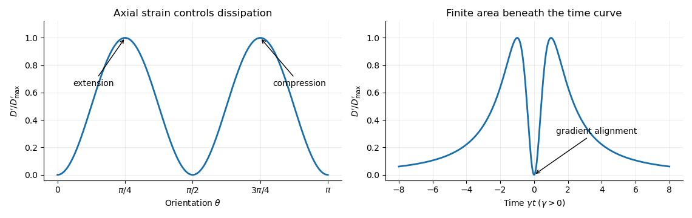
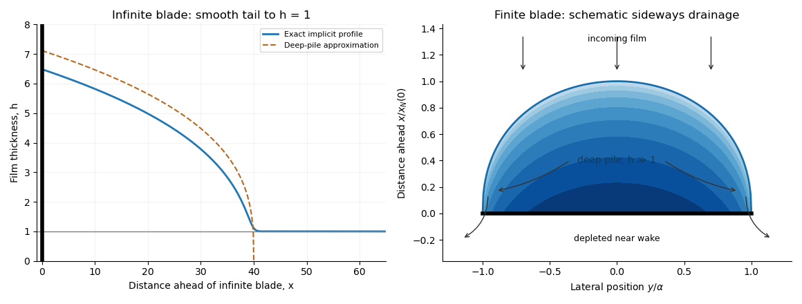

# Paper 329

↑ **Parent:** [Iii](../iii.md)

[https://www.maths.cam.ac.uk/postgrad/part-iii/files/pastpapers/2016/paper_329.pdf](https://www.maths.cam.ac.uk/postgrad/part-iii/files/pastpapers/2016/paper_329.pdf)

**Table of contents**

- [1](#1)
  - [Solution](#1/solution)
- [2](#2)
  - [Solution](#2/solution)
- [3](#3)
  - [a](#3/a)
    - [Solution](#3/a/solution)
  - [b](#3/b)
    - [Solution](#3/b/solution)
  - [c](#3/c)
    - [Solution](#3/c/solution)
- [4](#4)
  - [i](#4/i)
    - [Solution](#4/i/solution)

## 1

↑ **Parent:** [Paper 329](paper-329.md)

<h3 id="1/solution">Solution</h3>

↑ **Parent:** [1](#1)

Let $e=(\nabla\mathbf u+\nabla\mathbf u^T)/2$ be the [rate-of-strain tensor](../../../viscous-fluid-flow.md#strain-rate-tensor) and $\boldsymbol\sigma=-pI+2\mu e$ the [Newtonian fluid stress tensor](../../../viscous-fluid-flow.md#newtonian-fluid-stress-tensor). The [viscous dissipation](../../../stokes-flow.md#viscous-dissipation) is $D[\mathbf u]=2\mu\int_V e:e\,dV$. The [Minimum-dissipation theorem for Stokes flow](../../../stokes-flow.md#minimum-dissipation-theorem-for-stokes-flow) compares the [Stokes flow](../../../stokes-flow.md) with every sufficiently regular [incompressible flow](../../../fluid-mechanics.md#incompressible-flow) in the same domain having the same prescribed boundary velocity, with no [body force](../../../fluid-mechanics.md#body-force) or with a conservative [body force](../../../fluid-mechanics.md#body-force) absorbed into the [fluid pressure](../../../fluid-mechanics.md#fluid-pressure). A trial field need not satisfy the [Stokes flow](../../../stokes-flow.md) equations. Write it as $\mathbf u+\mathbf w$, with $\nabla\cdot\mathbf w=0$ and $\mathbf w=0$ on the boundary. Integration by parts, the symmetry of the [Newtonian fluid stress tensor](../../../viscous-fluid-flow.md#newtonian-fluid-stress-tensor), and $\nabla\cdot\boldsymbol\sigma=0$ give

$$
2\mu\int_V e(\mathbf u):e(\mathbf w)\,dV=\int_V\boldsymbol\sigma:\nabla\mathbf w\,dV=\int_{\partial V}\mathbf w\cdot\boldsymbol\sigma\mathbf n\,dS-\int_V\mathbf w\cdot\nabla\cdot\boldsymbol\sigma\,dV=0.
$$

Consequently **the Stokes flow minimizes dissipation**:

$$
\boxed{D[\mathbf u+\mathbf w]-D[\mathbf u]=2\mu\int_V e(\mathbf w):e(\mathbf w)\,dV\geq0.}
$$

Equality requires a [rigid body](../../../classical-mechanics.md#rigid-body-dynamics) motion of $\mathbf w$, which the prescribed boundary eliminates. Extending the flow inside the inserted particle as its [rigid body](../../../classical-mechanics.md#rigid-body-dynamics) velocity produces an admissible comparison field with zero internal [rate-of-strain tensor](../../../viscous-fluid-flow.md#strain-rate-tensor); hence the [extra dissipation due to a rigid inclusion](../../../stokes-flow.md#extra-dissipation-due-to-a-rigid-inclusion) is nonnegative.

Here and below $\mathbf n$ on $A$ points into the particle, so the [traction](../../../continuum-mechanics.md#traction) $\boldsymbol\sigma\mathbf n$ represents force exerted by the particle on the fluid. Apply the [Lorentz reciprocal theorem for Stokes flow](../../../stokes-flow.md#lorentz-reciprocal-theorem-for-stokes-flow) in the fluid region to $\mathbf u$ and the restriction of $\mathbf u_0$. The equal outer boundary velocities yield

$$
\int_{\partial V}\mathbf V_0\cdot(\boldsymbol\sigma-\boldsymbol\sigma_0)\mathbf n\,dS=\int_A(\mathbf u\cdot\boldsymbol\sigma_0\mathbf n-\mathbf u_0\cdot\boldsymbol\sigma\mathbf n)\,dS.
$$

The boundary-work formula for [viscous dissipation](../../../stokes-flow.md#viscous-dissipation) therefore gives $D'=\int_A[(\mathbf u-\mathbf u_0)\cdot\boldsymbol\sigma\mathbf n+\mathbf u\cdot\boldsymbol\sigma_0\mathbf n]dS$. The last integral is zero: $\boldsymbol\sigma_0$ is symmetric and divergence-free throughout the particle's original volume, so its total force and [torque](../../../classical-mechanics.md#torque) there vanish, and $\mathbf u$ on $A$ is a [rigid body](../../../classical-mechanics.md#rigid-body-dynamics) velocity. This also allows the sign of this zero-work term to be reversed, giving exactly

$$
\boxed{D'=\int_A(\mathbf u\cdot\boldsymbol\sigma-\mathbf u_0\cdot\boldsymbol\sigma-\mathbf u\cdot\boldsymbol\sigma_0)\cdot\mathbf n\,dS.}
$$

With the particle's centre as origin, define $\mathbf F=\int_A\boldsymbol\sigma\mathbf n\,dS$, $\mathbf G=\int_A\mathbf x\times(\boldsymbol\sigma\mathbf n)\,dS$ and the [particle stresslet tensor](../../../stokes-flow.md#particle-stresslet-tensor) $S=-\tfrac12\int_A[\mathbf x(\boldsymbol\sigma\mathbf n)+(\boldsymbol\sigma\mathbf n)\mathbf x]dS$. Contracting the linear background velocity with the [traction](../../../continuum-mechanics.md#traction) gives

$$
\boxed{D'=\mathbf F\cdot(\mathbf U-\mathbf U_0)+\mathbf G\cdot(\boldsymbol\Omega-\boldsymbol\Omega_0)+S:E_0.}
$$

The background [rate-of-strain tensor](../../../viscous-fluid-flow.md#strain-rate-tensor) $E_0$ is symmetric and trace-free; the trace of this unprojected [particle stresslet tensor](../../../stokes-flow.md#particle-stresslet-tensor) does not affect the contraction.

For the [straight-rod resistance in a linear flow](../../../stokes-flow.md#straight-rod-resistance-in-a-linear-flow), write $\Delta\mathbf U=\mathbf U-\mathbf U_0$, $\Delta\boldsymbol\Omega=\boldsymbol\Omega-\boldsymbol\Omega_0$, $M=I-\mathbf p\mathbf p/2$, and $\mathbf X=s\mathbf p$, $-L\leq s\leq L$. The [slender-body force density](../../../stokes-flow.md#slender-body-force-density) becomes $\mathbf f=C M[\Delta\mathbf U+s(\Delta\boldsymbol\Omega\times\mathbf p-E_0\mathbf p)]$. The integrals of $s$ and $s^2$ are $0$ and $2L^3/3$, respectively, so

$$
\boxed{\mathbf F=2CLM\Delta\mathbf U,\qquad\mathbf G=\frac{2CL^3}{3}\left[(I-\mathbf p\mathbf p)\Delta\boldsymbol\Omega-\mathbf p\times E_0\mathbf p\right].}
$$

For a [force-free](../../../stokes-flow.md#force-free), [torque-free](../../../stokes-flow.md#torque-free) rod, $\Delta\mathbf U=0$ and the perpendicular component of $\Delta\boldsymbol\Omega$ is $\mathbf p\times E_0\mathbf p$. Axial spin is not determined by this leading, zero-thickness [slender-body theory](../../../stokes-flow.md#slender-body-theory); it has no effect on $\mathbf p$. Put $a_p=\mathbf p\cdot E_0\mathbf p$. The vector identity $(\mathbf p\times E_0\mathbf p)\times\mathbf p=E_0\mathbf p-a_p\mathbf p$ gives

$$
\boxed{\mathbf f=-\frac C2s a_p\mathbf p,\qquad\dot{\mathbf p}=\boldsymbol\Omega_0\times\mathbf p+E_0\mathbf p-a_p\mathbf p.}
$$

The [force-free straight-rod orientation equation](../../../stokes-flow.md#force-free-straight-rod-orientation-equation) combines the background rotation with the part of strain that turns the rod; removing $a_p\mathbf p$ preserves its unit length. A [rigid body](../../../classical-mechanics.md#rigid-body-dynamics) cannot undergo the axial extension or compression imposed by $a_p$, so opposite axial forces resist that deformation. No leading [slender-body force density](../../../stokes-flow.md#slender-body-force-density) is needed when $a_p=0$, even though the rod may rotate. Its [particle stresslet tensor](../../../stokes-flow.md#particle-stresslet-tensor) and [viscous dissipation](../../../stokes-flow.md#viscous-dissipation) are

$$
\boxed{S=\frac{CL^3}{3}a_p\mathbf p\mathbf p,\qquad D'=\frac{CL^3}{3}a_p^2.}
$$

In the [simple shear flow](../../../viscous-fluid-flow.md#simple-shear-flow), $\boldsymbol\Omega_0=-\gamma\mathbf e_z/2$, $(E_0)_{xy}=(E_0)_{yx}=\gamma/2$ and $a_p=\gamma\cos\theta\sin\theta$. Thus the [rod excess dissipation in shear](../../../stokes-flow.md#rod-excess-dissipation-in-shear) is

$$
\boxed{D'(\theta)=\frac{CL^3\gamma^2}{12}\sin^2(2\theta),\qquad\dot\theta=-\gamma\sin^2\theta.}
$$

The maxima at $\theta=\pi/4,3\pi/4$ correspond to strongest axial extension and compression. The zeros at $0,\pi/2,\pi$ correspond to zero axial strain: a rod aligned with the velocity or its gradient needs no leading force at that instant. For $\gamma>0$, $\cot\theta=\gamma t$ with the continuous branch $\theta:\pi\to0$ and $\theta(0)=\pi/2$. Reversing the [shear flow](../../../fluid-mechanics.md#shear-flow) reverses the traversal. Substitution gives

$$
D'(t)=\frac{CL^3\gamma^2}{3}\frac{(\gamma t)^2}{[1+(\gamma t)^2]^2},\qquad\boxed{\int_{-\infty}^{\infty}D'(t)\,dt=\frac{\pi CL^3|\gamma|}{6}.}
$$

The $t^{-2}$ tails make the total finite; the instantaneous zero at $t=0$ lies between two maxima.

**[Figure 1](#1/image-rod-excess-dissipation-versus-orientation-and-time-in-simple-shear). Rod excess dissipation versus orientation and time in simple shear**.

For a [dilute rod suspension](../../../rheology.md#dilute-rod-suspension), the added bulk stress is the number density times the orientation average of the [particle stresslet tensor](../../../stokes-flow.md#particle-stresslet-tensor). In this ideal infinitely slender, non-interacting model, rods approach alignment with the [shear flow](../../../fluid-mechanics.md#shear-flow) and their excess [viscous dissipation](../../../stokes-flow.md#viscous-dissipation) decays. A real finite-aspect-ratio rod continues to tumble; rotational diffusion and interactions also maintain a spread of orientations. One therefore expects increased effective [viscosity](../../../fluid-mechanics.md#dynamic-viscosity), with alignment offering a mechanism for reduced excess [viscosity](../../../fluid-mechanics.md#dynamic-viscosity) at strong [shear flow](../../../fluid-mechanics.md#shear-flow). This is a qualitative expectation, not a claim that a finite rod suspension has zero steady excess stress.

## 2

↑ **Parent:** [Paper 329](paper-329.md)

<h3 id="2/solution">Solution</h3>

↑ **Parent:** [2](#2)

In the [surfactant transport with exchange relaxation](../../../fluid-mechanics.md#surfactant-transport-with-exchange-relaxation), $DC/Dt$ is the [material derivative](../../../continuum-mechanics.md#material-derivative) following an interfacial material element. The term $-C\nabla_s\cdot\mathbf u_s$ accounts for dilution by tangential stretching, while $-C(\mathbf u\cdot\mathbf n)\nabla_s\cdot\mathbf n$ accounts for changing area through normal motion and [curvature](../../../differential-geometry.md#curvature). The [surface diffusion](../../../fluid-mechanics.md#surface-diffusion) term redistributes [surfactant](../../../fluid-mechanics.md#surfactant) down concentration gradients. The exchange term relaxes its concentration towards $C_0$, through adsorption or desorption from a surrounding reservoir, on time scale $k^{-1}$.

In the bubble frame the spherical interface is stationary and impermeable. A steady [material derivative](../../../continuum-mechanics.md#material-derivative) is $\mathbf u_s\cdot\nabla_s C'$. For a linear response in the rising speed this and $C'\nabla_s\cdot\mathbf u_s$ are second order, whereas stretching of $C_0$ is first order. Thus

$$
\boxed{(D_s\Delta_s-k)C'=C_0\nabla_s\cdot\mathbf u_s.}
$$

Rotational symmetry, linear response to $\mathbf U$, and zero normal velocity allow only $\mathbf u_s=A P\mathbf U$, where $P=I-\mathbf n\mathbf n$ is the [surface tangent projector](../../../riemannian-geometry.md#surface-tangent-projector). This is the dipolar, axisymmetric sector; axisymmetry alone, without the linear-response assumption, would allow other angular dependence.

On a sphere $\mathbf n=\mathbf x/r$ and $\partial_j n_i=(\delta_{ij}-n_i n_j)/r$. Applying the [surface tangent projector](../../../riemannian-geometry.md#surface-tangent-projector) to the derivative gives the [sphere surface derivative identities](../../../riemannian-geometry.md#sphere-surface-derivative-identities)

$$
\boxed{\nabla_s\mathbf n=P/a,\quad\nabla_s\cdot\mathbf n=2/a,\quad\Delta_s\mathbf n=-2\mathbf n/a^2,\quad\nabla_s\cdot(P\mathbf U)=-2(\mathbf U\cdot\mathbf n)/a.}
$$

For example, taking a second [surface divergence](../../../riemannian-geometry.md#surface-divergence) of the first identity yields the third. Equivalently, the components of $\mathbf n$ are degree-one [spherical harmonics](../../../analysis.md#spherical-harmonic). Hence a [dipolar surfactant distribution](../../../fluid-mechanics.md#dipolar-surfactant-distribution) solves the linear equation:

$$
\boxed{C'=B\mathbf U\cdot\mathbf n,\qquad B=\frac{2A C_0 a}{ka^2+2D_s}.}
$$

The required smallness condition is **$2|A|Ua/(ka^2+2D_s)\ll1$**. [Surface diffusion](../../../fluid-mechanics.md#surface-diffusion) or exchange must smooth the concentration faster than it is redistributed by the actual interfacial velocity. We require $k\geq0$, $D_s\geq0$ and $ka^2+2D_s>0$; with neither process there is no such steady linear balance at nonzero $A$. A small [capillary number](../../../fluid-mechanics.md#capillary-number) $\mu U/\gamma_0$ also justifies the spherical approximation.

Take the normal from the inner bubble to the outer liquid, define $[\sigma]_-^+=\sigma_+-\sigma_-$, and set $\kappa=\nabla_s\cdot\mathbf n$. The [interfacial stress balance with variable surface tension](../../../fluid-mechanics.md#interfacial-stress-balance-with-variable-surface-tension) is

$$
\boxed{[\boldsymbol\sigma]_-^+\mathbf n=\gamma\kappa\mathbf n-\nabla_s\gamma.}
$$

Because $\nabla_s C'=B P\mathbf U/a$ and $\gamma=\gamma_0-\gamma_1C'$, its tangential part becomes

$$
\boxed{P[\boldsymbol\sigma]_-^+\mathbf n=\frac{6\mu A\lambda}{a}P\mathbf U,\qquad\lambda=\frac{\gamma_1 C_0 a}{3\mu(ka^2+2D_s)}.}
$$

This is a [Marangoni stress](../../../fluid-mechanics.md#marangoni-effect): surface-tension gradients oppose the clean-bubble circulation.

Use the [Unscaled Papkovich–Neuber representation](../../../stokes-flow.md#unscaled-papkovich-neuber-representation), $\mathbf u=\nabla(\mathbf x\cdot\boldsymbol\Phi+\chi)-2\boldsymbol\Phi$ and $p=2\mu\nabla\cdot\boldsymbol\Phi$. The constant vector potential gives $\mathbf u\to-\mathbf U$. In the decaying, linear axisymmetric sector, a vector monopole and scalar dipole provide the two constants needed at the sphere; other equivalent potential choices amount to a representation freedom. The PDF potential contains the factor $a$ omitted in the TeX aid. With that factor restored, the exterior velocity is

$$
\mathbf u=-\mathbf U-\alpha a\left(\frac{\mathbf U}{r}+\frac{(\mathbf U\cdot\mathbf x)\mathbf x}{r^3}\right)+\beta a^3\left(-\frac{\mathbf U}{r^3}+\frac{3(\mathbf U\cdot\mathbf x)\mathbf x}{r^5}\right),\qquad p=-\frac{2\mu\alpha a\,\mathbf U\cdot\mathbf x}{r^3}.
$$

At the interface, no penetration gives $\beta-\alpha=1/2$, and the tangential velocity gives $A=-(1+\alpha+\beta)$. **Using the traction coefficient printed in equation (3)**, the tangential stress condition gives $2\beta=A\lambda$. The requested algebraic answers are therefore

$$
\boxed{A_{\rm printed}=-\frac1{2(1+\lambda)},\quad\alpha_{\rm printed}=-\frac{2+3\lambda}{4(1+\lambda)},\quad\beta_{\rm printed}=-\frac{\lambda}{4(1+\lambda)}.}
$$

**There is a factor-of-two error in the PDF traction.** Direct differentiation of the preceding velocity with the [Newtonian fluid stress tensor](../../../viscous-fluid-flow.md#newtonian-fluid-stress-tensor) gives

$$
\boldsymbol\sigma\mathbf n=\frac{6\mu}{a}\left[\beta\mathbf U+(\alpha-3\beta)(\mathbf U\cdot\mathbf n)\mathbf n\right],
$$

rather than its printed coefficient $12\mu/a$. In particular the tangential [traction](../../../continuum-mechanics.md#traction) is $6\mu\beta P\mathbf U/a$. Keeping the same definition of $\lambda$, the physically consistent [translating surfactant-coated bubble](../../../fluid-mechanics.md#translating-surfactant-coated-bubble) instead has $\beta=A\lambda$ and

$$
\boxed{A=-\frac1{2(1+2\lambda)},\quad\alpha=-\frac{1+3\lambda}{2(1+2\lambda)},\quad\beta=-\frac{\lambda}{2(1+2\lambda)}.}
$$

The two sets must not be silently conflated. As a useful check, the no-slip limit has the usual total [Stokes flow](../../../stokes-flow.md) drag $6\pi\mu aU$ with the corrected [traction](../../../continuum-mechanics.md#traction); the printed [traction](../../../continuum-mechanics.md#traction) would double it.

Both versions give $A=-1/2$, $\alpha=-1/2$, $\beta=0$ when $\lambda\to0$: the interface is tangentially stress-free and circulates as a clean inviscid bubble. For $\lambda\to\infty$, $A\to0$, $\alpha\to-3/4$, $\beta\to-1/4$: the interface is immobile in the bubble frame and behaves as a no-slip sphere. The [Marangoni stress](../../../fluid-mechanics.md#marangoni-effect) remains finite because $\lambda A$ has a nonzero limit. The concentration smallness condition still has to hold; large $\lambda$ is not by itself a complete linearization criterion.

The normal component is balanced by the inner gas pressure and the normal capillary stress $\gamma\kappa$, including the variation of $\gamma$, together with the [hydrostatic pressure](../../../fluid-mechanics.md#hydrostatic-pressure) difference responsible for buoyancy. A spatially uniform inner pressure alone cannot balance the dipolar [traction](../../../continuum-mechanics.md#traction). To make the [normal stress balance on a translating bubble](../../../fluid-mechanics.md#normal-stress-balance-on-a-translating-bubble) explicit, let $\Delta\rho_b$ be the outer-minus-inner [mass density](../../../fluid-mechanics.md#density). After removing the equilibrium Laplace pressure, the corrected outer normal [traction](../../../continuum-mechanics.md#traction) has dynamic part $-3\mu(1+\lambda)(\mathbf U\cdot\mathbf n)/[a(1+2\lambda)]$. Its degree-one balance is

$$
\Delta\rho_bga\cos\vartheta-\frac{3\mu(1+\lambda)}{a(1+2\lambda)}U\cos\vartheta=-\frac{2\gamma_1 B}{a}U\cos\vartheta.
$$

Thus, if a terminal speed is desired, **$U=\Delta\rho_bga^2(1+2\lambda)/[3\mu(1+3\lambda)]$**, interpolating between the clean-bubble and rigid-sphere speeds. A degree-one shape displacement is merely a translation of the sphere, so the balance determines its rise speed, rather than a dipolar shape distortion.

## 3

↑ **Parent:** [Paper 329](paper-329.md)

<h3 id="3/a">a</h3>

↑ **Parent:** [3](#3)

<h4 id="3/a/solution">Solution</h4>

↑ **Parent:** [A](#3/a)

The [hydrostatic approximation](../../../fluid-mechanics.md#hydrostatic-approximation) gives $p=\rho g(h-z)$ above the horizontal floor, up to atmospheric pressure. The horizontal [Stokes flow](../../../stokes-flow.md) equation is $\mu\mathbf u_{zz}=\rho g\nabla h$, with the [no-slip boundary condition](../../../viscous-fluid-flow.md#no-slip-boundary-condition) at $z=0$ and zero tangential stress on the [free surface](../../../fluid-mechanics.md#free-surface). Integrating twice gives $\mathbf u=(\rho g/\mu)\nabla h\,(z^2/2-hz)$ and the [lubrication gravity-current flux](../../../viscous-fluid-flow.md#lubrication-gravity-current-flux)

$$
\mathbf q_{\rm lab}=-\frac{\rho g}{3\mu}h^3\nabla h.
$$

For the [squeegee lubrication model](../../../viscous-fluid-flow.md#squeegee-lubrication-model), use $h_0$ vertically, $\ell=\rho gh_0^3/(\mu U)$ horizontally, and $\ell/U$ in time. If $X$ is the laboratory coordinate in the direction of travel, set $x=(X-Ut)/\ell$, $y=Y/\ell$, $t=Ut_{\rm lab}/\ell$, and $h=h_{\rm lab}/h_0$. The blade half-length is $\alpha=L/\ell$. The moving-frame flux is $\mathbf q=-h\mathbf e_x-h^3\nabla h/3$. Conservation of volume gives **the dimensionless lubrication equation**

$$
\boxed{h_t-h_x=\frac13\nabla\cdot(h^3\nabla h),\qquad h\to1\quad(x\to\infty).}
$$

Using these scales as representative of the actual flow, [lubrication theory](../../../viscous-fluid-flow.md#lubrication-theory) requires a small aspect ratio and negligible inertia relative to vertical viscous resistance:

$$
\boxed{\frac{h_0}{\ell}=\frac{\mu U}{\rho gh_0^2}\ll1,\qquad\frac{\rho Uh_0^2}{\mu\ell}=\frac{U^2}{gh_0}\ll1.}
$$

The second is the [Reynolds number](../../../fluid-mechanics.md#reynolds-number) based on $h_0$, multiplied by $h_0/\ell$. Surface tension is neglected as assumed. Large piles, rounded gaps, and narrow end regions need their own local slope and inertia checks if these representative scales cease to describe them.

<h3 id="3/b">b</h3>

↑ **Parent:** [3](#3)

<h4 id="3/b/solution">Solution</h4>

↑ **Parent:** [B](#3/b)

For an infinite blade, the steady moving-frame flux is constant and its upstream value is $-1$. The [infinite-blade gravity pile](../../../viscous-fluid-flow.md#infinite-blade-gravity-pile) therefore satisfies $-h-h^3h_x/3=-1$, or $h_x=-3(h-1)/h^3$. Integrating gives

$$
\boxed{X(h)=\frac{h^3}{9}+\frac{h^2}{6}+\frac h3+\frac13\log(h-1)=x_0-x,\qquad h>1.}
$$

An additive constant in $X$ simply shifts $x_0$. The head at the blade, and hence $x_0$, must supply the pressure difference that makes the flux beneath the blade equal to the incoming flux. For $x_0\gg1$ the deep part has $h\simeq[9(x_0-x)]^{1/3}$, followed by a smooth transition to $h=1$ with $h-1$ exponentially small, proportional to $e^{-3x}$. Thus $x_0$ is an approximate nose coordinate, not a sharp front of the exact solution.

Near the rounded edge the [parabolic lubrication gap](../../../viscous-fluid-flow.md#parabolic-lubrication-gap) is $d(x)=\epsilon+\delta-\sqrt{\delta^2-x^2}\simeq\epsilon+x^2/(2\delta)$. In the blade frame the floor moves at $-1$ and the blade is stationary. The [Couette-Poiseuille flow in a thin gap](../../../viscous-fluid-flow.md#couette-poiseuille-flow-in-a-thin-gap) has flux $q_x=-d/2-d^3p_x/12$. Let $J=-q_x$ be positive leakage towards the rear, and let $\Delta p=p_{\rm ahead}-p_{\rm rear}>0$. The narrow-gap integrals are

$$
I_2=\int_{-\infty}^{\infty}\frac{dx}{d^2}=\frac{\pi\sqrt{2\delta}}{2\epsilon^{3/2}},\qquad I_3=\int_{-\infty}^{\infty}\frac{dx}{d^3}=\frac{3\pi\sqrt{2\delta}}{8\epsilon^{5/2}}.
$$

Integrating the pressure gradient gives $\Delta p=12JI_3-6I_2$, so the [squeegee gap leakage flux](../../../viscous-fluid-flow.md#squeegee-gap-leakage-flux) is

$$
\boxed{J\simeq\frac{2\epsilon}{3}+\frac{2\epsilon^{5/2}}{9\pi\sqrt{2\delta}}\Delta p.}
$$

The first term is the floor-driven contribution. For the steady infinite blade, $J=1$, so $\Delta p\simeq9\pi\sqrt{2\delta}/(2\epsilon^{5/2})$. The [hydrostatic pressure](../../../fluid-mechanics.md#hydrostatic-pressure) difference is the height difference at the two sides. A fully developed rear layer of thickness $h_-$ has moving-frame flux $-h_-$; hence **$h_-=1$**, and

$$
\boxed{h(0^+)\simeq\frac{9\pi\sqrt{2\delta}}{2\epsilon^{5/2}}.}
$$

The large head eventually forces all the arriving film beneath an infinite blade. Taking a perfectly closed gap instead would eliminate this steady state.

**[Figure 2](#3/b/image-infinite-blade-height-profile-and-schematic-finite-blade-pile-with-sideways-drainage). Infinite-blade height profile and schematic finite-blade pile with sideways drainage**.

<h3 id="3/c">c</h3>

↑ **Parent:** [3](#3)

<h4 id="3/c/solution">Solution</h4>

↑ **Parent:** [C](#3/c)

For a long finite blade with negligible under-blade flux, fluid accumulates upstream and escapes sideways around the ends. The [finite-blade side-drainage pile](../../../viscous-fluid-flow.md#finite-blade-side-drainage-pile) has $h\gg1$ in a broad upstream region, while its near wake is strongly depleted; far from the blade the incoming film still has thickness one. The schematic in the preceding figure shows the pile, incoming flow, and escape around the ends.

Away from the nose and end regions, the streamwise flux nearly cancels: $-h-h^3h_x/3\simeq0$. This is the deep part of the [infinite-blade gravity pile](../../../viscous-fluid-flow.md#infinite-blade-gravity-pile), so $h^3=9[x_N(y)-x]$ is the appropriate local profile. The hierarchy $1\ll x_N\ll\alpha$ makes streamwise variation much faster than lateral variation, while allowing lateral flow to carry away the integrated influx.

Set $I(y)=\int_0^{x_N(y)}h^4\,dx$ and $Q_y=\int_0^{x_N(y)}q_y\,dx$. Since $q_y=-h^3h_y/3=-(h^4)_y/12$ and the leading deep-pile profile vanishes at its nose, $Q_y=-I'/12$. Integrating steady conservation in $x$ gives $Q_y'=1$: the wall has zero normal flux, whereas the matched incoming film supplies flux $-1$ per unit blade length. Equivalently one can integrate to an upstream matching plane, where the moving-frame flux is exactly $-1$; this avoids incorrectly assigning zero incoming flux to the approximate zero-height nose. Symmetry gives $Q_y(0)=0$. Therefore

$$
\boxed{\frac{d}{dy}\int_0^{x_N}h^4\,dx=-12y.}
$$

At leading order the deep pile ends at $y=\pm\alpha$, so $I(\pm\alpha)=0$, giving $I=6(\alpha^2-y^2)$. Direct integration of the cubic profile yields $I=(3/7)9^{4/3}x_N^{7/3}$. Thus

$$
\boxed{x_N(y)=\frac{[126(\alpha^2-y^2)]^{3/7}}9,\qquad h(0^+,y)=[126(\alpha^2-y^2)]^{1/7}.}
$$

In particular $x_N(0)=O(\alpha^{6/7})\ll\alpha$ and $h(0,0)=O(\alpha^{2/7})\gg1$, confirming the assumed hierarchy. The local nose and tip regions are outside this leading deep-pile approximation.

Apply the [squeegee gap leakage flux](../../../viscous-fluid-flow.md#squeegee-gap-leakage-flux) with $\Delta p$ at most of order the largest pile height. A sufficient negligible-leakage criterion is

$$
\boxed{\frac{2\epsilon^{5/2}}{9\pi\sqrt{2\delta}}(126\alpha^2)^{1/7}\ll1,\qquad\epsilon\ll\delta\ll1.}
$$

The floor-driven $2\epsilon/3$ must also be small, as it is in this regime. In scaling form the additional restriction is **$\epsilon\ll\delta^{1/5}\alpha^{-4/35}$**. The total leakage divided by incoming volume flux has the same scaling; blade length does not introduce an extra factor of $\alpha$.

## 4

↑ **Parent:** [Paper 329](paper-329.md)

<h3 id="4/i">i</h3>

↑ **Parent:** [4](#4)

<h4 id="4/i/solution">Solution</h4>

↑ **Parent:** [I](#4/i)

Write $d_1=\rho_0-\rho_1>0$, $d_2=\rho_2-\rho_0>0$, and choose the common undisturbed interface pressure $P$. The [hydrostatic pressure](../../../fluid-mechanics.md#hydrostatic-pressure) is $p_1=P-\rho_1gz$ in the upper fluid and $p_2=P-\rho_2gz$ in the lower fluid. Continuity of [hydrostatic pressure](../../../fluid-mechanics.md#hydrostatic-pressure) across both current interfaces gives

$$
p_0=P-\rho_0gz+d_1gh_1=P-\rho_0gz-d_2gh_2,\qquad \boxed{d_1h_1=-d_2h_2.}
$$

Thus $h_1=d_2h/(d_1+d_2)$ and $h_2=-d_1h/(d_1+d_2)$. This [isostatic depth partition of an interfacial current](../../../reduced-gravity.md#isostatic-depth-partition-of-an-interfacial-current) expresses local vertical buoyancy balance: a displaced column with an imbalance would move vertically until the partition was restored. With the [hydrostatic pressure](../../../fluid-mechanics.md#hydrostatic-pressure) $P-\rho_0gz$ subtracted, the pressure within the current is $\Delta\rho gh$, where

$$
\boxed{\Delta\rho=\frac{(\rho_0-\rho_1)(\rho_2-\rho_0)}{\rho_2-\rho_1},\qquad\mathbf f=-\Delta\rho g h_r\mathbf e_r.}
$$

The equivalent [body force](../../../fluid-mechanics.md#body-force) is outward for a profile decreasing with $r$. Its magnitude is $\Delta\rho g|h_r|$; the derivative without an absolute value is a signed quantity.

For an [ambient-controlled interfacial plug current](../../../reduced-gravity.md#ambient-controlled-interfacial-plug-current), integrating the [body force](../../../fluid-mechanics.md#body-force) through depth gives radial force per area $O(\Delta\rho gH^2/R)$. The ambient [Stokes flow](../../../stokes-flow.md) varies over distance $R$, exerting [traction](../../../continuum-mechanics.md#traction) $O(\mu u/R)$, so **$u\sim\Delta\rho gH^2/\mu$**. The current's internal shear supports the ambient [traction](../../../continuum-mechanics.md#traction) with a velocity difference $\Delta u\sim(\mu u/R)H/(\lambda\mu)$; $\Delta u/u\sim H/(\lambda R)\ll1$ requires $\lambda\gg H/R$. The force per area from its in-plane viscous extension is $O(\lambda\mu uH/R^2)$, negligible against ambient [traction](../../../continuum-mechanics.md#traction) when $\lambda\ll R/H$. Together these give the [viscosity window for an interfacial plug current](../../../reduced-gravity.md#viscosity-window-for-an-interfacial-plug-current)

$$
\boxed{H/R\ll\lambda\ll R/H.}
$$

Fixed volume gives $V\sim HR^2$, and the spreading velocity has the scale $\dot R$. Thus $\dot R\sim\Delta\rho gV^2/(\mu R^4)$ and

$$
\boxed{R\sim At^{1/5},\qquad A\sim(\Delta\rho gV^2/\mu)^{1/5}.}
$$

Choosing $A$ so that $R=At^{1/5}$ exactly, the [similarity solution](../../../partial-differential-equation.md#similarity-solution) has $h=(V/A^2)t^{-2/5}F(\eta)$, $\eta=r/(At^{1/5})$, and $u=At^{-4/5}U(\eta)$. In radial conservation $h_t+r^{-1}(rhu)_r=0$, substitution gives $(\eta FU)'=(\eta^2F)'/5$. Regularity and no source at the centre remove the integration constant. Therefore **the radial plug velocity is linear**:

$$
\boxed{U(\eta)=\eta/5,\qquad u=r/(5t).}
$$

For the [disc-traction analogy for an interfacial current](../../../reduced-gravity.md#disc-traction-analogy-for-an-interfacial-current), subtract the imposed straining flow from the stationary-disc solution. The perturbation has velocity $-Er\mathbf e_r$ on the disc and zero far-field velocity. Reverse its sign: the resulting [Stokes flow](../../../stokes-flow.md) is driven by a radially expanding disc with velocity $Er\mathbf e_r$ in otherwise quiescent fluid. The background straining flow contributes no radial shear [traction](../../../continuum-mechanics.md#traction) on $z=0$, so the given disc [traction](../../../continuum-mechanics.md#traction) changes sign. This step uses [Linearity of Stokes flow](../../../stokes-flow.md#linearity-of-stokes-flow), [Uniqueness of Stokes flow](../../../stokes-flow.md#uniqueness-of-stokes-flow), and the [no-slip boundary condition](../../../viscous-fluid-flow.md#no-slip-boundary-condition). The thin plug current has the same leading boundary velocity and hence the same ambient resistance. Each face contributes $-8\mu Er/[\pi\sqrt{R^2-r^2}]$; both faces must be counted. With $E=1/(5t)$, radial force balance is

$$
-\Delta\rho g h h_r=\frac{16\mu Er}{\pi\sqrt{R^2-r^2}},\qquad\boxed{h h_r=-\frac{16\mu r}{5\pi\Delta\rho gt\sqrt{R^2-r^2}}.}
$$

Integrate with $h(R,t)=0$. The [interfacial plug-current similarity profile](../../../reduced-gravity.md#interfacial-plug-current-similarity-profile) is

$$
\boxed{h^2=\frac{32\mu\sqrt{R^2-r^2}}{5\pi\Delta\rho gt},\qquad h=H(1-r^2/R^2)^{1/4},\quad H^2=\frac{32\mu R}{5\pi\Delta\rho gt}.}
$$

Volume integration gives $V=2\pi\int_0^Rrh\,dr=4\pi HR^2/5$. Eliminating $H$ gives the full prefactor:

$$
\boxed{R(t)=\left(\frac{125\Delta\rho gV^2t}{512\pi\mu}\right)^{1/5}.}
$$

The formal edge slope diverges, so a narrow edge region lies outside the thin-current approximation. Its [traction](../../../continuum-mechanics.md#traction) and volume contributions are integrable, and this is a leading thin-current solution rather than a uniformly valid edge description.

For a [diffusion-controlled solute gravity current](../../../reduced-gravity.md#diffusion-controlled-solute-gravity-current), excess solute mass, not enriched-fluid volume, is conserved. At late times the effective [mass density](../../../fluid-mechanics.md#density) excess is proportional to solute concentration, so $\Delta\rho(t)R^2H\sim\Delta\rho_0V_0$, and $H\sim(Dt)^{1/2}$. The same ambient resistance scaling gives

$$
\dot R\sim\frac{\Delta\rho_0gV_0}{\mu}\frac{(Dt)^{1/2}}{R^2},\qquad\boxed{R(t)\sim\left(\frac{\Delta\rho_0gV_0}{\mu}\right)^{1/3}D^{1/6}t^{1/2}.}
$$

This scaling does not determine a universal numerical prefactor. The [mass diffusivity](../../../fluid-mechanics.md#mass-diffusivity) $D$ controls the growing depth, while dilution weakens buoyancy; assuming a fixed current volume would incorrectly retain the $t^{1/5}$ law. The thin-layer requirement becomes $(\mu D/(\Delta\rho_0gV_0))^{1/3}\ll1$; when only dissolved solute changes the upper fluid, its [viscosity](../../../fluid-mechanics.md#dynamic-viscosity) is of order the ambient [viscosity](../../../fluid-mechanics.md#dynamic-viscosity), consistent with the plug-current window.

## ↑ Ancestors (8)

1. [Iii](../iii.md)
2. [2016](../../2016.md)
3. [Past exam of the mathematics course of the University of Cambridge](../../../past-exam-of-the-mathematics-course-of-the-university-of-cambridge.md)
4. [Mathematics course of the University of Cambridge](../../../university-of-cambridge.md#mathematics-course-of-the-university-of-cambridge)
5. [Course of the University of Cambridge](../../../university-of-cambridge.md#course-of-the-university-of-cambridge)
6. [University of Cambridge](../../../university-of-cambridge.md)
7. [List of universities](../../../README.md#list-of-universities)
8. [Codex Wiki](../../../README.md)
