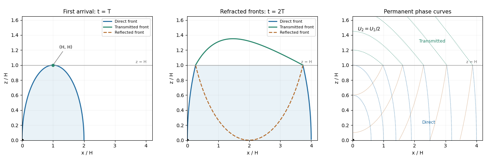

<h1 id="1/c/solution">Solution</h1>

↑ **Parent:** [C](../c.md)

Consider the permanent [stationary topographic internal gravity wave](../../../../../../stationary-topographic-internal-gravity-wave.md) component of a localized source, with constant [buoyancy frequency](../../../../../../buoyancy-frequency.md) in each layer and positive $U_1,U_2$. A sufficiently broad obstacle spectrum is assumed. The [dispersion relation](../../../../../../dispersion-relation.md) on the upward branch in a uniform layer is

$$
\omega=kU-\frac{Nk}{(k^2+m^2)^{1/2}}.
$$

For a stationary wave, $K=(k^2+m^2)^{1/2}=N/U$. Differentiating before imposing stationarity gives the laboratory [group velocity](../../../../../../group-velocity.md)

$$
(c_{gx},c_{gz})=U(\cos^2\theta,\sin\theta\cos\theta),\qquad \cos\theta=k/K.
$$

The vertical component is at most $U/2$, attained at $\theta=\pi/4$. The [first arrival of a stationary internal wavefront at a layer boundary](../../../../../../first-arrival-of-a-stationary-internal-wavefront-at-a-layer-boundary.md) is thus

$$
\boxed{T=\frac{2H}{U_1},\qquad x(T)=H.}
$$

If the obstacle spectrum lacks that [wavenumber](../../../../../../wavenumber.md), the first arrival of its actual permanent wave packets is later. This statement concerns the stationary part; arbitrary long-wave startup transients are not bounded by this particular envelope.

In the lower layer an elapsed propagation time $t$ gives $x=U_1t\cos^2\theta_1$, $z=U_1t\sin\theta_1\cos\theta_1$. Elimination gives the [causal envelope of stationary internal waves](../../../../../../causal-envelope-of-stationary-internal-waves.md)

$$
\boxed{\left(x-\frac{U_1t}{2}\right)^2+z^2=\left(\frac{U_1t}{2}\right)^2,\qquad z\geq0.}
$$

Later-emitted packets fill the interior. At $t=T$ this semicircle just touches $H$ at $x=H$. At $2T$ its unobstructed continuation would reach $2H$, but rays that hit the interface must instead be refracted or reflected.

For a lower-layer ray labelled by $\theta_1$, its interface arrival time and point are

$$
\tau_1=\frac{H}{U_1\sin\theta_1\cos\theta_1},\qquad x_H=H\cot\theta_1.
$$

The [refraction of a stationary internal-wave causal envelope](../../../../../../refraction-of-a-stationary-internal-wave-causal-envelope.md) conserves horizontal [wavenumber](../../../../../../wavenumber.md), so $\cos\theta_2=(U_2N_1)/(U_1N_2)\cos\theta_1$. If $\tau_1\leq t$ and $0<\cos\theta_2<1$, its transmitted front is parametrized by

$$
\boxed{x=x_H+(t-\tau_1)U_2\cos^2\theta_2,\qquad z=H+(t-\tau_1)U_2\sin\theta_2\cos\theta_2.}
$$

The reflected front instead has $x=U_1t\cos^2\theta_1$ and $z=2H-U_1t\sin\theta_1\cos\theta_1$, until it reaches the ground. At $2T$ that first return just touches the ground. If the $\pi/4$ incident ray is evanescent upstairs, upper-layer propagating arrival is delayed until an allowed ray reaches $H$; this does not change the first lower-layer arrival time $T$.

The [stationary phase of topographic internal waves](../../../../../../stationary-phase-of-topographic-internal-waves.md) also gives the phase sketch. In a uniform lower layer the [Fourier transform](../../../../../../fourier-transform.md) integrand has phase $kx+m(k)z$. The [stationary phase method](../../../../../../stationary-phase-method.md) requires $x=kz/m$, giving phase $\Phi=(N_1/U_1)(x^2+z^2)^{1/2}$. Thus the dominant permanent phase lines are downstream circular arcs centred on the obstacle. Reflected phase arcs have the image source $(0,2H)$. Upstairs the ray arriving at $(x_H,H)$ has phase

$$
\Phi=kx_H+m_1H+k(x-x_H)+m_2(z-H),
$$

which is continuous at the interface and determines refracted constant-phase curves. Individual monochromatic components have straight phase lines of slope $-k/m_j$ instead; the arcs describe their localized-source superposition.

**[Figure 1](#1/c/image-permanent-internal-wave-causal-fronts-at-t-and-2t-with-refracted-and-reflected-phase-curves). Permanent internal-wave causal fronts at T and 2T, with refracted and reflected phase curves**.

The schematic uses $H=U_1=N=1$ and $U_2=U_1/2$. It shows the direct front below $H$, the transmitted front above it and the reflected front below it; dotted arcs are permanent phase curves, not material trajectories.

## ↑ Ancestors (11)

1. [C](../c.md)
2. [1](../../1.md)
3. [Paper 330](../../../paper-330-split.md)
4. [Iii](../../../split.md)
5. [2016](../../../../split.md)
6. [Past exam of the mathematics course of the University of Cambridge](../../../../../split.md)
7. [Mathematics course of the University of Cambridge](../../../../../../mathematics-course-of-the-university-of-cambridge.md)
8. [Course of the University of Cambridge](../../../../../../course-of-the-university-of-cambridge.md)
9. [University of Cambridge](../../../../../../university-of-cambridge-split.md)
10. [List of universities](../../../../../../list-of-universities.md)
11. [Codex Wiki](../../../../../../split.md)
