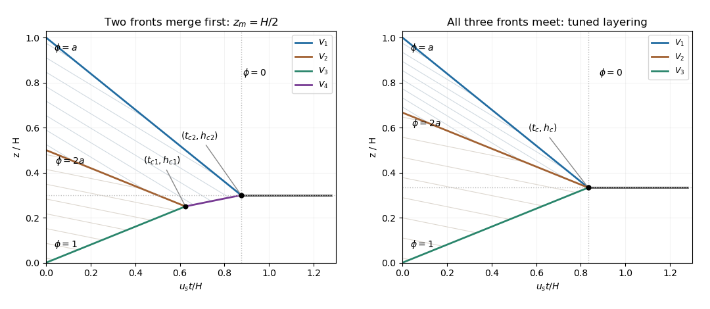

<h1 id="4/b/solution">Solution</h1>

↑ **Parent:** [B](../b.md)

Take $z$ upward and $u_s>0$ downward. The [quadratic hindered-settling flux](../../../../../../quadratic-hindered-settling-flux.md) is $j(\phi)=-u_s\phi(1-\phi)$. Particle [mass conservation](../../../../../../mass-conservation.md) gives the [kinematic sedimentation](../../../../../../kinematic-sedimentation.md) equation

$$
\phi_t+j(\phi)_z=0,\qquad \frac{dz}{dt}=j'(\phi)=u_s(2\phi-1),\qquad\frac{d\phi}{dt}=0
$$

on a smooth [characteristic curve](../../../../../../characteristic-curve.md). Integrate the [scalar conservation law](../../../../../../scalar-conservation-law.md) across a moving discontinuity: $V[\phi]=[j]$. The [Rankine-Hugoniot condition](../../../../../../rankine-hugoniot-conditions.md) gives the [settling shock speed](../../../../../../settling-shock-speed.md)

$$
\boxed{V=\frac{j(\phi_R)-j(\phi_L)}{\phi_R-\phi_L}=u_s(\phi_L+\phi_R-1),}
$$

where $L$ is the lower side and $R$ the upper side. Since $j''=2u_s>0$, a compressive [shock](../../../../../../shock-wave.md) has $\phi_L>\phi_R$ and its neighboring [characteristic curves](../../../../../../characteristic-curve.md) point into it.

Put $a=\phi_1$, so $\phi_2=2a$, with $0<a<1/4$. The [two-layer sedimentation with a compression shock](../../../../../../two-layer-sedimentation-with-a-compression-shock.md) has

$$
\boxed{V_1=-u_s(1-a),\qquad V_2=-u_s(1-3a),\qquad V_3=2u_sa.}
$$

These respectively separate upper suspension from clear fluid, lower suspension from upper suspension, and deposit from lower suspension. Their initial positions are $H,z_m,0$. The [characteristic curves](../../../../../../characteristic-curve.md) in the two suspended states have slopes $u_s(2a-1)$ and $u_s(4a-1)$; clear-fluid and deposit [characteristic curves](../../../../../../characteristic-curve.md) have slopes $-u_s$ and $u_s$.

For $z_m=H/2$, $V_2$ and $V_3$ meet first. Their intersection gives

$$
\boxed{t_{c1}=\frac{z_m}{u_s(1-a)}=\frac{H}{2u_s(1-a)},\qquad h_{c1}=\frac{2az_m}{1-a}=\frac{aH}{1-a}.}
$$

The potential meeting of the upper two fronts would take $(H-z_m)/(2u_sa)$, which is later in the stated range. The new front separates [particle volume fraction](../../../../../../particle-volume-fraction.md) one from [particle volume fraction](../../../../../../particle-volume-fraction.md) $a$, so

$$
\boxed{V_4=u_sa.}
$$

It follows $z=h_{c1}+u_sa(t-t_{c1})$ until it meets $z=H-u_s(1-a)t$. The final mass-conserving intersection is

$$
\boxed{t_{c2}=\frac{H(1-a)-az_m}{u_s(1-a)},\qquad h_{c2}=a(H+z_m).}
$$

For $z_m=H/2$, these are $H(1-3a/2)/[u_s(1-a)]$ and $3aH/2$.

The PDF prints a plus sign before $az_m/H$ in the stopping-time numerator. That sign contradicts both the top-front trajectory and particle [mass conservation](../../../../../../mass-conservation.md); the correct sign is minus, as derived here. Once all particles are deposited, the remaining $1$-to-$0$ front is stationary because both limiting fluxes vanish.

**[Figure 2](#4/b/image-settling-compression-shocks-their-merger-and-the-triple-point-initial-layering). Settling compression shocks, their merger, and the triple-point initial layering**.

The first panel shows the two-front merger and the final intersection, with straight [characteristic curves](../../../../../../characteristic-curve.md) in each suspended layer. The second panel shows the tuned three-front intersection.

## ↑ Ancestors (11)

1. [B](../b.md)
2. [4](../../4.md)
3. [Paper 330](../../../paper-330-split.md)
4. [Iii](../../../split.md)
5. [2016](../../../../split.md)
6. [Past exam of the mathematics course of the University of Cambridge](../../../../../split.md)
7. [Mathematics course of the University of Cambridge](../../../../../../mathematics-course-of-the-university-of-cambridge.md)
8. [Course of the University of Cambridge](../../../../../../course-of-the-university-of-cambridge.md)
9. [University of Cambridge](../../../../../../university-of-cambridge-split.md)
10. [List of universities](../../../../../../list-of-universities.md)
11. [Codex Wiki](../../../../../../split.md)
