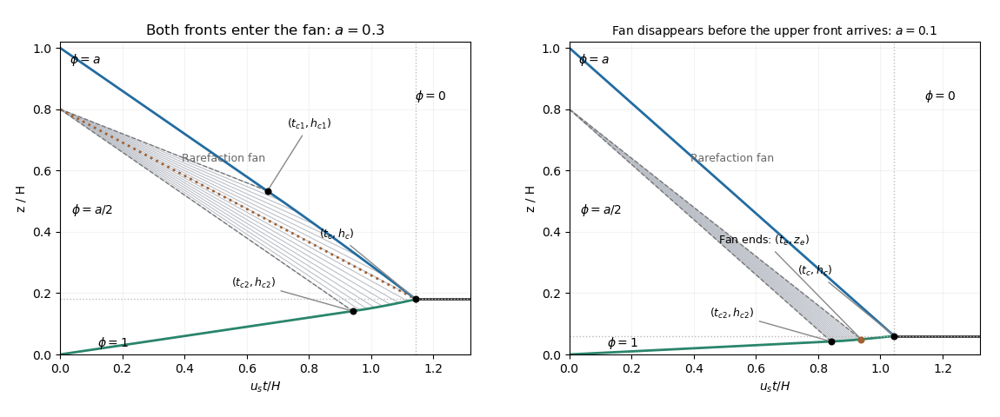

<h1 id="4/d/solution">Solution</h1>

↑ **Parent:** [D](../d.md)

Put $a=\phi_1$, $b=\phi_2=a/2$, $z_m=4H/5$, $L=H-z_m$ and $D=(1-b)z_m$. The [quadratic hindered-settling flux](../../../../../../quadratic-hindered-settling-flux.md) is convex. At the initial internal interface its lower [particle volume fraction](../../../../../../particle-volume-fraction.md) is smaller than its upper [particle volume fraction](../../../../../../particle-volume-fraction.md), so [characteristic curves](../../../../../../characteristic-curve.md) diverge: the [entropy solution](../../../../../../entropy-solution.md) has a [settling rarefaction fan](../../../../../../settling-rarefaction-fan.md), not a compression [shock](../../../../../../shock-wave.md). Within this fan,

$$
\boxed{\phi(z,t)=\frac12\left(1+\frac{z-z_m}{u_st}\right),\qquad z_m+u_s(2b-1)t<z<z_m+u_s(2a-1)t.}
$$

The two bounding straight [shocks](../../../../../../shock-wave.md) initially have

$$
\boxed{V_1=-u_s(1-a),\qquad V_2=u_sb=\frac{u_sa}{2}.}
$$

The upper front's nominal meeting with the fan's upper edge occurs at

$$
\boxed{t_{c1}=\frac{L}{u_sa}=\frac{H}{5u_sa},\qquad h_{c1}=H-\frac{(1-a)L}{a}=\frac{H(6a-1)}{5a}.}
$$

The lower front meets the fan's lower edge at

$$
\boxed{t_{c2}=\frac{z_m}{u_s(1-b)}=\frac{4H}{5u_s(1-a/2)},\qquad h_{c2}=\frac{bz_m}{1-b}=\frac{4aH}{5(2-a)}.}
$$

The lower meeting is always physical in the stated range. The upper meeting need not happen before the suspension disappears; this distinction matters for sufficiently small $a$.

For the [curved settling fronts within a rarefaction fan](../../../../../../curved-settling-fronts-within-a-rarefaction-fan.md), the [Rankine-Hugoniot condition](../../../../../../rankine-hugoniot-conditions.md) gives $\dot z_u=u_s(\phi-1)$ at the clear-fluid front and $\dot z_d=u_s\phi$ at the deposit front. Substitution of the fan [particle volume fraction](../../../../../../particle-volume-fraction.md) and matching to the straight sections gives

$$
\boxed{z_u=z_m-u_st+2\sqrt{u_saLt},\qquad z_d=z_m+u_st-2\sqrt{u_sDt}.}
$$

The first curve applies after $t_{c1}$ if that meeting occurs, and the second after $t_{c2}$ until it leaves the fan or deposition ends. If both fronts meet inside the fan, their intersection is

$$
\boxed{t_c=\frac{(\sqrt{aL}+\sqrt D)^2}{u_s},\qquad h_c=aL+bz_m=\frac35aH.}
$$

The [last surviving characteristic of a settling fan](../../../../../../last-surviving-characteristic-of-a-settling-fan.md) joins $(z_m,0)$ to $(h_c,t_c)$. It has constant [particle volume fraction](../../../../../../particle-volume-fraction.md)

$$
\boxed{\phi_* =\frac{\sqrt{aL}}{\sqrt{aL}+\sqrt D},\qquad\frac{h_c-z_m}{t_c}=u_s(2\phi_*-1).}
$$

It is swallowed simultaneously by the clear-fluid and deposit [shocks](../../../../../../shock-wave.md) at final deposition. This requires $b\leq\phi_*\leq a$, which in the given geometry is equivalent to

$$
\boxed{a\geq a_*=1-\sqrt{\frac23}.}
$$

Equality places the last [characteristic curve](../../../../../../characteristic-curve.md) on the upper fan edge. In the generic fan-intersection regime $a>a_*$, both nominal meetings and the two curved fronts are realized.

For $0<a<a_*$ there is [early extinction of a settling rarefaction fan](../../../../../../early-extinction-of-a-settling-rarefaction-fan.md). The deposit [shock](../../../../../../shock-wave.md) reaches the upper fan edge before the clear-fluid front does, at

$$
t_e=\frac{D}{u_s(1-a)^2},\qquad z_e=z_m+u_s(2a-1)t_e.
$$

It then travels through the remaining uniform [particle volume fraction](../../../../../../particle-volume-fraction.md) $a$ with speed $u_sa$. The upper front retains $V_1$ until the final intersection. Since the final bed height is still $h_c=3aH/5$, the actual stopping time is

$$
\boxed{t_c=\frac{H-h_c}{u_s(1-a)}=\frac{H(1-3a/5)}{u_s(1-a)},\qquad0<a<a_*.}
$$

In this regime $(h_{c1},t_{c1})$ is only an extrapolated intersection; for $a<1/6$ its extrapolated height is even negative. The line joining the initial internal interface to the final point would have a [particle volume fraction](../../../../../../particle-volume-fraction.md) greater than $a$, so it is not a [characteristic curve](../../../../../../characteristic-curve.md) emitted by that fan. **The single fan-[characteristic curve](../../../../../../characteristic-curve.md) stopping-time construction does not apply to the entire printed interval $0

**[Figure 3](#4/d/image-settling-rarefaction-fan-with-curved-fronts-and-the-small-concentration-regime-where-the-fan-disappears-early). Settling rarefaction fan with curved fronts, and the small-concentration regime where the fan disappears early**.

Both panels label the actual final deposit height and time; the second shows the deposit [shock](../../../../../../shock-wave.md) leaving the fan while the upper front remains straight. Finally, the [density inversion in a settling suspension](../../../../../../density-inversion-in-a-settling-suspension.md) puts more particles, hence denser fluid, above lighter fluid. [Rayleigh-Taylor instability](../../../../../../rayleigh-taylor-instability.md) and overturning can accompany this profile in a real container. They are excluded by the one-dimensional quiescent [kinematic sedimentation](../../../../../../kinematic-sedimentation.md) model used for these calculations.

## ↑ Ancestors (11)

1. [D](../d.md)
2. [4](../../4.md)
3. [Paper 330](../../../paper-330-split.md)
4. [Iii](../../../split.md)
5. [2016](../../../../split.md)
6. [Past exam of the mathematics course of the University of Cambridge](../../../../../split.md)
7. [Mathematics course of the University of Cambridge](../../../../../../mathematics-course-of-the-university-of-cambridge.md)
8. [Course of the University of Cambridge](../../../../../../course-of-the-university-of-cambridge.md)
9. [University of Cambridge](../../../../../../university-of-cambridge-split.md)
10. [List of universities](../../../../../../list-of-universities.md)
11. [Codex Wiki](../../../../../../split.md)
