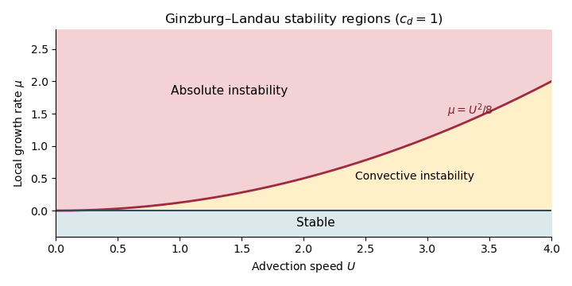

# Paper 331

↑ **Parent:** [Iii](../iii.md)

[https://www.maths.cam.ac.uk/postgrad/part-iii/files/pastpapers/2016/paper_331.pdf](https://www.maths.cam.ac.uk/postgrad/part-iii/files/pastpapers/2016/paper_331.pdf)

**Table of contents**

- [1](#1)
  - [a](#1/a)
    - [Solution](#1/a/solution)
  - [b](#1/b)
    - [Solution](#1/b/solution)
- [2](#2)
  - [a](#2/a)
    - [Solution](#2/a/solution)
  - [b](#2/b)
    - [Solution](#2/b/solution)
  - [c](#2/c)
    - [Solution](#2/c/solution)
- [3](#3)
  - [a](#3/a)
    - [i](#3/a/i)
      - [Solution](#3/a/i/solution)
    - [ii](#3/a/ii)
      - [Solution](#3/a/ii/solution)
    - [iii](#3/a/iii)
      - [Solution](#3/a/iii/solution)
  - [b](#3/b)
    - [i](#3/b/i)
      - [Solution](#3/b/i/solution)
    - [ii](#3/b/ii)
      - [Solution](#3/b/ii/solution)
    - [iii](#3/b/iii)
      - [Solution](#3/b/iii/solution)
  - [c](#3/c)
    - [i](#3/c/i)
      - [Solution](#3/c/i/solution)
    - [ii](#3/c/ii)
      - [Solution](#3/c/ii/solution)
- [4](#4)
  - [a](#4/a)
    - [Solution](#4/a/solution)
  - [b](#4/b)
    - [i](#4/b/i)
      - [Solution](#4/b/i/solution)
    - [ii](#4/b/ii)
      - [Solution](#4/b/ii/solution)
    - [iii](#4/b/iii)
      - [Solution](#4/b/iii/solution)
    - [iv](#4/b/iv)
      - [Solution](#4/b/iv/solution)
    - [v](#4/b/v)
      - [Solution](#4/b/v/solution)
    - [vi](#4/b/vi)
      - [Solution](#4/b/vi/solution)

## 1

↑ **Parent:** [Paper 331](paper-331.md)

<h3 id="1/a">a</h3>

↑ **Parent:** [1](#1)

<h4 id="1/a/solution">Solution</h4>

↑ **Parent:** [A](#1/a)

Introduce the [thermal expansion coefficient](../../../thermodynamics.md#thermal-expansion-coefficient) $\alpha_T=-\rho_0^{-1}(\partial\rho/\partial T)$, so the linear [equation of state](../../../thermodynamics.md#equation-of-state) is $\rho=\rho_0[1-\alpha_T(T-T_0)]$. With gravity $-g\widehat{\boldsymbol z}$, the resting [conductive state of Rayleigh-Bénard convection](../../../viscous-fluid-flow.md#conductive-state-of-rayleigh-benard-convection) satisfies the steady [heat equation](../../../diffusion-equation.md#heat-equation) and [hydrostatic pressure](../../../fluid-mechanics.md#hydrostatic-pressure) balance. Consequently

$$
\boxed{\boldsymbol u_b=0,\qquad T_b(z)=T_0+\Delta T(1-z/d),}
$$

and, up to an arbitrary constant,

$$
\boxed{P_b(z)=P_b(0)-\rho_0g\left[(1-\alpha_T\Delta T)z+\frac{\alpha_T\Delta T}{2d}z^2\right].}
$$

Indeed $P_b'=-g\rho_b$, where $\rho_b=\rho_0[1-\alpha_T\Delta T(1-z/d)]$.

The [Boussinesq approximation](../../../geophysical-fluid-dynamics.md#boussinesq-approximation) retains temperature-dependent [mass density](../../../fluid-mechanics.md#density) in [buoyancy](../../../fluid-mechanics.md#buoyancy) while replacing it by $\rho_0$ in inertial coefficients; it requires $|\alpha_T\Delta T|\ll1$. Subtracting the [conductive state of Rayleigh-Bénard convection](../../../viscous-fluid-flow.md#conductive-state-of-rayleigh-benard-convection) and dropping products of perturbations gives the dimensional [Linearized Boussinesq equations](../../../geophysical-fluid-dynamics.md#linearized-boussinesq-equations)

$$
\partial_{t_*}\boldsymbol u_*=-\rho_0^{-1}\nabla_*p_*+g\alpha_T\theta_*\widehat{\boldsymbol z}+\nu\nabla_*^2\boldsymbol u_*,\qquad
\partial_{t_*}\theta_*-\frac{\Delta T}{d}w_*=\kappa\nabla_*^2\theta_*,\qquad \nabla_*\cdot\boldsymbol u_*=0.
$$

The minus sign in the temperature equation comes from $\boldsymbol u_*\cdot\nabla_*T_b=-w_*\Delta T/d$.

Use the [thermal-diffusion scaling of a convection layer](../../../viscous-fluid-flow.md#thermal-diffusion-scaling-of-a-convection-layer)

$$
\boldsymbol x_*=d\boldsymbol x,\qquad t_*=\frac{d^2}{\kappa}t,\qquad
\boldsymbol u_*=\frac\kappa d\boldsymbol u,\qquad
\theta_*=\Delta T\theta,\qquad p_*=\frac{\rho_0\kappa^2}{d^2}p.
$$

The [Rayleigh number](../../../geophysics.md#rayleigh-number) and [Prandtl number](../../../thermodynamics.md#prandtl-number) are

$$
\boxed{\mathrm{Ra}=\frac{g\alpha_T\Delta T d^3}{\nu\kappa},\qquad \mathrm{Pr}=\frac\nu\kappa.}
$$

Thus **the nondimensional perturbation equations are**

$$
\boxed{\partial_t\boldsymbol u=-\nabla p+\mathrm{Ra}\,\mathrm{Pr}\,\theta\widehat{\boldsymbol z}+\mathrm{Pr}\nabla^2\boldsymbol u,\qquad
\partial_t\theta-w=\nabla^2\theta,\qquad \nabla\cdot\boldsymbol u=0.}
$$

Here $\nu$ is [kinematic viscosity](../../../fluid-mechanics.md#kinematic-viscosity), $\kappa$ is [thermal diffusivity](../../../thermodynamics.md#thermal-diffusivity), and positive $\mathrm{Ra}$ denotes destabilizing heating from below for $\alpha_T>0$.

<h3 id="1/b">b</h3>

↑ **Parent:** [1](#1)

<h4 id="1/b/solution">Solution</h4>

↑ **Parent:** [B](#1/b)

A direct elimination of [pressure](../../../thermodynamics.md#pressure) gives the same result as taking a double [curl](../../../calculus.md#curl) of the momentum equation. [Incompressibility](../../../fluid-mechanics.md#incompressible-flow) gives $\nabla^2p=\mathrm{Ra}\,\mathrm{Pr}\,\partial_z\theta$. Apply $\nabla^2$ to the vertical momentum equation and subtract this pressure derivative to obtain

$$
\boxed{\partial_t\nabla^2w=\mathrm{Ra}\,\mathrm{Pr}\,\nabla_h^2\theta+\mathrm{Pr}\nabla^4w,\qquad
\partial_t\theta=w+\nabla^2\theta.}
$$

Here $\nabla_h^2=\partial_x^2+\partial_y^2$ is the horizontal [Laplacian](../../../calculus.md#laplacian). At $z=0,1$, impermeability gives $w=0$ and fixed temperature gives $\theta=0$. The [stress-free boundary condition](../../../viscous-fluid-flow.md#stress-free-boundary-condition) gives $\partial_zu=\partial_zv=0$, since horizontal derivatives of the boundary value $w=0$ vanish. Differentiating [incompressibility](../../../fluid-mechanics.md#incompressible-flow) once in $z$ therefore gives

$$
\boxed{w=\partial_z^2w=\theta=0\quad\text{at }z=0,1.}
$$

For a horizontal [Fourier mode](../../../fourier-analysis.md#fourier-mode) $X=e^{i(k_xx+k_yy)}$, $\nabla_h^2X=-\lambda^2X$ with real $\lambda=\sqrt{k_x^2+k_y^2}$. More generally the nonnegative spectrum of $-\nabla_h^2$ follows by [integration by parts](../../../calculus.md#integration-by-parts) for periodic or square-integrable horizontal disturbances. Substituting the separated [normal mode](../../../wave-equation.md#normal-mode) gives, with $D=d/dz$,

$$
\sigma(D^2-\lambda^2)W=-\mathrm{Ra}\,\mathrm{Pr}\lambda^2\Theta+\mathrm{Pr}(D^2-\lambda^2)^2W,\qquad
(D^2-\lambda^2-\sigma)\Theta=-W.
$$

The [boundary conditions](../../../differential-equation.md#boundary-condition) admit a complete [Fourier sine series](../../../fourier-series.md#fourier-sine-series) in $z$. For a nonzero horizontal [wavenumber](../../../wave-equation.md#wavenumber), take $W=W_n\sin(n\pi z)$, $\Theta=\Theta_n\sin(n\pi z)$, and set $a_n^2=\lambda^2+n^2\pi^2$. The two amplitude equations are

$$
a_n^2(\sigma+\mathrm{Pr}a_n^2)W_n=\mathrm{Ra}\,\mathrm{Pr}\lambda^2\Theta_n,\qquad
(\sigma+a_n^2)\Theta_n=W_n.
$$

Thus **the [stress-free convection growth-rate polynomial](../../../viscous-fluid-flow.md#stress-free-convection-growth-rate-polynomial) is**

$$
\boxed{(\sigma+\mathrm{Pr}a_n^2)(\sigma+a_n^2)=\frac{\mathrm{Ra}\,\mathrm{Pr}\lambda^2}{a_n^2}.}
$$

Its [discriminant](../../../polynomial.md#discriminant) is $(\mathrm{Pr}-1)^2a_n^4+4\mathrm{Ra}\,\mathrm{Pr}\lambda^2/a_n^2$, so both [growth rates](../../../wave-equation.md#growth-rate) are real for $\mathrm{Ra}>0$. For $\mathrm{Ra}<0$, its two coefficients after the leading term are positive: their sum gives $\sigma_1+\sigma_2=-(1+\mathrm{Pr})a_n^2<0$, and their product is $\mathrm{Pr}(a_n^4-\mathrm{Ra}\lambda^2/a_n^2)>0$. Real roots are both negative; nonreal roots have real part $-(1+\mathrm{Pr})a_n^2/2<0$. **Hence stable heating from above damps every mode.** Horizontally uniform thermal modes and uncoupled horizontal viscous modes are also purely damped; impermeability and [incompressibility](../../../fluid-mechanics.md#incompressible-flow) exclude a horizontally uniform nonzero $w$.

Because the unstable-side roots are real, the onset is stationary, an [exchange of stabilities in stress-free convection](../../../viscous-fluid-flow.md#exchange-of-stabilities-in-stress-free-convection). Setting $\sigma=0$ gives the [free-slip convection neutral curve](../../../viscous-fluid-flow.md#free-slip-convection-neutral-curve)

$$
\mathrm{Ra}_n(\lambda)=\frac{(\lambda^2+n^2\pi^2)^3}{\lambda^2}.
$$

With $x=\lambda^2$, its derivative has the sign of $2x-n^2\pi^2$. Its minimum is at $x=n^2\pi^2/2$, with value $27n^4\pi^4/4$. Minimizing also over $n\geq1$ gives **the critical values**

$$
\boxed{\lambda_c=\frac\pi{\sqrt2},\qquad\mathrm{Ra}_c=\frac{27\pi^4}{4}.}
$$

## 2

↑ **Parent:** [Paper 331](paper-331.md)

<h3 id="2/a">a</h3>

↑ **Parent:** [2](#2)

<h4 id="2/a/solution">Solution</h4>

↑ **Parent:** [A](#2/a)

Use the [Boussinesq approximation](../../../geophysical-fluid-dynamics.md#boussinesq-approximation) with a constant inertial reference [mass density](../../../fluid-mechanics.md#density) $\rho_0$, keeping the background [mass density](../../../fluid-mechanics.md#density) gradient in [buoyancy](../../../fluid-mechanics.md#buoyancy). Write $V(z)=\overline U(z)-c$ and $P=\widehat p/\rho_0$. For $k\ne0$, the linearized [normal mode](../../../wave-equation.md#normal-mode) equations are

$$
ikV\widehat u+\overline U'\widehat w=-ikP,\qquad
ikV\widehat w=-P'-\frac g{\rho_0}\widehat\rho,\qquad
ikV\widehat\rho+\overline\rho'\widehat w=0,\qquad
ik\widehat u+\widehat w'=0.
$$

The reference [mass density](../../../fluid-mechanics.md#density) is chosen close to the background values, whose relative variation must be small. Hydrostatic background [pressure](../../../thermodynamics.md#pressure) satisfies $\overline p'=-g\overline\rho$.

From [incompressibility](../../../fluid-mechanics.md#incompressible-flow), $\widehat u=i\widehat w'/k$. The horizontal momentum equation and the density equation then give

$$
P=\frac{V\widehat w'-\overline U'\widehat w}{ik},\qquad
\widehat\rho=-\frac{\overline\rho'\widehat w}{ikV}.
$$

Substitute these into the vertical momentum equation and multiply by $ik$:

$$
-k^2V\widehat w=-V\widehat w''+\overline U''\widehat w+\frac{g\overline\rho'}{\rho_0V}\widehat w.
$$

For $V\ne0$, rearrangement gives **the [Taylor–Goldstein equation](../../../gravity-wave.md#taylor-goldstein-equation)**

$$
\boxed{\widehat w''-k^2\widehat w-\frac{\overline U''}{\overline U-c}\widehat w+\frac{N^2}{(\overline U-c)^2}\widehat w=0,\qquad
N^2=-\frac g{\rho_0}\overline\rho'.}
$$

The [buoyancy frequency](../../../gravity-wave.md#buoyancy-frequency) $N$ is real for stable stratification, where $\overline\rho'<0$. Points where $\overline U=c$ are [critical levels of an internal gravity wave](../../../gravity-wave.md#critical-level-of-an-internal-gravity-wave); the derivation there is understood through a limiting or piecewise formulation. The printed density gradient is $\overline\rho'$, not the pressure gradient accidentally substituted in the local TeX.

<h3 id="2/b">b</h3>

↑ **Parent:** [2](#2)

<h4 id="2/b/solution">Solution</h4>

↑ **Parent:** [B](#2/b)

Let $\widehat\eta$ be the displacement of a material interface and use $[f]_-^+=f_+-f_-$. On each side, the [kinematic boundary condition](../../../fluid-mechanics.md#kinematic-boundary-condition) is

$$
\widehat w_\pm=ik(\overline U_\pm-c)\widehat\eta.
$$

There is one displaced material interface, so its displacement is continuous. Thus **the first jump condition is**

$$
\boxed{\left[\frac{\widehat w}{\overline U-c}\right]_-^+=0.}
$$

In particular, [vertical velocity](../../../fluid-mechanics.md#vertical-velocity) need not be continuous when the background [velocity](../../../classical-mechanics.md#velocity) jumps.

With no [surface tension](../../../fluid-mechanics.md#surface-tension), [pressure continuity](../../../fluid-mechanics.md#pressure-continuity) applies on the displaced interface, rather than at its undisplaced height. Linearizing gives $[\widehat p+\widehat\eta\,\overline p']_-^+=0$. Since $\overline p'=-g\overline\rho$, this becomes $[\widehat p-g\overline\rho\widehat\eta]_-^+=0$. The horizontal momentum calculation in part (a) gives

$$
\widehat p=\frac{\rho_0}{ik}\bigl[(\overline U-c)\widehat w'-\overline U'\widehat w\bigr].
$$

Substitute this and $\widehat\eta=\widehat w/[ik(\overline U-c)]$ to obtain **the second jump condition**:

$$
\boxed{\left[(\overline U-c)\widehat w'-\overline U'\widehat w-\frac{g\overline\rho}{\rho_0}\frac{\widehat w}{\overline U-c}\right]_-^+=0.}
$$

These [jump conditions for stratified inviscid shear flow](../../../gravity-wave.md#jump-conditions-for-stratified-inviscid-shear-flow) use one-sided values of $\overline U'$ and apply to jumps of [mass density](../../../fluid-mechanics.md#density), [vorticity](../../../fluid-mechanics.md#vorticity), or [velocity](../../../classical-mechanics.md#velocity). If $\overline U$ is continuous, the first condition reduces to continuity of $\widehat w$; a jump of [vorticity](../../../fluid-mechanics.md#vorticity) generally still prevents continuity of $\widehat w'$. This derivation avoids multiplying singular distributional derivatives of a discontinuous [velocity](../../../classical-mechanics.md#velocity) in the [Taylor–Goldstein equation](../../../gravity-wave.md#taylor-goldstein-equation).

<h3 id="2/c">c</h3>

↑ **Parent:** [2](#2)

<h4 id="2/c/solution">Solution</h4>

↑ **Parent:** [C](#2/c)

Take $k>0$, without loss for this symmetric real base state, and write $s=1+J$, $e=e^{-2\alpha}$, and $y=\widetilde c^{\,2}$. The given quartic becomes a real quadratic $y^2+Ay+B=0$. Its constant term factors as

$$
B=\frac{[2\alpha-s(1+e)][2\alpha-s(1-e)]}{4\alpha^2}.
$$

Therefore $B<0$ exactly when

$$
\frac{2\alpha}{1+e^{-2\alpha}}<1+J<\frac{2\alpha}{1-e^{-2\alpha}}.
$$

A negative product means the two quadratic roots are real and of opposite sign: the [discriminant](../../../polynomial.md#discriminant) is $A^2-4B>0$. The negative root gives a pair $\widetilde c=\pm i\sqrt{-y_-}$. One sign has positive [temporal growth rate](../../../wave-equation.md#growth-rate) $kc_i$ and is unstable. Using the definitions of the hyperbolic functions gives **the required unstable band**:

$$
\boxed{\frac{\alpha e^\alpha}{\cosh\alpha}<1+J<\frac{\alpha e^\alpha}{\sinh\alpha}.}
$$

This proves the [unstable band of a three-layer stratified shear flow](../../../hydrodynamic-stability.md#unstable-band-of-a-three-layer-stratified-shear-flow) directly, without needing to solve all four quartic roots.

For the wave interpretation, consider either interface in isolation with decaying [normal modes](../../../wave-equation.md#normal-mode) $\widehat w=w_0e^{-k|z-z_i|}$. Put $S=\Delta U/h$, $U_i=\overline U(z_i)$, and $v=c-U_i$, the intrinsic [phase velocity](../../../wave-equation.md#phase-velocity). At either interface $[\overline\rho]=-\Delta\rho/2$, while $[\overline U']=-S$ at the upper interface and $+S$ at the lower one. The [jump conditions for stratified inviscid shear flow](../../../gravity-wave.md#jump-conditions-for-stratified-inviscid-shear-flow) give the [gravity-vorticity interface wave](../../../gravity-wave.md#gravity-vorticity-interface-wave) relation

$$
2kv^2-[\overline U']v-\frac{g\Delta\rho}{2\rho_0}=0.
$$

For stable density jumps, $J\geq0$, both intrinsic branches are real. In units $C=2c/\Delta U$, the isolated wave speeds are

$$
C_u=1+\frac{-1\pm\sqrt{1+8\alpha J}}{4\alpha},\qquad
C_l=-1+\frac{1\pm\sqrt{1+8\alpha J}}{4\alpha}.
$$

The upper wave travelling against its positive background current has $C_u=1-[1+\sqrt{1+8\alpha J}]/(4\alpha)$. The lower wave travelling against its negative background current has the opposite speed, $C_l=-C_u$. Their [counterpropagating wave resonance in a three-layer shear flow](../../../hydrodynamic-stability.md#counterpropagating-wave-resonance-in-a-three-layer-shear-flow) occurs at $C_u=C_l=0$, which gives

$$
\boxed{1+J=2\alpha\quad\text{for the isolated-wave resonance}.}
$$

At large [wavenumber](../../../wave-equation.md#wavenumber), coupling across the separation $h$ is exponentially weak, of order $e^{-kh}=e^{-2\alpha}$. The unstable band becomes

$$
1+J=2\alpha+O(\alpha e^{-2\alpha}),
$$

with full width $4\alpha e^{-2\alpha}+O(\alpha e^{-6\alpha})$. It is a [counterpropagating wave instability](../../../hydrodynamic-stability.md#counterpropagating-wave-instability): the two waves propagate oppositely relative to their local currents but have almost equal laboratory [phase velocities](../../../wave-equation.md#phase-velocity), allowing weak coupling to lock their phases and extract mean-flow energy. The [unstable band of a three-layer stratified shear flow](../../../hydrodynamic-stability.md#unstable-band-of-a-three-layer-stratified-shear-flow) thus becomes narrowly concentrated around this resonance. For fixed $J$, arbitrarily large $k$ lies outside that band; large-$k$ resonance requires $J$ to grow with $\alpha$.

## 3

↑ **Parent:** [Paper 331](paper-331.md)

<h3 id="3/a">a</h3>

↑ **Parent:** [3](#3)

<h4 id="3/a/i">i</h4>

↑ **Parent:** [A](#3/a)

<h5 id="3/a/i/solution">Solution</h5>

↑ **Parent:** [I](#3/a/i)

Under the convention $e^{i(kx-\omega t)}$, a mode's amplitude grows as $e^{\omega_i t}$. The [linear stability analysis](../../../dynamical-systems.md#linear-stability) of real-[wavenumber](../../../wave-equation.md#wavenumber) disturbances is therefore summarized by

$$
\boxed{\omega_{i,\max}<0:\ \text{strictly stable},\qquad
\omega_{i,\max}>0:\ \text{linearly unstable}.}
$$

At $\omega_{i,\max}=0$ there is marginal or neutral [hydrodynamic stability](../../../hydrodynamic-stability.md): no [normal mode](../../../wave-equation.md#normal-mode) grows exponentially, but some may fail to decay. If “linearly stable” includes neutral modes, its condition is $\omega_{i,\max}\leq0$. These modal statements do not rule out [transient growth from non-normal modes](../../../hydrodynamic-stability.md#transient-growth-from-non-normal-modes) or algebraic growth.

<h4 id="3/a/ii">ii</h4>

↑ **Parent:** [A](#3/a)

<h5 id="3/a/ii/solution">Solution</h5>

↑ **Parent:** [Ii](#3/a/ii)

The fixed observer is the ray $V=0$. The physically selected zero-[group velocity](../../../wave-equation.md#group-velocity) saddle defines the [absolute wavenumber](../../../hydrodynamic-stability.md#absolute-wavenumber) $k_0$ and [absolute frequency](../../../hydrodynamic-stability.md#absolute-frequency) $\omega_0$:

$$
\boxed{\omega'(k_0)=0,\qquad D(k_0,\omega_0)=0,\qquad\omega_0=\omega(k_0).}
$$

For a smooth frequency branch with $D_\omega\ne0$, the saddle condition is equivalently $D_k(k_0,\omega_0)=0$. The [absolute growth rate](../../../hydrodynamic-stability.md#absolute-growth-rate) is

$$
\boxed{\sigma(0)=\operatorname{Im}\omega_0.}
$$

Here $k_0$ and $\omega_0$ can be complex. A physical [saddle point](../../../analysis.md#saddle-point) is selected by the localized impulse response and deformation of its [Fourier transform](../../../analysis.md#fourier-transform) contour; an arbitrary algebraic stationary point need not determine [absolute hydrodynamic instability](../../../hydrodynamic-stability.md#absolute-hydrodynamic-instability).

<h4 id="3/a/iii">iii</h4>

↑ **Parent:** [A](#3/a)

<h5 id="3/a/iii/solution">Solution</h5>

↑ **Parent:** [Iii](#3/a/iii)

For a temporally unstable base flow, the relevant [saddle growth rate along a ray](../../../hydrodynamic-stability.md#saddle-growth-rate-along-a-ray) distinguishes two cases in the chosen observation frame:

$$
\boxed{\begin{aligned}
\omega_{i,\max}>0,\quad\sigma(0)<0&:\ \text{convective hydrodynamic instability},\\
\sigma(0)>0&:\ \text{absolute hydrodynamic instability}.
\end{aligned}}
$$

A [convective hydrodynamic instability](../../../hydrodynamic-stability.md#convective-hydrodynamic-instability) amplifies a travelling [wave packet](../../../wave-equation.md#wave-packet) but lets a localized disturbance decay at any fixed point. An [absolute hydrodynamic instability](../../../hydrodynamic-stability.md#absolute-hydrodynamic-instability) grows at a fixed point. The separating case $\sigma(0)=0$ is marginal in exponential rate and can have an algebraic prefactor. In a frame moving with $V$, replace $\sigma(0)$ by $\sigma(V)=\operatorname{Im}(\omega_\star-Vk_\star)$: this distinction depends on the observation frame.

<h3 id="3/b">b</h3>

↑ **Parent:** [3](#3)

<h4 id="3/b/i">i</h4>

↑ **Parent:** [B](#3/b)

<h5 id="3/b/i/solution">Solution</h5>

↑ **Parent:** [I](#3/b/i)

In the [linear complex Ginzburg-Landau equation](../../../partial-differential-equation.md#linear-complex-ginzburg-landau-equation), take $U,c_d,\mu$ real. **$U$ gives [advection](../../../fluid-mechanics.md#advection)**, carrying the envelope downstream at speed $U$. **$c_d$ gives [wave dispersion](../../../wave-equation.md#wave-dispersion)**: the imaginary part of the second-derivative coefficient changes wave phase without directly dissipating a real-[wavenumber](../../../wave-equation.md#wavenumber) [Fourier mode](../../../fourier-analysis.md#fourier-mode). **$\mu$ gives local linear production or damping**: a spatially uniform perturbation grows for $\mu>0$ and decays for $\mu<0$.

The real part of the diffusion coefficient is the scaled value one. It smooths the envelope and damps a real-[wavenumber](../../../wave-equation.md#wavenumber) [Fourier mode](../../../fourier-analysis.md#fourier-mode) at rate $k^2$. Thus the [linear complex Ginzburg-Landau equation](../../../partial-differential-equation.md#linear-complex-ginzburg-landau-equation) models competing [advection](../../../fluid-mechanics.md#advection), smoothing through a [diffusion equation](../../../diffusion-equation.md), [wave dispersion](../../../wave-equation.md#wave-dispersion) and local growth, rather than nonlinear saturation.

<h4 id="3/b/ii">ii</h4>

↑ **Parent:** [B](#3/b)

<h5 id="3/b/ii/solution">Solution</h5>

↑ **Parent:** [Ii](#3/b/ii)

For a [normal mode](../../../wave-equation.md#normal-mode), $\partial_t\mapsto-i\omega$, $\partial_x\mapsto ik$, and $\partial_x^2\mapsto-k^2$. Substitution into the [linear complex Ginzburg-Landau equation](../../../partial-differential-equation.md#linear-complex-ginzburg-landau-equation) gives

$$
-i\omega+ikU-\mu+(1+ic_d)k^2=0.
$$

Therefore **the dispersion relation is**

$$
\boxed{D(k,\omega)=-i\omega+ikU-\mu+(1+ic_d)k^2=0,\qquad
\omega=Uk+(c_d-i)k^2+i\mu.}
$$

For real $k$, its [temporal growth rate](../../../wave-equation.md#growth-rate) is $\omega_i=\mu-k^2$, with unique maximum $\mu$ at $k=0$. Its real [angular frequency](../../../classical-mechanics.md#angular-frequency) is $Uk+c_dk^2$, displaying the separate [advection](../../../fluid-mechanics.md#advection) and [wave dispersion](../../../wave-equation.md#wave-dispersion) terms.

<h4 id="3/b/iii">iii</h4>

↑ **Parent:** [B](#3/b)

<h5 id="3/b/iii/solution">Solution</h5>

↑ **Parent:** [Iii](#3/b/iii)

The [dispersion relation](../../../wave-equation.md#dispersion-relation) gives the zero-[group velocity](../../../wave-equation.md#group-velocity) saddle

$$
k_0=-\frac{U}{2(c_d-i)},\qquad
\omega_0=i\mu-\frac{U^2}{4(c_d-i)}
=-\frac{U^2c_d}{4(1+c_d^2)}+i\left[\mu-\frac{U^2}{4(1+c_d^2)}\right].
$$

Thus the [absolute growth rate](../../../hydrodynamic-stability.md#absolute-growth-rate) is $\sigma(0)=\mu-U^2/[4(1+c_d^2)]$. More generally the [saddle growth rate along a ray](../../../hydrodynamic-stability.md#saddle-growth-rate-along-a-ray) is

$$
\sigma(V)=\mu-\frac{(U-V)^2}{4(1+c_d^2)},
$$

so a frame travelling at $V=U$ sees the maximal rate $\mu$.

For $U>0$, **the three open regions are**

$$
\boxed{\begin{aligned}
\mu<0&:\ \text{linear stability},\\
0<\mu<\frac{U^2}{4(1+c_d^2)}&:\ \text{convective hydrodynamic instability},\\
\mu>\frac{U^2}{4(1+c_d^2)}&:\ \text{absolute hydrodynamic instability}.
\end{aligned}}
$$

The line $\mu=0$ is the temporal marginal boundary; the parabola $\mu=U^2/[4(1+c_d^2)]$ is the convective-to-absolute boundary. The [Green function of the linear complex Ginzburg-Landau equation](../../../partial-differential-equation.md#green-function-of-the-linear-complex-ginzburg-landau-equation) has the prefactor $t^{-1/2}$, so zero exponential rate on the latter boundary still allows algebraic decay of the impulse response. This is the [stability diagram of the linear complex Ginzburg-Landau equation](../../../hydrodynamic-stability.md#stability-diagram-of-the-linear-complex-ginzburg-landau-equation).

**[Figure 1](#3/b/iii/image-temporal-convective-and-absolute-stability-regions-for-the-linear-complex-ginzburg-landau-equation-with-c-d-1). Temporal, convective and absolute stability regions for the linear complex Ginzburg-Landau equation with c\_d=1**.

<h3 id="3/c">c</h3>

↑ **Parent:** [3](#3)

<h4 id="3/c/i">i</h4>

↑ **Parent:** [C](#3/c)

<h5 id="3/c/i/solution">Solution</h5>

↑ **Parent:** [I](#3/c/i)

Impermeability requires $\widehat w(-1)=\widehat w(1)=0$. Let $c=\omega/\alpha$ with real $\alpha\ne0$, and set $a=|\alpha|$. If $c$ is nonreal, or real outside the channel, the [Rayleigh equation for inviscid shear flow](../../../hydrodynamic-stability.md#rayleigh-equation-for-inviscid-shear-flow) gives $\widehat w''-a^2\widehat w=0$ everywhere. The two wall conditions then force $\widehat w=0$. In fact there is no nonzero globally smooth eigenfunction for any $c$: the complete family is the [inviscid Couette continuous spectrum](../../../hydrodynamic-stability.md#inviscid-couette-continuous-spectrum).

For each $\xi\in(-1,1)$, permit a localized [vorticity sheet](../../../fluid-mechanics.md#vortex-sheet). Let $G_a$ be the [Dirichlet Green function](../../../analysis.md#dirichlet-green-function) satisfying $(D^2-a^2)G_a(z,\xi)=\delta(z-\xi)$. An explicit generalized [eigenfunction](../../../linear-operator-theory.md#eigenfunction) is

$$
\boxed{\widehat w_\xi(z)=G_a(z,\xi)
=-\frac{\sinh[a(z_<+1)]\sinh[a(1-z_>)]}{a\sinh(2a)},\qquad
\omega_\xi=\alpha\xi,}
$$

where $z_<=\min(z,\xi)$ and $z_>=\max(z,\xi)$. It vanishes at both walls, is continuous at $z=\xi$, and has derivative jump $[\partial_zG_a]_{\xi^-}^{\xi^+}=1$. Consequently

$$
(z-\xi)(D^2-a^2)\widehat w_\xi=(z-\xi)\delta(z-\xi)=0,
$$

using the [Dirac delta multiplication identity](../../../distribution-theory.md#dirac-delta-multiplication-identity). These are [vorticity-sheet eigenfunctions of inviscid Couette flow](../../../hydrodynamic-stability.md#vorticity-sheet-eigenfunction-of-inviscid-couette-flow), understood as [generalized eigenfunctions](../../../linear-operator-theory.md#generalized-eigenfunction), not as a discrete smooth [Sturm-Liouville eigenfunction expansion](../../../analysis.md#sturm-liouville-eigenfunction-expansion).

To see completeness, define the vorticity variable $q=(D^2-a^2)w$. Its evolution is $(\partial_t+i\alpha z)q=0$, so for any admissible initial vorticity $q_0$,

$$
\boxed{w(z,t)=\int_{-1}^1G_a(z,\xi)q_0(\xi)e^{-i\alpha\xi t}\,d\xi.}
$$

The homogeneous Dirichlet problem for $D^2-a^2$ has only the zero solution, so this inversion reconstructs every initial vertical-velocity field in its usual function space. The generalized frequencies fill the interval with endpoints $\pm\alpha$; the endpoint values are understood as the closure of the [continuous spectrum](../../../linear-operator-theory.md#continuous-spectrum).

<h4 id="3/c/ii">ii</h4>

↑ **Parent:** [C](#3/c)

<h5 id="3/c/ii/solution">Solution</h5>

↑ **Parent:** [Ii](#3/c/ii)

Every generalized frequency in the [inviscid Couette continuous spectrum](../../../hydrodynamic-stability.md#inviscid-couette-continuous-spectrum) is real: $\omega_\xi=\alpha\xi$ for real $\alpha,\xi$. Thus every time factor has unit modulus and **there is no exponentially growing normal mode**:

$$
\boxed{\operatorname{Im}\omega_\xi=0.}
$$

The vorticity equation also gives $q(z,t)=q_0(z)e^{-i\alpha zt}$, preserving its $L^2$ norm. For fixed nonzero $\alpha$, the bounded [Dirichlet Green function](../../../analysis.md#dirichlet-green-function) inversion therefore gives a uniform bound on the reconstructed velocity in terms of the initial vorticity norm. Superpositions can still rearrange their velocity energy and display [transient growth from non-normal modes](../../../hydrodynamic-stability.md#transient-growth-from-non-normal-modes); neutral [hydrodynamic stability](../../../hydrodynamic-stability.md) does not require every velocity component to decrease monotonically. Treating only smooth discrete modes would miss this continuous neutral family.

## 4

↑ **Parent:** [Paper 331](paper-331.md)

<h3 id="4/a">a</h3>

↑ **Parent:** [4](#4)

<h4 id="4/a/solution">Solution</h4>

↑ **Parent:** [A](#4/a)

Use the [kinetic-energy inner product](../../../hydrodynamic-stability.md#kinetic-energy-inner-product) $\langle v,u\rangle=\int v^*\cdot u\,dV$, with perturbation energy $\|u\|^2/2$. On divergence-free fields the primal generator, before the pressure projection, is

$$
A(t)u=-(\boldsymbol U\cdot\nabla)u-(u\cdot\nabla)\boldsymbol U+\mathrm{Re}^{-1}\nabla^2u.
$$

The base state is also divergence-free. The periodic boundary terms in $x,z$ cancel, and decay at $|y|\to\infty$ removes the remaining boundary terms. [Integration by parts](../../../calculus.md#integration-by-parts) changes $-\boldsymbol U\cdot\nabla$ to $+\boldsymbol U\cdot\nabla$; the [Laplacian](../../../calculus.md#laplacian) is self-adjoint under these conditions. Writing $J_{ij}=\partial_jU_i$, the shear term $-Ju$ has [adjoint operator](../../../hilbert-space.md#adjoint-operator) $-J^Tv$. A [pressure gradient](../../../fluid-mechanics.md#pressure-gradient) pairs to zero with a divergence-free field. Hence

$$
A^\dagger(t)v=(\boldsymbol U\cdot\nabla)v-(\nabla\boldsymbol U)^Tv+\mathrm{Re}^{-1}\nabla^2v-\nabla\pi,
$$

where the last term enforces the divergence-free projection.

To conserve $\langle v(t),u_p(t)\rangle$ over the finite interval, the physical-time adjoint obeys $-\partial_tv=A^\dagger(t)v$. Put $\tau=-t$ and $u_d(\tau)=v(-\tau)$; then $\partial_\tau u_d=A^\dagger(-\tau)u_d$. This reverses the interval from $t=T$ towards $t=0$, or $\tau=-T$ towards $\tau=0$.

For $\boldsymbol\Omega=\nabla\times\boldsymbol U$, the [vorticity cross-product identity](../../../fluid-mechanics.md#vorticity-cross-product-identity) and the [curl of a cross product](../../../calculus.md#curl-of-a-cross-product)

$$
\boldsymbol\Omega\times u_d=(u_d\cdot\nabla)\boldsymbol U-(\nabla\boldsymbol U)^Tu_d,\qquad
\nabla\times(\boldsymbol U\times u_d)=(u_d\cdot\nabla)\boldsymbol U-(\boldsymbol U\cdot\nabla)u_d
$$

hold when both fields are divergence-free. Their difference equals the transport and shear terms in the [adjoint operator](../../../hilbert-space.md#adjoint-operator). Therefore **the adjoint linearized Navier-Stokes evolution is**

$$
\boxed{\partial_\tau\boldsymbol u_d=\boldsymbol\Omega(-\tau)\times\boldsymbol u_d-
\nabla\times[\boldsymbol U(-\tau)\times\boldsymbol u_d]-\nabla p_d+\mathrm{Re}^{-1}\nabla^2\boldsymbol u_d,\qquad
\nabla\cdot\boldsymbol u_d=0.}
$$

The [Leray-Helmholtz projection](../../../viscous-fluid-flow.md#leray-helmholtz-projection) determines the adjoint pressure. The time-dependent base state is evaluated at $-\tau$; no extra time derivative of that base state appears in the spatial [adjoint operator](../../../hilbert-space.md#adjoint-operator).

<h3 id="4/b">b</h3>

↑ **Parent:** [4](#4)

<h4 id="4/b/i">i</h4>

↑ **Parent:** [B](#4/b)

<h5 id="4/b/i/solution">Solution</h5>

↑ **Parent:** [I](#4/b/i)

The [matrix](../../../vector-space.md#matrix) $N$ is a [skew-symmetric matrix](../../../linear-algebra.md#skew-symmetric-matrix), so $x^TNx=0$ for real $x$. Therefore the [energy-neutral rotational nonlinearity](../../../linear-operator-theory.md#energy-neutral-rotational-nonlinearity) contributes nothing directly to the energy balance:

$$
\boxed{\frac{dE}{dt}=x^T\dot x=|x|x^TNx+x^TLx=x^TLx
=-\frac{x_1^2}{R}+x_1x_2-\frac{x_2^2}{4R},\qquad R=\mathrm{Re}.}
$$

The nonlinear term rotates the state without changing its [Euclidean norm](../../../functional-analysis.md#euclidean-norm). It can still change the orientation, and thereby affect later energy growth through the linear term. Thus energy cancellation does not mean the nonlinear and linear trajectories have identical energy histories.

<h4 id="4/b/ii">ii</h4>

↑ **Parent:** [B](#4/b)

<h5 id="4/b/ii/solution">Solution</h5>

↑ **Parent:** [Ii](#4/b/ii)

For $x_1\ne0$, the energy balance is

$$
\dot E=x_1^2\left[-\frac1R+\rho-\frac{\rho^2}{4R}\right].
$$

The concave quadratic changes sign at the roots of $\rho^2-4R\rho+4=0$. For $R>1$, **the neutral orientations and the growth interval are**

$$
\boxed{\rho^\pm=2R\left(1\pm\sqrt{1-R^{-2}}\right),\qquad
\dot E>0\iff\rho^-<\rho<\rho^+.}
$$

Outside this [orientation interval for transient energy growth](../../../linear-operator-theory.md#orientation-interval-for-transient-energy-growth), the energy decays; at either endpoint it is instantaneously stationary. The direction $x_1=0$ also has $\dot E=-x_2^2/(4R)<0$.

In the linear problem, the orientation evolves according to $\dot\rho=\rho[3/(4R)-\rho]$. Since both $\rho^\pm>3/(4R)$, a trajectory traversing the positive growth sector has decreasing orientation: **growth begins at $\rho^+$ and ends at $\rho^-$**, as in the question.

For the full nonlinear model, however,

$$
\dot\rho=|x|(1+\rho^2)+\frac{3\rho}{4R}-\rho^2.
$$

The added rotation can reverse the direction of crossing. Thus the two roots always delimit energy growth, but the printed “begins” and “ends” labels are conditional on a decreasing-orientation passage, and are not universal for arbitrary nonlinear initial conditions.

<h4 id="4/b/iii">iii</h4>

↑ **Parent:** [B](#4/b)

<h5 id="4/b/iii/solution">Solution</h5>

↑ **Parent:** [Iii](#4/b/iii)

In the linear problem, $\dot x_2=-x_2/(4R)$, so $x_2(t)=x_{20}e^{-t/(4R)}$. Solve $\dot x_1+x_1/R=x_2(t)$ with an integrating factor to obtain **the complete solution**:

$$
\boxed{x_2(t)=x_{20}e^{-t/(4R)},\qquad
x_1(t)=x_{10}e^{-t/R}+\frac{4R}{3}x_{20}\left(e^{-t/(4R)}-e^{-t/R}\right).}
$$

Equivalently the [matrix exponential](../../../linear-operator-theory.md#matrix-exponential) is

$$
M(t)=e^{Lt}=\begin{pmatrix}a&b\\0&d\end{pmatrix},\qquad
a=e^{-t/R},\quad d=e^{-t/(4R)},\quad b=\frac{4R}{3}(d-a).
$$

Both [eigenvalues](../../../linear-operator-theory.md#eigenvalue) of $L$ are negative, so each solution eventually decays, despite the possible [transient growth](../../../linear-operator-theory.md#transient-growth) generated by $b$.

<h4 id="4/b/iv">iv</h4>

↑ **Parent:** [B](#4/b)

<h5 id="4/b/iv/solution">Solution</h5>

↑ **Parent:** [Iv](#4/b/iv)

For the linear evolution from part (iii), maximize the energy ratio at each time. The [optimal energy amplification of a linear system](../../../linear-operator-theory.md#optimal-energy-amplification-of-a-linear-system) is

$$
G_{\rm opt}(t)=\max_{x_0\ne0}\frac{\|M(t)x_0\|^2}{\|x_0\|^2}
=\sigma_{\max}(M(t))^2
=\frac{S+\sqrt{S^2-4a^2d^2}}2,\qquad S=a^2+b^2+d^2.
$$

Thus the optimizing initial state is a [right singular vector](../../../linear-algebra.md#right-singular-vector), not generally an [eigenvector](../../../linear-operator-theory.md#eigenvector) of $L$.

There is a convenient exact way to find the maximizing time. Let $x_0$ be a unit optimizing initial vector and $y=M(t)x_0$. The [singular value decomposition](../../../linear-algebra.md#singular-value-decomposition) gives $M^Ty=G_{\rm opt}x_0$. For $t>0$, the top singular value is simple. At an interior time maximum,

$$
0=\frac12G_{\rm opt}'(t)=y^TLy.
$$

Since $LM=ML$, this also equals $G_{\rm opt}x_0^TLx_0$. Thus both initial and final orientations are neutral energy-growth directions. The positive entries of $M^TM$ let the top [right singular vector](../../../linear-algebra.md#right-singular-vector) be chosen with positive components. Its orientation decreases through the growth sector, so it must start at $\rho^+$ and end at $\rho^-$.

Put $q=a/d=e^{-3t/(4R)}$ and $K=4R/3$. The solution gives

$$
\rho(t)=\frac{\rho^+}{q+K\rho^+(1-q)}.
$$

Setting this equal to $\rho^-$ yields

$$
q_* =\frac{\rho^+(1-K\rho^-)}{\rho^-(1-K\rho^+)}
=\frac{5-3s}{5+3s},\qquad s=\sqrt{1-R^{-2}}.
$$

Therefore **the exact optimal time for $R>1$ is**

$$
\boxed{T^*=\frac{4R}{3}\log\frac{5+3\sqrt{1-R^{-2}}}{5-3\sqrt{1-R^{-2}}}.}
$$

Here and below $\log$ is the natural logarithm. This is the unique positive stationary time: $q$ decreases monotonically from one to zero, and the neutral-direction condition determines one $q_*\in(0,1)$. Also $G_{\rm opt}(0)=1$, $G_{\rm opt}(\infty)=0$, and $R>1$ admits initial energy growth, so this stationary point is the global maximum. For $R\leq1$, the [instantaneous energy-growth criterion for a linear system](../../../linear-operator-theory.md#instantaneous-energy-growth-criterion-for-a-linear-system) gives no amplification, and the maximum is one at time zero.

<h4 id="4/b/v">v</h4>

↑ **Parent:** [B](#4/b)

<h5 id="4/b/v/solution">Solution</h5>

↑ **Parent:** [V](#4/b/v)

At the optimum, $d=q_*^{1/3}$ and the initial direction is $(1,\rho^+)$. Since the final direction has ratio $\rho^-$,

$$
G_{\max}=q_*^{2/3}\left(\frac{\rho^+}{\rho^-}\right)^2
\frac{1+(\rho^-)^2}{1+(\rho^+)^2}.
$$

Using $\rho^\pm=2R(1\pm s)$, $R^2(1-s^2)=1$, and $q_*=(5-3s)/(5+3s)$ simplifies this to **the exact maximum gain**:

$$
\boxed{G_{\max}=\frac{1+s}{1-s}\left(\frac{5-3s}{5+3s}\right)^{5/3},\qquad s=\sqrt{1-R^{-2}},\quad R>1.}
$$

As $R\to\infty$, $s=1-1/(2R^2)+O(R^{-4})$, so $q_*\to1/4$ and $(1+s)/(1-s)\sim4R^2$. Consequently **the requested large-Reynolds-number transient growth scaling is**

$$
\boxed{T^*\sim\frac{4\log4}{3}R,\qquad
G_{\max}\sim4^{-2/3}R^2,\qquad
n=1,\ A=\frac{4\log4}{3},\ m=2,\ B=4^{-2/3}.}
$$

These are the [optimal time and gain of a Reynolds-scaled triangular model](../../../linear-operator-theory.md#optimal-time-and-gain-of-a-reynolds-scaled-triangular-model). The leading gain can also be read from the off-diagonal [matrix exponential](../../../linear-operator-theory.md#matrix-exponential) entry: with $\tau=t/R$, $b=(4R/3)(e^{-\tau/4}-e^{-\tau})$ is maximized at $\tau=4\log4/3$ and has leading maximum $R4^{-1/3}$.

**[Figure 2](#4/b/v/image-optimal-transient-energy-gain-scaled-by-reynolds-number-squared-approaching-its-large-reynolds-number-limit). Optimal transient energy gain scaled by Reynolds number squared, approaching its large-Reynolds-number limit**.

<h4 id="4/b/vi">vi</h4>

↑ **Parent:** [B](#4/b)

<h5 id="4/b/vi/solution">Solution</h5>

↑ **Parent:** [Vi](#4/b/vi)

Both [eigenvalues](../../../linear-operator-theory.md#eigenvalue) of the linear generator, $-1/R$ and $-1/(4R)$, are negative. Nevertheless the [non-normal matrix](../../../linear-operator-theory.md#non-normal-matrix) transfers the slowly decaying second component into the first before viscous decay wins. **Modal decay coexists with energy amplification of order $R^2$ over a time of order $R$.**

This illustrates [transient growth from non-normal modes](../../../hydrodynamic-stability.md#transient-growth-from-non-normal-modes): large [Reynolds number](../../../fluid-mechanics.md#reynolds-number) permits much greater disturbance amplification even though the [linear stability analysis](../../../dynamical-systems.md#linear-stability) finds no unstable [eigenvalue](../../../linear-operator-theory.md#eigenvalue). The [energy-neutral rotational nonlinearity](../../../linear-operator-theory.md#energy-neutral-rotational-nonlinearity) can redirect the amplified state and affect its subsequent evolution. The linear gain alone establishes neither sustained nonlinear instability nor a nonlinear transition threshold.

## ↑ Ancestors (8)

1. [Iii](../iii.md)
2. [2016](../../2016.md)
3. [Past exam of the mathematics course of the University of Cambridge](../../../past-exam-of-the-mathematics-course-of-the-university-of-cambridge.md)
4. [Mathematics course of the University of Cambridge](../../../university-of-cambridge.md#mathematics-course-of-the-university-of-cambridge)
5. [Course of the University of Cambridge](../../../university-of-cambridge.md#course-of-the-university-of-cambridge)
6. [University of Cambridge](../../../university-of-cambridge.md)
7. [List of universities](../../../README.md#list-of-universities)
8. [Codex Wiki](../../../README.md)
