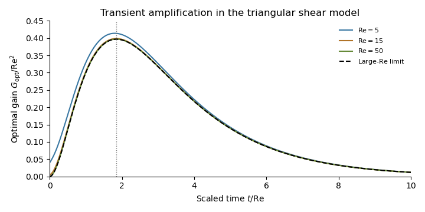

<h1 id="4/b/v/solution">Solution</h1>

↑ **Parent:** [V](../v.md)

At the optimum, $d=q_*^{1/3}$ and the initial direction is $(1,\rho^+)$. Since the final direction has ratio $\rho^-$,

$$
G_{\max}=q_*^{2/3}\left(\frac{\rho^+}{\rho^-}\right)^2
\frac{1+(\rho^-)^2}{1+(\rho^+)^2}.
$$

Using $\rho^\pm=2R(1\pm s)$, $R^2(1-s^2)=1$, and $q_*=(5-3s)/(5+3s)$ simplifies this to **the exact maximum gain**:

$$
\boxed{G_{\max}=\frac{1+s}{1-s}\left(\frac{5-3s}{5+3s}\right)^{5/3},\qquad s=\sqrt{1-R^{-2}},\quad R>1.}
$$

As $R\to\infty$, $s=1-1/(2R^2)+O(R^{-4})$, so $q_*\to1/4$ and $(1+s)/(1-s)\sim4R^2$. Consequently **the requested large-Reynolds-number transient growth scaling is**

$$
\boxed{T^*\sim\frac{4\log4}{3}R,\qquad
G_{\max}\sim4^{-2/3}R^2,\qquad
n=1,\ A=\frac{4\log4}{3},\ m=2,\ B=4^{-2/3}.}
$$

These are the [optimal time and gain of a Reynolds-scaled triangular model](../../../../../../../optimal-time-and-gain-of-a-reynolds-scaled-triangular-model.md). The leading gain can also be read from the off-diagonal [matrix exponential](../../../../../../../matrix-exponential.md) entry: with $\tau=t/R$, $b=(4R/3)(e^{-\tau/4}-e^{-\tau})$ is maximized at $\tau=4\log4/3$ and has leading maximum $R4^{-1/3}$.

**[Figure 2](#4/b/v/image-optimal-transient-energy-gain-scaled-by-reynolds-number-squared-approaching-its-large-reynolds-number-limit). Optimal transient energy gain scaled by Reynolds number squared, approaching its large-Reynolds-number limit**.

## ↑ Ancestors (12)

1. [V](../v.md)
2. [B](../../b.md)
3. [4](../../../4.md)
4. [Paper 331](../../../../paper-331-split.md)
5. [Iii](../../../../split.md)
6. [2016](../../../../../split.md)
7. [Past exam of the mathematics course of the University of Cambridge](../../../../../../split.md)
8. [Mathematics course of the University of Cambridge](../../../../../../../mathematics-course-of-the-university-of-cambridge.md)
9. [Course of the University of Cambridge](../../../../../../../course-of-the-university-of-cambridge.md)
10. [University of Cambridge](../../../../../../../university-of-cambridge-split.md)
11. [List of universities](../../../../../../../list-of-universities.md)
12. [Codex Wiki](../../../../../../../split.md)
