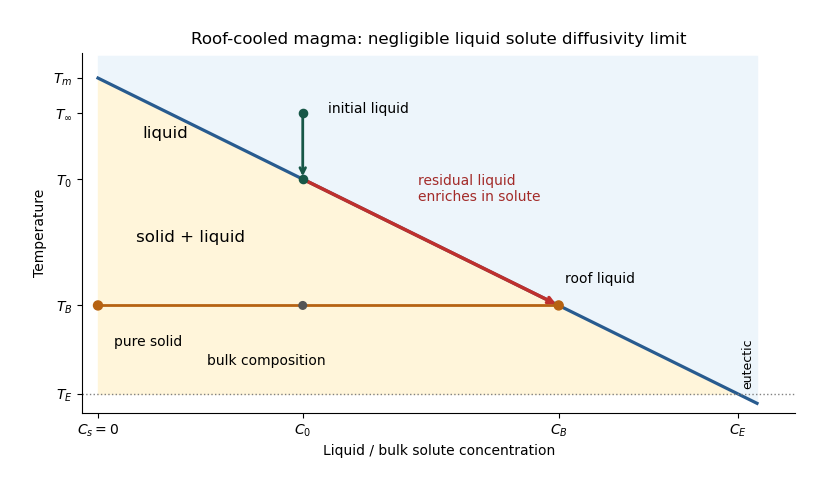

<h1 id="1/solution">Solution</h1>

↑ **Parent:** [1](../1.md)

Take $z$ positive downwards from the roof. Write $T_0=T_m-mC_0$, $C_B=(T_m-T_B)/m$, $\Delta T=T_0-T_B=m(C_B-C_0)>0$ and $\Delta C=C_B-C_0$. The cooled [magma](../../../../../magma.md) follows the decreasing [liquidus](../../../../../liquidus.md) from $(C_0,T_0)$ towards $(C_B,T_B)$; the initially superheated liquid starts at $(C_0,T_\infty)$ above that [liquidus](../../../../../liquidus.md). The solid has zero solute [concentration](../../../../../concentration.md). At each [temperature](../../../../../temperature.md) in the [mushy layer](../../../../../mushy-layer.md), a horizontal tie line joins the pure solid to the residual liquid on the [liquidus](../../../../../liquidus.md). The [lever rule](../../../../../lever-rule.md) gives the [liquid fraction](../../../../../liquid-fraction.md) from the bulk [concentration](../../../../../concentration.md). Since $T_B>T_E$, this path stops before the [eutectic temperature](../../../../../eutectic-temperature.md) and does not cross the [eutectic composition](../../../../../eutectic-composition.md).

**[Figure 1](#1/image-liquid-cooling-residual-liquid-enrichment-and-a-solid-liquid-tie-line-in-the-stagnant-magma-mush). Liquid cooling, residual-liquid enrichment and a solid–liquid tie line in the stagnant magma mush**.

The [porosity](../../../../../porosity.md) $\phi$ denotes the [liquid fraction](../../../../../liquid-fraction.md), so $1-\phi$ is the [solid fraction](../../../../../solid-fraction.md). Equal phase [mass densities](../../../../../density.md) remove volume-change flow; the stable [density stratification](../../../../../density-stratification.md) suppresses [convection](../../../../../convection.md). In the [stagnant mushy-layer model](../../../../../stagnant-mushy-layer-model.md), define bulk [specific enthalpy](../../../../../specific-enthalpy.md) and bulk solute [concentration](../../../../../concentration.md) by

$$
E=c_pT+L\phi,\qquad B=\phi C+(1-\phi)C_s=\phi C.
$$

The arbitrary reference of [specific enthalpy](../../../../../specific-enthalpy.md) has been omitted. The two conservation laws in $0<z<h(t)$ are

$$
\boxed{T_t+\frac L{c_p}\phi_t=\kappa T_{zz},\qquad (\phi C)_t=0,\qquad T=T_m-mC.}
$$

Here $\kappa=k_T/(\rho c_p)$ is the [thermal diffusivity](../../../../../thermal-diffusivity.md), with $k_T$ the [thermal conductivity](../../../../../thermal-conductivity.md). The positive $L\phi_t$ term records increased [specific enthalpy](../../../../../specific-enthalpy.md) on melting; during freezing it supplies [latent heat](../../../../../latent-heat.md). In the liquid $z>h(t)$, the [heat equation](../../../../../heat-equation.md) and solute [diffusion equation](../../../../../diffusion-equation-split.md) are

$$
T_t=\kappa T_{zz},\qquad C_t=D C_{zz},\qquad \phi=1,
$$

where $D$ is the [solutal diffusivity](../../../../../solutal-diffusivity.md). Neglecting solute [diffusion](../../../../../diffusion.md) inside the [mushy layer](../../../../../mushy-layer.md) does not permit dropping $D C_{zz}$ in the liquid at this stage.

Use $T(0,t)=T_B$, liquid $T\to T_\infty$ and $C\to C_0$ as $z\to\infty$, and initially $h=0$, $T=T_\infty$, $C=C_0$ for $z>0$. These are the half-space boundary conditions appropriate before cooling reaches the bottom of the chamber. For a closed chamber of finite depth $H$, replace the far-field conditions by the specified bottom conditions, for example $T_z=C_z=0$ at an insulated impermeable floor; the half-space [similarity solution](../../../../../similarity-solution.md) then ceases to apply when the thermal penetration depth approaches $H$.

At $z=h(t)$, let $C_i$ and $T_i=T_m-mC_i$ be the common liquid [concentration](../../../../../concentration.md) and [temperature](../../../../../temperature.md), and let $\phi_i$ be the limiting [porosity](../../../../../porosity.md) on the mush side. Continuity of $T,C$, the [Rankine-Hugoniot condition](../../../../../rankine-hugoniot-conditions.md) for solute, and the interfacial [conservation of energy](../../../../../conservation-of-energy.md) give

$$
-D C_z(h^+,t)=\dot h(1-\phi_i)C_i,\qquad
\kappa[T_z(h^-,t)-T_z(h^+,t)]=\frac L{c_p}\dot h(1-\phi_i).
$$

The first condition has the sign of solute rejection into the liquid. For the sharp-edge [stagnant mushy-layer model](../../../../../stagnant-mushy-layer-model.md) with nonzero liquid [solutal diffusivity](../../../../../solutal-diffusivity.md), close the free-boundary problem by [marginal equilibrium at a mush-liquid boundary](../../../../../marginal-equilibrium-at-a-mush-liquid-boundary.md):

$$
T_z(h^+,t)=-m C_z(h^+,t),\qquad T(z,t)\ge T_m-mC(z,t)\quad(z>h).
$$

This prevents [constitutional supercooling](../../../../../constitutional-supercooling.md) immediately ahead of the [mushy layer](../../../../../mushy-layer.md). A small [solid fraction](../../../../../solid-fraction.md) jump at its edge is allowed: imposing $\phi_i=1$ as well as these finite-$D$ conditions would generally overdetermine the reduced model. At the roof, $C=C_B$ follows from the [liquidus](../../../../../liquidus.md), and no additional solute-flux boundary condition is needed in the diffusion-free mush.

To obtain the large-[concentration](../../../../../concentration.md) [similarity solution](../../../../../similarity-solution.md), put

$$
\theta=\frac{T-T_0}{\Delta T},\quad \theta_\infty=\frac{T_\infty-T_0}{\Delta T}>0,\quad
\mathcal C=\frac{C_0}{\Delta C},\quad \mathcal S=\frac L{c_p\Delta T},\quad
r=\frac D\kappa,\quad \eta=\frac z{2\sqrt{\kappa t}},\quad h=2\lambda\sqrt{\kappa t}.
$$

The positive superheat specifies the physically intended liquid initial state. On a [similarity solution](../../../../../similarity-solution.md), $C_i,\phi_i$ are constant, so every newly incorporated level leaves the same constant $B=\phi_iC_i$. Write $C_i=C_0+\Delta C\,\delta$ and $B=\Delta C(\mathcal C+a)$. Then throughout the [mushy layer](../../../../../mushy-layer.md)

$$
C=C_0-\Delta C\,\theta,\qquad
\phi=\frac{\mathcal C+a}{\mathcal C-\theta},\qquad
\left[1+\mathcal S\frac{\mathcal C+a}{(\mathcal C-\theta)^2}\right]\theta_t=\kappa\theta_{zz}.
$$

For $a,\theta=O(1)$, $\mathcal C\gg1$, and $\mathcal S/\mathcal C=O(1)$, the effective [heat capacity](../../../../../heat-capacity.md) is constant to relative error $O(\mathcal C^{-1})$. Thus set

$$
\boxed{\Omega=\sqrt{1+\mathcal S/\mathcal C},\qquad \Omega^2\theta_t=\kappa\theta_{zz}.}
$$

Integration of the [similarity solution](../../../../../similarity-solution.md) [ordinary differential equation](../../../../../ordinary-differential-equation.md) gives the leading analytical profiles

$$
\boxed{\theta_m=-1+(1-\delta)\frac{\operatorname{erf}(\Omega\eta)}{\operatorname{erf}(\Omega\lambda)},\qquad
\theta_l=\theta_\infty-(\theta_\infty+\delta)\frac{\operatorname{erfc}\eta}{\operatorname{erfc}\lambda}.}
$$

The [temperature](../../../../../temperature.md) is $T=T_0+\Delta T\theta$. In the [mushy layer](../../../../../mushy-layer.md), the [concentration](../../../../../concentration.md) and [porosity](../../../../../porosity.md) are the displayed $C,\phi$; in the liquid,

$$
\boxed{C_l=C_0+\Delta C\,\delta\frac{\operatorname{erfc}(\eta/\sqrt r)}{\operatorname{erfc}(\lambda/\sqrt r)},\qquad \phi_l=1.}
$$

These retain the liquid solutal [boundary layer](../../../../../boundary-layer.md). For completeness, finite-$r$ values of $\delta,a,\lambda$ are determined analytically, to the same large-$\mathcal C$ order, by setting

$$
K(x)=\frac{e^{-x^2}}{\operatorname{erfc}x},\quad
A_r=\frac{\sqrt r K(\lambda/\sqrt r)}{\sqrt\pi\lambda},\quad
\delta=\frac{\theta_\infty K(\lambda)}{K(\lambda/\sqrt r)/\sqrt r-K(\lambda)},\quad
b=\delta A_r,\quad a=\delta-b,
$$

and solving

$$
(1-\delta)\frac{\Omega e^{-\Omega^2\lambda^2}}{\operatorname{erf}(\Omega\lambda)}
-(\theta_\infty+\delta)K(\lambda)
=\sqrt\pi\frac{\mathcal S}{\mathcal C}\lambda b.
$$

The solute jump gives $\phi_i=1-b/(\mathcal C+\delta)$ exactly; replacing $\mathcal C$ by $\mathcal C+\delta$ on the right of the last equation retains that jump's next-order factor, but does not make the linearized thermal profiles exact at finite $\mathcal C$. The branch has $0\le\delta<1$, $0<\phi\le1$. All these profiles are leading asymptotic expressions, not exact solutions of the nonlinear finite-$\mathcal C$ [heat equation](../../../../../heat-equation.md).

For $r\to0$ at fixed positive $\lambda$, the [complementary error function](../../../../../complementary-error-function.md) asymptotic gives $K(\lambda/\sqrt r)\sim\sqrt\pi\lambda/\sqrt r$, hence $\delta=O(r)$, $b=O(r)$, $a\to0$, and $\phi_i\to1$. The result simplifies to

$$
\boxed{\begin{gathered}
\theta_m=-1+\frac{\operatorname{erf}(\Omega\eta)}{\operatorname{erf}(\Omega\lambda)},\qquad
\theta_l=\theta_\infty\left(1-\frac{\operatorname{erfc}\eta}{\operatorname{erfc}\lambda}\right),\\
C_m=C_0-\Delta C\theta_m,\quad \phi_m=\frac{\mathcal C}{\mathcal C-\theta_m},\quad C_l=C_0,\quad h(t)=2\lambda\sqrt{\kappa t}.
\end{gathered}}
$$

In particular, $\phi(0,t)=C_0/C_B=\mathcal C/(\mathcal C+1)$ and $\phi(h^-,t)=1$. There is no finite interfacial [latent heat](../../../../../latent-heat.md) jump in this limit: the [latent heat](../../../../../latent-heat.md) is released continuously throughout the [mushy layer](../../../../../mushy-layer.md). Matching the two [temperature gradients](../../../../../temperature-gradient.md) gives

$$
\frac{\Omega e^{-\Omega^2\lambda^2}}{\operatorname{erf}(\Omega\lambda)}=
\frac{\theta_\infty e^{-\lambda^2}}{\operatorname{erfc}\lambda},\qquad
\boxed{\Omega e^{\lambda^2}\operatorname{erfc}\lambda
=\theta_\infty e^{\Omega^2\lambda^2}\operatorname{erf}(\Omega\lambda).}
$$

The printed final equation is missing the square on $\Omega$ in the exponential. The corrected exponent follows directly from differentiating $\operatorname{erf}(\Omega\eta)$ and is consistent with $\Omega^2=1+\mathcal S/\mathcal C$. The positive root is unique: the mush-side gradient decreases from infinity to zero with $\lambda$, whereas $\theta_\infty K(\lambda)$ increases. The zero-superheat limit is singular and is not described by a finite positive $\lambda$ in this two-region construction.

## ↑ Ancestors (10)

1. [1](../1.md)
2. [Paper 332](../../paper-332-split.md)
3. [Iii](../../split.md)
4. [2016](../../../split.md)
5. [Past exam of the mathematics course of the University of Cambridge](../../../../split.md)
6. [Mathematics course of the University of Cambridge](../../../../../mathematics-course-of-the-university-of-cambridge.md)
7. [Course of the University of Cambridge](../../../../../course-of-the-university-of-cambridge.md)
8. [University of Cambridge](../../../../../university-of-cambridge-split.md)
9. [List of universities](../../../../../list-of-universities.md)
10. [Codex Wiki](../../../../../split.md)
